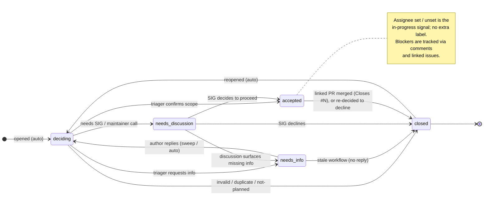

# Issue Triage

This document describes how issues are triaged in the OpenTelemetry Arrow
(otel-arrow) project. It complements
[CONTRIBUTING.md](./CONTRIBUTING.md) and follows the conventions
established by the broader OpenTelemetry community and the OpenTelemetry
Collector projects.

Pull request review and merge conventions are covered in
[CONTRIBUTING.md](./CONTRIBUTING.md) and are intentionally out of scope
here; this document is focused on the issue backlog. Release planning,
detailed security response (see [SECURITY.md](./SECURITY.md)), and project
board conventions are also out of scope.

The goals of this process are:

1. Give every issue a predictable, transparent path from "filed" to
   "actioned or closed."
2. Make triage primarily an asynchronous activity so that the weekly SIG
   meeting can focus on discussion, design, and unblocking work rather than
   walking the backlog item by item.
3. Establish a shared vocabulary (labels, states) so contributors
   know what to expect and where to help.
4. Make ownership and next-steps explicit without overloading the small set of
   maintainers and approvers.

## Roles in Triage

The OpenTelemetry membership ladder is defined in the
[community membership guide](https://github.com/open-telemetry/community/blob/main/guides/contributor/membership.md).
This section describes how those roles map to triage activities in this
repository.

### Triagers

Triagers are listed in [CONTRIBUTING.md](./CONTRIBUTING.md#triagers). They are
the primary owners of the triage process and are expected to:

- Process the `triage:deciding` queue on a regular cadence (see
  [Cadence](#cadence)).
- Apply the appropriate component labels per
  [Label Taxonomy](#label-taxonomy), and set the project's Type and
  Priority fields where they apply.
- Ask clarifying questions, request reproductions, or close out-of-scope
  reports.
- Identify items that need maintainer or approver judgment and escalate them
  via the `triage:needs-discussion` label.
- Curate the agenda for the live triage segment of the SIG meeting (see
  [SIG Meeting Triage](#sig-meeting-triage)).

Triagers do not need merge rights. New triagers are nominated by a maintainer
after roughly one month of consistent triage participation, [per the community
guide](https://github.com/open-telemetry/community/blob/main/guides/contributor/membership.md#becoming-a-triager).

### Approvers and Maintainers

Approvers and maintainers are listed in [CONTRIBUTING.md](./CONTRIBUTING.md).
In triage they:

- Make final accept/reject decisions on enhancement and proposal
  issues.
- Set or adjust the Priority field when an issue is release-impacting.
- Sponsor work on new components, large features, or breaking changes.
- Step in as a tie-breaker on disputed labels or scope.

### Contributors

Anyone can help triage, but only Triagers and above can apply labels,
assign issues, or close them on someone else's behalf (see
[GitHub Permissions](#github-permissions) below). What everyone can do:

- Reproduce reported bugs and leave findings in a comment.
- Suggest labels in a comment; a triager will apply them.
- Volunteer to work on an unassigned issue by commenting "I'd like to take
  this" and a triager will assign you. (A future slash-command bot will
  let contributors self-assign without a triager round-trip.)
- Resolve an issue by opening a PR whose description uses "Closes #N";
  the issue closes automatically when the PR merges, regardless of its
  current status label.

### GitHub Permissions

GitHub's repository permission levels determine who can perform which
triage actions. This is why most of the labeling, assigning, and closing
in this document is restricted to Triagers and above - it is a GitHub
constraint.

| Action                                | Required GitHub role |
|---------------------------------------|----------------------|
| Open an issue                         | Read (anyone)        |
| Comment on issues                     | Read (anyone)        |
| Reproduce a bug, suggest a label      | Read (anyone)        |
| Apply / remove labels                 | Triage               |
| Assign issues                         | Triage               |
| Close / reopen issues opened by others| Triage               |
| Mark duplicates, transfer issues      | Triage               |
| Change repository settings, secrets   | Admin (Maintainer)   |

The full GitHub reference is
[Repository roles for an organization](https://docs.github.com/en/organizations/managing-user-access-to-your-organizations-repositories/managing-repository-roles/repository-roles-for-an-organization).

Two practical implications:

1. **Contributors cannot drive their own issues through the status
   transitions in [Issue Lifecycle](#issue-lifecycle).** They depend on
   a triager to apply triage labels and to set the project's Type and
   Priority fields. The async-first triage workflow is designed around
   this: a triager picks up `triage:deciding` items and does the
   labeling on the contributor's behalf.
2. **A slash-command bot (future work) can grant the *effect* of those
   permissions to contributors without granting the role itself.** A bot
   running with Triage permissions can read a `/assign` comment and
   perform the action on behalf of the author. This is the standard
   pattern in Kubernetes (Prow) and many CNCF projects, and is listed in
   [Open Items](#open-items-for-implementation).

## Issue Lifecycle

Issues move through a single chain of `triage:*` states owned by
triagers. An issue has exactly one `triage:*` label at a time, from
`triage:deciding` (new) through `triage:accepted` (cleared to work on),
and there is no separate "in-progress" label - an assigned
`triage:accepted` issue is in flight.

There is no `blocked` label. If an issue cannot proceed, leave a
comment explaining the blocker and, where possible, link the upstream
issue or PR with GitHub's `Blocked by` reference (or just write
`Blocked on issue #N` in prose). The link surfaces in the issue thread
and creates a back-reference on the blocker. The issue stays in its
current `triage:*` state.

Changing a `triage:*` label requires the Triage permission or higher
(see [GitHub Permissions](#github-permissions)) - contributors cannot
move their own issues between states.

The complete state diagram (rendered by GitHub from Mermaid source):

### Label definitions

Triage states (one at a time):

- `triage:deciding` - new or reopened, awaiting triager review. This is
  the label applied automatically by
  [`issue_triage.yml`](./.github/workflows/issue_triage.yml) today.
- `triage:needs-info` - waiting on the author for reproduction, versions,
  logs, or clarification. Stale workflow closes after the grace period if
  no response.
- `triage:needs-discussion` - needs a maintainer or SIG decision.
  Surfaces on the SIG meeting agenda.
- `triage:accepted` - triaged, scoped, ready for someone to pick up or
  already in flight (distinguished by whether an assignee is set).
  Eligible for `help wanted` and `good first issue`.

There is no separate in-progress label. A `triage:accepted` issue with
an assignee is in flight; without an assignee it is waiting for a
volunteer. Use the assignee field as the source of truth.

There is no `blocked` label. Blockers are tracked via a comment on the
issue plus a link to the blocking issue or PR (see
[Issue Lifecycle](#issue-lifecycle)).

### Notes on specific transitions

- **`triage:needs-info` -> `triage:deciding` requires a triager (or
  automation).** The author of the issue does not have permission to
  change labels. Today this relies on a triager sweep of the
  `triage:needs-info` queue; the proposed auto-flip workflow (see
  [Automation Candidates](#automation-candidates)) would do it
  automatically when the original author comments.

### Automation candidates

A few transitions are mechanical reflections of other GitHub state
(author comment, reopen). These are good targets for workflows so that
triagers only intervene when judgment is needed. Tracked in
[Open Items](#open-items-for-implementation):

| Transition | Trigger |
| --- | --- |
| (new / reopened) -> `triage:deciding` | Already implemented in [`issue_triage.yml`](./.github/workflows/issue_triage.yml). |
| `triage:needs-info` -> `triage:deciding` | Workflow on `issue_comment.created`: if commenter is the issue author and `triage:needs-info` is set, swap labels. |
| Stale `triage:needs-info` | Handled by the stale workflow per [Stale Policy](#stale-policy). |

None of these workflows make irreversible changes - they only adjust
labels - so the cost of getting one wrong is low. A triager can always
override.

## Label Taxonomy

Labels are grouped by prefix so they are easy to scan and filter. Only
the `triage:*` prefix is considered the canonical "triage state" label
set; other labels (component, release notes, etc.) may coexist.

Issue **Type** (`Bug`, `Feature`, `Task`, ...) and **Priority**
(`Urgent`/`High`/`Medium`/`Low`) are tracked as GitHub issue fields.
Triagers should set them as part of the triager pass.

### Component labels

Issues should also carry one or more labels identifying which part of
the repo they affect. The repository uses the flat set of labels
applied by [`.github/labeler.yml`](./.github/labeler.yml) on PRs
(`rust`, `go`, `ci-repo`, `query-engine`, `query-engine-columnar`,
`query-engine-recordset`, `query-engine-kql`, `query-engine-ottl`,
`opl-parser`). Triagers reuse these on issues when applicable. Other
existing labels (e.g. `dependencies`) may also apply.

A future migration to an `area:*` prefix (and expanded coverage of
`proto/`, `tools/`, `docs/`, etc.) can be revisited if the flat set
becomes hard to manage.

### Priority

This repository uses GitHub's built-in **Priority** field
(`Urgent`/`High`/`Medium`/`Low`) rather than a `priority:*` label.
Triagers set the field when an issue is release-impacting or clearly
urgent; otherwise it is left unset. Anything `Urgent` should also be:

- posted in the `#otel-arrow-dev` channel on the
  [CNCF Slack](https://cloud-native.slack.com/), with a link to the
  issue, so approvers see it promptly,
- tagged `@open-telemetry/arrow-approvers` on the issue, and
- added to the next SIG meeting agenda.

### Contributor-facing labels

- `good first issue` - well-scoped, mentored, suitable for first-time
  contributors. Must include enough detail in the description to start work
  without further clarification.
- `help wanted` - accepted, scoped, and not currently assigned; community
  contributions are explicitly welcome.

### Lifecycle labels

- `stale` - applied automatically by the stale workflow (see
  [Stale Policy](#stale-policy)).
- `do-not-stale` - exempt from the stale workflow. Use sparingly.
- `security` - applied to issues filed via the security process. Exempt from
  stale.

## Ownership and Assignment

A frequent source of confusion: in this project (and in most OSS projects,
including the OpenTelemetry Collector, Kubernetes, and other CNCF projects),
the GitHub "assignee" field means *"this person is actively working on this
right now"*, not *"this person owns this area of code."* As a result, most
new issues have **no assignee**, and that is intentional.

Ownership is expressed in two places instead:

1. **Code ownership** is captured in [`CODEOWNERS`](./CODEOWNERS). Today
   that file routes all paths to `@open-telemetry/arrow-approvers`;
   expanding it with path-based routing for the major components is
   tracked in [Open Items](#open-items-for-implementation). Even once
   expanded, CODEOWNERS governs PR review routing, not issue routing.
2. **Issue routing** is captured via the component labels described in
   [Component labels](#component-labels). Subject-matter experts
   subscribe to or filter on the labels they care about. There is no
   expectation that a triager will hand-pick an owner for every issue.

### When to assign

Assignees are set only on issues in `triage:accepted` - not while the
issue is still in another `triage:*` state. Cases:

- A contributor has volunteered to work on it. Until the slash-command
  bot is in place, this means the contributor comments and a triager
  sets the assignee (contributors do not have permission to set
  assignees themselves; see [GitHub Permissions](#github-permissions)).
- A maintainer has asked a specific person to drive it and that person has
  agreed.
- It is an `Urgent` priority and the assigned Contributor has agreed to
  own the issue resolution with urgency.

If no one is working on it, leave it unassigned and rely on the
`triage:*`, component, and `help wanted` labels to attract a
contributor. Assigning an issue "just so it has an owner" obscures real
progress and is discouraged.

### Finding work as a contributor

Useful filters (links open the search in GitHub):

- All triaged, unassigned work:
  [`is:issue is:open label:triage:accepted no:assignee`](https://github.com/open-telemetry/otel-arrow/issues?q=is%3Aissue+is%3Aopen+label%3Atriage%3Aaccepted+no%3Aassignee)
- In-flight work:
  [`is:issue is:open label:triage:accepted assignee:*`](https://github.com/open-telemetry/otel-arrow/issues?q=is%3Aissue+is%3Aopen+label%3Atriage%3Aaccepted+assignee%3A*)
- Beginner-friendly:
  [`is:issue is:open label:"good first issue" no:assignee`](https://github.com/open-telemetry/otel-arrow/issues?q=is%3Aissue+is%3Aopen+label%3A%22good+first+issue%22+no%3Aassignee)
- Work in your area: combine the above with the relevant component
  label, e.g. `label:rust` or `label:query-engine`.

## Cadence

Triagers aim for a first response on `triage:deciding` items within
roughly one business week, and same-day attention for issues whose
Priority is `Urgent`. These are guidelines for a healthy queue, not
commitments - if either consistently slips, that is a signal the triage
rotation needs more volunteers rather than a reason to feel bad.

## Async-First Triage Workflow

The bulk of triage happens asynchronously on GitHub, not in the SIG meeting.
This is what unblocks meeting time for design work.

1. **Intake (automated).** The
   [`issue_triage.yml`](./.github/workflows/issue_triage.yml) workflow tags
   every new or reopened issue with `triage:deciding`.
2. **Triager pass (async).** A triager opens the `triage:deciding` query
   and, for each item:
   - sets the Type and (if release-impacting) Priority fields and
     applies component labels,
   - asks for missing information if needed and applies
     `triage:needs-info`, or
   - moves the issue to `triage:accepted`, or
   - closes as `invalid`, `duplicate`, `wontfix`, or `not-planned` with a
     short explanation.
3. **Escalation (async).** Items that need maintainer judgment get
   `triage:needs-discussion` and are added to the SIG meeting agenda. The
   triager should pre-summarize the question so the meeting can decide
   quickly.
4. **Follow-through.** Triagers periodically sweep `triage:needs-info`
   and assigned `triage:accepted` queues to keep them honest (close
   stale `triage:needs-info`, check in on long-quiet assignees).

Triagers self-organize on how to share the load. A formal weekly rotation
can be introduced later if the queue becomes unmanageable, but is not
required up front.

## SIG Meeting Triage

To keep the weekly SIG meeting focused, live triage is **time-boxed and
agenda-driven**.

- Live triage segment: target 15 minutes.
- Agenda: only items labeled `triage:needs-discussion`, plus any new
  `Urgent` priority items opened since the last meeting.
- A triager drives the segment and captures decisions back into
  labels and a brief closing comment on each item, so the author can see
  the SIG's reasoning.
- Items not reached are deferred to the next meeting; they do not block
  closure of the segment.
- If `triage:needs-discussion` is empty, skip the segment.

Anything that can be decided by a triager async should be decided
async, not in the meeting.

## Stale Policy

The current stale workflow lives at
[`.github/workflows/stale.yml`](./.github/workflows/stale.yml) and runs
daily. It covers both issues and pull requests, but only the issue
behavior is in scope for this document:

- Issues: marked `stale` after 180 days of inactivity, closed 30 days
  later.
- The only exempt label today is `do-not-stale`.

Proposed target policy for issues (tracked in
[Open Items](#open-items-for-implementation)):

- Tighten the issue cycle to 60 days to stale + 14 days to close.
- Add a shorter 14 + 14 cycle for `triage:needs-info` so the queue does
  not accumulate questions the author never returned to.
- Expand the exempt-label list to: `security`,
  `triage:accepted`, `help wanted`, `good first issue`, and the
  existing `do-not-stale`.

Anyone may reopen a closed-stale issue with new information; reopening
resets the stale timer.

## Security Issues

Security vulnerabilities **must not** be filed as public issues. Follow
[SECURITY.md](./SECURITY.md) to report privately. Security-labeled issues
that are filed publicly will be redirected to the private process and
locked.

## Becoming a Triager

Help out: suggest labels in comments, reproduce bugs, point duplicates at
the canonical issue, and ask clarifying questions. After about a month of
consistent participation, ask a maintainer to nominate you per the
[community membership guide](https://github.com/open-telemetry/community/blob/main/guides/contributor/membership.md#triager).
Triagers are added to [CONTRIBUTING.md](./CONTRIBUTING.md#triagers) and
granted the GitHub "Triage" role on the repository.

## Open Items for Implementation

This document describes the target process. The following follow-up issues
should be filed to fully realize it (sequencing left to the SIG):

- Introduce the new labels: `triage:needs-info` and
  `triage:needs-discussion`. `triage:deciding` and `triage:accepted`
  already exist on the repo.
- Update [`.github/workflows/issue_triage.yml`](./.github/workflows/issue_triage.yml)
  and the issue templates (`bug_report.yaml`, `feature_request.yaml`,
  `task.yaml`, `other.yaml`) to apply the new labels.
- Tighten [`.github/workflows/stale.yml`](./.github/workflows/stale.yml) to
  the target cadence (60 + 14 for issues, 14 + 14 for
  `triage:needs-info`) and expand the exempt-label list as described in
  [Stale Policy](#stale-policy).
- Expand [`CODEOWNERS`](./CODEOWNERS) with path-based routing for the
  major components (currently a single catch-all entry).
- Add slash-command handlers (`/assign`, `/label`, `/needs-info`,
  `/accepted`, etc.) so contributors and triagers can drive the
  lifecycle without manual label edits.
- Implement the automation workflows listed in
  [Automation Candidates](#automation-candidates):
  `needs-info` -> `deciding` driven by author comments.
- Add a GitHub Project board with columns mirroring the `triage:*`
  labels to give triagers a visual queue.
- Add a weekly triage-report workflow that posts queue health metrics to
  a pinned issue or the SIG meeting notes.
