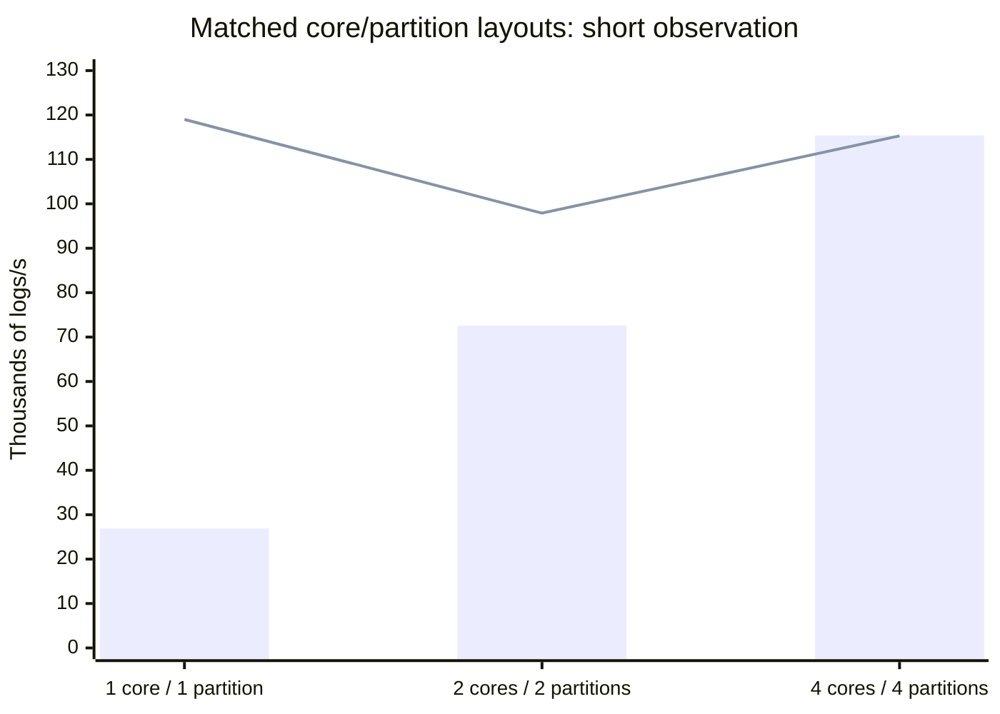
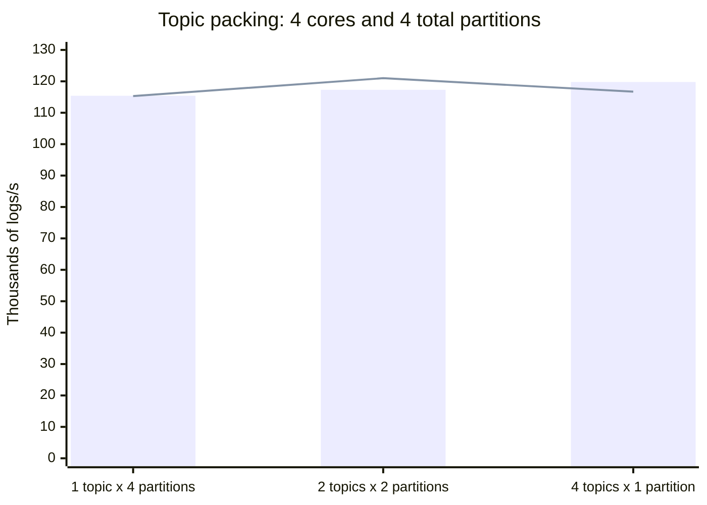

# Kafka Syslog receiver-only benchmark: methodology and results

## Purpose and measured path

This layer-1 benchmark measures the existing DFE Kafka receiver's raw Syslog
ingestion path without downstream batch assembly, network export, or a backend:

```text
Python/librdkafka generator
  -> Kafka [one uncompressed 1024-byte RFC 5424 value per record]
  -> kafka-consumer container
       Kafka receiver [read + Syslog decode + Arrow construction]
       -> local Perf sink [count and consume logs]
```

The consumer pipeline contains only `receiver -> perf`. The local Perf sink is
not an OTLP or OTAP wire format. No batch processor, OTLP/OTAP network exporter,
or backend container is deployed. This measures receiver-path throughput,
including internal handoff, counting, and runtime overhead, not isolated parser
speed or real-backend ingestion capacity.

The workflow reuses the comparison dashboard wrapper, existing pipeline
performance orchestrator, Docker deployment, Prometheus/container monitoring,
and SQL reporting. It does not change the Rust receiver.

## Benchmark method

Each target uses a fresh three-container deployment, one Kafka topic and one
partition, one producer thread, and one consumer pipeline core. Runs are
sequential; the recorded procedure did not intentionally overlap another
benchmark or image build.

The producer starts before a 10-second warmup. Monitoring then records a
20-second observation window. The producer is stopped and flushed, followed by
a 10-second bounded drain. Final counters are captured **before consumer
shutdown**, while its admin endpoint is still available; shutdown has a
15-second timeout.

The verifier requires usable, monotonic successful local Perf **item** counters,
broker-confirmed producer progress, a sampled 1024-byte Kafka value, and no
reported producer or observed receiver failure counters. Message counters
cannot substitute for log item counters. These overload cases record final
producer-minus-Perf counts; they do not require full delivery within the
bounded drain.

`policies.telemetry.runtime_metrics: normal` and Perf's
`policies.telemetry.item_counts: true` are explicit. The archived methodology
records that the first attempted run, `20260930_233911`, lacked the root
runtime policy and exposed message counters but no successful item counters
in the retained engine image. It failed verification and is excluded from
these results. The corrected 100k rerun is `20260930_234913`; only that run and
the six successful targets in `20260930_235046` were checked for this summary.

## What the throughput and resource metrics mean

**Local Perf logs/s** is the observation-window increase in successful log
items received by the local sink divided by the sampled elapsed time. The
report selects `node.input`, `signal=logs`, `outcome=success`, node `perf`,
pipeline `main`, group `default`, core 1, in `kafka-consumer`.

**Actual input logs/s** counts broker-confirmed Kafka records, not attempted
enqueue calls or the configured target. Every record contains one Syslog log.
Targets are offered-load settings, not achieved throughput.

If quoted, **raw-input-equivalent MB/s** means
`local Perf logs/s * 1024 / 1,000,000`. It is not serialized Arrow, encoded
OTLP/OTAP, compressed network traffic, Kafka protocol bytes, or output
bandwidth.
There is no network-output byte-rate measurement in this test.

CPU and memory cover the **consumer container only**, not Python, Kafka, Docker,
or the entire host. CPU is normalized to one allocated pipeline core:
100% is approximately one core. Slightly higher samples can include container
helper threads and sampling effects. Pipeline core allocation and monitoring
normalization are not a Docker cgroup CPU limit. Memory is in MiB.

## Recorded results

All seven targets completed on 2026-09-30 / 2026-10-01 UTC. The successful 100k
case is run `20260930_234913`; the six remaining cases are run
`20260930_235046`. They used identical captured consumer configurations and
image IDs, with approximately 20-second observation windows. The archived
methodology records the same host for the sweep.

| Target logs/s | Actual input logs/s | Local Perf logs/s | Avg CPU % | Peak CPU % | Avg memory MiB | Peak memory MiB |
| --- | ---: | ---: | ---: | ---: | ---: | ---: |
| 100,000 | 70,753.7 | **39,715.7** | 99.60 | 101.71 | 210.88 | 214.56 |
| 200,000 | 93,771.9 | **34,254.0** | 100.19 | 101.43 | 236.98 | 248.12 |
| 300,000 | 112,383.0 | **31,982.6** | 99.58 | 100.73 | 218.11 | 228.29 |
| 400,000 | 125,486.4 | **29,748.0** | 99.58 | 100.93 | 223.72 | 238.74 |
| 600,000 | 141,998.6 | **36,999.4** | 99.48 | 100.56 | 216.29 | 227.48 |
| 800,000 | 140,295.9 | **33,803.8** | 99.87 | 101.19 | 206.55 | 220.59 |
| 1,000,000 | 143,545.0 | **35,588.1** | 100.49 | 101.11 | 200.61 | 213.18 |

The observed receiver-only range is **29.7k-39.7k logs/s**, with approximately
one core consumed at every target. The largest observed rate corresponds to
40.669 raw-input-equivalent MB/s, not encoded output MB/s.
Raising the target does not scale this one-core/one-partition path. The producer
also misses every configured target and levels off around 140k-144k actual
logs/s at the highest settings. Nevertheless, actual input exceeds local Perf
throughput in every case, and the observation snapshots show existing and
growing backlog.

This supports a CPU-limited receiver path in this configuration even after
removing batching and export. It does not identify Syslog grammar parsing alone
as the limiting function: decoding includes Arrow construction, allocation,
handoff, and other runtime work. The non-monotonic rates are single-run
observations, not a characterized scaling curve.

For historical context only, the archived notes cite earlier same-image
100k-target full-chain runs at 9,708.7 logs/s at the OTLP backend and
2,712.2 logs/s at the OTAP backend. Those historical runs were not reverified
as part of this bounded receiver-only evidence check. The local result is not
an end-to-end export improvement: it removes downstream work and changes the
measured endpoint.

### Final bounded-drain counts

| Target | Broker-confirmed logs | Local Perf logs before shutdown | Not observed by cutoff |
| --- | ---: | ---: | ---: |
| 100k | 2,143,900 | 1,397,233 | 746,667 |
| 200k | 2,828,765 | 1,279,012 | 1,549,753 |
| 300k | 3,438,700 | 1,190,331 | 2,248,369 |
| 400k | 3,910,665 | 1,132,952 | 2,777,713 |
| 600k | 4,254,900 | 1,334,188 | 2,920,712 |
| 800k | 4,269,100 | 1,275,352 | 2,993,748 |
| 1M | 4,282,100 | 1,301,907 | 2,980,193 |

No producer failed/enqueue/delivery/flush-timeout counters were nonzero in the
captured snapshots; final producer pending counts were zero. These statements
do not mean the consumer fully drained: every case retained a cutoff deficit.
Dedicated decode-error series were absent in all 21 snapshots and are
**unavailable, not assumed to be zero**.

The archived run notes report successful consumer shutdown but also monitoring
teardown errors after shutdown began, including admin connection errors and
missing Docker `system_cpu_usage`. Those teardown logs were outside the bounded
test-directory verification for this summary. Teardown time is outside the
observation window and the final-counter cutoff.

## Workload configuration

| Setting | Receiver-only profile |
| --- | --- |
| Targets, logs/s | 100k, 200k, 300k, 400k, 600k, 800k, 1M |
| Kafka value | Exactly 1024 UTF-8 bytes, RFC 5424, plain non-CEF message |
| Kafka compression | None |
| Topic / partitions / replication | `otel-syslog` / 1 / 1 |
| Producer threads / scheduling batch | 1 / 100 records |
| Consumer group | `kafka-syslog-benchmark` |
| Consumer encoding | `syslog` |
| Pipeline allocation | One engine core, index 1 |
| Offset reset / commit | Earliest / automatic, 1000ms |
| Fetch minimum / maximum | 1 byte / 1 MiB |
| Maximum partition fetch / wait | 1 MiB / 500ms |
| Warmup / observation / producer-off drain | 10s / 20s / 10s |
| Shutdown timeout | 15s |
| Downstream | Local Perf, no batch or network export |

## Reproduce the workflow from the feature branch

### Host, Python, Docker, and images

Use Linux, or Windows with WSL2 and Docker Desktop's Linux-engine WSL
integration. Keep the checkout inside the native WSL filesystem, not `/mnt/c`.
The orchestrator uses POSIX commands and Linux bind mounts. Use Python 3.11+,
Git, `curl`, coreutils, and Docker BuildKit with named build-context support.
The Docker engine needs at least two logical CPUs for core index 1; provide
additional CPU and memory for Kafka and the generator.

The archived methodology describes the measured host as Ubuntu 24.04.4 under
WSL2 `5.15.167.4-microsoft-standard-WSL2`, Python 3.12, and Docker Desktop Linux
engine 29.8.1. It exposed 16 logical / 8 physical cores of an AMD EPYC 7763
and approximately 31 GiB of RAM. This host description is recorded context,
not a fresh host inspection.

Use the `sochen0714-syslog-receiver-draft` branch in the
`sochen0714/otel-arrow` fork, not an upstream `main` checkout lacking this
suite.
The commands below run in Linux/WSL and build current-source images. They
reproduce the workflow, **not the historical binaries or measured numbers**.

```bash
sudo apt-get update
sudo apt-get install -y git python3 python3-venv curl coreutils

git clone --recurse-submodules --branch sochen0714-syslog-receiver-draft \
  https://github.com/sochen0714/otel-arrow.git
cd otel-arrow
git rev-parse HEAD
test -f tools/comparison_dashboard/suites/dfe/dfe-logs-kafka-syslog-receiver-only.yaml
git submodule update --init --recursive

python3 --version
docker version
docker info --format '{{.OSType}} {{.NCPU}}'

python3 -m venv .venv
source .venv/bin/activate
python -m pip install \
  -r tools/comparison_dashboard/requirements.txt \
  -r tools/pipeline_perf_test/orchestrator/requirements.txt
python -m pip check

docker pull apache/kafka:latest
(
  cd rust/otap-dataflow
  docker build --build-arg FEATURES=kafka \
    --build-context otel-arrow=../../ -f Dockerfile -t df_engine:latest .
)
docker build -t load_generator:kafka-syslog \
  tools/pipeline_perf_test/load_generator
docker run --rm df_engine:latest -h | grep 'urn:otel:receiver:kafka'
```

The producer image installs its hash-locked dependencies, including
`confluent-kafka`; the orchestration venv does not need that producer package.
An [offline wheelhouse build][loadgen-readme] is available when Docker cannot
access the package index. Do not disable TLS verification to work around
package-index access problems.

For repeat comparisons, reuse the same images and record their IDs and checkout
revision. The historical measurements reused existing images without rebuilding
them. Do not overwrite retained image tags if exact binary reuse is needed.

Recorded image identities:

| Image | Docker image ID |
| --- | --- |
| `df_engine:latest` | `sha256:be3432dd08060d6eb15299066f4993f7824a33b8f570b33491f58be7ca95af4d` |
| `load_generator:kafka-syslog` | `sha256:92ed2053f3f0c366fdd0e0210b081cd0930ab9a32946c7c197420e90e1c8f9a1` |
| `apache/kafka:latest` | `sha256:77e3df9054047a88b520d0cc46e16696d3b22022e1d580aeccd2632df6532837` |

The retained engine reports v0.55.0; its exact build-source commit is
**unknown**. The historical checkout HEAD was
`3a0cd13a4a3b9aaabeb819963b5089082baec434`. That SHA identifies the checkout
base, not the complete benchmark additions or the image's build commit.
Docker image IDs identify the locally used images, not necessarily pullable
registry digests. Save/pin those images when exact binary reuse is required.

### Exact suite and containers

From the repository root with the venv active, run the
[receiver-only suite][receiver-suite]:

```bash
cd tools/comparison_dashboard
python dashboard.py validate
python -u dashboard.py run \
  suites/dfe/dfe-logs-kafka-syslog-receiver-only.yaml \
  --tests 100k,200k,300k,400k,600k,800k,1000k \
  --observation-interval 20
```

Do not use `--clean` when retaining earlier raw and published results. The
wrapper renders the suite and invokes the existing orchestrator; it is not a
separate hand-written benchmark driver. The recorded sweep used one successful
100k invocation followed by a second invocation for the six remaining targets.

Network: `kafka-syslog-benchmark`. The three host ports are loopback-only:

| Container | Image | Host -> container port |
| --- | --- | --- |
| `load-generator` | `load_generator:kafka-syslog` | 18085 -> 5001, control/metrics |
| `kafka-broker` | `apache/kafka:latest` | 19094 -> 19094, external Kafka |
| `kafka-consumer` | `df_engine:latest` | 18088 -> 8080, admin/metrics |

Docker clients use `kafka-broker:9092`; the Kafka controller uses 9093.
There is **no backend container or remote data endpoint**.
The preflight also checks that the shared name `backend-service` is unused.
Do not overlap other Kafka benchmark runs: they share names and resources.
Normal completion removes its containers and ephemeral broker data. After
interruption, inspect ownership and logs before removing leftovers.

### Reports and evidence

Paths below are relative to `tools/comparison_dashboard`:

```text
.data/dfe_logs_kafka_syslog_receiver_only/<run-id>/
  orchestrator.yaml
  orchestrator.log
  run_env.json
  tests/<rate>/
    kafka-consumer-config.rendered.yaml
    images.txt
    kafka-record.txt
    producer-{observation-start,observation-stop,final}.prom
    consumer-{observation-start,observation-stop,final}.prom
    capture-{observation-start,observation-stop,final}.json
    verified-delivery.json
    sql_report-*.json
    timeseries.json

.site/data/suite/dfe_logs_kafka_syslog_receiver_only/
  run_env.json
  suite.yaml
  <rate>/
    metrics.json
    timeseries.json
    kafka-consumer-config.rendered.yaml

.site/compare/kafka_receiver_syslog_receiver_only/index.html
```

Read `verified-delivery.json` for final pre-shutdown counts and timing, the SQL
report for observation-window rates, and `images.txt` for actual running image
IDs. The report rates use monitored SQL sample spans; they need not exactly
equal explicit start/stop snapshot deltas divided by wall-clock time.
Preserve timestamped raw directories: published per-rate dashboard results
represent the latest run, not the full history. The paths above are the current
dashboard defaults. From `tools/comparison_dashboard`, build and serve with:

```bash
python dashboard.py build \
  --site-root .site --data-dir .site/data --compare-dir .site/compare
python dashboard.py serve --site-root .site --port 3000
```

Open <http://localhost:3000/compare/kafka_receiver_syslog_receiver_only/>.
The page uses locally published results; this checkout does not include the
historical raw measurements. See the
[comparison dashboard README][dashboard-readme] for more details.

### Verification and provenance of these recorded results

This summary was adapted from an immutable post-sweep snapshot. Its companion
aggregate, `.data/receiver-only-summary-20261001.json`, records the seven
source-report paths, metrics, snapshots, image IDs, and SHA-256 hashes of the
SQL reports and verification files. The aggregate is an index of evidence,
not a replacement for it; neither it nor the raw run data is checked in here.

Before evidence inspection, bounded working copies were made of the 15 files
in each of the seven permitted test directories, plus the two snapshot files.
SHA-256 hashes matched before copying, in the copies, and after copying; source
HEAD remained `3a0cd13a4a3b9aaabeb819963b5089082baec434`. No source files were
written, images changed, or benchmarks rerun for this summary.

The check matched all seven SQL reports and `verified-delivery.json` hashes
against the aggregate. It also checked all 21 raw producer/consumer snapshots,
successful Perf item selectors, monotonic counters, byte/count ratios,
producer failures and final pending counts, capture ordering and recorded
pre-shutdown timing, identical image/configuration identities, v0.55.0
telemetry, and CPU/memory averages and peaks against the retained time series.
Each sampled Kafka value was 1024 bytes, plus a newline added by the sampling
output.
The absent decode-error series were checked as unavailable, not as zero.

This bounded check did not inspect the failed initial run, historical backend
runs, or run-level orchestrator logs. Statements from those sources are
explicitly identified as archived context above.

The raw evidence root is `.data/dfe_logs_kafka_syslog_receiver_only/`.
Use `20260930_234913/tests/100k/` for 100k, and
`20260930_235046/tests/<rate>/` for the other six targets. Report filenames use
`sql_report-dfe_kafka_syslog_receiver_local_perf_<rate>-<timestamp>.json`:

| Target | Report timestamp | SQL report SHA-256 | `verified-delivery.json` SHA-256 |
| --- | --- | --- | --- |
| 100k | `20260930_235020` | `bfda748605146e6f208b4fffcd3b317f4ad7e5490acc708d5c3c6243d0ff457b` | `1a71d5fe402c8cc11278d3eee33a2b26f10233896d3c1d3482520a27f97e31b2` |
| 200k | `20260930_235402` | `c70c1145df8c53b4be48ae29e62b06d91cfe12a1c776bf6b6deb727eb7104ea8` | `fa88574e3ad088c2ee22cd24f6a9655116bb6b25155c75e00ea91e32206f9349` |
| 300k | `20260930_235514` | `df05dbdac5fb7392a0f2d5b06aac84a30ae0b6d6b77c60877f773ccbac3fcae2` | `067f4b46df917c4052ed5df5a980ed016fe1857589e0acf2847c3fd9a603ea87` |
| 400k | `20260930_235832` | `f69ea8d1070755108e9fdfd426a82c4e412b9a0b7a5d090a7f299b4820700ed3` | `3e96e40b0ef490b663c9664a26fc78e1a15d96dd9895954effe40f8a0f4ee68a` |
| 600k | `20260930_235953` | `b0b00c262504c46b304c6140c636601baac7e5a4280079bc4bc310fe629abf80` | `8d75d56e77e19e566df821b32801829de30a493c471d52ca0543955dd54a022e` |
| 800k | `20261001_000115` | `7bc058624d9b6ccb96ae56bf91ec925f9f6716955c6ef3ed5db7216395a0138e` | `a68803257157bab11a12e6a3369e5b564f60cf7d8325baa39a3243eb866a8939` |
| 1000k | `20261001_000332` | `7ba23b99a46bb7e426039c167e4bdc989b3a6f74b3133921f187061d3fc989b5` | `9fd316203efd82a28d4cc16e67ff7704f92991b82d6f4ef43a90ec48129f07e4` |

## Historical sweep limits

These are single, short local overload samples, not repeated-run medians or
production certification. The target sweep does not establish a sustainable
1M logs/s capacity; actual producer and receiver rates must be read separately.

The final producer-minus-Perf deficit means records were **not observed at the
local sink by the bounded cutoff**. It is not proven receiver-side loss.
The broker is later destroyed, so remaining ephemeral data will not be delivered
by this experiment. Final counters exclude progress during shutdown; the
archived notes describe a different, post-shutdown cutoff for the earlier
network-output experiments.

Snapshots are sequential, not atomic. Their differences are a backlog proxy,
not an exact Kafka consumer-group lag measurement. `group_lag=0` is not used as
proof of drainage. Aggregate counters and one sampled Kafka value per target
do not establish full field fidelity, event identity, absence of duplicates,
or restart reliability.

No receiver-only CPU profile was collected. Removing batch/export stages
changes the work performed; historical CPU profiles cannot be reused as the
cost breakdown of this receiver-only pipeline. Profiling, repeated steady-state
runs and identity-based correctness checks remain separate experiments.
The short core/topic/partition characterization below is separate from this
historical overload sweep.

## October 7 short core/topic/partition characterization

**All 18 bounded runs completed. Fourteen have complete all-core item telemetry;
four single-partition controls are intentionally flagged with an unavailable
all-core aggregate.** Kafka group evidence showed exactly one assigned core in
those controls, while the other configured members were unassigned and emitted
no Perf item series. Their missing series were not replaced by zeros.

This is **not sustained-load, soak, repeated-run or stable-capacity evidence**.
It measures the same receiver -> local Perf endpoint, never a batcher, network
exporter or backend. The historical seven runs and their hashes above are
unchanged. No CPU profile or runtime performance optimization was added.

### Method and differences from the historical suite

The nine `(allocated cores, topics, partitions per topic)` cells were
`(1,1,1)`, `(2,1,1)`, `(4,1,1)`, `(1,1,2)`, `(1,1,4)`, `(2,1,2)`,
`(4,1,4)`, `(4,2,2)` and `(4,4,1)`. Each ran once at **100k and 300k aggregate
configured records/s**. The target was not multiplied by cores, topics or
partitions. Topic packing compared `1x4`, `2x2` and `4x1`: always four total
partitions and four allocated cores.

Each `coreN` pipeline was pinned to core index N and contained one Kafka receiver
and local Perf exporter. Unique `dfe-kafka-syslog-coreN` client IDs joined the
same consumer group. All 18 scaling runs explicitly used
`rebalance_strategy: round_robin`. The new 1-core/1-partition controls are
therefore **not bit-identical** to the historical default-assignor configuration.
Topic names were `otel-syslog-1` through `otel-syslog-4`.

The one-thread producer used deterministic topic-major round-robin routing over
all configured topic/partition pairs. A queue-full retry did not advance the
slot. Every broker-confirmed value was a raw, uncompressed 1024-byte RFC 5424
record, with one log per value. Final per-partition delivery counters summed to
the producer total and differed by at most one record. The producer image was
newly built from the committed implementation and current exact dependency
lock; it was not the historical producer binary.

Every run used 10s warmup, 20s observation, producer stop/flush, a bounded 10s
drain, live final metric captures, then shutdown. Kafka CLI member/offset scans
ran before observation-start and after the final live metric captures.
Consequently committed partition progress brackets observation **plus drain and
scan overhead**, not the precise 20s throughput window. Group membership and
assignments were unchanged at both captures; every configured partition showed
positive committed progress. This does not establish uninterrupted ownership
between captures or downstream acknowledgements.

Per-core successful item deltas were computed independently over aligned sample
spans before summing. Missing cores made the complete aggregate unavailable.
CPU is the consumer container's aggregate core-percent, with a second measure
divided by allocated cores; allocation is not a Docker CPU quota. RAM excludes
Kafka, the generator and the rest of the host. Per-pipeline queue capacities,
fetch and commit settings otherwise matched the baseline; total pipeline queue
capacity grows with the number of pipelines.

### Observed rates and resources

Rates below are **thousands of logs/s**, rounded to one decimal. `T x P` means
topics times partitions per topic. `CPU total / allocated` contains average
aggregate CPU-percent and that value divided by configured core count.
`RAM avg / peak` is MiB. `NA` is unavailable, not zero.

#### 100k aggregate configured records/s

| Cores | T x P | Total partitions | Assigned cores | Actual input | Complete Perf | CPU total / allocated | RAM avg / peak |
| --- | --- | --- | --- | --- | --- | --- | --- |
| 1 | 1 x 1 | 1 | 1 | 75.8 | 35.2 | 100.0 / 100.0 | 218.7 / 225.8 |
| 1 | 1 x 2 | 2 | 1 | 75.1 | 31.6 | 100.3 / 100.3 | 199.8 / 207.1 |
| 1 | 1 x 4 | 4 | 1 | 61.0 | 27.2 | 101.2 / 101.2 | 197.3 / 204.8 |
| 2 | 1 x 1 | 1 | 1 | 69.5 | NA | 99.6 / 49.8 | 235.2 / 241.6 |
| 2 | 1 x 2 | 2 | 2 | 70.1 | 71.9 | 198.6 / 99.3 | 389.2 / 397.6 |
| 4 | 1 x 1 | 1 | 1 | 77.2 | NA | 100.5 / 25.1 | 265.4 / 276.6 |
| 4 | 1 x 4 | 4 | 4 | 74.6 | 84.5 | 346.4 / 86.6 | 417.8 / 586.1 |
| 4 | 2 x 2 | 4 | 4 | 72.7 | 74.3 | 289.2 / 72.3 | 367.2 / 529.2 |
| 4 | 4 x 1 | 4 | 4 | 70.9 | 82.0 | 287.8 / 71.9 | 397.2 / 590.3 |

#### 300k aggregate configured records/s

| Cores | T x P | Total partitions | Assigned cores | Actual input | Complete Perf | CPU total / allocated | RAM avg / peak |
| --- | --- | --- | --- | --- | --- | --- | --- |
| 1 | 1 x 1 | 1 | 1 | 119.0 | 26.9 | 100.6 / 100.6 | 217.0 / 228.0 |
| 1 | 1 x 2 | 2 | 1 | 100.7 | 27.0 | 99.6 / 99.6 | 218.0 / 233.4 |
| 1 | 1 x 4 | 4 | 1 | 121.3 | 29.9 | 100.6 / 100.6 | 212.5 / 219.2 |
| 2 | 1 x 1 | 1 | 1 | 130.3 | NA | 100.0 / 50.0 | 228.4 / 231.6 |
| 2 | 1 x 2 | 2 | 2 | 97.9 | 72.6 | 201.0 / 100.5 | 401.4 / 409.3 |
| 4 | 1 x 1 | 1 | 1 | 140.1 | NA | 100.2 / 25.1 | 257.9 / 261.6 |
| 4 | 1 x 4 | 4 | 4 | 115.3 | 115.4 | 397.0 / 99.2 | 726.6 / 757.7 |
| 4 | 2 x 2 | 4 | 4 | 121.0 | 117.3 | 400.0 / 100.0 | 726.3 / 752.4 |
| 4 | 4 x 1 | 4 | 4 | 116.7 | 119.8 | 399.6 / 99.9 | 712.2 / 739.1 |

#### Per-core rates

Per-core Perf rates below are ordered **core1, core2, core3, core4**, including
unavailable entries rather than assumed idle zeros. Rates from assigned cores
in a flagged control are diagnostics, not a verified complete aggregate.

| Cores / T x P | 100k target: per-core klogs/s | 300k target: per-core klogs/s |
| --- | --- | --- |
| 1 / 1 x 1 | 35.21 | 26.90 |
| 1 / 1 x 2 | 31.55 | 27.02 |
| 1 / 1 x 4 | 27.22 | 29.89 |
| 2 / 1 x 1 | 37.20, NA | 37.65, NA |
| 2 / 1 x 2 | 36.07, 35.84 | 36.69, 35.93 |
| 4 / 1 x 1 | 40.90, NA, NA, NA | 36.58, NA, NA, NA |
| 4 / 1 x 4 | 21.15, 21.25, 21.14, 20.92 | 29.77, 28.09, 28.41, 29.15 |
| 4 / 2 x 2 | 18.49, 18.65, 18.55, 18.61 | 29.60, 29.48, 29.06, 29.16 |
| 4 / 4 x 1 | 20.39, 20.56, 20.45, 20.61 | 30.58, 28.99, 30.39, 29.84 |

#### Short observation charts

The following charts use the 300k configured target. Bars are complete Perf
rates; lines are actual broker-confirmed input. They are short observations,
not capacity curves or confidence intervals.





### Interpretation and cutoff evidence

More configured cores alone did not create more partition parallelism:
single-partition controls assigned only core1, at roughly one CPU core of
aggregate usage. Matched two- and four-partition runs actually assigned two and
four members, with successful Perf progress on each. The three four-partition
packing layouts reached about 115.4k-119.8k Perf logs/s at the 300k target, using
about four CPU cores. These single observations do not establish that one
packing layout is superior.

**Equal configured targets did not produce equal actual input.** The producer
delivered 61.0k-77.2k/s at the 100k target and 97.9k-140.1k/s at the 300k target.
It shared the host with Kafka and the consumer. This confounds causal throughput
comparisons; no 100k or 300k sustained-input claim is justified. At 100k, some
four-core cases used less than their full allocation. Windowed receiver rates
can exceed windowed producer rates while draining warmup backlog.

Seven complete cases had a positive final producer-minus-Perf cutoff deficit:
all six one-core cases (1,238,820-3,205,853 records), plus the two-core/two-partition
300k case (1,400,851). Seven complete cases reached final counter equality:
two-core/two-partition at 100k and all six four-core/four-partition cases.
The four single-partition multi-core controls retain an unavailable complete
final count/deficit. No deficit is labeled proven loss; equality does not prove
field fidelity, unique event identity, restart safety or stable capacity.
Dedicated decode-error series were absent throughout and remain unavailable.

### Source, images and reproducible evidence

The tested, clean native Linux checkout was commit
`a60b22791862c5e90a5752c668c7dba4bc306748`. Subsequent summary/data and
recorded-data validation changes do not change which source was measured.
A new producer image was built from
that commit with its exact hash-locked dependencies; the engine and Kafka images
were reused unchanged. The engine's build-source commit remains **unknown**.
Compared with the historical producer, the current lock contains newer grpcio,
opentelemetry-proto, pydantic and pydantic-core versions; no pins were changed to
make the build succeed.

| Component | Actual Docker image ID |
| --- | --- |
| Producer, revision label `a60b22791` | `sha256:1e0d9ebfdc127eb2ddc921ec886cbd002e2fce1d8bf3fe9bc62acb566fd16887` |
| Retained engine | `sha256:be3432dd08060d6eb15299066f4993f7824a33b8f570b33491f58be7ca95af4d` |
| Retained Kafka | `sha256:77e3df9054047a88b520d0cc46e16696d3b22022e1d580aeccd2632df6532837` |

The original Docker dependency download failed TLS negotiation. The successful
build used the existing Dockerfile's `wheelhouse` named context with
`PIP_NO_INDEX=1`: twelve cached wheels were copied after SHA-256 checks and four
missing exact versions were securely downloaded with `pip --require-hashes`.
TLS verification was not disabled. The uniquely tagged producer did not replace
the retained producer tag. No engine rebuild or concurrent benchmark occurred.

The host again had 16 logical CPUs, about 31 GiB RAM and 25 GiB available before
and after the sweep; Docker was 29.8.1. The reserved run window was approximately
00:01:57-00:53:31 UTC on October 7. Setup, CLI scans, shutdown and monitoring
teardown account for wall time beyond the 40 timed seconds per case. The
pre-existing operator container was left running; benchmark containers were
removed. Existing ports 3000/3001 were not disturbed.

Paths below are relative to `tools/comparison_dashboard/.data/`:

| Suite | Run ID | Cases |
| --- | --- | --- |
| `dfe_logs_kafka_syslog_scaling_1core` | `20261007_000424` | `t1p1`, `t1p2`, `t1p4`, each at `-100k` and `-300k` |
| `dfe_logs_kafka_syslog_scaling_2cores` | `20261007_002322` | `t1p1`, `t1p2`, each at `-100k` and `-300k` |
| `dfe_logs_kafka_syslog_scaling_4cores` | `20261007_000157` | `t1p4-100k`, first compatibility check, not repeated |
| `dfe_logs_kafka_syslog_scaling_4cores` | `20261007_003433` | Remaining seven four-core cases |

The checked-in [compact measured evidence][scaling-results] contains all 18
cells, precise rates/resources, configured and assigned core counts, per-core
coverage, partition assignments/progress, producer distribution, final counters,
image IDs, tested source SHA, and report/verification/configuration hashes.
It contains no raw database, private workspace paths, Word/PDF or binary charts.
The full local raw archive contains 466 files (10,249,728 uncompressed bytes);
its gzip file is 1,010,272 bytes with SHA-256
`362f8e3ff53c258067995ee0c640661f27095eee9888d1bd96285497bedd67c9`.
The independently retained static dashboard ZIP is 279,289 bytes with SHA-256
`3dbe96d8fd6c1449157e1a9581df742263243b613b0e3972f174480fddbcbd86`.
These local archives are not checked into the PR.

Follow the [scaling run instructions][scaling-readme] to reproduce the workflow.
The measured dashboard page is `/compare/kafka_receiver_syslog_scaling/`;
per-case `scaling-evidence.yaml` exposes coverage flags and raw-capture
provenance alongside the rendered configuration. Unrun combinations and missing
metrics remain NA. The checked-in compact JSON does not automatically populate
a fresh dashboard with historical measurements.

[dashboard-readme]: tools/comparison_dashboard/README.md
[loadgen-readme]: tools/pipeline_perf_test/load_generator/readme.md
[receiver-suite]: tools/comparison_dashboard/suites/dfe/dfe-logs-kafka-syslog-receiver-only.yaml
[scaling-readme]: tools/comparison_dashboard/README.md#short-receiver-only-core-and-topology-scaling
[scaling-results]: tools/comparison_dashboard/results/kafka_syslog_scaling_20261007.json
