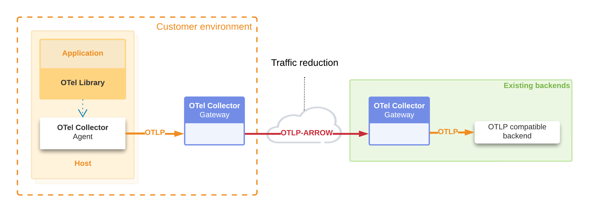
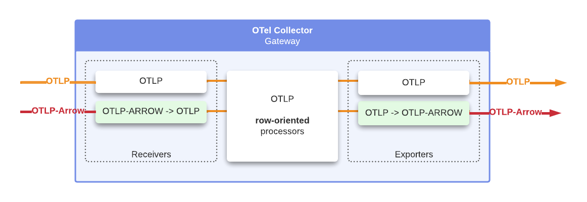
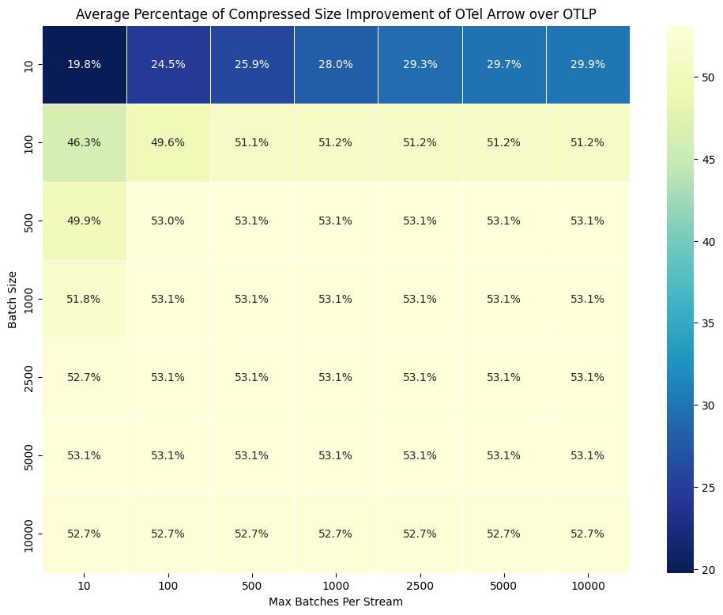

# OpenTelemetry Protocol with Apache Arrow

The [OpenTelemetry with Apache
Arrow](https://github.com/open-telemetry/otel-arrow) project is an
effort within [OpenTelemetry](https://opentelemetry.io/) to use
[Apache Arrow](https://arrow.apache.org/) libraries for bulk data
transport in OpenTelemetry pipelines.  This repository is the home of
the OpenTelemetry Protocol with Apache Arrow protocol, which we refer
to as "OTAP", and reference implementations in Golang and Rust.

The [OpenTelemetry Arrow project has an OpenTelemetry SIG with weekly
meetings][PROJECTDEF]. Find our [meeting schedule on the OpenTelemetry
calendar][OTELCAL].

[PROJECTDEF]: https://github.com/open-telemetry/community/blob/main/projects/otelarrow.md
[OTELCAL]: https://github.com/open-telemetry/community/blob/main/README.md#calendar

## Quick start

OTel-Arrow components are included in the OpenTelemetry Collector-Contrib
repository.  See the [Exporter][EXPORTER] and [Receiver][RECEIVER] documentation
for details.

The [examples](./collector/examples/README.md) in this repository use
a test collector named `otelarrowcol`, see [collector/BUILDING.md](./collector/BUILDING.md).

[Phase 2 of the project is being actively developed](#phase-2). We are
building an end-to-end OpenTelemetry Arrow pipeline in Rust.  Find us
in the CNCF Slack `#otel-arrow` channel.

[RECEIVER]: https://github.com/open-telemetry/opentelemetry-collector-contrib/blob/main/receiver/otelarrowreceiver/README.md
[EXPORTER]: https://github.com/open-telemetry/opentelemetry-collector-contrib/blob/main/exporter/otelarrowexporter/README.md

## Overview

OpenTelemetry and Apache Arrow have similar charters, so it was
natural to think about combining them.  Both projects offer
vendor-neutral interfaces with a cross-language interface
specification, so that their implementation will feel familiar to
users as they move between programming languages, and both specify a
data model that is used throughout the project.

The OpenTelemetry project defines
[OTLP](https://opentelemetry.io/docs/specs/otlp/), the "OpenTeLemetry
Prototcol" as the standard form of telemetry data in OpenTelemetry,
being as similar as possible to the data model underlying the project.
OTLP is defined in terms of Google protocol buffer definitions.

OTLP is a stateless protocol, where export requests map directly into
the data model, nothing is omitted, and little is shared.  OTLP export
requests do not contain external or internal references, making the
data relatively simple and easy to interpret.  Because of this design,
users of OTLP will typically configure network compression.  In
environments where telemetry data will be shipped to a service
provider across a wide-area network, users would like more compression
than can be achieved using a row-based data model and a stateless protocol.

## Project phases

### Phase 1

Phase 1 of the project is complete. Our initial aim was to facilitate traffic reduction
between a pair of OpenTelemetry Collectors, as illustrated in the following
diagram.

The OpenTelemetry Collector-Contrib distribution includes the
OTel-Arrow Receiver and Exporter. The following diagram is an overview
of this integration, which supports seamless fallback from OTAP to OTLP. In
this first phase, the internal representation of the telemetry data is
still fundamentally row-oriented.

### Phase 2

We are building an end-to-end OpenTelemetry Protocol with Apache Arrow
(OTAP) pipeline and we believe this form of pipeline will have substantially
lower overhead than a row-oriented architecture.  [See our Phase 2 design
document](./docs/phase2-design.md).

These are our future milestones for OpenTelemetry and Apache Arrow
integration:

1. Extend OpenTelemetry client SDKs to natively support the OpenTelemetry
   Protocol with Apache Arrow Protocol
2. Extend the OpenTelemetry collector with direct support for OpenTelemetry
   Protocol with Apache Arrow pipelines
3. Extend OpenTelemetry data model with native support for multi-variate
   metrics.
4. Output OpenTelemetry data to the Parquet file format, part of the Apache
   Arrow ecosystem

### Improve network-level compression with OpenTelemetry Protocol with Apache Arrow

The first general-purpose application for the project is traffic
reduction.  At a high-level, this protocol performs the following steps
to compactly encode and transmit telemetry using Apache Arrow.

1. Separate the OpenTelemetry Resource and Scope elements from the
   hierarchy, then encode and transmit each distinct entity once per
   stream lifetime.
2. Calculate distinct attribute sets used by Resources, Scopes,
   Metrics, Logs, Spans, Span Events, and Span Links, then encode and
   transmit each distinct entity once per stream lifetime.
3. Use Apache Arrow's built-in support for encoding dictionaries and leverage
   other purpose-built low-level facilities, such as delta-dictionaries and
   sorting, to encode structures compactly.

Here is a diagram showing how the protocol transforms OTLP Log Records
into column-oriented data, which also makes the data more compressible.

## Project status

The Phase-1 project deliverables, located in the Collector-Contrib repository,
are in the [Beta stability level, as defined by the OpenTelemetry collector
guidelines](https://github.com/open-telemetry/opentelemetry-collector#beta).
We do not plan to make breaking changes in this protocol without first
engineering an approach that ensures forwards and
backwards-compatibility for existing and new users.  We believe it is
safe to begin using these components for production data, non-critical
workloads.

### Phase-1 project deliverables

We are pleased to release two new collector components, presently housed in
[OpenTelemetry
Collector-Contrib](https://github.com/open-telemetry/opentelemetry-collector-contrib):

- [OpenTelemetry Protocol with Apache Arrow Receiver][RECEIVER]
- [OpenTelemetry Protocol with Apache Arrow Exporter][EXPORTER]

The OpenTelemetry Protocol with Apache Arrow exporter and receiver components
are drop-in compatible with the core collector's OTLP exporter and receiver
components. Users with an established OTLP collection pipeline between two
OpenTelemetry Collectors can re-build their collectors with `otelarrow`
components, then simply replace the component name `otlp` with `otelarrow`.  The
exporter and receiver both support falling back to standard OTLP in case either
side does not recognize the protocol, so the upgrade should be painless.  The
OpenTelemetry Protocol with Apache Arrow receiver serves both OpenTelemetry
Protocol with Apache Arrow and OTLP on the standard port for OTLP gRPC (4317).

See the [Exporter][EXPORTER] and [Receiver][RECEIVER] documentation for details
and sample configurations.

### Project documentation

This package is a reference implementation of the OpenTelemetry Protocol with
Apache Arrow protocol specified in this
[OTEP](https://github.com/open-telemetry/oteps/blob/main/text/0156-columnar-encoding.md),
which is currently the best source of information about OpenTelemetry Protocol
with Apache Arrow. The [Donation
request](https://github.com/open-telemetry/community/issues/1332) describes how
the project began.

Here are several more resources that are available to learn more about
OpenTelemetry Protocol with Apache Arrow.

- [Arrow Data Model](docs/data_model.md) - Mapping OTLP entities to Arrow
  Schemas.
- [Benchmark results](docs/benchmarks.md) - Based on synthetic and production
  data.
- [Validation process](docs/validation_process.md) - Encoding/Decoding
  validation process.
- Articles describing some of the Arrow techniques used behind the scenes to
  optimize compression ratio and memory usage:
  - [Data types, encoding, hierarchical data,
    denormalization](https://arrow.apache.org/blog/2023/04/11/our-journey-at-f5-with-apache-arrow-part-1/)
  - [Adaptive Schemas and Sorting to Optimize Arrow
    Usage](https://arrow.apache.org/blog/2023/06/26/our-journey-at-f5-with-apache-arrow-part-2/)

## Benchmark summary

The following chart shows the compressed message size (in bytes) as a function
of the batch size for metrics (univariate), logs, and traces. The bottom of the
chart shows the reduction factor for both the standard OTLP protocol (with ZSTD
compression) and the OpenTelemetry Protocol with Apache Arrow protocol (ZSTD) in
comparison with an uncompressed OTLP protocol.

The next chart follows the same logic but shows the results for multivariate
metrics (see left column).

The following heatmap represents, for different combinations of batch sizes and
connection durations (expressed as the number of batches per stream), the
additional percentage of compression gain between this new protocol and OTLP,
both compressed with ZSTD. The data used here comes from a traffic of spans
captured in a production environment. The gains are substantial in most cases.
It is even interesting to note that these gains compared to OTLP+ZSTD are more
significant for moderate-sized batches (e.g., 100 and 1000 spans per batch),
which makes this protocol also interesting for scenarios where the additional
latency introduced by batching must be minimized. There is hardly any scenario
where micro-batches (e.g., 10 spans per batch) make the overhead of the Arrow
schema prohibitive, and the advantage of a columnar representation becomes
negligible. In other cases, this initial overhead is very quickly offset after
just the first few batches. The columnar organization also lends itself better
to compression. For very large batch sizes, ZSTD does an excellent job as long
as the compression window is sufficiently large, but even in this case, the new
protocol remains superior. As previously mentioned, these compression gains can
be higher for traffic predominantly containing multivariate metrics.

For more details, see the following [benchmark results](docs/benchmarks.md) page.

## Contributing

For information about contributing to the project see:
[CONTRIBUTING.md](./CONTRIBUTING.md).

We meet every other Thursday at 8AM PT. The meeting is subject to change
depending on contributors'
availability. Check the [OpenTelemetry community
calendar](https://github.com/open-telemetry/community?tab=readme-ov-file#calendar)
for specific dates and for Zoom meeting links.

Meeting notes are available as a public [Google
doc](https://docs.google.com/document/d/1z8_Ra-ALDaYNa88mMj1gOZtOpLZLRk0-dZEmDjPmcUs).
If you have trouble accessing the doc, please get in touch on
[Slack](https://cloud-native.slack.com/archives/C07S4Q67LTF).

The meeting is open for all to join. We invite everyone to join our meeting,
regardless of your experience level. Whether you're a seasoned OpenTelemetry
developer, just starting your journey, or simply curious about the work we do,
you're more than welcome to participate!

### Maintainers

- [Laurent Qu&#xE9;rel](https://github.com/lquerel), F5
- [Joshua MacDonald](https://github.com/jmacd), Microsoft
- [Drew Relmas](https://github.com/drewrelmas), Microsoft

For more information about the maintainer role, see the [community
repository](https://github.com/open-telemetry/community/blob/main/community-membership.md#maintainer).

### Approvers

- [Lei Huang](https://github.com/v0y4g3r), Greptime
- [Albert Lockett](https://github.com/albertlockett), F5

For more information about the approver role, see the [community
repository](https://github.com/open-telemetry/community/blob/main/community-membership.md#approver).

### Emeritus Approvers

- [Moh Osman](https://github.com/moh-osman3)
- [Alex Boten](https://github.com/codeboten)

### Thanks to all of our contributors

## References

- [OpenTelemetry Project](https://opentelemetry.io/)
- [OpenTelemetry Specification](https://github.com/open-telemetry/opentelemetry-specification)
