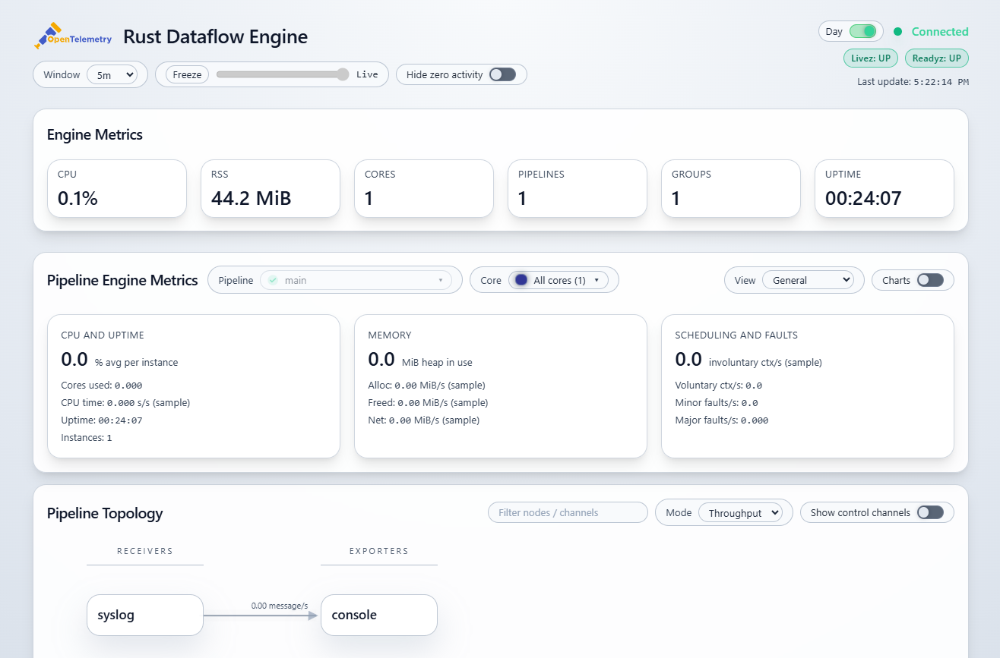

# OpenTelemetry Protocol with Apache Arrow

[](https://cloud-native.slack.com/archives/C07S4Q67LTF)
[](https://github.com/open-telemetry/otel-arrow/actions/workflows/go-ci.yml)
[](https://github.com/open-telemetry/otel-arrow/actions/workflows/rust-ci.yml)
[](https://scorecard.dev/viewer/?uri=github.com/open-telemetry/otel-arrow)
[](https://www.bestpractices.dev/projects/10684)
[](https://codecov.io/gh/open-telemetry/otel-arrow)

**The OTel-Arrow project is building a high-performance, end-to-end
column-oriented telemetry pipeline for
[OpenTelemetry](https://opentelemetry.io/) data based on [Apache
Arrow](https://arrow.apache.org/).**

The OpenTelemetry Protocol with Apache Arrow (OTAP) is designed as the
column-oriented equivalent of OpenTelemetry Protocol (OTLP) that
dramatically reduces network usage, and our [protocol
specification](./docs/otap-spec.md) ensures that OTAP and OTLP are
always convertible, without loss, in both directions.

The [OTAP Dataflow Engine](./rust/otap-dataflow/README.md) is our new
Rust OpenTelemetry code base, a pipeline engine that dramatically
reduces network, memory, and CPU usage, gaining efficiency through a
number of optimizations, including the **shared-nothing** and
**thread-per-core** design patterns and extensive use of **zero-copy**
data types.

The OTAP Dataflow Engine is **embeddable software**. Our repo builds a
demonstration `df_engine` artifact with core nodes included and
features YAML configuration, but really it's designed for safely
adding OpenTelemetry features and capabilities in other programs,
anywhere that Rust can be compiled, with fine-grained control over
memory and CPU resources.

The OTAP Dataflow Engine has built-in support for OTAP and OTLP,
receivers and exporters, and built-in processors featuring batching,
fanout, failover, retry, and routing by signal type. It has processors
for common forms of filtering, transforming, sampling, and temporal
aggregation. We have a **durable buffer** processor, based on the
[Arrow IPC format][ARROW-IPC],
introducing disk-based storage into pipelines for reliable delivery,
and there are others such as a Syslog receiver and a Console exporter.

Our transform processor is built using [Apache
Datafusion](https://datafusion.apache.org/), the industry-leading
embedded query engine, itself based on [Apache
Arrow](https://arrow.apache.org/), and our Parquet exporter for OTAP
makes OpenTelemetry data directly accessible to a wide range of tools,
thanks to the [Apache Parquet](https://parquet.apache.org/) ecosystem.

We're [self-instrumenting
ourselves](./rust/otap-dataflow/crates/telemetry/README.md) with an
experimental OpenTelemetry SDK that emits OTAP directly, meaning we
have an **end-to-end column-oriented telemetry pipeline** in Rust.

Our Golang Collector components [`otelarrowreceiver`][RECEIVER] and
[`otelarrowexporter`][EXPORTER] have been included in the
OpenTelemetry Collector-Contrib distribution since [the July 2024
release of v0.104.0][ARROW-RELEASED].

Our project is growing, new contributors are welcome.  **[Join us in
`#otel-arrow` on the CNCF Slack!](https://cloud-native.slack.com/archives/C07S4Q67LTF)**

## What is Apache Arrow?

The [Apache Arrow](https://arrow.apache.org/) is a major open-source
project for in-memory and on-wire data exchange using a
column-oriented representation. For OpenTelemetry readers, Apache
Arrow is a lot like us, as the project encompasses a data format, a
set of libraries, and an ecosystem.

The Apache Arrow format is a specification for the in-memory layout of
a **record batch**, including details about the schema, the column
names and types, and a length, and then a set of Arrays, one per
column of the correct type and matching length. Arrow record batches
support a number of types, including scalars of various width, strings
and binary data, arrays, lists, structs, maps, as well as
dictionary-encodings over the other types.

With Apache Arrow, we can build a record batch in one language and
pass it to another language using shared memory. Apache Arrow
specifies [Arrow IPC][ARROW-IPC], an encoding for column-oriented data
that extends zero-copy to network and file-based communications.

## What is OTAP?

OTAP is formally the **OpenTelemetry Protocol with Apache Arrow**,
abbreviated **OTAP** for OTel-Arrow Protocol, a column-oriented
representation for OpenTelemetry data supporting efficient in-memory
and on-wire telemetry exchange. Where OpenTelemetry's OTLP is a
row-oriented protocol, OTel-Arrow's OTAP protocol uses Apache Arrow to
encode telemetry in a columnar format that is more efficient for CPUs
to work with, because of vectorization, and compresses dramatically
better, especially over long-lived streams with the use of [Arrow
IPC][ARROW-IPC] stream encoding.

OTAP maintains 100% compatibility with the OpenTelemetry data model
for logs, traces, and metrics, with a straight-forward and non-lossy
round trip from OTLP to OTAP and back, and support for the
OpenTelemetry Profiles signal in OTAP is important future work.

In the OTAP Dataflow Engine, batches of OTAP data are represented
using **multiple record batches** in an arrangement referred to as a
"star schema". The number of record batches varies by OpenTelemetry
signal type, see our [data model documentation](./docs/data_model.md)
for details. OTAP Dataflow Engine also transports OTLP protocol bytes
directly and efficiently by avoiding protocol message objects.

Adapter libraries for conversion between OTAP and OTLP representations
are provided in [Rust](./rust/otap-dataflow/crates/pdata/README.md)
and [Golang](./go/README.md) in this repository.

## Quick Start

### OpenTelemetry Collector example

OTel-Arrow components ship in the [OpenTelemetry
Collector-Contrib][COLLECTOR-CONTRIB] distribution. The two components
extend the configuration model and settings of the core OTLP receiver
and exporter. By design, you can swap `otlp` for `otelarrow` in your
Collector configuration.  To locate one, see [OpenTelemetry Collector
releases](https://opentelemetry.io/docs/collector/#releases).

See the [Exporter][EXPORTER] and [Receiver][RECEIVER] docs for
complete and up-to-date configuration details and Collector-specific
examples.

### OTAP Dataflow Engine example

**We are not at this time providing pre-built OTAP Dataflow Engine
releases.** Developers can build the OTAP Dataflow Engine in a minimal
configuration with the following:

```bash
git clone https://github.com/open-telemetry/otel-arrow.git
cd otel-arrow/rust/otap-dataflow
cargo build --bin df_engine --no-default-features
```

A [directory of example configurations][EXAMPLE-CONFIGS] provides a
number of examples (e.g.,
[syslog-console.yaml][SYSLOG-CONSOLE-YAML]). For example, to receive
syslog messages with our [Syslog/CEF receiver][SYSLOG-CEF] on port
5140 and print them to the console:

```bash
./target/debug/df_engine -c ./configs/syslog-console.yaml
```

Linux/MacOS users can test this with:

```bash
logger -n 127.0.0.1 -P 5140 -d --rfc3164 "hello world"
```

PowerShell users can test this with:

```powershell
$t=Get-Date -Format 'MMM dd HH:mm:ss';$u=New-Object Net.Sockets.UdpClient;$b=[Text.Encoding]::ASCII.GetBytes("<14>$t powershell test: hello world");$u.Send($b,$b.Length,'127.0.0.1',5140);$u.Close()
```

See the admin console on port 8080, or visit
`http://localhost:8080/metrics` to see engine metrics in Prometheus
format.



See the [OTAP Dataflow Engine
documentation](rust/otap-dataflow/README.md) for more details.

## Roadmap

See our [project phases document](./docs/project-phases.md) for
project goals and history. Phase 1 established the OTAP representation
and proved that a column-oriented representation for OpenTelemetry is
good for compression performance.

We are currently completing Phase 2, delivering the OTAP Dataflow
engine. Phase 2 has demonstrated that a column-oriented, Arrow-based
pipeline delivers new levels of performance for OpenTelemetry. See our
[live continuous benchmarks](https://open-telemetry.github.io/otel-arrow/benchmarks/continuous/)
and [nightly benchmark suite](https://open-telemetry.github.io/otel-arrow/benchmarks/nightly/).

As a community, we are planning phase 3, see the links below to join us.

## Contributing

We meet weekly, alternating between Tuesday at 4:00 PM PT and Thursday
at 8:00 AM PT. Check the [OpenTelemetry community calendar][OTELCAL]
for dates and Zoom links.

Whether you're a seasoned OpenTelemetry developer, just starting your
journey, or simply curious about the work we do, you're more than
welcome to participate!

- [Contribution guidelines](CONTRIBUTING.md)
- [Meeting notes](https://docs.google.com/document/d/1z8_Ra-ALDaYNa88mMj1gOZtOpLZLRk0-dZEmDjPmcUs)
- [CNCF Slack `#otel-arrow`](https://cloud-native.slack.com/archives/C07S4Q67LTF)

### Maintainers

- [Albert Lockett](https://github.com/albertlockett), F5
- [Drew Relmas](https://github.com/drewrelmas), Microsoft
- [Joshua MacDonald](https://github.com/jmacd), Microsoft
- [Laurent Qu&#xE9;rel](https://github.com/lquerel), F5

For more information about the maintainer role, see the [community
repository](https://github.com/open-telemetry/community/blob/main/guides/contributor/membership.md#maintainer).

### Approvers

- [Cijo Thomas](https://github.com/cijothomas), Microsoft
- [Lalit Kumar Bhasin](https://github.com/lalitb), Microsoft
- [Lei Huang](https://github.com/v0y4g3r), Greptime
- [Utkarsh Umesan Pillai](https://github.com/utpilla), Microsoft

For more information about the approver role, see the [community
repository](https://github.com/open-telemetry/community/blob/main/guides/contributor/membership.md#approver).

### Triagers

- [Tom Tan](https://github.com/ThomsonTan), Microsoft

For more information about the approver role, see the [community
repository](https://github.com/open-telemetry/community/blob/main/guides/contributor/membership.md#triager).

### Emeritus

- [Alex Boten](https://github.com/codeboten), Approver
- [Moh Osman](https://github.com/moh-osman3), Approver

### Thanks to all of our contributors

[](https://github.com/open-telemetry/otel-arrow/graphs/contributors)

## Documentation

Here are some of our important documents. You can find more
work-in-progress [design documentation for the OTAP Dataflow
Engine](./rust/otap-dataflow/docs).

| Document | Description |
| --- | --- |
| [OTAP Spec](docs/otap-spec.md) | Formal protocol specification |
| [OTAP Basics](docs/otap_basics.md) | Introduction to the OTAP protocol |
| [Data Model](docs/data_model.md) | Arrow schema mappings for OTLP entities |
| [Phase 1 Overview](docs/phase1-overview.md) | Wire protocol details and historical benchmarks |
| [Phase 2 Design](docs/phase2-design.md) | End-to-end pipeline architecture |
| [Engine Design](rust/otap-dataflow/crates/engine/README.md) | Engine architecture |
| [Benchmarks](docs/benchmarks.md) | Current performance results |
| [Validation Process](docs/validation_process.md) | Encoding/decoding validation process |
| [Dataflow Engine](rust/otap-dataflow/README.md) | Rust crate architecture and component reference |

## References

- [OpenTelemetry Project](https://opentelemetry.io/)
- [OpenTelemetry Specification](https://github.com/open-telemetry/opentelemetry-specification)
- [Apache Arrow](https://arrow.apache.org/)
- [Project definition](https://github.com/open-telemetry/community/blob/main/projects/otelarrow.md)
- [OTEP-0156: Columnar Encoding](https://github.com/open-telemetry/oteps/blob/main/text/0156-columnar-encoding.md)
- [Donation request](https://github.com/open-telemetry/community/issues/1332)
- [OTel-Arrow blog: Introduction](https://opentelemetry.io/blog/2023/otel-arrow/)
- [OTel-Arrow blog: Production Readiness](https://opentelemetry.io/blog/2024/otel-arrow-production)

[COLLECTOR-CONTRIB]: https://github.com/open-telemetry/opentelemetry-collector-contrib
[RECEIVER]: https://github.com/open-telemetry/opentelemetry-collector-contrib/blob/main/receiver/otelarrowreceiver/README.md
[EXPORTER]: https://github.com/open-telemetry/opentelemetry-collector-contrib/blob/main/exporter/otelarrowexporter/README.md
[ARROW-IPC]: https://arrow.apache.org/docs/format/IPC.html
[ARROW-RELEASED]: https://github.com/open-telemetry/opentelemetry-collector-contrib/releases/tag/v0.104.0
[SYSLOG-CEF]: ./rust/otap-dataflow/crates/core-nodes/src/receivers/syslog_cef_receiver/README.md
[SYSLOG-CONSOLE-YAML]: ./rust/otap-dataflow/configs/syslog-console.yaml
[EXAMPLE-CONFIGS]: ./rust/otap-dataflow/configs/README.md
[OTELCAL]: https://github.com/open-telemetry/community/blob/main/README.md#calendar
