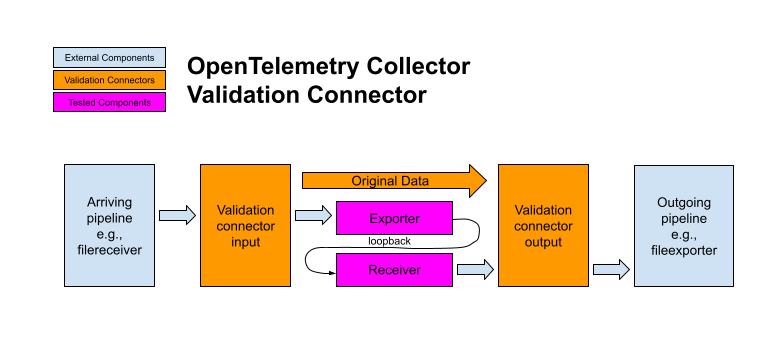

# Validation Connector

This connector allows verifying that an exporter and receiver pair
produce correct data.



## Current status: under development

Unfortuantely, until
https://github.com/open-telemetry/opentelemetry-collector/issues/8104
is resolved this component cannot be reliably used.

## Configuration

This connector can be used to test any exporter and receiver pair that
are able to propagate metadata using the Collector's
`client.Metadata.Info` mechanism.  For example, to test an OTel Arrow
collector configuration, configure a loopback receiver:

```
receivers:
  otlp/loopback:
    protocols:
      grpc:
        endpoint: 127.0.0.1:4000
        include_metadata: true
      arrow:
        disabled: false
```

Note that the receiver needs to set `include_metadata: true`.

The exporter should be connected to the loopback receiver port with a
`headers_setter` extension to ensure propagation

```
exporters:
  otlp/arrow:
    endpoint: 127.0.0.1:4000
    wait_for_ready: true
    tls:
      insecure: true
    arrow:
      disabled: false
      disable_downgrade: true
      num_streams: 1
    retry_on_failure:
      enabled: false
    sending_queue:
      enabled: false
    auth:
      authenticator: headers_setter

extensions:
  headers_setter:
    headers:
      - key: validation-sequence
        from_context: X-Validation-Sequence
```

Two validation connectors are initialized, one labeled "verify" and
one labeled "expect".  The "expect" connector names the pipeline of
the "verify" conector, as follows:

```
connectors:
  validation/verify/traces:
  validation/expect/traces:
    follower: traces/validate

...

service:
  extensions: [headers_setter]
  pipelines:
    # The input is routed to the first validation connector.
    traces/input:
      receivers: [INPUT]
      exporters: [validation/expect/traces]

    # This pipeline provides the real/expected input from the first
	# validation connector to the second connector and the system under
	# test.  This pipeline is named as the "follower" of the validation 
	# connector, above.
    traces/validate:
      receivers: [validation/expect/traces]
      exporters: [validation/verify/traces, otlp/arrow]

    # This pipeline provides the actual input from the system under test
	# to the second validation connector.
    traces/loop:
      receivers: [otlp/loopback]
      exporters: [validation/verify/traces]
	
	# This pipeline continues following validation.
    traces/output:
      receivers: [validation/verify/traces]
      exporters: [OUTPUT1, OUTPUT2, ...]
```

### Example

A complete example of how to use this connector is given in
[../../examples/synthesize/](../../examples/synthesize/README.md)
that uses `filereceiver` and `fileexporter` for its inputs and outputs.

## Detailed design

There are always two instances of the validation connector in use.

The first validation connector will output to the second validation
connector and the exporter-under-test.

The second validation connector will receive from the
receiver-under-test.

The second validation connector expects to see the same input twice,
once from the other connector to set an expectation, and once from the
receiver with the actual data.  The connector distinguishes these
cases using two kinds of context variable.

1. The first-stage-to-second-stage context contains a Go Context
   variable which does not escape the process or propagate via any
   RPC.  This variable contains the sequence number as observed by the
   first connector.  It stores the expected data in its map as a
   `ptrace.Traces`, `pmetric.Metrics` or `plog.Logs`.
2. The receiver-to-second-stage context MUST contain a metadata
   variable indicating the sequence number of the data item.  The
   connector will look up the sequence number to find expected
   matching data.
   
For each expected and actual data item, the support method
`AssertEquiv` library in [pkg/otel/asasert](https://github.com/open-telemetry/otel-arrow/tree/main/pkg/otel/assert/README.md) is used to ensure
that the data are equivalent.  This package supports the comparison of
two distinct structures that are semantically equivalent but
structurally different in several ways that can happen as a result of
the Arrow encoding.
