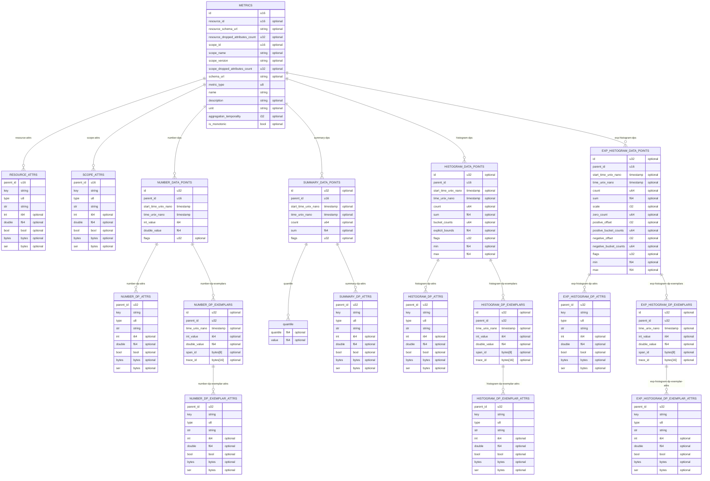
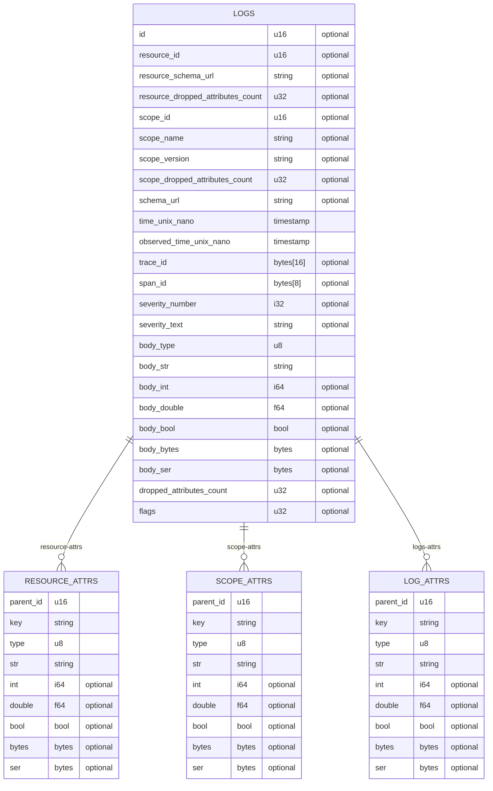
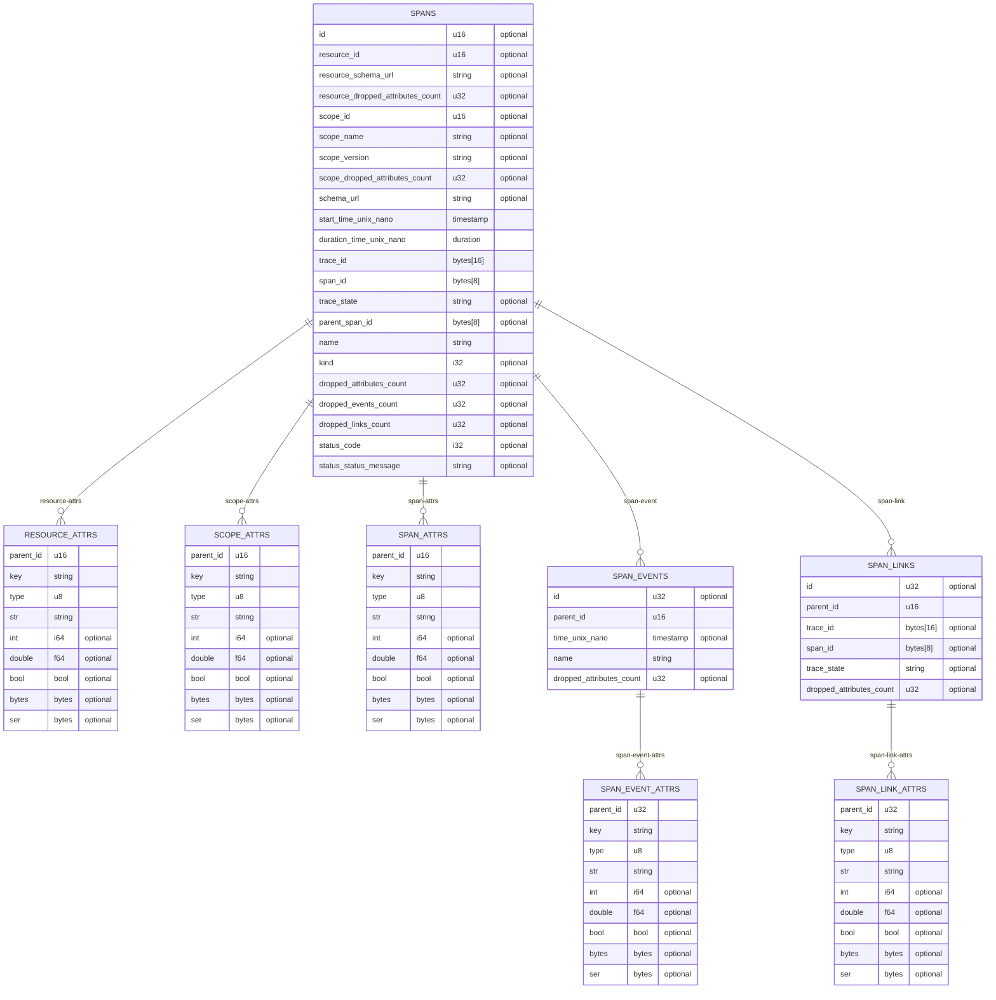

# Arrow Data Model

This document describes the Arrow Schema used for each OTLP entity as Entity
Relation diagrams.

The Arrow Data Model has been carefully designed to optimize:

- The compression ratio for metrics, logs, and traces,
- Its compatibility within the extensive Arrow ecosystem,
- Its compatibility with file formats, such as Parquet.

This document has been generated directly from the source code. To regenerate
this document, run the following command:

```bash
make doc
```

## Metrics Arrow Records

The following ER diagram describes the Arrow Schema used for metrics.



## Logs Arrow Records

The following ER diagram describes the Arrow Schema used for logs.



## Traces Arrow Records

The following ER diagram describes the Arrow Schema used for traces.


