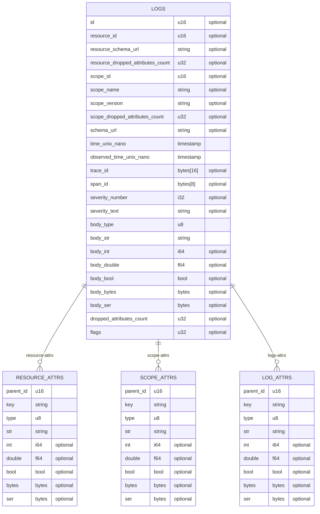
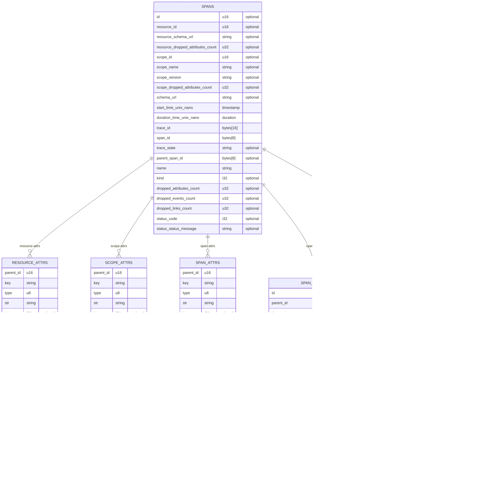

# Arrow Data Model

## Metrics Arrow Records

```mermaid
erDiagram
    METRICS ||--o{ resource_metrics : resource_metrics
    resource_metrics ||--o{ scope_metrics : scope_metrics
    METRICS ||--o{ RESOURCE_ATTRS : resource-attrs
    METRICS ||--o{ SCOPE_ATTRS : scope-attrs
    METRICS ||--o{ INT_SUM : int_sum
    INT_SUM ||--o{ exemplars : exemplars
    INT_SUM ||--o{ INT_SUM_ATTRS : int_sum-attrs
    METRICS ||--o{ DOUBLE_SUM : double_sum
    DOUBLE_SUM ||--o{ exemplars : exemplars
    DOUBLE_SUM ||--o{ DOUBLE_SUM_ATTRS : double_sum-attrs
    METRICS ||--o{ INT_GAUGE : int_gauge
    INT_GAUGE ||--o{ exemplars : exemplars
    INT_GAUGE ||--o{ INT_GAUGE_ATTRS : int_gauge-attrs
    METRICS ||--o{ DOUBLE_GAUGE : double_gauge
    DOUBLE_GAUGE ||--o{ exemplars : exemplars
    DOUBLE_GAUGE ||--o{ DOUBLE_GAUGE_ATTRS : double_gauge-attrs
    METRICS ||--o{ SUMMARIES : summary
    SUMMARIES ||--o{ quantile : quantile
    SUMMARIES ||--o{ SUMMARY_ATTRS : summary-attrs
    METRICS ||--o{ HISTOGRAMS : histogram
    HISTOGRAMS ||--o{ exemplars : exemplars
    HISTOGRAMS ||--o{ HISTOGRAM_ATTRS : histogram-attrs
    METRICS ||--o{ EXP_HISTOGRAMS : exp-histogram
    EXP_HISTOGRAMS ||--o{ exemplars : exemplars
    EXP_HISTOGRAMS ||--o{ EXP_HISTOGRAM_ATTRS : exp-histogram-attrs
    DOUBLE_GAUGE{
        id u32 
        parent_id u16 
        name string 
        description string "optional"
        unit string "optional"
        aggregation_temporality i32 "optional"
        is_monotonic bool "optional"
        start_time_unix_nano timestamp 
        time_unix_nano timestamp 
        value f64 
        flags u32 "optional"
    }
    quantile{
        quantile f64 "optional"
        value f64 "optional"
    }
    EXP_HISTOGRAMS{
        id u32 "optional"
        parent_id u16 
        name string 
        description string "optional"
        unit string "optional"
        aggregation_temporality i32 "optional"
        is_monotonic bool "optional"
        start_time_unix_nano timestamp "optional"
        time_unix_nano timestamp "optional"
        count u64 "optional"
        sum f64 "optional"
        scale i32 "optional"
        zero_count u64 "optional"
        positive_offset i32 "optional"
        positive_bucket_counts u64 "optional"
        negative_offset i32 "optional"
        negative_bucket_counts u64 "optional"
        flags u32 "optional"
        min f64 "optional"
        max f64 "optional"
    }
    resource_metrics{
        resource_id u16 "optional"
        resource_schema_url string "optional"
        resource_dropped_attributes_count u32 "optional"
        schema_url string "optional"
    }
    scope_metrics{
        id u16 
        scope_id u16 "optional"
        scope_name string "optional"
        scope_version string "optional"
        scope_dropped_attributes_count u32 "optional"
        schema_url string "optional"
    }
    INT_SUM{
        id u32 
        parent_id u16 
        name string 
        description string "optional"
        unit string "optional"
        aggregation_temporality i32 "optional"
        is_monotonic bool "optional"
        start_time_unix_nano timestamp 
        time_unix_nano timestamp 
        value i64 
        flags u32 "optional"
    }
    DOUBLE_SUM{
        id u32 
        parent_id u16 
        name string 
        description string "optional"
        unit string "optional"
        aggregation_temporality i32 "optional"
        is_monotonic bool "optional"
        start_time_unix_nano timestamp 
        time_unix_nano timestamp 
        value f64 
        flags u32 "optional"
    }
    INT_GAUGE_ATTRS{
        parent_id u32 
        key string 
        type u8 
        str string 
        int i64 "optional"
        double f64 "optional"
        bool bool "optional"
        bytes bytes "optional"
        ser bytes "optional"
    }
    METRICS{
    }
    HISTOGRAMS{
        id u32 "optional"
        parent_id u16 
        name string 
        description string "optional"
        unit string "optional"
        aggregation_temporality i32 "optional"
        is_monotonic bool "optional"
        start_time_unix_nano timestamp "optional"
        time_unix_nano timestamp "optional"
        count u64 "optional"
        sum f64 "optional"
        bucket_counts u64 "optional"
        explicit_bounds f64 "optional"
        flags u32 "optional"
        min f64 "optional"
        max f64 "optional"
    }
    EXP_HISTOGRAM_ATTRS{
        parent_id u32 
        key string 
        type u8 
        str string 
        int i64 "optional"
        double f64 "optional"
        bool bool "optional"
        bytes bytes "optional"
        ser bytes "optional"
    }
    RESOURCE_ATTRS{
        parent_id u16 
        key string 
        type u8 
        str string 
        int i64 "optional"
        double f64 "optional"
        bool bool "optional"
        bytes bytes "optional"
        ser bytes "optional"
    }
    SCOPE_ATTRS{
        parent_id u16 
        key string 
        type u8 
        str string 
        int i64 "optional"
        double f64 "optional"
        bool bool "optional"
        bytes bytes "optional"
        ser bytes "optional"
    }
    exemplars{
        attributes map "map<utf8, sparse_union>, optional, map<utf8, sparse_union>, optional, map<utf8, sparse_union>, optional, map<utf8, sparse_union>, optional, map<utf8, sparse_union>, optional, map<utf8, sparse_union>, optional"
        time_unix_nano timestamp "optional, optional, optional, optional, optional, optional"
        value union "i64|f64, optional, i64|f64, optional, i64|f64, optional, i64|f64, optional, i64|f64, optional, i64|f64, optional"
        span_id bytes[8] "optional, optional, optional, optional, optional, optional"
        trace_id bytes[16] "optional, optional, optional, optional, optional, optional"
    }
    DOUBLE_GAUGE_ATTRS{
        parent_id u32 
        key string 
        type u8 
        str string 
        int i64 "optional"
        double f64 "optional"
        bool bool "optional"
        bytes bytes "optional"
        ser bytes "optional"
    }
    SUMMARY_ATTRS{
        parent_id u32 
        key string 
        type u8 
        str string 
        int i64 "optional"
        double f64 "optional"
        bool bool "optional"
        bytes bytes "optional"
        ser bytes "optional"
    }
    INT_SUM_ATTRS{
        parent_id u32 
        key string 
        type u8 
        str string 
        int i64 "optional"
        double f64 "optional"
        bool bool "optional"
        bytes bytes "optional"
        ser bytes "optional"
    }
    DOUBLE_SUM_ATTRS{
        parent_id u32 
        key string 
        type u8 
        str string 
        int i64 "optional"
        double f64 "optional"
        bool bool "optional"
        bytes bytes "optional"
        ser bytes "optional"
    }
    INT_GAUGE{
        id u32 
        parent_id u16 
        name string 
        description string "optional"
        unit string "optional"
        aggregation_temporality i32 "optional"
        is_monotonic bool "optional"
        start_time_unix_nano timestamp 
        time_unix_nano timestamp 
        value i64 
        flags u32 "optional"
    }
    SUMMARIES{
        id u32 "optional"
        parent_id u16 
        name string 
        description string "optional"
        unit string "optional"
        aggregation_temporality i32 "optional"
        is_monotonic bool "optional"
        start_time_unix_nano timestamp "optional"
        time_unix_nano timestamp "optional"
        count u64 "optional"
        sum f64 "optional"
        flags u32 "optional"
    }
    HISTOGRAM_ATTRS{
        parent_id u32 
        key string 
        type u8 
        str string 
        int i64 "optional"
        double f64 "optional"
        bool bool "optional"
        bytes bytes "optional"
        ser bytes "optional"
    }
```

## Logs Arrow Records

```mermaid
erDiagram
    LOGS ||--o{ RESOURCE_ATTRS : resource-attrs
    LOGS ||--o{ SCOPE_ATTRS : scope-attrs
    LOGS ||--o{ LOG_ATTRS : logs-attrs
    LOG_ATTRS{
        parent_id u16 
        key string 
        type u8 
        str string 
        int i64 "optional"
        double f64 "optional"
        bool bool "optional"
        bytes bytes "optional"
        ser bytes "optional"
    }
    LOGS{
        id u16 "optional"
        resource_id u16 "optional"
        resource_schema_url string "optional"
        resource_dropped_attributes_count u32 "optional"
        scope_id u16 "optional"
        scope_name string "optional"
        scope_version string "optional"
        scope_dropped_attributes_count u32 "optional"
        schema_url string "optional"
        time_unix_nano timestamp 
        observed_time_unix_nano timestamp 
        trace_id bytes[16] "optional"
        span_id bytes[8] "optional"
        severity_number i32 "optional"
        severity_text string "optional"
        body_type u8 
        body_str string 
        body_int i64 "optional"
        body_double f64 "optional"
        body_bool bool "optional"
        body_bytes bytes "optional"
        body_ser bytes "optional"
        dropped_attributes_count u32 "optional"
        flags u32 "optional"
    }
    RESOURCE_ATTRS{
        parent_id u16 
        key string 
        type u8 
        str string 
        int i64 "optional"
        double f64 "optional"
        bool bool "optional"
        bytes bytes "optional"
        ser bytes "optional"
    }
    SCOPE_ATTRS{
        parent_id u16 
        key string 
        type u8 
        str string 
        int i64 "optional"
        double f64 "optional"
        bool bool "optional"
        bytes bytes "optional"
        ser bytes "optional"
    }
```

## Traces Arrow Records

```mermaid
erDiagram
    SPANS ||--o{ RESOURCE_ATTRS : resource-attrs
    SPANS ||--o{ SCOPE_ATTRS : scope-attrs
    SPANS ||--o{ SPAN_ATTRS : span-attrs
    SPANS ||--o{ SPAN_EVENTS : span-event
    SPANS ||--o{ SPAN_LINKS : span-link
    SPAN_EVENTS ||--o{ SPAN_EVENT_ATTRS : span-event-attrs
    SPAN_LINKS ||--o{ SPAN_LINK_ATTRS : span-link-attrs
    SPAN_LINKS{
        id u32 "optional"
        parent_id u16 
        trace_id bytes[16] "optional"
        span_id bytes[8] "optional"
        trace_state string "optional"
        dropped_attributes_count u32 "optional"
    }
    SPAN_EVENT_ATTRS{
        parent_id u32 
        key string 
        type u8 
        str string 
        int i64 "optional"
        double f64 "optional"
        bool bool "optional"
        bytes bytes "optional"
        ser bytes "optional"
    }
    SPAN_LINK_ATTRS{
        parent_id u32 
        key string 
        type u8 
        str string 
        int i64 "optional"
        double f64 "optional"
        bool bool "optional"
        bytes bytes "optional"
        ser bytes "optional"
    }
    SPANS{
        id u16 "optional"
        resource_id u16 "optional"
        resource_schema_url string "optional"
        resource_dropped_attributes_count u32 "optional"
        scope_id u16 "optional"
        scope_name string "optional"
        scope_version string "optional"
        scope_dropped_attributes_count u32 "optional"
        schema_url string "optional"
        start_time_unix_nano timestamp 
        duration_time_unix_nano duration 
        trace_id bytes[16] 
        span_id bytes[8] 
        trace_state string "optional"
        parent_span_id bytes[8] "optional"
        name string 
        kind i32 "optional"
        dropped_attributes_count u32 "optional"
        dropped_events_count u32 "optional"
        dropped_links_count u32 "optional"
        status_code i32 "optional"
        status_status_message string "optional"
    }
    RESOURCE_ATTRS{
        parent_id u16 
        key string 
        type u8 
        str string 
        int i64 "optional"
        double f64 "optional"
        bool bool "optional"
        bytes bytes "optional"
        ser bytes "optional"
    }
    SCOPE_ATTRS{
        parent_id u16 
        key string 
        type u8 
        str string 
        int i64 "optional"
        double f64 "optional"
        bool bool "optional"
        bytes bytes "optional"
        ser bytes "optional"
    }
    SPAN_ATTRS{
        parent_id u16 
        key string 
        type u8 
        str string 
        int i64 "optional"
        double f64 "optional"
        bool bool "optional"
        bytes bytes "optional"
        ser bytes "optional"
    }
    SPAN_EVENTS{
        id u32 "optional"
        parent_id u16 
        time_unix_nano timestamp "optional"
        name string 
        dropped_attributes_count u32 "optional"
    }
```
