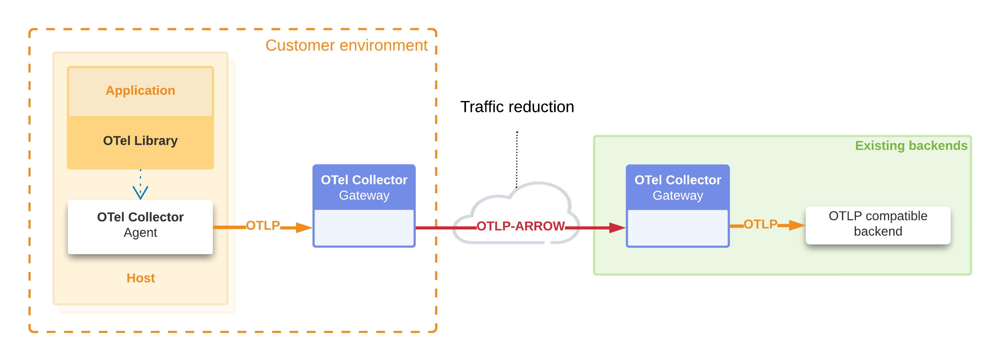
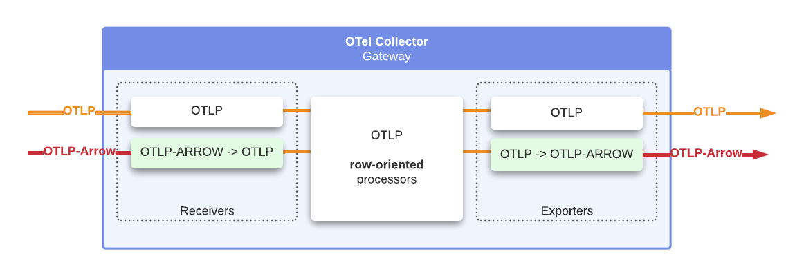
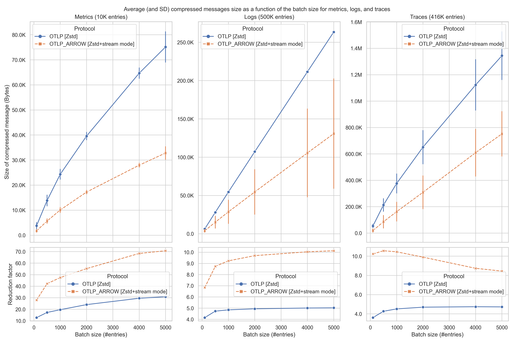
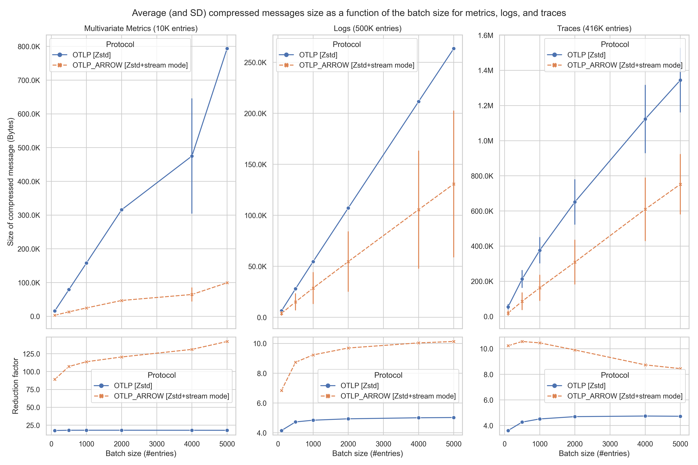

# Phase 1: Arrow as a Wire Protocol

Phase 1 of the OTel-Arrow project, active 2023 through 2024,
established the mapping between OpenTelemetry data types and the
Apache Arrow columnar format, with emphasis on streaming compression
results between OpenTelemetry Collectors.

For context on all project phases, see [project-phases.md](./project-phases.md).

## Overview

The first general-purpose application for the project was traffic reduction
between a pair of OpenTelemetry Collectors, as illustrated in the following
diagram.

The OpenTelemetry Collector-Contrib distribution includes the OTel-Arrow
Receiver and Exporter. The following diagram is an overview of this integration,
which supports seamless fallback from OTAP to OTLP. In this first phase, the
internal representation of the telemetry data is still fundamentally
row-oriented.

## How OTAP Improves Network Compression

At a high-level, the protocol performs the following steps to compactly encode
and transmit telemetry using Apache Arrow:

1. Separate the OpenTelemetry Resource and Scope elements from the hierarchy,
   then encode and transmit each distinct entity once per stream lifetime.
2. Calculate distinct attribute sets used by Resources, Scopes, Metrics, Logs,
   Spans, Span Events, and Span Links, then encode and transmit each distinct
   entity once per stream lifetime.
3. Use Apache Arrow's built-in support for encoding dictionaries and leverage
   other purpose-built low-level facilities, such as delta-dictionaries and
   sorting, to encode structures compactly.

Here is a diagram showing how the protocol transforms OTLP Log Records into
column-oriented data, which also makes the data more compressible.

## Phase 1 Deliverables

The Phase 1 project deliverables, located in the Collector-Contrib repository,
are at the [Beta stability level, as defined by the OpenTelemetry collector
guidelines](https://github.com/open-telemetry/opentelemetry-collector#beta).
We do not plan to make breaking changes in this protocol without first
engineering an approach that ensures forwards and backwards-compatibility for
existing and new users. We believe it is safe to begin using these components
for production workloads that are not mission-critical.

- [OpenTelemetry Protocol with Apache Arrow Receiver][RECEIVER]
- [OpenTelemetry Protocol with Apache Arrow Exporter][EXPORTER]

The exporter and receiver components are drop-in compatible with the core
collector's OTLP exporter and receiver. Users with an established OTLP
collection pipeline between two OpenTelemetry Collectors can re-build their
collectors with `otelarrow` components, then simply replace the component name
`otlp` with `otelarrow`. The exporter and receiver both support falling back to
standard OTLP in case either side does not recognize the protocol. The receiver
serves both OTAP and OTLP on the standard port for OTLP gRPC (4317).

See the [Exporter][EXPORTER] and [Receiver][RECEIVER] documentation for details
and sample configurations.

[RECEIVER]: https://github.com/open-telemetry/opentelemetry-collector-contrib/blob/main/receiver/otelarrowreceiver/README.md
[EXPORTER]: https://github.com/open-telemetry/opentelemetry-collector-contrib/blob/main/exporter/otelarrowexporter/README.md

## Phase 1 Benchmark Results

The following charts show Phase 1 benchmark results demonstrating compression
improvements between OpenTelemetry Collectors.

The first chart shows the compressed message size (in bytes) as a function of
the batch size for metrics (univariate), logs, and traces. The bottom of the
chart shows the reduction factor for both the standard OTLP protocol (with ZSTD
compression) and the OTAP protocol (ZSTD) in comparison with an uncompressed
OTLP protocol.

The next chart follows the same logic but shows the results for multivariate
metrics (see left column).

The following heatmap represents, for different combinations of batch sizes and
connection durations (expressed as the number of batches per stream), the
additional percentage of compression gain between this new protocol and OTLP,
both compressed with ZSTD. The data used here comes from a traffic of spans
captured in a production environment. The gains are substantial in most cases.

Notably, these gains compared to OTLP+ZSTD are more significant for
moderate-sized batches (e.g., 100 and 1000 spans per batch), which makes this
protocol also interesting for scenarios where the additional latency introduced
by batching must be minimized. There is hardly any scenario where micro-batches
(e.g., 10 spans per batch) make the overhead of the Arrow schema prohibitive,
and the advantage of a columnar representation becomes negligible. In other
cases, this initial overhead is very quickly offset after just the first few
batches.

The columnar organization also lends itself better to compression. For very
large batch sizes, ZSTD does an excellent job as long as the compression window
is sufficiently large, but even in this case, the new protocol remains superior.
As previously mentioned, these compression gains can be higher for traffic
predominantly containing multivariate metrics.

For detailed Phase 1 benchmark results, see the [Phase 1
benchmarks](benchmarks-phase1.md) page.

## Articles

Articles describing some of the Arrow techniques used behind the scenes to
optimize compression ratio and memory usage:

- [Data types, encoding, hierarchical data,
  denormalization](https://arrow.apache.org/blog/2023/04/11/our-journey-at-f5-with-apache-arrow-part-1/)
- [Adaptive Schemas and Sorting to Optimize Arrow
  Usage](https://arrow.apache.org/blog/2023/06/26/our-journey-at-f5-with-apache-arrow-part-2/)
