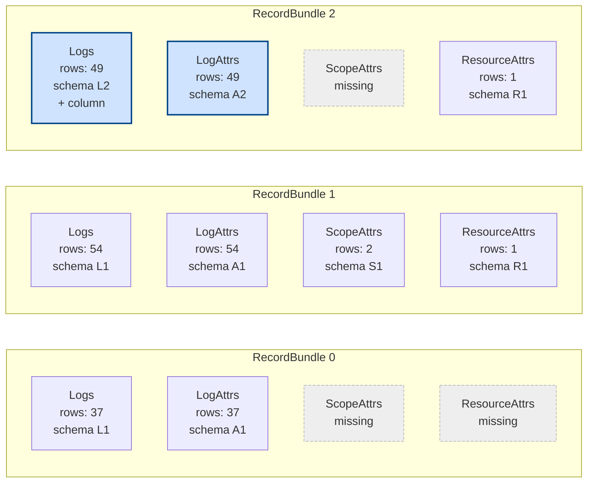
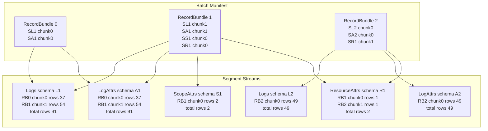
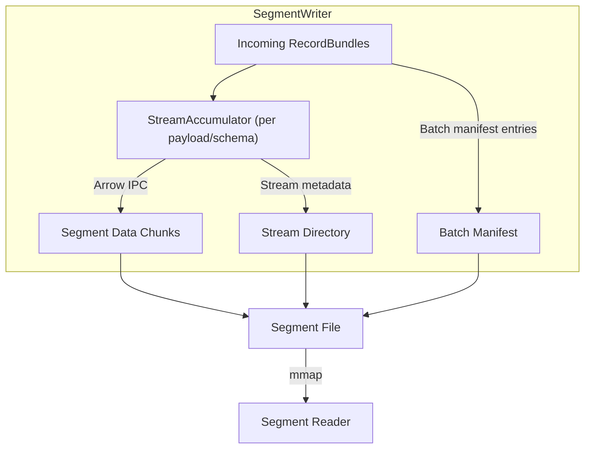
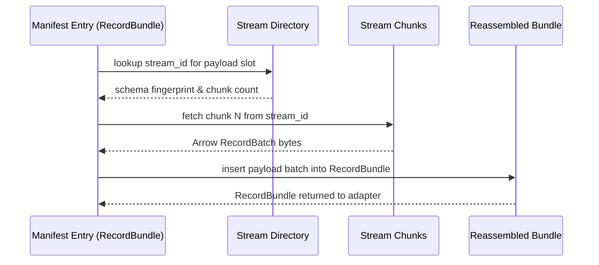

# Proposal: Quiver - Arrow-Based Persistence for OTAP Dataflow

**Status**: Draft for Discussion  
**Date**: 2025-11-03

## Problem Statement

`otap-dataflow` currently operates purely in-memory. We anticipate users needing
**durability**: the ability to survive process crashes and network outages
without data loss.

## Proposed Solution: Quiver

We propose building Quiver: a standalone, embeddable Arrow-based segment store
packaged as a reusable Rust crate. Quiver *does not exist yet*; this document
defines its initial design, scope, and open questions. While it will be
developed first for `otap-dataflow`, we intend to keep it decoupled so it can
integrate into other telemetry pipelines or streaming systems that need durable
buffering around Apache Arrow.

Throughout the proposal we use **RecordBundle** to describe the logical unit
Quiver persists. In OTAP terms this corresponds to an `OtapArrowRecords`
value: a fixed set of payload slots (`Logs`, `LogAttrs`, `ScopeAttrs`,
`ResourceAttrs`, etc.) that may or may not be populated for a given RecordBundle.

### Core Concepts

**Segment Store**: Immutable Arrow IPC files containing batches of telemetry.
Each segment:

- Groups multiple `RecordBundle` arrivals (8-64MB target size) and persists the
  per-slot Arrow streams they reference.
- Supports many payload types and evolving schemas inside the same segment via
  a stream directory + batch manifest.
- Contains metadata: time ranges, signal type (via adapter), schema fingerprints,
  checksum, and per-stream statistics.
- Supports zero-copy memory-mapped reads.

**Write-Ahead Log (WAL)**: Append-only log for crash recovery

- Records batches before segment finalization
- Configurable flush behavior (durability vs. latency trade-off)
- Truncated after segments are persisted

**Open Segment Buffer (In-Memory)**: Bounded in-memory accumulation

- Each incoming `RecordBundle` is appended to the WAL for durability and also
  to the current open segment's per-stream accumulators.
- Buffer size capped by `segment.target_size` (and optionally
  `segment.max_open_duration` for time slicing).
- On finalize trigger (size, duration, shutdown, or retention pressure) Quiver
  flushes each accumulator to its Arrow IPC stream slice and writes the segment
  directory + manifest.
- After the segment file + metadata are durable, the corresponding WAL region
  becomes eligible for truncation.
- Early finalize under pressure reduces memory footprint; metrics expose
  open segment bytes.

Write path overview:

1. Append `RecordBundle` to WAL (optionally flush/fdatasync per policy).
2. Send Ack to upstream producer.
3. Encode bundle payload slots into their stream accumulators (in-memory Arrow
  streaming writers).
4. Finalize: seal builders, assign `segment_seq`, write segment file + metadata.
5. Notify subscribers for each finalized `RecordBundle`; begin per-bundle
  Ack/Nack lifecycle.

**WAL Truncation Safety**:
“Safe” means the WAL entries you are removing are no longer needed for crash
recovery of segment data. Concretely:

1. All batches up to the boundary of one or more finalized segments have been
  serialized into a segment file AND that file plus its metadata have been
  made durable (written and flushed per the configured flush/fsync policy).
2. Those WAL entries are not part of the current open (still accumulating)
  segment.
3. The segment finalization was successful (no partial/corrupt write detected).

Subscriber ACKs are *not* required for truncation—the segment file is the
durable source for replay until retention deletes it. Truncation never removes
WAL entries belonging to:

- The active open segment.
- A segment whose file/metadata durability has not been confirmed.

**Acknowledgement Log (`ack.log`)**: Shared append-only log for subscriber state

- Stores every per-bundle Ack/Nack as `(segment_seq, bundle_index,
  subscriber_id, outcome)`
- Replayed on startup to rebuild each subscriber’s in-flight bundle set and
  advance segment high-water marks once all bundles are acknowledged
- Enables recovery without per-subscriber WALs

**Dual Time & Ordering Semantics**:

- **Event Time**: Timestamp embedded in telemetry (from source).
- **Ingestion Timestamp** (`ingestion_time`): Wall-clock timestamp (UTC) captured
  when data arrives; drives retention windows, metrics, and diagnostics.
- **Ingestion Sequence** (`segment_seq`): Monotonically increasing counter
  assigned per finalized segment; drives delivery ordering, high-water marks,
  and gap detection, independent of wall-clock adjustments.

Retention and queries can use event time (semantic) or ingestion timestamp
(system). The ingestion sequence remains authoritative for stable replay
ordering and tie-breaking. Indexing directly on event time is lower priority
and will follow query feature implementation.

**Pub/Sub Notifications**: Subscribers (exporters) receive notifications when
new segments are ready.

**Multi-Subscriber Tracking**: Each subscriber maintains per-segment bundle
progress; data is deleted only when every subscriber has acknowledged every
bundle (or retention policy overrides). A subscriber’s high-water mark is the
highest contiguous segment whose bundles all have Ack (or dropped) outcomes.
Out-of-order Acks land in a tiny gap set keyed by `(segment_seq, bundle_index)`
so the mark never jumps past a missing bundle. Each bundle Ack decrements the
segment’s outstanding bundle counter; once it reaches zero the segment becomes
eligible for deletion.

Ack/Nack events append to a shared log (single WAL keyed by subscriber ID) so
per-bundle state is replayed after crashes without per-subscriber files. The
shared log (`ack.log`) lives alongside the main WAL. Periodic checkpoints
persist each subscriber’s current high-water mark into the metadata index so
recovery can skip directly to the first gap, replaying the log only for recent
events; bundle gap sets are rebuilt on replay from the same log stream.

### Integration with OTAP Dataflow

Quiver can be placed at different points in the pipeline depending on use case:

#### Option A: Early Persistence (after receiver)

```text
Receiver -> [Quiver Persistence] -> [Signal Processor] -> [Exporters]
                    v
              [WAL + Segments]
```

Protects all raw data; useful during network outages before processing

#### Option B: Late Persistence (after signal processing)

```text
Receiver -> [Signal Processor] -> [Quiver Persistence] -> [Exporters]
                                        v
                                  [WAL + Segments]
```

Protects processed data; smaller footprint, buffers during downstream outages

- **Optional**: Persistence is an optional component; disable for pure memory
  streaming.
- **Per-Core**: Each core has its own Quiver instance (no cross-core locking).
- **Durability**: When enabled, data is acknowledged after WAL flush; segment
  finalization happens after.
  (Acknowledgement refers to durability, not subscriber delivery; delivery
  notifications occur only after segment finalization. Memory use is bounded by
  the open segment's configured target size.)

### Key Design Choices

1. **Standalone Crate**: Separate Rust library with minimal dependencies;
  embeddable in any telemetry pipeline.
2. **Arrow-Native**: Leverage Arrow IPC format for zero-copy, language-agnostic
  storage.
3. **Immutable Segments**: Once finalized, segments never change.
4. **Single Writer**: Each Quiver instance has one writer.
5. **Bounded Resources**: Configurable caps on WAL size, segment count,
  retention window.
6. **Cross-Platform**: Works on Linux, Windows, and macOS with minimal
  dependencies.
7. **Dual Persistence Path**: WAL provides first durability; open segment
  builders hold data in memory until segment finalization. This avoids reading
  back WAL bytes to build Arrow structures, trading bounded memory for lower
  finalize latency.
8. **Default Strict Durability**: `backpressure` is the default size-cap
  policy, guaranteeing no segment loss prior to acknowledgement; `drop_oldest`
  must be explicitly selected to allow controlled loss.

### Terminology

- **RecordBundle**: The generic ingestion unit Quiver stores in a segment.
  Conceptually, it is a fixed-width array of optional payload type slots (e.g., slot
  0 = root records, slot 1 = resource attributes). The type only exposes
  `arrow::record_batch::RecordBatch` values plus metadata needed to compute a
  schema fingerprint and row count.
- **Payload Type Slot**: A stable identifier within a `RecordBundle`. Each slot maps
  to exactly one logical payload kind for the embedding system. OTAP assigns
  slots to `Logs`, `LogAttrs`, `ResourceAttrs`, etc.; another integration can
  provide its own slot table.
- **Stream**: The ordered sequence of Arrow IPC messages Quiver writes for a
  `(slot, schema_fingerprint)` pairing inside a segment.
- **Stream Directory**: The header table that records every stream’s id, slot,
  schema fingerprint, byte offset, byte length, and statistics.
- **Batch Manifest**: The ordered list of `RecordBundle` arrivals. Each entry
  lists the `(stream_id, chunk_index)` to read for every payload slot that was
  present in the bundle.
- **Adapter**: A thin crate-specific shim that converts between the embedding
  project’s structs (for OTAP: `OtapArrowRecords`) and Quiver’s generic
  `RecordBundle` interface.

### OTAP RecordBundle Primer

- Each OTAP batch (an `OtapArrowRecords` value) maps to a `RecordBundle`
  through the OTAP adapter.
- Slots correspond to OTAP payload types (`Logs`, `LogAttrs`, `ScopeAttrs`,
  `ResourceAttrs`, etc.).
- During persistence, each slot’s `RecordBatch` is encoded into a stream
  whenever it is present.



The example highlights three consecutive `RecordBundle`s.
Bundle 0 omits the `ScopeAttrs` and `ResourceAttrs` slots entirely,
so those payloads never emit a stream chunk.
Bundle 1 carries the full set of payloads;
each slot already has its own fingerprint (L1, A1, S1, R1)
even though none changed between bundle 0 and 1.
Bundle 2 shows schema drift for the `Logs` slot (`schema L2` with an
additional column) and for `LogAttrs` (`schema A2`), while `ResourceAttrs`
remains on R1 and `ScopeAttrs` is still absent.
Quiver writes separate Arrow streams for every `(slot, schema)` combination
and uses the batch manifest to link each bundle back to the correct stream
chunks when reading segment files.



Each stream holds the serialized Arrow `RecordBatch` messages for a particular
`(slot, schema)` fingerprint. The manifest references those batches by stream
id and chunk index so the reader can reassemble the original `RecordBundle`
values.

### Multi-Schema Segment Format

Quiver segments are containers around Arrow IPC streams plus a manifest that
describes how those streams reassemble back into the `RecordBundle`
abstraction used by the embedding pipeline.

#### Envelope Overview

- The segment header contains two primary sections:
  - `stream_directory`: one entry per `(payload_type, schema_signature)` pairing
    with stream id, payload kind (Logs, LogAttrs, ScopeAttrs, ResourceAttrs,
    etc.), schema fingerprint, byte offset, and byte length.
  - `batch_manifest`: ordered entries for every `OtapArrowRecords` that arrived
    while the segment was open. Each manifest row lists, per payload slot,
    `stream_id` + `chunk_index` pairs pointing back into the directory.
- Writers reuse a stream id whenever a payload arrives with the same schema
  fingerprint; schema evolution during the segment allocates a new stream id.
- No control records are serialized; the manifest fully describes the replay
  order without embedding markers inside the Arrow buffers.



#### Arrow IPC Encoding

- While a segment is open, Quiver appends messages to each stream using the
  Arrow **streaming** format so we can keep adding batches without rewriting
  footers.
- On finalize, each stream flushes any buffered messages, writes an Arrow
  **file** footer, and aligns the slice on an 8-byte boundary. The header stores
  the final offsets and lengths so readers can memory map the slice and hand it
  directly to `arrow_ipc::FileReader`.
- During replay, the reader consults the manifest to rebuild each
  `RecordBundle`, hydrating only the payloads the consumer requested.



#### Dictionary Handling

- Each `(slot, schema)` stream keeps dictionary encoding intact. While bundles
  accumulate we capture the union of dictionary values per column. When
  finalizing the segment we rebuild those columns against a deterministic
  vocabulary and emit the Arrow IPC **file** with the canonical dictionary in
  the header. Readers reopen the slice via `arrow_ipc::FileReader`, which
  replays the seeded dictionaries before yielding the chunk referenced by the
  manifest.
- Dictionaries stay deterministic for the lifetime of a stream because the
  final vocabulary is chosen from the accumulated batches. If a stream would
  exceed configured cardinality limits we rotate to a fresh stream (resetting
  dictionary ids) rather than serializing delta messages. That mirrors the
  in-memory lifecycle in `otap-dataflow` and keeps chunks self-contained.

#### DataFusion Integration

- otap-dataflow will eventually ship a `FileFormat` that exposes one payload type
  at a time. `infer_schema()` returns the **representative schema** for that payload:
  the union of all columns observed in the segment (or across selected segments)
  with types promoted to the widest compatible Arrow type.
- During reads the DataFusion/quiver adapter reorders columns, inserts placeholder
  arrays for omitted fields, and casts as needed so DataFusion receives a stable
  schema even when telemetry batches vary.
- Representative schemas live alongside the stream directory, allowing a table
  provider to merge schemas across multiple segments without touching the
  underlying Arrow buffers.

### OTAP Payload Representation in Quiver

- The otap-dataflow crate provides an adapter that implements Quiver’s
  `RecordBundle` interface on top of `OtapArrowRecords`, mapping slot ids to
  the OTAP payload enum (`Logs`, `LogAttrs`, `ScopeAttrs`, etc.).
- Each `OtapArrowRecords` value is treated as a bundle of payload-specific
  `RecordBatch` values. Within a segment, the manifest records the ordering of
  payloads so replay reconstructs the familiar `[Option<RecordBatch>; N]`
  structure for logs, traces, or metrics before handing control back to the
  adapter.
- Optional payloads simply do not emit a stream for that batch. Optional
  columns drop from the schema signature; when the column reappears it yields a
  new stream id with the expanded schema.
- Per-segment dictionaries reset at segment boundaries, matching today’s
  in-memory lifetime: high-cardinality attributes force an early finalize and
  avoid unbounded growth.
- Segment metadata keeps per-stream statistics (row count, column omit bitmap)
  so readers can quickly decide which payload types to materialize.
- When many segments are queried together, the table provider unions their
  representative schemas per payload type, ensuring DataFusion sees a single,
  coherent schema without re-serializing the Arrow buffers.

### Retention & Size Cap Policy

Quiver keeps disk usage low with two layers of cleanup:

- **Steady-state cleanup** (runs continuously): when a segment's outstanding count
  drops to zero, it is queued for deletion. Each core drains its queue during the
  next finalize or maintenance tick and deletes the oldest fully processed segments
  immediately. Optional knob `retention.steady_state_headroom` can reserve a tiny
  buffer (default near zero) if operators want a small on-disk spool even in
  healthy operation.

- **Size-cap safety net** (invoked when usage still exceeds the configured cap):

  1. Evict oldest fully processed segments until usage <= cap.
  1. If still over cap:

  - `backpressure` (default): slow or reject ingestion until step 1 becomes
    possible (strict durability: no pre-ack loss).
  - `drop_oldest`: remove oldest unprocessed data (prefer finalized; else WAL /
    open buffers) to preserve throughput under emergencies.

  1. Optionally finalize a large open segment early so it becomes eligible for the
     next cleanup pass.

Only `drop_oldest` permits deleting finalized-but-unprocessed data; otherwise
Quiver preserves data and throttles intake until subscribers catch up.

Config key:

```yaml
retention.size_cap_policy: backpressure | drop_oldest  # default: backpressure
```

Metrics to observe:

```text
quiver.gc.evictions_total{reason="size"}
quiver.retention.size_emergency_total  # future
quiver.ingest.throttle_total           # when backpressure triggers
```

Durability guarantee (default policy): With the default `backpressure` policy
Quiver guarantees zero segment loss prior to subscriber acknowledgement.
Segments are deleted only after all subscribers have acked every bundle within
them (or they age out per retention time windows). Choosing the optional
`drop_oldest` policy
explicitly authorizes controlled segment loss during size emergencies; each
evicted segment is recorded as a synthetic `dropped` outcome for affected
subscribers and surfaced via metrics.

#### Gap Set Interaction with `drop_oldest`

`drop_oldest` must not leave subscribers with permanent, unfillable gaps. If a
size emergency forces eviction of a finalized segment that still has unacked
bundles for any subscriber, Quiver records synthetic `dropped` outcomes for
each outstanding `(segment_seq, bundle_index, subscriber_id)` in `ack.log`
before deletion.

- `dropped` is treated like an `ack` for advancing the high-water mark (HWM)
  and immediately removes the bundle from the subscriber’s gap set.
- HWM only advances across a contiguous run of bundles with `ack` or
  `dropped`; real gaps still block.
- Without this, deleting a gap bundle would freeze the subscriber's HWM
  forever and distort lag metrics.

Metrics:

```text
quiver.subscriber.dropped_bundles_total    # increments per subscriber per dropped bundle
quiver.segment.dropped_total               # unique segments that lost bundles pre-ack
```

Operators that require strict delivery semantics (never convert missing data to
`dropped`) must select `backpressure`; that policy retains unprocessed segments
and throttles instead of synthesizing outcomes.

### Multi-Core Coordination

`otap-dataflow` runs one persistence instance per core but all cores share a
single storage directory. Steady-state cleanup happens locally. Size-cap
enforcement will initially be a simple scheme of dividing the cap evenly per core.
A more sophisticated algorithm (Phase 2) will require a small amount of coordination.

#### Phase 1: Per-Core Static Cap (Initial Implementation)

Initial approach: divide `retention.size_cap` evenly across N cores
(`per_core_cap = total_cap / N`). Each core enforces its slice exactly like a
single-core instance; no shared atomics or coordination. On hitting its cap a
core applies `drop_oldest` or `backpressure` locally.

Pros: zero cross-core contention, simplest code, fastest path to prototype.
Cons: global usage can temporarily exceed total cap by up to roughly
`(N - 1) * segment_target_size`; reclaimable fully processed segments may sit
on idle cores while a hot core throttles.

Metrics: `quiver.core.bytes{core_id}`, `quiver.core.cap_fraction` to spot
imbalance.

#### Phase 2: Fair Eviction with Minimal Coordination (to be designed)

Phase 2 (TBD) will introduce a fair eviction approach instead of
a naive per-core cap. Preliminary goals:

- Distribute eviction work (no single-core dependency).
- Accomodate fair eviction when some threads may be blocked on other work.
- Minimal coordination overhead (brief atomic claims, no long-lived tokens).
- Preserve ordering; escalate to unprocessed deletion only under `drop_oldest`.
- Limit transient overshoot to ~one segment per concurrently finalizing core.

### Complete otap-dataflow Persistence Configuration Example

```yaml
nodes:
  otlp_receiver:
    kind: receiver
    plugin_urn: "urn:otel:otlp:receiver"
    out_ports:
      out_port:
        destinations:
          - persistence
        dispatch_strategy: round_robin
    config:
      listening_addr: "127.0.0.1:4317"
      response_stream_channel_size: 256 # Required: channel buffer capacity (number of messages)

  otap_receiver:
    kind: receiver
    plugin_urn: "urn:otel:otap:receiver"
    out_ports:
      out_port:
        destinations:
          - persistence
        dispatch_strategy: round_robin
    config:
      listening_addr: "127.0.0.1:4318"
      response_stream_channel_size: 256 # Required: channel buffer capacity (number of messages)

  persistence:
    kind: processor
    plugin_urn: "urn:otap:processor:persistence"
    out_ports:
      out_port:
        destinations:
          - otap_exporter
          - otlp_exporter
        dispatch_strategy: round_robin
    config:
      path: ./quiver_data  # Platform-appropriate persistent storage location
      segment:
        target_size: 32MB
      wal:
        max_size: 4GB
        flush_interval: 25ms
      retention:
        max_retain_after_ingestion_hours: 72
        size_cap: 500GB
        size_cap_policy: drop_oldest  # or backpressure

  otap_exporter:
    kind: exporter
    plugin_urn: "urn:otel:otap:exporter"
    config:
      grpc_endpoint: "http://{{backend_hostname}}:1235"
      compression_method: zstd
      arrow:
        payload_compression: none
  otlp_exporter:
    kind: exporter
    plugin_urn: "urn:otel:otlp:exporter"
    config:
      grpc_endpoint: "http://127.0.0.1:4318"
      # timeout: "15s"  # Optional: timeout for RPC requests
```

### Example: Dual Exporters with Completion Tracking

Consider a single `persistence` node feeding both a Parquet exporter (local file
writer) and an OTLP exporter (remote endpoint). Each exporter is a Quiver
subscriber with its own cursor and participates in the OTAP Ack/Nack protocol.

Happy-path flow for segment `seg-120` (4 MiB, 3 `RecordBundle`s):

1. Incoming batches append to the WAL and accumulate in the in-memory open
  segment until finalize triggers; then the data is written as `seg-120.arrow`.
1. Quiver enqueues a notification for `parquet_exporter` and `otlp_exporter`.
1. Each exporter drains the segment’s three bundles in order and, after
  finishing each bundle, emits `Ack(segment_seq, bundle_index)` (or `Nack`) back
  to Quiver. The consumer-side cursor only advances to the next bundle once the
  acknowledgement for the current bundle is recorded.
1. On every Ack/Nack Quiver appends a record to the shared acknowledgement log:

  ```text
  ts=2025-11-10T18:22:07Z  segment=seg-120  bundle=0  subscriber=parquet_exporter  ack
  ts=2025-11-10T18:22:07Z  segment=seg-120  bundle=0  subscriber=otlp_exporter     ack
  ts=2025-11-10T18:22:08Z  segment=seg-120  bundle=1  subscriber=parquet_exporter  ack
  ts=2025-11-10T18:22:08Z  segment=seg-120  bundle=1  subscriber=otlp_exporter     ack
  ts=2025-11-10T18:22:09Z  segment=seg-120  bundle=2  subscriber=parquet_exporter  ack
  ts=2025-11-10T18:22:10Z  segment=seg-120  bundle=2  subscriber=otlp_exporter     ack
  ```

1. Once every subscriber has acknowledged bundle `0..=2` for `seg-120`, the
  segment’s outstanding bundle count drops to zero and it becomes eligible for
  eviction according to the retention policy.
1. During crash recovery Quiver replays the acknowledgement log alongside the
  WAL to restore per-subscriber high-water marks; no per-subscriber WAL files
  are required.

Nack handling reuses the same log: Quiver records the nack, retries delivery for
the specific `(segment_seq, bundle_index)` according to OTAP policy, and keeps
the segment pinned until every subscriber eventually acks each bundle or the
operator opts to drop data via `drop_oldest` (which synthesizes `dropped`
entries for the missing bundles).

### Future Enhancements

- Ability to query over persisted data (e.g., per-node aggregations,
  DataFusion, etc.).
- Indexing.
- Configurable policy for recovery prioritization (new arrivals vs. old data,
  forward vs. reverse replay, etc.).
- Consider support for storing finalized immutable Arrow IPC segments in an
  object store.
- Kubernetes support (review for any k8s specific requirements for configuring
  and/or supporting a quiver store).

### FAQ

**How does this differ from Kafka?**: Quiver is an in-process Arrow segment
buffer embedded in `otap-dataflow`. It keeps data local, uses existing pipeline
channels and Arrow IPC, and has no broker cluster, network protocol, or
multi-topic replication. Kafka is a distributed log service. Quiver is a
lightweight durability layer for one collector.

**Do I need to run extra services?**: No. Quiver ships as a Rust crate inside the
collector. Storage lives on the same node; coordination is via shared memory
atomics, not external daemons.

**What happens on crash recovery?**: On restart we replay the data WAL to rebuild
segments, replay `ack.log` to restore subscriber high-water marks, and immediately
resume dispatch. Segments whose every bundle was acknowledged by all subscribers
before the crash are eligible for deletion as soon as the steady-state sweeper runs.

## Success Criteria

- Zero data loss across process restarts and network outages
- Automatic retry/forwarding once downstream systems recover
- Minimal performance impact on streaming path (<5% overhead)
- Aggressive cleanup: data deleted as soon as all exporters confirm receipt

## Next Steps

1. Community feedback on this proposal
2. Proof-of-concept: Basic WAL + segment creation + replay
3. Benchmark: Measure overhead on streaming pipeline
4. Iterate: Refine based on real-world usage patterns

### Open Questions

- Subscriber lifecycle: how do we register/deregister subscribers and clean up state
  when exporters are removed permanently?
- Ack log scale: what rotation/checkpoint policy keeps replay time bounded under
  heavy churn?
- Observability: which metrics/logs expose ack log depth, gap set size, and
  eviction/backpressure activity so operators can react early?
- Policy interaction: how does time-based retention interact with the size-cap
  safety net and steady-state sweeper - should one take precedence?
- Failure handling: what safeguards do we need if `ack.log` or metadata become
  corrupted (checksums, repair tools, etc.)?

---

**Feedback Welcome**: Please comment on architecture choices, use cases to
prioritize, or concerns about complexity / performance.
