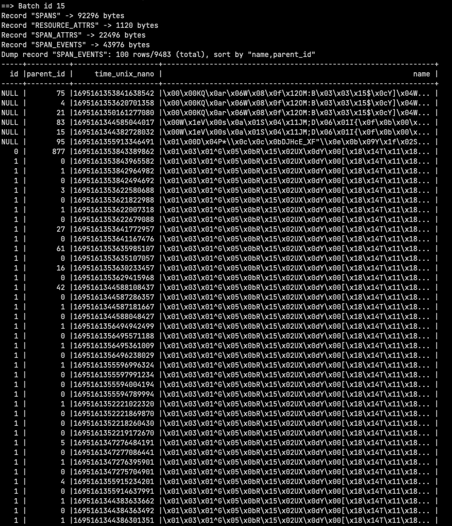
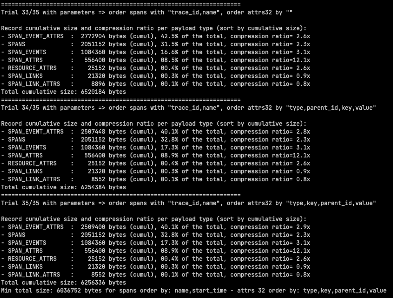
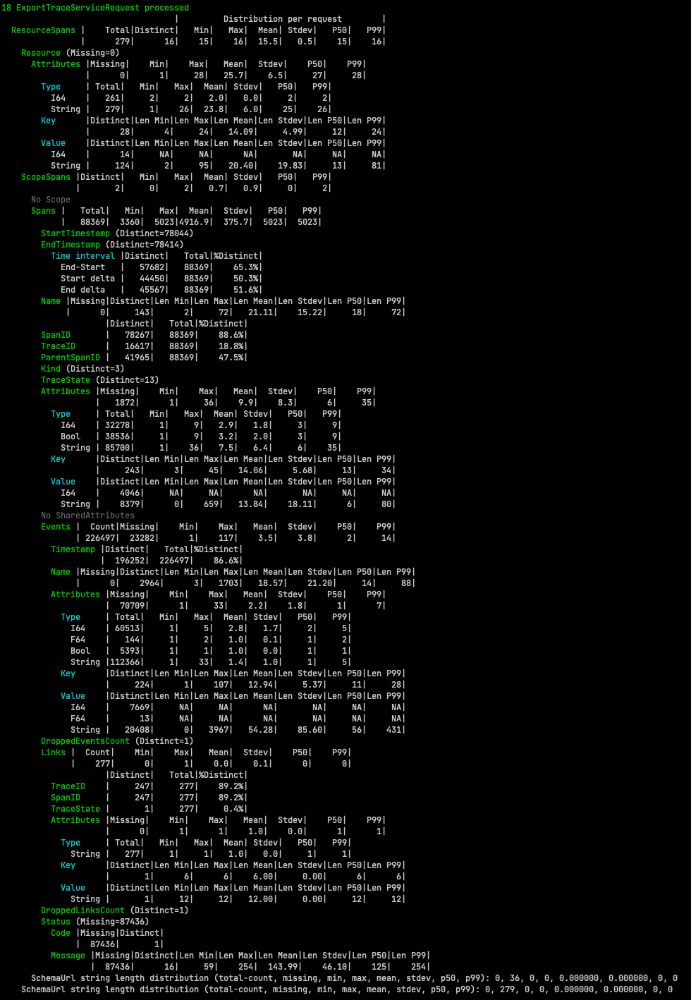
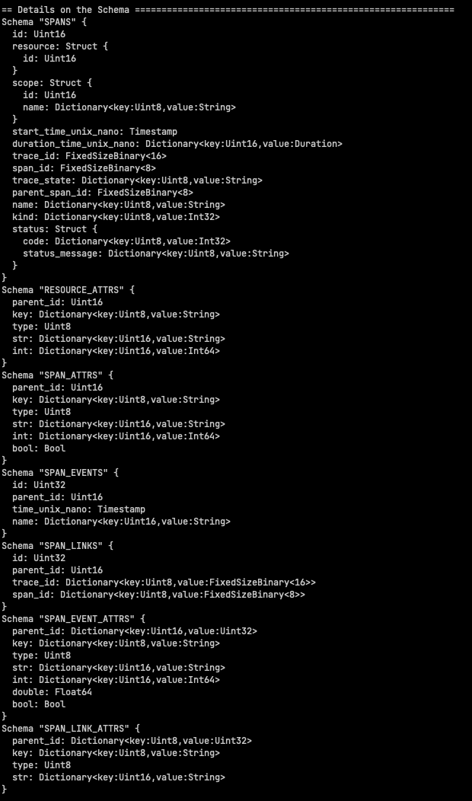
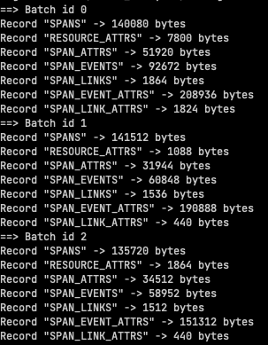
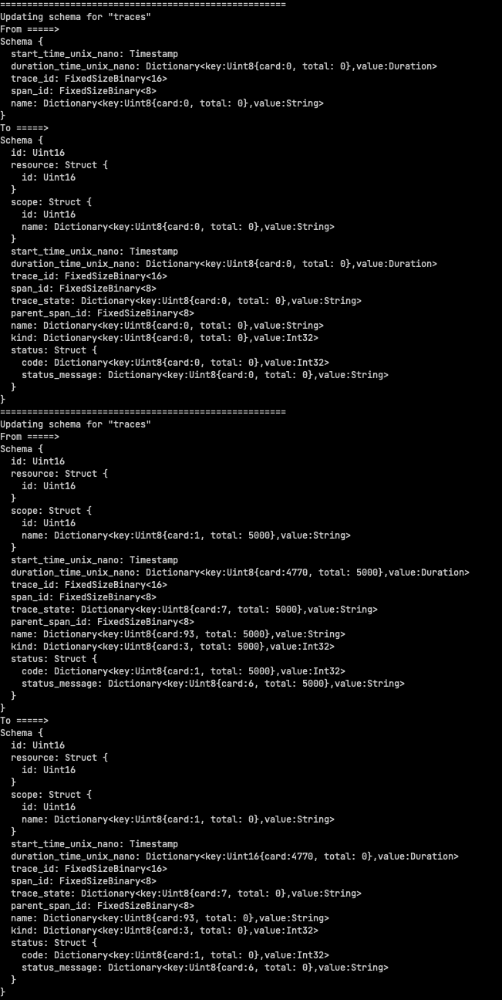

# Trace Analyzer

This tool is designed for trace analysis and the generation of statistical
reports. Its primary function is to ascertain how a given trace dataset is
encoded using the OTel Arrow Protocol.

To view statistics for all .zst files, use the command below. These files should
be in JSON format, compressed with ZSTD and bearing the .zst extension. Batches
are configured to handle 2,000 spans.

```shell
go run tools/traces_analyzer/main.go -format json -batch-size 2000 -all *.zst
```

## Supported flags

By default, there is no flag enabled. All these flags are cumulative.

| Flag               | Description                                                                          |
|--------------------|--------------------------------------------------------------------------------------|
| -schema-stats      | Display Arrow schema statistics (see [details](#schema-stats-output))                |
| -record-stats      | Display Arrow record statistics (see [details](#record-stats-output))                |
| -schema-updates    | Display Arrow schema updates (see [details](#schema-updates-output))                 |
| -producer-stats    | Display OTel Arrow producer statistics (see [details](#producer-stats-output))       |
| -compression-ratio | Display compression ratio per record type (see [details](#compression-ratio-output)) |
| -all               | Display all statistics and updates                                                   |

## Supported formats

Use the `-format` option to specify the format of your input file.

| Format | Description                                                |
|--------|------------------------------------------------------------|
| json   | JSON format (compressed with ZSTD and with extension .zst) |
| proto  | Protobuf format                                            |

## Dump data per record type

Use these options to dump `<n>` rows per Arrow record type (e.g. spans,
span-attrs, ...).

> Note: These options require the `-record-stats` flag to be enabled.

| Option                    | Description                                                 |
|---------------------------|-------------------------------------------------------------|
| -spans=<#rows>            | Number of spans to display per Arrow record                 |
| -resource-attrs=<#rows>   | Number of resource attributes to display per Arrow record   |
| -span-attrs=<#rows>       | Number of span attributes to display per Arrow record       |
| -span-events=<#rows>      | Number of span events to display per Arrow record           |
| -span-links=<#rows>       | Number of span links to display per Arrow record            |
| -span-event-attrs=<#rows> | Number of span event attributes to display per Arrow record |
| -span-link-attrs=<#rows>  | Number of span link attributes to display per Arrow record  |

The following screenshot shows the output of the `-span-events=<n>` option.



## Test sorting

The option `-test-sorting` can be used to test all the combinations of sorting
arrow records. This option is useful to ensure that the default sorting is
working correctly.

> Note: This option should not be combined with any other option.

The following screenshot is an example of the output. At the end, the best
combination is displayed.



## Schema-stats output

For each batch (i.e. instance of ExportTraceServiceRequest), the following
statistics are generated. These statistics are cumulative across all batches and
provide a high-level overview of the trace dataset.

With this option, you can determine the total number of resource spans, scope
spans, spans, ... in the trace dataset. But also the min/max/avg number of spans
per scope span, events per span, links per span, attributes per span, ...



At the end a detailed view of the Arrow schema for each record type is
displayed.



## Record stats output

This option displays the number of bytes (after compression) per record type for
each batch.



## Schema updates output

This option displays all the schema update events that occurred during the
processing of the trace dataset. For each schema update, the previous (from) and
new schema are displayed (to).



## Producer stats output

This option displays various statistics about the OTel Arrow producer. See below
for more details.


## Compression ratio output

This option displays the compression ratio per record type. The records are
displayed by decreasing cumulative size.

The total number of bytes across all batches is displayed at the end (compressed
size).


