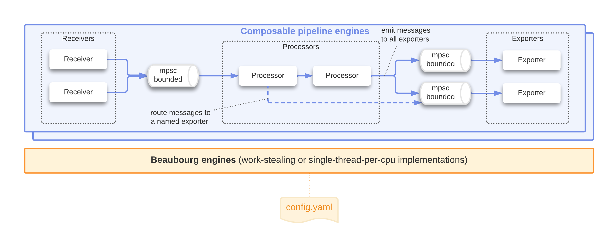

[](https://github.com/clap-rs/clap/blob/v3.1.0/LICENSE-APACHE)

# Beaubourg

<table style="border-collapse: collapse; border: none!important;">
<tr style="border-collapse: collapse; border: none!important; padding: 0;">
<td style="border-collapse: collapse; border: none!important; padding: 0; vertical-align: top;">
Beaubourg is a lightweight Rust library for building generic pipelines consisting of a collection of receivers,
processors, and exporters. This library was initially implemented in the context of the Otel Arrow Project but
can be used in many other contexts.</br></br>Note: Beaubourg is an iconic French architectural building whose characteristic features are an assembly of pipes
connected to each other.
</td>
<td style="border-collapse: collapse; border: none!important;"></td>
</tr>
</table>

## Getting started

For the impatient, a complete example can be found in
[examples/simple_pipeline.rs](examples/multithread_engine_example).

## Concepts and pipeline semantic

Beaubourg is a library to build **pipelines** combining 3 types of components:
**receiver**, **processor**, and **exporter**. The inputs of the pipeline are
represented by one or more receivers connected to a chain of processors which
are themselves connected to one or more exporters representing the outputs of
the pipeline.

A pipeline must have at least one receiver and one exporter, processors are
optional. The receivers are executed in parallel and are not connected to each
other. The processors form a chain, where the first processor consumes the data
of the receivers, transform the data and emit the data for the next processor or
for the exporters when the processor is the last of the processor chain. The
exporters are executed in parallel and are not connected to each other.
Optionally, a processor can send its result to a specific receiver.

An **engine** is an execution environment for one or more pipelines running in
parallel.

A configuration file is used to define the receivers, processors, exporters, and
their connections. A more programmatic way is possible.

## Design principles

The following design principles are followed in Beaubourg:

- **Simple to use**: complex async constructions are intentionally internalized
  in the engine itself. Users of this library do not have to worry about them.
- **Simple to extend**: new receivers, processors, and processors can be defined
  by the users via a set of factories. The message type is a generic type of the
  pipeline.
- **Efficient engine**: the engine is responsible for selecting an efficient
  mechanism to run and connect the components together. The same pipeline
  description can be executed with different internal components depending on
  the execution context.
- **Customizable engine**: different custom engines can be used depending on the
  context.

## Architecture overview

Below is an example of pipeline using Tokio channels connecting receivers,
processors, and exporters.




> Note: Depending on the context and the evolution of the async ecosystem,
> Beaubourg can change the internal mechanisms connecting and executing the
> pipeline components.

## Public API

Async versions of receiver, processor, and exporter.

```rust,ignore
#[async_trait]
pub trait AsyncReceiver<Msg: 'static + Clone + Send>: Send {
    // Optional methods
    async fn init(&mut self, engine_handler: &mut EngineHandler) -> Result<(), Error> { Ok(()) }
    async fn stop(&mut self) -> Result<(), Error> { Ok(()) }

    // Mandatory methods,
    async fn receive(&mut self, signal_receiver: SignalReceiver, effect_handler: EffectHandler<Msg>) -> Result<(), Error>;
}

#[async_trait]
pub trait AsyncProcessor<Msg: 'static + Clone + Send>: Send {
    // Optional methods
    async fn init(&mut self, engine_handler: &mut EngineHandler) -> Result<(), Error> { Ok(()) }
    async fn stop(&mut self) -> Result<(), Error> { Ok(()) }

    // Mandatory methods
    async fn process(&mut self, signal: Signal<Msg>, effect_handler: &mut EffectHandler<Msg>) -> Result<(), Error>;
}

#[async_trait]
pub trait AsyncExporter<Msg: 'static + Clone + Send>: Send {
    // Optional methods
    async fn init(&mut self, engine_handler: &mut EngineHandler) -> Result<(), Error> { Ok(()) }
    async fn stop(&mut self) -> Result<(), Error> { Ok(()) }

    // Mandatory methods
    async fn export(&mut self, signal_receiver: SignalReceiver<Msg>, effects_handler: EffectHandler<Msg>) -> Result<(), Error>;
}
```

ToDo: Need more thoughts on msg_type.

Common parameters:

- **EngineHandler**: A EngineHandler is the interface through which a receiver,
processor, or exporter can specify requirements to the engine or request access
to some sub-components during the initialization phase.
- **Message** : A message is the unit of data produced, processed, and consumed
by receivers, processors, and exporters of the pipeline. For efficiency,
messages are produced, processed, and consumed in batch.
- **Signal**: A signal is either an TimerTick signal (triggered by a configured
  timer), a batch of messages, or a stop signal.
- **SignalReceiver**: An SignalReceiver is the interface through which an
  exporter can receive new signals from the engine.
- **EffectHandler**: An EffectHandler is the interface through which a receiver,
processor, or exporter can act on the pipeline. Receivers and processors use
their corresponding effect handler to produce messages. Exporters use their
effect handler to signal some action to the engine (TBD).

## Configuration file

Each configuration file follow this general structure:

```yaml
receivers:
  # declaration of all the receivers with their corresponding configuration
processors:
  # declaration of all the processors with their corresponding configuration
exporters:
  # declaration of all the processors with their corresponding configuration
extensions: {}
service:
  extensions: []
  # definition of the different pipelines the system must instantiate
  pipelines:
    // Name of pipeline
    pipeline-name:
      receivers: [ ... list of receivers to instantiate for this pipeline ... ]
      processors: [ ... list of processors to instantiate for this pipeline ... ]
      exporters: [ ... list of exporters to instantiate for this pipeline ... ]
```

Custom receivers, processors, and exporters are defined with factories provided
to the Config::load function. Each specific receiver, processor, and exporter is
responsible to define its name, its custom configuration and obviously its
behavior.

## API stability

The following rules are followed to make the public API as stable as possible:

- All public errors are marked as `#[non_exhaustive]` enums.
- All public errors are not exposing internal libraries.
- All public enums with an open definition must be marked as
  `#[non_exhaustive]`.
- All public structs with an open definition must be marked as
  `#[non_exhaustive]`.
- Internal mechanisms and dependencies are hidden behind concepts such as
  EngineHandler and EffectHandler.

## License

[Apache Software License version 2.0](./LICENSE).
