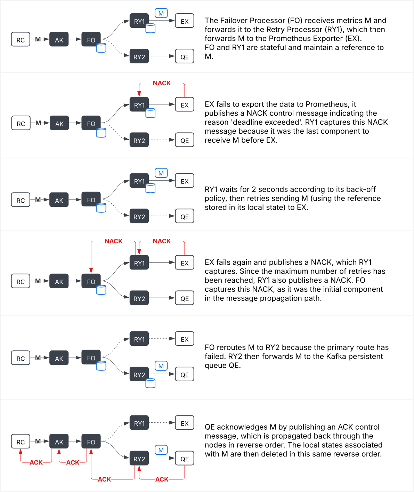

# Dataflow Mechanics

## Introduction

This document describes the various components and operational mechanics of the dataflow runtime used in Phase 2 of this
project. We aim to unify the pipeline and connector concepts into a single dataflow concept consisting exclusively of
receivers, processors, and exporters. This design will:

1. Support a standard OpenTelemetry pipeline configuration with or without connectors (via an adaption layer).
2. Support more complex scenarios in a simpler, more composable, and more uniform manner.

## Telemetry Signal Types and Streams

The telemetry signals supported by this dataflow runtime adheres to OpenTelemetry’s defined data model, encompassing:

- Metrics Stream (denoted as `M` in this document).
- Logs Stream `L`
- Traces Stream `T`
- Events Stream (`E` - typically embedded within Logs or Traces)

Throughout this document, the following notation will be used consistently:

- `A`: Represents a stream containing any combination of telemetry signal types (Metrics, Logs, Traces, Events).
  Example: `A = {M, L, T, E}` or any subset of this set.
- `M | L`: Denotes a single stream containing a mixture of Metrics and Logs.
- `M & L`: Represents two separate, parallel streams: one for Metrics and one for Logs.

These streams are composed of messages containing two parts: an envelope part and a data batch part. The envelope part
includes headers that characterize the message without interpreting the data batches themselves. These headers can
either be received externally (e.g., authorization tokens) or injected by components within the dataflow (e.g., deadline
header). The headers may carry metadata utilized by downstream components for processing decisions.

An unique ID is assigned to each incoming message, allowing the dataflow runtime to track the message throughout the
dataflow. This ID is used to correlate messages across different telemetry streams and to manage acknowledgments.

`Msg = {ID, Envelope, OTAP Data}`

> Note: OTAP Data is a batch of telemetry data in OpenTelemetry with Apache Arrow Protocol format.

## Control Signal Types and Propagation

A dataflow runtime utilizes internal control signals to enforce delivery guarantees, latency requirements, and resource
constraints, as well as to manage general system operations. The following signals are defined:

- **Acknowledgement Signal** (ACK): Indicates that a downstream component (either internal or external) has reliably
  received and processed telemetry data.
- **Negative Acknowledgement Signal** (NACK): Indicates that a downstream component (either internal or external) failed
  to process or deliver telemetry data. The NACK signal includes a reason, such as exceeding a deadline, downstream
  system unavailability, or other conditions preventing successful processing.
- **Cancellation Request Signal** (`CAN`): Indicates the cancellation of a telemetry message.
- **Resource Budget Signal** (`REB`): Indicates the system’s capacity to accept additional telemetry data. A `REB` value
  of zero signifies no further acceptance, while a non-zero `REB` defines permissible data acceptance conditions (e.g.,
  message size, rate limits).
- **Timer Signal** (`TMR`): Emitted upon timer expiration, used to trigger scheduled tasks (e.g., batch emissions).
- **Error Signal** (`ERR`): Represents errors encountered by the dataflow components.
- **Configuration Request Signal** (`CFG`): Indicates a change in the configuration of a component. For example, a `CFG`
  signal can instruct a Filter Processor to include or exclude certain attributes, or notify a Retry Processor to adjust
  backoff settings.
- **Shutdown Signal** (`KIL`): Indicates the system is shutting down.

The control signals are summarized with the abbreviation `CTRL`. `CTRL` can be any of the control signals listed above.

All components participating in a dataflow must take into account the deadline header.

> Question: Do we really need to support cancellation requests?

### Reverse Propagation Mechanism

Components within the dataflow may subscribe to these signals to trigger specific behaviors or policies. When multiple
components subscribe to a single control signal, the dataflow runtime employs a **reverse propagation mechanism**. This
mechanism propagates signals starting from components nearest to the signal’s origin in the dataflow graph, moving
backward toward the receivers. Each triggered component may decide whether to propagate the signal further upstream or
terminate propagation at its level.

## Dataflow Components

Dataflows are represented as **Directed Acyclic Graphs** (DAGs) composed of interconnected nodes. Each node accepts 0 to n
input streams and produces 0 to m output streams. Dataflows are free from cycles.

Nodes are categorized into three types:

- **Receivers** a.k.a. sources (`RC`): Nodes interfacing the dataflow runtime with external telemetry sources. Receivers have 0 input
  streams. All receivers must support handling of `REB` signals. Receivers are expected to reduce or halt acceptance of
  telemetry data when `REB` indicates insufficient resources. Examples of receiver signatures:
  - Receiver producing any signal type: `(RC:ID)-[A]->` (e.g., OTLP receiver). 
  - Receiver producing only metrics: `(RC:ID)-[M]->` (e.g., Prometheus receiver).
- **Processors** (`PR`): Nodes performing intermediate transformations, such as routing, filtering, enrichment, and similar
  operations. Example signatures:
  - General-purpose processor: `-[A]->(PR:ID)-[A]->`.
  - Metrics-filtering processor: `-[A]->(PR:ID)-[M]->`.
  - Type-based router: `-[A]->(PR:ID)-[M & L]->`.
- **Exporters** a.k.a. sinks (`EX`): Nodes that interface the dataflow runtime with external data consumers or storage systems.
  An exporter doesn't produce any output stream for the dataflow itself, so its signature is empty on the producer side.
  Example signatures:
  - Any signal type: `-[A]->(EX:ID)`.
  - Metrics only: `-[M]->(EX:ID)`.

The component signatures provide a quick overview of the regular component’s input and output streams. However, all
dataflow components (receiver, processor, exporter) can receive, produce, or propagate control signals. Those control
signals are not part of the component signature to keep the notation simple.

### Processors

Three categories of processors have been identified so far.

#### Routing Processors

- **Type Router** (`TR`): Routes telemetry data based on signal type (Metrics, Logs, Traces).
  - Statefulness: Stateless
- **Content Router** (`CR`): Routes telemetry data based on defined content conditions (e.g., attribute matching).
  - Statefulness: Stateless
- **Failover Router** (`FO`): Routes telemetry data to an alternative destination when the primary path fail or exceed
  deadline.
  - Statefulness: Stateful; retains unacknowledged data until acknowledged or timed out.

An optional **fallback destination** can be configured for each routing processor type when the primary routing
condition is not satisfied. This allows defining routes such as "everything except Metrics," or specifying a route that
is used only if a delivery condition isn't met within the defined constraints for a `FO` router.

#### Control Processors

- **Admission Controller** (`AC`): Determines acceptance of telemetry data based on resource availability or other conditions
  at receiver points. Propagates REB signals upstream to receivers, affecting data acceptance decisions.
- **Deadline Controller** (`DC`): Assigns deadlines to telemetry messages using defined policies. Deadlines are added as
  attributes ("dealine attribute envelope") within the telemetry data.
- **Ack Controller** (`AK`): Determines the point of acknowledgment in dataflows:
  - Ingress: Immediate acknowledgment upon reception.
  - Pre-export: Acknowledgment just before exporting.
  - Downstream: Acknowledgment only after confirmed reception by the external system.
- **Batch Processor** (`BP`): Manages batching of telemetry signals, defining maximum batch size and timeout intervals for
  emission.
- **Retry Processor** (`RY`): Retry sending a message that failed to be delivered (due to deadline exceeded or
  destination unavailable) for a configurable number n of attempts, using a specific back-off strategy.
  - Statefulness: Stateful; retains unacknowledged data until acknowledged or timed out.

#### Data Processors

These processors directly modify the content of telemetry data. They can filter, aggregate, enrich, convert, ... The 
four main data processors are:
- **Filter Processor** (`FP`): A processor that allows only telemetry data meeting specific conditions to pass through. It is
  important to distinguish between a Content Router (CR) and a Filter Processor (FP):
  - A CR directs data to different destinations.
  - An FP discards data that does not meet the specified conditions.
- **Aggregation Processor** (`AP`): A processor that aggregates metrics data based on certain criteria.
- **Sampling Processor** (`SP`): A processor that preserves a subset of input data based on a sampling strategy.
- **Converter Processor** (`CP`): A processor that transforms telemetry data from one type to another.

## Dataflow Optimizations

### Partial Dataflow Path Elimination

Receivers or exporters without at least one active connected path are considered inactive. During the compilation of the
dataflow, inactive nodes are automatically removed from the DAG.

### Channel Elimination

Processors forming a chain without intermediate branches can be logically grouped together to form an aggregated
processor. The dataflow runtime is free to optimize such chains, for example, by removing intermediate channels.

> More optimization to come.

# Examples of Functions Built Using These Building Blocks

**It is important to note that the following scenarios or functionalities can be achieved by simply composing standard
components provided by the dataflow runtime. These are not features that depend on specific exporter implementations
or their individual capabilities.**

## Admission Control

Key metrics:
- Memory usage (via custom allocator, e.g. jemalloc or mimalloc)
- Message queue depths
- Processing latency on each node
- Throughput at each node (message in/out)
- Message size/Memory footprint

Idea of having a backpressure signal

## Acknowledgment on Ingress

For telemetry producers unable to retain unacknowledged telemetry data for long periods (e.g., small devices), it may be
beneficial to immediately acknowledge data upon receipt. A common pattern is to quickly forward the data into a
persistent queue for later processing. This scenario can be represented as follows:

```
(RC:OTLP )-[A]->(AK)-[A]->(RY)-[A]->(EX:Kafka)
(RC:Kafka)-[A]->(AK)-[A]->(RY)-[A]->(EX:OTAP)
                                  ->(EX:Elastic)
```

Where: 

- `(RC:Kafka)` and `(RC:OTLP)` represent a Kafka receiver and an OTLP receiver, respectively.
- `(EX:Kafka)`, `(EX:OTAP)`, and `EX:Elastic` represent a Kafka exporter, an OTAP exporter, and an Elastic exporter,
  respectively.

> Note: Kafka can be replaced by any other reliable, fast, and persistent queue system such as RedPanda, Google Pub/Sub,
> etc.

In this dataflow, OTLP messages sent by a telemetry producer are acknowledged immediately upon their reception into
Kafka. Thus, the ingestion speed and availability of downstream systems (OTAP and Elastic exporters) no longer affect
the acceptance rate of the OTLP receiver. End-to-end delivery guarantees can still be ensured with this model by
propagating the acknowledgment mechanism to the persistent queue level.

## At-Least-One Acknowledgment

In some scenarios, it is preferable to acknowledge telemetry data only after at least one destination has successfully
acknowledged receipt of the corresponding data. This scenario is particularly useful when telemetry data is sent to
multiple destinations simultaneously.

```
(OTLP Receiver)-[A]->(BP)-[A]->(AK)-[A]->(RY)-[A]->(OTLP Exporter 1)
                                   -[A]->(RY)-[A]->(OTLP Exporter 2)
```

## Best-Effort Acknowledgment for Non-Critical Signals

In certain situations, some signals may be considered non-critical and therefore acceptable to lose or ignore if there
is a failure, capacity overload, or slow processing. In this case, these signals can be automatically acknowledged at
the source, even if they have not been effectively handled downstream.

```
(OTLP Receiver)-[A]->(AK)-[A]-...->(OTLP Exporter)
```

## Failover to Persistent Queue When Destination Fails or Slows

This diagram illustrates a failover and retry mechanism within a telemetry dataflow, demonstrating how messages are
handled when a primary destination (Prometheus Exporter) becomes slow or unavailable. Messages are initially sent via a
retry processor to the exporter. If the exporter fails repeatedly, messages are automatically rerouted to a persistent
queue, ensuring no data loss. The acknowledgment and error signals propagate back through the system, allowing
components to maintain clear, consistent states.

```
(RC:OTLP)-[M]->(AK)-->(FO)-->(RY)-->(EX:Prometheus)
                          -->(RY)-->(EX:Kafka)
```



Failover and retry processors operate within the dataflow. They observe messages passing through and can store them in
local state (or at least hold references to the messages), enabling the implementation of complex logic. Being part of
the dataflow also allows precise definition of their position within it. This positioning logic becomes especially
important, for example, when determining acknowledgment strategies. Placing an acknowledgment processor at the start of
the flow results in a best-effort message delivery approach, whereas positioning it immediately before an exporter
allows the processor to provide end-to-end delivery guarantees.

By decomposing this telemetry dataflow into small components, each with a specific function, and by implementing a
dataflow optimizer that merges linear (branchless) chains of nodes, we achieve the best of both worlds: reusability, 
modularity, composability, and performance. Control signal propagation is clear, following the reverse path of messages
processed through the dataflow. Intermediate nodes that have no interest in some or all control signals are just be 
skipped.