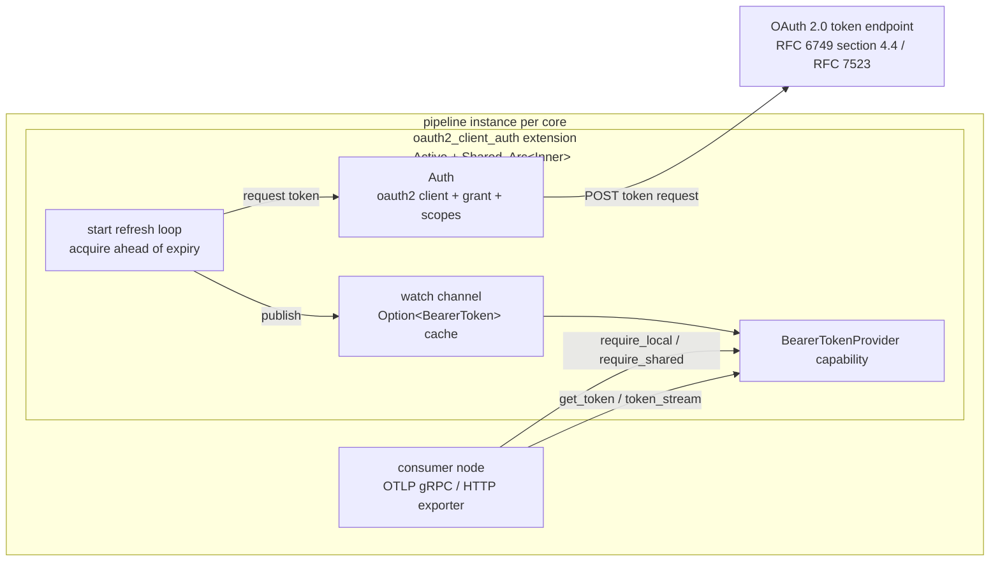

# OAuth 2.0 Client Auth Extension

<!-- markdownlint-disable MD013 -->

**Extension URN:** `urn:otel:extension:oauth2_client_auth`

**Capability exposed:** `BearerTokenProvider`

**Execution model:** Active + Shared

**Crate:** `crates/contrib-extensions`

**Module:** `crates/contrib-extensions/src/oauth2_client_auth/`

This document describes the design of the **OAuth 2.0 Client Auth extension**
(`oauth2_client_auth`) for the OTAP dataflow engine. The extension acquires and
refreshes OAuth 2.0 access tokens using the **client-credentials** grant
(RFC 6749 section 4.4, 2-legged) and the **JWT-bearer** grant (RFC 7523), and exposes
them to data-path nodes through the `BearerTokenProvider` capability. It is the
generic, provider-neutral counterpart to the Azure-specific
[Azure Identity Auth extension](../azure_identity_auth/design.md), modeled on the
Go collector's
[`oauth2clientauthextension`](https://github.com/open-telemetry/opentelemetry-collector-contrib/blob/main/extension/oauth2clientauthextension/README.md).

It builds on the extension system foundations:

- [Extension System Proposal](../../../../docs/extension-requirements.md) - the *what* and *why*
  of the capability-based extension system.
- [Extension System Architecture](../../../../docs/extension-system-architecture.md) - the
  Phase 1 *how* (capability proc macro, registry, Active/Passive lifecycle,
  local/shared execution models).
- [Design Principles and Constraints](../../../../docs/design-principles.md) - thread-per-core
  execution, minimal synchronization, security/privacy first.

## Problem

Absent a token-provider capability, the only credential an OTLP exporter
(`urn:otel:exporter:otlp_grpc`, `urn:otel:exporter:otlp_http`) can carry is a
**static** request header. A fixed `Authorization` header cannot express an
OAuth 2.0 flow, cannot refresh a token before it expires, and forces credentials
into every node's config. Any node authenticating to an OAuth-protected endpoint
(an OTLP backend, a vendor gateway) would have to either use a long-lived static
token or re-implement client-credentials acquisition, caching, and refresh
inline on its data path.

The extension system lets us factor this out into a **shared, cross-cutting
capability** that any node binds to, while keeping the data path free of
authentication plumbing - the same rationale as the Azure extension, but for
standard OAuth 2.0 endpoints rather than Azure identity flows.

## Goals

- Provide a reusable OAuth 2.0 token source backed by the client-credentials and
  JWT-bearer grants, exposed through the existing `BearerTokenProvider`
  capability so it is a drop-in alternative to the Azure provider for any
  consumer (primarily the OTLP exporters; see
  [Consumer Integration](#consumer-integration)).
- Support credential rotation without a restart, by reading `client_id` /
  `client_secret` / signing-key material from files that can change at runtime.
- Refresh tokens **in the background**, ahead of expiry, so consumers read a
  fresh token from cache on the hot path with no per-call token round-trip.
- Coalesce concurrent token acquisitions so a cache miss does not stampede the
  token endpoint.
- Preserve the engine's performance model: no locks on the data-path hot path,
  no blocking I/O on the per-core async runtime.
- Emit telemetry (success/failure counts, publish count, acquisition latency)
  for operability.

## Non-Goals

- A new capability. This extension **reuses** the `BearerTokenProvider`
  capability defined by the engine and documented under the
  [Azure Identity Auth extension](../azure_identity_auth/design.md#capability-bearertokenprovider);
  it adds no capability machinery.
- Provider-specific identity flows (Managed Identity, Workload Identity). Those
  belong to the Azure extension.
- 3-legged (authorization-code) or device-code flows. This extension is a
  machine-to-machine (2-legged) token source only.
- Per-request, per-tenant token selection. One extension instance serves one
  configured client + scope set.
- User-tunable refresh cadence beyond the `expiry_buffer` knob; timing is
  otherwise governed by token lifetime and fixed constants (see
  [Refresh Loop](#refresh-loop)).

## Core Decisions

| Decision | Choice |
| --- | --- |
| Component shape | Standalone extension in the `otap-df-contrib-extensions` crate; the `oauth2`/HTTP client dependency is isolated behind a feature flag. |
| Capability surface | Implements the existing `BearerTokenProvider` (`get_token()` cached fast path / single coalesced slow path, `token_stream()` refresh subscription). No new capability. |
| Execution model | `Active + Shared`. Shared serves both `require_shared()` and `require_local()` consumers via the macro's local fallback; Active drives the background refresh loop. |
| Startup gating | Opt into the engine readiness probe; `signal_ready()` after the first token publish so the engine holds data-path node startup until a token exists (bounded by the probe timeout). |
| Sharing model | All state behind `Arc<Inner>`; every clone (consumers + background task) observes one token cache. At pipeline scope this is per pipeline instance (per core). |
| Token cache | `tokio::sync::watch<Option<BearerToken>>` - lock-free fast-path read + pub/sub for `token_stream()`. |
| Slow-path coalescing | An async `fetch_lock` with double-checked caching so concurrent cache-miss callers - and the background refresh - share one in-flight token request. |
| Grant types | `client_credentials` (client secret) and `jwt-bearer` (RFC 7523 section 2.1 authorization grant; the signed JWT is sent as the `assertion` parameter). |
| Credential rotation | `client_id` / `client_secret` / signing key may be supplied inline or via `*_file` paths re-read on each acquisition; the file form takes precedence. |
| Refresh tuning | `expiry_buffer` is user-configurable; the usability margin, min cadence, refresh jitter, and exponential-backoff-with-jitter retry are fixed constants. |
| Transport security | Token endpoint reached over TLS via the shared `TlsClientConfig` (custom CA, mTLS). `https://` recommended; `http://` allowed but warned. Finite request and connect timeouts bound every acquisition by default. |
| Registration | `#[distributed_slice(OTAP_EXTENSION_FACTORIES)]` link-time discovery, same mechanism as nodes. |
| Telemetry | `MetricSet`-backed counters + latency histogram, flushed via `ExtensionControlMsg::CollectTelemetry`. |

## Capability

The extension implements `BearerTokenProvider` unchanged - the same
`get_token()` / `token_stream()` trait, `BearerToken` type, and `CapabilityError`
semantics defined in the
[Azure Identity Auth extension](../azure_identity_auth/design.md#capability-bearertokenprovider).
It is the engine's **outbound token provider**
(`capability::auth::bearer_token_provider`), distinct from the inbound
`BearerTokenAuthorizer` that admits tokens on incoming requests. A consumer binds
this extension or the Azure one interchangeably - a config choice, not a code
change - so this document covers only what differs: the OAuth 2.0 token source,
its configuration, and its refresh behavior.

## Architecture



### Token flow

1. **Construction.** At factory time, `create()` deserializes and validates the
   config, builds an `Auth` (an OAuth 2.0 client bound to the grant type,
   `token_url`, scopes, `endpoint_params`, and a TLS-configured HTTP client),
   registers the metric set, and constructs the extension with an empty `watch`
   channel (`Option<BearerToken> = None`).
2. **Background refresh.** When the engine spawns the extension, `start()` runs a
   loop that requests a token, publishes it onto the `watch` channel, and
   schedules the next refresh `expiry_buffer` ahead of expiry. After the first
   successful publish it calls `signal_ready()`, releasing the engine's readiness
   gate so the data path starts with a warm cache.
3. **Fast-path read.** `get_token()` returns the cached token with no lock or
   round-trip as long as it is still *usable* - outside the small
   `TOKEN_USABLE_MARGIN` (30s) before expiry. This margin is separate from, and
   much smaller than, the `expiry_buffer` refresh window, so a stalled background
   refresh (e.g. an IdP outage) keeps serving a still-valid token instead of
   failing export minutes early.
4. **Slow-path read.** On a cache miss (before the first refresh, or once the
   token enters the usability margin), `get_token()` takes the `fetch_lock`,
   double-checks the cache, and issues a single coalesced token request. A
   negative cache short-circuits this: after a failure within
   `TOKEN_REFRESH_RETRY_SECS`, it returns a throttle error and lets the
   background loop retry on its own cadence.
5. **Stream.** `token_stream()` subscribes to the `watch` channel and yields each
   subsequent published token; the initial `None` is filtered out.

### Internal state

The cache, refresh loop, and capability implementation are not specific to
OAuth 2.0, so they live in the shared `crate::common::token_refresh` module and are
reused by every bearer-token extension (see
[`azure_identity_auth`](../azure_identity_auth/design.md)). This extension is a
type alias over that generic machinery:

```rust
pub type OAuth2ClientAuthExtension = TokenProviderExtension<Auth, OAuth2ClientAuthMetrics>;
```

```rust
// Manual `Clone`: deriving would add `S: Clone, M: Clone` bounds, but the
// state is shared through the `Arc` and is never cloned itself.
pub struct TokenProviderExtension<S: TokenSource, M: TokenProviderMetrics> {
    inner: Arc<Inner<S, M>>,
}

struct Inner<S, M> {
    source: S,                                        // oauth2 client + grant + scopes
    expiry_buffer: Duration,                          // refresh skew (configurable here)
    tx: watch::Sender<Option<BearerToken>>,           // token cache + pub/sub
    cap_err: CapabilityErrorSource<BearerTokenProviderCap>,
    fetch_lock: tokio::sync::Mutex<()>,               // coalesce slow-path fetches
    failures: std::sync::Mutex<FailureState>,         // negative cache: throttle slow-path retries
    metrics: std::sync::Mutex<TokenProviderMetricsTracker<M>>,
}

struct FailureState {
    last_failure: Option<Instant>,
    consecutive_failures: u32,
}
```

All mutable state lives behind `Arc<Inner>` so the engine can clone the extension
freely. The `fetch_lock` is an async `Mutex` (held across an `.await`); the
metrics `Mutex` is a `std` `Mutex` whose critical sections are short and never
held across an `.await`.

Only two things are OAuth-specific:

- `Auth` implements `token_refresh::TokenSource`: `fetch_token()` dispatches on
  the configured grant type (client credentials or JWT bearer), and
  `log_refresh_failure()` emits the `oauth2_client_auth.token_refresh_failed`
  event.
- `OAuth2ClientAuthMetrics` (metric set `extension.oauth2_client_auth`)
  implements `token_refresh::TokenProviderMetrics`, exposing its counters and
  latency histogram to the generic tracker.

## Configuration

The extension is declared in the pipeline's `extensions:` section and bound to a
node via the node's `capabilities:` map.

```yaml
groups:
  default:
    pipelines:
      main:
        extensions:
          oauth2:
            type: "urn:otel:extension:oauth2_client_auth"
            config:
              grant_type: client_credentials
              token_url: "https://idp.example.com/oauth2/v1/token"
              client_id: "someclientid"
              client_secret_file: "/etc/secrets/oauth2_client_secret"
              scopes: ["telemetry.write"]
              endpoint_params:
                audience: "https://otlp.example.com"
              expiry_buffer: 5m
              timeout: 2s
              tls:
                ca_file: "/etc/ssl/idp-ca.pem"

        nodes:
          otlp-exporter:
            type: "urn:otel:exporter:otlp_grpc"
            capabilities:
              bearer_token_provider: oauth2
            config:
              endpoint: "https://otlp.example.com:4317"
```

### Config schema

| Field | Type | Default | Notes |
| --- | --- | --- | --- |
| `grant_type` | enum | `client_credentials` | `client_credentials`, or `jwt-bearer` - the RFC 7523 section 2.1 authorization grant (`urn:ietf:params:oauth:grant-type:jwt-bearer`). |
| `token_url` | `string` | *required* | The token endpoint URL. Must be non-empty. |
| `client_id` | `string?` | *none* | Client identifier. Required unless `client_id_file` is set. |
| `client_id_file` | `string?` (path) | *none* | Path re-read on each acquisition; takes precedence over `client_id`. Enables rotation. |
| `client_secret` | `string?` | *none* | Client secret. Required for `client_credentials` unless `client_secret_file` is set. |
| `client_secret_file` | `string?` (path) | *none* | Path re-read on each acquisition; takes precedence over `client_secret`. |
| `scopes` | `[string]` | `[]` | Requested scopes. |
| `endpoint_params` | `map<string,string>` | `{}` | Extra parameters sent to the token endpoint (e.g. `audience`). |
| `expiry_buffer` | duration | `5m` | Refresh this far ahead of `expires_on`. Must be greater than the 30 s usability margin. |
| `default_token_lifetime` | duration | `24h` | Lifetime assumed when the token response omits `expires_in`. Must be non-zero and greater than `expiry_buffer`. See [Expiry handling](#expiry-handling). |
| `timeout` | duration | `30s` | Per-request timeout on the token client. Must be non-zero. |
| `connect_timeout` | duration | `10s` | Connection-establishment timeout on the token client. Must be non-zero. |
| `tls` | object? | *none* | Client TLS for the token endpoint. The engine's shared `otap_df_config::tls::TlsClientConfig` (not extension-specific knobs). See [Token-endpoint TLS](#token-endpoint-tls). |
| `startup_timeout` | duration | `30s` | How long the engine holds data-path startup waiting for the first token publish before aborting (see [Lifecycle](#lifecycle)). Must be non-zero. |

For `grant_type: jwt-bearer` (RFC 7523 section 2.1), the extension uses the JWT
bearer *authorization grant*: it signs a JWT and sends it as the `assertion`
parameter, rather than authenticating with a client secret. The signed JWT is
itself the authorization grant. These fields apply only to the `jwt-bearer` grant
and are rejected for `client_credentials`:

| Field | Type | Default | Notes |
| --- | --- | --- | --- |
| `client_certificate_key` / `client_certificate_key_file` | `string?` | *required for jwt-bearer* | Private key used to sign the assertion. The `_file` form is re-read on each acquisition and takes precedence. |
| `signature_algorithm` | enum | `RS256` | RSA algorithm for the assertion (`RS256`/`RS384`/`RS512`). |
| `client_certificate_key_id` | `string?` | *none* | Optional `kid` header on the assertion. |
| `iss` | `string?` | `client_id` | Assertion issuer. |
| `audience` | `string?` | `token_url` | Assertion audience. |
| `claims` | `map<string,string>` | `{}` | Extra assertion claims. |

At the token endpoint, `client_credentials` sends `grant_type=client_credentials`
with the client id and secret; `jwt-bearer` sends
`grant_type=urn:ietf:params:oauth:grant-type:jwt-bearer` and
`assertion=<signed JWT>`. The signed JWT carries `iss`/`sub` (default `client_id`),
`aud` (default `token_url`), and `exp`/`iat`/`jti`; any configured `scopes` are
sent as the `scope` parameter.

The config struct uses `#[serde(deny_unknown_fields)]` and is validated before
the pipeline starts. Validation rejects an empty `token_url`, a zero
`expiry_buffer`/`startup_timeout`/`timeout`/`connect_timeout`, a
`default_token_lifetime` at or below `expiry_buffer`, a missing client
identifier, a missing
secret/signing key for the selected grant, and any grant-specific field that does
not apply to the selected `grant_type`. Because these cross-field rules go beyond
what serde deserialization can express, the factory wires a **custom**
`validate_config` hook (rather than `validate_typed_config::<Config>`) that
deserializes `Config` and then runs `Config::validate()` - the same
parse-then-validate pattern the Azure extension uses.

### Token-endpoint TLS

The token endpoint carries the client secret (or signed assertion) and returns
bearer tokens, so it must be reached over TLS (RFC 6749 section 3.2). The `tls`
field is the engine's shared `otap_df_config::tls::TlsClientConfig` - the same
type the OTLP/HTTP exporters use - so the extension invents no TLS knobs and its
behavior and validation match the rest of the collector.

TLS follows the `token_url` scheme: `https://` is TLS-protected (configured by
the `tls` block), while plaintext `http://` uses none and is intended only for
local development or testing. Production must use `https://`. `TlsClientConfig`
configures the connection:

- **Custom trust** - `ca_file` / `ca_pem` to trust a private or enterprise CA,
  plus `include_system_ca_certs_pool` (default `true`) for the system store.
- **Mutual TLS** - `cert_file` / `key_file` present a client certificate, so the
  extension can authenticate to endpoints requiring mTLS client auth
  (RFC 8705) in addition to, or instead of, a client secret.

The extension acquires tokens over a `reqwest`/`rustls` HTTP client built from
`TlsClientConfig` exactly as the OTLP/HTTP exporter does, so its TLS surface
matches that client. Three `TlsClientConfig` knobs therefore behave differently
from a fully general TLS stack:

- **`server_name_override` (SNI override) is not supported** by the
  reqwest/rustls client. Like the OTLP/HTTP exporter, the extension rejects it at
  config validation rather than silently ignoring it, so a config that relies on
  it fails fast instead of connecting with the wrong SNI.
- **`insecure` (disable TLS) is rejected when `token_url` is `https://`.** The
  two are contradictory: the `https://` scheme mandates a TLS handshake, so no
  client can honor a request for plaintext against it. `token_url` is an absolute
  URI (RFC 6749 section 3.2), so its scheme already decides the transport and the
  flag is redundant. Rather than accept the contradiction and connect with TLS
  anyway, validation fails so an operator who believes they disabled TLS finds
  out at startup. Use an `http://` `token_url` for a plaintext endpoint; setting
  `insecure` alongside one is a consistent no-op and is accepted.
- **`insecure_skip_verify`** (TLS enabled but certificate verification skipped) is
  honored - it maps to reqwest's `danger_accept_invalid_certs`. It is intended
  only for local development or testing against a self-signed endpoint; because it
  disables certificate verification on a connection that carries the client
  secret, production deployments must leave it off.

TLS relies on the process-wide `rustls` crypto provider described under
[Cargo features](#cargo-features).

## Refresh Loop

`start()` runs a `select!` loop with two arms. The loop is the shared one in
`crate::common::token_refresh`, so it is literally the same code the Azure extension
runs (control channel + refresh timer); only the `TokenSource` acquisition call
and the `expiry_buffer` value differ:

1. **Control channel** (`ctrl.recv()`): `Shutdown` returns the final metric
   snapshot as the terminal state; `Config` is a no-op; `CollectTelemetry`
   flushes the metric set. The control channel is polled even while a refresh is
   in flight, so a shutdown arriving mid-acquisition cancels the in-progress
   token call rather than letting a slow request run past the shutdown deadline,
   and telemetry flushes are serviced without interrupting a refresh.
2. **Refresh timer** (`sleep_until(next_refresh)`), which first fires
   immediately on startup:
   - On tick: note the current `watch` version, then take the `fetch_lock` (the
     same one the slow-path `get_token` uses). Coalesce onto a concurrent
     acquisition only if a slow-path `get_token` published a new usable token
     while we waited for the lock (the `watch` version changed); otherwise
     acquire a new token. A merely still-valid token is not reused, so the
     planned early refresh is not deferred.
   - On success: publish with `send_replace` (updates the cache regardless of
     subscriber count), clear the shared `FailureState` (both the failure instant
     and the consecutive-failure streak), then compute `next_refresh` from
     `expires_on` minus `expiry_buffer` (clamped to a minimum cadence) with a
     small negative jitter so per-core extensions do not all refresh on the same
     tick.
   - On failure: log, record the failure instant and increment the streak in the
     shared `FailureState` (so the slow path throttles its own retries during a
     cooldown that widens in step with this loop), and reschedule using bounded
     exponential backoff with equal jitter - each delay is drawn from
     `[base/2, base]`, where `base` doubles per consecutive failure from the base
     retry delay up to the
     cap - tracking consecutive failures; keep retrying for the lifetime of the
     extension. The backoff spreads retries across cores so a token-endpoint
     outage is not stampeded on a fixed cadence.

Tuning constants:

| Constant | Value | Purpose |
| --- | --- | --- |
| `expiry_buffer` (config) | `5m` default | Background loop refreshes this far before `expires_on`. |
| `TOKEN_USABLE_MARGIN` | 30s | Defined by the `BearerTokenProvider` capability contract in the engine, so this provider and every consumer enforce the same window. The fast path treats a token within this margin of expiry as unusable. Much smaller than `expiry_buffer` so a still-valid token keeps being served while a background refresh is failing, and the slow path is not stampeded during a transient outage. |
| `MIN_TOKEN_REFRESH_INTERVAL_SECS` | 10 | Floor between successful refreshes; also the earliest a jittered refresh may land. Avoids busy-looping on near-expired tokens. |
| `TOKEN_REFRESH_RETRY_SECS` | 10 | Base reschedule delay after a failed acquisition; doubles per consecutive failure. Also the slow-path negative-cache cooldown that throttles `get_token()` retries after a failure. |
| `MAX_TOKEN_REFRESH_RETRY_SECS` | 300 (5m) | Ceiling for the exponential retry backoff. |
| `REFRESH_JITTER_SECS` | 60 | Max negative jitter applied to a scheduled refresh (never pulling it below the min cadence), to de-correlate per-core refreshes. |

### Expiry handling

The token endpoint returns a relative `expires_in`; the extension computes the
absolute expiry (`now + expires_in`) and hands it to the engine's
`capability::auth::BearerToken` constructor, which centralizes the
absolute-to-monotonic `Instant` conversion (the same path the Azure extension
uses via `BearerToken::from_absolute_expiry`). After that single conversion the
schedule is immune to wall-clock jumps.

Both grants share one response parser, so they accept the same payloads: a
`token_type` other than `Bearer` (case-insensitively; absent means `Bearer`) is
rejected rather than handed to consumers, and `expires_in` is accepted as either
a JSON number or a JSON string.

#### When the response omits `expires_in`

RFC 6749 section 5.1 makes `expires_in` only RECOMMENDED, and directs a server
that omits it to "provide the expiration time via other means or document the
default value". A missing `expires_in` therefore means *the endpoint did not
tell us*, which is not the same as *this token never expires*. The extension
does not conflate the two: such a token is given a finite assumed lifetime of
`default_token_lifetime` (**`24h`** by default) rather than being cached as
non-expiring, so it is still re-acquired on a predictable cadence instead of
being served until exporters start seeing `401`s.

The `24h` default is deliberately generous, because this path is a **backstop
for a non-conforming endpoint, not a refresh policy**. An endpoint that reports
`expires_in` never reaches it, so a shorter default would not make any
well-behaved deployment safer - it would only add token traffic against
endpoints that are already silent about their own expiry, and those are the
least likely to be issuing short-lived tokens. Operators who know their endpoint
issues shorter-lived tokens should set `default_token_lifetime` explicitly.

Validation rejects a `default_token_lifetime` at or below `expiry_buffer`: the
loop schedules a refresh at `expiry - expiry_buffer`, so a fallback inside the
buffer would place every refresh in the past and collapse the cadence onto
`MIN_TOKEN_REFRESH_INTERVAL_SECS`, hammering the token endpoint.

This fallback is specific to the OAuth 2.0 grants, where a missing expiry is a
gap in the response rather than a fact about the token. It is applied in this
extension, not in the shared refresh machinery, so a future extension whose
tokens genuinely have no expiry - a static or file-sourced bearer token, for
example - can still publish one via `BearerToken::without_expiry` and keep that
meaning intact.

## Consumer Integration

A consumer binds `bearer_token_provider` to an `oauth2_client_auth` instance and
resolves it once at factory time - exactly the mechanism described in the
[Azure extension's Consumer Integration](../azure_identity_auth/design.md#consumer-integration).
Nothing on the consumer side is OAuth-specific; a node cannot tell which provider
backs the capability, and can consume it two ways: a cached fast-path read via
`get_token()`, or a subscription to `token_stream()` that pushes each refreshed
token.

The primary consumers are the **OTLP HTTP and gRPC exporters**. Both subscribe
to `token_stream()` and cache a pre-built `Authorization: Bearer <token>` header
that they clone onto each outgoing request, so credential work stays off the
export hot path and tokens rotate without a restart. The refreshed bearer
**overrides** any statically configured `authorization` header, and the cached
token is marked **sensitive** (redacted in `Debug`, excluded from HPACK
indexing). Until a token is available (startup or an auth outage) the exporter
withholds export rather than sending unauthenticated data. Any other
`BearerTokenProvider` consumer works unchanged.

## Telemetry

Metrics are recorded in the background refresh loop and the slow-path
`get_token()` branch, and flushed via `ExtensionControlMsg::CollectTelemetry`.

| Metric (set: `extension.oauth2_client_auth`) | Type | Description |
| --- | --- | --- |
| `auth_successes` | Counter | Successful token acquisitions. |
| `auth_failures` | Counter | Failed token acquisitions. |
| `auth_token_publish` | Counter | Tokens published to consumers via the watch channel. |
| `auth_success_latency` | Mmsc (ms) | Latency of successful acquisitions (min/max/sum/count). |

## Lifecycle

### Startup

1. The engine starts the extension before any consumer that binds it (extensions
   start first; see
   [Extension System Architecture](../../../../docs/extension-system-architecture.md#key-design-decisions)).
2. `SharedExtension::start()` runs the refresh loop. The first successful token
   request publishes a token onto the `watch` channel, then calls
   `EffectHandler::signal_ready()`.
3. The engine holds data-path node spawning on the extension's readiness probe
   (`wait_all_ready`) until that signal fires, bounded by the probe timeout. The
   extension sets this via `with_readiness_probe_timeout_override` from the
   `startup_timeout` config field (default `30s`, larger than the engine's 5 s
   default to accommodate a slow token endpoint plus a ~10 s failure-retry inside
   the gate). If the first token is not acquired in time, startup aborts with a
   readiness-timeout error rather than starting nodes without a token.
4. Data-path nodes then start. Each consumer resolves the capability once at
   construction (`require_local()` / `require_shared()`) and holds the typed
   handle for its lifetime - no capability resolution on the hot path. Because
   the readiness gate already ensured a token is published, the first
   `get_token()` hits the warm cache; the slow path remains only for later cache
   misses (e.g. a refresh failure mid-run).

### Shutdown

1. The engine drains data-path nodes first. Each consumer finishes in-flight work
   and drops its capability handle.
2. After all consumers drain, the engine sends `ExtensionControlMsg::Shutdown` on
   the control channel. The refresh loop returns the final metric snapshot as its
   terminal state and drops the OAuth 2.0 client and `watch` sender; a token
   acquisition in flight at that moment is cancelled (see
   [Refresh Loop](#refresh-loop)) so shutdown is not delayed by a slow request.
   No token request is issued after shutdown begins.

### Live reconfiguration

The extension is reconfigured over the extension system's own control channel
(`ExtensionControlMsg`), independent of pipeline-node reconfiguration
(`NodeControlMsg::Config`). `ExtensionControlMsg::Config` is a no-op:
refresh cadence is governed by token lifetime and `expiry_buffer`, and changing
the client, grant, or scopes is treated as an extension restart rather than an
in-place swap. Credential *values* still rotate without a restart when supplied
via the `*_file` fields, since those are re-read on each acquisition (see
[Configuration](#config-schema)). Whether the client, grant, and scopes should
become hot-swappable is an open question (see [Open Questions](#open-questions)).

### Cargo features

```toml
[features]
contrib-extensions = ["oauth2-client-auth-extension"]
oauth2-client-auth-extension = [
    "dep:oauth2",
    "dep:reqwest",
    "dep:http",
    "dep:jsonwebtoken",
    "dep:humantime-serde",
    "dep:rand",
    "dep:secrecy",
]

# Assertion-signing backend, mirroring the workspace `crypto-*` selection.
crypto-ring = ["dep:ring"]
crypto-aws-lc = ["jsonwebtoken?/aws_lc_rs"]
crypto-openssl = ["dep:openssl"]
```

**Crypto provider prerequisite.** The `reqwest`/`rustls` HTTP client requires a
process-wide `rustls` crypto provider. `Auth::new()` calls
`otap_df_otap::crypto::ensure_crypto_provider()` before constructing the client,
and the deployed binary **must** enable exactly one `crypto-*` feature; otherwise
token requests panic at runtime with "No provider set".

#### Assertion-signing backend

The JWT-bearer grant signs an assertion with `jsonwebtoken`, which is a second
consumer of cryptography alongside TLS. `jsonwebtoken` 11 selects its algorithms
through a pluggable `CryptoProvider` rather than linking `ring` unconditionally
the way 9.x did, so the workspace enables no backend feature on the crate and
supplies a provider instead. The same `crypto-*` feature that picks the rustls
provider picks the signing backend, so a build links one cryptographic library
rather than two - which matters where the choice of library is a compliance
requirement rather than a preference.

| Feature | Assertion-signing backend |
| --- | --- |
| `crypto-ring` | `ring` |
| `crypto-aws-lc` | `aws-lc-rs`, through `jsonwebtoken`'s bundled provider |
| `crypto-openssl` | `openssl` |
| `crypto-symcrypt` | none |

SymCrypt has no entry because its Rust bindings import an RSA key only as raw
(modulus, exponent, prime) components, while `jsonwebtoken` hands a provider a
PKCS#1 DER blob. A build with no signing backend - `crypto-symcrypt`, or no
`crypto-*` feature at all - rejects the JWT-bearer grant when the extension is
constructed, rather than panicking at the first signature. The
client-credentials grant needs no signing and is unaffected.

The providers implement only the RSA PKCS#1 v1.5 algorithms the grant accepts
(RS256, RS384, RS512) and do not support JWKs. `jsonwebtoken` has no other
consumer in the collector, so the narrower algorithm set is not observable
elsewhere.

### Factory registration

```rust
pub const OAUTH2_CLIENT_AUTH_URN: &str = "urn:otel:extension:oauth2_client_auth";

#[distributed_slice(OTAP_EXTENSION_FACTORIES)]
pub static OAUTH2_CLIENT_AUTH_EXTENSION: ExtensionFactory = ExtensionFactory {
    name: OAUTH2_CLIENT_AUTH_URN,
    description: "Active+Shared extension exposing BearerTokenProvider via OAuth 2.0 client credentials",
    documentation_url: "",
    capabilities: Some(extension_capabilities!(
        shared: OAuth2ClientAuthExtension => [BearerTokenProvider]
    )),
    create,
    validate_config,
};
```

The URN follows the [URN format](../../../../docs/urns.md): `urn:otel:extension:oauth2_client_auth`
uses the `otel` namespace (standard OAuth 2.0, not vendor-specific). The main
binary links the crate with a side-effect import so the registration takes
effect.

## Security Considerations

- **Secret handling.** Client secrets, signing keys, and access tokens are held
  only in memory (behind `Arc<Inner>` / the `watch` cache) and are never logged;
  log/telemetry sites emit grant type, `token_url`, scopes, and refresh timing
  only.
- **Secret sourcing.** Prefer the `*_file` fields over inline secrets so
  credentials are not embedded in pipeline config and can be rotated by updating
  the file; the extension re-reads them on each acquisition.
- **Transport security.** TLS protects the client secret and returned token in
  transit; production must use `https://` (see
  [Token-endpoint TLS](#token-endpoint-tls)). A `timeout` bounds each request so
  a hung endpoint cannot stall refresh.
- **Endpoint protection.** Slow-path fetch coalescing (`fetch_lock`) prevents
  request stampedes against the token endpoint on cache misses.
- **Least privilege.** The extension requests exactly the configured `scopes`.

## Performance Considerations

- **No hot-path token calls.** Steady-state `get_token()` is a lock-free read of
  the `watch` cache; token-endpoint round-trips happen only on the background
  loop or on a cold cache miss.
- **No data-path locks.** Shared state is `Arc`-wrapped; the only locks are the
  async `fetch_lock` (slow path only) and the short metrics `Mutex` (never held
  across `.await`).
- **Per-core instantiation.** At pipeline scope the extension is instantiated per
  pipeline instance (per core), consistent with the Phase 1 sharing-boundary
  rule. The cache, refresh loop, and token acquisitions **replicate per core**:
  on an N-core deployment a single-exporter pipeline yields N caches, N refresh
  loops, and N independent token fetches. The `shared` model only collapses
  duplication *within* a core, not across cores. So slow-path coalescing
  (`fetch_lock`) bounds the startup thundering herd to N concurrent acquisitions
  (one per core) but does not eliminate it; the per-core jitter and backoff (see
  [Refresh Loop](#refresh-loop)) keep those uncoordinated loops from realigning.
  A future move to group/engine scope would share one instance across cores
  without code changes (see
  [Extension Scopes](../../../../docs/extension-requirements.md#extension-scopes)).
- **Runtime discipline.** The refresh loop runs on the per-core async runtime;
  all token I/O is async (`reqwest` HTTP), so it never blocks other futures on
  the core. TLS handshakes and JWT signing for the `jwt-bearer` grant happen only
  on the background loop or slow path, never on the data-path hot path.

## Validation Expectations

Validation focuses on user-facing scenarios; where behavior overlaps the Azure
extension (refresh-ahead-of-expiry, slow-path coalescing, refresh/retry,
shutdown ordering) the same expectations apply.

OAuth-specific coverage:

- **Client-credentials happy path.** A `client_credentials` config against a test
  token endpoint publishes a token, the bound OTLP exporter only exports once a
  token exists, and `auth_successes` / `auth_token_publish` increment.
- **JWT-bearer grant.** A `jwt-bearer` config signs a JWT assertion with the
  configured key/algorithm and obtains a token; `client_credentials`-only fields
  are rejected for this grant and vice versa.
- **Config validation.** Missing `token_url`, missing client id, missing
  secret/key for the selected grant, a zero `expiry_buffer`, and unknown fields
  are all rejected at config time.
- **Credential rotation.** Updating a `client_secret_file` (or key file) causes
  the next acquisition to use the new value with no restart.
- **Endpoint errors.** A 4xx/5xx or timeout from the token endpoint increments
  `auth_failures`, the loop reschedules with bounded exponential backoff plus
  jitter, and a subsequent success recovers without restarting the extension.

## Open Questions

1. **Grant coverage.** The extension supports `client_credentials` and
   `jwt-bearer`. Is there demand for password or refresh-token grants, or should
   those stay out of scope as non-machine-to-machine flows?
2. **Multi-scope / multi-endpoint.** As with the Azure extension, one instance
   serves one client + scope set; a node needing multiple audiences declares one
   instance per audience. Is a single multi-scope instance worth the added
   surface? (Shared with the Azure extension's
   [Multi-resource tokens](../azure_identity_auth/design.md#open-questions)
   question.)
3. **Identity/scope hot-swap.** Should `ExtensionControlMsg::Config` rebuild
   `Auth` in place (new client / scopes) instead of requiring an extension
   restart?

## Future Work

- **Broader extension scope.** Hoist to group/engine scope for genuine
  cross-core token-cache sharing (see
  [Extension Scopes](../../../../docs/extension-requirements.md#extension-scopes)).

## References

- [Azure Identity Auth Extension](../azure_identity_auth/design.md) - sibling
  `BearerTokenProvider` provider; source of the capability, cache, and lifecycle
  design reused here.
- [Extension System Proposal](../../../../docs/extension-requirements.md)
- [Extension System Architecture](../../../../docs/extension-system-architecture.md)
- [Design Principles and Constraints](../../../../docs/design-principles.md)
- [Architecture](../../../../docs/architecture.md)
- [URN Format](../../../../docs/urns.md)
- [Go collector `oauth2clientauthextension`](https://github.com/open-telemetry/opentelemetry-collector-contrib/blob/main/extension/oauth2clientauthextension/README.md)
- [RFC 6749 section 4.4 - Client Credentials Grant](https://datatracker.ietf.org/doc/html/rfc6749#section-4.4)
- [RFC 7523 - JSON Web Token (JWT) Profile for OAuth 2.0 Client Authentication and Authorization Grants](https://datatracker.ietf.org/doc/html/rfc7523) - section 2.1 (JWT authorization grant) is the flow used here.
