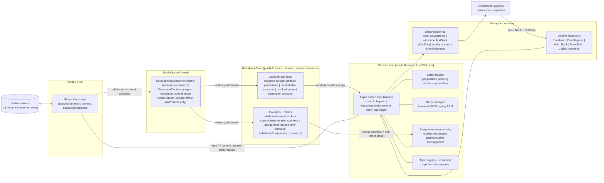
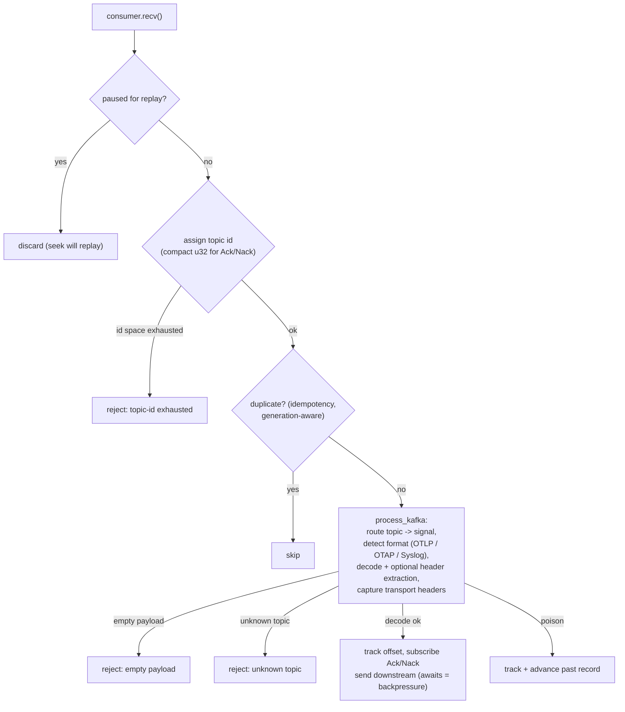
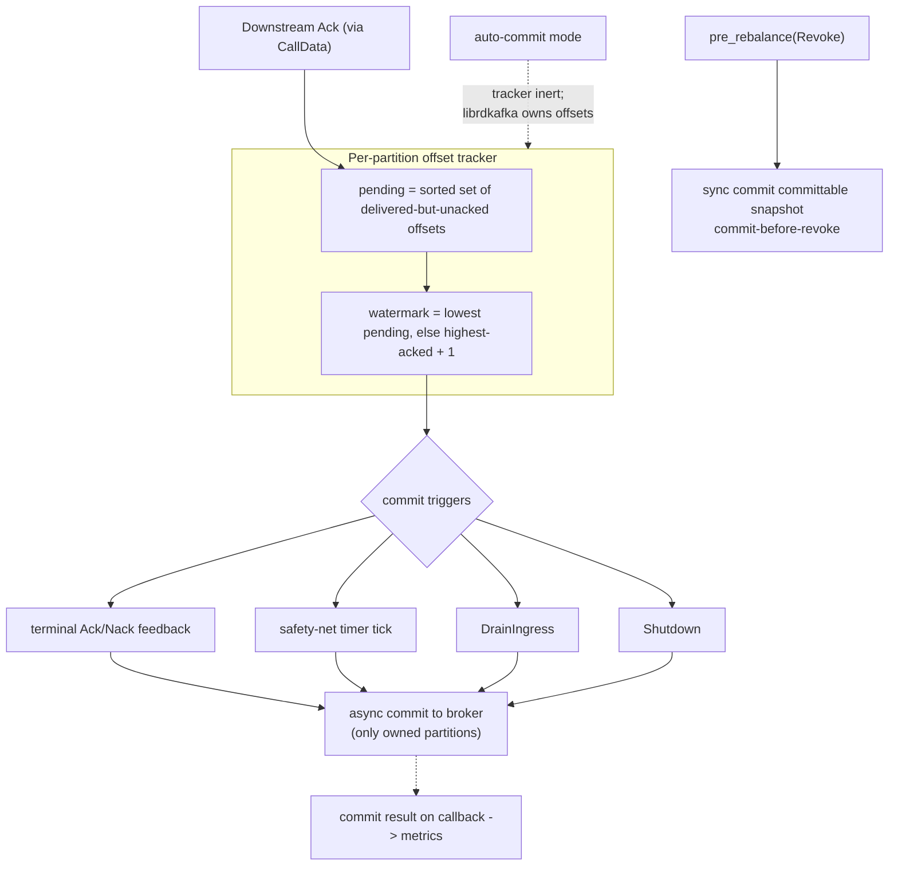
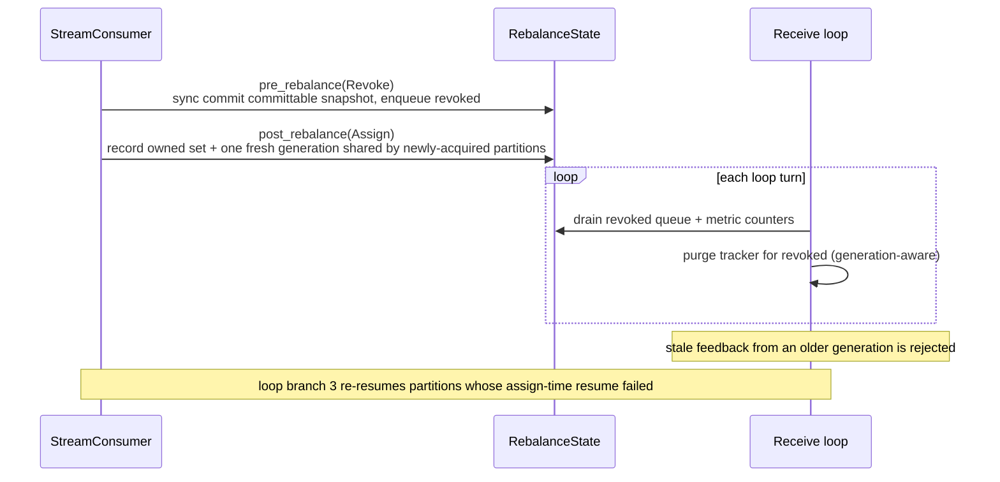
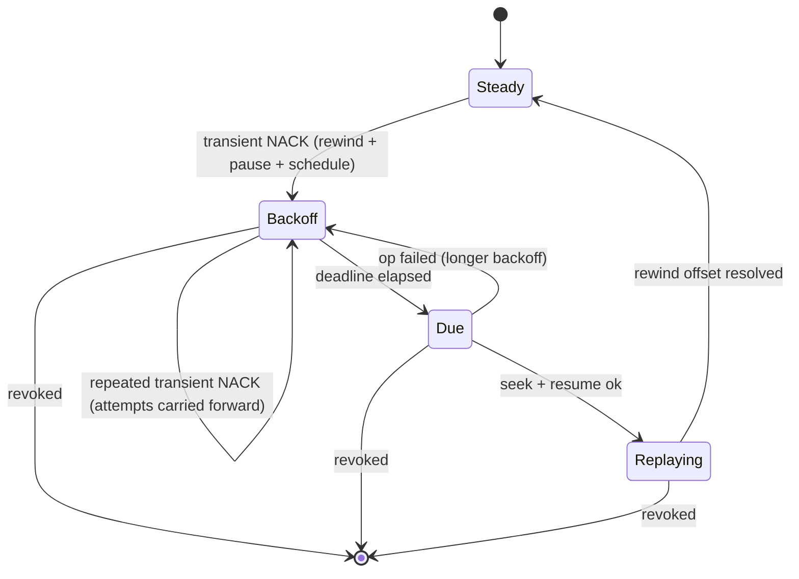

# Kafka Receiver

<!-- markdownlint-disable MD013 -->

The Kafka receiver is a Kafka consumer-group member that ingests OpenTelemetry
telemetry (traces, metrics, logs) from Kafka topics and emits it into the OTAP
dataflow pipeline.

**Plugin URN (full):** `urn:otel:receiver:kafka`
**Plugin URN (OTel shortcut):** `receiver:kafka`

Target crate: `crates/contrib-nodes`

Target module: `crates/contrib-nodes/src/receivers/kafka_receiver/`

## Overview

The receiver ingests telemetry from Kafka topics into the OTAP df-engine
pipeline. Payloads may be OTLP-proto, OTAP-proto, or Syslog (logs only),
selected per signal by config and overridable per message by a Kafka header.
Topics are routed to a signal by
subscription (literal names or `^`-prefixed regex, with optional exclude
patterns).

The single most important design fact is a **concurrency boundary**:

- The receiver's main loop runs on the df-engine **single-threaded, per-core
  `LocalSet` runtime**. All hot-path bookkeeping (offset tracking, replay
  state, topic registry) lives here and needs no locks.
- Kafka **consumer-group rebalance and commit callbacks are served inline by
  `consumer.recv()`** through `ConsumerContext`, so they run **on the same
  single-threaded pipeline thread** as the loop, interleaved between records.
  They still may not mutate the `LocalSet`-owned state directly: they only
  record facts into the shared state below, which the loop reconciles on its
  next turn. (The AWS MSK IAM OAUTHBEARER token refresh is the one path that
  may still run on a librdkafka-internal thread.)

These two worlds are bridged by exactly one small shared object
(`RebalanceState`), whose fields are individually guarded by per-field locks and
atomics. Understanding that bridge is the key to understanding the receiver.

> **Note (execution context / blocking risk).** In rdkafka 0.38.0, polling
> `consumer.recv()` invokes the rebalance and commit callbacks inline
> (`MessageStream::poll_next` -> `BaseConsumer::poll_queue` runs any queued
> rebalance/commit event on the calling thread). Because the receive loop is the
> only caller of `recv()`, these callbacks execute on the pipeline thread during
> normal consumption -- not on a separate librdkafka poll thread. As a result,
> the **synchronous** commit in `handle_revoke` (`pre_rebalance(Revoke)`, a
> `CommitMode::Sync` broker round-trip) runs on the pipeline thread and **can
> block the receive loop** during a rebalance, contradicting the non-blocking
> guarantee described below. This is documented as a known risk for now; moving
> the commit off the pipeline thread is future work.

### Kafka-native framing

The receiver maps onto standard librdkafka consumer behavior as follows:

- **Manual commit (default)** sets `enable.auto.commit=false` **and**
  `enable.auto.offset.store=false`: the receiver fully owns the offset store and
  commits explicitly, and only the lowest un-acknowledged contiguous offset per
  partition is committed => **at-least-once** (out-of-order acks never skip an
  un-acked record).
- **Auto commit** sets `enable.auto.commit=true`: librdkafka owns offsets =>
  **at-most-once**. In this mode the offset tracker, rebalance handling, and
  retry subsystem are all inert.
- **Commit-before-revoke**: the `pre_rebalance(Revoke)` callback commits owned
  partitions' watermarks before they leave the member.
- **Transient-NACK replay**: a non-permanent downstream NACK drives a partition
  `pause` -> `seek(rewind_offset)` -> `resume` with exponential backoff.
- **Static membership** via `group.instance.id` (suffixed with the core id on a
  multi-core pipeline so members do not fence each other).
- Assignment (`partition.assignment.strategy`: `range` / `round_robin` /
  `cooperative_sticky`), read isolation (`isolation.level`), and start position
  (`auto.offset.reset`) are surfaced directly as config.

The receiver avoids blocking the single-threaded runtime on a broker round-trip
in steady state: commits are asynchronous (the broker result arrives later on
the commit callback), and any potentially blocking librdkafka call
(consumer-lag lookups, final consumer close) is bounded and off-loaded. The one
exception is the synchronous commit-before-revoke in `pre_rebalance(Revoke)`:
because rebalance callbacks are served inline by `recv()` (see the note above),
that `CommitMode::Sync` commit runs on the pipeline thread and can block it
during a rebalance. It is bounded by librdkafka's internal commit timeout;
moving it off the pipeline thread is future work.

## Architecture Overview

The top-level view: the two threads, the shared state that bridges them, the
loop-owned hot-path state, and the df-engine boundary.

Highlights:

- The **only** state shared across the thread boundary is `RebalanceState`. The
  poll thread writes assignment/revocation/commit-result facts into it; the loop
  reconciles them at the top of each turn. It is not one struct-wide lock: each
  field carries its own `Mutex` and the metric counters are plain atomics, so the
  (rare) callback path and the (hot) loop reconcile path contend as little as
  possible. It is split for clarity into cross-thread facts (assigned set with
  per-partition ownership generation, committable snapshot, revoked queue,
  generation allocator) and counters plus the assignment-resume retry schedule.
- The receive loop is a single `biased` `select!` with five branches: control
  messages, the lag-worker join, the retry/assignment-resume deadline, the
  `consumer.recv()` path, and the periodic lag-refresh trigger.
- **Assignment-resume retry**: a partition resume that fails at assign time is
  scheduled with capped exponential backoff and re-resumed by the loop's
  deadline branch until it succeeds or the ownership generation changes.
- `CallData` is an opaque per-record token (topic id, partition, offset,
  delivery generation) that the receiver attaches when it subscribes for
  Ack/Nack. It comes back verbatim on the acknowledgement, letting the loop
  correlate feedback to a Kafka offset without holding the message.
- Backpressure is implicit: emitting downstream awaits the pipeline channel, so
  while the loop is blocked sending, it stops fetching new Kafka records.

## Message ingest path

The per-record path taken by each `consumer.recv()` result.

The flowchart follows the real order in `run_receive_loop`: the paused-for-replay
and topic-id checks and the idempotency check run *before* the topic is routed to
a signal decoder (routing, format detection, decode, and header extraction all
happen inside `process_kafka`).

Highlights:

- **Poison pill**: a record that fails to decode is still tracked and advanced
  past, so one bad message cannot wedge a partition.
- The compact topic-id registry can be exhausted only after 2^32 distinct topic
  names; such a record is rejected (`topic-id exhausted`) and left un-tracked so
  it is re-delivered on restart rather than corrupting Ack/Nack routing.
- An empty (payload-less) record and a record on an unrecognized topic are both
  rejected and counted, distinct from a decode failure.
- **Idempotency** (opt-in, manual commit) is generation-aware: a record
  redelivered under a newer ownership generation (after revoke+reassign) is
  reprocessed, not skipped.
- Records buffered inside librdkafka for a partition that is paused for replay
  are discarded here; the pending seek is what re-reads them.
- Syslog decoding is supported only for the logs signal; a Syslog format on a
  traces or metrics signal is rejected as a decode error.

## Offset commit and at-least-once

Highlights:

- Out-of-order acks never move the watermark past an un-acked offset, so a crash
  re-delivers only genuinely un-acked records (at-least-once).
- Four independent triggers can commit: terminal Ack/Nack feedback, the
  safety-net timer, `DrainIngress`, and `Shutdown`. Only owned partitions are
  committed.
- These four steady-state triggers commit **asynchronously**; the broker outcome
  is observed later on the commit callback (the single source of truth for commit
  success/failure metrics). The separate commit-before-revoke path in
  `pre_rebalance(Revoke)` is the one exception: it commits **synchronously** so
  owned partitions are persisted before they leave the member.

## Rebalance and consumer group

The rebalance and commit callbacks are delivered on `RebalancingConsumerContext`,
which implements two librdkafka traits: `ConsumerContext` (pre/post-rebalance and
the commit callback) and `ClientContext` (OAUTHBEARER token refresh, functional
only for the AWS MSK IAM variant).

Highlights:

- The poll-thread callbacks only record facts (owned set, revoked queue, metric
  counters) into `RebalanceState`; the loop reconciles them and purges the tracker
  on its next turn, generation-aware.
- `pre_rebalance(Revoke)` commits the committable snapshot (synchronously) so
  owned partitions are committed before they leave the member (commit-before-revoke).
- `post_rebalance(Assign)` allocates a **single** fresh ownership generation
  shared by all partitions newly acquired in that rebalance; partitions retained
  across the rebalance keep their existing generation.
- Assignment strategy (`range` / `round_robin` / `cooperative_sticky`) is chosen
  via config; cooperative-sticky minimizes partition movement across rebalances.
- If a partition's resume fails at assign time, it is scheduled for retry and
  re-resumed by the receive loop's deadline branch until it succeeds or the
  ownership generation changes.

## Transient-NACK replay

Applies only in manual-commit `replay` mode. A non-permanent downstream NACK
rewinds the partition and replays from the failed offset instead of skipping it.

Only three of the states below are real `RetryPhase` enum variants (`Backoff`,
`Due`, `Replaying`). "Steady" is not a variant -- it is the absence of retry state
for the partition (`retry == None`).

Highlights:

- "Steady" is not an enum state; it is `retry == None`. The real `RetryPhase`
  has exactly three variants: `Backoff`, `Due`, and `Replaying`.
- While in `Backoff`/`Due`, buffered deliveries for the partition are discarded;
  the pending seek is the source of truth for what gets re-read.
- The `pause` in the `Steady -> Backoff` step is **best-effort**: a pause failure
  still records the partition as scheduled and replay proceeds. On the
  `Due -> Replaying` path the pause is additionally **conditional** (skipped if
  the partition is already paused).
- Between each `pause` / `seek` / `resume` operation on the `Due -> Replaying`
  path, an ownership check runs; if ownership changed the attempt is abandoned
  (an implicit transition to `[*]`), not only via the labeled revoke edges.
- Completion (`Replaying -> Steady`) fires only when terminal feedback arrives
  for `offset == rewind_offset` in the current delivery generation while
  `Replaying`.
- Each replay allocates a new **delivery generation** so acknowledgements from
  the pre-replay delivery are recognized as obsolete and ignored.
- The alternative `commit_and_skip` mode has no state machine: a transient NACK
  is treated like a terminal one (advance past the record).

---

## Configuration reference

Full field, default, and validation details are in the
[README](README.md#configuration). The configuration behavior that shapes the
architecture:

- Config is resolved into a single librdkafka client config. Built-in fields
  take precedence over the raw `consumer_config` escape hatch on conflict; the
  last write wins for `debug`/`log_level` (applied last so they override any
  value set via `consumer_config`).
- `commit.mode` (auto / manual) is the pivotal switch: manual sets
  `enable.auto.commit=false` and `enable.auto.offset.store=false` so the
  receiver owns the offset store, while auto hands offsets to librdkafka and
  makes the offset tracker, rebalance handling, and retry subsystem inert.

## Metrics reference

Full metric names, attributes, and legacy-name migration are in the
[README](README.md#telemetry). All metrics are emitted under `receiver.kafka.*`
with bounded-cardinality typed attributes, and group into six concerns:
ingestion/admission, rejections, offset management, rebalance/consumer group,
retry/replay, and transport errors.

## Concurrency and invariants

- **Single-threaded hot path.** The receive loop owns the offset tracker, retry
  manager, and topic registry outright; there are no locks on the per-record
  path.
- **One shared object.** `RebalanceState` is the only cross-thread state. It
  holds the cross-thread facts (assigned set with per-partition generations,
  committable snapshot, revoked queue, the ownership-generation allocator), a set
  of atomic metric counters (rebalances, assignments/revocations, commit/resume
  errors, offset commits/errors), and the assignment-resume retry schedule. Its
  mutex is poison-tolerant (a panic elsewhere recovers the guard rather than
  killing the receiver) because it protects plain bookkeeping.
- **Callbacks cannot mutate loop state.** librdkafka rebalance/commit callbacks
  run on the poll thread and only write facts into `RebalanceState`; the loop
  applies them (tracker purge, metric folding) at the top of each turn.
- **Never block the runtime.** Steady-state commits are asynchronous;
  consumer-lag lookups run on a `spawn_blocking` worker bounded by a deadline
  and a cancellation token; the final consumer close on shutdown/drain is
  bounded by the shutdown deadline; assignment-resume retries are scheduled with
  capped backoff and re-driven from the loop's deadline branch rather than
  blocking a callback.
- **Generations guard correctness.** A *per-partition ownership* generation
  scopes tracker state across rebalances (generations start at 1, with 0 as the
  unowned sentinel; a stale revoke cannot purge freshly reassigned state; a stale
  ack cannot advance/roll back offsets). An independent *delivery* generation
  invalidates feedback from before a transient-NACK replay.
- **Auto-commit inertness.** In auto-commit mode librdkafka owns offsets, so the
  offset tracker, rebalance handling, and retry subsystem are all no-ops.
