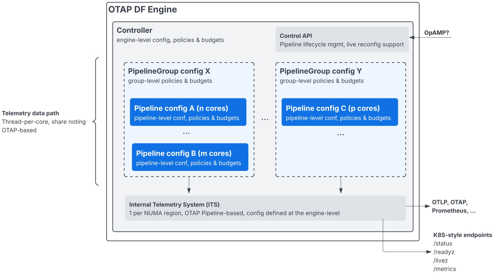

# OTAP Dataflow Engine Controller

The OTAP Dataflow Engine Controller is responsible for deploying, managing, and
monitoring pipeline groups within a single OTAP Dataflow Engine process.

It acts as the local control plane for pipeline execution, CPU resource
allocation, lifecycle management, and inter-pipeline coordination, while
preserving the engine's core design principles: thread-per-core execution,
share-nothing hot paths, and predictable performance.

## Execution Model

Each pipeline configuration declares its CPU requirements through quota
settings. Based on these settings, the controller allocates CPU cores and spawns
one dedicated worker thread per assigned core.

Threads are pinned to distinct CPU cores, following a strict **thread-per-core**
model. A pipeline deployed on `n` cores results in `n` worker threads, each
bound to a specific core for deterministic scheduling and efficient cache
locality.

Hot data paths are fully contained within each thread. Inter-thread
communication is restricted to control messages and internal telemetry only,
minimizing contention and avoiding shared mutable state on the data plane.

## CPU Isolation and Core Sharing

By default, pipelines are expected to run on dedicated CPU cores. This mode
provides the strongest isolation and the most predictable performance. It is
also possible to deploy multiple pipeline configurations on the same CPU
cores, primarily for consolidation, testing, or transitional deployments. This
configuration comes at the cost of reduced efficiency, especially in terms of
CPU cache locality. Even in this mode, pipeline instances run in independent
threads and do not share mutable data structures.

The controller does not perform implicit work stealing, dynamic scheduling, or
automatic load balancing across threads. Any form of cross-pipeline or
cross-thread data exchange must be explicitly modeled.

## Control Plane and Lifecycle Management

Each pipeline is associated with a control channel managed by the controller.
Control messages are used to:

- start and stop pipelines,
- trigger graceful shutdowns,
- propagate configuration or lifecycle events.

Graceful shutdown ensures that in-flight work can be completed or drained
according to pipeline semantics before threads are terminated.

## Load Balancing Today

At the ingress level, the engine already supports OS-level load balancing via
`SO_REUSEPORT` on platforms that provide it. This mechanism allows incoming
connections or traffic to be distributed across multiple receiver threads
efficiently and with minimal overhead.

This form of load balancing is intentionally limited to the receiver stage and
relies on operating system support.

## Future Evolutions

The controller is designed to evolve alongside the engine. Several major
extensions are planned or under exploration.

### Named Channels

Controller-managed **named channels** will be introduced as an explicit
mechanism for connecting pipelines and modeling data exchange between them.
Named channels will be in-memory MPMC channels with well-defined ownership,
capacity, and backpressure semantics. They will be the recommended way to
implement explicit routing and load balancing schemes within the engine,
complementing `SO_REUSEPORT` rather than replacing it.

Crucially, named channels preserve the design principle that there is no
implicit cross-thread or cross-pipeline load balancing: all such behavior must
be explicitly declared in the pipeline topology.

### NUMA-Aware Controller

Future versions of the controller are expected to become fully NUMA-aware.
This includes:

- allocating pipelines on specific NUMA nodes,
- pinning threads accordingly,
- favoring local memory allocation,
- minimizing cross-socket traffic.

NUMA awareness is a key step toward scaling efficiently on high core-count,
multi-socket systems.

### Morsel-Driven Parallelism

In the OTAP Dataflow Engine, **batches** are the natural equivalent of
"morsels". Future designs may introduce batching at the ingress stage, before
data traverses load-balancing boundaries such as per-core queues or MPMC named
channels. This enables a form of **morsel-driven parallelism**, where:

- worker threads remain fixed and pinned to cores,
- batches (morsels) are dynamically distributed,
- preemption happens only at batch boundaries,
- backpressure and bounded memory are preserved.

This approach is inspired by the work described in:

> *Morsel-Driven Parallelism: A NUMA-Aware Query Evaluation Framework for the
Many-Core Age*
> Thomas Neumann, Tobias Muhlbauer, Alfons Kemper
> [https://db.in.tum.de/~leis/papers/morsels.pdf](https://db.in.tum.de/~leis/papers/morsels.pdf)

The goal is to enable flexible and explicit load balancing for compute-heavy or
skewed workloads, while remaining fully compatible with the engine's
thread-per-core and share-nothing principles.

## Design Principles (Summary)

- Thread-per-core execution with CPU pinning
- Share-nothing hot data paths
- Explicit, bounded communication only
- No implicit scheduling or load balancing
- Predictable performance and backpressure by design

The controller is the foundation that enforces these principles while allowing
controlled and explicit evolution of the execution model.

## Todo list

- [ ] Improve configuration validation and error messages
- [ ] Expose a controller API (OpAMP ?)
- [ ] Add support for NUMA awareness
- [ ] Add support for dynamic reconfiguration
- [ ] Add support for custom plugins/extensions
