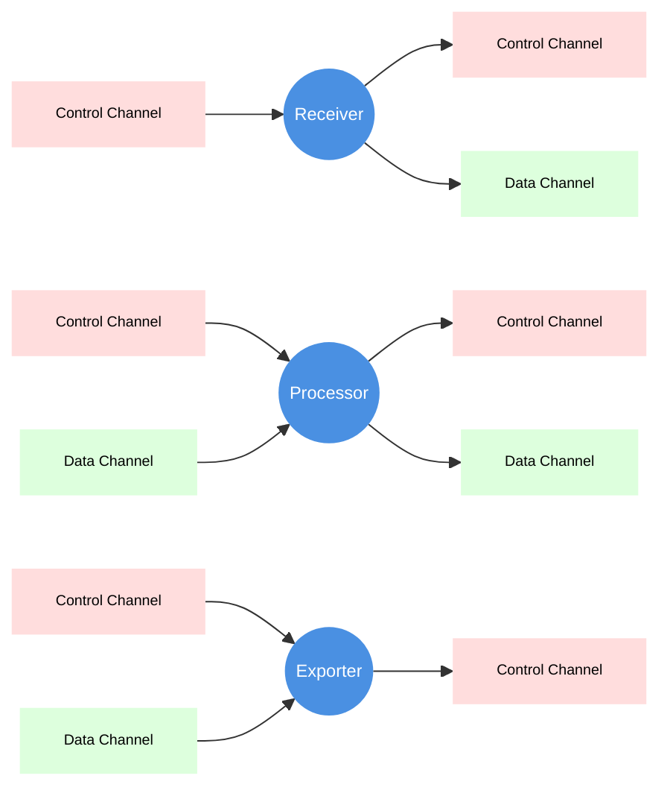

# Pipeline Engine

Status: **WIP**

## Nodes

The Pipeline Engine consists of three main node types:

- Receiver: A node that receives or scrapes telemetry data from a telemetry
  source.
- Processor: A node that processes telemetry data.
- Exporter: A node that exports telemetry data to a telemetry sink.

Each node can receive control messages from the Pipeline Engine to manage its
operation.

