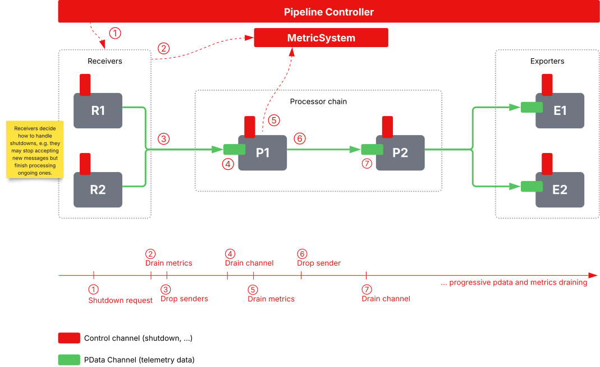

# Pipeline Engine

Status: **WIP**

## Introduction

The term pipeline is used here to represent an interconnection of nodes forming
a Directed Acyclic Graph (DAG). The inputs of a pipeline are called receivers,
the intermediate processing nodes are called processors, and the output nodes
are referred to as exporters.

Messages flowing through a pipeline are generically referred to as pdata (i.e.
Pipeline Data). An OTLP message or an OTAP message are examples of pdata types.
This pipeline framework is generic over pdata, which means:

- It is possible to instantiate an OTLP pipeline, an OTAP pipeline, or even a
  pipeline designed to support another type of pdata.
- It is not possible to support multiple pdata types within a single pipeline.
  However, a fourth type of component, called a connector, can be used to bridge
  two pipelines and enable interoperability between different pdata types.

This terminology aligns well with the concepts introduced in the OTEL Go
Collector.

## Architecture

A list of the design principles followed by this project can be found
[in /docs](../../docs/design-principles.md). More specifically, the pipeline
engine
implemented in this crate follows a share-nothing, thread-per-core approach. In
particular, one instance of the pipeline engine is created per core. This
engine:

- Is based on a single-threaded async runtime
- Avoids synchronization mechanisms whenever possible
- Declares async traits as `?Send`, providing `!Send` implementations and
  futures whenever practical
- Relies on listening sockets configured with the `SO_REUSEPORT` option,
  allowing the OS to handle connection load balancing
- May share immutable data between cores, but ideally only within a single NUMA
  node

These design principles focus on achieving high performance, predictability, and
maintainability in an observability gateway implemented in Rust. Targeting a
single-threaded async runtime reduces complexity, enhances cache locality, and
lowers overhead. Favoring `!Send` futures and declaring async traits as `?Send`
maximizes flexibility and allows performance gains by avoiding unnecessary
synchronization. Minimizing synchronization primitives prevents contention and
overhead, thus ensuring consistently low latency. Avoiding unbounded channels
and data structures protects against unpredictable resource consumption,
maintaining stable performance. Finally, limiting external dependencies reduces
complexity, security risks, and maintenance effort, further streamlining the
gateway's operation and reliability.

## Runtime Channels and Control Messages

The pipeline engine uses bounded channels only.

At runtime, compatible pipeline connections are grouped into hyper-edges, and
each hyper-edge is wired onto one bounded underlying `pdata` channel. With
ordinary multi-destination `one_of` wiring, multiple consumers on the same
hyper-edge compete on that shared channel. Generic hyper-edge broadcast fan-out
is not implemented today.

Each pipeline runtime uses three channel families:

1. **PData Channels**: These carry only `pdata`. Receivers and processors
   produce onto them; processors and exporters consume them.
2. **Node Control Channels**: There is one bounded node-control channel per
   node. Receivers consume this channel in competition with their external
   ingress sources and are expected to prioritize control. Processors and
   exporters consume node control together with `pdata` through
   `MessageChannel`.
3. **Pipeline Runtime Channels**: Each pipeline runtime owns two bounded shared
   MPSC channels:
   - a **pipeline-control channel** for timers, delayed-data requests,
     receiver-drain notifications, and shutdown requests, consumed by
     `PipelineCtrlMsgManager`;
   - a **pipeline-return channel** for `DeliverAck` / `DeliverNack`, consumed
     by `PipelineReturnMsgDispatcher`.

For processors and exporters, `MessageChannel` prefers control over `pdata`,
but it no longer gives control absolute priority. After 32 consecutive control
messages, it forces one `pdata` receive attempt when `accept_pdata()` allows
it, preventing control storms from starving the data path.

The current message families are:

- **Node control messages**: `Ack`, `Nack`, `Config`, `TimerTick`,
  `CollectTelemetry`, `DelayedData`, `DrainIngress`, `Shutdown`
- **Pipeline control messages**: `StartTimer`, `CancelTimer`,
  `StartTelemetryTimer`, `CancelTelemetryTimer`, `DelayData`,
  `ReceiverDrained`, `Shutdown`
- **Pipeline return messages**: `DeliverAck`, `DeliverNack`

## Effect Handlers

### Concept and Purpose

Effect handlers are a core abstraction that provide a clean interface for
pipeline components (receivers, processors, and exporters) to perform side
effects such as sending messages, opening sockets, or managing other resources.
They hide the implementation details of these operations, abstracting away the
specific async runtime and platform details from the implementers of these
nodes.

This abstraction allows the engine to control how these side effects are
actually performed, while providing a consistent interface for component
developers. There are two implementations of effect handlers:

1. **NotSendEffectHandler (!Send)**: The default and preferred implementation.
   These handlers use `Rc` internally for reference counting and work with
   components that don't need to be sent across thread boundaries. This aligns
   with the project's single-threaded, thread-per-core design philosophy.

2. **SendEffectHandler (Send)**: An alternate implementation for components that
   need to integrate with libraries requiring `Send` bounds. These handlers use
   `Arc` internally.

### Why Different Effect Handlers Were Introduced

The dual effect handler approach was introduced to address several challenges:

1. **Abstracting Engine Implementation**: Effect handlers decouple the node
   implementations from the specifics of how messages are sent between nodes,
   allowing the engine to evolve independently from the components.

2. **Library Integration**: Some external libraries (e.g. Tonic) don't yet
   support `?Send` trait declarations (see
   [Tonic issue #2171](https://github.com/hyperium/tonic/issues/2171)). The
   type-level declaration with `SendEffectHandler` provides a pathway to
   integrate such libraries. For nodes that don't need to be `Send`, there's no
   synchronization overhead.

3. **Unified Interface with Type-Level Requirements**: Components parameterize
   their effect handler type in their interface, allowing them to declare their
   specific requirements at the type level while maintaining a consistent API.

### Preferred Implementation Approach

For this project, **`NotSendEffectHandler` is the preferred and recommended
approach** for most components.

`SendEffectHandler` exists primarily as an escape hatch for specific
implementations that must interact with libraries requiring `Send` traits, such
as OTLP Receivers based on Tonic GRPC services.

## Ack/Nack Delivery Mechanism

The engine builds-in a mechanism for returning the success or failure
of each data request in the pipeline. Components can opt-in to receive
Ack (positive acknowledgement) or Nack (negative acknowledgement) node
control messages.

Ack/Nack unwinding is intentionally separated from timer and shutdown
orchestration. Nodes publish return-path events on the pipeline-return channel,
and `PipelineReturnMsgDispatcher` unwinds the caller subscription stack and
forwards `Ack` / `Nack` node-control messages to the closest interested
upstream node.

The data layer above the engine is responsible for the physical
representation of the request context. The engine effect handler and
the `<PData>` type have a cooperative calling convention, as follows:

1. Caller subscribes for a set of `Interests` before calling `send` on
   the `&mut PData`.
2. When notified of Ack or Nack, the component must use `notify_ack`
   or `notify_nack` on the PData.

Caller subscription state is conceptually a stack of `Interests` with
routing information (`NodeID`) and user-defined `CallData`.

### Interests

Interests are a 8-bit, `bitflags` crate macro-derived enum:

- `ACKS`: To subscribe to Ack messages
- `NACKS`: To subscribe to Ack messages
- `RETURN_DATA`: Request return of the data.

The `RETURN_DATA` interest supports the re-use of request data, if
desired.

### CallData

The `CallData` type is a small, fixed-size field used to carry
user-defined data in the caller subscription state. From the engine's
perspective, `<PData>` is opaque, making the subscription state not
visible. This has two important implications for the API and calling
convention.

1. The engine propagates the `PData` type backwards in the pipeline in
   the node control message using the opaque `Box<PData>`
2. Methods to construct Ack and Nack messages, which inspect and
   modify caller subscription state, are traits in the engine crate,
   implemented in the data layer. Callers will use effect handler
   extensions, `PData`-aware methods for Ack/Nack subscription and
   notification.

Because `PData` usually returns without its payload, callers are
expected save information they want to use about the payload (e.g.,
number of items, encoded size) before sending messages.

### RETURN_DATA

Since we usually want to drop the memory associated with a request on
the Ack/Nack return path, the payload is dropped automatically unless
`Interests::RETURN_DATA` is set.  Either way, the `PData` object
contains the caller subscription state used on the return path so
both Ack and Nack contain a non-optional `PData` field.

In both Ack and Nack cases, the use of `RETURN_DATA` is not
guaranteed. Components should consider the possibility of lost
Ack/Nack messages in rare circumstances.

### Caller Subscription

When a component acting as a producer sends a `<PData>` message and
wants to be informed of the outcome via Ack/Nack, it will use a call
sequence like:

```rust
use otap_df_engine::{Interests, ProducerEffectHandlerExtension};

// Example for a processor
async fn process(
    &mut Processor,
    msg: Message<OtapPdata>,
    slots:
    effect: &mut local::EffectHandler<OtapPdata>,
) -> Result<(), EngineError> {
    match msg {
        Message::PData(mut pdata) => {
            // Subscript to Ack/Nack
            let call_state = SomeCallData::new(...);
            effect.subscribe_to(
                Interests::ACKS|Interests::NACKS,
                call_state.into(),
                &mut pdata,
            );
            // Send the message
            effect.send_message(pdata).await
        }
        Message::Control(ctrl) => {
            // See below to handle the Ack/Nack
        }
    }
```

Depending on the caller, there are different ways to construct the
`CallData`. Some components will be stateless, provided they can fit
everything they need for Ack/Nack handling into the provided space
with clonable data. See the core-nodes retry processor as an example of
this approach, which stores a retry count and timestamp in the call
data.

Some components will require dedicated space that does not fit the
calldata pattern, they will have to manage their own state. See the
`otap_df_otap::accessory::slots::State` structure as an example that
supports a limited number of slots for user-defined storage with a
built-in `CallData` type.

### Caller Return

When a component acting as a consumer has finished processing a
`<PData>` message and wants to inform the next subscriber of the
outcome via Ack/Nack, it will use a call sequence like:

```rust
use otap_df_engine::ConsumerEffectHandlerExtension;

// Example for an exporter
async fn export(
    &mut Exporter,
    msg: Message<OtapPdata>,
    slots:
    effect: &mut local::EffectHandler<OtapPdata>,
) -> Result<(), EngineError> {
    match msg {
        Message::PData(mut pdata) => {
            // export the data
            // send an Ack message
            effect.notify_ack(AckMsg::new(pdata)).await
        }
    ...
}
```

Likewise, the `ConsumerEffectHandlerExtension::notify_nack` method
tells the engine to route a Nack message. The engine never deals
directly in forming the `AckMsg` and `NackMsg` types, as they contain
call data "popped" from the caller subscription state. Therefore, the
`notify_ack` and `notify_nack` extension methods construct the next
Ack or Nack message using functions that pop subscription frames,
identify the next subscriber by node ID, place their call data in the
Ack or Nack, and route the control message.

### Handling Ack and Nack messages

A typical processor with an interest in Ack or Nack will both consume
and produce Ack/Nack messages. For example:

```rust
// Example for a processor
async fn process(
    &mut Processor,
    msg: Message<OtapPdata>,
    slots:
    effect: &mut local::EffectHandler<OtapPdata>,
) -> Result<(), EngineError> {
    match msg {
        Message::PData(mut pdata) => {
            // See above to set the call data
        }
        Message::Control(ctrl) => {
            match ctrl {
                NodeControlMsg::Ack(ack) => {
                    // Get the call data.
                    let mycalldata: SomeCallData = ack.calldata.try_into()?;

                    // Do something before returning

                    // Notify the next subscriber
                    effect.notify_ack(ack).await
                }
                NodeControlMsg::Nack(mut nack) => {
                    // Get the call data.
                    let mycalldata: SomeCallData = ack.calldata.try_into()?;

                    // Do something before returning

                    // Modify the Nack reason
                    nack.reason = format!("more info: {}", nack.reason);

                    // Notify the next subscriber
                    effect.notify_nack(nack).await
                }
                // ...
            }
        }
    }
```

Note that without subscribing to any interest, components are
completely bypassed on the return path. Caller subscription frames
that are not used for lack of interest are automatically skipped
(e.g., an Ack was delivered with only `Interests::NACKS`).

## Graceful Shutdown Sequence

The pipeline engine supports graceful shutdown of pipelines and their nodes.
Shutdown is initiated by sending `PipelineControlMsg::Shutdown` to the
pipeline-control channel; it is not implemented by broadcasting `Shutdown`
directly to every node at once.

When graceful shutdown starts, the pipeline control manager:

1. Enters ingress-draining mode.
2. Cancels recurring timers.
3. Flushes any queued delayed data back to the originating nodes as
   `NodeControlMsg::DelayedData`.
4. Sends `NodeControlMsg::DrainIngress` to every receiver.

Each receiver is then responsible for stopping admission of new external work
while keeping its receiver-local drain state alive long enough to finish local
cleanup. For example, an RPC receiver can keep its wait-for-result registry,
transport shutdown, and telemetry finalization alive until it has no more
admitted requests to resolve. Once ingress is closed and receiver-local drain
work is complete, the receiver reports `PipelineControlMsg::ReceiverDrained`.

After all receivers have reported `ReceiverDrained`, the control manager sends
`NodeControlMsg::Shutdown` to processors and exporters. Their `MessageChannel`
continues delivering control messages while draining any remaining `pdata`
until inputs close or the shutdown deadline is reached.

As receivers exit and drop their `pdata` senders, downstream channels drain and
close progressively toward exporters. Once a downstream input is fully drained
or closed, the corresponding consumer receives `Shutdown` and exits its run
loop.

If the shutdown deadline expires, receivers may force-resolve remaining
receiver-local waiters and the pipeline control manager forces the remaining
nodes to exit.



When no fatal error occurs and nodes honor the shutdown deadline, this sequence
allows the pipeline to stop gracefully while preserving backpressure and
bounded memory semantics.

## Testability

All node types, as well as the pipeline engine itself, are designed for isolated
testing. Practically, this means it's possible to test components like an OTLP
Receiver independently, without needing to construct an entire pipeline. This
approach facilitates rapid and precise identification of issues such as memory
overconsumption, bottlenecks, or logical errors within individual nodes.

The engine provides an extensive `testing` module containing utilities tailored
to each pipeline component:

- Defined test message types and control message counters for monitoring
  component behavior.
- Dedicated test contexts and runtimes specifically built for receivers,
  processors, and exporters.
- Single-threaded asynchronous runtime utilities aligned with the engine's
  non-Send design philosophy.
- Convenient helper functions for establishing and managing communication
  channels between components.

These utilities streamline the process of validating individual component
behaviors, significantly reducing setup effort while enabling comprehensive
testing.

## Compile-Time Plugin System

This project uses a compile-time plugin system based on the
[`linkme`](https://docs.rs/linkme) crate to register node factories, such as
receivers, processors, and exporters, along with their associated URNs (Uniform
Resource Names). This mechanism enables the engine to dynamically instantiate
nodes for specific URNs by looking up and invoking the appropriate factory at
runtime.

Each node type exposes a factory function, which is registered using `linkme`'s
distributed slice feature. At startup, the engine collects all registered
factories, allowing new node types to be added simply by implementing and
registering a new factory. This approach provides a flexible and extensible
foundation for building complex pipelines.

Currently, this plugin infrastructure only supports built-in plugins compiled
directly into the binary. However, the system is designed with future
extensibility in mind. There are plans to support loading plugins via WASM,
which would allow for dynamic, user-defined node types to be loaded at runtime
without requiring a full rebuild of the engine.

**Note:** The plugin system is still a work-in-progress. While the compile-time
registration and dynamic instantiation of built-in nodes is functional, support
for external (e.g. WASM-based) plugins is planned but not yet implemented.

## Telemetry

### Predefined Attributes

The pipeline engine defines a set of predefined attributes that can be used for
labeling metrics and traces. These attributes provide context about the pipeline
and its components, facilitating better observability and analysis.

| Scope    | Attribute           | Type    | Description                                                  |
|----------|---------------------|---------|--------------------------------------------------------------|
| Resource | process_instance_id | string  | Unique process instance identifier (base32-encoded UUID v7). |
| Resource | host_id             | string  | Host identifier (e.g. hostname).                             |
| Resource | container_id        | string  | Container identifier (e.g. Docker/containerd container ID).  |
| Engine   | core_id             | integer | Core identifier.                                             |
| Engine   | numa_node_id        | integer | NUMA node identifier.                                        |
| Pipeline | pipeline_id         | string  | Pipeline identifier.                                         |
| Node     | node_id             | string  | Node unique identifier (in scope of the pipeline).           |
| Node     | node_type           | string  | Node type (e.g. "receiver", "processor", "exporter").        |
