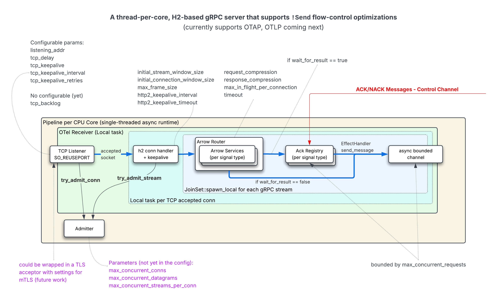

# OTAP Pipeline

The OTAP (OpenTelemetry Arrow Protocol) crate contains receivers, processors,
and exporters natively supporting OTAP Pdata.

## Receivers

- OTLP Receiver: A receiver accepting OTLP messages over gRPC.
- OTAP Receiver: A receiver accepting OTAP messages over gRPC.
- Syslog CEF Receiver: A receiver accepting TCP and UDP Syslog messages
  formatted in the Common Event Format (CEF), RFC-3164, and RFC-5424.
- Fake Data Generator: A receiver generating fake data for testing
  purposes. Fake signals are generated from semantic convention registries.

## Processors

- Attribute Processor: A processor to rename and delete attributes on
  spans, metrics, and logs. Other operations such as inserting and updating
  attributes will be added in the future.
- Batch Processor: A processor to batch incoming data into batches of a
  specified size or timeout.
- Debug Processor: A processor to log incoming data for debugging
  purposes.
- Retry Processor (WIP): A processor to retry sending data on failure.
- Signal Type Router: A processor to route data based on signal type
  (traces, metrics, logs) to different downstream nodes.

## Exporters

- OTLP Exporter: An exporter sending OTLP messages over gRPC.
- OTAP Exporter: An exporter sending OTAP messages over gRPC.
- Noop Exporter: An exporter that drops all data.
- Parquet Exporter: An exporter that writes data to Parquet files.
- Geneva Exporter (Experimental): An exporter for Microsoft Geneva monitoring
  backend. Supports logs and traces. See [experimental/geneva_exporter](src/experimental/geneva_exporter/)
  for details. Enable with `--features geneva-exporter`.

## Generate Protobuf Stubs

In the root of the repository, run:

```bash
cargo xtask compile-proto
```

## OTel Receiver (experimental)

The experimental OTEL receiver implements a gRPC Arrow endpoint directly on
top of `h2`, optimized for the thread-per-core runtime. Support for serving
OTLP traffic on the same listener is under active development so a single port
can accept both OTAP and OTLP gRPC streams.



### High-level flow

1. **Local receiver** - The `OtelReceiver` implements the `local::Receiver`
   trait so it fits into the thread-per-core design of the OTAP pipeline
   engine.
2. **TCP accept + admission control** - The receiver listens on the configured
   address using the framework's `EffectHandler`. Every accepted socket passes
   through an `Admitter`, which enforces global connection limits before we
   spawn a local task dedicated to that connection.
3. **HTTP/2 handshake and keepalive** - `handle_tcp_conn` performs the h2
   handshake, wires up optional keepalive pings, and then repeatedly accepts
   inbound gRPC streams. A per-connection `ConnectionGuard` provides
   `try_open_stream` so we can apply stream-level backpressure.
4. **Request routing** - Each gRPC stream is handled by
   `GrpcRequestRouter::handle_request`, which:
   - Parses compression headers and negotiates the response encoding.
   - Wraps the raw `RecvStream` in a `GrpcStreamingBody`, decoding the 5-byte
     gRPC frame headers and decompressing payloads on demand (Zstd/Gzip/Deflate).
   - Dispatches to `stream_batch_statuses`, providing the signal-specific
     `AckRegistry` when `wait_for_result` is enabled.
5. **Pipeline dispatch + ACK/NACK** - `stream_batch_statuses` converts each
   `BatchArrowRecords` into `OtapPdata`, pushes it through the local
   `EffectHandler::send_message` (bounded by `max_concurrent_requests`), and
   optionally registers an ACK wait slot. ACK/NACK control messages from the
   pipeline re-enter the receiver via the control channel and are routed back to
   the `AckRegistry`, completing futures inside `stream_batch_statuses`. The
   resulting `BatchStatus` entries stream back to the client.

### Configurable parameters

- **Network / TCP** - `listening_addr`, `tcp_nodelay`, optional HTTP/2
  keepalive interval/timeout. (Future work: TLS acceptor, keepalive retries, ...)
- **HTTP/2 / gRPC** - `initial_stream_window_size`,
  `initial_connection_window_size`, `max_frame_size`, request/response
  compression lists, `max_concurrent_requests`, per-connection
  `max_in_flight_per_connection`, optional `timeout` enforced via
  `RequestTimeout`.
- **Flow control** - The global `Admitter` (connection/stream limits) and the
  per-request ACK registry both bind in-flight work. When `wait_for_result` is
  disabled, batches still flow through the effect handler but ACK registries are
  skipped.

### Key implementation notes

- The entire stack runs `!Send`: each connection, stream, and ACK future stays on
  the per-core runtime. This avoids cross-thread synchronization and matches the
  "thread-per-core" approach of the overall engine.
- Compression handling lives in `grpc.rs` (`GrpcStreamingBody` and
  `GrpcMessageEncoder`). Zstd allocates long-lived encoder/decoder instances per
  stream, while gzip/deflate instantiate per-frame decoders because they are
  lightweight.
- `stream.rs` contains the core state machine (`StatusStreamState`) that keeps a
  bounded set of in-flight batches, feeds the pipeline, and yields
  `BatchStatus` results as soon as ACK/NACK completions arrive.
- Control-channel integration happens at the top of `start`: ACK/NACK messages
  from downstream nodes are routed via `route_local_ack_response` /
  `route_local_nack_response`, completing the registries highlighted in the
  design diagram.
