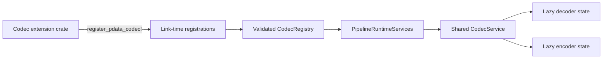
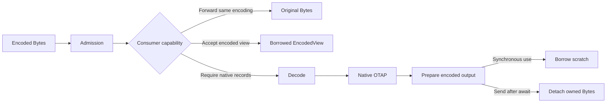

# PData codecs

This crate defines the extension boundary between independently decodable byte
formats and native OTAP Arrow records in the OTel Arrow Dataflow Engine.

Codecs describe an encoded representation, register immutable factories at link
time, and keep mutable decoder or encoder state inside one pipeline runtime. A
payload carries only its encoding identity, signal, bytes, and cached metadata;
it never owns a codec instance.

## Design model

- `PdataEncoding` is the stable identity used by configuration and diagnostics.
  Put incompatible format versions and intrinsic compression in that identity.
  HTTP and gRPC compression remain transport properties.
- `CodecMetadata` declares the signals supported by an encoding and optional
  descriptive metadata.
- `CodecRegistration` supplies decoder, encoder, item-counter, and later
  batching capabilities. A codec may be decode-only or encode-only.
- `CodecRegistry` validates the complete link-time registry once. Duplicate or
  invalid identities fail pipeline runtime construction deterministically.
- `CodecService` creates mutable implementations lazily and reuses them within
  one pipeline runtime. Payload admission and matching-format forwarding do not
  instantiate a codec.
- Native OTAP remains the mutable processing representation and the fallback
  intermediate for conversion between different encodings.

Every encoded payload must be independently decodable. Stream-relative state,
such as a dictionary shared across batches, is not a pdata encoding unless each
payload contains everything needed to reconstruct that state.



Receivers, processors, and exporters in one pipeline receive clones of the same
runtime-services handle. The registry is immutable after validation, while the
service creates only the mutable codec state that the pipeline actually uses.

## Implement a codec

Implement `PdataDecoder` to convert complete encoded batches to native OTAP.
Implement `PdataEncoder` when exporters may produce the format. Stateful
implementations can retain bounded scratch memory because factories create one
instance lazily per pipeline runtime.

Decoder implementations must:

- Treat the input as untrusted and return `CodecError` instead of panicking.
- Preserve the signal supplied by the caller.
- Recover after an error so the same instance can decode a later valid batch.
- Avoid retaining the input `Bytes`; the engine preserves it for Nack or retry.

Encoder implementations must produce complete, independently decodable output.
The basic `encode` method returns owned `Bytes`. An encoder with reusable scratch
storage can override `prepare_encode`. A synchronous consumer can borrow the
prepared bytes, while an asynchronous sender calls `EncodeOutput::into_bytes`
before `.await` to detach ownership from codec state.

## Execution and asynchronous ownership

Codec decoder and encoder methods currently execute synchronously while the
pipeline-local codec service has exclusive access to the selected instance.
Prepared output may borrow an encoder's scratch buffer only during a synchronous
callback. `EncodeOutput::into_bytes` detaches the output before an asynchronous
transport send; it does not offload or make the encoder itself asynchronous.

A slow codec would therefore block the calling pipeline runtime today. The
engine service boundary is the intended integration point for a future bounded
executor: fast codecs can remain inline, while codecs explicitly classified as
blocking can receive owned inputs and return owned outputs through offloaded
work. That execution policy is not part of the current codec contract.



## Register a codec

Declare static metadata and build a registration with only the capabilities the
format supports:

```rust,ignore
use otel_arrow_dfe_config::SignalType;
use otel_arrow_dfe_pdata_codec::{
    CodecMetadata, CodecRegistration, PdataEncoding, register_pdata_codec,
};

const EXAMPLE_ENCODING: PdataEncoding = PdataEncoding::new("example-v1");

static EXAMPLE_METADATA: CodecMetadata = CodecMetadata::new(
    EXAMPLE_ENCODING,
    &[SignalType::Logs],
)
.with_format_version("1");

register_pdata_codec!(
    EXAMPLE_CODEC,
    CodecRegistration::new(&EXAMPLE_METADATA)
        .with_decoder(|| Box::new(ExampleDecoder::default()))
        .with_item_counter(count_items),
);
```

The function-style macro is intentionally thin. It hides the link-time inventory
and required unsafe-lint exemption, so an extension crate does not need a direct
`linkme` dependency. The typed const builder remains the source of registration
options and compiler diagnostics instead of being duplicated in a custom macro
syntax. A procedural attribute macro would require another crate and generated
code without improving this contract.

Registration and duplicate-name policy belong to the registry, not the macro.
Registration order is not a precedence mechanism, and the default registry
rejects duplicate identities independently of link order.

An item counter is optional and must be stateless. Return `None` when the count
cannot be determined; zero means the payload was inspected and contains no
primary-signal items.

## Test a codec

Enable the `testing` feature and run `assert_decode_conformance` with valid and
malformed samples for every supported signal. The shared harness verifies
signal and item-count preservation, repeated failure behavior, recovery, and
state reuse.

Add codec-specific tests for:

- Format boundary cases and strict malformed-input handling.
- Conversion fidelity and representation-specific limits.
- Independent decoding of every encoded output.
- Bounded scratch, allocation, and decompression behavior.
- Encoder recovery after limits or other failures.

From `rust/otap-dataflow`, validate changes with:

```console
cargo test -p otel-arrow-dfe-pdata-codec
cargo clippy -p otel-arrow-dfe-pdata-codec --all-targets -- -D warnings
```

Run `cargo xtask check` before submitting a pull request.

The built-in OTLP codec is the reference implementation for a codec supporting
decoding, encoding, borrowed views, stateless item counting, reusable buffers,
and all three telemetry signals.
