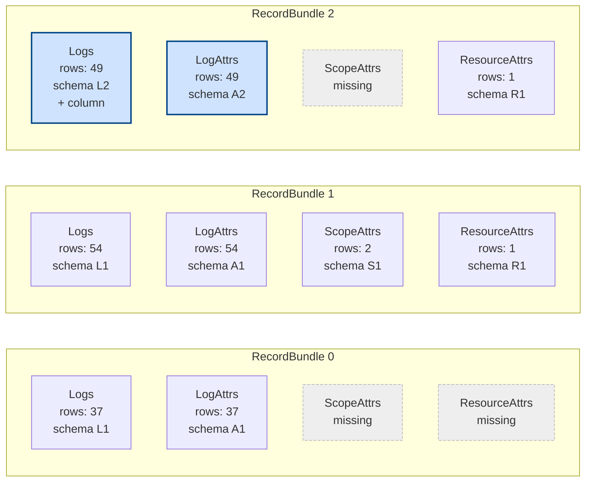
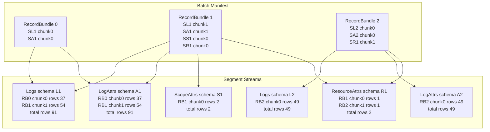
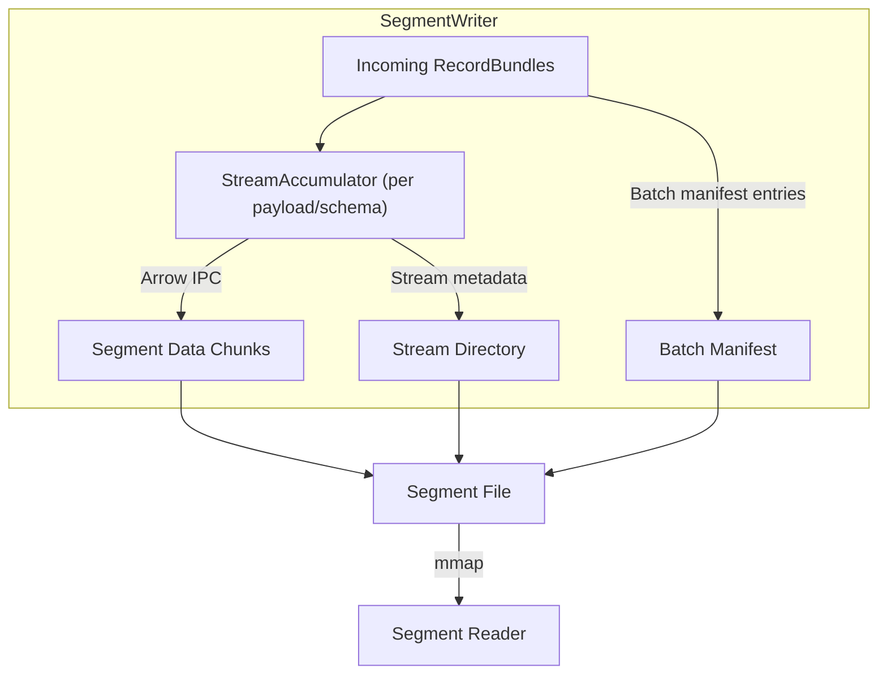
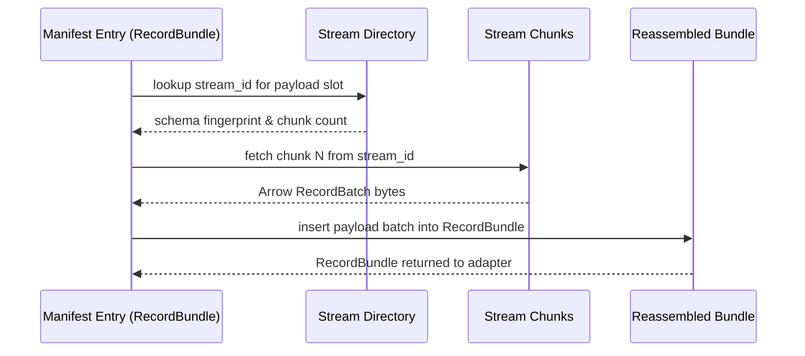

# Quiver - Arrow-Based Persistence for OTAP Dataflow - Architecture

## Problem Statement

`otap-dataflow` currently operates purely in-memory. We anticipate users needing
**durability**: the ability to survive process crashes and network outages
without data loss.

## Proposed Solution: Quiver

Quiver is a standalone, embeddable Arrow-based segment store packaged as a
reusable Rust crate. This document defines its design, scope, and implementation
details. While Quiver is being developed first for `otap-dataflow`, it is designed to be
decoupled so it can integrate into other telemetry pipelines or streaming
systems that need durable buffering around Apache Arrow.

Throughout the proposal we use **RecordBundle** to describe the logical unit
Quiver persists. In OTAP terms this corresponds to an `OtapArrowRecords`
value: a fixed set of payload slots (`Logs`, `LogAttrs`, `ScopeAttrs`,
`ResourceAttrs`, etc.) that may or may not be populated for a given RecordBundle.

### Core Concepts

**Segment Store**: Immutable files containing multiple Arrow IPC file streams
with batches of telemetry.
Each segment file:

- Groups multiple `RecordBundle` arrivals (32MB default target size) and persists
 the per-slot Arrow streams they reference.
- Supports many payload types and evolving schemas inside the same segment via
  a stream directory + batch manifest.
- Contains metadata: time ranges, signal type (via adapter), schema fingerprints,
  checksum, and per-stream statistics.
- Supports zero-copy memory-mapped reads.

**Write-Ahead Log (WAL)**: Append-only log for crash recovery

- Records batches before segment finalization
- Configurable flush behavior (durability vs. latency trade-off)
- Truncated after segments are persisted

**Open Segment Buffer (In-Memory)**: Bounded in-memory accumulation

- Each incoming `RecordBundle` is appended to the WAL for durability and also
  to the current open segment's per-stream accumulators.
- Buffer size capped by `segment.target_size` (and optionally
  `segment.max_open_duration` for time slicing).
- On finalize trigger (size, duration, shutdown, or retention pressure) Quiver
  flushes each accumulator to its Arrow IPC stream slice and writes the segment
  directory + manifest.
- After the segment file + metadata are durable, the corresponding WAL region
  becomes eligible for truncation.
- Early finalize under pressure reduces memory footprint; metrics expose
  open segment bytes.

Write path overview:

1. Append `RecordBundle` to WAL (optionally flush/fdatasync per policy).
2. Send Ack to upstream producer.
3. Encode bundle payload slots into their stream accumulators (in-memory Arrow
  streaming writers).
4. Finalize: seal builders, assign `segment_seq`, write segment file + metadata.
5. Notify subscribers for each finalized `RecordBundle`; begin per-bundle
  Ack/Nack lifecycle.

**WAL Truncation Safety**:
"Safe" means the WAL entries you are removing are no longer needed for crash
recovery of segment data. Concretely:

1. All batches up to the boundary of one or more finalized segments have been
  serialized into a segment file AND that file plus its metadata have been
  made durable (written and flushed per the configured flush/fsync policy).
2. Those WAL entries are not part of the current open (still accumulating)
  segment.
3. The segment finalization was successful (no partial/corrupt write detected).

Subscriber ACKs are *not* required for truncation-the segment file is the
durable source for replay until retention deletes it. Truncation never removes
WAL entries belonging to:

- The active open segment.
- A segment whose file/metadata durability has not been confirmed.

#### WAL File Format & Rotation

- **Single append-only file per core**: each persistence instance writes to
  `wal/quiver.wal`, rolling into numbered siblings (`.1`, `.2`, ...) only when
  rotation triggers as described below. The steady-state design keeps writes
  sequential for simplicity and page-cache locality.
- **File header**: variable-width preamble starting with magic (`b"QUIVER\0WAL"`),
  version, header size, segment configuration hash, and WAL position start.
  Concretely the header is `{magic: [u8;10], version: u16, header_size: u16,
  segment_cfg_hash: [u8;16], wal_position_start: u64}` (38 bytes for version 1)
  and is always little-endian. The `header_size` field allows future versions to
  add fields without breaking backwards compatibility; readers should read
  `header_size` bytes total and ignore any unknown trailing fields. We bump
  `version` for any incompatible encoding change so older binaries can
  decisively reject files they cannot interpret and newer binaries can interpret
  the older file format.
  `segment_cfg_hash` is a 128-bit digest (e.g., truncated
  BLAKE3) over the adapter-owned layout contract: slot id -> payload mappings,
  per-slot ordering, checksum policy toggles, and any other settings that a
  particular adapter (OTAP today) uses to interpret RecordBundle payloads.
  `wal_position_start` records the WAL stream position at the start of this
  file; on rotation the new file's header captures the previous file's
  `wal_position_end` so that positions remain stable even after older rotated
  files are purged. We
  treat operational knobs such as `segment.target_size`, flush cadence, or
  retention caps as *out of scope* for the hash so mundane tuning never
  invalidates an otherwise healthy WAL. On replay a hash mismatch is treated the
  same as an unknown format version: Quiver refuses to ingest the WAL and asks
  operators either to finish draining with the previous adapter build or to
  migrate the data (e.g., replay through the old binary and regenerate segments)
  before rolling forward.
- **Framed entries**: every `RecordBundle` append writes a length-prefixed
  record:
  - 4-byte little-endian length of the entire entry (header + payloads)
  - Entry header (`u8 entry_type`, currently `0 = RecordBundle`)
  - Ingestion timestamp (`i64` nanos UTC) and per-core sequence number
    (`u64`, monotonically increasing per WAL writer)
  - Slot bitmap (currently a single `u64`) followed by `slot_count` metadata
    blocks. Each block contains `payload_type_id: u16`,
    `schema_fingerprint: [u8;32]`, `row_count: u32`, and
    `payload_len: u32`.
  - The slot bitmap tracks which logical `RecordBundle` slots are populated;
    bit `n` corresponds to slot `n`. Metadata blocks are emitted in ascending
    slot order for every set bit so the reader can deterministically associate
    each block with its slot without storing redundant ids.
  - Pseudo-layout for a `RecordBundle` entry, showing the precise write order
    (length and CRC fields are not covered by the checksum as noted below):

    ```text
    // Little-endian, sequential on disk
    u32 entry_len;                   // prefix (covers header..payload)
    EntryHeader {
        u8  entry_type;              // 0 = RecordBundle
        i64 ingestion_ts_nanos;
        u64 per_core_sequence;
        u64 slot_bitmap;             // current encoding fits <= 64 slots
    }
    for slot in slots_present(slot_bitmap) {
        SlotMeta {
            u16 payload_type_id;
            [u8;32] schema_fingerprint;
            u32 row_count;
            u32 payload_len;        // bytes of following Arrow IPC stream
        }
        [u8;payload_len] arrow_payload;  // streaming IPC bytes for the slot
    }
    u32 crc32;                       // trailer; covers EntryHeader..payloads
    ```

  - Arrow payload blobs are serialized in the **streaming** IPC format. For each
    populated slot we write exactly one contiguous IPC stream containing the
    chunk(s) belonging to that `Option<RecordBatch>` value. The blob for a slot
    immediately follows its metadata block, so the serialized representation of a
    single `RecordBundle` is `[entry header][slot bitmap][metadata0][payload0]
    [metadata1][payload1]...` Absent slots (bitmap bit cleared) contribute neither
    metadata nor bytes; they are implicitly `None` when reconstructing the
    bundle.
  - Every entry ends with a 4-byte little-endian CRC32 (IEEE polynomial)
    checksum that covers the entry header, bitmap, metadata blocks, and payload
    bytes (everything except
    the leading length field and the checksum itself). Replay verifies the CRC
    before decoding Arrow IPC bytes; a mismatch marks the WAL as corrupted and
    triggers truncation back to the last known-good offset.
  - Because the metadata describes the length of every blob, unknown entry
    types (future versions) can be skipped using the recorded length.
  - Each WAL append encodes the bundle's payload chunks once; crash replay
    decodes those IPC bytes back into `RecordBatch`es before reinserting them
    into the in-memory segment accumulators.
- **Replay model**: on startup we scan sequentially, validating the WAL header
  (preamble bytes + version), then iterating `length -> entry` until EOF. Each
  entry is parsed, checksum-verified, and dispatched by `entry_type`
  to rebuild open-segment state. If we encounter a partial entry (e.g., due to
  a crash mid-write) we truncate the file back to the last successful offset
  before continuing. Replay stops at the tail once the last partial segment is
  reconstituted.
- **Versioning / evolvability**: because the header encodes a version, we can
  introduce new entry types (e.g., periodic checkpoints) or swap serialization
  without breaking older data; unknown entry types are skipped using the recorded
  length. A checkpoint entry (`entry_type = 1`) would embed the current
  open-segment manifest, `logical_offset`, and high-water sequence numbers so
  recovery can jump directly to the latest checkpoint instead of replaying the
  entire log.

##### Cursor persistence & rotation mechanics

- **Track cursor progress**: After a segment finalizes and its metadata + file
  are flushed, we advance a *logical* cursor that tracks position in the WAL
  stream. This `wal_position` represents "the earliest WAL data still needed for
  crash recovery." We persist that `u64` into a tiny sidecar file (e.g.,
  `wal/quiver.wal.cursor`) immediately after advancing it and fsync the sidecar
  so crash recovery can resume from that logical position without rescanning
  finalized entries.
- **Cursor sidecar format**: The sidecar is a variable-width struct (24 bytes
  for version 1) written in little-endian order. The `size` field enables future
  versions to add fields while maintaining backward compatibility; a v1 reader
  can read a v2+ file by extracting the v1-compatible fields and skipping unknown
  trailing bytes:

  ```text
  CursorSidecar (v1, 24 bytes) {
      [u8; 8] magic = b"QUIVER\0T";  // distinguishes from WAL proper
      u16 version = 1;                // bump if layout changes
      u16 size = 24;                  // total encoded size (enables variable-width)
      u64 wal_position;               // position in the WAL stream
      u32 crc32;                      // covers magic..wal_position (everything except CRC)
  }
  ```

  We write updates via `quiver.wal.cursor.tmp`: encode the struct, compute the CRC,
  `pwrite`+`fdatasync`, then `renameat` over the live file so readers see either
  the old or new position. On startup we verify the magic, version, and checksum
  before trusting the recorded position; failure falls back to scanning from the
  beginning of `quiver.wal`.
- **Record prefix reclamation**: When higher layers report a safe cursor, we
  translate it into the logical coordinate space and persist it via the sidecar
  while leaving the active WAL file unchanged. The pointer simply marks how far
  readers have progressed through the concatenated stream.
- **Drop reclaimed prefixes**: Once the active file grows beyond
  `rotation_target_bytes` we rotate it to `quiver.wal.N` (where N is a
  monotonically increasing rotation id), start a fresh WAL, and remember the
  byte span covered by the retired file. When the persisted consumer cursor
  fully covers a rotated file we delete the file outright. Until a rotation
  occurs the reclaimed bytes remain in the active file even though they are
  logically safe to discard.
  *Note:* We may revisit direct hole punching in the future as a disk-space
  optimization if production workloads show that waiting for rotation leaves too
  much reclaimed data stranded in the active file.
- **Rotate on size**: `wal.max_size` caps the *aggregate* footprint of the active
  WAL plus every still-referenced rotated sibling. We keep a running total of the
  active file and the byte spans tracked for `quiver.wal.N`; when the next append
  would push the aggregate over the configured cap we rotate immediately: rename
  `wal/quiver.wal` to `quiver.wal.{next_rotation_id}` and reopen a fresh
  `quiver.wal`. Each rotation records the byte span covered by the retired file
  so cleanup can later delete `quiver.wal.N` only after the persisted logical
  cursor exceeds that span's upper bound. We never rewrite rotated files; they
  are deleted wholesale once fully covered by the durability pointer, avoiding
  rewrites of large historical blobs while keeping the total WAL footprint
  bounded by `wal.max_size`. To keep per-core directory fan-out predictable we
  retain at most `wal.max_rotated_files` files (default `10`, counting the
  active WAL plus rotated siblings). Operators can override the default. Hitting
  the rotated file cap is treated like hitting the byte cap: the next append
  that *would* require a rotation instead trips backpressure (or `drop_oldest`,
  if selected) until either compaction reclaims an older rotated file or the
  limit is raised. We never create more files in the background because doing so
  would undermine the predictive bound the knob is meant to provide.
- **Durability-only dependency**: Because WAL truncation depends solely on segment
  durability, exporter ACK lag never blocks WAL cleanup; segments themselves
  remain on disk until subscribers advance, but the WAL only needs to cover the
  currently open segment.

**Per-Subscriber Progress Files (`quiver.sub.<id>`)**: Each subscriber maintains
an independent progress file that records its current state.

##### Subscriber ID Naming Constraints

Subscriber IDs become part of the filename (`quiver.sub.<id>`), so they must be
filesystem-safe:

- **Non-empty**: At least one character
- **Max length**: 64 characters (conservative for cross-platform compatibility)
- **Character set**: ASCII alphanumeric, hyphen, underscore (`[a-zA-Z0-9_-]`)
- **No reserved names**: Cannot be `.`, `..`, or Windows reserved names
  (CON, PRN, etc.)

Examples: `exporter-otlp`, `backup_s3`, `metrics-1`

##### Progress File Format (v1)

The binary format is designed for forward and backward compatibility:

```text
Header (fixed size for v1 = 32 bytes):
+----------+---------+-------------+----------+-----------------------+-------------+----------+
| magic    | version | header_size | flags    | oldest_incomplete_seg | entry_count | reserved |
| (8B)     | (2B LE) | (2B LE)     | (2B LE)  | (8B LE)               | (4B LE)     | (6B)     |
+----------+---------+-------------+----------+-----------------------+-------------+----------+

Body (entry_count segment entries):
+------------+--------------+---------------+-----------------+
| seg_seq    | bundle_count | bitmap_words  | acked_bitmap    |
| (8B LE)    | (4B LE)      | (2B LE)       | (bitmap_words * 8B) |
+------------+--------------+---------------+-----------------+

Footer:
+----------+
| crc32    |
| (4B LE)  |
+----------+
```

Field descriptions:

- `magic`: `"QUIVSUB\0"` (8 bytes) - identifies file type
- `version`: Format version (currently 1)
- `header_size`: Total header bytes (32 for v1); allows skipping unknown fields
- `flags`: Reserved for future per-file options (must be 0 for v1)
- `oldest_incomplete_seg`: Segment sequence of oldest incomplete segment
- `entry_count`: Number of segment entries in body
- `reserved`: Zero-filled; available for future header fields
- `seg_seq`: Segment sequence number for this entry
- `bundle_count`: Total bundles in segment (for validation)
- `bitmap_words`: Number of 8-byte words in the bitmap
- `acked_bitmap`: Bit vector of acked bundles (1 = acked, LSB = bundle 0)
- `crc32`: CRC32C of all preceding bytes (header + body)

##### Compatibility Guarantees

- **Forward compatibility** (old reader, new writer):
  - `header_size` lets old readers skip unknown header extensions
  - Unknown trailing bytes after known fields are ignored
  - Unknown non-zero `flags` should warn but not fail

- **Backward compatibility** (new reader, old writer):
  - Version field identifies format; v1 readers reject v0 or unknown versions
  - Shorter-than-expected files are rejected as corrupted

- **Integrity**: CRC32C covers entire file; mismatches indicate corruption

##### File Semantics

- **Atomic updates**: Progress is written via `write temp → fsync → rename`,
  ensuring crash-safe updates without append-only log compaction.
- **Batched I/O**: In-memory state is updated on each ack; file writes are
  batched via the `maintain()` API. The embedding layer calls `maintain()`
  periodically (e.g., every 25-100ms) to flush dirty progress files and
  clean up completed segments.
- **Compact representation**: Only partially-complete segments are tracked.
  Once all bundles in a segment are acked, `oldest_incomplete_segment` advances
  and the segment entry is removed.

##### Recovery Semantics

- **Startup**: Read each `quiver.sub.<id>` file to restore that subscriber's
  state. No log replay required—file contains current state.
- **CRC validation**: If CRC fails, the file is considered corrupted. Recovery
  options: (1) start fresh from latest segment, (2) fail startup, or (3) use
  backup if available. Policy is configurable.
- **Cleanup coordination**: Before deleting a segment, all subscriber progress
  files must be flushed and show `oldest_incomplete_segment > deleted_segment`.

**Dual Time & Ordering Semantics**:

- **Event Time**: Timestamp embedded in telemetry (from source).
- **Ingestion Timestamp** (`ingestion_time`): Wall-clock timestamp (UTC) captured
  when data arrives; drives retention windows, metrics, and diagnostics.
- **Ingestion Sequence** (`segment_seq`): Monotonically increasing counter
  assigned per finalized segment; drives delivery ordering, high-water marks,
  and gap detection, independent of wall-clock adjustments.

Retention and queries can use event time (semantic) or ingestion timestamp
(system). The ingestion sequence remains authoritative for stable replay
ordering and tie-breaking. Indexing directly on event time is lower priority
and will follow query feature implementation.

**Notification Model**: Quiver uses push notification with pull-based data
retrieval.

- **Push notification**: When bundles are finalized, Quiver invokes a callback
  (or sends to a channel) to signal the embedding layer. This ensures low
  latency without polling.
- **Pull data retrieval**: The embedding layer calls `next_bundle()` or
  `claim_bundle()` to fetch data. This provides natural backpressure and keeps
  the Quiver API simple.
- **Acknowledgement**: After processing, the embedding layer resolves the bundle
  via `ack()` (success) or `reject()` (permanent failure).

The notification contains minimal information (e.g., segment sequence);
the embedding layer decides when and how to read the data.

**Bundle Lifecycle**: Each bundle transitions through well-defined states:

```text
                  +---> Acked (terminal, logged)
                  |
Pending --> Claimed
                  |
                  +---> Rejected (terminal, logged as Dropped)
                  |
                  +---> Pending (via defer or implicit drop)
```

- **Pending**: Available for consumption via `next_bundle()`.
- **Claimed**: Returned to a subscriber, awaiting resolution.
- **Acked**: Successfully processed (terminal).
- **Rejected**: Permanently failed (terminal, logged as `Dropped`).

Calling `defer()` or allowing the handle to drop returns the bundle to Pending.
The embedding layer manages retry timing by holding a lightweight `BundleRef`
and scheduling retries via its own delay mechanism. When the retry fires, it
calls `claim_bundle(bundle_ref)` to re-acquire the bundle from storage. This
keeps memory bounded during extended retry periods since the actual data is
read on-demand from memory-mapped segment files.

**Multi-Subscriber Tracking**: Each subscriber maintains per-segment bundle
progress; data is deleted only when every subscriber has acknowledged every
bundle (or retention policy overrides).

Quiver uses a hybrid tracking model that supports both in-order and out-of-order
(priority-based) delivery:

- **Per-segment completion**: Track which bundles are acked within each segment,
  allowing acknowledgements to arrive in any order.
- **Oldest incomplete segment**: A derived value equivalent to the traditional
  high-water mark (HWM), representing the oldest segment with pending bundles.
- **Segment deletion**: A segment becomes eligible for deletion when all
  subscribers have acked all its bundles, regardless of delivery order.

This model supports priority delivery (newest data first, backfill old data
later) while maintaining accurate progress tracking.

Each subscriber maintains a progress file (`quiver.sub.<id>`) that snapshots
its current state. Progress files are atomically updated via write-fsync-rename,
avoiding the compaction complexity of append-only logs. Recovery reads each
progress file directly—no log replay required. Segment cleanup is coordinated
by checking that all subscriber progress files show `oldest_incomplete_segment`
past the segment to be deleted.

### Layering: Quiver vs Embedding Layer

Quiver is a standalone persistence library with no knowledge of the embedding
pipeline's control flow semantics. Responsibilities are split as follows:

| Concern | Quiver (Library) | Embedding Layer (e.g., persistence_processor) |
|---------|------------------|------------------------------------------------|
| WAL + Segment storage | Yes | |
| Per-subscriber progress files | Yes | |
| Subscriber state (per-segment tracking) | Yes | |
| Retry policy and backoff | | Yes |
| NACK handling | | Yes |
| Dispatch via pipeline | | Yes |
| Startup coordination | | Yes |

Quiver's `record_outcome()` accepts only terminal states (`Ack` or `Dropped`).
Transient failures (NACKs) are handled entirely by the embedding layer, which
may re-read bundles from Quiver and retry with backoff. This separation keeps
Quiver reusable across different pipeline implementations.

### Integration with OTAP Dataflow

Quiver can be placed at different points in the pipeline depending on use case:

#### Option A: Early Persistence (after receiver)

```text
Receiver -> [Quiver Persistence] -> [Signal Processor] -> [Exporters]
                    v
              [WAL + Segments]
```

Protects all raw data; useful during network outages before processing

#### Option B: Late Persistence (after signal processing)

```text
Receiver -> [Signal Processor] -> [Quiver Persistence] -> [Exporters]
                                        v
                                  [WAL + Segments]
```

Protects processed data; smaller footprint, buffers during downstream outages

- **Optional**: Persistence is an optional component; disable for pure memory
  streaming.
- **Per-Core**: Each core has its own Quiver instance (no cross-core locking).
- **Durability**: When enabled, data is acknowledged after WAL flush; segment
  finalization happens after.
  (Acknowledgement refers to durability, not subscriber delivery; delivery
  notifications occur only after segment finalization. Memory use is bounded by
  the open segment's configured target size.)

### Key Design Choices

1. **Standalone Crate**: Separate Rust library with minimal dependencies;
  embeddable in any telemetry pipeline.
2. **Arrow-Native**: Leverage Arrow IPC format for zero-copy, language-agnostic
  storage.
3. **Immutable Segments**: Once finalized, segments never change.
4. **Single Writer**: Each Quiver instance has one writer.
5. **Bounded Resources**: Configurable caps on WAL size, segment count,
  retention window.
6. **Cross-Platform**: Works on Linux, Windows, and macOS with minimal
  dependencies.
7. **Dual Persistence Path**: WAL provides first durability; open segment
  builders hold data in memory until segment finalization. This avoids reading
  back WAL bytes to build Arrow structures, trading bounded memory for lower
  finalize latency.
8. **Default Strict Durability**: `backpressure` is the default size-cap
  policy, guaranteeing no segment loss prior to acknowledgement; `drop_oldest`
  must be explicitly selected to allow controlled loss.
9. **Configurable Durability Mode**: The `DurabilityMode` setting controls
  whether WAL is used at all, enabling operators to trade durability for
  throughput.

### Durability Modes

Quiver supports two durability modes, configured via `QuiverConfig::durability`:

| Mode           | Throughput | Data Loss on Crash    | Use Case                       |
| -------------- | ---------- | --------------------- | ------------------------------ |
| `Wal` (default)| Baseline   | Since last WAL fsync  | Production, critical data      |
| `SegmentOnly`  | ~3x higher | Entire open segment   | High-throughput, loss-tolerant |

#### `DurabilityMode::Wal` (Default)

Each `RecordBundle` is written to the WAL before acknowledgement. On crash,
only bundles written since the last WAL fsync are lost (controlled by
`WalConfig::flush_interval`).

```rust
let config = QuiverConfig::default();
// config.durability == DurabilityMode::Wal
```

#### `DurabilityMode::SegmentOnly`

WAL writes are skipped entirely. Data is only durable after segment
finalization. Provides approximately 3x higher throughput but a crash loses
the entire open segment (potentially thousands of bundles).

Use this when:

- Throughput is more important than durability
- Data can be re-fetched from upstream on crash
- You have other durability guarantees (e.g., upstream acknowledgement)

```rust
use quiver::{QuiverConfig, DurabilityMode};

let mut config = QuiverConfig::default();
config.durability = DurabilityMode::SegmentOnly;
```

### Subscriber Lifecycle

Quiver supports dynamic subscriber management with explicit registration.

#### Registration

- `register(id)`: Add a subscriber. Quiver automatically determines the
  starting position based on whether a progress file exists for the subscriber:
  - **Known subscriber** (progress file exists): Resume from last position,
    receive all pending bundles.
  - **New subscriber** (no progress file): Start from latest, receive only
    newly-finalized bundles going forward.

This simplifies the API - the embedding layer just calls `register(id)` and
Quiver handles the rest.

#### Deregistration

- `unregister(id)`: Remove subscriber, mark all pending bundles as `Dropped`

Unregistration is final and intended for permanent removal from configuration.
The subscriber's progress file is updated to mark all pending bundles as
`Dropped`, then the file is deleted. This allows segment cleanup to proceed.
If a subscriber needs to return after unregistration, it registers fresh with
`StartPosition::Latest`.

During normal shutdown/restart, subscribers do NOT call `unregister()`. They
simply stop consuming. On restart, they call `register(id, Resume)` and receive
all pending bundles, including any that arrived during the shutdown window.
This ensures zero data loss across restarts.

#### Startup / Recovery

Two-phase initialization handles the gap between recovery and active operation:

1. **Load phase**: Quiver scans for `quiver.sub.*` progress files. Subscribers
   with existing progress files are marked `PendingReregistration`.
2. **Registration phase**: Embedding layer registers expected subscribers via
   `register(id)`. Quiver automatically resumes known subscribers and starts
   new subscribers from latest.
3. **Activate phase**: Embedding layer calls `activate()`. Subscribers still in
   `PendingReregistration` become orphans.

*Future work*: Explicit orphan resolution API (e.g., `drop_orphan(id)`) could
be added to allow the embedding layer to explicitly handle orphaned subscribers,
recording `Dropped` for all their pending bundles. Currently, orphaned
subscribers are tracked but require manual cleanup.

This design keeps Quiver agnostic to configuration sources while enabling the
embedding layer to coordinate startup properly.

#### Operational Requirements

**Full Flush Shutdown**: For planned maintenance where all pending data must be
delivered before shutdown:

1. Stop accepting new data (embedding layer stops calling `ingest()`)
2. Force-finalize any open segment via `flush()`
3. Wait for all subscribers to ack all pending bundles (monitor via
   `oldest_incomplete_segment()` on the registry)
4. Shut down cleanly

*Future work*: Convenience APIs like `pending_bundle_count()` and
`all_subscribers_drained()` could be added for the embedding layer to more
easily monitor shutdown progress.

**Recovery from Offline Period**: When a node recovers after extended downtime,
the most recent data is typically highest priority. Quiver supports this via:

- Per-segment completion tracking: Bundles can be acked in any order; segment
  deletion is based on completion, not delivery order.
- `segment_store().segment_sequences()`: Lists available segments for custom
  ordering.
- `claim_bundle(BundleRef)`: Claims specific bundles by segment/index, enabling
  the embedding layer to implement priority policies.

*Future work (if needed)*: A convenience API like
`pending_bundles_in_range(subscriber, segment_range)` could be added to fetch
pending bundles within a specific segment range, but the existing primitives
are sufficient for most priority delivery scenarios.

The embedding layer implements the priority policy (e.g., newest first with
interleaved backfill) while Quiver tracks completion accurately.

### Terminology

- **RecordBundle**: The generic ingestion unit Quiver stores in a segment.
  Conceptually, it is a fixed-width array of optional payload type slots (e.g., slot
  0 = root records, slot 1 = resource attributes). The type only exposes
  `arrow::record_batch::RecordBatch` values plus metadata needed to compute a
  schema fingerprint and row count.
- **Payload Type Slot**: A stable identifier within a `RecordBundle`. Each slot maps
  to exactly one logical payload kind for the embedding system. OTAP assigns
  slots to `Logs`, `LogAttrs`, `ResourceAttrs`, etc.; another integration can
  provide its own slot table.
- **Stream**: The ordered sequence of Arrow IPC messages Quiver writes for a
  `(slot, schema_fingerprint)` pairing inside a segment.
- **Chunk**: A single Arrow `RecordBatch` within a stream. Each `RecordBundle`
  payload slot that matches the stream's `(slot, schema)` key contributes one
  chunk. Chunks share the stream's unified dictionary vocabulary and are
  individually addressable via the batch manifest.
- **Stream Directory**: The header table that records every stream's id, slot,
  schema fingerprint, byte offset, byte length, and statistics.
- **Batch Manifest**: The ordered list of `RecordBundle` arrivals. Each entry
  lists the `(stream_id, chunk_index)` to read for every payload slot that was
  present in the bundle.
- **Adapter**: A thin crate-specific shim that converts between the embedding
  project's structs (for OTAP: `OtapArrowRecords`) and Quiver's generic
  `RecordBundle` interface.

### OTAP RecordBundle Primer

- Each OTAP batch (an `OtapArrowRecords` value) maps to a `RecordBundle`
  through the OTAP adapter.
- Slots correspond to OTAP payload types (`Logs`, `LogAttrs`, `ScopeAttrs`,
  `ResourceAttrs`, etc.).
- During persistence, each slot's `RecordBatch` is encoded into a stream
  whenever it is present.



The example highlights three consecutive `RecordBundle`s.
Bundle 0 omits the `ScopeAttrs` and `ResourceAttrs` slots entirely,
so those payloads never emit a stream chunk.
Bundle 1 carries the full set of payloads;
each slot already has its own fingerprint (L1, A1, S1, R1)
even though none changed between bundle 0 and 1.
Bundle 2 shows schema drift for the `Logs` slot (`schema L2` with an
additional column) and for `LogAttrs` (`schema A2`), while `ResourceAttrs`
remains on R1 and `ScopeAttrs` is still absent.
Quiver writes separate Arrow streams for every `(slot, schema)` combination
and uses the batch manifest to link each bundle back to the correct stream
chunks when reading segment files.

<!-- markdownlint-disable MD013 -->

<!-- markdownlint-enable MD013 -->

Each stream holds the serialized Arrow `RecordBatch` messages for a
particular `(slot, schema)` fingerprint. The manifest references those
batches by stream id and chunk index so the reader can reassemble the
original `RecordBundle` values.

### Multi-Schema Segment Format

Quiver segments are containers around Arrow IPC streams plus a manifest
that describes how those streams reassemble back into the `RecordBundle`
abstraction used by the embedding pipeline.

#### Why a Custom Format Instead of Plain Arrow IPC?

Arrow IPC (both streaming and file formats) requires all `RecordBatch`es in a
single stream to share the same schema. This constraint conflicts with OTAP's
data model in several ways:

1. **Multiple payload types per bundle**: Each `RecordBundle` (OTAP batch)
   contains multiple payload slots (`Logs`, `LogAttrs`, `ScopeAttrs`,
   `ResourceAttrs`, etc.), each with a completely different schema. These
   cannot coexist in a single Arrow IPC stream.

2. **Schema evolution within a payload type**: Even for a single payload slot,
   the schema can change from one bundle to the next:
   - Optional columns may appear or disappear (e.g., `str` attribute column
     omitted when no string attributes are present)
   - Dictionary-encoded columns may switch between `Dictionary<u8, Utf8>`,
     `Dictionary<u16, Utf8>`, or native `Utf8` based on cardinality

3. **Optional payloads**: Some slots may be absent entirely for a given bundle
   (e.g., no `ScopeAttrs` when scope attributes are empty).

Alternative approaches considered:

- **One Arrow IPC file per payload type**: Simple format, but explodes the
  number of files to manage (one per slot x schema variation x segment).
- **One Arrow IPC stream per `RecordBatch`**: Maximum flexibility, but repeats
  schema metadata for every batch and prevents dictionary delta encoding.

The Quiver segment format takes a middle path: interleave multiple Arrow IPC
*file* streams (one per `(slot, schema_fingerprint)` pair) inside a single
container file, with a manifest that records how to reconstruct each original
`RecordBundle`. This preserves:

- **Standard Arrow IPC reading**: Each stream is a valid Arrow IPC file that
  can be handed directly to `arrow_ipc::FileReader` (via memory-mapped slice).
- **Efficient storage**: Batches with the same schema share a stream, enabling
  dictionary delta encoding and avoiding repeated schema metadata.
- **Zero-copy access**: The entire segment can be memory-mapped; readers seek
  to stream offsets without copying data.
- **Bundle reconstruction**: The batch manifest records `(stream_id, chunk_index)`
  per slot, allowing readers to reassemble the original `RecordBundle` ordering.

#### Envelope Overview

- The segment header contains two primary sections:
  - `stream_directory`: one entry per `(payload_type, schema_signature)`
    pairing with stream id, payload kind (Logs, LogAttrs, ScopeAttrs,
    ResourceAttrs, etc.), schema fingerprint, byte offset, and byte
    length.
  - `batch_manifest`: ordered entries for every `OtapArrowRecords` that
    arrived while the segment was open. Each manifest row lists, per
    payload slot, `stream_id` + `chunk_index` pairs pointing back into the
    directory.
- Writers reuse a stream id whenever a payload arrives with the same schema
  fingerprint; schema evolution during the segment allocates a new stream id.
- No control records are serialized; the manifest fully describes the replay
  order without embedding markers inside the Arrow buffers.



#### Segment File Layout

A segment file uses a variable-size footer with a fixed-size trailer, enabling
future versions to extend the footer without breaking backwards compatibility:

```text
+-------------------------------------------------------------------------+
|                         Stream Data Region                              |
|  Stream 0: Arrow IPC File bytes                                         |
|  Stream 1: Arrow IPC File bytes                                         |
|  ...                                                                    |
+-------------------------------------------------------------------------+
|                         Stream Directory                                |
|  Encoded as Arrow IPC (self-describing schema)                          |
|  Columns: stream_id, slot_id, schema_fingerprint, byte_offset,          |
|           byte_length, row_count, chunk_count                           |
+-------------------------------------------------------------------------+
|                         Batch Manifest                                  |
|  Encoded as Arrow IPC (self-describing schema)                          |
|  Columns: bundle_index, slot_refs (List<Struct>)                        |
+-------------------------------------------------------------------------+
|                         Footer (variable size, version-dependent)       |
|  Version 1 (34 bytes):                                                  |
|    - version: u16                                                       |
|    - stream_count: u32                                                  |
|    - bundle_count: u32                                                  |
|    - directory_offset: u64                                              |
|    - directory_length: u32                                              |
|    - manifest_offset: u64                                               |
|    - manifest_length: u32                                               |
|  (Future versions may add fields here)                                  |
+-------------------------------------------------------------------------+
|                         Trailer (fixed 16 bytes)                        |
|    - footer_size: u32 (size of footer, not including trailer)           |
|    - magic: b"QUIVER\0S" (8 bytes)                                      |
|    - crc32: u32 (covers entire file from start through trailer,         |
|                  except the CRC field itself)                           |
+-------------------------------------------------------------------------+
```

**Reading a segment file:**

1. Seek to end of file, read the fixed 16-byte trailer
2. Validate magic bytes (`QUIVER\0S`)
3. Read `footer_size` to determine footer location
4. Seek back `footer_size` bytes, read the variable-size footer
5. Parse version from footer to determine how to interpret remaining fields
6. Use directory/manifest offsets to locate metadata sections

#### Segment File Naming

Segment files are named using a zero-padded 16-digit sequence number with
the `.qseg` extension:

```text
{segment_seq:016}.qseg
```

Examples:

- `0000000000000000.qseg` (sequence 0)
- `0000000000000001.qseg` (sequence 1)
- `0000000000123456.qseg` (sequence 123456)

The 16-digit zero-padding ensures lexicographic ordering matches numeric
ordering, allowing simple directory listings to enumerate segments in order.
The `SegmentSeq::to_filename_component()` method generates this format.

#### Read-Only Enforcement

Finalized segment files are immutable by design. After writing completes,
`SegmentWriter` calls `sync_all()` (fsync) to ensure data is persisted to
disk, then sets restrictive file permissions to prevent accidental modification:

- **Unix**: Permissions are set to `0o440` (read-only for owner and group,
  no access for others). This provides defense-in-depth against accidental
  writes while still allowing the process and admin group to read.
- **Non-Unix**: Uses the platform's `set_readonly(true)` mechanism.

This immutability guarantee is critical for:

- **CRC integrity**: Any modification would invalidate the file's checksum
- **mmap safety**: Memory-mapped reads assume file contents don't change
- **Concurrent readers**: Background processes can safely read segments without
  coordination (though additional work is needed for safe deletion of segments
  that may still be in use)

#### Slot Reference Encoding

The batch manifest stores slot references using Arrow's native `List<Struct>`
type. Each manifest entry has a `slot_refs` column containing a list of
structs, where each struct maps a slot to a specific chunk within a stream:

```text
slot_refs: List<Struct<slot_id: UInt16, stream_id: UInt32, chunk_index: UInt32>>
```

Each struct in the list contains:

- `slot_id` (UInt16): The logical payload slot (e.g., Logs=1, LogAttrs=2)
- `stream_id` (UInt32): Index into the stream directory
- `chunk_index` (UInt32): Which Arrow RecordBatch within that stream

Example: A bundle with 4 slots would have a `slot_refs` list containing:

| slot_id | stream_id | chunk_index |
|---------|-----------|-------------|
| 1       | 0         | 0           |
| 2       | 1         | 0           |
| 30      | 2         | 0           |
| 31      | 3         | 0           |

Using Arrow's nested types avoids string parsing and leverages the existing
IPC decoder. The struct field types use the `ArrowPrimitive` trait to ensure
type synchronization between the Rust newtypes (`SlotId`, `StreamId`,
`ChunkIndex`) and their Arrow schema representation.

#### Error Handling and Recovery

Segment files are designed to be safely detectable as corrupt or incomplete:

| Error Condition | Detection Mechanism | Recovery Action |
|-----------------|---------------------|-----------------|
| Truncated file | File too short for trailer (< 16 bytes) | `SegmentError::Truncated` - skip file |
| Invalid magic | Trailer magic bytes mismatch | `SegmentError::InvalidFormat` - skip file |
| CRC mismatch | Computed CRC != stored CRC | `SegmentError::ChecksumMismatch` - skip file |
| Partial write | CRC mismatch (write interrupted) | `SegmentError::ChecksumMismatch` - skip file |
| Invalid IPC | Arrow decoder failure | `SegmentError::Arrow` - skip file |
| Missing stream | Stream ID not in directory | `SegmentError::StreamNotFound` |
| Missing slot | Slot not in manifest entry | `SegmentError::SlotNotInBundle` |

**Partial write safety**: The CRC32 at the end of the file is written last.
If a write is interrupted (crash, power loss), one of three outcomes occurs:

1. File is too short to contain a valid trailer -> detected as truncated
2. File has garbage at the end -> CRC mismatch
3. File was written completely -> CRC validates

This design ensures that partially written segment files are never mistaken
for valid data. The engine can safely skip corrupt segments during startup
and continue operating with the valid ones.

#### Arrow IPC Encoding

- While a segment is open, Quiver appends messages to each stream using the
  Arrow **streaming** format so we can keep adding batches without rewriting
  footers.
- On finalize, each stream flushes any buffered messages and writes an Arrow
  **file** footer. When writing to disk, each stream is aligned to a 64-byte
  boundary. This ensures optimal cache-line alignment for zero-copy mmap reads
  and efficient SIMD/AVX-512 access patterns. Arrow IPC uses 8-byte alignment
  internally for data buffers; our 64-byte stream alignment ensures those
  offsets remain optimally aligned in the mmap region for modern CPU
  architectures.
- During replay, the reader consults the manifest to rebuild each
  `RecordBundle`, hydrating only the payloads the consumer requested.



#### Dictionary Handling

- Each `(slot, schema)` stream preserves dictionary encoding exactly as received.
  Quiver uses Arrow IPC's `DictionaryHandling::Resend` mode, where each batch
  includes its full dictionary. This ensures **schema fidelity**: readers receive
  the exact same dictionary key types (e.g., `UInt8` vs `UInt16`) that writers sent.
- **Design rationale**: Dictionary unification (merging vocabularies across batches)
  could widen key types when cardinality exceeds the original type's capacity.
  For example, if batches arrive with `DictionaryArray<UInt8>` but the unified
  vocabulary exceeds 255 values, unification would produce `DictionaryArray<UInt16>`.
  This breaks round-trip schema guarantees, which is unacceptable for a persistence
  layer whose job is faithful reproduction.
- **Trade-offs**:
  - *Pro*: Exact schema preservation - readers get back what writers sent
  - *Pro*: Each batch is self-contained and independently readable
  - *Con*: Larger file sizes due to duplicate dictionary values, which also
    increases memory consumption when segments are memory-mapped for reading
- This design decision may be revisited if future performance measurements
  indicate that the size/memory overhead is a significant concern.

#### DataFusion Integration

- otap-dataflow will eventually ship a `FileFormat` that exposes one payload type
  at a time. `infer_schema()` returns the **representative schema** for that payload:
  the union of all columns observed in the segment (or across selected segments)
  with types promoted to the widest compatible Arrow type.
- During reads the DataFusion/quiver adapter reorders columns, inserts placeholder
  arrays for omitted fields, and casts as needed so DataFusion receives a stable
  schema even when telemetry batches vary.
- Representative schemas live alongside the stream directory, allowing a table
  provider to merge schemas across multiple segments without touching the
  underlying Arrow buffers.

### OTAP Payload Representation in Quiver

- The otap-dataflow crate provides an adapter that implements Quiver's
  `RecordBundle` interface on top of `OtapArrowRecords`, mapping slot ids to
  the OTAP payload enum (`Logs`, `LogAttrs`, `ScopeAttrs`, etc.).
- Each `OtapArrowRecords` value is treated as a bundle of payload-specific
  `RecordBatch` values. Within a segment, the manifest records the ordering of
  payloads so replay reconstructs the familiar `[Option<RecordBatch>; N]`
  structure for logs, traces, or metrics before handing control back to the
  adapter.
- Optional payloads simply do not emit a stream for that batch. Optional
  columns drop from the schema signature; when the column reappears it yields a
  new stream id with the expanded schema.
- Per-segment dictionaries reset at segment boundaries, matching today's
  in-memory lifetime: high-cardinality attributes force an early finalize and
  avoid unbounded growth.
- Segment metadata keeps per-stream statistics (row count, column omit bitmap)
  so readers can quickly decide which payload types to materialize.
- When many segments are queried together, the table provider unions their
  representative schemas per payload type, ensuring DataFusion sees a single,
  coherent schema without re-serializing the Arrow buffers.

### Retention & Size Cap Policy

Quiver keeps disk usage low with two layers of cleanup:

- **Steady-state cleanup** (runs continuously): when a segment's outstanding count
  drops to zero, it is queued for deletion. Each core drains its queue during the
  next finalize or maintenance tick and deletes the oldest fully processed segments
  immediately. Optional knob `retention.steady_state_headroom` can reserve a tiny
  buffer (default near zero) if operators want a small on-disk spool even in
  healthy operation.

- **Size-cap safety net** (invoked when usage still exceeds the configured cap):

  1. Evict oldest fully processed segments until usage <= cap.
  1. If still over cap:

  - `backpressure` (default): slow or reject ingestion until step 1 becomes
    possible (strict durability: no pre-ack loss).
  - `drop_oldest`: remove oldest unprocessed data (prefer finalized; else WAL /
    open buffers) to preserve throughput under emergencies.

  1. Optionally finalize a large open segment early so it becomes eligible for the
     next cleanup pass.

Only `drop_oldest` permits deleting finalized-but-unprocessed data; otherwise
Quiver preserves data and throttles intake until subscribers catch up.

Config key:

```yaml
retention.size_cap_policy: backpressure | drop_oldest  # default: backpressure
```

Metrics to observe:

```text
quiver.gc.evictions_total{reason="size"}
quiver.retention.size_emergency_total  # future
quiver.ingest.throttle_total           # when backpressure triggers
```

Durability guarantee (default policy): With the default `backpressure` policy
Quiver guarantees zero segment loss prior to subscriber acknowledgement.
Segments are deleted only after all subscribers have acked every bundle within
them (or they age out per retention time windows). Choosing the optional
`drop_oldest` policy
explicitly authorizes controlled segment loss during size emergencies; each
evicted segment is recorded as a synthetic `dropped` outcome for affected
subscribers and surfaced via metrics.

#### Gap Set Interaction with `drop_oldest`

`drop_oldest` must not leave subscribers with permanent, unfillable gaps. If a
size emergency forces eviction of a finalized segment that still has unacked
bundles for any subscriber, Quiver updates each affected subscriber's progress
file with synthetic `dropped` outcomes for each outstanding
`(segment_seq, bundle_index)` before deletion.

- `dropped` is treated like an `ack` for advancing the high-water mark (HWM)
  and immediately removes the bundle from the subscriber's gap set.
- HWM only advances across a contiguous run of bundles with `ack` or
  `dropped`; real gaps still block.
- Without this, deleting a gap bundle would freeze the subscriber's HWM
  forever and distort lag metrics.

Metrics:

```text
quiver.subscriber.dropped_bundles_total    # increments per subscriber per
                                           # dropped bundle
quiver.segment.dropped_total               # unique segments that lost
                                           # bundles pre-ack
```

Operators that require strict delivery semantics (never convert missing data to
`dropped`) must select `backpressure`; that policy retains unprocessed segments
and throttles instead of synthesizing outcomes.

### Multi-Core Coordination

`otap-dataflow` runs one persistence instance per core but all cores share a
single storage directory. Steady-state cleanup happens locally. Size-cap
enforcement will initially be a simple scheme of dividing the cap evenly per core.
A more sophisticated algorithm (Phase 2) will require a small amount of coordination.

#### Phase 1: Per-Core Static Cap (Initial Implementation)

Initial approach: divide `retention.size_cap` evenly across N cores
(`per_core_cap = total_cap / N`). Each core enforces its slice exactly like a
single-core instance; no shared atomics or coordination. On hitting its cap a
core applies `drop_oldest` or `backpressure` locally.

Pros: zero cross-core contention, simplest code, fastest path to prototype.
Cons: global usage can temporarily exceed total cap by up to roughly
`(N - 1) * segment_target_size`; reclaimable fully processed segments may sit
on idle cores while a hot core throttles.

Metrics: `quiver.core.bytes{core_id}`, `quiver.core.cap_fraction` to spot
imbalance.

#### Phase 2: Fair Eviction with Minimal Coordination (to be designed)

Phase 2 (TBD) will introduce a fair eviction approach instead of
a naive per-core cap. Preliminary goals:

- Distribute eviction work (no single-core dependency).
- Accomodate fair eviction when some threads may be blocked on other work.
- Minimal coordination overhead (brief atomic claims, no long-lived tokens).
- Preserve ordering; escalate to unprocessed deletion only under `drop_oldest`.
- Limit transient overshoot to ~one segment per concurrently finalizing core.

### Complete otap-dataflow Persistence Configuration Example

```yaml
nodes:
  otlp_receiver:
    kind: receiver
    plugin_urn: "urn:otel:otlp:receiver"
    out_ports:
      out_port:
        destinations:
          - persistence
        dispatch_strategy: round_robin
    config:
      listening_addr: "127.0.0.1:4317"
      # Required: channel buffer capacity (number of messages)
      response_stream_channel_size: 256

  otap_receiver:
    kind: receiver
    plugin_urn: "urn:otel:otap:receiver"
    out_ports:
      out_port:
        destinations:
          - persistence
        dispatch_strategy: round_robin
    config:
      listening_addr: "127.0.0.1:4318"
      # Required: channel buffer capacity (number of messages)
      response_stream_channel_size: 256

  persistence:
    kind: processor
    plugin_urn: "urn:otap:processor:persistence"
    out_ports:
      out_port:
        destinations:
          - otap_exporter
          - otlp_exporter
        dispatch_strategy: round_robin
    config:
      # Platform-appropriate persistent storage location
      path: ./quiver_data
      # Durability mode: "wal" (default) or "segment_only"
      # Use "segment_only" for ~3x throughput when data loss is acceptable
      durability: wal
      segment:
        target_size: 32MB
      wal:
        max_size: 4GB
        flush_interval: 25ms
      retention:
        max_retain_after_ingestion_hours: 72
        size_cap: 500GB
        # or backpressure
        size_cap_policy: drop_oldest

  otap_exporter:
    kind: exporter
    plugin_urn: "urn:otel:otap:exporter"
    config:
      grpc_endpoint: "http://{{backend_hostname}}:1235"
      compression_method: zstd
      arrow:
        payload_compression: none
  otlp_exporter:
    kind: exporter
    plugin_urn: "urn:otel:otlp:exporter"
    config:
      grpc_endpoint: "http://127.0.0.1:4318"
      # Optional: timeout for RPC requests
      # timeout: "15s"
```

### Example: Dual Exporters with Completion Tracking

Consider a single `persistence` node feeding both a Parquet exporter (local file
writer) and an OTLP exporter (remote endpoint). Each exporter is a Quiver
subscriber with its own cursor and participates in the OTAP Ack/Nack protocol.

Happy-path flow for segment `seg-120` (4 MiB, 3 `RecordBundle`s):

1. Incoming batches append to the WAL and accumulate in the in-memory open
  segment until finalize triggers; then the data is written as `seg-120.arrow`.
1. Quiver enqueues a notification for `parquet_exporter` and `otlp_exporter`.
1. Each exporter drains the segment's three bundles in order and, after
  finishing each bundle, emits `Ack(segment_seq, bundle_index)` (or `Nack`) back
  to Quiver. The consumer-side cursor only advances to the next bundle once the
  acknowledgement for the current bundle is recorded.
1. On each Ack, Quiver updates the subscriber's in-memory progress state.
  The embedding layer periodically calls `maintain()` to flush dirty progress
  files and clean up completed segments. For example, after processing seg-120:

  ```text
  quiver.sub.parquet_exporter:
    oldest_incomplete_segment: 121
    (no segment entries - seg-120 complete)

  quiver.sub.otlp_exporter:
    oldest_incomplete_segment: 121
    (no segment entries - seg-120 complete)
  ```

1. Once every subscriber has acknowledged all bundles in `seg-120` (i.e.,
  `oldest_incomplete_segment > 120` for all subscribers), the segment becomes
  eligible for eviction according to the retention policy.
1. During crash recovery Quiver reads each subscriber's progress file to
  restore per-subscriber state directly—no log replay required.

Nack handling is owned by the embedding layer, not Quiver. When an exporter
returns a NACK, the embedding layer (e.g., persistence_processor):

1. Computes retry delay using its backoff policy
2. Schedules retry via the pipeline's delay mechanism
3. Re-reads the bundle from Quiver when the retry fires
4. Only calls `record_outcome(..., Dropped)` after all retries are exhausted

Quiver's progress files never see transient NACKs, only final outcomes (`Ack`
or `Dropped`). This keeps Quiver decoupled from retry policy decisions.

### Future Enhancements

- Ability to query over persisted data (e.g., per-node aggregations,
  DataFusion, etc.).
- Indexing.
- Configurable policy for recovery prioritization (new arrivals vs. old data,
  forward vs. reverse replay, etc.).
- Consider support for storing finalized immutable Arrow IPC segments in an
  object store.
- Kubernetes support (review for any k8s specific requirements for configuring
  and/or supporting a quiver store).

### FAQ

**How does this differ from Kafka?**: Quiver is an in-process Arrow segment
buffer embedded in `otap-dataflow`. It keeps data local, uses existing pipeline
channels and Arrow IPC, and has no broker cluster, network protocol, or
multi-topic replication. Kafka is a distributed log service. Quiver is a
lightweight durability layer for one collector.

**Do I need to run extra services?**: No. Quiver ships as a Rust crate inside the
collector. Storage lives on the same node; coordination is via shared memory
atomics, not external daemons.

**What happens on crash recovery?**: On restart we replay the data WAL to rebuild
segments, read each `quiver.sub.<id>` progress file to restore subscriber state,
and immediately resume dispatch. Segments whose every bundle was acknowledged by
all subscribers before the crash are eligible for deletion as soon as the
steady-state sweeper runs.

## Success Criteria

- Zero data loss across process restarts and network outages
- Automatic retry/forwarding once downstream systems recover
- Minimal performance impact on streaming path (<5% overhead)
- Aggressive cleanup: data deleted as soon as all exporters confirm receipt

## Next Steps

1. Community feedback on this proposal
2. Proof-of-concept: Basic WAL + segment creation + replay
3. Benchmark: Measure overhead on streaming pipeline
4. Iterate: Refine based on real-world usage patterns

### Open Questions

- ~~Subscriber lifecycle: how do we register/deregister subscribers and clean up
  state when exporters are removed permanently?~~ (Addressed in Subscriber
  Lifecycle section: dynamic register/unregister with two-phase startup and
  orphan detection.)
- ~~Ack log scale: what rotation/checkpoint policy keeps replay time bounded under
  heavy churn?~~ (Addressed: per-subscriber progress files replace the append-only
  log. Each file contains current state snapshot, not a log to replay. No rotation
  or compaction needed—files are atomically overwritten.)
- Observability: which metrics/logs expose progress file state, incomplete segment
  count, and eviction/backpressure activity so operators can react early?
- Policy interaction: how does time-based retention interact with the size-cap
  safety net and steady-state sweeper - should one take precedence?
- Failure handling: what safeguards do we need if progress files or metadata become
  corrupted (checksums, repair tools, etc.)?
