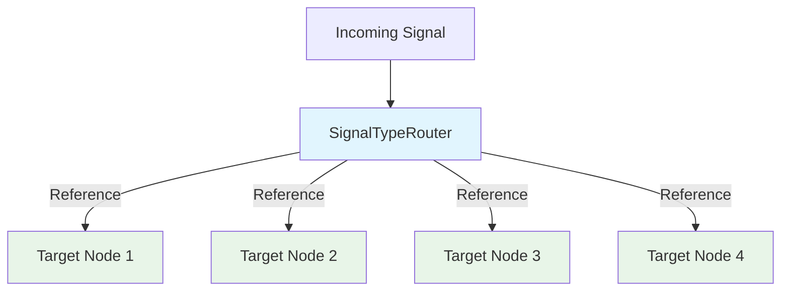
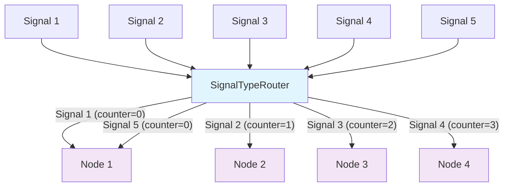
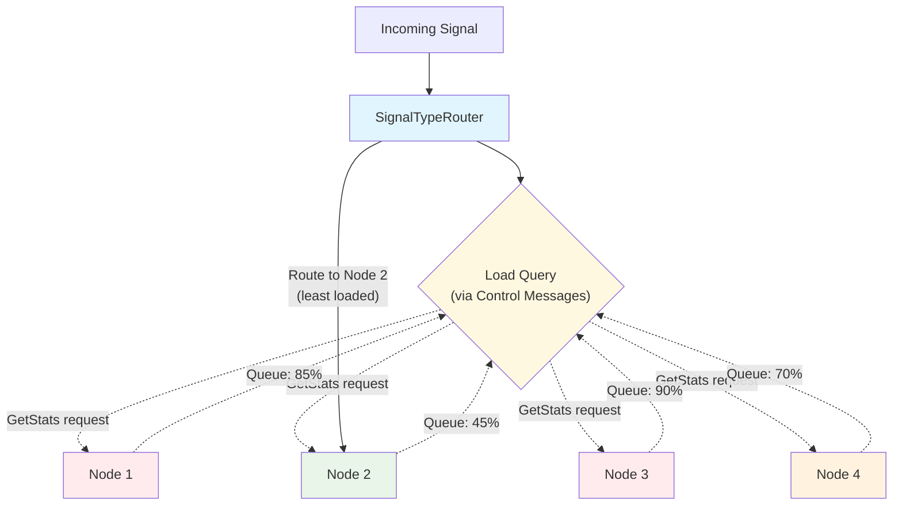

## SignalTypeRouter Documentation

### Overview

The `SignalTypeRouter` is a critical component in the OTAP dataflow engine, designed to manage and route OpenTelemetry signals such as traces, metrics, and logs. It efficiently analyzes the type of incoming data and directs it through the pipeline, adhering to specified dispatch strategies.

### Core Functionalities

- **Efficient Signal Detection**: Leverages `OTAPPData` type's efficient detection method to determine signal type without full deserialization.
- **Multi-Output Port Management**: Routes signals through different output ports based on the configuration.
- **Flexible Dispatch Strategies**: Supports multiple strategies, including Broadcast, Round-Robin, Random, and Least Loaded, allowing for powerful and flexible routing.

### Dispatch Strategies

1. **Broadcast**: Sends data to all target nodes, ensuring every node processes the same signal.
2. **Round-Robin**: Cycles through target nodes, sending each message to a different node to balance the load.
3. **Random**: Randomly selects a target node, introducing variability in message handling.
4. **Least Loaded**: Directs signals to the least busy node, optimizing resource usage.

### Explicit Configuration Requirements

The `SignalTypeRouter` follows an **explicit configuration** approach where all routing behavior must be completely specified. This ensures predictable pipeline behavior and prevents unexpected signal routing.

#### Complete Configuration Example

```yaml
type: otap
description: "Explicit signal routing pipeline with comprehensive configuration"
settings:
  default_control_channel_size: 100
  default_pdata_channel_size: 100
nodes:
  # OTLP Receiver - explicit configuration
  otlp_receiver:
    kind: receiver
    plugin_urn: "urn:otap:receiver:otlp"
    config:
      endpoint: "0.0.0.0:4317"
      protocols:
        grpc:
          enabled: true
        http:
          enabled: true

  # SignalTypeRouter - requires explicit port and destination specification
  signal_router:
    kind: processor
    plugin_urn: "urn:otap:processor:signal_type_router"
    description: "Routes signals based on type with explicit configuration"
    out_ports:
      traces_out:
        dispatch_strategy: round_robin
        destinations: [traces_processor_1, traces_processor_2]
      metrics_out:
        dispatch_strategy: least_loaded
        destinations: [metrics_aggregator_1, metrics_aggregator_2]
      logs_out:
        dispatch_strategy: random
        destinations: [logs_storage_1, logs_storage_2]
      profiles_out:
        # Broadcast is useful for profiles that need multiple analysis approaches
        dispatch_strategy: broadcast
        destinations: [profiles_analyzer, profiles_storage, profiles_export]
    config:
      drop_unknown_signals: false

  # All downstream processors must be explicitly configured
  traces_processor_1:
    kind: processor
    plugin_urn: "urn:otap:processor:batch"
    config:
      timeout: "1s"
      send_batch_size: 512

  traces_processor_2:
    kind: processor
    plugin_urn: "urn:otap:processor:resource"
    config:
      attributes:
        service.name: "distributed-tracing-service"
        deployment.environment: "production"

  metrics_aggregator_1:
    kind: processor
    plugin_urn: "urn:otap:processor:metrics_aggregator"
    config:
      aggregation_window: "30s"
      metrics_types: ["counter", "gauge"]

  metrics_aggregator_2:
    kind: processor
    plugin_urn: "urn:otap:processor:metrics_aggregator"
    config:
      aggregation_window: "60s"
      metrics_types: ["histogram", "summary"]

  # ... all other referenced nodes must be explicitly configured
```

#### Configuration Principles

1. **No Implicit Behavior**: Every routing decision must be explicitly specified
2. **Complete Node Definitions**: All referenced destination nodes must be fully configured
3. **Port-Specific Routing**: Each signal type requires its own output port configuration
4. **Strategy Specification**: Dispatch strategies must be explicitly chosen for each port
5. **Validation**: Configuration is validated to ensure all references are resolvable

**Note on Broadcast Strategy**: The broadcast strategy sends each signal to ALL destinations in the port. In the example above, events are broadcasted to multiple monitoring systems (alerting, audit logging, and metrics collection) because events often need to trigger multiple different actions simultaneously. This is different from load balancing strategies like round-robin or least-loaded, which send each signal to only one destination.

### Flowcharts in Mermaid

#### Broadcast Strategy

In broadcast dispatch, the signal reference is passed to all target nodes. The `SignalTypeRouter` doesn't clone or deserialize the data - it simply routes the same signal reference to multiple destinations efficiently.



**Key Features:**
- Zero-copy routing - no signal duplication or cloning
- Efficient signal type detection without deserialization
- All nodes receive the same signal reference simultaneously

**Use cases:**
- Sending traces to both a storage system and a real-time analytics engine
- Routing logs to multiple processing pipelines
- Forwarding metrics to different monitoring dashboards

#### Round-Robin Strategy

In round-robin dispatch, the SignalTypeRouter maintains an internal counter and cycles through target nodes sequentially. Each incoming signal is sent to the next node in the rotation.



**Example sequence:**
- Signal 1 → Node 1 (counter: 0)
- Signal 2 → Node 2 (counter: 1) 
- Signal 3 → Node 3 (counter: 2)
- Signal 4 → Node 4 (counter: 3)
- Signal 5 → Node 1 (counter: 0, wraps around)
- Signal 6 → Node 2 (counter: 1)
- And so on...

#### Random Strategy

In random dispatch, each incoming signal is routed to a randomly selected target node. This provides load distribution with unpredictable patterns, useful when order doesn't matter.

```mermaid
flowchart TD
    A1[Signal 1] --> R[SignalTypeRouter]
    A2[Signal 2] --> R
    A3[Signal 3] --> R
    A4[Signal 4] --> R
    
    R -->|"Random: Node 3"| N3[Target Node 3]
    R -->|"Random: Node 1"| N1[Target Node 1]
    R -->|"Random: Node 3"| N3
    R -->|"Random: Node 2"| N2[Target Node 2]
    
    style R fill:#e1f5fe
    style N1 fill:#fff3e0
    style N2 fill:#fff3e0
    style N3 fill:#fff3e0
    style N4[Target Node 4] fill:#fff3e0
```

**Key Features:**
- Unpredictable distribution pattern
- No state maintenance required
- Good for scenarios where processing order is irrelevant

#### Least Loaded Strategy

In least loaded dispatch, the router would route signals to the node with the lowest processing burden. This strategy requires implementing load monitoring capabilities.



**Implementation Requirements:**

This strategy would need additional infrastructure:

1. **Load Metrics Collection**: Each node would need to track and report metrics such as:
   - Channel queue depth (current messages / capacity)
   - Processing rate (messages/second)
   - CPU utilization
   - Memory usage

2. **Control Message Extensions**: Add new control message types:
   ```rust
   pub enum ControlMsg {
       // ... existing variants ...
       
       /// Request for node statistics
       GetStats,
       
       /// Response with node load information
       StatsResponse {
           queue_depth_percent: f32,
           processing_rate: f32,
           timestamp: std::time::Instant,
       },
   }
   ```

3. **Load Query Mechanism**: The SignalTypeRouter would:
   - Periodically query downstream nodes for their current load
   - Cache load information with timestamps
   - Route based on most recent load data
   - Fall back to round-robin if load data is stale

**Key Features:**
- **Dynamic load balancing** based on real-time queue depth
- **Prevents bottlenecks** by avoiding overloaded nodes  
- **Channel-based monitoring** using existing MPSC queue capacity
- **Requires additional complexity** for load tracking and querying

**Note**: This strategy is **not currently implemented** in the codebase. The infrastructure for load monitoring and control message extensions would need to be developed.

### Configuration Handling Implementation

The `SignalTypeRouter` leverages the existing configuration infrastructure built around the `NodeUserConfig` struct, which already exists in the codebase at `crates/config/src/node.rs`.

#### Core Configuration Structures

The configuration system uses several key structures:

```rust
#[derive(Debug, Clone, Serialize, Deserialize, JsonSchema)]
pub struct NodeUserConfig {
    /// The kind of this node (Receiver, Processor, Exporter, etc.)
    pub kind: NodeKind,
    /// The URN identifying the plugin implementation
    pub plugin_urn: Urn,
    /// Optional description
    pub description: Option<Description>,
    /// Output ports with dispatch strategies and destinations
    pub out_ports: HashMap<PortName, HyperEdgeConfig>,
    /// Node-specific configuration as JSON Value
    pub config: Value,
}

#[derive(Debug, Clone, Serialize, Deserialize, JsonSchema)]
pub struct HyperEdgeConfig {
    /// List of downstream node IDs this port connects to
    pub destinations: HashSet<NodeId>,
    /// Dispatch strategy for routing messages
    pub dispatch_strategy: DispatchStrategy,
}

#[derive(Debug, Clone, Serialize, Deserialize, JsonSchema)]
#[serde(rename_all = "snake_case")]
pub enum DispatchStrategy {
    /// Broadcast the data to all targeted nodes
    Broadcast,
    /// Round-robin dispatching to targets
    RoundRobin,
    /// Randomly select a target node
    Random,
    /// Dispatch to the least loaded target node
    LeastLoaded,
}
```

#### Configuration Flow

1. **YAML Loading**: Configuration files are loaded using `serde_yaml`
2. **Deserialization**: YAML is parsed into `NodeUserConfig` structs
3. **Plugin Resolution**: The `plugin_urn` field identifies the SignalTypeRouter implementation
4. **Initialization**: The router deserializes its specific settings from the generic `config` field
5. **Runtime Setup**: Output ports and dispatch strategies are configured based on `out_ports`

#### SignalTypeRouter-Specific Configuration

The router deserializes its specific settings from the `config` field:

```rust
#[derive(Debug, Deserialize)]
struct SignalRouterConfig {
    drop_unknown_signals: bool,
    // Additional router-specific settings can be added here
}

// During router initialization:
let signal_router_config: SignalRouterConfig = 
    serde_json::from_value(node_config.config)
    .map_err(|e| Error::ConfigurationError {
        message: format!("Failed to deserialize SignalTypeRouter config: {}", e)
    })?;
```

#### Error Handling

The configuration system includes comprehensive error handling for:

- **Invalid Configuration**: Validation errors during YAML/JSON configuration deserialization (not telemetry data)
- **Missing Destinations**: Ensuring all referenced nodes exist in the pipeline
- **Type Mismatches**: Preventing incompatible node connections
- **Plugin Resolution**: Handling missing or invalid plugin URNs

#### Configuration Validation

Before runtime, the configuration system validates:

1. **Node References**: All destination nodes in `out_ports` must exist
2. **URN Resolution**: Plugin URNs must map to available implementations
3. **JSON Schema**: Node-specific `config` can be validated against schemas
4. **Dispatch Strategy Compatibility**: Strategies must be supported by the target nodes

### Implementation Guide

1. **Integrate within OTAP Engine**: Place `SignalTypeRouter` within the engine, ensuring signal type identification and routing logic is in place using efficient methods from the `OTAPPData` type.
2. **Configure Nodes and Ports**: Define nodes in the pipeline configuration and specify dispatch strategies for each output port.
3. **Leverage Effect Handlers**: Use `EffectHandler` to manage message routing, coordinating with downstream processors or exporters.
4. **Handle Configuration**: Implement proper deserialization of the `config` field into router-specific settings.
5. **Validate Dependencies**: Ensure all destination nodes referenced in `out_ports` are properly defined and reachable.

### Conclusion

The `SignalTypeRouter` provides a robust foundation for constructing dynamic telemetry pipelines. By abstracting complex routing logic into flexible strategies, developers can build efficient and scalable signal processing systems. This document supports both experienced engineers and new Rust programmers by providing a comprehensive overview and practical insights into effectively using the `SignalTypeRouter`.
