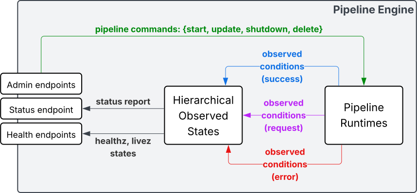
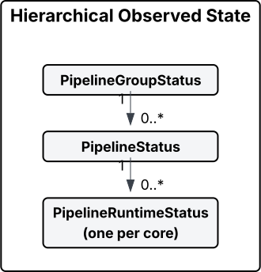
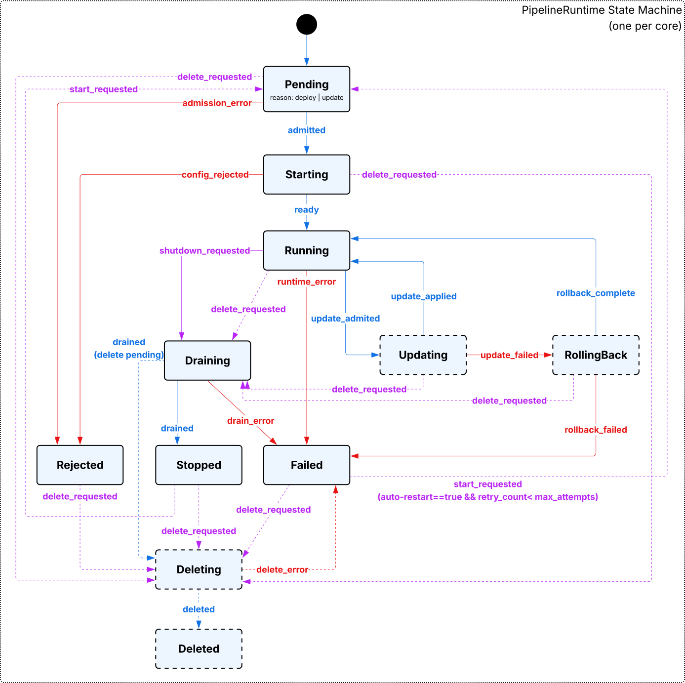
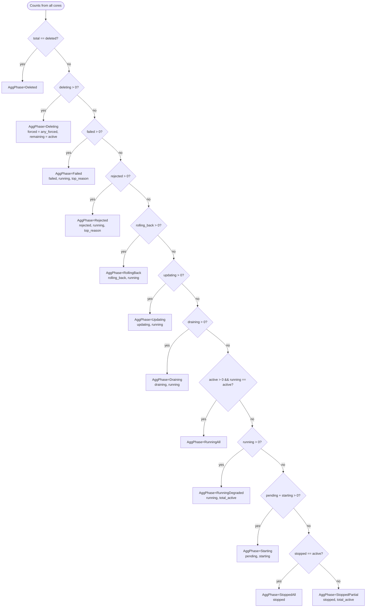

# Observed State

Status: **Work-In-Progress**

## System Overview

ToDo: add metrics, event exporters

## Hierarchical Observed State

## Pipeline Runtime State Machine

### Phases

- Pending: Exists but not admitted; awaiting a decision.
- Starting: Admitted; provisioning-initialization in progress.
- Running: Serving traffic normally.
- Updating: Applying a new spec-version under control.
- RollingBack: Reverting after update failure.
- Draining: Quiescing; no new work; finishing in-flight.
- Stopped: Cleanly stopped; can be restarted with re-admission.
- Rejected(AdmissionError|ConfigRejected): Input was invalid or disallowed; fix
  inputs.
- Failed(RuntimeError|DrainError|RollbackFailed|DeleteError): Unrecoverable
  runtime/teardown failure.
- Deleting(Graceful|Forced): Teardown in progress (forced may drop in-flight
  work).
- Deleted: All resources removed; terminal.

## Pipeline Aggregated Phase Decision Flow

## Liveness & Readiness Probes

First-class Kubernetes probes (/livez, /readyz).

We expose `/livez` and `/readyz` at the logical pipeline level.

### Per-core probe mapping (policy-driven)

- ProbePolicy:
  - live_if: phases considered alive (default: all except `Deleted`).
  - ready_if: phases considered ready (default: `Running` and optionally
    `Updating`).

### Aggregate probe policy (quorums)

- Quorum: All | AtLeast(n) | Percent(p) (of non-Deleted cores).
- AggregationPolicy:
  - core_probe: ProbePolicy
  - live_quorum (default AtLeast(1))
  - ready_quorum (default All; popular alternative: Percent(80))
