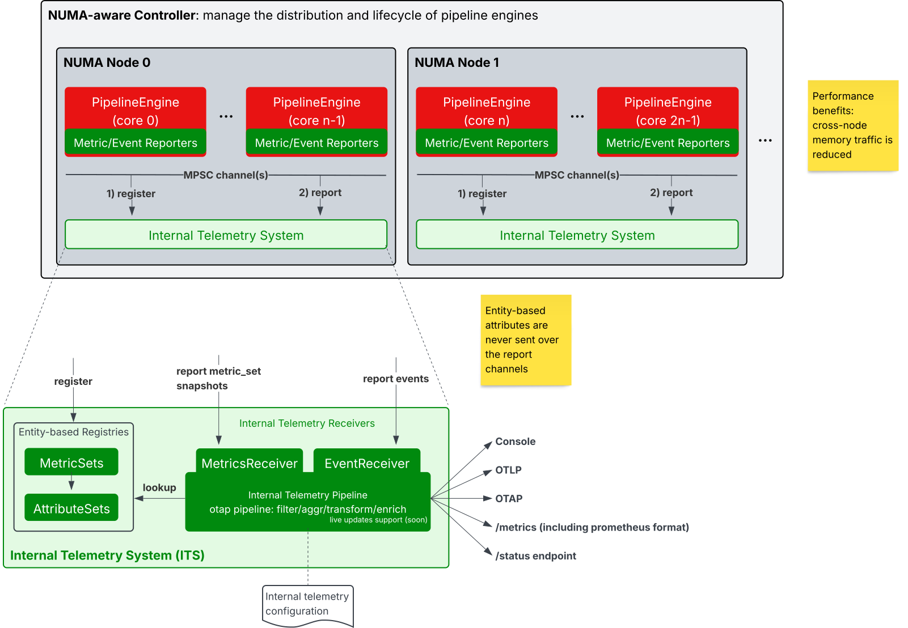

# Internal Telemetry System (schema-first, multivariate, NUMA-aware)

Status: draft under active development.

A low-overhead, NUMA-aware telemetry system that turns a declarative schema into
a type-safe Rust API for emitting richly structured, multivariate metrics. It is
designed for engines that run a thread-per-core and require predictable latency
while still exporting high-fidelity operational data.

## Core principles

1. **Schema-first**: You declare a metric schema (attributes + instrument kinds)
   and derive strongly typed metric sets. This eliminates stringly-typed
   lookups, guarantees field ordering, and lets downstream tooling reason about
   the data shape at compile time.
2. **Native multivariate metrics**: A metric set groups multiple instruments
   that share identical attribute tuples and timestamps. Collection exports
   sparse non-zero field/value pairs, avoiding per-field overhead and reducing
   wire size.
3. **Performance focus**: Counter increments are zero-cost in steady state (no
   atomics, no branching beyond range checks) by leveraging per-core ownership
   and cache alignment. The cold path (flush, aggregate, encode) is NUMA-aware
   and batch oriented, separating mutation from collection.
4. **Auto-describing**: From the same schema we generate OpenTelemetry semantic
   descriptors so the system can describe its own telemetry: instrument kinds,
   units, brief docs, and attribute keys. Exporters can attach this metadata
   once, enabling self-describing streams.

## Architectural highlights

- Per-core metric sets: each core mutates only its own instance => no cross-core
  contention.
- Reset-on-flush semantics: values accumulate for a cadence (e.g. 100 ms) then
  are atomically snapshotted and zeroed, yielding deltas by construction.
- Sparse enumeration: only non-zero fields are walked; zeroing touches only
  dirty counters.
- Descriptor & schema statics: each generated metric set exposes a
  `MetricsDescriptor` with an ordered slice of `MetricsField` (name, unit,
  instrument kind, brief). Similarly, a `AttributesDescriptor` provides
  attribute keys and their types.
- Registry & reflection: a global registry tracks live metric sets, enabling
  periodic flush loops without bespoke wiring.
- Transport decoupling (aka bottom half of the SDK): snapshot batches move over
  MPSC queues to aggregation / export workers.


## Metric Macros

The `#[metric_set]` macro generates a strongly typed metric set from a Rust
struct definition.

The `#[attribute_set]` macro generates a strongly typed attribute set from a
Rust struct definition.

See the [telemetry-macros crate](../telemetry-macros) for details.

## Logging Macros

There are internal macros defined in `otap_df_telemetry` with names
`otel_info!`, `otel_warn!`, `otel_error!`, and `otel_debug!`. These
macros all require a constant event-name string as the first argument;
the event name must follow
[OpenTelemetry Event naming conventions](../../docs/telemetry/events-guide.md#event-naming)
(lowercase, dot-separated, stable, low-cardinality). The `target`
(equivalent to OpenTelemetry `InstrumentationScope.name`) is
automatically set to the crate name by these macros. Otherwise, they
follow Tokio `tracing` syntax for key-value expressions.

For example:

```rust
use otap_df_telemetry::otel_info;

otel_info!(
    "syslog_cef_receiver.start",
    protocol = "TCP",
    listening_addr = tcp_config.listening_addr.to_string()
);
```

## Internal telemetry collection

The dataflow engine supports multiple ways to configure internal logs and
metrics. Log provider modes determine how logging is configured in different
parts of the code.

All modes configure the [Rust-standard `env_logger`
crate](https://docs.rs/env_logger/latest/env_logger/), making the
`RUST_LOG` environment variable available for controlling internal
logging.

There are four aspects that can be configured:

- `engine`: logging for pipeline threads that run dataflow processing
  (receivers, processors, exporters)
- `global`: fallback logging for code outside engine/admin contexts
  (e.g., libraries, startup code)
- `admin`: logging for administrative threads (metrics aggregation,
  observed state store, controller tasks)
- `internal`: logging for the engine observability pipeline itself;
  restricted to `console_direct` or `noop` to avoid feedback loops

These modes are configured through the `engine.telemetry.logs.providers`
field, with the following choices:

- `its`: send logs to the Internal Telemetry System for consumption by the
  internal telemetry receiver in `engine.observability.pipeline`.
- `console_async`: configure asynchronous console logging. In this
  mode log records are printed to the console by the
  observed-state-store thread, avoiding blocking the caller.
- `console_direct`: configure synchronous logging. This mode blocks
  the calling thread to print each log statement immediately.
- `noop`: disables logging.

Periodic internal metrics always flow through the engine observability
pipeline. When configuration omits that pipeline, the engine installs a
built-in pipeline that consumes metrics with a noop exporter. Global and engine
logs continue to use `console_async` by default; the built-in pipeline's console
route is used only when a log provider explicitly selects `its`. A custom
internal telemetry receiver can override the default registry drain and export
interval and apply metric views through its `metrics` block. Its `signals` field
defaults to `[logs, metrics]`; either signal can be omitted. When metric
emission is disabled, the receiver commits the ITS export accumulator without
OTLP conversion or downstream delivery, while leaving the admin metric view
intact.

ITS metric export and admin endpoint reads use independent registry views, so
an admin reset does not consume metrics waiting for pipeline export.
The bridge projects multivariate metric sets into standard univariate OTLP
metrics that normal OTLP or OTAP exporters can consume. This is a transitional
representation pending native multivariate metric-set support in OTAP.

Prometheus scraping is provided by the admin server at the fixed
`/api/v1/metrics` path. Receiver views do not apply to that endpoint.

For more on this design, see the [self-tracing architecture
document](../../docs/self_tracing_architecture.md). See a sample
configuration in
[configs/internal-telemetry.yaml](../../configs/internal-telemetry.yaml).

## Roadmap

- Generate OpenTelemetry Semantic Registry from the schema.
- Generate Telemetry client SDK from custom registry and Weaver.
- Structured events and spans.
- NUMA-aware aggregation.

The Internal Telemetry System (ITS) is moving in the direction
depicted below:



Our own OTAP Dataflow Engine will be configured to consume our internal
telemetry streams, and will be used to export to external backends such as
Prometheus, OTLP-compatible systems, or OTAP-compatible systems.

Note: The recent telemetry guidelines defined in `/docs/telemetry` are
still being implemented in this SDK. Expect changes and improvements
over time.
