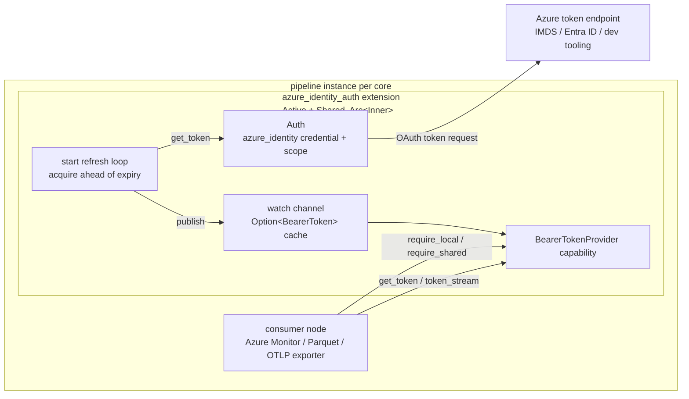

# Azure Identity Auth Extension

<!-- markdownlint-disable MD013 -->

**Status:** Draft

**Extension URN:** `urn:microsoft:extension:azure_identity_auth`

**Capability exposed:** `BearerTokenProvider`

**Execution model:** Active + Shared

**Target crate:** `crates/contrib-extensions`

**Target module:** `crates/contrib-extensions/src/azure_identity_auth/`

This document describes the design of the **Azure Identity Auth extension**
(`azure_identity_auth`) for the OTAP dataflow engine. The extension acquires and
refreshes Azure access tokens via the `azure_identity` SDK and exposes them to
data-path nodes through a `BearerTokenProvider` capability.

It builds on the extension system foundations:

- [Extension System Proposal](extension-requirements.md) - the *what* and *why*
  of the capability-based extension system.
- [Extension System Architecture](extension-system-architecture.md) - the
  Phase 1 *how* (capability proc macro, registry, Active/Passive lifecycle,
  local/shared execution models).
- [Design Principles and Constraints](design-principles.md) - thread-per-core
  execution, minimal synchronization, security/privacy first.

## Problem

Several nodes need to authenticate to Azure services using OAuth bearer tokens.
Today each owns its own authentication: the Azure Monitor exporter constructs an
Azure credential, acquires a token, and refreshes it inline, and the Parquet
exporter independently builds an `Arc<dyn TokenCredential>` (via
`cloud_auth::azure::from_auth_method`) and wraps it in an `object_store`
`CredentialProvider` (`AzureTokenCredentialProvider`) for blob-storage writes.
This couples authentication to each node and has several drawbacks:

- **Duplication.** Every Azure-authenticating node must re-implement credential
  construction, token caching, refresh scheduling, and failure handling.
- **No sharing.** Two exporters in the same pipeline instance that target the
  same Azure resource each maintain independent token caches and refresh loops,
  doubling calls to the Azure Instance Metadata Service (IMDS) / token endpoint.
- **Lifecycle mismatch.** Token refresh is a background concern that does not
  belong on the data path; mixing it into an exporter's hot loop complicates
  both.

The extension system lets us factor authentication out into a **shared,
cross-cutting capability** that any node can bind to, while keeping the data
path free of authentication plumbing.

## Goals

- Provide a reusable `BearerTokenProvider` capability backed by Azure identity
  flows (Managed Identity, developer tooling, and Workload Identity Federation).
- Serve every Azure-authenticating node from one capability: the Azure Monitor
  exporter, the Parquet exporter's `object_store` blob-storage writes (bridged
  through `object_store`'s `CredentialProvider`), and the OTLP exporters
  (`Authorization: Bearer` header injection). See
  [Consumer Integration](#consumer-integration).
- Keep the capability **provider- and execution-model agnostic**: the same trait
  must serve active and passive providers across both the shared and local
  execution models, from both the provider's and the consumer's side.
  `token_stream()` returns a per-consumer `Stream` subscription, so an active
  provider can back it with a `watch` channel while a passive provider backs it
  with an on-demand `unfold` - consumers depend only on the `Stream`, not on how
  it is produced.
- Refresh tokens **in the background**, ahead of expiry, so consumers read a
  fresh token from cache on the hot path with no per-call credential round-trip.
- Coalesce concurrent token acquisitions within a pipeline instance so a cache
  miss does not stampede the token endpoint.
- Share a single token cache and refresh loop across all consumers bound to one
  extension instance (per core at pipeline scope; see
  [Performance Considerations](#performance-considerations)).
- Preserve the engine's performance model: no locks on the data-path hot path,
  no blocking I/O on the per-core async runtime.
- Emit telemetry (success/failure counts, publish count, acquisition latency)
  for operability.

## Non-Goals

- A general-purpose capability framework. `BearerTokenProvider` is a single,
  purpose-built capability trait (defined via the engine's `#[capability]`
  proc macro, see
  [Extension System Architecture](extension-system-architecture.md)) introduced
  alongside this extension; this design adds no capability machinery beyond it.
- General-purpose OAuth/OIDC support. This extension is Azure-specific.
- Per-request, per-tenant token selection. One extension instance serves one
  configured identity + scope.
- User-tunable refresh cadence. Refresh timing is governed by token lifetime
  and fixed constants (see [Refresh Loop](#refresh-loop)).

## Core Decisions

| Decision | Choice |
| --- | --- |
| Component shape | Standalone extension in a new `otap-df-contrib-extensions` crate; the Azure SDK dependency is isolated behind a feature flag. |
| Capability surface | `BearerTokenProvider`: `get_token()` (cached fast path / single coalesced slow path) + `token_stream()` (refresh subscription). A single purpose-built capability trait, not a general framework. |
| Execution model | `Active + Shared`. Shared serves both `require_shared()` and `require_local()` consumers; Active drives the background refresh loop. |
| Startup gating | Opt into the engine readiness probe; `signal_ready()` after the first token publish so the engine holds data-path node startup until a token exists (bounded by the probe timeout). |
| Sharing model | All state behind `Arc<Inner>`; every clone (consumers + background task) observes one token cache. At pipeline scope this is per pipeline instance (per core). |
| Token cache | `tokio::sync::watch<Option<BearerToken>>` - lock-free fast-path read + pub/sub for `token_stream()`. |
| Slow-path coalescing | An async `fetch_lock` with double-checked caching so concurrent cache-miss callers share one in-flight credential call. |
| Auth methods (v1) | `managed_identity` (system- or user-assigned), `development` (local dev tooling), and `workload_identity` (federated ServiceAccount token). |
| Refresh tuning | Fixed constants (skew before expiry, retry delay, min cadence); not user-configurable. |
| Expiry handling | Absolute UNIX expiry converted once to a monotonic `Instant`, immune to wall-clock jumps thereafter. |
| Registration | `#[distributed_slice(OTAP_EXTENSION_FACTORIES)]` link-time discovery, same mechanism as nodes. |
| Telemetry | `MetricSet`-backed counters + latency histogram, flushed via `ExtensionControlMsg::CollectTelemetry`. |

## Capability: `BearerTokenProvider`

The extension implements the `BearerTokenProvider` capability - a small engine
trait introduced alongside this work. The trait (generated via the
`#[capability]` proc macro into `local::` and `shared::` variants) exposes two
methods:

```rust
/// A per-consumer subscription to token refreshes. Boxed to hide the concrete
/// stream type so providers can back it differently (e.g. a `watch` channel or
/// an `unfold`) without changing the signature.
pub type TokenStream =
    Pin<Box<dyn Stream<Item = Result<BearerToken, CapabilityError>> + 'static>>;

#[async_trait]
pub trait BearerTokenProvider {
    /// Return the current valid token. Fast path reads the cache; slow path
    /// performs a single credential call on a cache miss.
    async fn get_token(&self) -> Result<BearerToken, CapabilityError>;

    /// Subscribe to the stream of token refreshes. Yields each newly
    /// published token for the lifetime of the extension.
    fn token_stream(&self) -> TokenStream;
}
```

`BearerToken` is a hand-written shared data type carrying the secret token
string and an optional `expires_on: Instant`. Errors are surfaced as
`CapabilityError`, which carries the `(extension, capability)` identity plus the
underlying source error.

The `TokenStream` alias omits a `Send` bound: the subscription is always
consumed on the core that created it (thread-per-core), so it need not be `Send`.
The `#[capability]` macro emits the signature into both the `local` (`?Send`)
and `shared` (`Send`) variants; dropping the bound is what lets a passive
provider back it with a `!Send` `unfold`. This extension backs it with a `watch`
channel.

### Execution model: Active + Shared

The extension is registered as **Active + Shared**:

- **Shared** (`Send + Clone`) - the extension can serve both `require_shared()`
  and `require_local()` consumers. Most consumers (including the Azure Monitor
  exporter, which runs as a `local` node) are served via the
  `wrap_shared_as_local` fallback generated by the `#[capability]` macro. All
  clones share the same `Arc<Inner>`, so every consumer and the background task
  observe the same token state.
- **Active** - the extension drives its own event loop via
  `SharedExtension::start()`, which runs the background refresh task, receives a
  control channel, and participates in startup/shutdown orchestration. It opts
  into the readiness probe and signals ready after the first token publish (see
  [Lifecycle](#lifecycle)).

## Architecture



### Token flow

1. **Construction.** At factory time, `create()` deserializes and validates the
   config, builds an `Auth` (wrapping an `Arc<dyn TokenCredential>` + scope),
   registers the metric set, and constructs the extension with an empty `watch`
   channel (`Option<BearerToken> = None`).
2. **Background refresh.** When the engine spawns the extension, `start()` runs a
   loop that acquires a token, publishes it onto the `watch` channel, and
   schedules the next refresh ahead of expiry. After the first successful publish
   it calls `signal_ready()`, releasing the engine's readiness gate so the data
   path can start with a warm cache.
3. **Fast-path read.** `get_token()` first checks the `watch` cache. If the
   cached token is outside the refresh-skew window, it is returned immediately -
   no credential call, no lock.
4. **Slow-path read.** On a cache miss (e.g. before the first refresh
   completes, or after a failed refresh), `get_token()` performs a single
   credential call under a `fetch_lock` mutex with double-checked caching so
   concurrent callers coalesce onto one in-flight request.
5. **Stream.** `token_stream()` subscribes to the `watch` channel and yields each
   subsequent published token. The initial `None` is filtered out.

### Internal state

```rust
#[derive(Clone)]
pub struct AzureIdentityAuthExtension {
    inner: Arc<Inner>,
}

struct Inner {
    auth: Auth,                                       // credential + scope
    tx: watch::Sender<Option<BearerToken>>,           // token cache + pub/sub
    cap_err: CapabilityErrorSource<BearerTokenProvider>,
    fetch_lock: tokio::sync::Mutex<()>,               // coalesce slow-path fetches
    metrics: std::sync::Mutex<AzureIdentityAuthMetricsTracker>,
}
```

All mutable state lives behind `Arc<Inner>` so the engine can clone the
extension freely. The `fetch_lock` is an async `Mutex` (held across an
`.await`); the metrics `Mutex` is a `std` `Mutex` whose critical sections are
short and never held across an `.await`.

## Configuration

The extension is declared in the pipeline's `extensions:` section and bound to a
node via the node's `capabilities:` map.

```yaml
groups:
  default:
    pipelines:
      main:
        extensions:
          azure_identity:
            type: "urn:microsoft:extension:azure_identity_auth"
            config:
              method: managed_identity            # or "development"
              client_id: "<optional UA-MSI client id>"
              scope: "https://monitor.azure.com/.default"

        nodes:
          azure-monitor-exporter:
            type: "urn:microsoft:exporter:azure_monitor"
            capabilities:
              bearer_token_provider: azure_identity
            config:
              api:
                dcr_endpoint: "https://my-workspace.eastus-1.ingest.monitor.azure.com"
                # ...
```

### Config schema

| Field | Type | Default | Notes |
| --- | --- | --- | --- |
| `method` | enum | `managed_identity` | Authentication flow. Aliases: `msi`, `managed_identity`; `dev`, `developer`, `cli`; `wif`, `workload_identity`. |
| `client_id` | `string?` | *none* (system-assigned) | Entra client ID. For `managed_identity`: user-assigned MSI (omit for system-assigned). For `workload_identity`: application client ID; falls back to `AZURE_CLIENT_ID`. |
| `tenant_id` | `string?` | *none* | Entra tenant ID. Only for `workload_identity`; falls back to `AZURE_TENANT_ID`. |
| `token_file_path` | `string?` (path) | *none* | Path to the projected federated token file. Only for `workload_identity`; falls back to `AZURE_FEDERATED_TOKEN_FILE`. |
| `scope` | `string` | `https://monitor.azure.com/.default` | OAuth scope to request tokens for. Must be non-empty. |

The config struct uses `#[serde(deny_unknown_fields)]` and is validated by the
factory's `validate_config` hook before the pipeline starts. Validation rejects
an empty/whitespace `scope`.

### Auth methods

| Method | Credential | Notes |
| --- | --- | --- |
| `managed_identity` | `ManagedIdentityCredential` | System-assigned by default; supply `client_id` for user-assigned MSI. |
| `development` | `DeveloperToolsCredential` | Uses local developer tooling (Azure CLI / `azd`). For local dev only. |
| `workload_identity` | `WorkloadIdentityCredential` | Exchanges a projected federated ServiceAccount token for an Entra ID access token. For Kubernetes workloads without a managed identity (self-hosted / non-AKS). Reads `client_id` / `tenant_id` / `token_file_path`, each falling back to the `AZURE_*` env vars injected by the Azure Workload Identity webhook. |

## Refresh Loop

`start()` runs a `select!` loop with two arms:

1. **Control channel** (`ctrl.recv()`):
   - `Shutdown` - log and break, terminating the extension cleanly.
   - `Config` - currently a no-op; refresh cadence is governed by token
     lifetime.
   - `CollectTelemetry` - best-effort flush of the metric set to the reporter.
2. **Refresh timer** (`sleep_until(next_refresh)`):
   - On success: publish the token with `send_replace` (which updates the cache
     regardless of receiver count, unlike `send`, which drops the value when
     there are no subscribers), then compute `next_refresh` from the token's
     `expires_on` minus the skew buffer (clamped to a minimum cadence).
   - On failure: log the error and reschedule after the fixed retry delay; keep
     retrying for the lifetime of the extension.

Tuning constants:

| Constant | Value | Purpose |
| --- | --- | --- |
| `TOKEN_EXPIRY_BUFFER_SECS` | 299 (~5m) | Refresh this many seconds before `expires_on`. |
| `MIN_TOKEN_REFRESH_INTERVAL_SECS` | 10 | Floor between successful refreshes; avoids busy-looping on near-expired tokens. |
| `TOKEN_REFRESH_RETRY_SECS` | 10 | Reschedule delay after a failed acquisition. |

### Expiry handling

The Azure SDK returns expiry as an absolute UNIX timestamp. The extension
converts this to a monotonic `Instant` anchored at "now"
(`Instant::now() + (absolute_expiry - now_unix())`, saturating at zero). After
this single conversion the schedule is immune to wall-clock jumps. Non-expiring
tokens push the next refresh far into the future; the loop is still woken by
control messages.

## Consumer Integration

A consumer binds the capability in its `capabilities:` map and resolves it once
at factory time (`require_local()` / `require_shared()`). Because identity and
scope are fixed per extension instance, each consumer binds the instance
configured for the scope it needs - e.g. `https://monitor.azure.com/.default`
for Azure Monitor, `https://storage.azure.com/.default` for blob storage (see
[Multi-resource tokens](#open-questions)). This keeps each consumer's data path
free of credential logic and lets nodes sharing one scope share a single token
source.

### Azure Monitor exporter

The Azure Monitor exporter is refactored to **consume** the capability rather
than own authentication:

- Its `auth.rs`, `AuthConfig`, auth-specific error variants, and auth metrics
  are removed.
- At factory time it resolves the capability:
  `capabilities.require_local::<BearerTokenProvider>()`.
- Cold start needs no exporter-side wait: the readiness probe (see
  [Lifecycle](#lifecycle)) ensures a token is published before the exporter is
  spawned. If a later refresh fails and the cached token expires, the exporter
  falls back to a **"no token, no pdata"** state: it stops accepting pdata
  (`inbox.recv_when(false)`), applying backpressure upstream via the bounded
  inbox channel until a fresh token arrives - the same pattern the current Azure
  Monitor exporter uses (pdata is paused, not dropped).

### Parquet exporter (object_store)

The Parquet exporter (`urn:otel:exporter:parquet`) writes to Azure Blob Storage
through the `object_store` crate, which expects an `object_store`
`CredentialProvider` rather than the engine's `BearerTokenProvider`. The bridge
is `AzureTokenCredentialProvider` (`crates/otap/src/object_store/azure.rs`): it
is re-sourced to hold the resolved `BearerTokenProvider` handle instead of
constructing its own credential, and implements `get_credential()` by calling
`get_token()` and mapping the result to `AzureCredential::BearerToken`. Token
caching and refresh move out of the exporter and into the extension; the
`cloud_auth::azure` credential-construction path is no longer needed on this
route.

- The exporter binds the storage-scoped extension instance
  (`scope: https://storage.azure.com/.default`).
- `object_store` calls `get_credential()` per request, so it reads the current
  cached token on each write; a missing/expired token surfaces as a write
  error and is retried per the exporter's existing object-store retry policy,
  rather than as inbox backpressure.

### OTLP exporters

The OTLP gRPC (`urn:otel:exporter:otlp_grpc`) and HTTP
(`urn:otel:exporter:otlp_http`) exporters today support only static request
headers (e.g. a fixed `Authorization` header) and perform no token refresh.
They will be updated to **optionally** consume `BearerTokenProvider`: when the
capability is bound, the exporter resolves it at factory time and injects a
fresh `Authorization: Bearer <token>` on outgoing requests, reading the current
token from cache via `get_token()`, so credentials refresh without a restart.
Their factories already receive a `capabilities` argument (currently unused), so
this is additive and does not change the default (no-auth) behavior.

## Telemetry

Metrics are recorded in both the background refresh loop and the slow-path
`get_token()` branch, and flushed via `ExtensionControlMsg::CollectTelemetry`.

| Metric (set: `extension.azure_identity_auth`) | Type        | Description                                              |
|-----------------------------------------------|-------------|----------------------------------------------------------|
| `auth_successes`                              | Counter     | Successful credential acquisitions.                      |
| `auth_failures`                               | Counter     | Failed credential acquisitions.                          |
| `auth_token_publish`                          | Counter     | Tokens published to consumers via the watch channel.     |
| `auth_success_latency`                        | Mmsc (ms)   | Latency of successful acquisitions (min/max/sum/count).  |

## Lifecycle

### Startup

1. The engine starts the extension before any consumer that binds it (extensions
   start first; see
   [Extension System Architecture](extension-system-architecture.md#key-design-decisions)).
   At factory time `create()` has already built `Auth`, registered the metric
   set, and constructed the extension with an empty token cache.
2. `SharedExtension::start()` runs the refresh loop. The first acquisition
   publishes a token onto the `watch` channel, then calls
   `EffectHandler::signal_ready()`.
3. The engine holds data-path node spawning on the extension's readiness probe
   (`wait_all_ready`) until that signal fires, bounded by the probe timeout
   (default 5s; override via `with_readiness_probe_timeout_override`). If the
   first token is not acquired in time, startup aborts with a readiness-timeout
   error rather than starting nodes without a token.
4. Data-path nodes then start. Each consumer resolves the capability once at
   construction (`require_local()` / `require_shared()`) and holds the typed
   handle for its lifetime - no capability resolution on the hot path. Because
   the readiness gate already ensured a token is published, the first
   `get_token()` hits the warm cache; the slow path remains only for later cache
   misses (e.g. a refresh failure mid-run; see
   [Consumer Integration](#consumer-integration)).

### Shutdown

1. The engine drains data-path nodes first. The exporter finishes in-flight
   work and drops its capability handle.
2. After all consumers drain, the engine sends `ExtensionControlMsg::Shutdown`
   on the control channel. The refresh loop logs and breaks, dropping the
   credential and the `watch` sender.

### Live reconfiguration

The extension is reconfigured over the extension system's own control channel
(`ExtensionControlMsg`), independent of pipeline-node reconfiguration
(`NodeControlMsg::Config`). In v1, `ExtensionControlMsg::Config` is a no-op:
refresh cadence is governed by token lifetime, and changing identity/scope is
treated as an extension restart rather than an in-place swap. Promoting
identity/scope to hot-swappable config is possible future work.

### Cargo features

```toml
[features]
contrib-extensions = ["azure-identity-auth-extension"]
azure-identity-auth-extension = ["dep:azure_core", "dep:azure_identity"]

[dependencies]
azure_core = { workspace = true, optional = true, features = ["reqwest"] }
azure_identity = { workspace = true, optional = true }
```

**Crypto provider prerequisite.** The Azure SDK's `reqwest`/`rustls` HTTP client
requires a process-wide `rustls` crypto provider. `Auth::new()` calls
`otap_df_otap::crypto::ensure_crypto_provider()` before constructing any
credential, and the deployed binary **must** enable exactly one `crypto-*`
feature (`crypto-ring`, `crypto-aws-lc`, `crypto-openssl`, or `crypto-symcrypt`);
otherwise all token requests panic at runtime with "No provider set". Tests
enable a `crypto-*` feature via `otap-df-otap`.

### Factory registration

The factory is registered into the OTAP extension factory slice via
`#[distributed_slice]`, the same link-time discovery mechanism used for nodes:

```rust
pub const AZURE_IDENTITY_AUTH_URN: &str = "urn:microsoft:extension:azure_identity_auth";

#[distributed_slice(OTAP_EXTENSION_FACTORIES)]
pub static AZURE_IDENTITY_AUTH_EXTENSION: ExtensionFactory = ExtensionFactory {
    name: AZURE_IDENTITY_AUTH_URN,
    description: "Active+Shared extension exposing BearerTokenProvider via azure_identity",
    documentation_url: "",
    capabilities: Some(extension_capabilities!(
        shared: AzureIdentityAuthExtension => [BearerTokenProvider]
    )),
    create,
    validate_config: validate_typed_config::<Config>,
};
```

The URN follows the [URN format](urns.md): `urn:microsoft:extension:azure_identity_auth`
(`microsoft` namespace, `extension` kind). The main binary links the crate with
a side-effect import (`use otap_df_contrib_extensions as _;`) so the
registration takes effect.

## Security Considerations

- **Secret handling.** Token secrets are held only in memory, in the `watch`
  cache behind `Arc<Inner>`. They are never logged; log/telemetry sites emit
  credential *type*, scope, and refresh timing only.
- **Least privilege.** The configured `scope` and identity determine the access
  granted; the extension requests exactly the configured scope.
- **No credentials in config for MSI.** Managed Identity requires no secrets in
  the pipeline config - only an optional `client_id` for user-assigned
  identities. Developer-tools mode relies on the operator's local Azure CLI
  session and is intended for local development only.
- **Endpoint protection.** Slow-path fetch coalescing (the `fetch_lock`)
  prevents request stampedes against IMDS / the token endpoint on cache misses.

## Performance Considerations

- **No hot-path credential calls.** Steady-state `get_token()` is a lock-free
  read of the `watch` cache; credential round-trips happen only on the
  background loop or on a cold cache miss.
- **No data-path locks.** Shared state is `Arc`-wrapped; the only locks are the
  async `fetch_lock` (slow path only) and the short metrics `Mutex` (never held
  across `.await`).
- **Per-core instantiation.** At pipeline scope the extension is instantiated
  per pipeline instance (per core), consistent with the Phase 1 sharing-boundary
  rule. The cache, refresh loop, and token acquisitions **replicate per core**,
  not per consumer: on an N-core deployment a single-exporter pipeline still
  yields N caches, N refresh loops, and N independent token fetches. The
  `shared` model only collapses duplication *within* a core (multiple consumers
  on the same core share one `Arc<Inner>`); it does not share across cores.
  Consequently, **slow-path coalescing (`fetch_lock`) bounds the startup
  thundering herd to N concurrent acquisitions (one per core), but does not
  eliminate it** - the per-core loops are uncoordinated. A future move to a
  broader scope (group/engine) would let a single instance be shared across
  cores without code changes (see
  [Extension Scopes](extension-requirements.md#extension-scopes)).
- **Runtime discipline.** The refresh loop runs on the per-core async runtime;
  all I/O is async (`reqwest` via the Azure SDK), so it never blocks other
  futures on the core.

## Validation Expectations

Validation focuses on user-facing scenarios.

First useful end-to-end scenario (local development):

- A pipeline declares the extension with `method: development` and binds it to
  the Azure Monitor exporter via `capabilities: { bearer_token_provider: ... }`.
- Verify the exporter only begins exporting once the extension publishes a
  token, and that `auth_successes` / `auth_token_publish` increment.

Additional scenario coverage:

- **Config validation.** An empty/whitespace `scope` is rejected at config time;
  `method` aliases (`msi`, `cli`, ...) deserialize to the correct variant;
  unknown fields are rejected (`deny_unknown_fields`).
- **Managed identity.** System-assigned (no `client_id`) and user-assigned
  (with `client_id`) both construct the correct credential and report the
  matching `credential_type`.
- **Workload identity.** A `workload_identity` config (explicit
  `tenant_id` / `token_file_path` or the `AZURE_*` env-var fallbacks)
  constructs `WorkloadIdentityCredential` and reports the matching
  `credential_type`.
- **Refresh ahead of expiry.** With a short-lived token, the background loop
  refreshes before expiry and the fast path keeps hitting the cache (no
  per-call credential round-trip in steady state).
- **Slow-path coalescing.** Concurrent `get_token()` calls on a cold cache
  result in a single credential call (one `auth_successes` increment), not a
  stampede.
- **Refresh failure / retry.** A failing credential increments `auth_failures`,
  the loop reschedules after the retry delay, and a subsequent success recovers
  without restarting the extension.
- **Shutdown ordering.** The exporter drains before the extension receives
  `Shutdown`; no token is requested after shutdown begins.

## Open Questions

1. **Identity/scope hot-swap.** v1 treats an identity or scope change as an
   extension restart. Should `ExtensionControlMsg::Config` instead support
   swapping the credential in place (rebuilding `Auth` and forcing a refresh)
   without dropping the published token? The tradeoff is added complexity in the
   refresh loop versus a brief miss window on restart.
2. **`AuthMethod` shape.** v1 uses a flat config struct with optional
   per-method fields (`client_id`, `tenant_id`, `token_file_path`). Now that
   `workload_identity` adds method-specific fields, should `AuthMethod` become
   an enum whose variants carry those fields, so required fields validate
   structurally? This refactor was explicitly deferred during
   [PR #3337](https://github.com/open-telemetry/otel-arrow/pull/3337).
3. **Multi-resource tokens.** A node targeting more than one Azure resource
   needs more than one scope. v1's answer is "declare one extension instance per
   scope and bind each"; is a single multi-scope instance worth the extra
   capability surface?

## Future Work

- **`AuthMethod` enum refactor.** Promote the flat config struct to an
  `AuthMethod` enum so required per-method fields validate structurally (see
  [Open Questions](#open-questions)).
- **Broader extension scope.** Hoist the extension to group/engine scope (Phase
  2) for genuine cross-core token-cache sharing, so a single token cache and
  refresh loop serve every core (see
  [Extension Scopes](extension-requirements.md#extension-scopes)).

## References

- [Extension System Proposal](extension-requirements.md)
- [Extension System Architecture](extension-system-architecture.md)
- [Design Principles and Constraints](design-principles.md)
- [Architecture](architecture.md)
- [URN Format](urns.md)
- [PR #3337 - Workload Identity Federation for Azure Monitor exporter (merged)](https://github.com/open-telemetry/otel-arrow/pull/3337)
