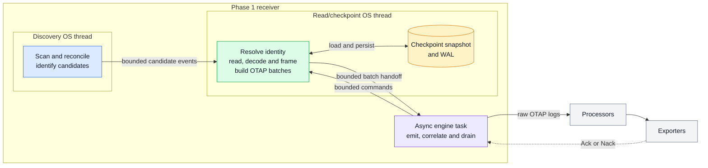
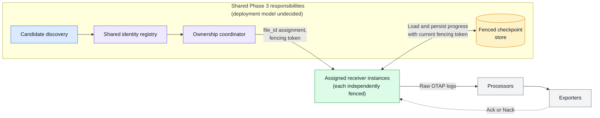

<!-- markdownlint-disable MD013 -->

# Filelog Receiver Architecture

Status: Proposed for community architecture review

Tracks [#2844](https://github.com/open-telemetry/otel-arrow/issues/2844).
Related work includes [#2321](https://github.com/open-telemetry/otel-arrow/issues/2321)
and the journald receiver
[#2858](https://github.com/open-telemetry/otel-arrow/issues/2858).

## Executive summary

This document proposes an OTAP-native receiver for continuously collecting logs
from local files. It discovers eligible files, assigns durable logical
identities, reads source bytes in bounded turns, decodes and frames records,
handles rotation and restart, emits raw OTAP logs, and advances source progress
only after downstream acknowledgement and checkpoint application, with
filesystem synchronization governed by the configured checkpoint policy.

Phase 1 establishes the single-instance correctness model. It uses one
discovery OS thread, one read/checkpoint OS thread, and one async engine task,
connected by bounded channels. It retains one receiver-wide in-flight batch
plus at most one bounded already-framed carry-over record. This makes progress
and retry behavior tractable, but intentionally couples all files to the same
aggregate downstream Ack latency, checkpoint transaction, failure policy, and
drain.

The receiver preserves ordering within each file and provides at-least-once
delivery after emission. Crash recovery of uncommitted records requires both a
valid durable checkpoint and the corresponding source bytes. The receiver is
not a durable telemetry spool. Ordinary move/create rotation is supported;
copytruncate remains best-effort because portable filesystem observation cannot
close its destructive copy-to-truncate gap.

Phase 2 may improve local throughput and discovery latency without changing
ownership. Phase 3 is a conceptual target that adds shared identity resolution,
assignment, fencing, and checkpoint persistence. Phase 3 is not implemented by
the Phase 1 local discovery boundary, namespace lock, or runtime leases.

The central responsibility boundary is:

- The receiver decides which source bytes constitute a record.
- Processors decide what the record means.
- Exporters decide how the record is represented and delivered.

## Documentation ownership

The design is split into four normative layers:

| Document | Normative ownership |
| --- | --- |
| `filelog-receiver.md` (this document) | Architecture, scope, guarantees, decisions, and tradeoffs |
| [Filelog Receiver Phase 1 Behavioral Specification](filelog-receiver-phase1-spec.md) | Exact Phase 1 runtime behavior and state transitions |
| [Filelog Receiver Phase 1 Conformance Specification](filelog-receiver-phase1-conformance.md) | Resource models, telemetry semantics, validation cases, and normative examples |
| [Filelog Receiver Checkpoint Format](filelog-checkpoint-format.md) | Exact durable byte format and replay representation |

The lower-level specifications refine the architecture and cannot contradict it.
A conflict is a design defect that must be surfaced and resolved deliberately;
it is not resolved by allowing one document to override another.

For example, this document owns the rule that source progress advances only
after a matching aggregate downstream Ack. The Phase 1 specification owns exact
correlation, retry, stale-completion, atomic-delta, and drain behavior. The
checkpoint-format specification owns the exact encoding and replay
representation of the resulting progress operation.

Requirements in this architecture use direct declarative language. The
checkpoint-format specification states its own normative-keyword convention.

## Goals and non-goals

### Goals

- Tail eligible local files while they continue to grow.
- Preserve deterministic per-file identity, framing, ordering, and Ack-gated
  source progress.
- Keep filesystem and checkpoint blocking work off the current-thread async
  runtime.
- Bound discovery, readers, descriptors, buffers, batches, channels, retries,
  maps, checkpoint artifacts, recovery allocations, and scheduling work.
- Recover after restart when durable state and the required source bytes
  survive.
- Handle ordinary move/create rotation and state weaker copytruncate behavior
  honestly.
- Emit raw OTAP logs with bounded provenance and observed time.
- Preserve a logical progress contract that Phase 3 can place behind shared
  identity, ownership, fencing, and checkpoint services.

### Non-goals

- Compatibility with the Go filelog receiver or Stanza operator chains.
- Embedded timestamp extraction, JSON parsing, severity mapping, trace
  correlation, enrichment, filtering, or routing.
- Destination-specific body conversion, field mapping, or delivery behavior.
- Durable telemetry spooling or recovery after required source bytes disappear.
- Guaranteed copytruncate capture or unconditional "never lose data" claims.
- Multi-instance or multi-process ownership, virtual partitions, distributed
  fencing, or lossless handoff in Phase 1.
- A claim that local ownership acquisition means source readiness.
- Permanent identity derived from path, native file ID, fingerprint, CPU,
  thread, NUMA node, or deployment generation.
- Universal latency, throughput, memory, or production-readiness claims.

### Separately scoped capabilities

These capabilities require separate proposals defining their own capture,
delivery, recovery, security, and operational guarantees:

| Capability | Separate contract required |
| --- | --- |
| Read once and delete | Completion proof, Ack of all records, durable tombstones, and delete retry |
| Compressed streams and archives | Decompression bounds, member identity, and restart rules |
| Network shares | Filesystem-specific identity, outage, advisory-lock, and cross-agent ownership behavior |
| Windows files denying shared read | A privileged capture mechanism such as a driver, journal, or snapshot |
| Importing unrelated checkpoints | Distribution-specific evidence and an explicit idempotent migration |
| Header-content skipping | Identity, initial-offset, framing, and restart semantics |
| Advanced I/O and parsing | Separate bounds and evidence for `io_uring`, `mmap`, eBPF, language parsers, or structured files |
| Product parity | Explicit processor and product scope rather than receiver architecture |

## Phase 1 guarantees and limitations

These contracts are intentionally near the beginning so review does not require
reading implementation detail first.

| Area | Phase 1 contract |
| --- | --- |
| Capture | Reads eligible complete records while their source bytes remain available; unread bytes destroyed by rotation or retention are unrecoverable |
| Delivery | Retains and retries one emitted receiver-wide batch until Ack or terminal policy |
| Progress | Applies progress only after matching aggregate Ack; releases after atomic WAL application and syncs the durable frontier according to policy |
| Crash recovery | Reconstructs uncommitted records only when valid checkpoint state and corresponding source bytes survive |
| Ordering | Preserves ordering within each file; defines no cross-file ordering |
| Rotation | Supports move/create; recognized replacement starts at zero; copytruncate remains best-effort |
| Delivery semantics | At least once after emission; retry or crash can produce duplicates |
| Durability | Does not spool emitted OTAP batches to disk |
| Resource behavior | Uses fixed workers, bounded state, bounded work turns, and backpressure |
| Failure isolation | Most source failures are per-file; batch, ownership, runtime-lease integrity, and checkpoint failures can stop the receiver |
| Ownership | Serializes one local checkpoint namespace and prevents duplicate in-process readers; provides no distributed fencing |
| Ack topology | Receives one engine-aggregated completion per batch attempt; required broadcast destinations use automatic Ack propagation and all-required-subscriber aggregation |
| Live rollout | Cannot claim ready-before-ownership or lossless handoff without an engine readiness and distributed ownership contract |
| Platforms | Phase 1 release qualification is Linux-first. Portable locator, path, rotation, and checkpoint semantics remain fixed for macOS and Windows, whose conformance and power-loss evidence are later portability gates |

Three different guarantees must not be conflated:

1. **Capture** covers bytes observed and framed while the source still retains
   them. It excludes bytes destroyed before observation, intentional
   `start_at: end` on first admission of an unrelated file,
   `ignore_older_than` deferral of an unrelated candidate,
   `identity.on_recovery_mismatch: skip_to_end`, and explicit truncate,
   `drop_and_continue`, or reset loss policies.
   Recognized move/create replacements do not use the `start_at: end`
   exclusion.
2. **Delivery** covers a live emitted batch retained until a matching downstream
   completion and terminal policy.
3. **Recovery** covers reconstruction after failure from durable progress and
   surviving source bytes. It is not a durable copy of the emitted batch.

An aggregate downstream Ack followed by a crash before progress becomes durable can cause
duplicate replay. It does not authorize skipping the data. If the source bytes
have disappeared, the receiver cannot reconstruct them even when its checkpoint
is intact.

## Decisions requested

Reviewers are asked to approve or challenge all of the following decisions and
accepted compromises:

| ID | Decision | Rationale or consequence |
| --- | --- | --- |
| D1 | Run one filelog receiver instance in Phase 1 | Engine-scoped assignment and fencing do not exist yet |
| D2 | Isolate local discovery behind a candidate-source abstraction without claiming it is the Phase 3 ownership protocol | Distributed ownership also needs revisions, fencing, reconciliation, and revoke completion |
| D3 | Exclude CPU count and deployment generation from identity and checkpoint keys | Deployment topology must not change source progress |
| D4 | Key durable progress by an opaque persisted `file_id` | Paths, fingerprints, and native locators are matching evidence rather than permanent identity |
| D5 | Allow an explicit checkpoint ID or derive one from the logical receiver key `(pipeline_group_id, pipeline_id, node_id)` | The derived value changes with those configured IDs; topology and runtime-instance values never affect source progress |
| D6 | Reconnect ordinary progress only through a validated exact runtime locator; use fingerprints only to validate that locator | Fingerprint equality across changed locators never transfers identity or progress |
| D7 | Advance source progress only after one matching aggregate downstream Ack for the batch attempt | The engine/topic runtime, not filelog, aggregates a nonempty required-subscriber membership; topology validation must reject a path that cannot provide all-required completion |
| D8 | Run blocking filesystem and checkpoint work on fixed dedicated threads | Blocking work must not stall the current-thread runtime or create an unbounded worker pool |
| D9 | Keep decoding and framing in the receiver; keep semantic interpretation in processors | Framing determines source progress; interpretation must remain reusable |
| D10 | Emit raw OTAP logs with bounded source provenance | The receiver does not embed destination or Stanza-style operator logic |
| D11 | Bound readers, descriptors, buffers, batches, channels, retries, maps, candidate populations, and scheduling turns | Overload and memory behavior must remain predictable |
| D12 | Support move/create rotation and describe copytruncate as best-effort | Portable observation cannot guarantee copytruncate capture |
| D13 | Retain one receiver-wide in-flight batch plus at most one bounded already-framed carry-over record | This preserves progress correctness without rereading a completed record from mutable source bytes |
| D14 | Use periodic reconciliation as the Phase 1 correctness mechanism | Native notifications may reduce latency later but cannot be the sole source of truth |
| D15 | Use a namespace lock plus process-local runtime leases for Phase 1 local ownership | These prevent overlapping local readers but provide no distributed fencing or readiness promise |
| D16 | Fail closed on corrupt durable state and persist fail-policy quarantine | Ambiguous recovery never silently inherits progress, and restart cannot bypass failure |
| D17 | At confirmed permanent rotation EOF, emit a nonempty pending frame with bounded terminal-unterminated evidence | This preserves terminal bytes without silently claiming normal newline or multiline completion; deterministic decode-fail and corrupt-state conditions can still quarantine |
| D18 | Require a nonempty, ready required-subscriber snapshot before a publication can Ack | Zero required membership is backpressure or explicit non-success, never vacuous Ack; this is an engine/topic release dependency |

## Responsibility boundaries

### Receiver, processor, and exporter

| Component | Owns |
| --- | --- |
| Receiver | Discovery, file identity, local ownership, source decoding, record framing, source provenance, `observed_time_unix_nano`, aggregate-completion correlation, and Ack-gated progress |
| Engine/topic runtime | Declaring Ack-required nodes, establishing downstream readiness, snapshotting nonempty required membership, propagating completion, and aggregating required fan-out subscribers into one Ack or Nack for each publication attempt |
| Processors | Timestamp extraction and parsing, structured parsing, severity, trace correlation, enrichment, filtering, and routing semantics |
| Exporters | Destination representation and delivery |

The receiver factory validates receiver configuration only. It does not inspect
or validate a timestamp processor, exporter, destination, or cross-pipeline
topic configuration. Engine topology validation owns that graph-level check and
must reject any filelog path that claims Ack-gated progress across required
broadcast destinations without automatic Ack propagation and
all-required-subscriber aggregation.

The intended multi-destination architecture is one receiver feeding processors
or routing and then multiple destinations. Deploying two filelog receivers over
the same local file merely to reach two destinations creates an ownership
conflict; it is not the fan-out design.

Multiline framing remains in the receiver because it determines which bytes
belong to a record and therefore which source offset an Ack may advance.
Timestamp parsing remains in a processor because it changes interpretation, not
record boundaries. A processor parse failure does not change receiver framing,
provenance, observed time, or source progress.

Processor and OPL capability assessment, including representative structured,
container, and multiline processing pipelines, belongs in a companion issue or
document. These receiver documents do not define processor functions,
application parsers, or processor implementation design.

### Logical component boundaries

Phase 1 co-locates several responsibilities but keeps their contracts distinct:

- Discovery reports candidates; it does not grant distributed ownership.
- Identity resolution creates or reconnects `file_id`.
- Local ownership prevents duplicate readers within the stated local scope.
- Reading, decoding, and framing produce records and source-progress deltas.
- Batch coordination owns the receiver-wide delivery frontier.
- Checkpoint persistence stores the acknowledged logical state.

These are architectural responsibilities, not requirements for separate Rust
types, tasks, threads, services, or extensions.

## Architecture

### Phase 1 architecture



The discovery thread performs bounded periodic reconciliation and stable
candidate evidence collection. The read/checkpoint thread owns identity
resolution, runtime leases, resident tail handles, decoding, framing, batch
construction, retained batch state, and checkpoint I/O. The async task owns
engine lifecycle, downstream emission, completion correlation, and drain.

The topology is fixed: one discovery thread and one read/checkpoint thread per
Phase 1 receiver, never one thread per file, directory, or mount. The factory
rejects a source pipeline with more than one core for this receiver. Downstream
topic fanout is the Phase 1 parallelism boundary.

Bounded channels separate the components. Slow downstream delivery eventually
stops source reads, leaving unread bytes in files rather than accumulating an
unbounded memory queue. Control has priority over worker handoff and a blocked
downstream send is interruptible by newly arriving lifecycle control.

### Conceptual Phase 3 architecture



The shared grouping identifies architectural responsibilities, not a required
process, service, thread, or extension boundary. Each receiver instance is
independently assigned and fenced.

Topics carry already-emitted OTAP data. They can parallelize processing and
export but do not resolve source identity, assign source ownership, or fence
checkpoint writes.

Phase 3 changes shared identity resolution, ownership assignment, and
checkpoint persistence. It preserves below-boundary reading, decoding, framing,
Ack/Nack, backpressure, retry, and lifecycle semantics. Every checkpoint
mutation must reject a stale fencing token atomically.

The diagram does not decide whether receivers access storage directly or
through a coordination service. It also does not define the identity-registry
consistency model, assignment protocol, assignment mapping, revoke
deadline, readiness protocol, or migration format. Those remain Phase 3 work.

Phase 1 state is useful migration input because progress is keyed by stable
`file_id` rather than CPU or generation. It is not already partitioned or
fenced. Phase 3 therefore requires an explicit, versioned migration that
preserves committed progress, prevents mixed ownership during cutover, and
either completes or rolls back before a new owner reads.

Checkpoint records remain keyed by stable `file_id`, independently of the
current owner. A future measured assignment proposal may use direct sticky file
assignment, rendezvous or consistent hashing, or fixed virtual partitions when
assignment scale justifies that additional indirection. None is required for
checkpoint continuity, and this design does not select among them.

## Core Phase 1 invariants

The behavioral specification owns exact procedures and transition ordering.
The architecture requires the following invariants across every conforming
implementation:

### Discovery, identity, and ownership

- Periodic bounded reconciliation is the correctness source; notifications may
  only reduce latency.
- Candidate evidence comes from an opened, validated regular-file handle.
- Durable progress is keyed by opaque `file_id`. Only a validated exact runtime
  locator can reconnect ordinary progress; fingerprint evidence only validates
  that locator and never transfers progress across locators.
- Incomplete discovery cannot prove absence, uniqueness, replacement, or
  eligibility for destructive cleanup.
- The checkpoint namespace lock and process-local locator leases prevent only
  the documented local overlaps. They are not distributed fencing or source
  readiness.

### Reading, framing, and output

- Files are read incrementally in bounded turns. Descriptor, candidate, reader,
  decoder, framer, batch, carry-over, retry, and checkpoint populations are
  bounded with checked arithmetic.
- Decoding precedes text framing. Every emitted record owns an exact contiguous
  source-byte range, and progress never lands inside an encoded source unit.
- The receiver owns newline and bounded multiline framing. Processors own
  timestamp, JSON, severity, enrichment, filtering, and routing semantics.
- Confirmed permanent rotation EOF may emit a nonempty pending frame only with
  bounded terminal-unterminated evidence. Ordinary live EOF does not establish
  this boundary. Decode-fail can still quarantine malformed input.
- OTAP output remains raw and destination-neutral. Public or experimental
  provenance keys have bounded, documented meanings.

### Delivery and progress

- At most one receiver-wide batch is in flight, plus one bounded already-framed
  carry-over record that is never reconstructed from mutable source bytes.
- Filelog receives one aggregate completion for each `(batch_id, attempt)` and
  never implements per-destination completion aggregation.
- A successful aggregate Ack requires a nonempty ready required-subscriber
  membership and all-required completion. This is an engine/topic dependency.
- Source progress changes only after the matching aggregate Ack or an explicit
  configured loss policy. One batch's file deltas are applied atomically.
- No lifecycle, epoch, identity, reset, quarantine, revocation, or finalization
  transition can overtake an unresolved delta for the affected file.
- The applied frontier, filesystem-synced durable frontier, and replay frontier
  are distinct. A crash may duplicate Acked data that was not yet durable; it
  never authorizes skipping unacknowledged bytes.

### Rotation, recovery, and operations

- Move/create keeps the old identity and replacement independent. A recognized
  replacement begins at offset zero. Copytruncate remains detect-and-report
  best effort because its destructive interval cannot be closed portably.
- Restart recovery requires valid checkpoint state and surviving source bytes.
  The checkpoint is not a durable telemetry spool.
- Corrupt, incompatible, or ambiguously associated checkpoint state fails
  closed according to the checkpoint-format contract.
- Any release capable of creating durable quarantine provides an exclusive,
  supported inspect/reset/remove mechanism. Operators do not edit checkpoint
  bytes manually.
- Phase 1 release qualification is Linux-first. Portable macOS and Windows
  identity and durable representations remain fixed, while enabling either
  platform requires separate conformance and durability evidence.

Exact behavior is defined by the
[Phase 1 behavioral specification](filelog-receiver-phase1-spec.md), with its
[conformance specification](filelog-receiver-phase1-conformance.md). Exact
durable representation is defined by the
[checkpoint-format specification](filelog-checkpoint-format.md).

## Representative Phase 1 configuration

This short example shows the architectural knobs. The complete proposed schema,
defaults, validation relationships, pattern limits, and working-set admission
rules belong to the
[Phase 1 configuration contract](filelog-receiver-phase1-spec.md#proposed-configuration-contract).
The proposed schema is not yet a compatibility promise.

```yaml
receivers:
  filelog:
    urn: "urn:otel:receiver:filelog"
    config:
      include: ["/var/log/app/*.log"]
      exclude: ["/var/log/app/debug-*.log"]
      start_at: end
      discovery:
        reconcile_interval: 5s
        reconcile_jitter_percent: 10
      reader:
        eof_reprobe_interval: 250ms
      encoding: utf-8
      on_decode_error: preserve_raw
      framing:
        max_line_bytes: 1MiB
        max_record_bytes: 1MiB
        max_log_size_behavior: split
        multiline:
          line_end_pattern: '^END request$'
      limits:
        max_open_files: 512
        max_read_bytes_per_turn: 128KiB
      batch:
        max_records: 1024
        max_bytes: 8MiB
      rotation:
        on_truncate: fail
      checkpoint:
        id: app-logs
      retry:
        max_attempts: 8
        initial_backoff: 100ms
        max_backoff: 5s
      on_nack: fail
```

The interval values above are reviewable initial defaults, not latency
guarantees. Full reconciliation and EOF tail reprobe are independently
validated and scheduled.

For a required broadcast path, the engine topology--not the receiver
block--must also provide semantics equivalent to:

```yaml
topics:
  filelog-output:
    ack_propagation:
      mode: auto
    broadcast_ack_mode: all
```

The actual topology schema is engine-owned. The requirement is one aggregate
completion whose Ack means a nonempty ready membership of required eligible
subscribers all Acked. The shown capabilities are release requirements, not a
claim that current topic defaults provide them.

Conventional Kubernetes container logs can be collected through symlinks:

```yaml
include: ["/var/log/containers/*.log"]
follow_symlinks: true
```

or directly from resolved pod files without changing the general link default:

```yaml
include: ["/var/log/pods/*/*/*.log"]
follow_symlinks: false
```

Resolved-target exclusions still apply in the symlink form, so an exclusion
matching the corresponding `/var/log/pods/...` target prevents admission.

## Normative architecture examples

These examples illustrate cross-cutting contracts. Exact source ranges, framing
state transitions, malformed-input cases, and fault cases are in the
[Phase 1 conformance specification](filelog-receiver-phase1-conformance.md#normative-examples).

### Multiline timestamp interpreted by a processor

```text
BEGIN request id=42
user=alice operation=payment
event_time=2026-08-21T10:15:02.331-07:00
result=failed
END request
```

An end pattern matching `^END request$` makes the five physical lines one OTAP
record. The receiver sets observed time and source provenance. A processor may
extract and interpret `event_time`; success or failure of that interpretation
does not alter receiver framing or source progress.

### Move/create rotation

`app.log` with locator A is renamed to `app.log.1`, and a new `app.log` with
locator B is created. A retains its identity and resident descriptor and is read
through EOF plus the rotation wait. B is discovered independently and receives
separate progress from offset zero, regardless of `start_at`. B never inherits
A's offset, and bytes written before B's first reconciliation remain eligible.

### Copytruncate observation gap

A rotation tool copies `app.log`, an application appends more bytes, and the
tool truncates the original before the receiver observes those appended bytes.
Those bytes may exist in neither surviving file. Checkpoint logic cannot recover
bytes that were never captured, and truncation followed by regrowth may not be
observable. The receiver therefore reports only detectable evidence and
recommends move/create rotation.

### Crash before Acked progress is filesystem-synced

The synced durable frontier is offset 100. The receiver emits and receives Ack
through offset 200, then appends and applies that progress without syncing it.
After a crash, recovery may stop at 100 if the later WAL suffix is absent or an
allowed torn tail, causing replay from 100, or may replay through 200 if the
complete valid transaction survived. It cannot recover progress beyond a
validated Ack-authorized transaction. Duplicate delivery is possible; skipping
unacknowledged source data is not.

## Delivery phases

| Phase | Deliverables | Principal limitation or gate |
| --- | --- | --- |
| Phase 1 | One receiver; bounded periodic discovery, reading, decoding, framing, and batching; durable identity and quarantine; one retained batch; Ack-gated progress; move/create rotation | Receiver-wide head-of-line coupling; no distributed fencing or lossless rollout readiness; checkpoint-format approval required |
| Phase 2 | Native discovery hints, bounded read-ahead or local shards, multiple in-flight batches, optional source metadata, measured background compaction | Ownership remains local and single-instance; new contiguous-commit and failure-isolation contracts required |
| Phase 3 | Shared identity resolution, measured file assignment, fenced checkpoint persistence, revoke/assign and readiness coordination, explicit Phase 1 state migration | Requires shared coordination and storage semantics not provided by Phase 1 |

Phase 1 satisfies the single-instance subset of #2844. It demonstrates
CPU-independent identity keys and restart continuity, but it does not satisfy
the epic's multi-instance assignment, live resize, fenced handoff, or source
readiness criteria.

Phase 2 optimizations cannot weaken periodic reconciliation, boundedness,
ordering, or Ack-gated progress. Multiple in-flight batches require explicit
contiguous commit, Nack-in-the-middle, read-ahead reconstruction, memory, drain,
and failure-domain rules before adoption.

Phase 3 preserves the source-side semantics approved here while replacing the
ownership boundary. Shared identity must precede file assignment because a
receiver cannot be assigned by an opaque `file_id` that only it can create.
The final scheme remains a future measured proposal.

Issue #2844 should separately evaluate topology-independent identity,
CPU-independent checkpoints, and fenced assignment without treating fixed
virtual partitions as mandatory. Direct sticky assignment, rendezvous or
consistent hashing, and virtual partitions remain alternatives. This Phase 1
proposal does not close the multi-instance epic or add its coordination
machinery.

## Alternatives considered

| Alternative | Why it is not selected for Phase 1 |
| --- | --- |
| Port the Go or Stanza receiver | It mixes semantic operators with source framing and progress |
| Use path as checkpoint identity | Rename and path reuse detach progress from the underlying file |
| Use fingerprint as identity | Empty, short, and common-prefix files collide |
| Use native inode or file ID permanently | Native locators can be reused and are not durable logical identity |
| Partition by CPU, thread, or deployment generation | Topology changes would change ownership and checkpoint keys |
| Perform blocking file work on the async runtime | A slow filesystem could stall the current-thread pipeline runtime |
| Use an unbounded blocking pool | Stuck filesystems could create hidden thread and queue growth |
| Commit progress after emission rather than Ack | Downstream rejection or failure could silently lose data |
| Rewrite the complete checkpoint after every Ack | Ack cost would scale with all tracked files rather than changed files |
| Claim copytruncate correctness | Its destructive transition may be unobservable |
| Treat candidate discovery as ownership | Candidate events lack assignment revisions, fencing, and revoke completion |
| Pre-partition the Phase 1 store | Mapping, identity authority, fencing, and migration remain unresolved |
| Add per-file batches immediately | It requires new ordering, retry, memory, commit, and drain contracts |
| Persist every emitted OTAP batch | That is a durable spool with a different storage, lifecycle, and capacity design |

Journald remains useful lifecycle precedent for a dedicated blocking worker,
bounded handoff, retained batch, and Ack-gated progress. Filelog cannot reuse its
source mechanics because discovery, byte offsets, decoding, framing,
fingerprints, and rotation differ. Quiver provides useful versioning, integrity,
and atomic-publication conventions, but its segment and cursor data model is not
the filelog checkpoint model.

## Open questions

D17 resolves the former permanent-EOF release blocker: confirmed permanent EOF
makes a nonempty pending frame terminally eligible, and the emitted record is
marked with bounded terminal-unterminated evidence. It is not reported as a
normally newline- or multiline-completed record. Silent discard and
finalize-with-noncapture are not alternatives.

1. Is the single-instance Phase 1 delivery an acceptable first step for #2844
   while shared identity, ownership, and fencing remain the target?
2. Which engine-, group-, controller-, or service-level boundary should own the
   Phase 3 identity registry and ownership coordinator?
3. What consistency model, fencing-token allocation, measured assignment
   scheme, assignment revision, revoke deadline, receiver confirmation, and
   readiness contract should Phase 3 use?
4. Do Phase 3 receivers access checkpoint storage directly or through the
   coordination service, and how is Phase 1 state migrated without mixed
   ownership, skipped data, or avoidable duplicate ingestion?
5. What are the Phase 2 contiguous-Ack and Nack-in-the-middle rules for multiple
   in-flight batches, and what failure domain is justified?
6. Which public OTAP attributes, if any, represent body and frame source ranges,
   and what stable meaning should optional record numbers have?
7. What integrated aggregate working-set admission model and representative
   measurements are required before making a per-instance memory claim?
8. What Windows fault evidence is sufficient for a crash-durability claim in
   the absence of Unix-equivalent directory sync?
9. Which retained-batch, checkpoint-envelope, and worker/async plumbing should
    eventually be shared with journald after filelog validates the abstraction?

## Phase 1 completion criteria

Phase 1 is complete only when implementation, documentation, and evidence
conform to this architecture and the detailed specifications. Source-level unit
tests alone do not establish production readiness.

| Validation category | Required evidence |
| --- | --- |
| Discovery | Growing-file admission; include/exclude and alias behavior; new-only `ignore_older_than`; complete/incomplete inventories; independently bounded jittered reconciliation and EOF reprobe; safe FIFO/device/link probing; cancellation; overflow rediscovery and fairness; no false removal |
| Identity | Exact-locator-only recovery; changed-locator equal fingerprints; lifecycle eligibility; framing-profile incompatibility; locator reuse; growing evidence; unrelated-file `start_at`; offset-zero rotation replacement; quarantine reconnection; durable registration |
| Ownership | Namespace serialization; overlapping-pattern runtime leases; lease survival across descriptor eviction; fail-closed registry behavior; no readiness overclaim |
| Readers and bounds | Open-descriptor cap plus process-limit warning; transient-probe cap; `EMFILE`/`ENFILE` backoff; shared source-turn buffer; carry-over without reread; hot/cold fairness; EOF reprobe; checked arithmetic; conservative aggregate admission |
| Decoding and framing | Every supported encoding; LF, CR, BOM, NUL, malformed input, source ranges, multiline bounds, split/truncate determinism and decode-fail precedence, continuation restart, incomplete-unit idle flush, and marked D17 terminal emission |
| OTAP boundary | Raw body; lossless registered path when available; bounded native-path/fragment registry; observed time; deferred generic offset/number; no receiver semantic parsing; bounded cardinality |
| Delivery | Nonempty ready membership; engine-aggregated all-required Ack; graph rejection without every Ack dependency; universal unresolved-delta ordering; retryable and permanent Nack; retry exhaustion; atomic progress bound; receiver-wide coupling |
| Checkpoints | Crash-safe first publication; namespace-digest association; protected transaction envelope; append repair; reachable snapshot invariants; bounded advisory paths; missing authority; corruption/torn-tail distinction; protected cleanup; exact keep-failed; durable reset/retention |
| Rotation | Move/create, descriptor-dependent late writes, finalization behind open/retained/carry-over state, Nack and drain ordering, descriptor pressure, marked D17 terminal emission, detectable truncation, copytruncate gap, both truncate policies, and post-transition old-epoch completion rejection |
| Lifecycle | Startup ordering; drain under backpressure; drain timeout; clean drain without Shutdown; direct Shutdown; cooperative cancellation; blocked-kernel limitation |
| Linux release platform | Logical identity, path, open-file, rotation, lock, publication, crash, and fault behavior validated on Linux |
| Portability preservation | macOS and Windows locator, path, rotation, and checkpoint semantics remain fixed and covered by format vectors; enabling either platform requires its own conformance and durability evidence |
| Operations | Required operable quarantine inspection/reset/removal; explicit non-permanent WAL audit history; bounded metrics/events; no per-file metric labels; actionable local-locator conflict, saturation, quarantine, checkpoint, copytruncate, and lifecycle signals |

The
[Phase 1 behavioral specification](filelog-receiver-phase1-spec.md)
must be reviewed and implemented. The
[Phase 1 conformance specification](filelog-receiver-phase1-conformance.md)
must remain aligned with it and provide the required evidence. The
[checkpoint-format specification](filelog-checkpoint-format.md)
must exist, be approved, match the implementation, and provide conformance
vectors for encoding, replay, corruption, torn writes, versions, platforms, and
migration. Its absence is a release blocker.

## Detailed specification references

- [Phase 1 scope and terminology](filelog-receiver-phase1-spec.md#phase-1-scope)
- [Complete proposed configuration and validation](filelog-receiver-phase1-spec.md#proposed-configuration-contract)
- [Discovery reconciliation](filelog-receiver-phase1-spec.md#discovery-reconciliation)
- [Identity and local ownership](filelog-receiver-phase1-spec.md#identity-and-local-ownership)
- [Reader scheduling and descriptor resources](filelog-receiver-phase1-spec.md#reader-scheduling-and-descriptor-resources)
- [Source decoding and framing](filelog-receiver-phase1-spec.md#source-decoding-and-framing)
- [OTAP output](filelog-receiver-phase1-spec.md#otap-output)
- [Ack, Nack, and checkpoint timing](filelog-receiver-phase1-spec.md#ack-nack-and-checkpoint-timing)
- [Checkpoint semantic contract](filelog-receiver-phase1-spec.md#checkpoint-semantic-contract)
- [Rotation and truncation](filelog-receiver-phase1-spec.md#rotation-and-truncation)
- [Backpressure, cancellation, and lifecycle](filelog-receiver-phase1-spec.md#backpressure-cancellation-and-lifecycle)
- [Failure containment](filelog-receiver-phase1-spec.md#failure-containment)
- [Resource admission models](filelog-receiver-phase1-conformance.md#resource-admission-models)
- [Platform requirements](filelog-receiver-phase1-spec.md#platform-requirements)
- [Telemetry and health events](filelog-receiver-phase1-conformance.md#telemetry-and-health-events)
- [Detailed validation matrix](filelog-receiver-phase1-conformance.md#validation-matrix)
- [Detailed normative examples](filelog-receiver-phase1-conformance.md#normative-examples)
- [Exact checkpoint-format specification](filelog-checkpoint-format.md)

## References

- [Epic #2844](https://github.com/open-telemetry/otel-arrow/issues/2844)
  and seed [#2321](https://github.com/open-telemetry/otel-arrow/issues/2321)
- [Journald receiver design](journald-receiver.md) and
  [issue #2858](https://github.com/open-telemetry/otel-arrow/issues/2858)
- [Topic architecture](topic-architecture.md)
- [Extension system architecture](extension-system-architecture.md) and
  [extension requirements](extension-requirements.md)
- [Quiver architecture](../crates/quiver/ARCHITECTURE.md)
- [OpenTelemetry semantic-convention naming guidance](https://opentelemetry.io/docs/specs/semconv/general/naming/)
  and [general log attributes](https://opentelemetry.io/docs/specs/semconv/general/logs/)
- [OpenTelemetry Collector filelog receiver](https://github.com/open-telemetry/opentelemetry-collector-contrib/blob/main/receiver/filelogreceiver/README.md)
