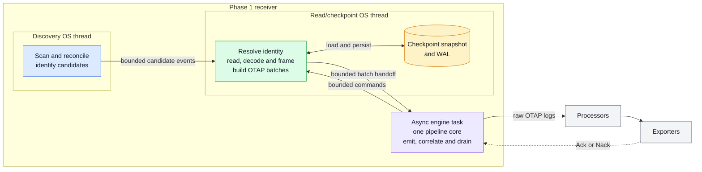
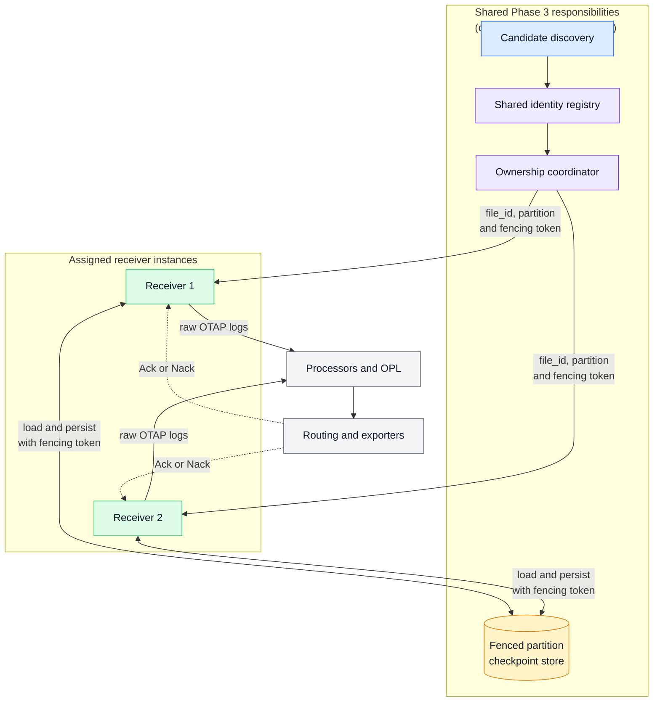
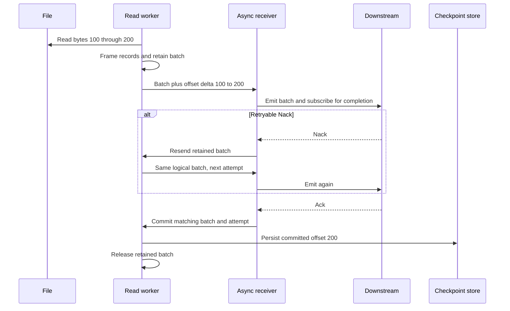
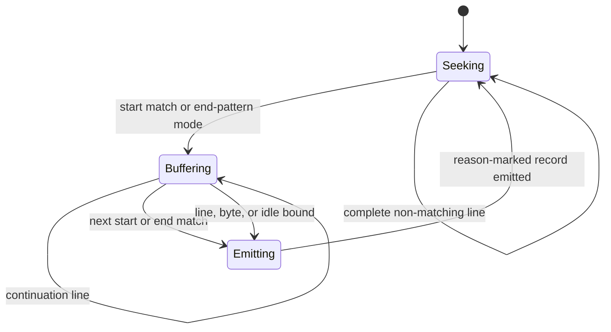
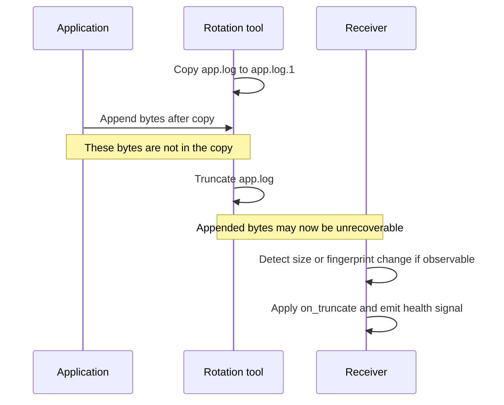
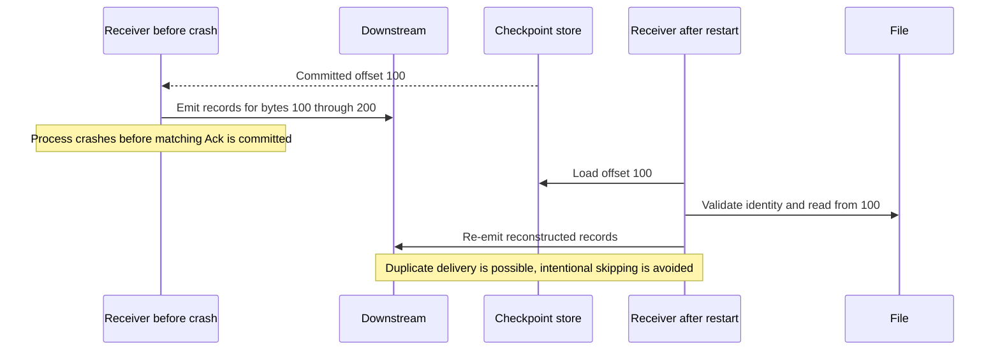
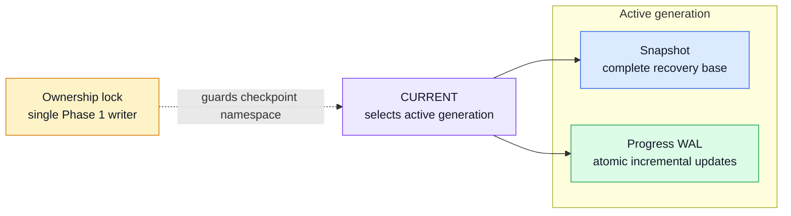
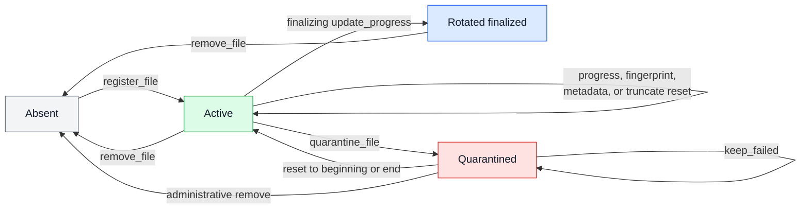

<!-- markdownlint-disable MD013 -->

# Filelog Receiver Design

Status: Proposed

Tracks [#2844](https://github.com/open-telemetry/otel-arrow/issues/2844). Related work:
[#2321](https://github.com/open-telemetry/otel-arrow/issues/2321) and the journald
receiver [#2858](https://github.com/open-telemetry/otel-arrow/issues/2858).

## Executive summary

This document proposes an OTAP-native receiver for continuously collecting logs from
local files. The receiver discovers eligible files, decodes and frames their contents,
handles rotation and restart, and advances durable source offsets only after downstream
acknowledgement. All queues, buffers, readers, and batches are bounded.

The proposal is delivered in three phases. Phase 1 establishes the single-instance
correctness model: durable file identity, bounded reading and framing, one retained OTAP
batch, Ack-gated checkpoints, restart recovery, and move/create rotation. Phase 2
improves throughput and discovery efficiency without changing ownership. Phase 3
introduces shared identity resolution, virtual-partition ownership, distributed
fencing, readiness coordination, and checkpoint-state migration.

Phase 1 preserves ordering within each file and provides at-least-once delivery for
emitted batches. Reconstructing uncommitted records after restart requires both durable
checkpoint state and the corresponding source bytes to survive. Phase 1 does not spool
emitted OTAP batches to disk, and copy-truncate capture remains best-effort. Timestamp
extraction, structured parsing, severity mapping, enrichment, filtering, and routing
remain processor responsibilities.

## Delivery phases at a glance

This table summarizes the proposed delivery sequence. The detailed
[Phase delivery and validation](#phase-delivery-and-validation) section defines the
deliverables and required evidence for each phase.

| Phase | Scope | Principal limitation or dependency |
| --- | --- | --- |
| Phase 1 | One receiver; periodic discovery; bounded reading and framing; one receiver-wide in-flight batch; Ack-gated checkpoints; durable identity and quarantine; move/create rotation | Receiver-wide head-of-line blocking; no distributed ownership, fencing, or lossless live-rollout readiness guarantee |
| Phase 2 | Native discovery notifications; multiple in-flight batches or local shards; optional source metadata and background compaction | Ownership remains local and single-instance |
| Phase 3 | Shared identity resolution; virtual-partition assignment; fenced checkpoint persistence; revoke/assign protocol; readiness; migration from Phase 1 state | Requires shared coordination and an explicit checkpoint-store migration |

## Decisions requested

Reviewers are asked to agree on the following Phase 1 contracts and accepted
compromises:

| ID | Decision | Rationale or consequence |
| --- | --- | --- |
| D1 | Run one filelog receiver instance | Engine-scoped ownership and fencing do not exist yet |
| D2 | Isolate local discovery behind `DiscoverySource`, but do not claim it is the Phase 3 ownership protocol | Distributed ownership requires revisions, fencing tokens, reconciliation, and revoke completion |
| D3 | Keep CPU count and deployment generation out of identity and checkpoint keys | Deployment changes must not change source progress; Phase 3 still needs a shared identity resolver before partition assignment |
| D4 | Key durable progress by an opaque persisted `file_id` | Paths, fingerprints, and native locators are matching evidence, not permanent identity |
| D5 | Use a stable checkpoint namespace independent of a pipeline generation | Restart and receiver-node rename must reconnect to the same state |
| D6 | Use runtime locators and fingerprints only for guarded recovery matching | Both can be reused or collide |
| D7 | Advance offsets only after a matching downstream Ack | Nack, shutdown, and failed delivery must not silently lose source progress |
| D8 | Run filesystem and checkpoint operations on fixed dedicated threads | Blocking work must not stall the current-thread async runtime or create an unbounded blocking pool |
| D9 | Keep byte decoding and record framing in the receiver and semantic interpretation in processors | Framing controls offsets; interpretation should remain reusable and destination-independent |
| D10 | Emit raw OTAP logs with bounded source metadata | The receiver does not embed Stanza-style operator chains |
| D11 | Bound readers, descriptors, buffers, batches, channels, retries, and scheduling turns | Memory and overload behavior must remain predictable |
| D12 | Support move/create rotation and describe copy-truncate as best-effort | Portable filesystem observation cannot guarantee copy-truncate capture |
| D13 | Retain one receiver-wide in-flight batch in Phase 1 | This simplifies progress correctness but intentionally couples all files for Ack latency, failure, and drain |
| D14 | Use periodic reconciliation as the Phase 1 discovery mechanism | Native notifications are a Phase 2 latency optimization, not a correctness source |
| D15 | Use a namespace lock and process-local runtime leases for Phase 1 ownership | This prevents overlapping local readers but does not provide distributed fencing or lossless live-rollout readiness |
| D16 | Fail closed on corrupt durable state and persist fail-policy quarantines | Ambiguous recovery never silently inherits an offset, and restart cannot bypass an operator-visible failure |

## Goals and non-goals

### Goals

- Tail eligible local files while they continue to grow.
- Preserve deterministic per-file framing, ordering, identity, and Ack-gated progress.
- Bound memory, file descriptors, scheduling work, retries, and channels.
- Recover after restart when durable state and uncommitted source bytes survive.
- Handle ordinary move/create rotation and report weaker copy-truncate behavior honestly.
- Leave a logical progress model that Phase 3 can preserve behind new identity,
  ownership, and checkpoint services.

### Non-goals

- Compatibility with the Go filelog receiver or Stanza operator chains.
- Embedded timestamp, JSON, severity, enrichment, filtering, or routing semantics.
- Durable telemetry spooling or guaranteed recovery after source bytes disappear.
- Guaranteed copy-truncate capture.
- Multi-instance or multi-process ownership, virtual partitions, or fenced handoff in
  Phase 1.
- Lossless live-rollout readiness semantics in Phase 1.
- Separately scoped source contracts, including mounted network filesystems, archives,
  and read-once/delete behavior; see
  [Separately scoped capabilities](#separately-scoped-capabilities).

## Phase 1 guarantees and limitations

| Area | Contract |
| --- | --- |
| Capture | Reads eligible complete records while their source bytes remain available |
| Delivery | Retains and retries one emitted receiver-wide batch until Ack or terminal policy |
| Checkpointing | Commits source offsets and required framing-resume state only after matching Ack |
| Crash recovery | Reconstructs uncommitted records only if checkpoint state and source bytes survive |
| Ordering | Preserves ordering within each file, not across files |
| Rotation | Supports move/create; copy-truncate remains best-effort |
| Delivery semantics | At least once, with possible duplicates after retry or crash |
| Durability | Does not spool emitted OTAP batches to disk |
| Failure isolation | Most source errors quarantine one file; batch, checkpoint, and ownership failures may stop the receiver |
| Live rollout | Serializes local ownership but cannot advertise lossless ready-before-ownership semantics without an engine readiness contract |

## Responsibility split

| Component | Responsibility |
| --- | --- |
| Receiver | Discover, decode, frame, and track Ack-gated source progress |
| Processors | Parse timestamps and content; enrich, normalize, filter, and route |
| Exporters | Represent and deliver records to destinations |

The important boundary is simple: the receiver decides **which source bytes form a
record**; processors decide **what that record means**; exporters decide **how that
record is represented and delivered**. Ack or Nack returns to the receiver because
only the receiver controls logical checkpoint advancement. In Phase 3, discovery and
ownership assignment may move to the shared services shown in the target architecture
diagram. The receiver continues to calculate source progress and decide when Ack permits
advancement; a shared fenced store becomes responsible for durable persistence.

File collection combines several problems that must remain correct together: discovery,
identity, framing, rotation, backpressure and restart recovery. Embedding timestamp,
JSON, severity, filtering and routing logic in the receiver would mix source progress
with customer-specific interpretation. Keeping those operations in processors makes the
receiver smaller, makes failures easier to reason about, and lets other receivers reuse
the same processing functions.

## Relationship to #2844

The proposal in #2844 remains the target: coordinated discovery and assignment,
fixed virtual partitions, and multiple receiver instances whose ownership does not
depend on the current CPU count. This document makes explicit that shared identity
resolution must occur between candidate discovery and partition assignment.

Phase 1 uses one receiver and an in-process discovery source because the required
engine-level identity, ownership, and fencing services do not exist yet. The reader is
kept independent of glob traversal, but the local candidate-event interface is not the
future distributed ownership protocol. Phase 3 preserves the reading, framing, rotation,
and Ack-gated progress semantics while replacing identity resolution, ownership
assignment, and checkpoint storage. Phase 1 delivers the receiver and Ack-gated
progress surface described here, but the epic's live multi-instance resize criteria
remain Phase 3.

## Reuse from journald and Quiver

Journald is useful prior art for one pattern: keep blocking source and checkpoint work
on a dedicated worker, hand bounded batches to the async receiver, retain an in-flight
batch, and commit progress only after Ack. Filelog follows that lifecycle pattern but
does not share journald's source mechanics: it has file discovery, byte offsets,
framing, fingerprints and rotation. Refactoring common plumbing is optional follow-up
work, not a prerequisite.

Quiver provides reusable persistence conventions, not the filelog data model. Its small
cursor/progress sidecars use magic bytes, version and size fields, a logical position,
CRC validation, and atomic temporary-file + sync + rename updates. Filelog reuses those
envelope and recovery conventions for its snapshot, WAL and current-generation marker.
It does not use Quiver's Arrow segment store or copy its single WAL cursor directly:
filelog progress is a table of `(file_id, byte_offset)` entries whose offsets advance
after downstream Ack.

## Architecture

### Phase 1 architecture



### Target architecture from #2844



The shared grouping represents architectural responsibilities, not a process, service,
thread, or engine-extension boundary. The diagram specifies the required fencing
property, not a future service API. A receiver may resume from or modify partition
progress only under current ownership, and every checkpoint write rejects stale fencing
tokens. Whether receivers access the store directly or through a coordination service
remains a Phase 3 decision.

These responsibilities are separate from topic fanout. Ownership coordination controls
which receiver may read a source and mutate its checkpoint. Topics carry already-emitted
OTAP data downstream so processors and exporters can run in parallel; they do not
resolve file identity, assign source ownership, or fence checkpoint writes.

The target preserves receiver behavior below the ownership boundary -- file reading,
framing, batching, Ack/Nack correlation, backpressure, and drain. It does not merely
replace a producer. It introduces shared identity resolution, a distributed ownership
protocol, fenced checkpoint storage, and an explicit migration from the Phase 1 store.

For each batch:

1. Discovery reports new or changed candidates; Phase 1 resolves identity and local ownership.
2. The worker reads bounded turns, frames records and builds an OTAP batch.
3. The receiver emits the batch and retains it while waiting for completion.
4. Ack persists the new file positions; retryable Nack resends the retained batch.
5. Backpressure, drain and shutdown interrupt reading without advancing unacknowledged
   positions.

The detailed correlation and retry rules appear under **Ack and checkpoint model**.

## Instance model and discovery

### Phase 1: single instance with local discovery

The factory rejects `pipeline.num_cores() > 1`, exactly as journald does. One receiver
instance owns all matched files. Parallel semantic processing is achieved downstream via
the topic exporter/receiver fanout (`docs/topic-architecture.md`).

Rationale: #2844's discovery/assignment extension requires engine- or group-scoped
identity and ownership services, and the extension system has no such scope today.
Phase 1 therefore isolates filesystem discovery behind a small internal boundary.

| Event | Meaning |
| --- | --- |
| `Observed` | A new runtime locator matches the discovery configuration |
| `Updated` | Path or relevant metadata changed for a known locator |
| `Removed` | The locator disappeared or stopped matching |

Events travel through one ordered, bounded stream. The read/checkpoint thread resolves
or creates `file_id`, acquires the runtime lease, and then controls the file reader.

`DiscoverySource` is a required local architectural boundary: the read worker must not
inspect glob configuration or perform directory traversal. It is deliberately only a
candidate-discovery abstraction. It does not grant distributed ownership and is not
claimed as the Phase 3 wire or extension protocol.

Phase 3 adds a separate ownership contract. At minimum, that contract needs an
assignment revision, an idempotency key, a fencing token, ordered snapshot/incremental
semantics, reconciliation after missed events or reconnect, an enforceable revoke
deadline, and receiver confirmation that reading has stopped. The existing Phase 3
architecture diagram establishes the flow; the conceptual message contract is:

| Message | Required conceptual fields |
| --- | --- |
| Resolved identity | `file_id`, identity revision |
| Assign | `file_id`, ownership token, locator, assignment revision |
| Revoke | `file_id`, ownership token, deadline, assignment revision |
| Revoked | `file_id`, ownership token, committed offset |

The Phase 3 protocol may replace the Phase 1 candidate-to-reader adapter without
changing byte reading, framing, or the logical Ack-gated progress model. It will change
the reader-facing ownership messages and checkpoint implementation.

The Phase 1 implementation is a dedicated **discovery thread** running glob reconciliation
(include minus exclude, `ignore_older_than` filter) on `poll_interval`. Running
discovery on its own thread keeps three stall classes off the read path: slow directory
scans (large or network-mounted directories), fingerprint computation bursts (startup,
rotation storms), and `stat` storms. Discovery output invariants:

- **One event stream, ordered.** Candidate events are delivered over a single bounded
  channel, so a `Removed` event cannot be overtaken by a later `Observed` event for the
  same runtime locator.
- **Runtime-locator dedup.** POSIX `(st_dev, st_ino)` or Windows
  `(volume_serial, FILE_ID_INFO)` deduplicates bounded tracked, pending, and in-flight
  candidate state. Hardlinks, overlapping globs, and files transiently visible at two
  paths therefore cannot create two readers; path remains metadata. Matches that
  overflow all bounded candidate state are not remembered merely for deduplication and
  may be rediscovered, but the worker's runtime lease still enforces one reader per live
  runtime locator.
- A new runtime locator always produces a distinct candidate while the previous
  locator is live, even if their fingerprints are identical. Equal prefixes are common
  for unrelated logs and are not proof of identity. Same-filesystem rename continuity
  comes from the unchanged locator. Cross-device or cross-volume copy/unlink is treated as a new file in
  Phase 1; duplicate ingestion is safer than merging two independent streams.

### Discovery and growing-file collection

#### Incremental tailing and discovery latency

When a new file matching an include pattern is created or moved into a configured
directory, the receiver discovers and admits it for local reading without waiting for
the file to close, stop growing, or reach a size threshold. After applying `start_at`
and durably registering the initial checkpoint anchor, the worker reads currently
available bytes in bounded turns and emits complete records incrementally as new bytes
are appended. It never loads or waits for the complete file.

Phase 1 uses periodic glob reconciliation. Phase 2 may add filesystem notifications for
prompt create, move, and relevant modification hints, while reconciliation remains the
source of correctness after missed or coalesced events, watcher overflow, directory
replacement, startup races, or platform-specific notification gaps. A notification is
only a hint to reconcile and `stat`; it is not file identity or proof that a write is
complete.

Rapid file growth remains bounded by `max_read_bytes_per_turn`, record and batch bounds,
and downstream backpressure. When downstream is blocked, the receiver stops reading and
leaves unread bytes in the file rather than buffering the growing file in memory. The
expected Phase 1 discovery latency, while admission capacity is available and no earlier
candidate overflow is pending, is one configured `poll_interval` plus scan and
candidate-handoff time. Discovery scan duration and candidate-channel delay are
measured so operators can detect when that expectation is not met. Phase 2 notifications
may improve latency but do not change the correctness mechanism.

#### Discovery rules and safety

Phase 1 applies these discovery rules:

- Excludes take precedence over includes.
- `follow_symlinks` defaults to false. When enabled, directory cycles are detected by
  runtime identity; the traversal stack and ancestor-locator state remain bounded by
  `max_recursion_depth`.
- Excludes apply to both the matched path and resolved target, so a symlink cannot
  bypass a sensitive-path exclusion.
- A newly matching exclude revokes an active file at the next record boundary.
- `ignore_older_than` applies when a candidate is considered for admission. It does not
  evict an already tracked file merely because its writer becomes quiet.
- `recursive` controls whether the scanner may descend below the directory named by an
  include. `**` controls matching within that permitted traversal and does not override
  `recursive: false`.

The receiver always excludes its resolved checkpoint namespace under
`${engine.state_dir}`. Configuration is rejected when an include resolves directly to
that namespace, and a warning is emitted when include patterns appear to cover the
engine's own log output. This protection is unconditional and does not depend on a
user-supplied exclude, preventing checkpoint WAL or snapshot files from feeding back
into the receiver.

#### Capacity and admission

Discovery and admission use distinct bounded populations:

| Population | Meaning | Bound |
| --- | --- | --- |
| Scan working state | Traversal stack, current directory entry and match evaluation | Incremental processing plus `max_recursion_depth`; the complete match set is never materialized |
| Candidate events | Matches waiting for worker handoff | Bounded discovery channel |
| Pending candidates | Matches retained while tracked-identity capacity is unavailable | `max_pending_candidates` |
| Tracked identities | Durable `file_id` checkpoint records | `max_tracked_files` |
| Open descriptors | Files with an open operating-system handle | `max_open_files` |

Reconciliation processes directory entries and glob matches incrementally. It retains
scan-generation markers only for bounded tracked identities and retained pending
candidates, not a snapshot of every untracked match. Each scan marks those locators that
are still eligible. After the scan, an unmarked tracked locator produces `Removed`; an
unmarked pending candidate is removed from the pending queue. This detects disappearance
without materializing an unbounded filesystem snapshot.

When `max_tracked_files` is reached, candidates are retained in the bounded pending
queue. Retained candidates are admitted oldest-discovered first. When that queue is
full, additional matches are counted and reported but are not retained in memory;
periodic reconciliation makes them eligible again. Reconciliation rotates or otherwise
fairly varies admission opportunity so stable traversal order cannot permanently starve
candidates that previously overflowed. Strict oldest-first ordering applies only among
retained candidates.

Admission pressure is observable through pending depth, oldest retained wait age,
overflow count, reconciliation passes with overflow, and time since the last successful
admission while overflow persists. The receiver does not claim a per-candidate or global
maximum wait for candidates whose arrival state was not retained. When
`max_open_files` is reached, fair batching and least-recently-served descriptor rotation
prevent an admitted file from starving.

With `checkpoint.retention: 0`, durable records are never automatically removed, so a
full tracked table can remain saturated until the limit is raised or an operator
explicitly removes state. This interaction produces a configuration warning and is
documented as an availability tradeoff. Durable quarantines are also exempt from
ordinary retention, so they consume tracked-file capacity until an operator resets or
administratively removes the exact `file_id`.

### Ownership across generations

Live reconfiguration and resize overlap deployment generations: the new instance may
start **before** the old one drains. Both generations
resolve the same checkpoint path (keys exclude generation by design, D5). Without an
ownership mechanism, the old generation can rewrite checkpoint state **after** the
new generation has advanced it -- a lost-update race that exists in Phase 1, not just in the
multi-instance future.

Phase 1 uses two mechanisms with deliberately different scopes:

1. An exclusive advisory lock on the stable checkpoint namespace (`flock` on supported
   POSIX targets and `LockFileEx` on Windows) prevents overlapping generations of the
   same logical receiver from concurrently loading or replacing its checkpoint state.
2. A process-wide `RuntimeFileLease` registry keyed by the platform runtime locator prevents two
   filelog receiver instances in the same engine process from controlling the same live
   file, even when their include patterns or checkpoint namespaces overlap. Admission
   waits for the current lease holder to drain or rejects the duplicate according to a
   bounded ownership timeout.

The runtime-lease registry is an intentional, narrow exception to the engine's
share-nothing model:

- The filelog support module owns one registry per engine process. It contains only
  runtime locators with active logical-reader lease guards; it contains no telemetry
  payloads, checkpoint progress, or durable identity state.
- Registry entries are bounded by the sum of `max_tracked_files` across active filelog
  receiver nodes. Pending acquisitions remain in each receiver's bounded candidate and
  command state; the registry has no internal wait queue.
- Acquire, verify, and release are atomic under one short process-local mutex critical
  section containing only bounded map operations. No filesystem I/O, retry, sleep, or
  channel wait occurs while holding that mutex.
- Only discovery or read/checkpoint OS threads access the mutex. Pipeline-core async
  tasks request ownership through bounded channels and never block on the registry.
  Contention retries occur outside the critical section and stop at
  `ownership_timeout`.
- A lease is represented by an RAII guard owned by the logical reader. Temporary FD
  closure for descriptor rotation does not release it. Finalizing or revoking that
  reader, normal drain, receiver failure, or panic unwinding drops the guard. Process
  termination clears the process-local registry. A poisoned mutex or inconsistent
  release fails the affected receiver closed rather than permitting a duplicate reader.

This synchronization is accepted only to enforce process-local single-reader safety
across independently configured receiver nodes. It is not a Phase 3 ownership or
fencing mechanism and must not enter the per-record data path.

- The receiver starts, reports itself alive to the engine, and enters a
  **waiting-for-ownership** state; it acquires the lock with bounded retries. Reads and
  checkpoint access begin only after the lock is held. This ordering is required
  because pipeline readiness must not deadlock against the old generation still
  holding the lock during its drain.
- The lock is released at drain completion (process exit releases it in all failure
  modes -- this is why an OS lock is preferred over a persisted lease, which would need
  staleness heuristics).
- Runtime file leases are released when their logical readers are finalized or revoked
  and on receiver termination. They survive temporary FD closure and reopening. They
  are process-local guards, not durable identity or checkpoint records.
- Advisory locks are unreliable on some network filesystems; a `state_dir` on NFS is
  documented as unsupported for concurrent-rollout safety.

This prevents duplicate readers during normal live reconfiguration inside one engine,
including receiver-node renames and overlapping patterns. It does not coordinate two
independent engine processes that use different state directories; that deployment is
outside the Phase 1 ownership guarantee and must be documented. Receiver readiness
signalling does not exist in the engine today. A new generation waiting for the lock is
alive but must not be represented as collecting or ready. Consequently, Phase 1 can
serialize local ownership, but it cannot claim lossless ready-before-ownership rollout
semantics. Deployment orchestration must treat an `ownership_timeout` as terminal; an
engine-level readiness contract is a prerequisite for making a stronger claim.

### Multi-instance requirements (Phase 3)

When shared identity, assignment, and engine-scope coordination exist, ownership moves
from "one instance owns everything" to assigned subsets. This document fixes only the
**requirements** that Phase 3 must satisfy; it does not claim that the Phase 1 candidate
events or checkpoint files implement them:

1. **Single-writer-per-identity:** at most one instance reads a given logical `file_id`
   and
   writes its checkpoint state at any time.
2. **Enforced fencing on checkpoint writes:** a revoked or stale instance must be
   unable to clobber state written by the new owner. Recording an epoch inside a file is
   insufficient because a stale writer can overwrite that file. The Phase-3 storage or
   coordinator must compare and reject stale epochs atomically (for example, under a
   coordinator-owned lease or compare-and-swap store). Epoch allocation, verification,
   transport, expiration, and recovery after coordinator restart remain Phase 3 design
   decisions.
3. **Ready-before-ownership:** an instance can run without owning anything and acquire
   ownership later. Claiming rollout readiness requires the engine-level readiness
   contract that Phase 1 lacks; merely waiting for a local lock is not sufficient.
4. **Identity before partitioning:** a shared identity registry resolves or creates the
   persisted opaque `file_id` before ownership is assigned by `file_id`. Discovery
   candidates cannot be partitioned by an ID that only the eventual receiver creates.
   The registry's concurrency, idempotency, and recovery contracts remain Phase 3 work.
5. **Stable partition input:** after shared identity resolution, partition mapping uses
   `file_id`, never a fingerprint. It is therefore stable for short, empty, and growing
   files. The mapping function and partition count remain Phase 3 decisions.

Checkpoint records carry stable `file_id`s and no current owner, which preserves useful
logical progress input for a future split. It does not by itself solve pre-assignment
identity resolution. Moving from the Phase 1 instance-local snapshot/log to
partition-owned fenced storage is a checkpoint-storage replacement with a coordinated
format and ownership migration, not an in-place extension. Virtual partitions,
partition counts, and revoke/assign mechanics do not appear in Phase 1 config because
freezing them now would encode an unproven protocol into a durable format.

That migration must be explicit and versioned. It must preserve each committed
`file_id` offset without re-ingestion or skipping, reject mixed old/new ownership during
cutover, and either roll back safely or fail before any new owner reads. Phase 3 is not
complete until this migration path is specified and tested.

## File identity

Three values have separate roles:

1. **Logical identity: `file_id`.** An opaque 128-bit value generated from OS randomness
   when a file is first registered, checked against the loaded table, and persisted
   before content is emitted. It is the checkpoint record key and the future partition
   input. It never changes when a fingerprint grows, a path changes, or a runtime locator is
   replaced.
2. **Runtime locator:** POSIX `(st_dev, st_ino)` or Windows
   `(volume_serial, FILE_ID_INFO)`. It keys open readers, discovery dedup, and
   process-wide runtime leases. It survives ordinary same-filesystem or same-volume
   rename but is not permanent identity because locators can eventually be reused.
3. **Matching evidence: raw fingerprint bytes.** The first `fingerprint_bytes` after
   `ignored_header_bytes`, stored with their current length. A short file has a mutable
   provisional fingerprint that grows *inside the same `file_id` record*. Fingerprints
   help reconnect discovered files to checkpoint records; they are neither unique keys
   nor proof that two live files are the same.

Identity invariants:

- **INV-ID1:** every concurrently tracked runtime locator has exactly one `file_id`, and
  every `file_id` has at most one active runtime locator. Two live files with identical
  fingerprints remain distinct and receive different `file_id`s.
- **INV-ID2:** checkpoint records are uniquely keyed by `file_id`. Fingerprint bytes,
  current fingerprint length, last-known platform runtime locator, and last path are
  mutable fields used for recovery matching.
- **INV-ID3:** on restart or reopen, an exact platform runtime locator plus successful
  fingerprint-prefix validation is the strongest match. A unique full-window
  fingerprint match may reconnect a record only when its previous runtime locator is no
  longer live and no other candidate or record shares that fingerprint. Otherwise the
  match is ambiguous and the candidate receives a new `file_id`. Recovery mismatch is
  not first discovery: it follows `identity.on_recovery_mismatch`, whose default is
  `beginning`, so the normal bias is duplicates over skipped data.
- **INV-ID4:** `committed_offset <= current_size` is required before resuming. A failed
  fingerprint validation, offset beyond size, or ambiguous match never inherits an old
  offset. It creates a new logical identity, increments `filelog.identity.reset`, and
  applies `on_recovery_mismatch: beginning | skip_to_end | fail`. `skip_to_end` is an
  explicit intentional-loss policy; `fail` quarantines the file pending operator
  action.
- **INV-ID5:** registration is durable before reading begins. For `start_at: beginning`,
  the initial committed offset is `0`. For `start_at: end`, the receiver opens the file,
  obtains the starting EOF from that FD, and persists that offset as an initial anchor.
  This offset represents intentionally skipped bytes and does not require downstream
  Ack. Bytes appended after the anchor are then eligible for normal Ack-gated reading.

Fingerprint growth updates matching evidence under the same `file_id`; it never rekeys
a checkpoint record. Cross-device copy/unlink is not inferred from fingerprint equality
in Phase 1 because a copied file and an unrelated file with the same prefix are
indistinguishable without stronger source-specific evidence.

No local-filesystem locator is a permanent identity across deletion and identifier
reuse. A reused locator whose replacement reproduces the same fingerprint window can be
mistaken for the previous file after restart. Increasing the fingerprint window and
skipping constant headers reduces that risk but cannot eliminate it; the README must
state this limitation. Network filesystems with weak inode semantics are unsupported in
Phase 1 unless a later fallback identity policy is added.

Changing identity configuration after checkpoints exist is a state migration, not an
ordinary config reload. Changing `fingerprint_bytes`, `ignored_header_bytes`, or the
fingerprint algorithm/profile is rejected unless an explicit migration or state-reset
policy acknowledges possible re-identification, duplicate ingestion, or skipped data.
Phase 1 defines migration of its own versioned checkpoint format, but it does not define
a generic importer for unrelated path- or native-identity stores. A distribution that
has legacy state may provide an explicit, versioned migration tool outside the receiver.
Such a tool must validate identity before using an imported offset, report matched,
ambiguous, reset, and rejected records, and be idempotent across restart. Filebeat 9.x
path/native-to-fingerprint migration is prior art for the algorithm, not proof that an
unrelated product's stored state contains enough evidence to migrate safely.

Phase 1 supports Linux, macOS, and Windows durable identity. Linux and macOS use the
runtime locator described above. Windows uses
`GetFileInformationByHandleEx` + 128-bit `FILE_ID_INFO`, which is required for ReFS
correctness. Equivalent restart and rotation tests are Phase-1 acceptance criteria on
all three platforms. Reading a Windows file whose writer denies shared-read access
remains a separate source contract and is not implied by Windows identity support.

## Execution model

Three components keep blocking work isolated from the engine runtime:

- **Discovery thread** (blocking): glob reconcile, `stat`, fingerprint computation for
  new files. Emits `CandidateEvent`s over a bounded channel. Slow scans delay
  discovery of *new* files but never stall tailing of already-assigned files.
- **Read worker thread** (blocking): consumes candidate events; owns FDs, framing,
  Arrow batch building, the in-memory offset table, the retained in-flight batch, and
  all checkpoint I/O including fsync. Checkpoint writes stay on this thread in Phase 1
  because the worker is idle during the in-flight window anyway (see Ack model): commit
  I/O fills dead time rather than competing with reads.
- **Async engine task**: owns the control channel, Ack/Nack correlation, emission, and
  drain deadlines. Two hard requirements from the engine contract:
  - control messages are polled with **biased priority** over the worker handoff
    channel (journald `mod.rs:751-753`);
  - a blocked downstream send is raced against **incoming control messages** (not
    merely a pre-armed deadline), so `DrainIngress`/`Shutdown` arriving during
    backpressure interrupts the send (journald `mod.rs:906-974`). A drain that can
    only fire from an already-known deadline would be unreachable while parked on a
    full channel.

Channels: discovery->worker (bounded, candidate events), worker->async (bounded,
capacity 1, batches + delta sets), async->worker (bounded, commands: Commit, Resend,
Drain, Shutdown). The worker never blocks indefinitely on a full channel: it polls the
command channel with a short timeout while the handoff is full (journald's discipline).

Phase 1 co-locates several logical components on the read/checkpoint thread, but their
contracts remain distinct:

- Discovery produces candidates and never grants distributed ownership.
- Identity and local ownership resolve `file_id` and enforce one local reader.
- Reading and framing produce deterministic records plus progress deltas.
- Batch/Ack coordination owns the receiver-wide delivery frontier.
- The checkpoint store atomically persists progress and framing-resume state.

These are logical contracts, not separate threads or proposed Rust types. Phase 1
co-locates identity, reading, batching, and checkpoint work on the read/checkpoint
thread. It accepts that synchronous WAL, `fsync`, and compaction latency pauses every
reader. Moving a component to another thread in Phase 2 must preserve bounded queues,
cancellation, ordering, and the single-writer progress contract.

Reader scheduling within the worker:

- Ready files are served round-robin; each turn reads at most `max_read_bytes_per_turn`
  from one file. Intra-file ordering is guaranteed (single reader per file, offsets
  monotonic); cross-file ordering is not guaranteed, matching all prior art.
- At most `max_open_files` FDs are held. When over the cap, the **least-recently-served**
  reader is closed (offset retained; reopen re-validates identity per INV-ID3) so FD
  ownership rotates and a hot subset cannot permanently starve cold files.
- Only readers holding one of those open-file slots retain in-memory decoding, physical
  line, or multiline buffers. Closing a reader discards any uncommitted framing buffers;
  reopening starts at the durable committed offset and reconstructs them from source
  bytes. If those bytes no longer survive, the ordinary recovery limitation applies.
  Durable framing-resume state is changed only by Ack-gated progress, never by closing
  an uncommitted reader.
- **No read-ahead past the unacked frontier (Phase 1):** while a batch is in flight, no
  reader advances its file position beyond the offsets captured in that batch's delta
  set. The worker is idle during the in-flight window (journald's proven invariant).
  This deliberately caps throughput at one batch per downstream round trip; lifting it
  is the Phase-2 pipelining/multi-in-flight work, which must then design read-ahead
  offset tracking. Independently, one read worker is the Phase-1 aggregate file-I/O and
  checkpoint-I/O throughput ceiling even when downstream latency is negligible; Phase-1
  performance claims and benchmarks must name both ceilings.

The one-batch rule is receiver-wide, not per file. It deliberately accepts
head-of-line blocking in Phase 1: one slow Ack pauses all file reads, a permanent batch
failure can stop unrelated files, and every file's checkpoint latency is coupled to the
same downstream round trip and progress sync. Round-robin read turns limit domination
while constructing a batch, but they do not provide failure isolation after emission.
Phase 1 acceptance therefore includes aggregate throughput, Ack-latency sensitivity,
hot-file fairness, and permanent-Nack behavior with many active files. Phase 2 may
introduce local shards or multiple in-flight batches only with independently specified
ordering, contiguous commit, memory, and failure-containment rules.

### Threading and NUMA placement

The Phase 1 architecture diagram shows the execution topology: one async receiver task
on the pipeline core plus fixed discovery and read/checkpoint OS threads. The workers are
not pinned to that core.

The factory rejects `pipeline.num_cores() > 1`; there is exactly one discovery thread
and one read/checkpoint thread per Phase-1 receiver, never one thread per file, directory,
or mount. Downstream topic fanout is the Phase-1 parallelism boundary. Phase 3 may add
multiple assigned receiver instances only after virtual-partition ownership, fencing,
and checkpoint migration are defined.

Potentially blocking or unbounded-latency operations never run on the df-engine
current-thread async runtime. This includes directory traversal, `stat`, fingerprint
reads, file open/read/close, character decoding and framing, checkpoint WAL writes,
`fsync`, snapshot replacement, and synchronous compaction. Like host metrics' bounded
`statvfs` worker, filelog uses fixed dedicated threads and bounded handoff channels
rather than submitting repeated long-lived work to Tokio's shared blocking pool. This
caps a stuck filesystem's thread and queue impact.

The async task never calls a blocking channel send or synchronously joins a worker.
Worker shutdown is requested over the bounded command channel. Drain continues polling
control and downstream completion; any final thread join uses a non-blocking lifecycle
path and is bounded by the engine drain deadline. A blocked or failed worker produces a
terminal receiver event rather than parking the pipeline runtime indefinitely.

Phase 1 does not pin workers or make NUMA-locality claims; the operating system controls
placement. NUMA-aware scheduling may be considered later based on measured filesystem,
page-cache, checkpoint, and downstream behavior. CPU count, core ID, NUMA node, thread
ID, and deployment generation never enter file identity or checkpoint keys.

## Framing

Phase 1 supports newline framing and the bounded multiline contract below. Newline is
the default when no multiline boundary is configured. Framing operates on decoded
characters for configured text encodings; raw mode deliberately operates on bytes.
Invariants and constraints:

- **INV-FR1 (restartable commits):** every committed offset is paired with explicit
  framing-resume state. The common `clean` state means the next complete source unit
  starts a new logical record. A timeout-flushed partial record commits its ending byte
  offset with `clean`, so later bytes begin a new record both live and after restart.
  Split records that continue across batches commit `continuation { record_start_offset,
  next_fragment_index }`. Incomplete encoded characters are never committed. A reader
  must be able to resume from `(committed_offset, framing_resume)` and deterministically
  reproduce the same subsequent records.
- `max_line_bytes` (default 1 MiB) bounds the decoded physical-line buffer and is not an
  independent loss policy. When a physical line exceeds it, the receiver applies
  `max_log_size_behavior` exactly as it does for an oversized logical record. Under
  `split`, it emits bounded fragments while scanning to the newline and preserves every
  source byte. Under `truncate`, it emits the bounded prefix with
  `otel_arrow.filelog.record.truncated = true`, discards through the newline, and counts the
  discarded bytes. If a multiline record is already buffered, the receiver first emits
  that earlier buffer with reason `oversize_line_boundary`, then emits the oversize
  physical line or its fragments. The oversize line is therefore a self-contained
  logical record in source order. It does not participate in start- or end-pattern
  matching because evaluating a regex over an unbounded line would violate the memory
  contract. After it is emitted, the multiline state machine returns to its initial
  seeking or buffering state. Re-reads reproduce the same result, and unbounded line
  buffering is not permitted.
- A trailing partial line (no `\n` yet) is held in the reader's buffer until
  `max_line_bytes`; crossing that bound invokes the configured oversize policy. The
  configured `force_flush_period` may emit it after idle time,
  with a reason marker and a committed partial boundary as defined by INV-FR1. Without
  partial flush, EOF plus `rotate_wait` remains only an inactivity heuristic: a process
  may retain the renamed FD and write again later, so the receiver cannot prove the
  line is terminal. On rotation finalization any unflushed partial bytes are counted as
  `filelog.partial_bytes_dropped`; the checkpoint remains at the previous complete
  boundary. At drain, recoverable buffered bytes are reported as pending, not dropped,
  so restart can resume if the source still exists.
- Idle flush is the only sanctioned way to commit a mid-line offset on a non-terminal
  file. It trades latency for a documented slow-writer split risk and is included in
  Phase 1 so a final record can be released without waiting indefinitely. The flush
  terminates that logical record and commits a `clean` resume state; it does not require
  the next append to be merged with the timeout-flushed record.
- Phase 1 encoding supports UTF-8, ASCII, UTF-16LE, UTF-16BE, and raw mode using the
  decode-before-framing contract below. Raw byte preservation is not a substitute for
  selecting UTF-16.

Multiline aggregation lives in the receiver's framing layer because it changes record
boundaries and therefore offset accounting. It is part of Phase 1.

### Phase-1 framing and encoding contract

The following are target filelog capabilities, independent of any one destination.
They have established precedent in the OpenTelemetry Collector filelog receiver and
Fluent Bit tail/multiline implementations. Their inclusion does not imply Stanza
operator-chain compatibility.

- **Character encoding before framing.** Configuration supports `utf-8` (default),
  `ascii`, `utf-16le`, `utf-16be`, and `raw`. Encoding is selected by configuration and
  is never inferred from file content. A matching UTF-8 or UTF-16 byte-order mark is
  validated and removed only at the beginning of a new stream. A byte-order mark that
  conflicts with the configured encoding follows `on_decode_error`; it never silently
  changes the encoding. `raw` performs no character validation, does not strip a
  byte-order mark, frames physical lines on byte `0x0a`, and emits bytes; it is not a
  substitute for selecting UTF-16. Decoding precedes newline and regex framing because
  character boundaries, decoded record size, and UTF-16 newline representation depend
  on the selected encoding. Checkpoint offsets always remain offsets in source bytes.
  After detectable truncation, decoding restarts at source offset zero so a new
  byte-order mark is handled as a new stream.
- **NUL is data, not termination.** In UTF-8 and ASCII modes, byte `0x00` decodes as
  U+0000. In UTF-16 modes, code unit `0x0000` decodes as U+0000. In raw mode, byte
  `0x00` is preserved unchanged. NUL never means EOF or a record boundary; only the
  configured framing rules terminate a physical line or logical record.
- **Decode errors preserve evidence.** Invalid source bytes never terminate a record
  silently. `on_decode_error: preserve_raw | replace | fail` is explicit; the generic
  default is `preserve_raw`, which emits the complete framed source slice as a bytes
  body and marks the record. `replace` is lossy and counted; `fail` quarantines the
  file. The receiver contract ends at an OTAP bytes body. JSON escaping, base64, column
  mapping, and destination searchability are exporter/product contracts and must be
  validated end to end before claiming byte-for-byte recovery from a text destination.
- **Multiline boundaries.** Configuration may set zero or one of
  `line_start_pattern` or `line_end_pattern`. Setting neither selects the default
  newline-framing mode; setting both is rejected at build time.
  The regex contract is a versioned, RE2-compatible syntax profile shared by control
  plane validation and the agent. Unsupported constructs are rejected before rollout;
  the agent also compiles defensively and fails the affected data source rather than
  silently falling back. Joined physical lines retain their newline separators. The
  emitted record's checkpoint delta ends after the last source byte included in that
  record.
- **Bounded multiline state.** A multiline record is bounded by decoded output bytes,
  physical line count, and, when nonzero, `force_flush_period`, measured as idle time
  since the most recent physical line. `force_flush_period: 0s` disables idle partial
  flushing. The first enabled bound reached determines the result. A line-count or
  timeout flush emits the complete buffer, marks the reason, and begins a new candidate
  record at the next physical line; no source bytes are discarded. A timeout is an
  explicit heuristic and can split a record written slowly. Byte overflow follows the
  oversize policy below. Rotation and drain use the same reason-marked flush contract
  when idle partial flushing is enabled; otherwise they retain the documented Phase 1
  behavior.
- **Oversize policy.** `split` preserves all input by emitting bounded fragments;
  `truncate` emits the bounded prefix and discards through the logical record boundary.
  Both policies emit telemetry, and emitted records identify truncation or
  fragmentation. Until equivalent OpenTelemetry semantic conventions are accepted,
  split fragments use experimental project attributes: `otel_arrow.filelog.fragment.id`
  (string), `otel_arrow.filelog.fragment.index` (zero-based integer), and
  `otel_arrow.filelog.fragment.last` (boolean). They are not registered semantic conventions.
  A future convention must include an explicit migration rather than silently reusing a
  `log.*` name.

  `otel_arrow.filelog.fragment.id` is the lowercase 64-character hexadecimal encoding of the
  full SHA-256 digest over the following byte sequence:

  ```text
  UTF-8("otel-arrow-filelog-fragment-v1\0") ||
  file_id as 16-byte big-endian ||
  file_epoch as u32 big-endian ||
  record_start_offset as u64 big-endian
  ```

  The construction is unkeyed and domain-separated. It is stable across retry and
  restart, has SHA-256 collision expectations, and does not expose the raw `file_id`.
  It is an opaque correlation value, not authentication, authorization, or a secret.
  Together with index and finality, it lets processors or destinations reconstruct the
  original record. When a split logical record crosses an Ack boundary, its next
  fragment index and original record start are durable framing-resume state.
  For decoded text, the byte limit is measured on the UTF-8 body emitted into OTAP; for
  `raw`, it is measured on source bytes.

Boundary completion is deterministic:

| Condition | Result |
| --- | --- |
| Next start-pattern match | Emit the previous record; matching line begins the next |
| End-pattern match | Include the matching line and emit the record |
| `max_multiline_lines` | Emit buffered lines, mark `max_lines`, continue with next line |
| `max_record_bytes` | Apply `split` or `truncate`, mark the record, advance deterministically |
| Idle `force_flush_period` | Emit buffered content, mark `timeout`, continue with next line |

The phrase "pattern matched nothing" has no unambiguous meaning for a growing stream.
The receiver therefore does not permanently disable a valid configured pattern based
only on observed content. Before the first start-pattern match, complete non-matching
physical lines use newline framing and increment a bounded `pattern_not_matched`
counter; after a timeout/limit flush, the reader returns to that seeking state. An
end-pattern mode buffers immediately and is released only by its end match or a bound.
This state machine is reset when a new logical file identity begins.

More elaborate state-machine parsers and built-in language-specific multiline presets
can be added later. The initial generic contract is start-pattern or end-pattern
framing with explicit bounds and deterministic source-offset advancement.

### Processor dependency for end-to-end timestamp behavior

Timestamp extraction remains semantic processing outside the receiver. The receiver
sets `observed_time_unix_nano`; an OPL transform or dedicated parser may locate and
parse event time from the framed body and set `time_unix_nano`. The processor contract
must support fractional seconds, explicit numeric offsets, configured fallback
timezones, and explicitly selected `epoch_s` or `epoch_ms` units for either string or
numeric input. It must not infer epoch units from magnitude. If extraction or parsing
fails, the record retains observed time and receives a stable parse-status attribute;
bounded self-telemetry reports the failure class.

The corresponding processor configuration must define both where the timestamp is
found (for example, a regex capture or parsed field) and how it is parsed. A `strptime`
layout alone is not an extraction rule. Layout syntax is a versioned public profile
with an explicit directive table for fractional precision and numeric offsets; it must
not rely on an unspecified platform `strptime` dialect. Timezone resolution order is:
an offset in the record, then the configured IANA timezone, then the machine timezone.
Invalid zone names are configuration errors. The ambiguous/nonexistent local-time
policy at daylight-saving transitions and any destination precision reduction are
explicit processor/exporter policies, never silent conversions. This preserves the
receiver/processor boundary from #2844 while making the end-to-end filelog contract
testable.

These timestamp semantics are a public processor and distribution-integration
dependency, not part of the receiver's framing or checkpoint contract. Receiver
acceptance requires preserving the framed body and observed time needed by that
processor. A distribution claims end-to-end timestamp support only after its selected
processor profile, packaging, configuration, and exporter precision behavior pass the
corresponding conformance tests.

## Ack-gated checkpoint progression

The receiver does not commit source progress merely because it read or emitted a
record. It commits only after the matching downstream Ack.



## Emitted data model

Each framed logical record, or each fragment of a split record, becomes one OTAP log
record built with `LogsRecordBatchBuilder` +
`StrKeysAttributesRecordBatchBuilder<u16>`:

- `body`: decoded text or preserved raw bytes according to the encoding and decode-error
  policy. Multiline text retains its specified newline separators. No timestamp parsing:
  `time_unix_nano` is unset;
  `observed_time_unix_nano` is captured per record when the framed record becomes
  ready for emission. Severity is unset.
- Registered semantic-convention attributes are `log.file.path` (as matched) and
  `log.file.name`. Resolved symlink metadata uses the experimental project attribute
  `otel_arrow.filelog.path_resolved` when enabled; it is off by default. Fragment
  correlation and truncation use the experimental `otel_arrow.filelog.*` attributes defined in the
  framing contract. Source byte offset and record number are optional metadata, off by
  default, for investigation and replay correlation. The offset is the first source
  byte represented by the record; fragments additionally carry their source range.
  Opaque `file_id` remains checkpoint state and is not exposed by default.
- The receiver does not derive or attach host identity as part of file framing. Host
  resource attributes come from standard OpenTelemetry resource detection or pipeline
  enrichment.
- Batch flush when any bound is hit: `batch.max_records` (default 1,024; hard cap
  65,535 from the `u16` id space), `batch.max_flush_period` (default
  1 s), or `batch.max_bytes` (default 8 MiB). The byte budget uses one documented
  logical-size function: body bytes plus attribute-key bytes, attribute-value bytes,
  and a conservative fixed per-record overhead. It is not a claim about exact Arrow
  allocation size; memory bounds remain separately measured and tested.
- A single emitted record or fragment cannot exceed `batch.max_bytes`: the same
  logical-size function used by runtime flushing validates both `max_line_bytes` and
  `max_record_bytes` with configured and fixed attributes at config build time (reject
  otherwise), following journald's validate-at-build convention. Reaching either input
  bound invokes `max_log_size_behavior`; neither bound introduces a separate hidden
  truncation policy.

## Ack and checkpoint model

### Capture, delivery, and recovery guarantees

The design separates three contracts that are often conflated as "at-least-once":

- **Capture:** eligible complete records are read while their source bytes remain
  available. Bytes destroyed before read, including the copytruncate copy-to-truncate
  window or source retention while the receiver is behind, are outside the delivery
  guarantee. `start_at: end` is intentional exclusion, not failed delivery.
- **Delivery:** from record emission until a matching downstream Ack, the live receiver
  retains the batch and resends retryable Nacks. This is the precise in-process
  at-least-once guarantee.
- **Recovery:** after process failure, an unacknowledged record can be reconstructed
  only if the durable checkpoint survives and the corresponding uncommitted source
  bytes remain readable. This receiver is not a durable telemetry buffer and does not
  spool in-flight Arrow batches to disk.

Duplicates are possible after a resend or after downstream Ack when the process fails
before progress persistence. A genuine end-to-end Ack means the destination accepted
the record; missing checkpoint persistence after that Ack widens the duplicate window,
not the loss window. Loss is explicit only where a configured policy requests it
(`start_at: end`, `truncate`, `drop_and_continue`, or recovery mismatch `skip_to_end`)
or where
source bytes disappear before capture/recovery.

### In-flight tracking and Nack recovery

Each emitted batch carries a delta set `{ (file_id, file_epoch, prev_offset,
new_offset, framing_resume) }` plus rotation-finalization markers. The async half
subscribes the batch to `ACKS | NACKS` with `(batch_id, attempt)` in `CallData`.
Phase 1 enforces `max_in_flight_batches = 1`, the proven Ack-gating pattern.

- **Retention:** the worker retains a shallow clone of the in-flight batch. This is
  bounded by the declared in-flight memory budget; cloning does not duplicate Arrow
  buffers because the columns are `Arc`-shared.
- **Ack:** only an Ack matching the current `(batch_id, attempt)` is terminal. The
  worker applies each delta only when its `file_epoch` still matches (a truncate reset
  invalidates old deltas), appends the corresponding progress transaction, then drops
  the retained clone. Late or duplicate completions for earlier attempts are ignored
  and counted.
- **Retryable Nack:** `RouteFull` and `Unspecified` non-permanent Nacks schedule
  exponential backoff (`initial_backoff`, doubling to `max_backoff`). After the delay,
  the async half sends `Resend` to the worker; the worker returns its retained clone,
  and the async half subscribes and sends it with an incremented attempt. No file re-read
  occurs. Drain or Shutdown interrupts the backoff and leaves the checkpoint unchanged.
- **Non-retryable Nack:** a permanent Nack, `RouteClosed`, or `NodeShutdown` does not
  immediately resend to the same route. `on_nack` applies: `fail` terminates without
  advancing progress; `drop_and_continue` records explicit loss and advances past the
  batch. Default: `fail`.
- **Retry exhaustion:** after `max_attempts` total sends, `on_nack` applies. The retry
  budget and backoff are explicit configuration; no unbounded or zero-delay resend loop
  exists. Rewind-to-committed-offset is a restart mechanism, not an in-process Nack
  mechanism.

The worker is the sole owner of retained data. The async task never stores a second
copy; all sends and resends use the same worker-to-async handoff and install a fresh
subscription before emission. `Interests::RETURN_DATA` is intentionally not required.

### Checkpoint storage

Each receiver has an explicit stable `checkpoint.id`. It defaults to the configured
node identity but can be pinned across node renames. The store uses a compact snapshot
plus an append-only progress log:

- register a file durably before reading it;
- append only changed offsets after Ack;
- recover a torn final WAL write but fail closed on earlier corruption;
- compact atomically without rewriting every file on every Ack; and
- expire inactive state only through the documented retention policy.

The logical namespace, snapshot/WAL model, durable state transitions, recovery rules,
and framing-profile compatibility contract appear in **Appendix B: Checkpoint storage
and recovery model**. The exact byte encoding is a separate Phase 1 deliverable.

- **Registration is durable before reading.** Creating a `file_id` appends and syncs a
  `register_file` update containing its initial offset. A reconciliation pass may place
  multiple new-file registrations in one WAL transaction and satisfy them with one
  sync; no registered file is read until that complete transaction is durable. This
  includes the initial EOF anchor for `start_at: end` (INV-ID5).
- **Ack cost is proportional to changed files.** One Ack produces one transaction with
  updates for only the files in that batch. With `checkpoint.sync_interval: 0`, the WAL
  is synced before the batch is released and the next read begins. A nonzero interval
  may coalesce syncs; this widens only the crash-duplicate window for already-Acked
  data. Drain always syncs outstanding transactions.
- **Fail-policy quarantine is durable.** `quarantine_file` is appended and synced before
  the file is reported as quarantined. It records a bounded reason code and the observed
  locator, size, epoch, and wall-clock time. A restart reconnecting the same runtime
  locator to that `file_id` preserves quarantine and does not apply the general recovery
  mismatch policy. A different locator at the same path is evaluated as a new candidate.
  Ordinary retention never removes a quarantined record.
- **Quarantine release is explicit and per file.** Configuration reload, including a
  change to `on_truncate: read_new`, never releases existing quarantines. An operator
  must invoke the state-management operation with the checkpoint namespace, exact
  `file_id`, and one action: `reset_to_beginning`, `reset_to_end`, or `keep_failed`.
  The operation requires exclusive ownership of the checkpoint namespace, appends and
  syncs `reset_quarantined_file`, increments `file_epoch`, resets framing state, and
  emits an auditable health event and counter. A bulk configuration switch cannot
  authorize loss for every quarantined file.
- **Torn tails are recoverable.** Recovery loads the selected snapshot, replays complete
  monotonically sequenced transactions, and ignores only trailing bytes that cannot
  form the transaction length declared by the final header. A complete transaction
  with a checksum mismatch, corruption before the tail, sequence regression, bad
  snapshot checksum, or unknown version fails closed.
- **Compaction is not on every Ack.** When WAL bytes or transaction count crosses a
  configured threshold, the worker writes and fsyncs a new generation-named snapshot
  and empty WAL, fsyncs the directory, then atomically replaces and fsyncs `CURRENT`.
  The previous generation remains intact until the new pair and marker are durable;
  obsolete generations are removed only in a later cleanup. Recovery follows `CURRENT`
  and verifies that both files carry that generation. If the marker is missing during
  first-store creation, it selects the highest complete pair; an invalid selected pair
  otherwise fails closed rather than guessing from modification time. Compaction
  duration is measured because a large tracked-file table can delay the next Phase 1 batch.
- **Retention is applied during compaction.** A record may be removed only when it has
  been absent from discovery and all open/in-flight state longer than
  `checkpoint.retention`. Wall-clock time is required across restart, so a large forward
  clock jump can expire state early; that can cause duplicate ingestion or intentional
  `start_at: end` skipping if the file later returns. This is an explicit retention
  tradeoff, not harmless behavior. Retention can be disabled for operators that require
  indefinite resume state. Quarantined records are exempt regardless of this setting and
  remain until an explicit per-file reset or administrative removal.

The Phase 1 namespace lock prevents stale whole-store writers. Phase 3 cannot obtain fencing
merely by storing an epoch in these files; it requires a coordinator or storage API that
atomically rejects writes from revoked owners. Moving to partition-owned logs is a
coordinated migration and remains Phase-3 work.

### Restart and resize recovery

On start: acquire the checkpoint-namespace lock (D15), load the latest valid snapshot
and replay its WAL, then reconcile discovery output per INV-ID3/ID4. Resume matched
active `file_id`s at committed offsets; reconnect matching quarantined locators without
reading them; durably register unmatched files with new IDs before reading. Because
`file_id` and checkpoint namespace contain no
core/instance/generation inputs, restarting under a different ambient CPU allocation
resolves the same progress state. What this validates (and does not) is stated under
[Phase delivery and validation](#phase-delivery-and-validation).

## Rotation handling

### Move/create

For move/create rotation (the logrotate `create` pattern), the receiver continues
reading the renamed file through its open handle while independently discovering and
reading the replacement file at the original path.

The rotated file retains its `file_id` and checkpoint across a same-filesystem or
same-volume rename. POSIX continuity uses `(st_dev, st_ino)`. Windows continuity uses
`(volume_serial, FILE_ID_INFO)`. On Windows, the receiver requests read access with
`FILE_SHARE_READ | FILE_SHARE_WRITE | FILE_SHARE_DELETE`, allowing compatible writers
and rotation tools to continue writing or rename the file. Opening still fails when
another process uses incompatible sharing permissions. A copy/unlink operation across
filesystems or volumes is treated as a new file.

Removing a directory entry does not by itself revoke an active reader. On POSIX, an
unlinked file remains readable through its open descriptor, so the receiver continues
through EOF plus `rotate_wait` and then finalizes the identity. On Windows, a compatible
rename or delete requested while the receiver holds a `FILE_SHARE_DELETE` handle may
make the name disappear or leave deletion pending, but the receiver does not close the
handle merely because discovery reports `Removed`; it continues reading while the
handle remains usable. If an incompatible share mode blocks the operation, or a later
read fails, the receiver reports the platform error and applies the per-file failure
policy. It never advances a checkpoint for unread bytes. Platform acceptance tests must
cover rename, delete-pending or name removal, late writes through a compatible writer,
EOF finalization, and incompatible sharing behavior.

The rotated identity is finalized after EOF plus `rotate_wait` (default 5 seconds,
matching Fluent Bit's `Rotate_Wait` precedent). Its unterminated trailing bytes remain
uncommitted and are counted, its durable state becomes `rotated_finalized`, and its
handle is released. If the rotated path also matches `include`, runtime-locator dedup
(D6) and the local lease (D15) prevent a second reader.

`rotate_wait` is a best-effort inactivity window, not proof that no writer remains.
Writes arriving after finalization may be missed; the README documents this limitation.
Incompatible Windows sharing permissions are reported as file-access or rotation errors.

### Copy-truncate

Copy-truncate detection is best-effort. The receiver detects observable truncation when
a poll finds `current_size < committed_offset` or fingerprint-prefix revalidation fails.

A truncate-and-regrow operation that completes between observations may be
indistinguishable from a normal append. No portable filesystem mechanism guarantees
detection of this transition.

The receiver therefore detects and reports what is observable, increments
`filelog.rotation.copytruncate_detected`, documents that bytes destroyed before capture
or recovery are unrecoverable, and recommends move/create rotation in its README.

When truncation is detected:

- **`on_truncate: fail` (default):** stop reading, append and sync durable `quarantined`
  state, then report the high-severity file error. If truncation destroyed bytes covered
  by the retained unacknowledged batch, that live batch can still complete, but a later
  crash may make it impossible to reconstruct.
- **`on_truncate: read_new`:** explicitly accept the recovery risk, increment
  `file_epoch`, append and sync an explicit `reset_after_truncate` operation that resets
  offset and framing state to the beginning of the new stream, emit a high-severity
  health event, and resume reading. An Ack from an earlier epoch cannot advance the new
  epoch. An ordinary Ack-driven progress update cannot change `file_epoch`.

Changing configuration to `read_new` affects only later truncation detections; it does
not release an already-quarantined `file_id`. Silent continuation from the previous
offset is not supported. The explicit per-file recovery operation is defined under
**Checkpoint storage**.

## Backpressure

Every buffer is bounded: candidate channel, pending-candidate queue
(`max_pending_candidates`), worker->async handoff (capacity 1), command channel,
per-open-reader line buffer (`max_line_bytes`) and multiline record buffer
(`max_record_bytes`), open batch (`batch.max_*`), and retained batch (shallow clone of
the open-batch bound). When
downstream is slow the handoff fills and the worker stops calling `read(2)` -- unread
bytes stay in the files; the filesystem is the buffer. Memory ceiling per instance is
approximately `batch.max_bytes + max_open_files x (max_line_bytes + max_record_bytes) +
bounded candidate state + offset/checkpoint tables + decoder and Arrow overhead`;
retained and outgoing batches share the same Arrow buffers. This is a conservative
logical bound, not an exact allocator-resident-byte formula; implementation tests must
measure fixed and library overhead separately.
The async half's control-priority obligations under backpressure are part of D13 (see
Execution model).

## Lifecycle and drain

The sequence below follows the engine's actual orchestration
(`pipeline_ctrl.rs:484-558`):

1. **Startup:** start threads; acquire the checkpoint-namespace lock
   (waiting-for-ownership, D15); load snapshot and WAL (fail-closed); run initial
   discovery; acquire runtime file leases and durably register unmatched files before
   reading.
2. **DrainIngress** (downstream still live): stop discovery and new
   reads; flush the open batch; await Ack of the in-flight batch and sync the progress
   log, bounded by the min of the engine deadline and `drain_timeout`. On
   deadline with an unacked batch: warn, do not advance its offsets, rely on
   at-least-once redelivery after restart.
3. **Drain completion:** sync final progress, close FDs, release runtime leases and the
   namespace lock, call `notify_receiver_drained()`, and exit with terminal state. A
   cleanly drained receiver **never receives `Shutdown`** -- cleanup must not wait for
   one.
4. **Forced path:** `Shutdown` arrives only if the engine's deadline fired first; the
   receiver stops immediately without advancing checkpoints.

Live reconfiguration is teardown + rebuild with generation overlap;
correctness reduces to the drain path, restart recovery, and the D15 lock serializing
checkpoint access between the outgoing and incoming generations, plus runtime inode
leases preventing overlapping readers. This is an ownership-safety statement, not a
readiness guarantee: Phase 1 has no engine signal by which the waiting generation can
advertise "alive but not collecting."

## Proposed Phase 1 configuration

This representative configuration shows the primary responsibility boundary. The full
proposed schema, variants, and validation rules appear in **Appendix C: Complete Phase 1
configuration**. The schema is not yet a compatibility promise.

```yaml
receivers:
  filelog:
    urn: "urn:otel:receiver:filelog"
    config:
      include: ["/var/log/app/*.log"]
      start_at: end
      encoding: utf-8
      framing:
        max_record_bytes: 1MiB
        force_flush_period: 500ms
      rotation:
        on_truncate: fail
      checkpoint:
        id: app-logs
```

## Failure-containment model

Phase 1 distinguishes record, file, and receiver failures. It has no virtual-shard
failure domain. Because the in-flight batch and checkpoint writer are receiver-wide,
delivery or durable-progress failures can affect files unrelated to the source of the
original error.

| Failure class | Phase 1 containment | Rule |
| --- | --- | --- |
| Oversize or malformed record under a non-failing policy | Record | Mark, split, truncate, or preserve according to explicit configuration |
| Read, permission, or decode-`fail` error | File | Quarantine or fail the affected file while other files continue |
| Detected truncation under `on_truncate: fail` | File | Durably quarantine the exact `file_id`; restart and configuration reload do not release it |
| Ambiguous recovery match | File | Create a new identity or fail that file according to explicit recovery policy |
| Retryable downstream Nack | Receiver-wide batch | Pause all reads and retry the retained batch within bounds |
| Permanent Nack or retry exhaustion | Receiver | Default terminal policy prevents progress ambiguity across a mixed-file batch |
| Checkpoint append, sync, compaction, or corruption failure | Receiver | Progress durability is shared and cannot safely degrade per file |
| Namespace ownership timeout | Receiver | The instance never obtained authority over its Phase 1 checkpoint namespace |
| Runtime lease timeout | File | Do not start a duplicate local reader for that runtime identity |
| Runtime-lease registry integrity failure | Receiver | Fail closed because process-local single-reader enforcement is no longer trustworthy |
| Closed downstream route or worker failure | Receiver | The receiver cannot safely emit or track progress |

Phase 2 may add a shard failure domain only if batches, progress transactions, retry
state, and ownership are independently bounded and recoverable per shard. Merely adding
concurrency does not provide failure isolation.

## Failure policy

| Failure | Behavior |
| --- | --- |
| Snapshot corrupt / unknown version, or WAL corruption before its tail | Fail receiver start (fail-closed) |
| Checkpoint-namespace lock unavailable | Wait up to `ownership_timeout` (normal during rollout overlap); terminal afterward |
| Runtime file lease unavailable | Wait for current local owner to drain up to `ownership_timeout`; do not start a duplicate reader |
| Runtime-lease registry poisoned or inconsistent | Terminal receiver error; never bypass the lease |
| Checkpoint append/sync or compaction failure | Retry via async-half counting; terminal after `max_consecutive_failures` |
| Per-file read/permission error | Quarantine file (backoff + re-probe), count `filelog.files.quarantined`; receiver keeps running |
| Ambiguous identity match at load | Durably register a new `file_id`, count `filelog.identity.reset`, and apply `identity.on_recovery_mismatch` (default `beginning`) |
| Retryable Nack | Resend retained batch after bounded exponential backoff |
| Non-retryable Nack / retries exhausted | `on_nack`: terminal (default) or drop-and-continue with counter |
| Truncation detected under `fail` | Sync durable per-file quarantine before reporting; preserve it across restart until an explicit audited reset |
| Truncation detected under explicit `read_new` | Reset epoch, offset, and framing state; accept unrecoverable loss if the process crashes after source destruction |
| Rotation finalizes with an unterminated line | Do not emit it; count partial bytes left uncommitted and document possible capture loss |
| Downstream channel closed | Terminal error |

## Self-telemetry

Metric set `receiver.filelog` (URN convention): records/bytes emitted,
batches emitted/acked/nacked/resent, checkpoint persists/failures/duration, files
discovered/open/quarantined, identity resets, rotations by type, copytruncate
detections, truncated lines, partial bytes dropped, records dropped on permanent Nack,
retry attempts/exhaustion, stale completions, WAL bytes/transactions, compaction duration,
read-paused time (backpressure), discovery scan duration, namespace-lock wait, and
runtime-file-lease wait. The inventory also includes named counters for
`pattern_not_matched`, decode failures by policy/result, pending partial bytes at drain,
pending-candidate queue depth and oldest-retained age, candidate overflow and
overflowing reconciliation passes, time since successful admission while overflow
persists, files quarantined by reason, and explicit quarantine resets by action.

The receiver emits bounded self-telemetry and health events. A distribution or product
integration is responsible for exposing those signals through an operator-visible
surface. That integration defines stable names, retention, and bounded dimensions at
least by machine and data source. Per-file paths must not become unbounded metric
dimensions; detailed file identity belongs in sampled/rate-limited health events.
Required operator-visible conditions include pattern fallback, timeout/line/byte
flushes, decode replacement, truncation, quarantine/unreadable files, identity resets,
copytruncate detection, checkpoint failures, and tracked-file-limit saturation.
Pending-candidate overflow is also a required health condition because it indicates
delayed admission even though reconciliation continues retrying eligibility.

## Phase delivery and validation

These phases deliver the architecture in #2844 incrementally. The opening phase table
is a navigation summary; this section defines completion evidence. Phase 1 completes
the single-instance guarantees in this document, not the epic's multi-instance
ownership or live-resize criteria.

### Phase 1: Single-instance correctness

Phase 1 delivers:

- Periodic discovery with bounded candidate admission.
- Durable file identity, checkpoint-namespace ownership, and process-local runtime
  leases.
- Bounded decoding, newline and multiline framing, and split/truncate behavior.
- One retained receiver-wide batch with Ack-gated checkpoint progress.
- Snapshot/WAL recovery, durable quarantine, and audited per-file reset.
- Move/create rotation and explicitly best-effort copy-truncate handling.
- Bounded backpressure, lifecycle, drain, restart, and self-telemetry behavior.
- Linux, macOS, and Windows identity and open-file lifecycle support.

Phase 1 requires the following evidence:

| Area | Required evidence |
| --- | --- |
| Discovery and identity | Growing and duplicate fingerprints; ambiguous recovery; initial `start_at: end`; bounded incremental scans; pending overflow, rediscovery, removal, and stable-order fairness |
| Framing and encoding | Every supported encoding; malformed bytes; multiline limits and fallback; Acked partial-flush restart; oversize line after buffered multiline; stable and unique fragment IDs across retry and restart |
| Delivery and checkpoints | Ack/Nack resend; retry exhaustion; torn WAL-tail recovery; restart between fragments; quarantine persistence across restart and reload; audited reset from beginning and end |
| Checkpoint format | Approved `filelog-checkpoint-format.md`; encode/decode, round-trip, corruption, torn-write, cross-version, cross-platform, migration, and compatibility-vector conformance |
| Rotation and recovery | Move/create and detectable copy-truncate; truncation over unacknowledged bytes; same-locator and replacement-locator recovery |
| Ownership and lifecycle | Namespace serialization; overlapping-pattern lease contention; lease survival across temporary FD rotation; cleanup and registry-integrity failure; drain during backpressure; receiver-wide head-of-line behavior |
| Resource bounds and platforms | Worst-case line-plus-multiline memory accounting; hot-file fairness; equivalent identity, rotation, and open-file lifecycle tests on Linux, macOS, and Windows |

The checkpoint-format evidence is a release gate: the checkpoint implementation is not
stable and Phase 1 cannot ship until the companion specification and its conformance
vectors are approved.

Timestamp parsing remains a processor and distribution-integration dependency. Separate
conformance tests cover successful extraction, fallback behavior, fractional precision,
timezone edge cases, and exporter precision.

**Scope boundary:** Phase 1 validates checkpoint-identity stability and
single-instance restart continuity when the ambient CPU count changes. It does not
claim multi-instance reassignment or live-resize continuity; those require Phase 3.

### Phase 2: Throughput and discovery efficiency

Phase 2 adds:

- Bounded read-ahead and multiple in-flight batches with contiguous-Ack commit
  semantics, lifting the one-batch-per-round-trip Phase 1 limit.
- Filesystem notifications as discovery hints, with reconciliation retained as the
  correctness mechanism.
- Optional source-offset metadata.
- Optional background checkpoint compaction when measurements justify it.
- Full-path benchmarks covering allocation, checkpoint I/O, throughput, and latency.

### Phase 3: Distributed ownership

Phase 3 adds:

- Shared identity resolution before ownership assignment.
- Fixed virtual partitions and versioned assign/revoke coordination.
- Fenced checkpoint persistence that rejects stale owners.
- Receiver readiness and handoff coordination.
- Explicit, versioned migration from Phase 1 checkpoint state.

The engine- or group-scoped coordination mechanism remains blocked on the extension
scope decisions identified under Open questions.

## Alternatives considered

| Alternative | Why it is not selected for Phase 1 |
| --- | --- |
| Port the Go/Stanza receiver | It mixes semantic operators with source framing and progress, contrary to the OTAP receiver/processor boundary |
| Use path as checkpoint identity | Rename and path reuse detach progress from the underlying file |
| Use fingerprint as identity | Empty, short, and common-prefix files collide; fingerprints are only matching evidence |
| Use a native inode or file ID permanently | Native locators can be reused and do not provide durable logical identity |
| Perform blocking file work on Tokio | A slow filesystem could stall the current-thread runtime or consume a shared blocking pool |
| Commit progress after emission rather than Ack | Downstream rejection or failure could silently lose data |
| Rewrite a complete checkpoint snapshot after every Ack | Ack cost would grow with every tracked file rather than the changed files |
| Claim copy-truncate correctness | The destructive transition can be unobservable on portable filesystem APIs |
| Treat `DiscoverySource` as the Phase 3 ownership protocol | Candidate discovery lacks fencing, assignment revisions, reconciliation, and revoke completion |
| Pre-partition the Phase 1 store | Partition count, mapping, identity authority, and fencing are unresolved; freezing them now could make migration harder |
| Add per-file or per-shard in-flight batches immediately | It improves isolation but requires new ordering, retry, memory, and contiguous-commit contracts; Phase 1 accepts receiver-wide head-of-line blocking |

## Open questions

1. **Epic agreement on staging:** is a single-instance receiver with an internal
   `DiscoverySource` and local identity/ownership resolver an acceptable first
   implementation while the extension-based, virtual-partition architecture remains the
   target?
2. **Extension scope for shared identity and ownership coordination** (engine-level vs
   group-level vs a controller-level service, OpAMP precedent) -- blocked on
   extension-scope work.
3. **Phase 3 identity, fencing, and storage mechanics:** which shared service resolves or
   creates `file_id` before partition assignment; which coordinator or storage API
   allocates ownership epochs and atomically rejects stale writes; how revoke/assign is
   transported; and how the Phase 1 snapshot/WAL is migrated, explicitly and
   version-by-version, to partition-owned state without duplicate ingestion or skipped data.
   `deployment_generation` cannot be the fencing epoch because it resets across
   controller restarts.
4. **Phase-2 multi-in-flight commit semantics:** cumulative contiguous-Ack offsets and
   Nack-in-the-middle policy (rewind-all vs per-file selective), plus read-ahead
   offset tracking.
5. **Shared source-progress crate boundary with journald:** which pieces (envelope
   I/O, worker/async scaffolding, retained-batch resend, Ack correlation) get
   extracted, and when -- after Phase 1 filelog proves the shape.
6. **Timestamp processor and integration contract:** exact layout-profile
   directives, ambiguous/nonexistent local-time handling, and destination precision
   reduction must be agreed with the processor and exporter owners before
   fractional-second and epoch timestamp outcomes are claimed end to end. This does not
   block receiver framing or checkpoint acceptance.

## Separately scoped capabilities

The following capabilities are not assigned to Phase 2 or Phase 3 by this design. Each
requires a separate proposal defining its capture, delivery, recovery, security, and
operational guarantees. They do not silently inherit the local growing-file contract.

| Deferred capability | Why it needs separate work |
| --- | --- |
| Read once and delete | Requires completion proof, Ack of all records, durable tombstones, and delete retry semantics |
| Compressed streams and archives | Require decompression bounds, member identity, and independent restart rules |
| Network shares | Require filesystem-specific identity, outage behavior, and cross-agent ownership |
| Windows files denying shared read | Require a driver, journal, snapshot, or other privileged capture mechanism |
| Importing unrelated checkpoint formats | Depends on distribution-specific legacy identity evidence and requires an explicit, idempotent migration tool |
| Header-content skipping | Requires an explicit identity, initial-offset, and restart contract |
| Advanced I/O and parsing | eBPF, `io_uring`, `mmap`, built-in language parsers, structured-file ingestion, and full header parsing need separate contracts and evidence |
| Product parity and semantic processing | Stanza/Go receiver or Fluent Bit parity and the OPL function inventory remain separately scoped processor/product work |

## Acceptance-criteria coverage (traceability to #2844)

This table traces the target architecture as well as Phase 1. Rows
that require Phase 3 remain open epic acceptance criteria; Phase 1 must not be presented
as satisfying them. Phase 1 provides the single-instance guarantees on Linux, macOS,
and Windows; Phase 3 is still required for the epic's multi-instance and live-resize
criteria.

| Epic criterion | Where addressed |
| --- | --- |
| Discovery separate from reading; extension or compatible abstraction | Discovery thread behind `DiscoverySource` candidate boundary (D2); Phase 3 adds a separate ownership protocol |
| New matching files are tailed while still growing | Discovery and growing-file collection; bounded read turns and batches; Phase 1 periodic reconciliation, with notifications deferred to Phase 2 (D14) |
| Instances read only assigned files | Trivial in Phase 1 (sole instance); single-writer and fencing named as Phase 3 requirements |
| Ownership via fixed virtual partitions, not CPU count | CPU-independent `file_id` is the intended partition input, but Phase 3 must resolve identity before assignment and migrate storage (D3-D4) |
| Resize/restart checkpoint continuity; file-centric keys | D5; Restart and resize recovery; Phase-1 scope states honestly what is and is not validated |
| Offsets commit only after Ack; Nack never advances | D7; delta application on Ack only; epoch-guarded |
| Backpressure pauses reading | D11 and D13 |
| Raw OTAP records with file metadata | D10 |
| Semantic processing outside receiver (OPL) | Goals and non-goals; OPL inventory deferred to epic |
| Live reconfig without dual readers of one identity | Namespace lock serializes checkpoint writers; runtime inode leases prevent duplicate local readers (D15) |
| Move/create handled; copytruncate detected | D12, with copytruncate detection explicitly best-effort |
| Tests: restart, resize, Ack/Nack, backpressure, rotation | Phase 1 scope (resize: key-stability portion only, remainder Phase 3) |
| Documented delivery guarantees and limitations | Capture, delivery, and recovery guarantees; README requirement |

## Appendix A: Normative behavioral examples

These examples illustrate contracts that cross framing, processing, rotation, and
recovery. They do not add destination-specific behavior.

### Multiline record with a timestamp in the middle

Record boundaries and timestamp location are independent:

```text
BEGIN request id=42
user=alice operation=payment
event_time=2026-08-21T10:15:02.331-07:00
result=failed
END request
```

An end-pattern matching `^END request$` groups all five physical lines into one OTAP
record. The timestamp processor then extracts `event_time` from the third line. A parse
failure does not change framing: observed time remains available and the processor adds
the stable parse-status attribute.



### Move/create rotation

Suppose `app.log` uses runtime locator A. Rotation renames it to `app.log.1` and creates
a new `app.log` with runtime locator B.


The path change does not create a second reader for A, and B never inherits A's offset.

### Copy-truncate observation gap



If truncation and regrowth happen between observations, the receiver may not detect the
transition. The README recommends move/create and states that capture is not guaranteed
for the copy-to-truncate window.

### Crash and restart recovery

Assume the durable checkpoint is byte 100 and an emitted but unacknowledged batch
contains bytes 100 through 200.



Recovery succeeds only while the checkpoint and source bytes still exist. The receiver
does not persist the in-flight Arrow batch as a durable spool.

## Appendix B: Checkpoint storage and recovery model

This appendix defines the logical checkpoint model and its correctness requirements.
The exact version-1 byte encoding -- including field ordering, widths, discriminants,
length scopes, checksum coverage, platform-locator serialization, and compatibility
vectors -- will be defined separately in `filelog-checkpoint-format.md`.

Phase 1 cannot ship until that specification is approved and its encode/decode,
round-trip, corruption, torn-write, cross-version, cross-platform, and migration
conformance tests pass.

### Namespace layout

The Phase 1 namespace is:

```text
${engine.state_dir}/filelog/<checkpoint.id>/
  CURRENT
  offsets-<generation>.snapshot
  offsets-<generation>.wal
  ownership.lock
```

The ID is percent-encoded using the journald path convention. The namespace lock
prevents two active configurations sharing an ID from writing concurrently.

### Format overview



`CURRENT` identifies the active snapshot/WAL generation. The snapshot provides the
recovery base, the WAL records subsequent atomic changes, and `ownership.lock` prevents
concurrent Phase 1 writers from modifying the checkpoint namespace.

### Logical snapshot model

Each snapshot is versioned, integrity-protected, associated with the generation selected
by `CURRENT`, and contains a bounded set of complete logical records. Snapshot state is
organized into five contract groups:

| Field group | Contents | Purpose |
| --- | --- | --- |
| Identity | Opaque `file_id`, fingerprint evidence, ignored-header count, runtime locator | Reconnect candidates without treating path or matching evidence as durable identity |
| Progress | Committed source-byte offset and file epoch | Record downstream-acknowledged source progress |
| Framing | Profile version and digest, `clean` or continuation resume state | Preserve deterministic framing across restart |
| Lifecycle | Active, rotated-finalized, or quarantined state with bounded quarantine evidence | Enforce durable file-state transitions and operator recovery |
| Advisory metadata | Last-seen time and path | Support matching, diagnostics, and retention without becoming identity |

The exact encoding specification defines record boundaries, maximum encoded lengths,
persisted discriminants, and normalized POSIX and Windows locator representations. It
must not serialize native Rust, C, or operating-system structures directly.

### Logical progress log

The progress log contains versioned, integrity-protected, monotonically sequenced
transactions associated with the snapshot/WAL generation. Each transaction contains a
bounded set of operations and is atomic: recovery exposes all validated operations in a
transaction or none of them. Every operation is keyed by `file_id` and carries the
expected state needed to reject stale, conflicting, or impossible transitions.

### Durable state transitions



Every transition is conditional on the expected current state and epoch. A stale,
conflicting, or impossible transition fails recovery closed.

### Logical WAL operations

| Operation | Valid state transition | Primary effect |
| --- | --- | --- |
| `register_file` | Absent to active | Create durable identity and initial progress |
| `update_progress` | Active to active or rotated-finalized | Advance Acked progress within the current epoch and framing state |
| `reset_after_truncate` | Active to active | Apply an explicit detected-truncation stream reset and epoch change |
| `update_fingerprint` | Active to active | Replace guarded matching evidence |
| `update_metadata` | Active to active or quarantined to quarantined | Update locator and advisory metadata without changing lifecycle state |
| `quarantine_file` | Active to quarantined | Persist a fail-policy quarantine |
| `reset_quarantined_file` | Quarantined to active or quarantined | Apply an explicit recovery action |
| `remove_file` | Active or rotated-finalized to absent; quarantined to absent only administratively | Remove a matching record under the applicable retention or administrative policy |

Detailed transition and replay rules:

- **`register_file`:** the operation contains the initial fingerprint, ignored-header
  count, runtime locator, committed offset, file epoch, framing-profile version and
  digest, `clean` framing resume, active state, last-seen time, and advisory path. It
  creates an absent `file_id`. Encountering an existing `file_id` during replay is valid
  only when every persisted field is identical; otherwise recovery fails closed.
- **`update_progress`:** the operation contains the expected committed offset and epoch;
  new committed offset, framing resume, and last-seen time; and an optional
  rotated-finalized state. The stored offset and epoch must match the expected values.
  Progress advances monotonically within that epoch. An ordinary Ack-driven update
  cannot change `file_epoch`. A mismatch, regression, epoch change, or invalid framing
  continuation fails closed. Offset and framing resume advance atomically.
- **`reset_after_truncate`:** the operation contains the expected active epoch, observed
  truncation evidence, resulting incremented epoch, new offset, `clean` framing resume,
  reset time, and the explicit `read_new` policy reason. It is synced before reading the
  replacement stream. It is the only non-administrative operation that may change
  `file_epoch`; an earlier-epoch Ack cannot advance the resulting stream.
- **`update_fingerprint`:** the operation contains the expected and replacement
  fingerprint lengths and bytes. It requires an active record and matching expected
  evidence. The operation never changes `file_id`, progress, epoch, framing, or
  lifecycle state.
- **`update_metadata`:** the operation contains the runtime locator, last-seen time, and
  advisory path with presence discriminators. It requires an active or quarantined
  record. An active record may update all supplied mutable locator and advisory
  metadata. A quarantined record may refresh only last-seen time and advisory path; its
  recorded quarantine locator, lifecycle state, and failure evidence remain immutable.
  The operation cannot change identity, progress, epoch, or framing state.
- **`quarantine_file`:** the operation contains the expected file epoch, reason code,
  runtime locator, observed size, quarantine epoch, and quarantine time. It requires an
  active record at the expected epoch and transitions it to durable quarantine.
  Replaying an identical quarantine is idempotent; conflicting data fails closed.
- **`reset_quarantined_file`:** the operation contains the expected quarantine epoch,
  action (`reset_to_beginning`, `reset_to_end`, or `keep_failed`), resulting epoch and
  offset, `clean` framing resume, reset time, and audit reason. It requires the matching
  quarantined record. `keep_failed` preserves quarantine; either reset action increments
  the epoch and returns the record to active at the explicitly recorded offset. A stale
  or conflicting reset fails closed.
- **`remove_file`:** the operation contains the expected file epoch and prior state,
  removal reason, and removal time. Ordinary retention may remove only active or
  rotated-finalized records. A quarantined record is exempt from ordinary retention;
  removing it requires an explicit administrative operation naming the exact
  `checkpoint.id` and `file_id` with an audit reason. The operation removes only a
  matching record. Replay against an already absent `file_id` is idempotent; a
  conflicting live record fails closed.

### Recovery algorithm

1. Read `CURRENT`, then load and validate the selected snapshot generation, version,
   bounds, and integrity check.
2. Replay complete WAL transactions atomically in strictly increasing sequence order.
3. Discard only a structurally incomplete final transaction, as identified by the exact
   encoding specification's transaction-boundary rules.
4. Fail recovery closed on every other integrity, bounds, ordering, version, unknown
   operation, or state-transition error.

No update from a transaction becomes visible unless its complete transaction validates.
Corruption before the structurally incomplete final transaction also fails closed.

### Durability, compaction, and migration

Registration is durable before the receiver reads a new file. Ack-triggered progress
updates atomically persist the committed offset and framing-resume state under the
unchanged file epoch. Quarantine is durable before it is reported, and release requires
an explicit per-file reset operation. These requirements do not depend on the physical
encoding.

Compaction writes and syncs a complete new snapshot/WAL generation before atomically
selecting it through `CURRENT`. The previously selected generation remains recoverable
until the new generation and marker are durable. Cleanup never makes an incomplete
generation authoritative.

Every stored format carries an explicit version. An incompatible encoding or semantic
change requires a new version, an explicit migration policy, and compatibility vectors.
Recovery never guesses across unknown versions or silently resets durable progress.

### Framing-profile compatibility

Each checkpoint stores a framing-profile version and a collision-resistant digest that
covers all configuration affecting record boundaries or deterministic replay. A version
or digest mismatch with resumable state fails closed and requires an explicit migration
or reset. The companion checkpoint-format specification defines the canonical
serialization, digest algorithm, and compatibility vectors.

## Appendix C: Complete Phase 1 configuration

This is the complete proposed shape, not a compatibility promise. Source behavior stays
under the receiver and timestamp interpretation stays under a processor.

```yaml
receivers:
  filelog:
    urn: "urn:otel:receiver:filelog"
    config:
      include: ["/var/log/app/*.log"]          # required, non-empty
      exclude: []
      recursive: true
      follow_symlinks: false
      max_recursion_depth: 64
      start_at: end                            # beginning | end; checkpoint wins
      discovery:
        poll_interval: 5s
      ignore_older_than: 0s                    # 0 = disabled
      identity:
        fingerprint_bytes: 1000                # min 16
        ignored_header_bytes: 0
        on_recovery_mismatch: beginning        # beginning | skip_to_end | fail
      encoding: utf-8                           # utf-8 | ascii | utf-16le | utf-16be | raw
      on_decode_error: preserve_raw             # preserve_raw | replace | fail
      framing:
        max_line_bytes: 1MiB                  # physical-line buffer bound
        max_record_bytes: 1MiB                # logical-record body bound
        max_log_size_behavior: split            # split | truncate
        force_flush_period: 500ms               # 0s disables idle partial flushing
        multiline:
          regex_profile: re2-v1
          line_start_pattern: null              # zero or one start/end pattern
          line_end_pattern: null
        max_multiline_lines: 500
      metadata:
        include_file_record_offset: false
        include_file_record_number: false
      limits:
        max_tracked_files: 10000
        max_pending_candidates: 10000
        max_open_files: 512
        max_read_bytes_per_turn: 128KiB
      batch:
        max_records: 1024                       # <= 65535
        max_bytes: 8MiB
        max_flush_period: 1s
      rotation:
        rotate_wait: 5s
        on_truncate: fail                       # fail | read_new
      checkpoint:
        id: app-logs
        sync_interval: 0s                       # 0 = sync every Ack transaction
        compact_after_bytes: 64MiB
        compact_after_transactions: 10000
        retention: 7d                           # 0 = retain indefinitely
        ownership_timeout: 30s
        max_consecutive_failures: 5
      retry:
        max_attempts: 8                         # includes the first send
        initial_backoff: 100ms
        max_backoff: 5s
      on_nack: fail                             # fail | drop_and_continue
      drain_timeout: 10s

processors:
  filelog_timestamp:
    urn: "urn:otel:processor:transform"
    config:
      timestamp:
        extract:
          from: body
          regex: 'event_time=(?<event_time>\S+)'
          capture: event_time
        parse:
          profile: strptime-v1
          layout: '%Y-%m-%dT%H:%M:%S.%f%:z'
          fallback_timezone: America/Los_Angeles
        on_error:
          use_observed_time: true
          status_attribute: otel_arrow.filelog.timestamp.parse_status
```

Common variants:

```yaml
# UTF-16 Windows log
encoding: utf-16le
on_decode_error: preserve_raw

# Raw bytes with byte newline framing
encoding: raw

# Epoch milliseconds in the first field
timestamp:
  extract: { from: body, regex: '^(?<ts>\d+)', capture: ts }
  parse: { profile: epoch_ms }

# End-pattern multiline
multiline:
  regex_profile: re2-v1
  line_end_pattern: '^END request$'

# Explicitly accept reset after detectable truncation
rotation:
  on_truncate: read_new
```

Each component factory validates its own configuration using serde
`deny_unknown_fields`, semantic checks returning `InvalidUserConfig`, and the same
versioned profiles and conformance vectors as the control plane. Receiver checks cover
non-empty includes, bounded recursion, supported encoding and regex profiles, zero or
one multiline boundary pattern, batch/line/record size compatibility, nonzero resource
and pending-candidate limits, retry bounds, and nonzero compaction limits. The timestamp
processor factory separately validates its parse profile, layout, capture configuration,
and timezone names; receiver construction does not inspect processor configuration.

## Appendix D: Implementation references

The main design above is independent of internal symbol names. These current engine
facts explain why Phase 1 uses this shape:

| Constraint | Current precedent |
| --- | --- |
| Control must win over external input | `crates/engine/src/local/receiver.rs`; journald uses biased selection |
| Ack/Nack is correlated per emitted message | `ProducerEffectHandlerExtension::subscribe_to` plus `CallData` in `crates/engine/src/lib.rs` and `control.rs` |
| Drain keeps downstream alive until receivers finish | `crates/engine/src/pipeline_ctrl.rs` |
| Live rollout overlaps old and new generations | `crates/controller/src/live_control/execution.rs` |
| One local receiver is otherwise created per pipeline core | `PipelineContext::num_cores`; journald and host metrics reject multicore source pipelines |
| Arrow log record IDs are `u16` | `LogsRecordBatchBuilder` and journald's Arrow encoder |
| Retained Arrow batches clone shallowly | `OtapArrowRecords` stores Arrow columns behind `Arc` |
| Blocking source work belongs on fixed workers | journald and host metrics dedicated-worker patterns |
| Compact durable files need version and integrity checks | quiver envelope conventions and journald atomic update sequence |

No new engine interest flag is required. Phase 1 uses the existing Ack/Nack interests,
bounded channels, control messages and receiver-drained notification.

## References

- Epic: [#2844](https://github.com/open-telemetry/otel-arrow/issues/2844); seed: [#2321](https://github.com/open-telemetry/otel-arrow/issues/2321)
- journald receiver design: `docs/journald-receiver.md`; issue [#2858](https://github.com/open-telemetry/otel-arrow/issues/2858)
- Engine drain orchestration: `crates/engine/src/pipeline_ctrl.rs`; control contract: `crates/engine/src/control.rs`, `crates/engine/src/local/receiver.rs`
- Live control / generation overlap: `crates/controller/src/live_control/execution.rs`
- Extension system: `docs/extension-system-architecture.md`, `docs/extension-requirements.md`
- quiver progress-file envelopes: `crates/quiver/ARCHITECTURE.md`
- Topic fanout: `docs/topic-architecture.md`
- OpenTelemetry semantic-convention naming guidance and registered general log
  attributes: <https://opentelemetry.io/docs/specs/semconv/general/naming/> and
  <https://opentelemetry.io/docs/specs/semconv/general/logs/>
- Prior art (reference, not requirements): opentelemetry-collector-contrib
  `pkg/stanza/fileconsumer` (`design.md`, `fingerprint.go` raw-prefix matching,
  `reader.go`, checkpoint persistence); Vector `file` source (identity deferred below
  the fingerprint window, end-to-end acknowledgements); Fluent Bit `tail` (inode DB,
  `Rotate_Wait`). Stanza, Vector, and Fluent Bit share the portable copy-truncate
  observation gap described under Rotation handling. Windows identity behavior follows
  Microsoft `FILE_ID_INFO` documentation.
- OpenTelemetry Collector filelog receiver configuration (generic precedent for
  multiline start/end patterns, 500 ms partial flush, character encodings, raw mode,
  split/truncate oversize behavior, and optional source-position metadata):
  <https://github.com/open-telemetry/opentelemetry-collector-contrib/blob/main/receiver/filelogreceiver/README.md>
- Fluent Bit multiline and tail documentation (generic precedent for regex/state
  multiline framing, flush timeout, bounded multiline buffers, file offsets, and
  rotation wait): <https://docs.fluentbit.io/manual/administration/configuring-fluent-bit/multiline-parsing>
  and <https://docs.fluentbit.io/manual/pipeline/inputs/tail>
- Filebeat file identity (versioned prior art: fingerprint default in 9.0+; growing
  fingerprints default in 9.5+; supported path/native-to-fingerprint offset migration):
  <https://www.elastic.co/docs/reference/beats/filebeat/file-identity>
- NXLog multiline parser (regex `HeaderLine` and `EndLine` precedent):
  <https://docs.nxlog.co/refman/v5.6/xm/multiline.html>
