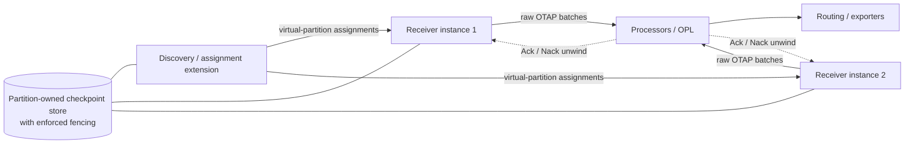
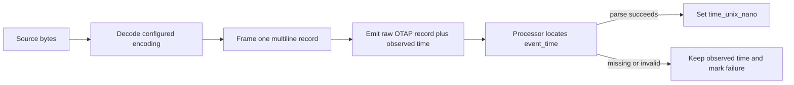
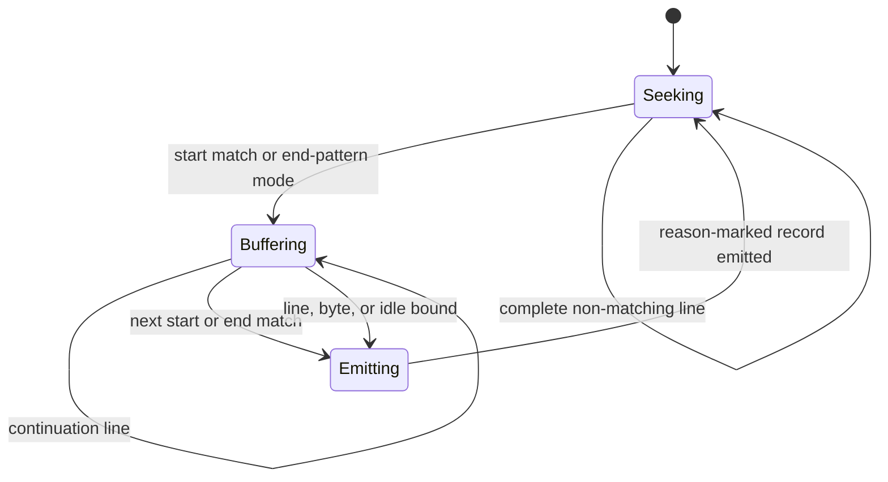
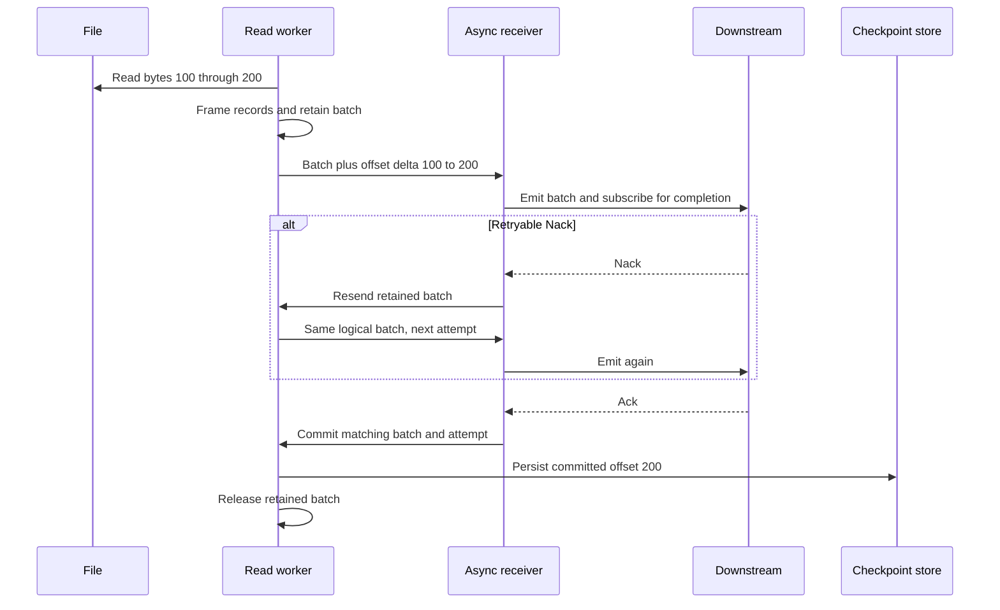
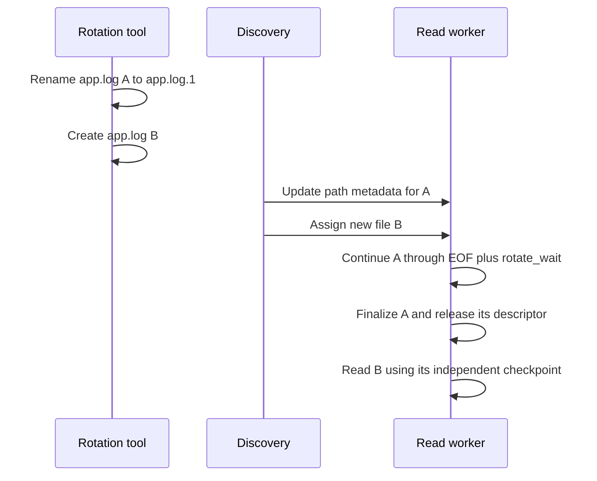
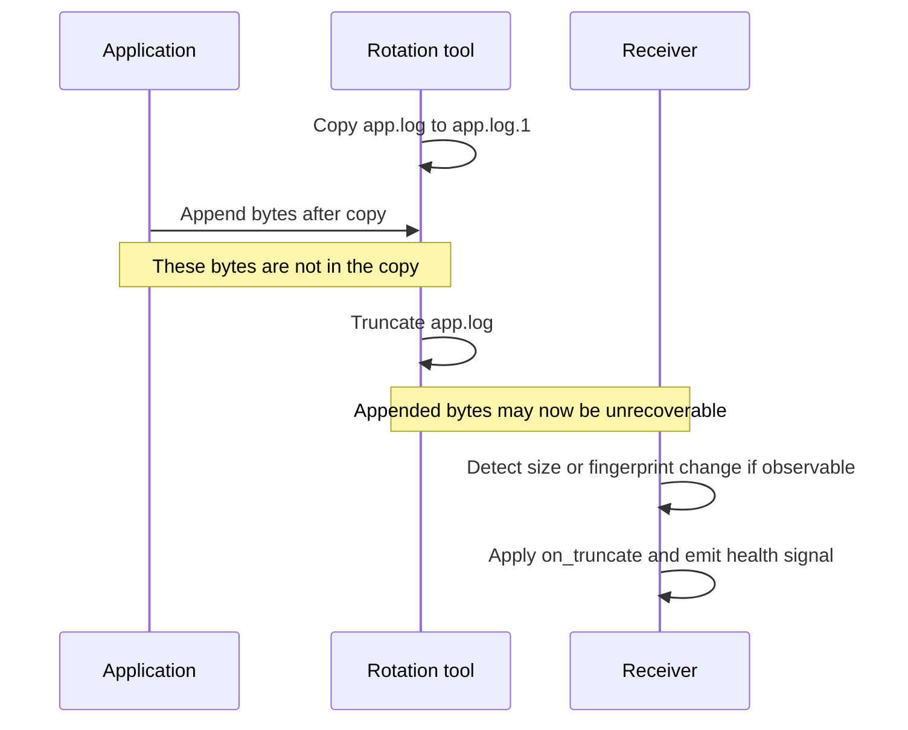

<!-- markdownlint-disable MD013 -->

# Filelog Receiver Design

**Status:** Draft (revised after design review)
**Tracking issue:** [#2844](https://github.com/open-telemetry/otel-arrow/issues/2844)
**Related issues:** [#2321](https://github.com/open-telemetry/otel-arrow/issues/2321) (seed request), [#2858](https://github.com/open-telemetry/otel-arrow/issues/2858) (journald receiver, shared source-progress contract)
**Owner:** @lalitb

## Summary

An OTAP-native `filelog` receiver for local file-based log ingestion. The receiver owns
**file bytes, file identity, byte offsets, framing, rotation handling, backpressure, and
Ack-gated checkpoints**. It emits raw, unparsed OTAP log records with file metadata
attached. All semantic interpretation -- parsing, extraction, enrichment, categorization,
filtering, routing -- lives outside the receiver in processors (OPL transform processors
in particular).

This document distinguishes four kinds of statements throughout:

- **[Confirmed]** -- existing repository behavior this design relies on, with source references.
- **[Decision]** -- a design decision made by this document.
- **[Open]** -- an unresolved question that must be settled before or during implementation.
- **[Deferred]** -- explicitly out of scope for the initial implementation.

## Relationship to epic #2844

The discovery/assignment extension, fixed virtual partitions, and multi-instance
assignment described in [#2844](https://github.com/open-telemetry/otel-arrow/issues/2844)
remain the **target architecture**. They solve the long-term ownership and handoff
problem when receiver instances are added, removed, restarted, or replaced. This
document does not replace that architecture. **[Decision]**

The initial implementation is an incremental step toward that target: one receiver
instance consumes assignments from an in-process discovery source because the engine
does not yet provide the required engine- or group-scoped coordinator, stable placement,
ready-without-ownership lifecycle, or enforced fencing mechanism. The boundary between
assignment and reading is preserved so those capabilities can move to an external
coordinator without redesigning file reading, framing, or Ack-gated progress.
**[Decision]**

Consequently, Phase 1 does **not** complete the epic's multi-instance acceptance
criteria. It validates the source-progress path and checkpoint identity across restart,
including restart under a changed ambient CPU allocation. It does not provide live CPU
scale up/down through virtual-partition reassignment; that remains Phase 3. Agreement
that this is an acceptable first implementation step is an open epic-level decision.
**[Open]**

## Relationship to the journald receiver (#2858)

The journald receiver (`docs/journald-receiver.md`) is the in-repo prior art for an
Ack-gated, checkpointing source. Both receivers share a **source-neutral progress
contract**; the source mechanics differ:

| Concern | journald | filelog |
| --- | --- | --- |
| Source iteration | `sd-journal` FFI | file discovery + `read(2)` |
| Progress token | opaque journald cursor | file identity + byte offset |
| Framing | provided by journald | receiver-owned (newline and bounded multiline) |
| Rotation | n/a (journald owns retention) | move/create + copytruncate |
| Checkpoint unit | one cursor per source | identity-keyed offset table persisted as snapshot + WAL |

Shared (source-neutral) contract, per the discussion on
[#2858](https://github.com/open-telemetry/otel-arrow/issues/2858#issuecomment-4414785174):
bounded backpressure, Ack/Nack-gated commits, in-flight batch retention and resend,
checkpoint envelope conventions, lifecycle/drain behavior, and assignment hooks. The
journald design doc explicitly defers consolidating shared plumbing "until the filelog
design proves the shared shape"; this document defines that shape but does **not**
require refactoring journald as a precondition. **[Decision]**

## Confirmed engine behavior this design relies on

- **Receiver contract.** Receivers implement `local::Receiver<PData>` or
  `shared::Receiver<PData>` with a single `start(ctrl_chan, effect_handler)` entry point;
  control messages must be processed in priority over external data
  (`crates/engine/src/local/receiver.rs:62-96`, priority requirement `:79-80`).
- **Ack/Nack subscription.** A producer subscribes per-message via
  `ProducerEffectHandlerExtension::subscribe_to(Interests::ACKS | Interests::NACKS, ctx, &mut pdata)`;
  outcomes return as `NodeControlMsg::Ack(AckMsg)` / `Nack(NackMsg)` on the control
  channel, correlated through opaque `CallData` (`crates/engine/src/lib.rs:292-455`,
  `crates/engine/src/control.rs:111-255`). journald tags `CallData` with a `batch_id`
  (`journald_receiver/mod.rs:885-891`); filelog uses the same correlation pattern.
  `NackMsg` carries a `permanent` flag and a cause (`RouteFull`, `RouteClosed`,
  `NodeShutdown`, `Unspecified`) (`control.rs:167-198`).
- **`Interests` is a full `u8`** -- no free bits remain; this design must not require a
  new interest flag (`crates/engine/src/lib.rs:325`). `Interests::RETURN_DATA` already
  exists (bit 2, `lib.rs:308`) and would return the Nacked payload to the producer;
  this design does not use it (see Ack model) but requires no new flag either way.
- **Drain orchestration.** On shutdown latch the engine sends `DrainIngress` to every
  receiver while downstream nodes stay live; it waits for each receiver's
  `RuntimeControlMsg::ReceiverDrained` and only then sends `Shutdown` to non-receiver
  nodes (`crates/engine/src/pipeline_ctrl.rs:484-558`). A receiver that drains cleanly
  and exits **never receives `Shutdown`**; `Shutdown` reaches receivers only on the
  forced-deadline path (`pipeline_ctrl.rs:385-419`). Downstream-alive-during-drain is
  what allows a receiver to flush and await Ack of its final batch.
- **Live reconfiguration / resize overlaps generations.** The controller starts the new
  deployment generation and waits for it to become ready **before** draining the old one
  (`crates/controller/src/live_control/execution.rs:390-448`). Two instances of the
  receiver can therefore be alive simultaneously during every rollout, and
  `deployment_generation` is monotonic only within one controller lifetime
  (`crates/engine/src/context.rs:203-205`). No receiver consumes
  `NodeControlMsg::Config`; reconfiguration is teardown + rebuild.
- **Per-core instancing, no stable slot id.** The engine runs one receiver instance per
  core of a pipeline; `PipelineContext` exposes `core_id()`/`num_cores()`/
  `deployment_generation()` but no restart-stable placement slot
  (`crates/engine/src/context.rs`). journald's factory rejects `num_cores() > 1`
  (`journald_receiver/mod.rs:161-167`). Receiver readiness is not an engine primitive
  (readiness signalling exists only for extensions,
  `crates/engine/src/extension/readiness.rs`).
- **Extensions are pipeline-scoped (per-core) in Phase 1.** Engine-level and
  group-level extension scopes are documented future work; no cross-instance singleton
  exists today (`docs/extension-system-architecture.md`).
- **OTAP logs encoding.** `LogsRecordBatchBuilder` + `StrKeysAttributesRecordBatchBuilder<u16>`
  (`crates/pdata/src/encode/record/logs.rs`, `attributes.rs`); record ids are `u16`, so
  one OTAP batch holds at most 65,535 log records
  (`journald_receiver/arrow_records_encoder.rs:133`).
- **Batch retention is cheap.** `OtapArrowRecords` clones are shallow: Arrow columns are
  `Arc`-backed, so retaining an emitted batch bumps refcounts without copying data
  (`crates/pdata/src/otap.rs`, `raw_batch_store.rs`). journald retains its in-flight
  batch and resends it on pre-checkpoint Nack (`journald_receiver/mod.rs:557-566`,
  `:659-669`).
- **Checkpoint envelope precedents.** journald: JSON envelope, blake3 checksum,
  write-tmp -> fsync -> rename -> fsync-dir (`journald_receiver/checkpoint.rs:103-160`,
  2 fsyncs per commit). quiver: binary `[magic][version][header_size][body][crc32]`
  envelopes with the same atomic write discipline (`crates/quiver/ARCHITECTURE.md`).
- **Blocking I/O isolation.** journald isolates all blocking calls on a dedicated worker
  thread with bounded channels in both directions; the async side never blocks, uses
  biased selection to prioritize control messages, and races blocked sends against
  incoming control messages (`journald_receiver/mod.rs:751-753`, `:906-974`).
- **No existing filelog, discovery, or partition-assignment code.** Verified by
  repository search; the assignment extension in #2844 is a planned capability, not an
  existing one. journald's `SourceLease` is a process-local config-mistake guard, not a
  cross-process ownership mechanism (`journald_receiver/mod.rs:1112-1143`).

## Core Decisions

| # | Decision | Choice |
| --- | --- | --- |
| D1 | Instance model (v1) | Single receiver instance (`num_cores == 1` enforced at factory, like journald); scale-out via topic fanout; multi-instance assignment is Phase 3 |
| D2 | Discovery placement (v1) | Discovery runs on its **own thread** inside the receiver, behind an `AssignmentSource` boundary; it feeds the read worker over a bounded event channel |
| D3 | Ownership unit | Checkpoint records are keyed by a persisted opaque `file_id`; virtual partitions are a Phase-3 assignment concept and do not appear in v1 storage or config |
| D4 | File identity | Stable logical identity = persisted opaque `file_id`; runtime locator = POSIX `(st_dev, st_ino)` or Windows `(volume_serial, FILE_ID_INFO)`; raw fingerprint bytes are mutable matching evidence, never a unique key |
| D5 | Checkpoint keys | File-centric: never include core id, CPU count, instance id, deployment generation, or any future partition owner |
| D6 | Checkpoint store | One snapshot plus an append-only progress log per stable checkpoint namespace; Ack updates append only changed records, and periodic compaction atomically replaces the snapshot |
| D7 | Ack model (v1) | `max_in_flight_batches = 1`; the worker retains the in-flight batch and resends retryable Nacks with bounded backoff; no reader advances past the unacked frontier |
| D8 | Thread layout | Three components: discovery thread (blocking), read worker thread (blocking, owns FDs/framing/encoding/checkpoint I/O), async engine task (control, Ack/Nack, emission) |
| D9 | Framing | Phase 1 includes newline plus configurable start- or end-pattern multiline framing, bounded partial-record flush, decode-before-framing encodings, and split/truncate oversize policy |
| D10 | Emitted schema | Raw framed record as body; file metadata as attributes (`log.file.path`, `log.file.name`, optional source offset); no semantic parsing |
| D11 | Batch bounds | `batch.max_records` (<= 65,535, default 1,024), `batch.max_flush_period`, and `batch.max_bytes` -- a byte budget from day one |
| D12 | Rotation | Move/create: retain FD, read to EOF + `rotate_wait`, finalize. Copytruncate: **best-effort** detection, default policy `read_new`, per-file epoch guards stale in-flight deltas |
| D13 | Backpressure & control priority | Bounded channels end to end; reader stops when the handoff is full; the async half biased-selects control messages over data and races blocked sends against incoming control messages |
| D14 | Discovery mechanism | Periodic glob reconciliation (`poll_interval`) with platform-locator dedup in v1; filesystem notifications plus reconciliation are the target so new files are tailed promptly without relying on notifications for correctness |
| D15 | Ownership across generations | A checkpoint-namespace lock serializes generations sharing checkpoint state; a process-wide runtime-identity lease prevents two local receiver instances from reading the same open file |
| D16 | Failure policy | Fail-closed on checkpoint corruption; per-file read errors quarantine the file; recovery identity mismatch follows an explicit policy that defaults to replay from beginning (duplicates over loss) |

## Architecture

### Initial architecture

```mermaid
flowchart LR
  subgraph Receiver instance (one core, v1)
    subgraph Discovery thread (blocking)
      D[Glob reconcile, stat,
fingerprint new files]
    end
    D -->|bounded AssignmentEvent channel| W
    subgraph Read worker thread (blocking)
      W[File readers: framing,
offset table, Arrow build] --> CK[(Snapshot + progress log
+ namespace lock)]
    end
    W -->|bounded handoff: batch + delta set| A[Async engine task]
    A -->|Commit / Resend / Drain commands| W
  end
  A -->|OTAP batch + Ack/Nack subscription| P[OPL / parser / enrichment processors]
  P --> R[Routing] --> E[Exporters]
  P -.->|Ack / Nack unwind| A
```

### Target architecture from #2844



The target replaces only assignment ownership and checkpoint coordination. Receiver
behavior below the assignment boundary -- file reading, framing, batching, Ack/Nack
correlation, backpressure, and drain -- remains the same. **[Decision]**

Data flow per batch:

1. The discovery thread reconciles the include/exclude globs on `poll_interval`,
   dedupes candidates by platform runtime locator, computes fingerprints for new files, and
   emits assignment events. It never touches the read path.
2. The read worker reads bytes from assigned files (bounded per turn), frames newline
   records, appends to the Arrow builder, and tracks per-file offset deltas
   (`(file_id, file_epoch, prev_offset, new_offset)`) for the open batch.
3. On flush (records, bytes, or time bound), the worker hands the batch plus its delta
   set to the async task and **retains a shallow clone** of the batch.
4. The async task subscribes the batch to `ACKS | NACKS` with a `batch_id` in
   `CallData` and emits it downstream.
5. On Ack, the async task sends `Commit { batch_id, attempt }`; the worker applies the delta set
   to the in-memory offset table (skipping stale-epoch deltas), drops the retained
   clone, and appends a progress transaction.
6. On a retryable Nack, the async task schedules bounded backoff and sends
   `Resend { batch_id, next_attempt }` to the worker. The worker returns the retained
   batch over the normal handoff; the async task installs a fresh subscription carrying
   the same logical `batch_id` and the new attempt number before sending it again. On
   permanent Nack or exhausted retries, the configured `on_nack` policy applies.

## Instance model and discovery

### v1: single instance, internal discovery **[Decision D1, D2, D14]**

The factory rejects `pipeline.num_cores() > 1`, exactly as journald does. One receiver
instance owns all matched files. Parallel semantic processing is achieved downstream via
the topic exporter/receiver fanout (`docs/topic-architecture.md`).

Rationale: #2844's discovery/assignment extension requires an engine- or group-scoped
coordinator, and the extension system has no such scope today **[Confirmed]**. v1
therefore isolates discovery behind a small internal boundary:

```text
AssignmentSource (v1: discovery thread in-process)
  -> stream of AssignmentEvent
       Assign { runtime_locator + path + fingerprint_evidence }
       Update { path changes, metadata refresh }
       Revoke { file or all, deadline }
```

`AssignmentSource` is a required architectural boundary, not a temporary helper. The
read worker must depend only on its ordered event contract; it must not inspect glob
configuration, assume assignments are produced locally, or derive ownership from core
id, CPU count, deployment generation, or receiver instance. The future extension must
be able to replace the in-process producer without changing file reading, framing,
batching, or Ack-gated progress semantics. **[Decision]**

The v1 implementation is a dedicated **discovery thread** running glob reconciliation
(include minus exclude, `ignore_older_than` filter) on `poll_interval`. Running
discovery on its own thread keeps three stall classes off the read path: slow directory
scans (large or network-mounted directories), fingerprint computation bursts (startup,
rotation storms), and `stat` storms. Discovery output invariants:

- **One event stream, ordered.** Assignment events are delivered over a single bounded
  channel, so a `Revoke` cannot be overtaken by a re-`Assign` of the same file.
- **Runtime-locator dedup.** Candidates are deduped by POSIX `(st_dev, st_ino)` or
  Windows `(volume_serial, FILE_ID_INFO)` before emission. Hardlinks, a file matched by
  two globs, or a file transiently visible at two paths produce **one** assignment with
  path as metadata. One reader per live runtime locator, always.
- A new runtime locator always produces a distinct assignment while the previous
  locator is live, even if their fingerprints are identical. Equal prefixes are common
  for unrelated logs and are not proof of identity. Same-filesystem rename continuity
  comes from the unchanged locator. Cross-device or cross-volume copy/unlink is treated as a new file in
  v1; duplicate ingestion is safer than merging two independent streams. **[Decision]**

### Growing-file tailing

When a new file matching an include pattern is created or moved into a watched
directory, the receiver discovers and assigns it without waiting for the file to close,
stop growing, or reach a size threshold. After applying `start_at` and durably
registering the initial checkpoint anchor, the worker reads currently available bytes
in bounded turns and emits complete records incrementally as new bytes are appended.
It never loads or waits for the complete file. **[Decision]**

The target discovery implementation combines filesystem notifications with periodic
glob reconciliation. Notifications provide prompt discovery of create, move, and
relevant modification events; reconciliation remains the source of correctness after
missed or coalesced events, watcher overflow, directory replacement, startup races, or
platform-specific notification gaps. A notification is only a hint to reconcile and
`stat`; it is not file identity or proof that a write is complete. **[Decision]**

Rapid file growth remains bounded by `max_read_bytes_per_turn`, batch byte/record bounds,
and downstream backpressure. When downstream is blocked, the receiver stops reading and
leaves unread bytes in the file rather than buffering the growing file in memory. The
observable discovery-delay bound is the notification latency when notifications work,
and normally one configured `poll_interval` plus scan and assignment latency when
reconciliation is the fallback. Discovery scan duration and assignment-channel delay
are measured so operators can detect when that expectation is not met.

Target discovery supports recursive include globs with exclude-wins precedence and an
explicit symlink policy. `follow_symlinks` defaults to false; when enabled, directory
cycles are detected by runtime identity and traversal remains bounded by configured
depth and tracked-file limits. Excludes are evaluated against both the matched path and
resolved target so a symlink cannot bypass a sensitive-path exclusion. Files already
assigned when a dynamic exclude begins to match are revoked at the next record boundary.
`ignore_older_than` uses modification time at discovery; it does not evict an already
tailed file merely because the writer becomes quiet. `recursive` controls whether the
scanner may descend below the directory named by an include; `**` controls which paths
match within that permitted traversal. A recursive glob does not override
`recursive: false`. **[Decision]**

The receiver's resolved checkpoint namespace under `${engine.state_dir}` is always
excluded from discovery. Configuration is rejected when an include resolves directly
to that namespace, and a warning is emitted when include patterns appear to cover the
engine's own log output. The state exclusion is mandatory even when an exclude pattern
would otherwise be required, preventing checkpoint WAL or snapshot files from feeding
back into the receiver. **[Decision]**

The design distinguishes matched files, durable tracked identities, active readers, and
open file descriptors. `max_tracked_files` bounds the first two durable populations;
`max_open_files` bounds FDs. When the active/open limit is reached, fair batching and
least-recently-served FD rotation prevent starvation. When the durable tracked limit is
reached, new candidates wait and a health event/counter reports the condition; they are
never silently ignored. Waiting candidates are admitted oldest-discovered first. A
candidate's wait age and the queue depth are observable without using paths as metric
dimensions. With `checkpoint.retention: 0`, durable records are never automatically
removed, so a full tracked table can remain saturated until the limit is raised or an
operator explicitly removes state. This interaction is validated with a configuration
warning and documented as an availability tradeoff. **[Decision]**

When engine-scope extensions exist, the same event stream is delivered by an external
discovery extension and the reader/checkpoint machinery below the boundary is
unchanged. The event protocol above is deliberately minimal; richer handoff mechanics
are **not** specified now (see Multi-instance requirements). **[Decision]**

### Ownership across generations **[Decision D15]**

Live reconfiguration and resize overlap deployment generations: the new instance starts
and must become ready **before** the old one drains **[Confirmed]**. Both generations
resolve the same checkpoint path (keys exclude generation by design, D5). Without an
ownership mechanism, the old generation can rewrite checkpoint state **after** the
new generation has advanced it -- a lost-update race that exists in v1, not just in the
multi-instance future.

v1 uses two mechanisms with deliberately different scopes:

1. An exclusive advisory lock (`flock`) on the stable checkpoint namespace prevents
   overlapping generations of the same logical receiver from concurrently loading or
   replacing its checkpoint state.
2. A process-wide `RuntimeFileLease` registry keyed by the platform runtime locator prevents two
   filelog receiver instances in the same engine process from reading the same open
   file, even when their include patterns or checkpoint namespaces overlap. Assignment
   waits for the current lease holder to drain or rejects the duplicate according to a
   bounded ownership timeout.

- The receiver starts, reports itself alive to the engine, and enters a
  **waiting-for-ownership** state; it acquires the lock with bounded retries. Reads and
  checkpoint access begin only after the lock is held. This ordering is required
  because pipeline readiness must not deadlock against the old generation still
  holding the lock during its drain.
- The lock is released at drain completion (process exit releases it in all failure
  modes -- this is why an OS lock is preferred over a persisted lease, which would need
  staleness heuristics).
- Runtime file leases are released when their FDs close and on receiver termination.
  They are process-local guards, not durable identity or checkpoint records.
- Advisory locks are unreliable on some network filesystems; a `state_dir` on NFS is
  documented as unsupported for concurrent-rollout safety. **[Decision]**

This prevents duplicate readers during normal live reconfiguration inside one engine,
including receiver-node renames and overlapping patterns. It does not coordinate two
independent engine processes that use different state directories; that deployment is
outside the v1 ownership guarantee and must be documented. "Ready" here remains a
lifecycle description, not an engine primitive -- receiver readiness signalling does
not exist in the engine today **[Confirmed]**.

### Multi-instance requirements (Phase 3) **[Decision D3, deliberately minimal]**

When a discovery/assignment extension and engine-scope coordination exist, ownership
moves from "one instance owns everything" to assigned subsets. This document fixes only
the **requirements** that Phase 3 must satisfy, because the checkpoint format and
identity scheme must not preclude them:

1. **Single-writer-per-identity:** at most one instance reads a given logical `file_id`
   and
   writes its checkpoint state at any time.
2. **Enforced fencing on checkpoint writes:** a revoked or stale instance must be
   unable to clobber state written by the new owner. Recording an epoch inside a file is
   insufficient because a stale writer can overwrite that file. The Phase-3 storage or
   coordinator must compare and reject stale epochs atomically (for example, under a
   coordinator-owned lease or compare-and-swap store). Epoch allocation, verification,
   and transport are **[Open]**.
3. **Ready-before-ownership:** an instance can run without owning anything and acquire
   ownership later (already the v1 startup shape under D15).
4. **Stable partition input:** partition mapping uses the persisted opaque `file_id`,
   never a fingerprint. It is therefore stable for short, empty, and growing files.
   The mapping function and partition count remain Phase-3 decisions. **[Open]**

Checkpoint records carry stable `file_id`s and no current owner, which makes a future
split deterministic. Moving from the v1 instance-local snapshot/log to partition-owned
storage still requires a coordinated format and ownership migration; this document does
not claim otherwise. Virtual partitions, partition counts, and revoke/assign mechanics
do not appear in v1 config because freezing them now would encode an unproven protocol
into a durable format. **[Decision]**

That migration must be explicit and versioned. It must preserve each committed
`file_id` offset without re-ingestion or skipping, reject mixed old/new ownership during
cutover, and either roll back safely or fail before any new owner reads. Phase 3 is not
complete until this migration path is specified and tested. **[Decision]**

## File identity **[Decision D4]**

Three values have separate roles:

1. **Logical identity: `file_id`.** An opaque 128-bit value generated from OS randomness
   when a file is first registered, checked against the loaded table, and persisted
   before content is emitted. It is the checkpoint record key and the future partition
   input. It never changes when a fingerprint grows, a path changes, or a runtime locator is
   replaced.
2. **Runtime locator:** POSIX `(st_dev, st_ino)` or Windows
   `(volume_serial, FILE_ID_INFO)`. It keys open readers, discovery dedup, and
   process-wide runtime leases. It survives ordinary same-filesystem or same-volume
   rename but is not permanent identity because locators can eventually be reused.
3. **Matching evidence: raw fingerprint bytes.** The first `fingerprint_bytes` after
   `ignored_header_bytes`, stored with their current length. A short file has a mutable
   provisional fingerprint that grows *inside the same `file_id` record*. Fingerprints
   help reconnect discovered files to checkpoint records; they are neither unique keys
   nor proof that two live files are the same.

Identity invariants:

- **INV-ID1:** every concurrently tracked runtime locator has exactly one `file_id`, and
  every `file_id` has at most one active runtime locator. Two live files with identical
  fingerprints remain distinct and receive different `file_id`s.
- **INV-ID2:** checkpoint records are uniquely keyed by `file_id`. Fingerprint bytes,
  current fingerprint length, last-known platform runtime locator, and last path are
  mutable fields used for recovery matching.
- **INV-ID3:** on restart or reopen, an exact platform runtime locator plus successful
  fingerprint-prefix validation is the strongest match. A unique full-window
  fingerprint match may reconnect a record only when its previous runtime locator is no
  longer live and no other candidate or record shares that fingerprint. Otherwise the
  match is ambiguous and the candidate receives a new `file_id`. Recovery mismatch is
  not first discovery: it follows `identity.on_recovery_mismatch`, whose default is
  `beginning`, so the normal bias is duplicates over skipped data.
- **INV-ID4:** `committed_offset <= current_size` is required before resuming. A failed
  fingerprint validation, offset beyond size, or ambiguous match never inherits an old
  offset. It creates a new logical identity, increments `filelog.identity.reset`, and
  applies `on_recovery_mismatch: beginning | skip_to_end | fail`. `skip_to_end` is an
  explicit intentional-loss policy; `fail` quarantines the file pending operator
  action.
- **INV-ID5:** registration is durable before reading begins. For `start_at: beginning`,
  the initial committed offset is `0`. For `start_at: end`, the receiver opens the file,
  obtains the starting EOF from that FD, and persists that offset as an initial anchor.
  This offset represents intentionally skipped bytes and does not require downstream
  Ack. Bytes appended after the anchor are then eligible for normal Ack-gated reading.

Fingerprint growth updates matching evidence under the same `file_id`; it never rekeys
a checkpoint record. Cross-device copy/unlink is not inferred from fingerprint equality
in v1 because a copied file and an unrelated file with the same prefix are
indistinguishable without stronger source-specific evidence.

No local-filesystem locator is a permanent identity across deletion and identifier
reuse. A reused locator whose replacement reproduces the same fingerprint window can be
mistaken for the previous file after restart. Increasing the fingerprint window and
skipping constant headers reduces that risk but cannot eliminate it; the README must
state this limitation. Network filesystems with weak inode semantics are unsupported in
v1 unless a later fallback identity policy is added.

Changing identity configuration after checkpoints exist is a state migration, not an
ordinary config reload. Changing `fingerprint_bytes`, `ignored_header_bytes`, or the
fingerprint algorithm/profile is rejected unless an explicit migration or state-reset
policy acknowledges possible re-identification, duplicate ingestion, or skipped data.
A versioned
`LegacyCheckpointImporter` boundary may translate a prior path- or native-identity
store into candidate `(path, locator, offset)` records, but each imported offset is used
only after identity validation. An importer must report matched, ambiguous, reset, and
rejected records and must be idempotent across restart. Filebeat 9.x path/native-to-
fingerprint migration is prior art for the algorithm, not proof that an unrelated
product's stored state contains enough evidence to migrate safely. **[Decision]**

Phase 1 supports Linux, macOS, and Windows durable identity. Linux and macOS use the
runtime locator described above. Windows uses
`GetFileInformationByHandleEx` + 128-bit `FILE_ID_INFO`, which is required for ReFS
correctness. Equivalent restart and rotation tests are Phase-1 acceptance criteria on
all three platforms. Reading a Windows file whose writer denies shared-read access
remains a separate P1 source contract and is not implied by Windows identity support.
**[Decision]**

## Execution model **[Decision D8]**

Three components, blocking work isolated from the engine runtime **[Confirmed
pattern]**:

- **Discovery thread** (blocking): glob reconcile, `stat`, fingerprint computation for
  new files. Emits `AssignmentEvent`s over a bounded channel. Slow scans delay
  discovery of *new* files but never stall tailing of already-assigned files.
- **Read worker thread** (blocking): consumes assignment events; owns FDs, framing,
  Arrow batch building, the in-memory offset table, the retained in-flight batch, and
  all checkpoint I/O including fsync. Checkpoint writes stay on this thread in v1
  because the worker is idle during the in-flight window anyway (see Ack model): commit
  I/O fills dead time rather than competing with reads.
- **Async engine task**: owns the control channel, Ack/Nack correlation, emission, and
  drain deadlines. Two hard requirements from the engine contract **[Confirmed]**:
  - control messages are polled with **biased priority** over the worker handoff
    channel (journald `mod.rs:751-753`);
  - a blocked downstream send is raced against **incoming control messages** (not
    merely a pre-armed deadline), so `DrainIngress`/`Shutdown` arriving during
    backpressure interrupts the send (journald `mod.rs:906-974`). A drain that can
    only fire from an already-known deadline would be unreachable while parked on a
    full channel.

Channels: discovery->worker (bounded, assignment events), worker->async (bounded,
capacity 1, batches + delta sets), async->worker (bounded, commands: Commit, Resend,
Drain, Shutdown). The worker never blocks indefinitely on a full channel: it polls the
command channel with a short timeout while the handoff is full (journald's discipline).

Reader scheduling within the worker:

- Ready files are served round-robin; each turn reads at most `max_read_bytes_per_turn`
  from one file. Intra-file ordering is guaranteed (single reader per file, offsets
  monotonic); cross-file ordering is not guaranteed, matching all prior art.
- At most `max_open_files` FDs are held. When over the cap, the **least-recently-served**
  reader is closed (offset retained; reopen re-validates identity per INV-ID3) so FD
  ownership rotates and a hot subset cannot permanently starve cold files.
- **No read-ahead past the unacked frontier (v1):** while a batch is in flight, no
  reader advances its file position beyond the offsets captured in that batch's delta
  set. The worker is idle during the in-flight window (journald's proven invariant).
  This deliberately caps throughput at one batch per downstream round trip; lifting it
  is the Phase-2 pipelining/multi-in-flight work, which must then design read-ahead
  offset tracking. Independently, one read worker is the Phase-1 aggregate file-I/O and
  checkpoint-I/O throughput ceiling even when downstream latency is negligible; Phase-1
  performance claims and benchmarks must name both ceilings. **[Decision]**

### Threading and NUMA placement **[Decision]**

Phase 1 follows the singleton-source pattern used by journald and host metrics:

```text
one-core source pipeline
  async receiver task          control, Ack/Nack, emission, drain deadlines
  discovery OS thread          scans, stat, fingerprint evidence
  read/checkpoint OS thread    read, decode, frame, Arrow build, WAL and fsync

multicore downstream pipeline
  topic receiver -> processors -> exporters
```

The factory rejects `pipeline.num_cores() > 1`; there is exactly one discovery thread
and one read/checkpoint thread per Phase-1 receiver, never one thread per file, directory,
or mount. Downstream topic fanout is the Phase-1 parallelism boundary. Phase 3 may add
multiple assigned receiver instances only after virtual-partition ownership, fencing,
and checkpoint migration are defined.

Potentially blocking or unbounded-latency operations never run on the df-engine
current-thread async runtime. This includes directory traversal, `stat`, fingerprint
reads, file open/read/close, character decoding and framing, checkpoint WAL writes,
`fsync`, snapshot replacement, and synchronous compaction. Like host metrics' bounded
`statvfs` worker, filelog uses fixed dedicated threads and bounded handoff channels
rather than submitting repeated long-lived work to Tokio's shared blocking pool. This
caps a stuck filesystem's thread and queue impact.

The async task never calls a blocking channel send or synchronously joins a worker.
Worker shutdown is requested over the bounded command channel. Drain continues polling
control and downstream completion; any final thread join uses a non-blocking lifecycle
path and is bounded by the engine drain deadline. A blocked or failed worker produces a
terminal receiver event rather than parking the pipeline runtime indefinitely.

Phase 1 does **not** pin the discovery or read worker, does not assume they share the
pipeline core's NUMA node, and makes no NUMA-local allocation or throughput claim. The
operating system chooses placement. For ordinary file tailing, filesystem/page-cache,
checkpoint, and downstream-Ack behavior must be measured before introducing affinity.

A future NUMA-aware design may expose, without changing file identity or checkpoints:

- the backing device's NUMA node when the platform can resolve it;
- preferred worker and pipeline placement as scheduler metadata;
- virtual-partition assignment constrained by NUMA or storage locality; and
- per-NUMA throughput, remote-memory, and migration measurements.

Unknown topology remains `unknown`, never silently NUMA node zero. CPU count, core ID,
NUMA node, thread ID, and deployment generation remain absent from checkpoint keys, so
placement changes cannot change source identity or resume position.

## Framing **[Decision D9]**

Phase 1 supports newline framing and the bounded multiline contract below. Newline is
the default when no multiline boundary is configured. Framing operates on decoded
characters for configured text encodings; raw mode deliberately operates on bytes.
Invariants and constraints:

- **INV-FR1 (record-boundary commits):** without partial flush, for a non-terminal file
  identity, `committed_offset` always points immediately past a `\n`. When partial flush
  is enabled, a reason-marked partial boundary may also be committed; the checkpoint
  persists the boundary and sufficient framing state so restart cannot merge, split,
  or duplicate the record differently. A reader must be able to resume framing at
  `committed_offset`, and a re-read from it deterministically reproduces the same
  records (including deterministic `max_line_bytes` truncation).
- `max_line_bytes` (default 1 MiB): a longer line is truncated at the limit, emitted
  with attribute `log.record.truncated = true`, and the remainder up to the next
  newline is discarded with a counter. The emitted record's `new_offset` is immediately
  after that newline, not at the byte limit; only that delimiter boundary may be
  committed. Re-reads therefore reproduce the same truncated record. Unbounded line
  buffering is not permitted.
- A trailing partial line (no `\n` yet) is held in the reader's buffer (capped at
  `max_line_bytes`). The configured `force_flush_period` may emit it after idle time,
  with a reason marker and a committed partial boundary as defined by INV-FR1. Without
  partial flush, EOF plus `rotate_wait` remains only an inactivity heuristic: a process
  may retain the renamed FD and write again later, so the receiver cannot prove the
  line is terminal. On rotation finalization any unflushed partial bytes are counted as
  `filelog.partial_bytes_dropped`; the checkpoint remains at the previous complete
  boundary. At drain, recoverable buffered bytes are reported as pending, not dropped,
  so restart can resume if the source still exists. **[Decision]**
- Idle flush is the only sanctioned way to commit a mid-line offset on a non-terminal
  file. It trades latency for a documented slow-writer split risk and is included in
  Phase 1 because the P0 requirements require the final record to be released without
  waiting indefinitely. **[Decision]**
- Phase 1 encoding supports UTF-8, ASCII, UTF-16LE, UTF-16BE, and raw mode using the
  decode-before-framing contract below. Raw byte preservation is not a substitute for
  selecting UTF-16. **[Decision]**

Multiline aggregation lives in the receiver's framing layer because it changes record
boundaries and therefore offset accounting. It is part of the Phase-1 P0 release.
**[Decision]**

### Phase-1 framing and encoding contract

The following are target filelog capabilities, independent of any one destination.
They have established precedent in the OpenTelemetry Collector filelog receiver and
Fluent Bit tail/multiline implementations. Their inclusion does not imply Stanza
operator-chain compatibility. **[Decision]**

- **Character encoding before framing.** Configuration supports `utf-8` (default),
  `ascii`, `utf-16le`, `utf-16be`, and `raw`. A matching UTF-8 or UTF-16 byte-order mark
  is detected and removed from the first decoded record. A byte-order mark that
  conflicts with an explicitly configured UTF-16 endianness is a decode error; it does
  not silently override configuration. `raw` performs no character validation, does
  not strip a byte-order mark, frames physical lines on byte `0x0a`, and emits bytes;
  it is not a substitute for selecting UTF-16. Decoding precedes newline and regex
  framing because character boundaries, decoded record size, and UTF-16 newline
  representation depend on the selected encoding. Checkpoint offsets always remain
  offsets in source bytes. After detectable truncation, decoding restarts at source
  offset zero so a new byte-order mark is handled as a new stream.
- **Decode errors preserve evidence.** Invalid source bytes never terminate a record
  silently. `on_decode_error: preserve_raw | replace | fail` is explicit; the generic
  default is `preserve_raw`, which emits the complete framed source slice as a bytes
  body and marks the record. `replace` is lossy and counted; `fail` quarantines the
  file. The receiver contract ends at an OTAP bytes body. JSON escaping, base64, column
  mapping, and destination searchability are exporter/product contracts and must be
  validated end to end before claiming byte-for-byte recovery from a text destination.
- **Multiline boundaries.** Configuration may set exactly one of
  `line_start_pattern` or `line_end_pattern`; setting both is rejected at build time.
  The regex contract is a versioned, RE2-compatible syntax profile shared by control
  plane validation and the agent. Unsupported constructs are rejected before rollout;
  the agent also compiles defensively and fails the affected data source rather than
  silently falling back. Joined physical lines retain their newline separators. The
  emitted record's checkpoint delta ends after the last source byte included in that
  record.
- **Bounded multiline state.** A multiline record is bounded by decoded output bytes,
  physical line count, and `force_flush_period`, measured as idle time since the most
  recent physical line. The first reached bound determines the result. A line-count or
  timeout flush emits the complete buffer, marks the reason, and begins a new candidate
  record at the next physical line; no source bytes are discarded. A timeout is an
  explicit heuristic and can split a record written slowly. Byte overflow follows the
  oversize policy below. Rotation and drain use the same reason-marked flush contract
  when partial flush is enabled; otherwise they retain the documented v1 behavior.
- **Oversize policy.** `split` preserves all input by emitting bounded fragments;
  `truncate` emits the bounded prefix and discards through the logical record boundary.
  Both policies emit telemetry, and emitted records identify truncation or
  fragmentation. Split fragments carry a stable record identifier, zero-based fragment
  index, and final-fragment marker so processors or destinations can reconstruct them.
  For decoded text, the byte limit is measured on the UTF-8 body emitted into OTAP; for
  `raw`, it is measured on source bytes.

Boundary completion is deterministic:

| Condition | Result |
| --- | --- |
| Next start-pattern match | Emit the previous record; matching line begins the next |
| End-pattern match | Include the matching line and emit the record |
| `max_multiline_lines` | Emit buffered lines, mark `max_lines`, continue with next line |
| `max_record_bytes` | Apply `split` or `truncate`, mark the record, advance deterministically |
| Idle `force_flush_period` | Emit buffered content, mark `timeout`, continue with next line |

The phrase "pattern matched nothing" has no unambiguous meaning for a growing stream.
The receiver therefore does not permanently disable a valid configured pattern based
only on observed content. Before the first start-pattern match, complete non-matching
physical lines use newline framing and increment a bounded `pattern_not_matched`
counter; after a timeout/limit flush, the reader returns to that seeking state. An
end-pattern mode buffers immediately and is released only by its end match or a bound.
This state machine is reset when a new logical file identity begins. **[Decision]**

More elaborate state-machine parsers and built-in language-specific multiline presets
can be added later. The initial generic contract is start-pattern or end-pattern
framing with explicit bounds and deterministic source-offset advancement.

### Timestamp processing contract

Timestamp extraction remains semantic processing outside the receiver. The receiver
sets `observed_time_unix_nano`; an OPL transform or dedicated parser may locate and
parse event time from the framed body and set `time_unix_nano`. The processor contract
must support fractional seconds, explicit numeric offsets, configured fallback
timezones, and explicitly selected `epoch_s` or `epoch_ms` units for either string or
numeric input. It must not infer epoch units from magnitude. If extraction or parsing
fails, the record retains observed time and receives a stable parse-status attribute;
bounded self-telemetry reports the failure class. **[Decision]**

The corresponding processor configuration must define both where the timestamp is
found (for example, a regex capture or parsed field) and how it is parsed. A `strptime`
layout alone is not an extraction rule. Layout syntax is a versioned public profile
with an explicit directive table for fractional precision and numeric offsets; it must
not rely on an unspecified platform `strptime` dialect. Timezone resolution order is:
an offset in the record, then the configured IANA timezone, then the machine timezone.
Invalid zone names are configuration errors. The ambiguous/nonexistent local-time
policy at daylight-saving transitions and any destination precision reduction are
explicit processor/exporter policies, never silent conversions. This preserves the
receiver/processor boundary from #2844 while making the end-to-end filelog contract
testable.

## Representative behavioral scenarios

These scenarios illustrate the contracts that cross discovery, framing, processing,
delivery, and checkpointing. They are normative examples of the decisions above, not
additional destination-specific behavior.

### Multiline record with a timestamp in the middle

Record boundaries and timestamp location are independent. For example:

```text
BEGIN request id=42
user=alice operation=payment
event_time=2026-08-21T10:15:02.331-07:00
result=failed
END request
```

An end-pattern matching `^END request$` groups all five physical lines into one OTAP
record. After framing, the timestamp processor extracts `event_time` from the third
line. If extraction or parsing fails, the five lines remain one record;
`time_unix_nano` remains unset, `observed_time_unix_nano` remains available, and the
processor adds the stable parse-status attribute.



The multiline state remains bounded and deterministic:



### Ack-gated checkpoint progression

The receiver does not commit source progress merely because it read or emitted a
record. It commits only after the matching downstream Ack.



### Move/create rotation

Suppose `app.log` uses runtime locator A. Rotation renames it to `app.log.1` and creates
a new `app.log` with runtime locator B.



The path change does not create a second reader for A, and B never inherits A's offset.
If the rotated path also matches an include, runtime-locator dedup still produces one
reader for A.

### Copy-truncate observation gap

Copy-truncate cannot provide the same correctness as move/create:



If truncate and regrowth happen between observations, the receiver may not detect the
transition. The README therefore recommends move/create and states that capture cannot
be guaranteed for the copy-to-truncate window.

### Crash and restart recovery

Assume the durable checkpoint is byte 100 and an emitted but unacknowledged batch
contains bytes 100 through 200.

```mermaid
sequenceDiagram
  participant W1 as Receiver before crash
  participant D as Downstream
  participant C as Checkpoint store
  participant W2 as Receiver after restart
  participant F as File

  C-->>W1: Committed offset 100
  W1->>D: Emit records for bytes 100 through 200
  W1-xW1: Crash before matching Ack is committed
  W2->>C: Load offset 100
  W2->>F: Validate identity and read from 100
  W2->>D: Re-emit reconstructed records
  Note over W2,D: Duplicate delivery is possible; intentional skipping is avoided
```

Recovery succeeds only while the checkpoint and source bytes still exist. The receiver
does not persist the in-flight Arrow batch as a durable spool.

## Emitted data model **[Decision D10, D11]**

Each framed line becomes one OTAP log record built with `LogsRecordBatchBuilder` +
`StrKeysAttributesRecordBatchBuilder<u16>` **[Confirmed]**:

- `body`: the raw line. No timestamp parsing: `time_unix_nano` is unset;
  `observed_time_unix_nano` is captured per record when the framed record becomes
  ready for emission. Severity is unset.
- Attributes (semconv-aligned): `log.file.path` (as matched), `log.file.name`. Symlink
  resolution (`log.file.path_resolved`) is optional config, off by default. Source byte
  offset and record number are optional metadata, off by default, for investigation and
  replay correlation. The offset is the first source byte represented by the record;
  fragments additionally carry their source range. Opaque `file_id` remains checkpoint
  state and is not exposed by default.
- Batch flush when any bound is hit: `batch.max_records` (default 1,024; hard cap
  65,535 from the `u16` id space **[Confirmed]**), `batch.max_flush_period` (default
  1 s), or `batch.max_bytes` (default 8 MiB). The byte budget uses one documented
  logical-size function: body bytes plus attribute-key bytes, attribute-value bytes,
  and a conservative fixed per-record overhead. It is not a claim about exact Arrow
  allocation size; memory bounds remain separately measured and tested.
- A single record cannot exceed `batch.max_bytes`: the same logical-size function used
  by runtime flushing validates `max_line_bytes` plus configured and fixed attributes
  at config build time (reject otherwise), following journald's validate-at-build
  convention **[Confirmed pattern]**.

## Ack and checkpoint model **[Decision D5, D6, D7]**

### Capture, delivery, and recovery guarantees

The design separates three contracts that are often conflated as "at-least-once":

- **Capture:** eligible complete records are read while their source bytes remain
  available. Bytes destroyed before read, including the copytruncate copy-to-truncate
  window or source retention while the receiver is behind, are outside the delivery
  guarantee. `start_at: end` is intentional exclusion, not failed delivery.
- **Delivery:** from record emission until a matching downstream Ack, the live receiver
  retains the batch and resends retryable Nacks. This is the precise in-process
  at-least-once guarantee.
- **Recovery:** after process failure, an unacknowledged record can be reconstructed
  only if the durable checkpoint survives and the corresponding uncommitted source
  bytes remain readable. This receiver is not a durable telemetry buffer and does not
  spool in-flight Arrow batches to disk.

Duplicates are possible after a resend or after downstream Ack when the process fails
before progress persistence. A genuine end-to-end Ack means the destination accepted
the record; missing checkpoint persistence after that Ack widens the duplicate window,
not the loss window. Loss is explicit only where a configured policy requests it
(`start_at: end`, `truncate`, `drop_and_continue`, or recovery mismatch `skip_to_end`)
or where
source bytes disappear before capture/recovery. **[Decision]**

### In-flight tracking and Nack recovery

Each emitted batch carries a delta set `{ (file_id, file_epoch, prev_offset,
new_offset) }` plus rotation-finalization markers. The async half subscribes the batch
to `ACKS | NACKS` with `(batch_id, attempt)` in `CallData` **[Confirmed mechanism]**.
v1 enforces `max_in_flight_batches = 1` -- the proven Ack-gating pattern
**[Confirmed]**.

- **Retention:** the worker retains a shallow clone of the in-flight batch. This is
  bounded by the declared in-flight memory budget; cloning does not duplicate Arrow
  buffers because the columns are `Arc`-shared **[Confirmed]**.
- **Ack:** only an Ack matching the current `(batch_id, attempt)` is terminal. The
  worker applies each delta only when its `file_epoch` still matches (a truncate reset
  invalidates old deltas), appends the corresponding progress transaction, then drops
  the retained clone. Late or duplicate completions for earlier attempts are ignored
  and counted.
- **Retryable Nack:** `RouteFull` and `Unspecified` non-permanent Nacks schedule
  exponential backoff (`initial_backoff`, doubling to `max_backoff`). After the delay,
  the async half sends `Resend` to the worker; the worker returns its retained clone,
  and the async half subscribes and sends it with an incremented attempt. No file re-read
  occurs. Drain or Shutdown interrupts the backoff and leaves the checkpoint unchanged.
- **Non-retryable Nack:** a permanent Nack, `RouteClosed`, or `NodeShutdown` does not
  immediately resend to the same route. `on_nack` applies: `fail` terminates without
  advancing progress; `drop_and_continue` records explicit loss and advances past the
  batch. Default: `fail`.
- **Retry exhaustion:** after `max_attempts` total sends, `on_nack` applies. The retry
  budget and backoff are explicit configuration; no unbounded or zero-delay resend loop
  exists. Rewind-to-committed-offset is a restart mechanism, not an in-process Nack
  mechanism. **[Decision]**

The worker is the sole owner of retained data. The async task never stores a second
copy; all sends and resends use the same worker-to-async handoff and install a fresh
subscription before emission. `Interests::RETURN_DATA` is intentionally not required.

### Checkpoint storage

Each receiver has an explicit stable `checkpoint.id`. It defaults to the configured
node identity but can be pinned across node renames. The namespace is:

```text
${engine.state_dir}/filelog/<checkpoint.id>/
  CURRENT
  offsets-<generation>.snapshot
  offsets-<generation>.wal
  ownership.lock
```

The ID is percent-encoded using the journald path convention. Two active receiver
configurations must not share a checkpoint ID; the namespace lock enforces that across
overlapping generations and cooperating processes.

The store uses a compact snapshot plus an append-only progress log. This avoids an
`O(all tracked files)` rewrite on every Ack while keeping recovery bounded.

Snapshot envelope (quiver conventions **[Confirmed]**):

```text
[ magic "OTAPFLSN" (8) ][ version u16 ][ header_size u16 ][ generation u64 ]
[ record_count u32 ]
[ body: records... ][ crc32c u32 over all preceding bytes ]

record:
  file_id u128,
  fingerprint_len u16, fingerprint bytes (raw, mutable evidence),
  ignored_header_bytes u32,
  locator_kind u8,
  locator_len u16, locator bytes (POSIX device/inode or Windows volume/file ID),
  committed_offset u64, file_epoch u32,
  state u8 (active | rotated_finalized),
  last_seen_unix_nano u64 (wall clock),
  last_path_len u16, last_path bytes (advisory)
```

Progress log transaction:

```text
[ magic "OTAPFLTX" (8) ][ version u16 ][ generation u64 ][ transaction_len u32 ]
[ sequence u64 ][ update_count u32 ][ updates... ][ crc32c u32 ]

update:
  register_file | update_offset | update_fingerprint | update_metadata | remove_file
  keyed by file_id, with operation-specific fields
```

- **Registration is durable before reading.** Creating a `file_id` appends and syncs a
  `register_file` update containing its initial offset. A reconciliation pass may place
  multiple new-file registrations in one WAL transaction and satisfy them with one
  sync; no registered file is read until that complete transaction is durable. This
  includes the initial EOF anchor for `start_at: end` (INV-ID5).
- **Ack cost is proportional to changed files.** One Ack produces one transaction with
  updates for only the files in that batch. With `checkpoint.sync_interval: 0`, the WAL
  is synced before the batch is released and the next read begins. A nonzero interval
  may coalesce syncs; this widens only the crash-duplicate window for already-Acked
  data. Drain always syncs outstanding transactions.
- **Torn tails are recoverable.** Recovery loads the selected snapshot, replays complete
  monotonically sequenced transactions, and ignores only trailing bytes that cannot
  form the transaction length declared by the final header. A complete transaction
  with a checksum mismatch, corruption before the tail, sequence regression, bad
  snapshot checksum, or unknown version fails closed.
- **Compaction is not on every Ack.** When WAL bytes or transaction count crosses a
  configured threshold, the worker writes and fsyncs a new generation-named snapshot
  and empty WAL, fsyncs the directory, then atomically replaces and fsyncs `CURRENT`.
  The previous generation remains intact until the new pair and marker are durable;
  obsolete generations are removed only in a later cleanup. Recovery follows `CURRENT`
  and verifies that both files carry that generation. If the marker is missing during
  first-store creation, it selects the highest complete pair; an invalid selected pair
  otherwise fails closed rather than guessing from modification time. Compaction
  duration is measured because a large tracked-file table can delay the next v1 batch.
- **Retention is applied during compaction.** A record may be removed only when it has
  been absent from discovery and all open/in-flight state longer than
  `checkpoint.retention`. Wall-clock time is required across restart, so a large forward
  clock jump can expire state early; that can cause duplicate ingestion or intentional
  `start_at: end` skipping if the file later returns. This is an explicit retention
  tradeoff, not harmless behavior. Retention can be disabled for operators that require
  indefinite resume state.

The v1 namespace lock prevents stale whole-store writers. Phase 3 cannot obtain fencing
merely by storing an epoch in these files; it requires a coordinator or storage API that
atomically rejects writes from revoked owners. Moving to partition-owned logs is a
coordinated migration and remains Phase-3 work.

### Restart and resize recovery

On start: acquire the checkpoint-namespace lock (D15), load the latest valid snapshot
and replay its WAL, then reconcile discovery output per INV-ID3/ID4. Resume matched
`file_id`s at committed offsets; durably register unmatched files with new IDs before
reading. Because `file_id` and checkpoint namespace contain no
core/instance/generation inputs, restarting under a different ambient CPU allocation
resolves the same progress state. What this validates (and does not) is stated honestly
in Phased implementation.

## Rotation handling **[Decision D12]**

- **Move/create (logrotate `create`):** the open FD keeps reading the renamed file to
  EOF. Discovery finds the new file at the old path as a new identity. The old
  identity is finalized after EOF + `rotate_wait` (default 5 s, matching Fluent Bit's
  `Rotate_Wait` precedent and remaining only a best-effort window for late writes), its
  trailing partial remains uncommitted and is counted, its record is marked
  `rotated_finalized`, and the FD is released. The stable `file_id` keeps the offset
  attached to the rotated inode across the rename. If the rotated name matches
  `include`, inode-dedup (D14) prevents a second reader; reading continues under the
  new path. `rotate_wait` is not proof that no writer remains, so the README documents
  the possibility of later writes being missed after finalization.
- **Copytruncate: detection is best-effort, and the doc says so plainly.** Detection
  fires when a poll observes `current_size < committed_offset` or fingerprint prefix
  re-validation fails. It **cannot** fire when a truncate-and-regrow completes between
  two polls, ends at a size >= the old offset, and reproduces an identical fingerprint
  window -- that sequence is observationally identical to a normal append on POSIX, and
  no portable mechanism closes the gap (inotify surfaces truncate as `IN_MODIFY`;
  a held FD reads EOF at the old offset until the file regrows past it, then silently
  resumes). Prior art (stanza, Fluent Bit, Vector) has the same blind spot and none
  guarantees copytruncate correctness. The receiver therefore: detects what is
  detectable, counts `filelog.rotation.copytruncate_detected`, documents that bytes
  written between copy and truncate are unrecoverable, and **recommends move/create
  rotation** in its README. **[Decision]**
- On detection, policy `on_truncate`, default **`read_new`**: increment the file's
  `file_epoch` (invalidating any in-flight deltas for it, which are skipped at Ack
  apply time), reset the offset to 0, and read the file as new content. The retained
  in-flight batch is unaffected -- its redelivery does not depend on the file
  (D7). `on_truncate: fail` is offered for operators who prefer loud failure. Silent
  `ignore` (stanza's default) is rejected. **[Decision]**

## Backpressure **[Decision D13]**

Every buffer is bounded: assignment channel, worker->async handoff (capacity 1),
command channel, per-reader line buffer (`max_line_bytes`), open batch
(`batch.max_*`), retained batch (shallow clone of the open-batch bound). When
downstream is slow the handoff fills and the worker stops calling `read(2)` -- unread
bytes stay in the files; the filesystem is the buffer. Memory ceiling per instance is
approximately `batch.max_bytes + open readers x max_line_bytes + offset/checkpoint
tables + Arrow overhead`; retained and outgoing batches share the same Arrow buffers.
The async half's control-priority obligations under backpressure are part of D13 (see
Execution model).

## Lifecycle and drain

The sequence below follows the engine's actual orchestration
(`pipeline_ctrl.rs:484-558`) **[Confirmed]**:

1. **Startup:** start threads; acquire the checkpoint-namespace lock
   (waiting-for-ownership, D15); load snapshot and WAL (fail-closed); run initial
   discovery; acquire runtime file leases and durably register unmatched files before
   reading.
2. **DrainIngress** (downstream still live **[Confirmed]**): stop discovery and new
   reads; flush the open batch; await Ack of the in-flight batch and sync the progress
   log, bounded by the min of the engine deadline and `drain_timeout`. On
   deadline with an unacked batch: warn, do not advance its offsets, rely on
   at-least-once redelivery after restart.
3. **Drain completion:** sync final progress, close FDs, release runtime leases and the
   namespace lock, call `notify_receiver_drained()`, and exit with terminal state. A
   cleanly drained receiver **never receives `Shutdown`** -- cleanup must not wait for
   one **[Confirmed]**.
4. **Forced path:** `Shutdown` arrives only if the engine's deadline fired first; the
   receiver stops immediately without advancing checkpoints.

Live reconfiguration is teardown + rebuild with generation overlap **[Confirmed]**;
correctness reduces to the drain path, restart recovery, and the D15 lock serializing
checkpoint access between the outgoing and incoming generations, plus runtime inode
leases preventing overlapping readers.

## Configuration (target surface, delivered in phases)

The example shows the intended generic surface. Phase 1 implements the complete P0
surface: newline and multiline framing, encoding, oversize handling, partial flush,
timestamp-processing integration, identity, checkpoints, and rotation. Optional source
position settings are P1 metadata and may follow in Phase 2.

```yaml
receivers:
  filelog:
    urn: "urn:otel:receiver:filelog"          # [Confirmed] URN convention, docs/urns.md
    config:
      include: ["/var/log/app/*.log"]          # required, non-empty
      exclude: []
      recursive: true
      follow_symlinks: false
      max_recursion_depth: 64
      start_at: end                            # beginning | end (first discovery only;
                                               # checkpoints always win on restart)
      poll_interval: 5s                        # discovery reconcile period
      ignore_older_than: 0s                    # 0 = disabled
      identity:
        fingerprint_bytes: 1000                # min 16
        ignored_header_bytes: 0
        on_recovery_mismatch: beginning        # beginning | skip_to_end | fail
      encoding: utf-8                           # utf-8 | ascii | utf-16le | utf-16be | raw
      on_decode_error: preserve_raw             # preserve_raw | replace | fail
      framing:
        max_line_bytes: 1MiB
        max_record_bytes: 1MiB
        max_log_size_behavior: split            # split | truncate
        force_flush_period: 500ms
        multiline:
          regex_profile: re2-v1
          line_start_pattern: null              # exactly one start/end pattern when enabled
          line_end_pattern: null
        max_multiline_lines: 500
      metadata:
        include_file_record_offset: false
        include_file_record_number: false
      limits:
        max_tracked_files: 10000
        max_open_files: 512
        max_read_bytes_per_turn: 128KiB
      batch:
        max_records: 1024                      # <= 65535
        max_bytes: 8MiB
        max_flush_period: 1s
      rotation:
        rotate_wait: 5s
        on_truncate: read_new                  # read_new | fail
      checkpoint:
        id: app-logs                           # stable across receiver-node renames
        sync_interval: 0s                      # 0 = sync every Ack transaction
        compact_after_bytes: 64MiB
        compact_after_transactions: 10000
        retention: 7d                          # 0 = retain indefinitely
        ownership_timeout: 30s
        max_consecutive_failures: 5
      retry:
        max_attempts: 8                        # total sends, including the first
        initial_backoff: 100ms
        max_backoff: 5s
      on_nack: fail                            # fail | drop_and_continue
      drain_timeout: 10s
```

Validation at factory build time (`validate_config`, serde `deny_unknown_fields`,
semantic checks returning `InvalidUserConfig`) follows the journald convention
**[Confirmed pattern]**, including cross-field rules (`max_line_bytes` and
`max_record_bytes` vs `batch.max_bytes`, `max_records <= 65535`, non-empty `include`, nonzero retry
attempts/backoffs, `initial_backoff <= max_backoff`, exactly one multiline boundary
pattern, supported regex profile, valid encoding/error policy, valid timezone names in
processor config, bounded recursion, and nonzero compaction thresholds). Control-plane
validation must use the same versioned profiles and conformance vectors as agent-side
validation; the agent remains fail-closed if invalid configuration reaches it.

Issue-thread requests map as: file metadata -> D10; ignore-older-than ->
`ignore_older_than`; header exclusion from *identity* -> `identity.ignored_header_bytes`
(skipping header *content* from ingestion is deferred); max FD / max bytes / line
length -> `limits.*`, `framing.*`, `batch.*`.

## Failure policy **[Decision D16]**

| Failure | Behavior |
| --- | --- |
| Snapshot corrupt / unknown version, or WAL corruption before its tail | Fail receiver start (fail-closed) |
| Checkpoint-namespace lock unavailable | Wait up to `ownership_timeout` (normal during rollout overlap); terminal afterward |
| Runtime inode lease unavailable | Wait for current local owner to drain up to `ownership_timeout`; do not start a duplicate reader |
| Checkpoint append/sync or compaction failure | Retry via async-half counting; terminal after `max_consecutive_failures` |
| Per-file read/permission error | Quarantine file (backoff + re-probe), count `filelog.files.quarantined`; receiver keeps running |
| Ambiguous identity match at load | Durably register a new `file_id`, count `filelog.identity.reset`, and apply `identity.on_recovery_mismatch` (default `beginning`) |
| Retryable Nack | Resend retained batch after bounded exponential backoff |
| Non-retryable Nack / retries exhausted | `on_nack`: terminal (default) or drop-and-continue with counter |
| Truncation detected with batch in flight | `file_epoch` bump invalidates that file's deltas at Ack-apply; retained batch redelivery unaffected |
| Rotation finalizes with an unterminated line | Do not emit it; count partial bytes left uncommitted and document possible capture loss |
| Downstream channel closed | Terminal error |

## Self-telemetry

Metric set `receiver.filelog` (URN convention **[Confirmed]**): records/bytes emitted,
batches emitted/acked/nacked/resent, checkpoint persists/failures/duration, files
discovered/open/quarantined, identity resets, rotations by type, copytruncate
detections, truncated lines, partial bytes dropped, records dropped on permanent Nack,
retry attempts/exhaustion, stale completions, WAL bytes/transactions, compaction duration,
read-paused time (backpressure), discovery scan duration, namespace-lock wait, and
runtime-file-lease wait. The inventory also includes named counters for
`pattern_not_matched`, decode failures by policy/result, pending partial bytes at drain,
and tracked-file candidate queue depth/wait age.

These are receiver-local telemetry instruments, not by themselves a promise that an end
customer can query them. Product integration must define a customer-visible health
surface, stable names, retention, and bounded dimensions at least by machine and data
source. Per-file paths must not become unbounded metric dimensions; detailed file
identity belongs in sampled/rate-limited health events. Required customer-visible
conditions include pattern fallback, timeout/line/byte flushes, decode replacement,
truncation, quarantine/unreadable files, identity resets, copytruncate detection,
checkpoint failures, and tracked-file-limit saturation. **[Decision]**

## Phased implementation

These phases are delivery stages toward the architecture in #2844. Phase 1 is the
complete requirements-P0 release, not completion of the epic's
multi-instance discovery, virtual-partition ownership, or live CPU-resize criteria.

- **Phase 1 (P0 release):** single instance; discovery thread; newline and configurable
  start- or end-pattern multiline framing; bounded idle, line, and byte flushes;
  UTF-8, ASCII, UTF-16LE, UTF-16BE, and raw decoding; BOM and decode-error policies;
  split/truncate oversize handling with fragment correlation; timestamp-processor
  integration for fractional seconds and explicit epoch seconds/milliseconds;
  retained-batch Ack/Nack with bounded retry; snapshot + progress-log checkpoints;
  namespace lock and runtime file leases; move/create and best-effort copytruncate;
  backpressure, drain, restart recovery, Linux/macOS/Windows identity, and telemetry.
  Tests cover restart/crash-resume including torn WAL tail, Ack/Nack resend and retry
  exhaustion, backpressure with drain-during-backpressure, both rotation modes, growing
  and duplicate fingerprints, ambiguous recovery, initial `start_at: end` anchor,
  namespace-lock serialization, overlapping-pattern leases, every supported encoding,
  malformed bytes, multiline limits and fallback, partial flush, oversize fragments,
  and timestamp success/fallback behavior on all supported platforms.
  **Resize honesty:** Phase 1 validates checkpoint-identity stability and
  single-instance restart continuity under a changed ambient core count; it cannot
  validate or claim multi-instance partition reassignment under CPU scale up/down -- that
  requires Phase 3 and is deferred, not claimed. **[Decision]**
- **Phase 2 (P1 scale and discovery improvements):** read-ahead / multi-batch in-flight window with contiguous-Ack
  cumulative commit (lifts the one-batch-per-round-trip throughput cap that v1
  accepts deliberately); filesystem-notification discovery backend with periodic
  reconciliation retained as the correctness fallback; recursive discovery refinements
  and optional source-offset metadata; optional background compaction if synchronous
  compaction is measured to stall ingestion; full-path benchmark with allocation and
  checkpoint-I/O accounting.
- **Phase 3:** external discovery/assignment extension at engine or group scope
  (blocked on extension-scope work **[Confirmed gap]**); virtual-partition assignment
  satisfying the Multi-instance requirements, enforced fencing and checkpoint-store
  migration.

## Open questions **[Open]**

1. **Epic agreement on staging:** is a single-instance receiver with an internal
   `AssignmentSource` an acceptable first implementation while the extension-based,
   virtual-partition architecture remains the target?
2. **Extension scope for the discovery coordinator** (engine-level vs group-level vs a
   controller-level service, OpAMP precedent) -- blocked on extension-scope work.
3. **Phase-3 fencing and storage mechanics:** which coordinator or storage API
   allocates ownership epochs and atomically rejects stale writes, how revoke/assign is
   transported, and how the v1 snapshot/WAL is migrated, explicitly and version-by-version,
   to partition-owned state without duplicate ingestion or skipped data.
   `deployment_generation` cannot be the fencing epoch because it resets across
   controller restarts.
4. **Phase-2 multi-in-flight commit semantics:** cumulative contiguous-Ack offsets and
   Nack-in-the-middle policy (rewind-all vs per-file selective), plus read-ahead
   offset tracking.
5. **Shared source-progress crate boundary with journald:** which pieces (envelope
   I/O, worker/async scaffolding, retained-batch resend, Ack correlation) get
   extracted, and when -- after filelog v1 proves the shape.
6. **Cross-process ownership with unrelated state directories:** v1 coordinates
   overlapping generations and receiver nodes inside one engine, plus cooperating
   processes using the same checkpoint namespace. Independent engines with unrelated
   state directories require an external coordinator and are unsupported.
7. **Header-content skipping** (start reading at a configured offset past a file
   header): deferred; cheap to add as `read_from_offset` if required.
8. **Delete-after-read policies:** deferred by the issue; the `rotated_finalized`
   state provides the hook for a future `delete_after_ack`. Needs its own issue.
9. **Timestamp edge policies (Phase-1 P0 exit criterion):** exact layout-profile
   directives, ambiguous/nonexistent local-time handling, and destination precision
   reduction must be agreed with the OPL and exporter owners before the stated P0
   fractional-second and epoch timestamp outcomes are claimed end to end.

## Separate follow-up source contracts

Several requested capabilities are not ordinary variants of live local-file tailing and
must not silently inherit its guarantees:

- **Read once and delete:** requires an explicit completeness signal (for example,
  atomic rename into the watched pattern or a stable-period policy), Ack of all emitted
  records, a durable completion tombstone, and delete only after Ack. A failed delete
  must not cause reread while durable state survives. Loss of the state directory is an
  explicit limit unless an external durable coordinator owns tombstones.
- **Compressed input:** gzip streaming and zip/tar archives are different source types.
  Archives require member-level identity/path metadata, decompression and expansion
  bounds, restart/checkpoint rules, and read-from-beginning semantics independent of
  live-tail `start_at: end`. They need a separate design before implementation.
- **Network shares:** SMB/NFS require a filesystem-specific identity and liveness model,
  outage/cancellation behavior, and cross-agent ownership. Local inode and advisory-lock
  guarantees do not automatically apply.
- **Windows deny-share-read files:** ordinary user-mode file APIs cannot read a file
  whose writer denies shared read access. Driver, journal, snapshot, or other privileged
  capture mechanisms are separate platform/security work, not a filelog config flag.

Each follow-up must state which capture, delivery, and recovery guarantees it provides.

## Deferred beyond the initial implementation **[Deferred]**

Per #2844's out-of-scope list and the issue discussion: Stanza compatibility and
embedded operator chains; eBPF capture; `io_uring` / `mmap` I/O backends; remote files;
compressed archives; delete-after-read; full header metadata parsing; full Go
filelogreceiver parity; advanced multiline state machines and built-in language
presets; read-ahead pipelining (Phase 2); virtual-partition assignment and
enforced fencing/checkpoint migration (Phase 3); NUMA-aware placement; schema-aware ingestion for structured file
types (CSV-with-headers columnar fast path); Fluent Bit feature-parity targeting; the
OPL function inventory for filelog use cases (extraction/normalization/severity/
routing) -- processor-side work tracked at the epic level, with the receiver contract
here guaranteeing only raw records with file metadata.

## Acceptance-criteria coverage (traceability to #2844)

This table traces the target architecture as well as the initial implementation. Rows
that require Phase 3 remain open epic acceptance criteria; Phase 1 must not be presented
as satisfying them. Phase 1 is the complete P0 release on Linux, macOS, and Windows;
Phase 3 is still required for the epic's multi-instance and live-resize criteria.

| Epic criterion | Where addressed |
| --- | --- |
| Discovery separate from reading; extension or compatible abstraction | Discovery thread behind `AssignmentSource` boundary (D2); extension is Phase 3 |
| New matching files are tailed while still growing | Growing-file tailing; bounded read turns and batches; filesystem notifications plus periodic reconciliation (D14) |
| Instances read only assigned files | Trivial in v1 (sole instance); single-writer + fencing named as Phase-3 requirements |
| Ownership via fixed virtual partitions, not CPU count | Stable `file_id` makes progress CPU-independent in v1; partition mapping and storage migration are Phase 3 (D3) |
| Resize/restart checkpoint continuity; file-centric keys | D5; Restart and resize recovery; Phase-1 scope states honestly what is and is not validated |
| Offsets commit only after Ack; Nack never advances | D7; delta application on Ack only; epoch-guarded |
| Backpressure pauses reading | D13 |
| Raw OTAP records with file metadata | D10 |
| Semantic processing outside receiver (OPL) | Non-goal boundary; OPL inventory deferred to epic |
| Live reconfig without dual readers of one identity | Namespace lock serializes checkpoint writers; runtime inode leases prevent duplicate local readers (D15) |
| Move/create handled; copytruncate detected | D12, with copytruncate detection explicitly best-effort |
| Tests: restart, resize, Ack/Nack, backpressure, rotation | Phase 1 scope (resize: key-stability portion only, remainder Phase 3) |
| Documented delivery guarantees and limitations | Capture, delivery, and recovery guarantees; README requirement |

## References

- Epic: [#2844](https://github.com/open-telemetry/otel-arrow/issues/2844); seed: [#2321](https://github.com/open-telemetry/otel-arrow/issues/2321)
- journald receiver design: `docs/journald-receiver.md`; issue [#2858](https://github.com/open-telemetry/otel-arrow/issues/2858)
- Engine drain orchestration: `crates/engine/src/pipeline_ctrl.rs`; control contract: `crates/engine/src/control.rs`, `crates/engine/src/local/receiver.rs`
- Live control / generation overlap: `crates/controller/src/live_control/execution.rs`
- Extension system: `docs/extension-system-architecture.md`, `docs/extension-requirements.md`
- quiver progress-file envelopes: `crates/quiver/ARCHITECTURE.md`
- Topic fanout: `docs/topic-architecture.md`
- Prior art (reference, not requirements): opentelemetry-collector-contrib
  `pkg/stanza/fileconsumer` (`design.md`, `fingerprint.go` raw-prefix matching,
  `reader.go`, checkpoint persistence); Vector `file` source (identity deferred below
  the fingerprint window, end-to-end acknowledgements); Fluent Bit `tail` (inode DB,
  `Rotate_Wait`); Microsoft `FILE_ID_INFO` documentation
- OpenTelemetry Collector filelog receiver configuration (generic precedent for
  multiline start/end patterns, 500 ms partial flush, character encodings, raw mode,
  split/truncate oversize behavior, and optional source-position metadata):
  <https://github.com/open-telemetry/opentelemetry-collector-contrib/blob/main/receiver/filelogreceiver/README.md>
- Fluent Bit multiline and tail documentation (generic precedent for regex/state
  multiline framing, flush timeout, bounded multiline buffers, file offsets, and
  rotation wait): <https://docs.fluentbit.io/manual/administration/configuring-fluent-bit/multiline-parsing>
  and <https://docs.fluentbit.io/manual/pipeline/inputs/tail>
- Filebeat file identity (versioned prior art: fingerprint default in 9.0+; growing
  fingerprints default in 9.5+; supported path/native-to-fingerprint offset migration):
  <https://www.elastic.co/docs/reference/beats/filebeat/file-identity>
- NXLog multiline parser (regex `HeaderLine` and `EndLine` precedent):
  <https://docs.nxlog.co/refman/v5.6/xm/multiline.html>
