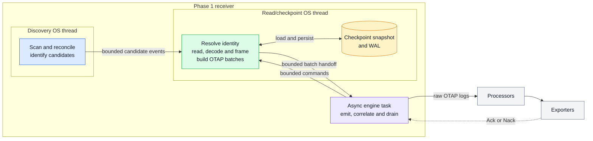
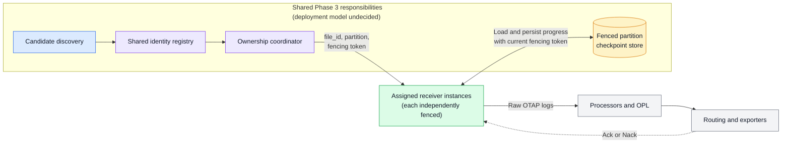

<!-- markdownlint-disable MD013 -->

# Filelog Receiver Architecture

Status: Proposed for community architecture review

Tracks [#2844](https://github.com/open-telemetry/otel-arrow/issues/2844).
Related work includes [#2321](https://github.com/open-telemetry/otel-arrow/issues/2321)
and the journald receiver
[#2858](https://github.com/open-telemetry/otel-arrow/issues/2858).

## Executive summary

This document proposes an OTAP-native receiver for continuously collecting logs
from local files. It discovers eligible files, assigns durable logical
identities, reads source bytes in bounded turns, decodes and frames records,
handles rotation and restart, emits raw OTAP logs, and advances source progress
only after downstream acknowledgement and required persistence.

Phase 1 establishes the single-instance correctness model. It uses one
discovery OS thread, one read/checkpoint OS thread, and one async engine task,
connected by bounded channels. It retains one receiver-wide in-flight batch.
This makes progress and retry behavior tractable, but intentionally couples all
files to the same downstream Ack latency, checkpoint transaction, failure
policy, and drain.

The receiver preserves ordering within each file and provides at-least-once
delivery after emission. Crash recovery of uncommitted records requires both a
valid durable checkpoint and the corresponding source bytes. The receiver is
not a durable telemetry spool. Ordinary move/create rotation is supported;
copytruncate remains best-effort because portable filesystem observation cannot
close its destructive copy-to-truncate gap.

Phase 2 may improve local throughput and discovery latency without changing
ownership. Phase 3 is a conceptual target that adds shared identity resolution,
assignment, fencing, and checkpoint persistence. Phase 3 is not implemented by
the Phase 1 local discovery boundary, namespace lock, or runtime leases.

The central responsibility boundary is:

- The receiver decides which source bytes constitute a record.
- Processors decide what the record means.
- Exporters decide how the record is represented and delivered.

## Documentation ownership

The design is split into three normative layers:

| Document | Normative ownership |
| --- | --- |
| `filelog-receiver.md` (this document) | Architecture, scope, guarantees, decisions, and tradeoffs |
| [Filelog Receiver Phase 1 Behavioral Specification](filelog-receiver-phase1-spec.md) | Exact Phase 1 runtime behavior and state transitions |
| [Filelog Receiver Checkpoint Format](filelog-checkpoint-format.md) | Exact durable byte format and replay representation |

The lower-level specifications refine the architecture and cannot contradict it.
A conflict is a design defect that must be surfaced and resolved deliberately;
it is not resolved by allowing one document to override another.

For example, this document owns the rule that source progress advances only
after a matching downstream Ack. The Phase 1 specification owns exact
correlation, retry, stale-completion, atomic-delta, and drain behavior. The
checkpoint-format specification owns the exact encoding and replay
representation of the resulting progress operation.

Requirements in this architecture use direct declarative language. The
checkpoint-format specification states its own normative-keyword convention.

## Goals and non-goals

### Goals

- Tail eligible local files while they continue to grow.
- Preserve deterministic per-file identity, framing, ordering, and Ack-gated
  source progress.
- Keep filesystem and checkpoint blocking work off the current-thread async
  runtime.
- Bound discovery, readers, descriptors, buffers, batches, channels, retries,
  maps, checkpoint artifacts, recovery allocations, and scheduling work.
- Recover after restart when durable state and the required source bytes
  survive.
- Handle ordinary move/create rotation and state weaker copytruncate behavior
  honestly.
- Emit raw OTAP logs with bounded provenance and observed time.
- Preserve a logical progress contract that Phase 3 can place behind shared
  identity, ownership, fencing, and checkpoint services.

### Non-goals

- Compatibility with the Go filelog receiver or Stanza operator chains.
- Embedded timestamp extraction, JSON parsing, severity mapping, trace
  correlation, enrichment, filtering, or routing.
- Destination-specific body conversion, field mapping, or delivery behavior.
- Durable telemetry spooling or recovery after required source bytes disappear.
- Guaranteed copytruncate capture or unconditional "never lose data" claims.
- Multi-instance or multi-process ownership, virtual partitions, distributed
  fencing, or lossless handoff in Phase 1.
- A claim that local ownership acquisition means source readiness.
- Permanent identity derived from path, native file ID, fingerprint, CPU,
  thread, NUMA node, or deployment generation.
- Universal latency, throughput, memory, or production-readiness claims.

### Separately scoped capabilities

These capabilities require separate proposals defining their own capture,
delivery, recovery, security, and operational guarantees:

| Capability | Separate contract required |
| --- | --- |
| Read once and delete | Completion proof, Ack of all records, durable tombstones, and delete retry |
| Compressed streams and archives | Decompression bounds, member identity, and restart rules |
| Network shares | Filesystem-specific identity, outage, advisory-lock, and cross-agent ownership behavior |
| Windows files denying shared read | A privileged capture mechanism such as a driver, journal, or snapshot |
| Importing unrelated checkpoints | Distribution-specific evidence and an explicit idempotent migration |
| Header-content skipping | Identity, initial-offset, framing, and restart semantics |
| Advanced I/O and parsing | Separate bounds and evidence for `io_uring`, `mmap`, eBPF, language parsers, or structured files |
| Product parity | Explicit processor and product scope rather than receiver architecture |

## Phase 1 guarantees and limitations

These contracts are intentionally near the beginning so review does not require
reading implementation detail first.

| Area | Phase 1 contract |
| --- | --- |
| Capture | Reads eligible complete records while their source bytes remain available; unread bytes destroyed by rotation or retention are unrecoverable |
| Delivery | Retains and retries one emitted receiver-wide batch until Ack or terminal policy |
| Progress | Makes source progress committable only after the matching Ack and releases the retained batch only after required persistence |
| Crash recovery | Reconstructs uncommitted records only when valid checkpoint state and corresponding source bytes survive |
| Ordering | Preserves ordering within each file; defines no cross-file ordering |
| Rotation | Supports move/create; copytruncate remains best-effort |
| Delivery semantics | At least once after emission; retry or crash can produce duplicates |
| Durability | Does not spool emitted OTAP batches to disk |
| Resource behavior | Uses fixed workers, bounded state, bounded work turns, and backpressure |
| Failure isolation | Most source failures are per-file; batch, ownership, runtime-lease integrity, and checkpoint failures can stop the receiver |
| Ownership | Serializes one local checkpoint namespace and prevents duplicate in-process readers; provides no distributed fencing |
| Live rollout | Cannot claim ready-before-ownership or lossless handoff without an engine readiness and distributed ownership contract |
| Platforms | Requires equivalent logical behavior on Linux, macOS, and Windows; does not claim equal Windows power-loss evidence without platform validation |

Three different guarantees must not be conflated:

1. **Capture** covers bytes observed and framed while the source still retains
   them. It excludes bytes destroyed before observation, intentional
   `start_at: end`, and explicit loss policies.
2. **Delivery** covers a live emitted batch retained until a matching downstream
   completion and terminal policy.
3. **Recovery** covers reconstruction after failure from durable progress and
   surviving source bytes. It is not a durable copy of the emitted batch.

A downstream Ack followed by a crash before progress becomes durable can cause
duplicate replay. It does not authorize skipping the data. If the source bytes
have disappeared, the receiver cannot reconstruct them even when its checkpoint
is intact.

## Decisions requested

Reviewers are asked to approve or challenge all of the following decisions and
accepted compromises:

| ID | Decision | Rationale or consequence |
| --- | --- | --- |
| D1 | Run one filelog receiver instance in Phase 1 | Engine-scoped assignment and fencing do not exist yet |
| D2 | Isolate local discovery behind a candidate-source abstraction without claiming it is the Phase 3 ownership protocol | Distributed ownership also needs revisions, fencing, reconciliation, and revoke completion |
| D3 | Exclude CPU count and deployment generation from identity and checkpoint keys | Deployment topology must not change source progress |
| D4 | Key durable progress by an opaque persisted `file_id` | Paths, fingerprints, and native locators are matching evidence rather than permanent identity |
| D5 | Use a stable checkpoint namespace independent of pipeline generation; allow an explicit ID to pin it across receiver-node renames | Deployment generation must not change source progress; a rename-sensitive derived default does not itself provide rename continuity |
| D6 | Use runtime locators and fingerprints only as guarded matching evidence | Native locators can be reused and fingerprints can collide |
| D7 | Advance source progress only after a matching downstream Ack | Nack, shutdown, and failed delivery must not silently lose progress |
| D8 | Run blocking filesystem and checkpoint work on fixed dedicated threads | Blocking work must not stall the current-thread runtime or create an unbounded worker pool |
| D9 | Keep decoding and framing in the receiver; keep semantic interpretation in processors | Framing determines source progress; interpretation must remain reusable |
| D10 | Emit raw OTAP logs with bounded source provenance | The receiver does not embed destination or Stanza-style operator logic |
| D11 | Bound readers, descriptors, buffers, batches, channels, retries, maps, candidate populations, and scheduling turns | Overload and memory behavior must remain predictable |
| D12 | Support move/create rotation and describe copytruncate as best-effort | Portable observation cannot guarantee copytruncate capture |
| D13 | Retain one receiver-wide in-flight batch in Phase 1 | This simplifies progress correctness while intentionally coupling all files |
| D14 | Use periodic reconciliation as the Phase 1 correctness mechanism | Native notifications may reduce latency later but cannot be the sole source of truth |
| D15 | Use a namespace lock plus process-local runtime leases for Phase 1 local ownership | These prevent overlapping local readers but provide no distributed fencing or readiness promise |
| D16 | Fail closed on corrupt durable state and persist fail-policy quarantine | Ambiguous recovery never silently inherits progress, and restart cannot bypass failure |

## Responsibility boundaries

### Receiver, processor, and exporter

| Component | Owns |
| --- | --- |
| Receiver | Discovery, file identity, local ownership, source decoding, record framing, source provenance, `observed_time_unix_nano`, Ack correlation, and Ack-gated progress |
| Processors | Timestamp extraction and parsing, structured parsing, severity, trace correlation, enrichment, filtering, and routing semantics |
| Exporters | Destination representation and delivery |

The receiver factory validates receiver configuration only. It does not inspect
or validate a timestamp processor, exporter, or destination configuration.

Multiline framing remains in the receiver because it determines which bytes
belong to a record and therefore which source offset an Ack may advance.
Timestamp parsing remains in a processor because it changes interpretation, not
record boundaries. A processor parse failure does not change receiver framing,
provenance, observed time, or source progress.

### Logical component boundaries

Phase 1 co-locates several responsibilities but keeps their contracts distinct:

- Discovery reports candidates; it does not grant distributed ownership.
- Identity resolution creates or reconnects `file_id`.
- Local ownership prevents duplicate readers within the stated local scope.
- Reading, decoding, and framing produce records and source-progress deltas.
- Batch coordination owns the receiver-wide delivery frontier.
- Checkpoint persistence stores the acknowledged logical state.

These are architectural responsibilities, not requirements for separate Rust
types, tasks, threads, services, or extensions.

## Architecture

### Phase 1 architecture



The discovery thread performs bounded periodic reconciliation and stable
candidate evidence collection. The read/checkpoint thread owns identity
resolution, runtime leases, resident tail handles, decoding, framing, batch
construction, retained batch state, and checkpoint I/O. The async task owns
engine lifecycle, downstream emission, completion correlation, and drain.

The topology is fixed: one discovery thread and one read/checkpoint thread per
Phase 1 receiver, never one thread per file, directory, or mount. The factory
rejects a source pipeline with more than one core for this receiver. Downstream
topic fanout is the Phase 1 parallelism boundary.

Bounded channels separate the components. Slow downstream delivery eventually
stops source reads, leaving unread bytes in files rather than accumulating an
unbounded memory queue. Control has priority over worker handoff and a blocked
downstream send is interruptible by newly arriving lifecycle control.

### Conceptual Phase 3 architecture



The shared grouping identifies architectural responsibilities, not a required
process, service, thread, or extension boundary. Each receiver instance is
independently assigned and fenced.

Topics carry already-emitted OTAP data. They can parallelize processing and
export but do not resolve source identity, assign source ownership, or fence
checkpoint writes.

Phase 3 changes shared identity resolution, ownership assignment, and
checkpoint persistence. It preserves below-boundary reading, decoding, framing,
Ack/Nack, backpressure, retry, and lifecycle semantics. Every checkpoint
mutation must reject a stale fencing token atomically.

The diagram does not decide whether receivers access storage directly or
through a coordination service. It also does not define the identity-registry
consistency model, assignment protocol, virtual-partition mapping, revoke
deadline, readiness protocol, or migration format. Those remain Phase 3 work.

Phase 1 state is useful migration input because progress is keyed by stable
`file_id` rather than CPU or generation. It is not already partitioned or
fenced. Phase 3 therefore requires an explicit, versioned migration that
preserves committed progress, prevents mixed ownership during cutover, and
either completes or rolls back before a new owner reads.

## Core Phase 1 contracts

### Discovery and identity

Phase 1 uses periodic reconciliation as its correctness source. Filesystem
notifications may be added as latency hints in Phase 2, but missed, coalesced,
or overflowed notifications cannot replace reconciliation.

Includes and excludes are compiled once and bounded. Exclusion wins. Lexical
matches, resolved targets, alias roots, symlinks or reparse points, and
platform-aware path separators have explicit behavior. The checkpoint namespace
is unconditionally excluded so receiver state cannot feed back into ingestion.
Exact traversal and alias rules belong to the
[Phase 1 specification](filelog-receiver-phase1-spec.md#discovery-reconciliation).

Discovery is incremental and never materializes an unbounded filesystem match
set. Traversal state, candidate events, pending candidates, tracked identities,
transient probes, and resident descriptors are independently bounded.
Overflowed candidates are observable and become eligible again on later
reconciliation. Admission opportunity varies so stable traversal order cannot
permanently starve candidates, although no finite wait is promised for
unretained overflow.

Candidates still reach bounded identity resolution when the durable tracked
table is full. A candidate may reconnect an existing record without consuming a
new slot. Only a candidate proven to require a new `file_id` is deferred for
lack of tracked capacity.

Discovery results are either complete or incomplete. Traversal failure,
instability, cycles, cancellation, or bounded-state loss can make an inventory
incomplete. An incomplete pass cannot manufacture absence or uniqueness:

- it emits no false removal based only on non-observation;
- it does not evict unseen pending evidence;
- it disables fingerprint-only checkpoint inheritance; and
- it preserves exact-locator matching when that direct evidence remains valid.

This is an identity-safety principle, not merely an error-reporting detail.

Identity evidence comes from an opened and validated regular-file handle. Four
values have deliberately separate roles:

| Value | Role | Not used as |
| --- | --- | --- |
| Opaque `file_id` | Durable logical key and future partition input | A derivation of path, locator, fingerprint, CPU, or generation |
| Runtime locator | Live reader, discovery deduplication, and runtime-lease evidence | Permanent identity |
| Fingerprint | Guarded recovery evidence | A unique key |
| Advisory path | Reversible bounded platform-native metadata | Identity |

Two live files with equal fingerprints remain distinct. Fingerprint evidence
for a growing file may extend under the same `file_id`, but never rekeys it.
Same-filesystem or same-volume rename continuity uses the unchanged runtime
locator. Cross-device or cross-volume copy/unlink is a new file.

Recovery prefers a validated exact locator. Fingerprint-only inheritance
requires a complete inventory, a full evidence window, and uniqueness across
the bounded live candidate population and eligible durable records. Ambiguous,
short, unstable, mismatched, or offset-beyond-size evidence never inherits an
old offset. It creates a new identity or follows the explicit mismatch failure
policy. Duplicate ingestion is preferred to silently skipping data.

`start_at` applies only to a newly registered identity. Recovered durable state
wins. Registration, including a handle-derived initial EOF anchor for
`start_at: end`, is durable before reading begins.

A quarantined record reconnects only through the same exact runtime locator.
Unlike active recovery, later size or fingerprint changes do not replace its
stored quarantine evidence. A different locator at the same path never inherits
its quarantine or offset. Ordinary metadata refresh preserves the original
quarantine locator and failure evidence.

### Local ownership

Phase 1 has two local ownership mechanisms with different scopes:

1. An exclusive advisory lock serializes access to the stable checkpoint
   namespace across overlapping local generations.
2. Process-local runtime leases prevent two receiver nodes in one engine
   process from controlling the same live runtime locator.

`checkpoint.id` names the durable namespace. A derived default is convenient
but follows the configured receiver identity; operators that require continuity
across a receiver-node rename configure an explicit ID from initial deployment,
pin the current effective ID before the rename, or perform an explicit namespace
migration. Choosing an unrelated ID creates a new namespace. CPU count and
deployment generation never enter the namespace.

Runtime leases survive temporary descriptor closure and reopening. They are
released only when the logical reader is finalized, revoked, drained, or
failed. Lease state contains no telemetry payload or durable progress, is
bounded by configured reader populations, and is never a distributed lock.
Registry corruption or inconsistent release fails closed.

The namespace lock and runtime leases provide local single-reader safety only.
They do not fence independent processes, different state directories, or
unreliable network-filesystem locks. They do not prove that a new generation is
collecting. Component startup or controller `Ready` is not source readiness;
Phase 1 has no engine signal for ready-after-ownership and recovery.

### Execution and bounded resources

Potentially blocking or unbounded-latency filesystem and checkpoint operations
run only on the fixed OS threads. This includes traversal, metadata lookup,
fingerprint reads, file open/read/close, decoding and framing, WAL writes,
syncs, publication, and compaction. They do not run on the single-threaded
async pipeline core or an unbounded shared blocking pool.

Workers use bounded handoff and cooperative cancellation. Cancellation is
checked between bounded traversal, read, framing, channel, and checkpoint work
units. A filesystem operation already blocked in the kernel may not be
interruptible. The async task never synchronously waits forever for a worker
thread and never claims to terminate a stuck kernel call.

Reader scheduling is round-robin with source-byte-bounded turns. A single
bounded shared source-turn buffer is reused; there is not one turn buffer per
tracked file. EOF readers are re-probed on deadlines rather than continuously
requeued.

`max_open_files` bounds resident tail-reader handles independently of tracked
logical identities. When an eligible descriptor is evicted, uncommitted
decoder and framer state is discarded. Reopen starts at durable progress,
revalidates identity, and reconstructs state from surviving source bytes. The
runtime lease remains held while the descriptor is closed.

A removed resident descriptor may remain pinned through rotation finalization
to capture late writes. If that descriptor was evicted before unlink or
delete-pending state, the receiver cannot portably reopen the old identity by
path and does not promise late-write capture.

There is no source read-ahead while the receiver-wide batch is in flight.
Every queue, buffer, reader, descriptor pool, candidate population, map, open
batch, retained batch, progress-delta set, retry state, checkpoint artifact,
recovery allocation, and scheduling turn has an explicit bound.

Configuration validation uses checked arithmetic and conservative working-set
admission to reject obviously unsafe combinations. The logical formulas in the
[Phase 1 resource model](filelog-receiver-phase1-spec.md#resource-admission-models)
are not exact allocator-resident memory or RSS. Representative measurement is
required before claiming a memory ceiling, performance improvement, or
production readiness.

### Decoding and framing

Offsets always count original source bytes. The receiver reads bytes, decodes
source units, identifies physical lines, applies newline or multiline framing,
applies deterministic bounds, and only then builds OTAP records.

Text newline and regular-expression framing occur after decoding. Raw mode
performs no character decoding and frames on source byte `0x0a`. For text,
decoded U+000A is the only physical-line delimiter.

At the architecture boundary:

- A terminal LF is excluded from the emitted body but included in checkpoint
  progress.
- A preceding CR remains body data.
- Internal multiline LFs remain in the body.
- An empty line emits an empty body and still advances through its LF.
- A stripped initial BOM belongs to the complete frame source range even though
  it is not in the body source range.
- NUL is ordinary data, not EOF or a record delimiter.
- Body source range and complete frame source range are distinct.

The decoder never splits or commits inside a scalar, UTF-16 unit or surrogate
pair, BOM probe, or malformed source unit. Exact range and malformed-input rules
are owned by the
[Phase 1 decoding contract](filelog-receiver-phase1-spec.md#source-decoding-and-framing).

Phase 1 supports newline framing and one bounded start-pattern or end-pattern
multiline mode. Physical lines, logical records, multiline line counts, idle
partial flush, and split fragments are bounded. A body exactly equal to its
configured bound fits.

Oversize behavior is explicit:

- `split` preserves the deterministic bound-terminated record as bounded
  fragments.
- `truncate` emits a bounded prefix and intentionally discards through the same
  deterministic record boundary.

Split and truncate never end inside a source unit. Oversized multiline
termination occurs at a deterministic physical-line boundary so restart needs
no hidden line-count or regex state. Durable continuation contains only enough
information to reproduce the next fragment; it cannot hide buffered content,
decoder state, line count, or regex state. A resumed continuation at unchanged
EOF cannot fabricate an empty final fragment.

Idle partial-flush deadlines are armed only after observed EOF. Newly observed
source bytes cancel the deadline before framing continues. Timeout flush is an
explicit slow-writer split tradeoff, not proof of permanent EOF.

Decode-error policies preserve source order. An earlier complete record is made
emit-ready before a failure caused by later bytes. `preserve_raw`, `replace`,
and `fail` are explicit. Under `preserve_raw`, split sizing and representation
must keep earlier fragments reconstructable if malformed evidence appears
later.

Fragment and filelog-specific reason attributes remain experimental project
attributes, not registered OpenTelemetry semantic conventions. A future
standardized convention requires explicit migration rather than silent
renaming.

The receiver emits decoded text or preserved bytes, bounded file provenance,
and `observed_time_unix_nano`. It leaves event time, severity, structured
fields, trace correlation, host identity, enrichment, filtering, and routing
to processors or resource detection.

### Ack-gated delivery and checkpoints

Phase 1 has one open or retained batch across the receiver. Once emitted, the
logical batch and its progress deltas remain retained until terminal handling.
No file is reread for a retry.

Only a completion matching the current batch and send attempt may affect the
retained batch. Every progress delta also carries the current file epoch.
Duplicate, late, superseded-attempt, and prior-epoch completions are stale and
cannot mutate a replacement stream.

A matching Ack makes the whole delta set eligible for one atomic progress
transaction. Required persistence must succeed before the batch is released and
reading resumes. An Ack delta that exceeds the atomic transaction bound is
rejected before any file advances; it is never divided into partially
successful transactions.

Retryable Nack retains the same batch and applies bounded retry count and
backoff. Permanent Nack or retry exhaustion follows explicit `on_nack` policy.
The default fails without advancing progress. `drop_and_continue` is an
explicit, observable data-loss policy and still requires atomic durable
progress before continuing.

A nonzero checkpoint sync interval can widen only the crash-duplicate window.
It cannot create permission to skip data or release a batch before its required
persistence frontier. The worker drives the next-sync deadline even while
sources are idle, and drain syncs all outstanding required progress.

One receiver-wide retained batch intentionally causes head-of-line and failure
coupling:

- one slow Ack pauses every reader;
- one retryable Nack pauses every reader;
- one permanent batch failure can stop unrelated files;
- one checkpoint transaction couples progress for multiple files; and
- drain waits on the same delivery frontier.

This is an accepted Phase 1 compromise, not accidental implementation behavior.

The checkpoint architecture requires:

- durable file registration before reading;
- one complete authoritative generation selected atomically;
- the previous generation recoverable until publication completes;
- resumable cleanup that cannot make an incomplete generation authoritative;
- bounded artifact populations and recovery allocations;
- compatible write and read bounds;
- atomic replay of validated logical transactions; and
- fail-closed recovery for uncertain authority, unknown versions, invalid
  lengths, impossible transitions, non-tail corruption, or any damage other
  than the exactly format-defined incomplete final transaction.

This document intentionally defines no magic values, field widths, byte order,
operation encoding, checksum coverage, or exact torn-tail bytes. Those belong
only to the
[checkpoint-format specification](filelog-checkpoint-format.md).

Changes to identity or framing inputs that affect deterministic replay are
checkpoint-compatibility changes. They require an explicit versioned migration
or audited reset; a configuration reload cannot reinterpret resumable state.

### Quarantine, reset, and retention

Fail-policy quarantine is persisted and synced before it is reported as
durable. Restart and configuration reload cannot bypass it.

Administrative recovery is explicit and per file. It names the checkpoint
namespace and exact `file_id`, carries an audit reason, and performs one of:

- reset to beginning;
- reset to validated current end; or
- keep failed.

A reset increments the file epoch and clears framing state before reading
continues. `keep_failed` preserves quarantine, epoch, progress, framing state,
locator, and evidence. Administrative removal also names the exact namespace
and `file_id` and carries an audit reason.

Ordinary retention never removes quarantined records. Age alone is insufficient
for any removal. Runtime logic must also prove absence from complete discovery,
logical readers, descriptors, runtime leases, pending candidates, rotation
state, open-batch deltas, and the retained batch. Returning after legitimate
retention may cause duplicate ingestion or intentional `start_at: end`
exclusion; that is the explicit retention tradeoff.

### Rotation and truncation

For move/create rotation, the receiver keeps reading the already-open old
identity while independently discovering the replacement at the original path.
The old and replacement files have independent `file_id`, epoch, framing, and
progress. The replacement never inherits the old offset merely because it uses
the same path.

Late-write capture for the old identity depends on retaining its descriptor.
EOF plus `rotate_wait` is an inactivity heuristic, not writer fencing. Writes
after finalization may be missed. A descriptor evicted before unlink cannot be
portably recovered for late writes.

At finalization, unterminated bytes not released by an approved EOF-gated idle
flush remain uncommitted and may not be captured. During drain, recoverable
partial bytes remain pending for restart rather than being reported as dropped.

Copytruncate has an unavoidable observation gap. Bytes appended after the copy
and destroyed by truncation may never be observed. Truncate and regrow between
observations may resemble an append. No supported platform receives a lossless
copytruncate claim.

Detectable truncation never advances over unacknowledged bytes:

- `on_truncate: fail` durably quarantines the exact identity before reporting
  the condition.
- `on_truncate: read_new` explicitly accepts the risk, increments the file
  epoch, durably records a reset to source offset zero with clean framing, and
  reads the replacement stream only after that reset is persistent.

An earlier-epoch Ack cannot advance the replacement stream. Changing
configuration to `read_new` does not release an existing quarantine.

### Lifecycle, backpressure, and failure containment

Startup validates configuration, starts fixed workers and bounded channels,
acquires local namespace ownership, recovers durable state fail-closed,
reconciles discovery, resolves identity, acquires runtime leases, durably
registers new identities, and only then reads.

On normal drain, the receiver stops discovery, admission, and new reads; bounds
replay and flushing to source bytes already read when drain begins; flushes a
nonempty open batch; waits within the effective drain deadline for terminal
completion; persists and syncs required progress; reports recoverable partial
bytes as pending; releases descriptors, leases, and namespace ownership; and
notifies the engine that drain completed.

A cleanly drained receiver need not receive a later Shutdown. Direct Shutdown
without prior drain is still handled: it stops reads and emission attempts,
cancels retry waits, leaves unacknowledged progress unchanged, requests
cooperative worker shutdown, and releases resources that do not require an
unbounded wait.

The async task remains responsive to lifecycle control while downstream is
blocked. Cooperative cancellation is independent of command-channel capacity.
The remaining limitation is explicit: a kernel-blocked filesystem call or its
OS thread may outlive the async receiver's bounded wait.

Failure containment is:

| Failure class | Phase 1 domain |
| --- | --- |
| Oversize or malformed input under non-failing policy | Record |
| Decode `fail`, read error, permission error, or detected truncation under `fail` | File, through durable quarantine or bounded reprobe |
| Ambiguous identity | File, through new identity or explicit failure policy |
| Runtime lease timeout | File; duplicate local reader does not start |
| Retryable Nack | Receiver-wide retained batch |
| Permanent Nack or retry exhaustion | Receiver by default |
| Checkpoint append, sync, publication, compaction, or corruption | Receiver |
| Namespace ownership timeout | Receiver startup |
| Runtime-lease registry integrity failure | Receiver |
| Worker failure or downstream closure | Receiver |

Phase 2 may add a local shard failure domain only if ownership, batches, retry,
contiguous progress, memory, and recovery are independently specified for each
shard.

### Platform behavior

Linux, macOS, and Windows must provide equivalent logical behavior for
handle-derived regular-file evidence, opaque identity, guarded recovery,
bounded advisory paths, descriptor residency, move/create separation,
copytruncate limitations, Ack-gated progress, fail-closed recovery, and
lifecycle cancellation.

Platform APIs and evidence differ. Unix can retain an unlinked file through an
open descriptor and can sync checkpoint-directory metadata. Windows uses a
volume and 128-bit file-ID locator and compatible sharing for ordinary
move/create behavior. Writers that deny shared read remain separately scoped.

Windows lacks the same directory-sync evidence used by the Unix publication
path. Atomic replacement remains required, but equal power-loss durability is
not claimed until Windows-specific fault or power-cut evidence supports it.
Ordinary CI rename tests do not prove that stronger property.

### Telemetry and health

The primary metric set is `receiver.filelog`. It covers bounded categories for
records and bytes, batch completion and retry, checkpoint operations, discovery,
candidate pressure, readers and descriptors, identity outcomes, rotation and
truncation, quarantine, decoding and framing outcomes, backpressure, and
lifecycle failures.

Metric labels use fixed bounded dimensions such as reason, policy, result, or
rotation type. Paths, `file_id`, runtime locators, fragment IDs,
operator-supplied checkpoint IDs, and raw error strings are never metric labels.
Detailed identity and path context is limited to bounded, sampled, and
rate-limited health events.

## Representative Phase 1 configuration

This short example shows the architectural knobs. The complete proposed schema,
defaults, validation relationships, pattern limits, and working-set admission
rules belong to the
[Phase 1 configuration contract](filelog-receiver-phase1-spec.md#proposed-configuration-contract).
The proposed schema is not yet a compatibility promise.

```yaml
receivers:
  filelog:
    urn: "urn:otel:receiver:filelog"
    config:
      include: ["/var/log/app/*.log"]
      exclude: ["/var/log/app/debug-*.log"]
      start_at: end
      encoding: utf-8
      on_decode_error: preserve_raw
      framing:
        max_line_bytes: 1MiB
        max_record_bytes: 1MiB
        max_log_size_behavior: split
        multiline:
          line_end_pattern: '^END request$'
      limits:
        max_open_files: 512
        max_read_bytes_per_turn: 128KiB
      batch:
        max_records: 1024
        max_bytes: 8MiB
      rotation:
        on_truncate: fail
      checkpoint:
        id: app-logs
      retry:
        max_attempts: 8
        initial_backoff: 100ms
        max_backoff: 5s
      on_nack: fail
```

## Normative architecture examples

These examples illustrate cross-cutting contracts. Exact source ranges, framing
state transitions, malformed-input cases, and fault cases are in the
[Phase 1 specification](filelog-receiver-phase1-spec.md#normative-examples).

### Multiline timestamp interpreted by a processor

```text
BEGIN request id=42
user=alice operation=payment
event_time=2026-08-21T10:15:02.331-07:00
result=failed
END request
```

An end pattern matching `^END request$` makes the five physical lines one OTAP
record. The receiver sets observed time and source provenance. A processor may
extract and interpret `event_time`; success or failure of that interpretation
does not alter receiver framing or source progress.

### Move/create rotation

`app.log` with locator A is renamed to `app.log.1`, and a new `app.log` with
locator B is created. A retains its identity and resident descriptor and is read
through EOF plus the rotation wait. B is discovered independently and receives
separate progress. B never inherits A's offset.

### Copytruncate observation gap

A rotation tool copies `app.log`, an application appends more bytes, and the
tool truncates the original before the receiver observes those appended bytes.
Those bytes may exist in neither surviving file. Checkpoint logic cannot recover
bytes that were never captured, and truncation followed by regrowth may not be
observable. The receiver therefore reports only detectable evidence and
recommends move/create rotation.

### Crash before matching Ack is durably committed

The durable offset is 100. The receiver emits records through offset 200.
Whether downstream has not Acked, or Acked but progress has not reached the
required durable frontier, a crash leaves durable progress at 100. Restart
validates identity and rereads from 100 when those source bytes survive.
Duplicate delivery is possible; skipping to 200 is not.

## Delivery phases

| Phase | Deliverables | Principal limitation or gate |
| --- | --- | --- |
| Phase 1 | One receiver; bounded periodic discovery, reading, decoding, framing, and batching; durable identity and quarantine; one retained batch; Ack-gated progress; move/create rotation | Receiver-wide head-of-line coupling; no distributed fencing or lossless rollout readiness; checkpoint-format approval required |
| Phase 2 | Native discovery hints, bounded read-ahead or local shards, multiple in-flight batches, optional source metadata, measured background compaction | Ownership remains local and single-instance; new contiguous-commit and failure-isolation contracts required |
| Phase 3 | Shared identity resolution, fixed virtual-partition assignment, fenced checkpoint persistence, revoke/assign and readiness coordination, explicit Phase 1 state migration | Requires shared coordination and storage semantics not provided by Phase 1 |

Phase 1 satisfies the single-instance subset of #2844. It demonstrates
CPU-independent identity keys and restart continuity, but it does not satisfy
the epic's multi-instance assignment, live resize, fenced handoff, or source
readiness criteria.

Phase 2 optimizations cannot weaken periodic reconciliation, boundedness,
ordering, or Ack-gated progress. Multiple in-flight batches require explicit
contiguous commit, Nack-in-the-middle, read-ahead reconstruction, memory, drain,
and failure-domain rules before adoption.

Phase 3 preserves the source-side semantics approved here while replacing the
ownership boundary. Shared identity must precede partition assignment because a
receiver cannot be assigned by an opaque `file_id` that only it can create.

## Alternatives considered

| Alternative | Why it is not selected for Phase 1 |
| --- | --- |
| Port the Go or Stanza receiver | It mixes semantic operators with source framing and progress |
| Use path as checkpoint identity | Rename and path reuse detach progress from the underlying file |
| Use fingerprint as identity | Empty, short, and common-prefix files collide |
| Use native inode or file ID permanently | Native locators can be reused and are not durable logical identity |
| Partition by CPU, thread, or deployment generation | Topology changes would change ownership and checkpoint keys |
| Perform blocking file work on the async runtime | A slow filesystem could stall the current-thread pipeline runtime |
| Use an unbounded blocking pool | Stuck filesystems could create hidden thread and queue growth |
| Commit progress after emission rather than Ack | Downstream rejection or failure could silently lose data |
| Rewrite the complete checkpoint after every Ack | Ack cost would scale with all tracked files rather than changed files |
| Claim copytruncate correctness | Its destructive transition may be unobservable |
| Treat candidate discovery as ownership | Candidate events lack assignment revisions, fencing, and revoke completion |
| Pre-partition the Phase 1 store | Mapping, identity authority, fencing, and migration remain unresolved |
| Add per-file batches immediately | It requires new ordering, retry, memory, commit, and drain contracts |
| Persist every emitted OTAP batch | That is a durable spool with a different storage, lifecycle, and capacity design |

Journald remains useful lifecycle precedent for a dedicated blocking worker,
bounded handoff, retained batch, and Ack-gated progress. Filelog cannot reuse its
source mechanics because discovery, byte offsets, decoding, framing,
fingerprints, and rotation differ. Quiver provides useful versioning, integrity,
and atomic-publication conventions, but its segment and cursor data model is not
the filelog checkpoint model.

## Open questions

1. Is the single-instance Phase 1 delivery an acceptable first step for #2844
   while shared identity, ownership, and fencing remain the target?
2. Which engine-, group-, controller-, or service-level boundary should own the
   Phase 3 identity registry and ownership coordinator?
3. What consistency model, fencing-token allocation, assignment revision,
   revoke deadline, receiver confirmation, and readiness contract should Phase
   3 use?
4. Do Phase 3 receivers access checkpoint storage directly or through the
   coordination service, and how is Phase 1 state migrated without mixed
   ownership, skipped data, or avoidable duplicate ingestion?
5. What are the Phase 2 contiguous-Ack and Nack-in-the-middle rules for multiple
   in-flight batches, and what failure domain is justified?
6. What permanent-EOF policy applies to an incomplete decoded source unit or
   unresolved BOM probe? Phase 1 cannot silently commit or discard it.
7. Which public OTAP attributes, if any, represent body and frame source ranges,
   and what stable meaning should optional record numbers have?
8. What integrated aggregate working-set admission model and representative
   measurements are required before making a per-instance memory claim?
9. What Windows fault evidence is sufficient for a crash-durability claim in
   the absence of Unix-equivalent directory sync?
10. Which retained-batch, checkpoint-envelope, and worker/async plumbing should
    eventually be shared with journald after filelog validates the abstraction?

## Phase 1 completion criteria

Phase 1 is complete only when implementation, documentation, and evidence
conform to this architecture and the detailed specifications. Source-level unit
tests alone do not establish production readiness.

| Validation category | Required evidence |
| --- | --- |
| Discovery | Growing-file admission; include/exclude and alias behavior; complete/incomplete inventories; cancellation; overflow rediscovery and fairness; no false removal |
| Identity | Equal fingerprints; exact-locator recovery; ambiguity; mismatch; growing evidence; `start_at`; quarantine reconnection; durable registration |
| Ownership | Namespace serialization; overlapping-pattern runtime leases; lease survival across descriptor eviction; fail-closed registry behavior; no readiness overclaim |
| Readers and bounds | Open-descriptor cap; transient-probe cap; shared source-turn buffer; hot/cold fairness; EOF reprobe; checked arithmetic; conservative aggregate admission |
| Decoding and framing | Every supported encoding; LF, CR, BOM, NUL, malformed input, source ranges, multiline bounds, split/truncate determinism, continuation restart, idle EOF flush |
| OTAP boundary | Raw body and bounded provenance; observed time; no receiver semantic parsing; bounded metadata and cardinality |
| Delivery | Matching Ack; stale completion and epoch guards; retryable and permanent Nack; retry exhaustion; atomic overlarge-delta rejection; receiver-wide coupling |
| Checkpoints | Registration before read; atomic progress; corruption and torn-tail behavior; publication fault points; resumable cleanup; bounded recovery; durable quarantine/reset/retention |
| Rotation | Move/create, descriptor-dependent late writes, detectable truncation, copytruncate gap, both truncate policies, old-epoch Ack rejection |
| Lifecycle | Startup ordering; drain under backpressure; drain timeout; clean drain without Shutdown; direct Shutdown; cooperative cancellation; blocked-kernel limitation |
| Platforms | Equivalent logical identity, path, open-file, rotation, lock, and publication behavior on Linux, macOS, and Windows, with honest durability evidence |
| Operations | Bounded metrics and events; no per-file metric labels; actionable saturation, quarantine, checkpoint, copytruncate, and lifecycle signals |

The
[Phase 1 behavioral specification](filelog-receiver-phase1-spec.md)
must be reviewed and implemented. The
[checkpoint-format specification](filelog-checkpoint-format.md)
must exist, be approved, match the implementation, and provide conformance
vectors for encoding, replay, corruption, torn writes, versions, platforms, and
migration. Its absence is a release blocker.

## Detailed specification references

- [Phase 1 scope and terminology](filelog-receiver-phase1-spec.md#phase-1-scope)
- [Complete proposed configuration and validation](filelog-receiver-phase1-spec.md#proposed-configuration-contract)
- [Discovery reconciliation](filelog-receiver-phase1-spec.md#discovery-reconciliation)
- [Identity and local ownership](filelog-receiver-phase1-spec.md#identity-and-local-ownership)
- [Reader scheduling and descriptor resources](filelog-receiver-phase1-spec.md#reader-scheduling-and-descriptor-resources)
- [Source decoding and framing](filelog-receiver-phase1-spec.md#source-decoding-and-framing)
- [OTAP output](filelog-receiver-phase1-spec.md#otap-output)
- [Ack, Nack, and checkpoint timing](filelog-receiver-phase1-spec.md#ack-nack-and-checkpoint-timing)
- [Checkpoint semantic contract](filelog-receiver-phase1-spec.md#checkpoint-semantic-contract)
- [Rotation and truncation](filelog-receiver-phase1-spec.md#rotation-and-truncation)
- [Backpressure, cancellation, and lifecycle](filelog-receiver-phase1-spec.md#backpressure-cancellation-and-lifecycle)
- [Failure containment](filelog-receiver-phase1-spec.md#failure-containment)
- [Resource admission models](filelog-receiver-phase1-spec.md#resource-admission-models)
- [Platform requirements](filelog-receiver-phase1-spec.md#platform-requirements)
- [Telemetry and health events](filelog-receiver-phase1-spec.md#telemetry-and-health-events)
- [Detailed validation matrix](filelog-receiver-phase1-spec.md#validation-matrix)
- [Detailed normative examples](filelog-receiver-phase1-spec.md#normative-examples)
- [Exact checkpoint-format specification](filelog-checkpoint-format.md)

## References

- [Epic #2844](https://github.com/open-telemetry/otel-arrow/issues/2844)
  and seed [#2321](https://github.com/open-telemetry/otel-arrow/issues/2321)
- [Journald receiver design](journald-receiver.md) and
  [issue #2858](https://github.com/open-telemetry/otel-arrow/issues/2858)
- [Topic architecture](topic-architecture.md)
- [Extension system architecture](extension-system-architecture.md) and
  [extension requirements](extension-requirements.md)
- [Quiver architecture](../crates/quiver/ARCHITECTURE.md)
- [OpenTelemetry semantic-convention naming guidance](https://opentelemetry.io/docs/specs/semconv/general/naming/)
  and [general log attributes](https://opentelemetry.io/docs/specs/semconv/general/logs/)
- [OpenTelemetry Collector filelog receiver](https://github.com/open-telemetry/opentelemetry-collector-contrib/blob/main/receiver/filelogreceiver/README.md)
- [Fluent Bit multiline parsing](https://docs.fluentbit.io/manual/administration/configuring-fluent-bit/multiline-parsing)
  and [tail input](https://docs.fluentbit.io/manual/pipeline/inputs/tail)
- [Filebeat file identity](https://www.elastic.co/docs/reference/beats/filebeat/file-identity)
- [NXLog multiline parser](https://docs.nxlog.co/refman/v5.6/xm/multiline.html)
