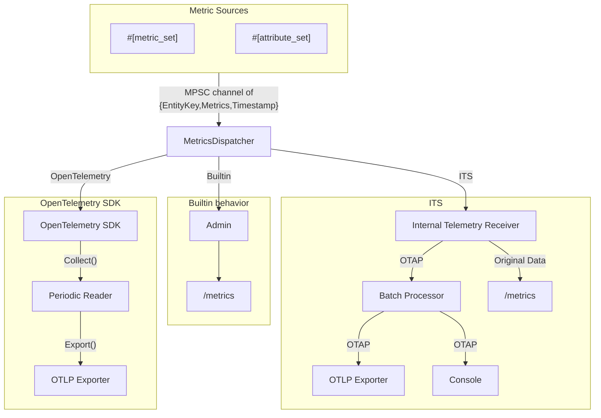
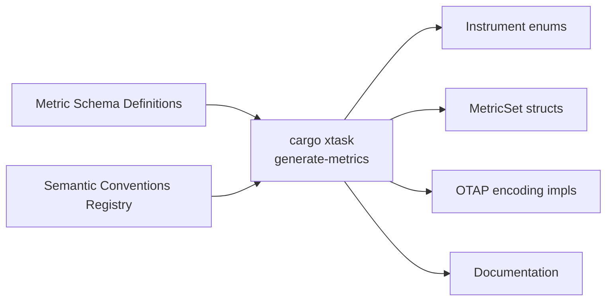

# Internal Metrics SDK

## Overview

The OTAP-direct Metrics SDK described here will replace the
OpenTelemetry-Rust Metrics SDK, using pieces of the OTAP dataflow
engine as its own internal telemetry pipeline. This
document explains how the internal metrics SDK will be redesigned
through a four-phase implementation plan. See the corresponding document
describing the [internal logs SDK](./internal-logs-sdk.md), which
followed a similar course; however, note that the logs SDK forms OTLP
bytes payloads directly, whereas the metrics SDK forms OTAP records
directly.

This is a functionally complete Metrics SDK, tailored for efficiency in
the OTAP dataflow engine environment. It may be considered as a
general purpose OpenTelemetry Metrics SDK for Rust, with the following
design constraints:

- Multivariate design for future
  [OTAP-multivariate](../../../docs/multivariate-design.md) uses
- A thread-per-core architecture with push-oriented collection supports
  synchronous and asynchronous instrument patterns
- Instruments are fully "bound"; there are no dynamic attributes
- OTel-Weaver semantic convention registry with code generation tools
  supports type-safe interfaces and schema migration
- View configuration defines three levels at compile time: Basic, Normal,
  and Detailed, which are selected at runtime; there are no dynamic views
- Schema-driven versioning includes a migration path from initial
  `#[metric_set]` to generated code using a schema registry with
  runtime-configurable output schemas.

The Metrics SDK is specialized for producing OTAP batches. It
includes built-in support for console and Prometheus reporting through
its `MetricsTap` component, meaning it works with or without a full
internal metrics pipeline.

### Project phases

There are four phases in this design plan:

1. **Drop-in replacement**. The existing `#[metric_set]` macro and the
   reporting paths for Counter, UpDownCounter, Gauge, and Mmsc instruments
   are unchanged. The current dispatcher is extended with the option
   to select the OpenTelemetry SDK, a no-op SDK, the bare-bones Admin
   behavior, or the new ITS mode. As this phase progresses, we will
   reach a point where the ITS mode provides a sufficient level of
   basic functionality.
2. **Schema-driven code generation**. New code generation tooling will
   be developed to support our own migration between metric
   schemas. One by one, each `#[metric_set]` struct will be replaced
   by generated code. An initial `v0` schema will be written to match
   pre-existing instrumentation. In some cases, a new "streamlined"
   `v1` schema using metric attributes (as opposed to a flat
   namespace) will follow. As this phase progresses, users will be
   able to control which metric schemas are compiled and which are
   selected at runtime (e.g., old, new, or both). Using Rust `enum`
   variants corresponding to each metric level, users can configure
   and choose between Basic, Normal, and Detailed metric reporting.
3. **Remove the OpenTelemetry SDK.** There will be at this point two
   choices when configuring the Metrics SDK: the built-in basic
   behavior and the ITS internal pipeline with its variety of nodes.
4. **Introduce exponential histograms.** In most cases, existing `Mmsc`
   instruments are configured at Normal level. At the Detailed metric
   level, we introduce a choice of exponential histogram. This data
   structure supports reporting both coarse and fine-level detail
   about metric distributions in the OTAP dataflow engine.

### Transition from `#[metric_set]` to schema-driven metrics

Prior to this design, metric instrumentation was fully expanded into
individual counters. For example, we might see
three counters corresponding to three outcome variants:

```rust
/// Consumed items by outcome after
#[metric_set(name = "otap.consumer")]
#[derive(Debug, Default, Clone)]
pub struct ConsumerMetrics {
    #[metric(unit = "{item}")]
    consumed_success: Counter<u64>,

    #[metric(unit = "{item}")]
    consumed_failed: Counter<u64>,

    #[metric(unit = "{item}")]
    consumed_refused: Counter<u64>,

    // ... and more (e.g., duration)
}
```

This is logically a single set of metrics using a flat namespace
instead of metric-level attributes. As we use this example, we will
consider how to add signal information (i.e., counting logs, traces, and
metrics requests separately). If we continued using a flat namespace,
we would have 9 Counters; however, a more idiomatic representation
would use metric attributes. For this example, we are considering a
metric with 1 or 2 dimensions having three variants each. We have
three outcomes and three signals, making 3 or 9 timeseries. The
metric is disabled at Basic level because a zero-dimension counter
(i.e., total items consumed regardless of outcome) is better served
by a different metric, such as a channel receive count.

After the transition, we will have a schema definition listing the
metric groups, their dimensions, and the default configuration by
metric-level:

```yaml
groups:
  - id: metric.consumer.items
    type: metric
    metric_name: consumer.items
    instrument: counter
    unit: "{item}"
    brief: "Items consumed by a node."
    attributes:
      - ref: outcome
        requirement_level: recommended
      - ref: signal
        requirement_level: optional
    x-otap-levels:
      basic:
        disabled: true
      normal:
        dimensions: [outcome]
      detailed:
        dimensions: [outcome, signal]

  # ... and more
```

In separate files, a registry will include definitions for the
`outcome` and `signal` attributes. In the generated code, we might
see:

```rust
/// [Generated Code]

#[derive(Debug, Default, Clone)]
pub struct ConsumerMetrics {
    consumed_items: ConsumedItemsByOutcomeAndSignal,

    // ... and more (e.g., duration)
}

#[derive(Debug, Default, Clone)]
pub enum ConsumedItemsByOutcomeAndSignal {
    #[default]
    Basic,                       // disabled
    Normal(Box<[Counter; 3]>),   // 1 dimension: outcome
    Detailed(Box<[Counter; 9]>), // 2 dimensions: outcome x signal
}

impl ConsumedItemsByOutcomeAndSignal {
    /// Add a number of items by outcome and signal.
    pub fn add(&mut self, items: u64, outcome: Outcomes, signal: SignalType) {
       match self {
         Self::Basic => {},  // disabled: no-op
         Self::Normal(cnts) => cnts[outcome.ordinal()].increment(items),
         Self::Detailed(cnts) => cnts[outcome.ordinal() * 3 + signal.ordinal()].increment(items),
       }
    }
}
```

Note the use of `Box<_>` in the enum variant ensures that metric level
actually controls how much memory is used by instrumentation.

In another file, we will define the translation from the `v1` to `v0`
schema, which we will eventually deprecate. Separately, we will
define how to generate either the `v1` or the `v0` schema from the
current instrumentation.

## Phase 1: Drop-in replacement

In this phase, we will insert alternatives for configuring internal
metrics, similar to how internal logging uses `logs::ProviderMode`,
with values including `None`, `Builtin`, `OpenTelemetry`, and `ITS`.
The OpenTelemetry mode will be supported through Phase 3, at which
point we will have only two real options.

We will not change the manner of reporting multivariate metric structs
currently in use. We will continue to use the structs currently
annotated with `#[metric_set]`, and will continue to use periodic
reporting on short intervals, through channels, to a location
determined by the engine controller.

The provider modes listed above are implemented at the collection
point, where a central component (`MetricsDispatcher`) receives a
stream of events and is responsible for dispatching. The `None`
setting means no metrics are ever sent; `Builtin` serves a
Prometheus-compatible endpoint without using a full telemetry
pipeline; `OpenTelemetry` preserves existing functionality; and
`ITS` enables our new standard functionality.



### Internal telemetry system

In the internal telemetry system mode, Metrics SDK events are sent to
a global, NUMA-regional, or CPU-local copy of the dataflow engine
serving internal telemetry. This is the same model of configuration
used in the Logging SDK in its corresponding ITS mode, with pipeline
nodes configured separately in the `observability` settings.

The internal telemetry system has an in-transit representation using
`EntityKey` to describe the scope, a snapshot of the measurements,
and a timestamp. When the built-in provider mode is configured, the internal
representation is used directly, making a short and relatively
low-risk code path for exporting to the console or Prometheus. The
same Prometheus export path is also supported in the ITS mode.

Internal events are received representing a partial OTAP payload. For
the current OTAP specification, we may generate any of the following
tables:

- UnivariateMetrics: the top-level table, listing metric type, name,
  temporality, description, monotonicity, resource, and scope
- NumberDataPoint: contains one row per scalar value, timestamps, and
  flags
- HistogramDataPoint: contains min/max/sum/count, optional buckets,
  timestamps, and flags (used by `Mmsc`)
- ScopeAttrs: the attributes associated with each `EntityKey`
- NumberDPAttrs: the attributes associated with each number data point.

Note that the timestamp column corresponding to the data point
tables will be identical in all cases, as metric sets are observed as
individual events. In Phase 4, as we introduce the OpenTelemetry
exponential histogram data point, we will begin using one new table.
Exemplars are not supported.

In this phase, minimal support for OpenTelemetry Metric View
configuration is preserved for use at runtime, limited to scoped
renaming of instruments and descriptions. This is meant to assist with
the initial stages of this transition; the limited Views functionality
will become deprecated during Phase 2, once schema-driven code
generation provides an alternative, and it will be fully eliminated
in Phase 3 when the OpenTelemetry SDK is removed and users are able
to achieve the same result by modifying schema definitions.

## Phase 2: Schema-driven code generation

The migration from `#[metric_set]` to generated code will use
OpenTelemetry-Weaver tooling and the semantic conventions registry,
proceeding on a set-by-set basis. For each metric set, we aim for a
transition that does not change user-visible behavior, by producing
the `v0` semantic convention while streamlining the instrumentation.

In the example above, where `ConsumerMetrics` initially consists of
three Counters (e.g., `consumed_success`), the instrumentation will
transition to a single Counter field. The generated `add` method
for this instrument requires passing the `Outcome` and
`SignalType` types at every call site.

At the end of this phase, each metric set will have at least a `v0`
schema. For many (not all), we will also define a `v1` schema with
streamlined instrumentation and a runtime choice between versions.
The two schemas may be configured as (using a scalar value for a
single schema selection):

```yaml
engine:
  telemetry:
    scopes:
      metrics:
        metrics.otap.consumer:
          schema_url: otap-dataflow/consumer@v1
```

### Code generation

A `cargo xtask generate-metrics` command will read the set of schema
definitions and the schema registry and generate:

- Three-level instrument enums
- Metric set structs
- OTAP encoder logic for the associated tables
- Crate-level metric documentation.



### OTAP encoding details

As designed, each metric set that we generate can produce multiple
output schemas. This is meant to provide a migration path between the
major versions of metric instrumentation. We imagine one or more
compiled-in schema versions per metric set, each with control over
dimensionality and cardinality.

There are a number of forms an OTAP metrics encoding can take,
depending on the number of dimensions. We have a choice between the
use of scope attributes vs metric attributes, and in a future version
of OTAP we may consider entity definitions in the resource.

Note that in all cases the ScopeAttrs, UnivariateMetrics, and
NumberDPAttrs tables can be precomputed; only the NumberDataPoint
table in this example is computed on the fly. All columns can be
dictionary encoded. All of the choices here are reasonable and valid
uses of OTAP.

#### Scope attributes, flat metrics

In this encoding, a set of metrics corresponds with a scope defined by
its attributes, with repetition of metric names but without metric-level
attributes. This yields the following tables, where the scope has K
attributes defined by an `#[attribute_set]` (a struct that defines scope-level
attributes for a metric source) and there are M metrics in the
`#[metric_set]`, for one and two dimensions:

| Table             | 1 dimension | 2 dimensions |
|-------------------|-------------|--------------|
| ScopeAttrs        | K           | K            |
| UnivariateMetrics | 3M          | 9M           |
| NumberDataPoint   | 3M          | 9M           |
| Total rows        | K+6M        | K+18M        |

Note that for 1 dimension there are 3 timeseries defined and for 2
dimensions there are 9 timeseries defined.

#### Scope attributes as dimensional metrics

In this representation, we duplicate each scope and add the intended
metric-level attributes as scope attributes, adding one row per
dimension and repeating the scope attributes for each combination of
metric attributes.

| Table             | 1 dimension | 2 dimensions |
|-------------------|-------------|--------------|
| ScopeAttrs        | 3(K+1)      | 9(K+2)       |
| UnivariateMetrics | 3M          | 9M           |
| NumberDataPoint   | 3M          | 9M           |
| Total rows        | 3K+6M+3     | 9K+18M+18    |

#### Data point attributes

The best representation choice may depend on user preferences, and any
of these choices could perform best depending on the nature of the
data. This is the most direct representation of the OTLP protocol
using the OTAP `NUMBER_DP_ATTRS` table; however, it repeats the
attributes for every data point of every metric, so this works best
when the number of metrics per set is small.

| Table             | 1 dimension (3 timeseries) | 2 dimensions (9 timeseries) |
|-------------------|----------------------------|-----------------------------|
| ScopeAttrs        | K                          | K                           |
| UnivariateMetrics | M                          | M                           |
| NumberDataPoint   | 3M                         | 9M                          |
| NumberDPAttrs     | 3M                         | 18M                         |
| Total rows        | K+7M                       | K+28M                       |

Note, as well, that these figures will be extended with more
possibilities when we introduce OpenTelemetry entities defined at the
resource level, which reduces the impact of K, thus making the
scope-attributes-oriented representation more attractive than the
data-point-attributes approach.

Moreover, the preferred long-term direction is the introduction of
first-class [multivariate metrics](../../../docs/multivariate-design.md)
in OTAP, which would allow multiple related measurements to share a
single set of attributes and timestamp, significantly improving
compression and row efficiency. This remains future work in the OTAP
specification.

## Phase 3: Remove OpenTelemetry SDK

With all `#[metric_set]` definitions replaced by generated code, we
remove the OpenTelemetry SDK from the OTAP Dataflow dependencies.
Users configure either the Builtin Prometheus support or an ITS
internal telemetry pipeline (e.g., batch processor, OTLP exporter).

Support for OpenTelemetry Metrics Views is eliminated at this point.
For the same functionality, users will either: (1) build the engine
with custom telemetry schema definitions, or (2) use the transform
processor for custom metrics behavior.

## Phase 4: Introduce exponential histograms

We will introduce an OpenTelemetry exponential histogram to our
codebase based on
[jmacd/rust-expohisto](https://github.com/jmacd/rust-expohisto), which
pairs a table-lookup implementation of the mapping function (following
the DynaTrace and NewRelic algorithms) with an auto-scaling
ring-buffer of buckets.

As an alternative to `Mmsc`, we will introduce `HistogramNN`
(non-negative) for non-negative measurements and `HistogramPN`
(positive-and-negative) for arbitrary measurements. The implementation
uses a variable-width representation, with SIMD-within-a-register
("SWAR") techniques for widening and merging buckets in place. There
are seven widths: B1, B2, B4 (bit-packed at 1, 2, and 4 bits per
bucket), and U8, U16, U32, U64 (unsigned integers at the
corresponding byte widths).

The histogram parameters are:

- `<const N: usize>`: the number of 64-bit words of space available
- `min_width`: the initial width of buckets
- `max_scale`: the initial maximum scale

The implementation has a compiled-in lookup table of size
`2^table_scale`. The default table scale is 8, configurable through a
cargo feature.

The histogram is allocation-free and `#[no_std]`. As an example, the
non-negative histogram uses six words of space for the independent
min, max, sum, and count fields, and the bucket scale, width, size,
and offset fields. Therefore `HistogramNN<10>` is 128 bytes and
`HistogramNN<26>` is 256 bytes, costing as much as 16 or 32 ordinary
counters.

After introducing the new data structure, we will add support in the
code generation tooling to introduce histogram options, usually at
detailed level.

## Appendix: Migration workflow

This section describes the migration path for the example
`ConsumerMetrics` `#[metric_set]`, from the perspective of a user with
existing monitoring and dashboards.

In Phase 2, the `v0` schema will remain the default for six months
after the `v1` schema is introduced; it will remain compiled-in for
an additional six months before removal.

Within the first six months, users will deploy an update of the
dataflow engine and dual metric reporting (using a list to select
multiple schemas simultaneously), for example:

```yaml
engine:
  telemetry:
    scopes:
      metrics:
        metrics.otap.consumer:
        - schema_url: otap-dataflow/consumer@v0
        - schema_url: otap-dataflow/consumer@v1
```

After deploying this new configuration, the user is free to redeploy
dashboards and begin monitoring metrics in the new schema version. They
will update their configuration:

```yaml
engine:
  telemetry:
    scopes:
      metrics:
        metrics.otap.consumer:
        - schema_url: otap-dataflow/consumer@v1
```

After twelve months, the OTel-Arrow project will deprecate the `v0`
schema; we expect that users will have migrated to `v1` by then. At that
point, we are free to remove the `v0` schema definition.

After removing the `v0` schema definition, re-running
`cargo xtask generate-metrics` will produce only `v1` metrics.
