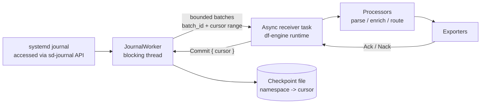
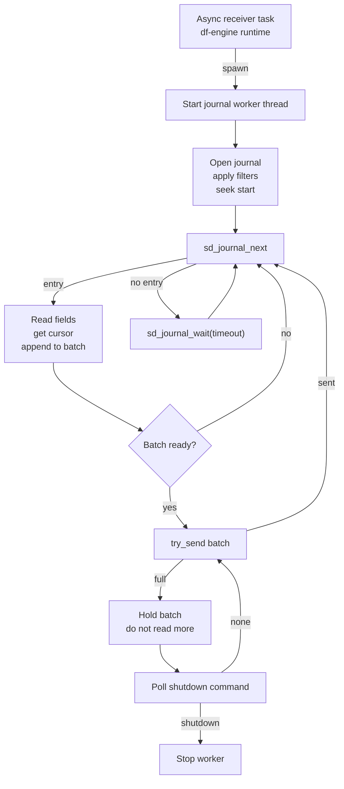
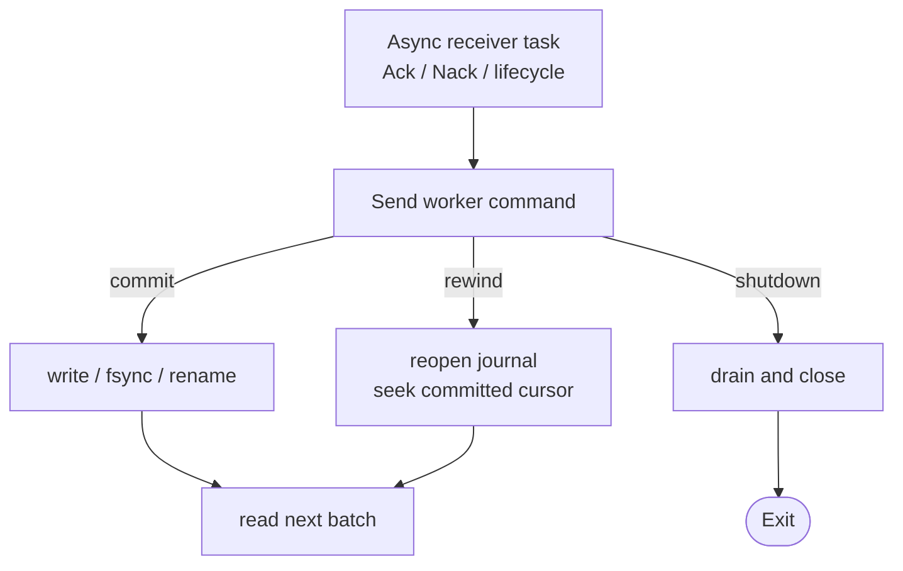

# Journald Receiver Design

<!-- markdownlint-disable MD013 -->

**Status:** Draft
**Tracking issue:** [#2858](https://github.com/open-telemetry/otel-arrow/issues/2858)
**Related epic:** [#2844](https://github.com/open-telemetry/otel-arrow/issues/2844)
**Owner:** @lalitb

## Summary

The journald receiver ingests local `systemd-journald` entries on Linux and
emits OTAP log records. It reads through the `sd-journal` API, not by tailing
`.journal` files and not by execing `journalctl`.

The receiver is a source-specific sibling to the proposed filelog receiver in
[#2844](https://github.com/open-telemetry/otel-arrow/issues/2844). It is **not**
a filelog variant: its progress unit is an opaque journald cursor and its
source API is `sd-journal`, not file discovery and byte offsets. It should not
depend on the #2844 filelog assignment extension landing first.

## Core Decisions

| Decision | Choice |
| --- | --- |
| Source API | `sd-journal` via a small internal `libsystemd` FFI wrapper loaded at runtime |
| Progress unit | Opaque journald cursor (`__CURSOR`) |
| First implementation | Linux-only, default local system journal, single-instance source pipeline (one core) |
| Delivery model | At-least-once from the last committed cursor |
| Checkpoint advance | Only after downstream Ack and durable checkpoint write |
| Backpressure | Stop calling `sd_journal_next()` when the bounded handoff is full |
| Semantic processing | Kept out of the receiver; processors do normalization, parsing, routing |
| Blocking calls | Isolated on a dedicated worker thread, never on the df-engine async task |
| NUMA | Not addressed in v1; pinning/co-location is future work |

The first implementation uses runtime-loaded `libsystemd` FFI because the
receiver needs only a narrow `sd-journal` API surface and should keep
`libsystemd` as a runtime dependency for this receiver path, instead of adding
native `pkg-config`/linker setup to normal builds. If `libsystemd.so.0` is not
available when the receiver starts, startup fails with an explicit error.

## Journald vs Filelog

Journald is intended to be a separate receiver, not a filelog variant. Even
though journal data is stored on disk, it is not a normal file tailing source.
A filelog receiver owns file discovery, file identity, byte offsets, line
framing, and rotation. A journald receiver owns journal source selection,
`sd-journal` iteration, cursor checkpoints, field extraction, and journal
retention/cursor-loss handling. The progress unit is an opaque cursor, the
source API is `sd-journal`, and the failure modes (vacuum, cursor loss,
priority filtering) do not map cleanly to `(file_identity, byte_offset)`
tracking.

```text
filelog:  file identity + byte offset + framing
journald: journal namespace + opaque cursor + structured entry
```

For filelog and journald, the reusable boundary is source progress management,
not file access. Filelog tracks progress as `(file identity, byte offset)`;
journald tracks progress as an opaque `sd-journal` cursor. The source APIs and
framing rules are different, but both have a replayable local progress marker
that should advance only after downstream Ack. Shared pieces can cover bounded
worker handoff, lifecycle-aware shutdown, Ack/Nack-driven progress commit, and
checkpoint envelope I/O. These pieces should be consolidated only after the
filelog design proves the shared shape. Source-specific logic stays separate:
journald owns journal cursors and journal matching; filelog owns file identity,
byte offsets, framing, and rotation.

## Architecture



Flow:

1. At startup, the async receiver task validates configuration, takes the
   process-local namespace lease, and starts one blocking worker thread for the
   assigned journal source.
2. The worker opens `sd-journal`, applies filters, seeks from the checkpoint or
   configured start position, and builds bounded log batches.
3. The worker hands each batch to the async receiver task over a bounded
   channel.
4. The async receiver emits the batch into the df-engine pipeline with Ack/Nack
   interest.
5. Downstream components return Ack or Nack.
6. On Ack, the async task sends `Commit { cursor }` to the worker; the worker
   writes the checkpoint and advances the in-memory committed cursor.
7. On Nack, the checkpoint is not advanced; depending on `on_nack`, the worker
   rewinds or the receiver fails.
8. Drain and shutdown commands flow through the bounded command channel and stop
   the worker without additional journal reads.

In v1 the receiver reads one logical journal source per receiver instance
(default: the local system journal). When #2844 introduces assignment, startup
namespace selection can be replaced with assignment events without changing the
read, Ack, or checkpoint model.

## Startup and Instance Model

`namespace` is the stable OTAP source identifier. In v1, only `system` is
accepted and it means the default local system journal. Named systemd journal
namespaces require `sd_journal_open_namespace` wiring and are rejected until
that support lands.

A single journal source is not sharded across per-core receiver instances. The
factory rejects `pipeline_ctx.num_cores() > 1` with a clear error directing
operators to use topic fanout for downstream parallelism:

```text
one-core pipeline:
  receiver:journald -> exporter:topic

multicore pipeline:
  receiver:topic -> processors/exporters
```

A process-local startup lease keyed by `journald:<namespace>` prevents duplicate
readers in the same process, even across different pipelines. Cross-process
duplication is not prevented in v1.

Multiple journald receivers in the *same* engine are not useful in v1 because
only the `system` namespace is supported and the process-local lease rejects
duplicate readers. With named-namespace support or a future assignment
extension, non-owner instances can stay Ready but idle until assigned a
namespace.

## Execution Model

All `sd_journal_*` calls are synchronous. Checkpoint writes also perform
blocking filesystem I/O (`write`, `fsync`, `rename`). None of these run on the
df-engine per-core async pipeline task.

The receiver uses one long-lived blocking worker thread per assigned namespace:

- worker owns the `sd_journal*` handle
- async task owns the engine `EffectHandler`, lifecycle state, and Ack tracker
- bounded worker-to-async channel carries completed batches
- bounded async-to-worker `sync_channel` carries commit, rewind, and shutdown
  commands
- no per-record shared lock is required on the hot path

The async-to-worker command channel is a bounded `sync_channel` with small
fixed capacity. With `max_in_flight_batches = 1`, at most one commit or rewind
plus a terminal shutdown should be outstanding; the bound is defense-in-depth.

This follows the existing `host_metrics_receiver` pattern for blocking system
calls: use a dedicated worker to cap the blast radius instead of using Tokio's
shared blocking pool.

## Read Loop

Read and handoff path:



Ack/Nack and lifecycle control path:



If a completed batch cannot be handed to the async task, the worker keeps that
batch in memory and does not call `sd_journal_next()` again until the batch is
accepted or shutdown begins. While the held batch is waiting for handoff, the
worker performs no further reads or batch construction, so the namespace's
in-flight budget remains saturated until either the batch is accepted or
shutdown begins.

While a batch is held and not yet accepted by the async task, the worker polls
the command channel for shutdown only. With `max_in_flight_batches = 1`, no
commit or rewind for an unsent batch is produced; either command in that state
is treated as a protocol error.

Pause and shutdown responsiveness is bounded by `wait_timeout` while the worker
is inside `sd_journal_wait`. The implementation caps `wait_timeout` at 5s until
the worker uses an interruptible `sd_journal_get_fd`/poll path. During
downstream backpressure, the async task races the blocked send against lifecycle
control messages and the worker polls its command channel while holding a full
handoff batch.

## Ack and Checkpoint Model

The receiver advances its durable cursor only after a downstream Ack and never
after a Nack. It therefore subscribes to `Interests::ACKS | Interests::NACKS`
for every emitted batch. These subscriptions are required for cursor-advance
correctness and must not be gated on telemetry settings.

Expected completion behavior:

- each emitted batch carries `Interests::ACKS | Interests::NACKS`
- Ack permits advancing past that batch's `last_cursor`
- Nack does not advance the cursor and may rewind to the last committed cursor
- missing completion before shutdown/drain does not advance the checkpoint

Each emitted batch carries:

- `batch_id`
- `first_cursor`
- `last_cursor`

The v1 receiver allows one in-flight batch per namespace. The async task marks
the first Ack or Nack for a `batch_id` as terminal and ignores duplicate or late
opposite completions for that batch.

```text
emit range R1
Ack R1        -> worker commits R1.last_cursor, then reads the next batch
Nack R1       -> checkpoint does not move; worker rewinds from committed cursor
Ack then Nack -> first completion wins; late opposite completion is ignored
```

Checkpoint commit ownership is split deliberately:

- async task decides which cursor should be committed and owns checkpoint
  failure state
- worker only executes blocking checkpoint I/O and returns success or failure
- in-memory `committed_cursor` advances only after the worker confirms the
  on-disk write succeeded

If there is no committed cursor yet, `on_nack: rewind` fails closed instead of
seeking to the live tail and silently skipping the Nacked batch. Operators can
use `on_nack: fail` for the same terminal behavior explicitly.

## Checkpoints

Durable cursor recovery must survive process restarts, CPU count changes,
live reconfiguration, and ownership handoff under a future assignment
extension. The checkpoint identity must therefore be **stable** and
**independent of unstable per-run inputs**.

The checkpoint key (and the on-disk path derived from it) MUST be derived
only from inputs that are stable across restart and across instance churn:

- pipeline group id (operator-defined, stable)
- pipeline id (operator-defined, stable)
- receiver node name (operator-defined, stable)
- journal namespace identifier (`system` in v1; a named namespace in a future
  implementation)

It MUST NOT include per-run inputs:

- `core_id`
- current CPU count / `num_cores`
- engine `instance_id` or any per-process generation id
- receiver runtime instance id
- the identity of the current owner under a future assignment extension
- deployment generation, pod name, container id, or any orchestrator-assigned
  ephemeral id

Recommended on-disk layout:

```text
${engine.state_dir}/journald/<pipeline_group>/<pipeline_id>/<receiver_name>/<namespace>.cursor
```

The `<namespace>` segment is `system` for the default local journal. Future
named namespace support can use the namespace name in the same segment. There
is no `instance_id` or `core_id` segment.

A single cursor file must not be written by two processes concurrently. In
v1, cross-process duplication is prevented operationally by running one engine
per host against the `system` namespace. The process-local lease covers
in-process duplication. A future enhancement may add a file lock alongside the
cursor file; that addition does not change the checkpoint key shape above.

The cursor file is a small versioned envelope (cursor string + version +
checksum). Corrupt or unknown-version envelopes fail closed; see [Failure
Policy](#failure-policy). The local v1 envelope is provisional -- if #2844
later freezes a shared envelope format, this receiver will perform a one-time
migration but the **key/path identity above will not change**.

## Configuration

Example pipeline configuration:

```yaml
groups:
  default:
    pipelines:
      logs:
        nodes:
          journald:
            type: receiver:journald
            config:
              # Stable OTAP source identifier. "system" means the default
              # local system journal.
              namespace: system

              units: ["nginx.service", "ssh.service"]
              identifiers: []
              priorities: [0, 1, 2, 3, 4, 5, 6, 7]
              # max_priority: info

              start_at: end

              batch:
                max_records: 1024
                max_flush_period: 200ms

              checkpoint:
                # Receiver appends:
                # <pipeline_group>/<pipeline_id>/<receiver_name>/<namespace>.cursor
                directory: "${engine.state_dir}/journald"
                max_in_flight_batches: 1
                on_nack: rewind
                max_consecutive_failures: 5

              wait_timeout: 1s
              drain_timeout: 5s
```

`priorities` is an exact-match set. `max_priority` is shorthand expanded by the
receiver into explicit `PRIORITY=N` matches. The default should include all
levels `0..=7`; it should not silently drop debug entries.

Filter changes are not retroactive. If filters are widened after a checkpoint
exists, the receiver resumes from the existing cursor and does not backfill
older entries that now match.

## Field Projection

The receiver performs only mechanical OTAP projection. It preserves native
journal fields as attributes and leaves semantic-convention mapping to
processors.

| OTAP field | Source |
| --- | --- |
| `body` | `MESSAGE`, unset when missing |
| `time_unix_nano` | default `__REALTIME_TIMESTAMP`; `_SOURCE_REALTIME_TIMESTAMP` can be a future option |
| `severity_number` | derived from `PRIORITY` |
| `attributes` | all other native journal fields, key names preserved |
| internal completion state | cursor range and batch id, not emitted as attributes |

Initial severity mapping:

| Journald `PRIORITY` | Meaning | OTel severity |
| --- | --- | --- |
| `0` | emergency | `FATAL4` |
| `1` | alert | `FATAL3` |
| `2` | critical | `FATAL2` |
| `3` | error | `ERROR` |
| `4` | warning | `WARN` |
| `5` | notice | `INFO2` |
| `6` | info | `INFO` |
| `7` | debug | `DEBUG` |

Binary `MESSAGE` handling depends on the current OTAP body/attribute support.
If bytes can be represented directly, preserve bytes. Otherwise encode as
base64 and mark the encoding explicitly; do not lossy-decode.

## Failure Policy

| Case | Behavior |
| --- | --- |
| `sd_journal_open` / permission failure | startup failure; not treated as an empty stream |
| checkpoint missing | apply `start_at` |
| checkpoint corrupt / unknown version | fail closed; operator must remove or migrate it |
| cursor vacuumed / stale | fail closed; operator must remove the checkpoint or choose an explicit recovery action |
| checkpoint commit I/O failure | do not advance in-memory cursor; fail the receiver source after the configured consecutive failure threshold |
| `sd_journal_get_cursor` failure | fail the receiver source |
| Nack | do not advance checkpoint; rewind or fail according to config |
| drain deadline | stop ingress and wait for the pending Ack/Nack until the earlier of engine deadline or `drain_timeout`; uncommitted pending data may replay on restart |
| shutdown deadline | stop ingress immediately without advancing uncommitted checkpoints |
| duplicate namespace in same process | process-local lease rejects the second receiver |
| duplicate across processes | not prevented in v1; operators must run one engine per host against `system` |
| `pipeline_ctx.num_cores() > 1` | factory rejects with "journald must run in a one-core source pipeline" |

Worker thread panic fails the receiver source, releases its process-local lease, and
surfaces an error through the receiver/engine path.

## NUMA and Placement

NUMA pinning and placement metadata are out of scope for v1. A future PR may
resolve the journal storage NUMA node and surface it for a scheduler or #2844
assignment extension.

Future Linux discovery should be best-effort:

```text
journal directory -> backing device -> /sys/block/<dev>/device/numa_node
```

If the journal is on tmpfs, overlayfs, a bind mount, or a device that cannot be
resolved, the NUMA node should be reported as unknown.

Future goal:

```text
journal storage NUMA node -> journald worker thread -> same-node pipeline
```

## Implementation Scope

Included in the first implementation:

- Linux-only local journald ingestion through `sd-journal`
- one logical `system` journal source per receiver instance
- one-core source pipeline with downstream fanout through topics
- process-local duplicate-reader protection
- stable per-source cursor checkpointing
- dedicated blocking worker thread with bounded handoff channels
- Ack-driven checkpoint advancement and Nack-aware rewind/fail behavior
- raw journald field projection without semantic-convention normalization

Excluded from the first implementation:

- #2844 assignment extension integration
- named namespace support and multi-namespace discovery
- NUMA pinning or scheduler co-location
- `journalctl` fallback
- semantic-convention normalization processor
- offline `.journal` file ingestion

## References

- [`sd-journal` API](https://www.freedesktop.org/software/systemd/man/sd-journal.html)
- [Journal file format](https://systemd.io/JOURNAL_FILE_FORMAT/)
- [Journal export format](https://systemd.io/JOURNAL_EXPORT_FORMATS/)
- [Native journal protocol](https://systemd.io/JOURNAL_NATIVE_PROTOCOL/)
- [Go contrib journaldreceiver](https://github.com/open-telemetry/opentelemetry-collector-contrib/tree/main/receiver/journaldreceiver)
- [`systemd` Rust crate](https://crates.io/crates/systemd)
- [`tracing-journald`](https://docs.rs/tracing-journald/latest/tracing_journald/)
