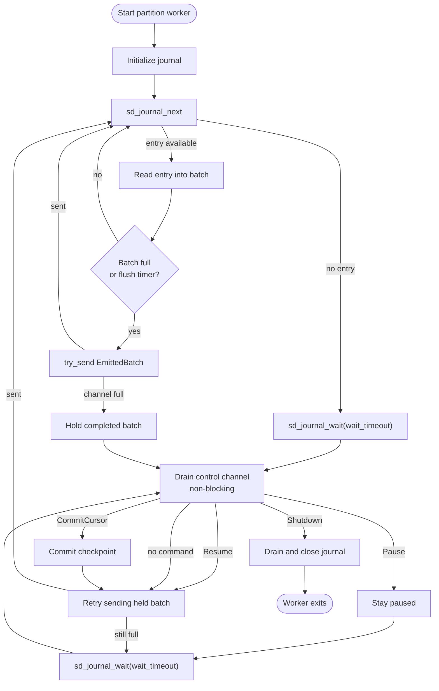

# Journald Receiver -- Design Doc

**Status:** Draft
**Tracking issue:** [#2858](https://github.com/open-telemetry/otel-arrow/issues/2858)
**Related epic:** [#2844 -- OTAP-native filelog receiver](https://github.com/open-telemetry/otel-arrow/issues/2844)
**Owner:** @lalitb

---

## 1. Background -- what is journald?

`systemd-journald` is the logging daemon on most modern Linux systems. It collects log records from the kernel, syslog, services started by systemd, and any process calling `sd_journal_send(3)`. It stores them in a structured binary format under `/var/log/journal/<machine-id>/*.journal` (or `/run/log/journal/...` if persistence is off).

Each journal entry is a **set of key/value fields**, not a line of text. Typical fields:

```
MESSAGE=Failed to start nginx.service
PRIORITY=3
_SYSTEMD_UNIT=nginx.service
_PID=4711
_HOSTNAME=web-01
_BOOT_ID=ab12...
__REALTIME_TIMESTAMP=1715000000000000
__CURSOR=s=abc;i=1f3;b=ab12;m=4d2;t=620a;x=88
```

Field name conventions:

| Prefix | Meaning |
|---|---|
| `MESSAGE`, `PRIORITY`, ... (no underscore) | User-supplied fields |
| `_PID`, `_UID`, `_SYSTEMD_UNIT`, ... | Trusted fields, set by journald based on the sender's process |
| `__CURSOR`, `__REALTIME_TIMESTAMP`, ... | Address fields, set by the journal itself |

Reading is done through the `sd-journal` C API (in `libsystemd.so`). It exposes:

- `sd_journal_open` -- open the journal.
- `sd_journal_add_match` -- push down filters (e.g. `_SYSTEMD_UNIT=nginx.service`).
- `sd_journal_seek_head` / `_seek_tail` / `_seek_realtime_usec` / `_seek_cursor` -- position.
- `sd_journal_next` -- advance to the next entry.
- `sd_journal_enumerate_data` -- read the fields of the current entry.
- `sd_journal_get_cursor` -- get an opaque resume token for the current entry.
- `sd_journal_wait` -- block (kernel inotify) until new entries arrive.

Key property for our design: the **cursor** is opaque, survives rotation, and is the right unit of resume. We never deal with `.journal` file offsets.

---

## 2. Goals and non-goals

### Goals

- Read systemd journal entries on Linux hosts and emit them as OTAP log records into the OTAP Dataflow Engine.
- Preserve native journal field names; do only a **minimal mechanical OTLP projection** (body / time / severity) -- see Sec. 7.
- Resume from the last acknowledged entry across restarts using the journal cursor.
- Honour downstream backpressure by pausing reads. Durability of un-read records is bounded by journald's own retention/vacuum policy -- the receiver does not buffer.
- Be designed so it can later plug into the [#2844](https://github.com/open-telemetry/otel-arrow/issues/2844) shared substrate (assignment extension, checkpoint envelope) without rework -- but **not** be blocked on #2844 landing first.

### Non-goals (initial implementation)

- Multi-namespace journal stores beyond the default system journal.
- NUMA-aware **pinning and co-location** (deferred). NUMA placement *metadata collection* -- `storage_path` and `storage_numa_node` exposed via metric labels and `PlacementHints` -- **is** in scope; see Sec. 8.
- Field renaming / OTel semantic-convention normalization (belongs in a processor).
- Non-Linux platforms (journald is Linux-only by definition).
- Forensic ingestion of `.journal` files copied off a host (separate feature).
- Replacing `systemd-journald` or listening on its submission socket.

---

## 3. Architecture

### 3.1 High-level placement

```
        (FUTURE -- when #2844 lands)
                        +----------------------------------------+
                        |  Discovery / Assignment Extension      |
                        |  (shared with filelog -- see #2844)     |
                        |                                        |
                        |  partition: "journal/<namespace>"      |
                        +-------------------+--------------------+
                                            | assign(partition)
                                            v
+------------------------------------------------------------------+
|  Journald Receiver (Linux only, per-core)                        |
|                                                                  |
|   For first PR: partitions come from static config               |
|   (default = ["journal/system"]). The receiver's internal        |
|   structure is partition-oriented so it can be migrated to the   |
|   #2844 assignment extension later without rework.               |
|                                                                  |
|   sd-journal API -> batch -> emit(batch_id, {first..last}_cursor)|
|                                ^                                 |
|                                | Ack/Nack(batch_id) -- see Sec. 3.3   |
+--------------------------------+---------------------------------+
                                 |
                                 v
                          bounded channel
                                 |
                                 v
                  +------------------------------+
                  |  Processors                  |
                  |  (parse / enrich / route /   |
                  |   normalize via OPL)         |
                  +--------------+---------------+
                                 v
                          +--------------+
                          |  Exporters   |
                          +------+-------+
                                 v
                              Ack/Nack
                                 |
                                 v
                  +------------------------------+
                  |  Checkpoint store            |
                  |  body: { partition: cursor } |
                  +------------------------------+
```

**Rule:** receiver does **only the minimal mechanical OTLP projection** (filling `body`, `time_unix_nano`, and `severity_number` from well-defined journal fields -- see Sec. 7). Everything else -- renames, JSON parsing, attribute remapping to semantic conventions, regex enrichment, drop rules -- lives downstream as processors. The PRIORITY -> severity mapping is included because OTLP `LogRecord` requires a `severity_number` field shape; we are projecting, not interpreting. This boundary is the explicit lesson from the Go contrib `journaldreceiver`, which embeds a Stanza pipeline and conflates reading with semantics.

### 3.2 Read loop

The loop runs entirely on the **blocking PartitionWorker thread** -- never on the async pipeline task (see Sec. 3.4). The only async-side interaction is the bounded MPSC the worker pushes completed batches into.



The worker never reads new entries while a batch is held. Control commands are
still serviced every `wait_timeout`, or sooner if retrying the held batch makes
progress. This bounds shutdown responsiveness even under sustained
backpressure.

Key idioms:

- `sd_journal_wait` is a blocking call. It runs on the per-partition blocking worker thread (see Sec. 3.4) -- never on the df-engine async pipeline task.
- **Backpressure = stop calling `sd_journal_next()`.** The receiver does not buffer beyond the in-flight batch. Pausing reads only stops the receiver from advancing its own read position -- it does **not** make journald hold onto records. Entries remain available to the receiver only as long as journald's retention/vacuum policy keeps them. `/run/log/journal` is volatile (lost on reboot if persistence is off), and even persistent journals vacuum old data under `SystemMaxUse=` / `SystemMaxFiles=` pressure. If the cursor falls behind retention, entries are lost from the receiver's perspective; we surface this via the `journald.cursor_lost` metric and lag metrics (Sec. 8).
- Filters that map directly to journald fields push down via `sd_journal_add_match` for source-side filtering. `sd_journal_add_match` is **field=value equality** with documented OR/AND/disjunction grouping (multiple matches on the same field = OR; different fields = AND; `sd_journal_add_disjunction` for explicit OR groups). The receiver expands `priorities: [0..6]` or `max_priority: "info"` into `PRIORITY=0` ... `PRIORITY=6` matches at startup. Anything richer than what journald's match API can express stays in a processor.

### 3.3 Ack-based checkpoint

Each emitted batch carries a **range** of cursors (first and last entry in the batch), not just the last. The committed checkpoint is the **highest cursor for which all preceding batches on this partition have been Ack'd** -- i.e., a contiguous-Ack tracker. This is required because routing or downstream parallelism can cause batches to Ack out of order; committing the most recent Ack'd cursor would skip earlier un-Ack'd records on a crash.

```
emit(batch, range = { first_cursor, last_cursor })

  Per partition, maintain:
     committed_cursor  : last contiguously Ack'd cursor on disk
     pending           : ordered list of in-flight batch ranges (first, last, status)

  On Ack(batch_id):
     mark pending[batch_id] = Acked
     while pending.front().status == Acked:
         committed_cursor = pending.pop_front().last_cursor
     if committed_cursor advanced:
         checkpoint.commit(partition, committed_cursor)   // atomic, fsync

  On Nack(batch_id):
     mark pending[batch_id] = Nacked
     // committed_cursor does NOT advance past this batch
     // policy: drop pending tail and re-seek to committed_cursor + 1 on next read
     //         (alternative: configurable retry-in-place; out of scope for first PR)

  Restart:
     cursor = checkpoint.load(partition)
     sd_journal_seek_cursor(cursor); sd_journal_next()   // skips the already-Ack'd entry
```

**State diagram for a single batch:**

```
                          emit(batch_id, range)
                                  |
                                  v
                          +---------------+
                          |   Pending     |
                          +---+-----+-----+
                              |     |
                       Ack    |     |  Nack
                              v     v
            +----------------------+   +---------------------+
            |  Acked, awaiting     |   |       Nacked        |
            |  contiguous front    |   +------+--------------+
            |                      |          |
            | at front?            |          | rewind:
            |   no  -> stay here    |          |   if committed_cursor.is_some():
            |         (earlier     |          |     seek_cursor(committed_cursor)
            |          batches in  |          |   else:
            |          this same   |          |     apply initial_anchor (Sec. 11.10)
            |          state or    |          |
            |          Pending)    |          |
            |   yes -> v            |          | drop pending tail
            +---------+------------+          | epoch += 1 (post-MVP)
                      |                       |
                      v                       |
            +----------------------+          |
            |  Acked, awaiting     |          |
            |  checkpoint commit   |          |
            +----------+-----------+          |
                       |                      |
            issue CommitCursor on             |
            control channel (async -> worker)  |
                       |                      |
                       v                      |
            +----------------------+          |
            |  Commit in flight    |          |
            +----------+-----------+          |
                       |                      |
              +--------+--------+             |
              v                 v             |
        Ok(cursor)         Err(io_kind)       |
              |                 |             |
              v                 v             |
   advance committed   stay in "awaiting      |
   cursor; pop range   commit"; async-side    |
   from front;         retry with backoff     |
   credit returned     (Sec. 11.2b lifecycle).    |
   to worker           After max_consec.      |
                       failures -> Failed.     |
                                              v
                                  reader resumes from
                                  committed_cursor + 1
                                  (or initial_anchor)
```

The intermediate **"Acked, awaiting contiguous front"** state is the visible expression of out-of-order Acks: a later batch can sit there indefinitely while an earlier batch is still `Pending`. Only when its predecessor pops does it advance to "awaiting checkpoint commit."
```

The invariant is simple: **on-disk `committed_cursor` and in-memory `committed_cursor` advance together, and never past a non-Ack'd batch.** Out-of-order Acks land in the `Acked` state but do not advance the front until everything in front of them is also `Acked`.

**MVP simplification (first PR):** to keep the first implementation small, we may bound `max_in_flight_batches_per_partition = 1` so the contiguous tracker degenerates to "Ack of the one in-flight batch commits its last_cursor." The data structure stays in place so lifting the bound later is purely a config change. This is called out explicitly as a config knob (Sec. 6).

**Note for `max_in_flight > 1` (post-MVP):** when a Nack triggers a rewind, all batches issued *after* the Nack'd one are stale -- the reader will re-emit those records under new `batch_id`s. The pending tracker carries a per-partition **epoch** (incremented on each rewind); completions whose `batch_id` belongs to a prior epoch are dropped on arrival rather than mutating the tracker. Not needed at `max_in_flight = 1` since there are no later-than-Nack'd batches.

Delivery guarantee: **at-least-once**. On Nack/crash, the next run replays from `committed_cursor + 1`.

### 3.4 Execution model -- blocking <-> async bridge

All `sd_journal_*` calls are **synchronous** and may block (notably `sd_journal_wait`, but also any I/O-touching call). So is checkpoint commit (`write` / `fsync` / `rename`). Both run **only** inside a single-owner blocking partition worker, **never** on the df-engine per-core async pipeline task.

```
              +--------------------------------------------------------+
              |  ASYNC RECEIVER TASK   (runs on df-engine pipeline)    |
              |                                                        |
              |   - owns EffectHandler                                 |
              |   - emits OTAP batches downstream                      |
              |   - receives Ack/Nack(batch_id) from pipeline          |
              |   - drives partition lifecycle FSM                     |
              |   - holds the contiguous-Ack tracker (in-memory)       |
              |   - **never** calls sd_journal_* or writes checkpoint  |
              +--------+---------------------------------^-------------+
                       |                                 |
                       |  control: Pause / Resume /      |  data: EmittedBatch
                       |           Shutdown /            |        { batch_id,
                       |           CommitCursor(cur)     |          first_cursor,
                       |  (bounded MPSC, async->worker)   |          last_cursor,
                       |                                 |          records }
                       |                                 |  (bounded MPSC,
                       |                                 |   worker->async)
                       |                                 |
              +--------v---------------------------------+-------------+
              |  BLOCKING PARTITION WORKER  (dedicated OS thread)      |
              |                                                        |
              |   sole owner of sd_journal* handle                     |
              |                                                        |
              |   read path:                                           |
              |     sd_journal_next  /  _wait(wait_timeout)            |
              |     sd_journal_enumerate_data                          |
              |     sd_journal_get_cursor                              |
              |     -> push EmittedBatch on bounded MPSC                |
              |     -> if MPSC full: stop _next, only bounded _wait     |
              |                                                        |
              |   commit path (triggered by CommitCursor command):     |
              |     ONE attempt only. Worker is stateless re: retry.   |
              |     serialize envelope + body                          |
              |     write <path>.tmp                                   |
              |     fsync(<path>.tmp)                                  |
              |     rename(<path>.tmp, <path>)                         |
              |     reply Ok(cursor) | Err(io_kind) -> async task       |
              |     async owns: retry timer, counter, backoff, and     |
              |                 transition to Failed after N fails.    |
              |                                                        |
              |   shutdown:                                            |
              |     observe Shutdown between bounded waits             |
              |     drain commits up to drain_timeout                  |
              |     sd_journal_close; thread exits                     |
              +--------------------------------------------------------+
```

Rules:

- **`sd_journal_*` never on the async loop.** The async receiver task does not import or call any `sd-journal` symbol.
- **Read-credit model.** The async task issues read credits to the worker; the worker may finalize and send a batch only when it holds a credit. `max_in_flight_batches_per_partition` is the total credit ceiling and counts **every** batch in any non-terminal state at the same time. There are **five** such states for a single batch:

  1. **Building** -- worker is incrementally calling `sd_journal_next` and accumulating records (journal cursor has advanced past these entries).
  2. **Held** -- worker has finalized the batch but `try_send` to the data MPSC failed; held in the single-slot pending-send buffer.
  3. **Queued** -- sitting in the bounded data MPSC, not yet drained by the async task.
  4. **In-flight downstream** -- async has received it and emitted to the pipeline; no Ack/Nack yet.
  5. **Acked, awaiting checkpoint commit** -- Ack received but the contiguous-Ack tracker has not yet been able to commit (e.g. blocked behind earlier still-Pending ranges, or a commit retry is in progress).

  The async task returns a credit only when a batch leaves all five states -- i.e. when its range has been incorporated into the on-disk `committed_cursor`, **or** when it was Nack'd and the rewind has truly discarded all batches in its epoch (so they will be re-built under a new epoch and counted fresh).

  **The data-MPSC capacity is independent of the credit ceiling.** Channel-full is *one* possible reason the worker stops finalizing batches; running out of credits is another. They can occur independently -- for example, the channel may be empty but credits = 0 because emitted batches are sitting Acked-awaiting-commit. The worker checks credits **before** trying to finalize a batch; if credits = 0 it does not call `sd_journal_next`, even if the MPSC has space.

- **Bounded MPSC** worker -> async carries completed `EmittedBatch { batch_id, first_cursor, last_cursor, records }`. The worker still does bounded `sd_journal_wait` calls so it can observe shutdown / resume commands within `wait_timeout`.
- **Bounded MPSC** async task -> worker carries control commands: `Pause`, `Resume`, `Shutdown`, `CommitCursor(cursor)`, and `GrantCredits(n)`.

  **Deadlock avoidance.** The control channel is sized for the worst-case command burst the async task can issue between two worker poll points: at most one `Pause`, one `Resume`, one `Shutdown`, one in-flight `CommitCursor`, plus a small slack for credit grants. A capacity of 8 covers this with margin (config: `control_channel_capacity`, default 8). The async task uses `try_send` for control messages and treats a full control channel as a logic bug (it should be impossible if the worker is making progress); on full it logs and falls back to a bounded `send` with timeout, surfacing partition-stalled if exceeded.

  **The worker must poll the control channel** at every yield point, not only when idle:
  - between bounded `sd_journal_wait` calls (the always-present poll),
  - between retries of a Held batch's `try_send`,
  - between `sd_journal_next` calls when the data MPSC is draining quickly,
  - immediately on entering or leaving Held state.

  This guarantees that `Pause`, `Shutdown`, and `CommitCursor` are observed within `wait_timeout` even when the worker is in a tight retry loop -- preventing the case where a worker stuck retrying `try_send` ignores a `Shutdown` indefinitely.
- **Checkpoint I/O runs on the worker thread; checkpoint *lifecycle* runs on the async task.** The split is strict:
  - **Worker:** receives `CommitCursor(cursor)`, performs **one** attempt at `write tmp -> fsync -> rename`, replies `Ok(cursor)` or `Err(io_kind)`. Stateless. No retry counter, no backoff, no failure threshold -- those are not the worker's job.
  - **Async task:** owns the retry counter, the backoff timer, the consecutive-failure threshold, the `Failed` state transition, and the contiguous-Ack tracker. On `Err`, the async task waits the backoff (via `tokio::time::sleep`, not a blocking sleep on the worker), increments the counter, and re-issues `CommitCursor` for the same target. On consecutive failures >= `max_consecutive_failures`, async transitions the partition to `Failed` and stops issuing new commits.
  - **Coalescing:** if multiple Acks land while a commit is in flight, the async task may coalesce them into a single follow-up `CommitCursor` carrying the latest contiguous cursor -- the worker never sees a queue of stale commit requests.
  - In-memory `committed_cursor` advances **only** after the async task receives `Ok(cursor)` from the worker -- preserving the Sec. 11.2b invariant.

  This keeps the worker's job a single linearizable stream of blocking I/O and puts every async-natured concern (retry, timer, FSM) on the async task where `tokio::time` and the lifecycle FSM already live.
- **Reader thread per partition.** With one partition per host (the common case), this is one OS thread per receiver instance. Cheap.
- **Shutdown is cooperative; pause/shutdown responsiveness is bounded by `wait_timeout`.** The worker only checks the shutdown / pause flag between bounded `sd_journal_wait` calls, so the worst-case latency from the async task issuing `Shutdown` (or `Pause`) to the worker observing it is `wait_timeout`. **Invariant:** `drain_timeout > wait_timeout` -- config validation rejects setups that violate this, since otherwise the drain deadline could fire before the worker has even had a chance to observe shutdown. Default values (`wait_timeout = 1s`, `drain_timeout = 5s`) satisfy this with margin. Async task `join`s the worker thread before transitioning the partition to `Released`.

---

## 4. Transport choice

### 4.1 Decision

Use the [`systemd`](https://crates.io/crates/systemd) Rust crate, which provides safe FFI bindings to `libsystemd.so`. Calls go directly into the documented `sd-journal` API.

### 4.2 Alternatives considered

| Option | Verdict | Why |
|---|---|---|
| **`systemd` crate (FFI to libsystemd)** | **Chosen** | Real `sd_journal_wait` (kernel inotify), source-side `add_match`, native cursor, mature crate. Cost: `libsystemd-dev` build dep, `unsafe` blocks inside the crate. |
| Exec `journalctl -o json --after-cursor=... --follow` (Go contrib's approach) | Rejected | Subprocess + JSON-per-entry doesn't fit per-core hot path; backpressure across pipe boundary is awkward; restart-on-exit loops are a smell. Suitable only as a no-FFI fallback. |
| `libsystemd` crate (pure Rust, despite the name) | Rejected (for now) | Re-implements parts of systemd in pure Rust -- appealing (no C dep), but lacks complete `sd_journal_wait` semantics and tracks systemd's on-disk format versions. Worth re-evaluating later. |
| `systemd-journal-gatewayd` over HTTP + [`journald-parser`](https://crates.io/crates/journald_parser) | Rejected | Requires extra daemon and HTTP port; polling only; same per-entry parse cost as `journalctl`. Useful for *remote* collection (out of scope). |
| Direct binary `.journal` file parsing (rjournald-style) | Rejected | Couples us to systemd's internal binary format versions; re-implements rotation/multi-file merging / `_wait`. Wrong abstraction layer. |
| Listening on the journald submission socket | Rejected | That's a journald *replacement*, not a client. Loses everything systemd does between submission and storage. |

### 4.3 Why we diverge from the Go contrib receiver

The contrib `journaldreceiver` is a thin Stanza adapter that **execs `journalctl`** and embeds a Stanza operator chain in the receiver. Two reasons we don't follow it:

1. The exec model has avoidable per-entry overhead and backpressure friction. We're optimizing for OTAP-dataflow's per-core hot path.
2. Mixing parse/enrich into the receiver is exactly the anti-pattern #2844 calls out. We keep the receiver dumb and push semantics to processors.

---

## 5. Future integration with #2844 (not a first-PR blocker)

The current extension system is pipeline-scoped Phase 1 (see [`extension-system-architecture.md`](./extension-system-architecture.md)) -- there is **no engine-level assignment coordinator yet**. #2844 proposes one for filelog. This section captures what journald would *want* from that contract so the receiver can plug into it later, but the first implementation does not depend on any of it landing.

**First-PR posture:**

- Static partition list from receiver config (default `["journal/system"]`).
- Local checkpoint file per partition under a configurable directory (default: engine state dir).
- Internal abstraction is partition-oriented (`PartitionId`, `PartitionReader`) so swapping a static list for an extension-driven assignment stream is a localized change.

The sketches below are **proposals to discuss with @lquerel / @jmacd** when #2844 is being designed; they are not commitments and not preconditions.

### 5.1 Assignment extension trait (sketch)

```rust
trait AssignmentExtension {
    /// Stable identifier for a unit of work.
    /// filelog: "file/<virtual_partition>"
    /// journald: "journal/<namespace>"
    type PartitionId: Eq + Hash + Display;

    /// Stream of partition assignment changes for the local instance.
    fn subscribe(&self, instance: InstanceId) -> impl Stream<Item = AssignmentEvent<Self::PartitionId>>;

    /// Acknowledge that the local instance has taken (or released) a partition.
    fn ack_assignment(&self, partition: Self::PartitionId, state: AssignmentState);
}

enum AssignmentEvent<P> { Acquire(P), Release(P) }

/// Optional placement metadata carried with an assignment.
/// First PR ignores this; the contract should not preclude it.
struct PlacementHints {
    /// Filesystem path backing the partition's storage, when knowable.
    /// (filelog: file path; journald: journal directory)
    storage_path: Option<PathBuf>,
    /// NUMA node of the storage device, when discoverable.
    storage_numa_node: Option<u32>,
    /// Cores the assigner prefers for this partition.
    preferred_cores: Option<Vec<CoreId>>,
}
```

Journald-specific notes:

- Default deployment: one partition per journal namespace. Most hosts have exactly one (`journal/system`).
- Discovery is trivial -- for journald the receiver itself enumerates namespaces; the assignment layer's job is placement and handoff, not discovery. This is a useful asymmetry vs. filelog and is worth surfacing in the trait shape (e.g. partitions can come from receiver config *or* from a discovery callback).

### 5.2 Checkpoint envelope (per @AaronRM's #2844 proposal -- PROVISIONAL)

> **WARNING:** **Provisional format.** The magic bytes, version field, and exact byte layout shown below are this receiver's *first-PR* choice. They are intentionally compatible with the shape proposed for #2844, but #2844 has not yet frozen its shared envelope. **When #2844 lands the canonical envelope, this receiver will adopt it.** That migration is expected to be:
>
> - same magic bytes, same wire layout -> no migration needed (zero-cost adoption);
> - different envelope -> this receiver ships a **one-time on-disk migration**: on startup, if the file's magic matches the provisional format, read+parse, re-serialize in the new format, write atomically, then proceed normally. This is straightforward because the body (partition_id -> cursor) is small and the migration is idempotent.
>
> Operators who never run the receiver against a #2844-shared envelope will only ever see the provisional format. Operators upgrading after #2844 lands will see the migration once and then never again. The provisional format's `version` field is set to a value (e.g. `0xFFFE`) explicitly outside the range #2844 will use, so detection is unambiguous.

```
+----------------------------------------------+
| magic    : "GSDC" (4 bytes)                  |
| version  : u16                               |
| header_size : u16                            |
| crc32    : u32                               |
| body     : opaque, format per-receiver       |
+----------------------------------------------+

Write protocol:
  write to <path>.tmp
  fsync(<path>.tmp)
  rename(<path>.tmp, <path>)        // atomic
```

Body shape:

| Receiver | Body |
|---|---|
| filelog  | `{ file_identity -> byte_offset }` |
| journald | `{ partition_id -> opaque cursor string }` |

### 5.3 Ack semantics

Mirrors Sec. 3.3 -- see that section for the full algorithm. Summary:

| Event | Action |
|---|---|
| Batch emitted | `batch_id` + range `{ first_cursor, last_cursor }` |
| `Ack(batch_id)` | mark range `Acked`; advance `committed_cursor` through contiguously-Ack'd ranges from the front of the per-partition pending queue; on advance -> atomic checkpoint write (fsync, rename) |
| `Nack(batch_id)` | mark range `Nacked`; `committed_cursor` does **not** advance past it; per `on_nack` config: rewind reader to `committed_cursor + 1` (default) or fail the partition |
| Restart | `cursor = checkpoint.load(partition); seek_cursor(cursor); next()` |
| Cursor not found (vacuumed) | log + metric `journald.cursor_lost`; fall back to `start_at` policy |

Out-of-order Acks are explicitly supported: a later batch's Ack does **not** advance the checkpoint past an earlier un-Ack'd batch.

---

## 6. Configuration

The receiver follows the repo's standard pipeline YAML (groups -> pipelines -> nodes, type-by-URN):

```yaml
version: otel_dataflow/v1
engine: {}
groups:
  default:
    pipelines:
      logs:
        nodes:
          journald_receiver:
            type: receiver:journald   # urn: urn:otel:receiver:journald
            config:
              # Partitions to read. Default: ["journal/system"].
              # When the #2844 assignment extension lands, this becomes optional.
              partitions:
                - id: "journal/system"
                  # Optional: explicit journal directory (otherwise system default)
                  # directory: "/var/log/journal"

              # Source-side filters (push down via sd_journal_add_match).
              # Multiple values within one field => OR. Different fields => AND.
              units: ["nginx.service", "ssh.service"]   # _SYSTEMD_UNIT in {...}
              identifiers: []                            # SYSLOG_IDENTIFIER in {...}

              # Priority filter -- exact-match list, NOT a range predicate.
              # journald `add_match` is field=value equality; "<= info" must be
              # expanded by the receiver into one match per included level.
              #
              # DEFAULT: all priorities 0..=7 (DEBUG included). DEBUG is NOT
              # silently dropped -- operators who want to drop debug logs must
              # set this explicitly (`priorities: [0,1,2,3,4,5,6]` or
              # `max_priority: "info"`). Rationale: dropping DEBUG by default
              # is a common cause of "where did my logs go?" support tickets.
              #
              # Either form is accepted:
              # priorities: [0, 1, 2, 3, 4, 5, 6, 7]
              # max_priority: "debug"             # shorthand: expands to [0..=7]

              # First-start policy when no checkpoint exists
              start_at: "end"           # "end" | "beginning" | RFC3339 timestamp

              # Batching
              batch:
                max_records: 1024
                max_flush_period: 200ms

              # Ack/checkpoint behavior
              checkpoint:
                # Checkpoint files live at:
                #   <directory>/<receiver_instance_id>/<partition_id>.cp
                # The receiver_instance_id segment is the receiver node's name
                # from the pipeline config (here: "journald_receiver"). This
                # avoids two engine instances or two journald receiver nodes
                # sharing a state dir from corrupting each other's cursors.
                directory: "${engine.state_dir}/journald"
                # MVP: 1 keeps the contiguous-Ack tracker trivial. Increase later
                # for higher throughput at the cost of more replay on crash.
                max_in_flight_batches_per_partition: 1
                # Behavior when a Nack is received
                on_nack: "rewind"       # "rewind" (re-seek to committed) | "fail"
                # Partition fails after this many consecutive commit-write errors (see Sec. 11.2b)
                max_consecutive_failures: 5
                # Async-side backoff between retries of the same CommitCursor (see Sec. 11.2b)
                commit_retry_backoff: 100ms

              # Optional: prefer the sender-supplied timestamp over journald's stamping clock
              prefer_source_timestamp: false  # see Sec. 7

              # Reader timing -- INVARIANT: drain_timeout > wait_timeout
              # (config validation rejects the inverse -- see Sec. 3.4 shutdown rule)
              wait_timeout: 1s          # finite sd_journal_wait timeout; bounds shutdown latency
              drain_timeout: 5s         # see Sec. 11.8

              # Control channel sizing (see Sec. 3.4 deadlock avoidance)
              control_channel_capacity: 8

              # Transient-error handling (see Sec. 11.5)
              transient_error:
                max_retries: 3
                backoff: 100ms

          processor:
            type: processor:opl
            # ... renames, semantic-conv mapping, JSON parsing live here ...

        connections:
          - from: journald_receiver
            to: processor
```

Anything beyond this -- message parsing, attribute renaming to OTel semantic conventions, log-level mapping past PRIORITY, drop rules -- belongs in a downstream processor.

---

## 7. Field mapping (receiver -> OTAP)

Minimal and mechanical -- this is the entire "OTLP projection" the receiver performs. PRIORITY -> severity is included because OTLP `LogRecord.severity_number` is a typed numeric field; representing it any other way would be a worse mismatch. Renames to OTel semantic conventions (e.g. `_SYSTEMD_UNIT` -> `service.name`) are explicitly **not** done here -- they belong in a downstream processor.

| OTAP field         | Source                                                                     |
|--------------------|----------------------------------------------------------------------------|
| `body`             | `MESSAGE` (string; binary bodies in initial PR are dropped + counter)      |
| `time_unix_nano`   | `__REALTIME_TIMESTAMP` (default -- set by journald, monotonic across the journal). Optional config `prefer_source_timestamp: true` switches precedence to `_SOURCE_REALTIME_TIMESTAMP` when present (set by the original sender -- useful for forwarded logs but can be skewed/spoofed). |
| `severity_number`  | `PRIORITY` mapped via the table below                                       |
| `attributes.*`     | every other native field, key verbatim (`_SYSTEMD_UNIT`, `_PID`, ...)       |
| internal meta      | `__CURSOR` (used as Ack token; not an attribute)                           |

A processor (later) can rename `_SYSTEMD_UNIT` -> `service.name`, parse `MESSAGE` as JSON, etc.

### PRIORITY -> SeverityNumber mapping

journald's `PRIORITY` follows syslog (RFC 5424) levels 0-7. OTel's `SeverityNumber` is a 24-value enum. The receiver applies the following fixed mapping:

| `PRIORITY` | syslog name | OTel `SeverityNumber` | Numeric |
|---|---|---|---|
| 0 | EMERGENCY | `SEVERITY_NUMBER_FATAL4`  | 24 |
| 1 | ALERT     | `SEVERITY_NUMBER_FATAL3`  | 23 |
| 2 | CRITICAL  | `SEVERITY_NUMBER_FATAL`   | 21 |
| 3 | ERROR     | `SEVERITY_NUMBER_ERROR`   | 17 |
| 4 | WARNING   | `SEVERITY_NUMBER_WARN`    | 13 |
| 5 | NOTICE    | `SEVERITY_NUMBER_INFO2`   | 10 |
| 6 | INFO      | `SEVERITY_NUMBER_INFO`    |  9 |
| 7 | DEBUG     | `SEVERITY_NUMBER_DEBUG`   |  5 |
| missing / invalid | -- | `SEVERITY_NUMBER_UNSPECIFIED` | 0 |

`severity_text` is set to the syslog name (`"EMERGENCY"`, `"ALERT"`, `"CRITICAL"`, `"ERROR"`, `"WARNING"`, `"NOTICE"`, `"INFO"`, `"DEBUG"`). Operators wanting different text or different numeric mapping (e.g. lifting `NOTICE` to `INFO3`) do so via a downstream processor.

### Binary `MESSAGE`

journald `MESSAGE` fields are usually UTF-8 strings but the protocol permits arbitrary bytes (e.g. processes that pass binary data through `sd_journal_send`). Behavior:

- **First PR:** if the OTAP `body` model in this repo only supports `String` / structured value variants (not raw bytes), the receiver **base64-encodes** the bytes into the body and sets attributes `_MESSAGE_ENCODING = "base64"` and `_MESSAGE_BYTE_LEN = <N>`. Raw bytes are **not preserved as raw bytes** in the first PR; downstream consumers wanting the original bytes must base64-decode using these attributes.
- **If/when OTAP `body` gains a native `Bytes` variant** (or this receiver wires through a `pdata-views` byte-body path), the receiver will switch to passing raw bytes through verbatim. This is a non-breaking change (string-bodied consumers can still detect the encoded form via the existing `_MESSAGE_ENCODING` attribute, which would simply be absent for the bytes path).

This is the only field where the receiver does encoding work; all other fields go through as native strings.

### Example

Input journal entry:

```
MESSAGE=Failed to bind 0.0.0.0:80
PRIORITY=3
_SYSTEMD_UNIT=nginx.service
_PID=4711
_HOSTNAME=web-01
__REALTIME_TIMESTAMP=1715000000000000
__CURSOR=s=abc;i=1f3;b=ab12;m=4d2;t=620a;x=88
```

OTAP record emitted:

```
LogRecord {
  body: "Failed to bind 0.0.0.0:80"
  time_unix_nano: 1715000000000000000
  severity_number: ERROR (17)
  attributes: {
    "_SYSTEMD_UNIT": "nginx.service",
    "_PID":          "4711",
    "_HOSTNAME":     "web-01",
    "PRIORITY":      "3",
  }
}
// Per-batch completion handle (one batch may contain many records):
completion: {
  batch_id:     0x4f2,
  first_cursor: "s=abc;i=1f0;b=ab12;m=4cf;t=620a;x=85",
  last_cursor:  "s=abc;i=1f3;b=ab12;m=4d2;t=620a;x=88",
}
```

---

## 8. Concurrency, placement, and lifecycle

- One reader per assigned partition, owning a single `sd_journal*` handle. Most hosts -> one partition -> one reader.
- The reader runs on a **dedicated OS thread** that exclusively owns the journal handle. We do **not** use `tokio::task::spawn_blocking` -- `sd_journal_wait` can park for `wait_timeout` at a time and would tie up a Tokio blocking-pool worker for the partition's entire lifetime; a dedicated `std::thread` makes ownership explicit, the cost is one OS thread per partition (cheap; usually one), and it removes any coupling to the Tokio blocking-pool size config. The handle is **not** touched from any other task -- closing `sd_journal*` from elsewhere to "cancel" a `wait` is not a supported pattern and is not relied on in this design.
- `sd_journal_wait` is always called with a **finite timeout** (default 1s, config `wait_timeout`). The reader loop checks a shutdown flag (atomic bool / `tokio::sync::Notify`) between waits. Shutdown / partition release: set the flag, the reader returns from the next wait (<= `wait_timeout`), drains any in-flight batch per the partition lifecycle below, then calls `sd_journal_close` itself before exiting.
- Backpressure pause is implemented the same way: a control channel from the emit-side signals "pause"; the reader stops calling `sd_journal_next` and instead does bounded `sd_journal_wait` calls until told to resume (or until shutdown).
- Multi-namespace hosts: one partition per namespace; future assignment extension distributes them across cores. First PR: static partition list.
- **NUMA placement** (per #2844 / kamilon): the receiver records `storage_path` for each partition (the journal directory it's reading from) and, when discoverable on Linux, the storage device's NUMA node -- exposed via metric labels and via `PlacementHints` if/when assignment integration lands.

  **NUMA discovery procedure (Linux, first PR):**

  ```
  1. resolve storage_path to the absolute realpath of the journal directory
     (default: /var/log/journal/<machine-id> for persistent, /run/log/journal/<machine-id> for volatile)
  2. statfs(realpath) -> identify the backing filesystem type
  3. if fstype is one of {tmpfs, overlay, fuse, ramfs, nfs, cifs, 9p}
        -> storage_numa_node = Unknown(reason = fstype)
        -> return
  4. if path is a bind mount (compare /proc/self/mountinfo)
        -> storage_numa_node = Unknown(reason = "bind_mount")
        -> return
  5. find the backing block device:
       a. parse /proc/self/mountinfo to get the mount source for the path
       b. resolve major:minor via stat(); follow /sys/dev/block/<maj>:<min>
       c. for partitions, walk up to the parent block device
  6. read /sys/block/<dev>/device/numa_node
        -> if file missing or value < 0  -> Unknown(reason = "no_numa_info")
        -> otherwise                      -> storage_numa_node = Some(value)
  7. on any I/O error during steps 1-6 -> Unknown(reason = "discovery_error")
  ```

  All `Unknown(reason = ...)` outcomes are surfaced as a structured value (not silently elided), so the metric label distinguishes "no NUMA info on this hardware" from "we couldn't tell because of a bind mount." Discovery runs **once at partition startup**; not periodically. If the journal directory is migrated at runtime (rare), discovery is not re-run until restart.

  **What the first PR guarantees:** placement *hints are observable* (path + NUMA node, or a labeled `Unknown` reason) so a future scheduler can act on them.

  **What the first PR does NOT guarantee:** NUMA-local reads, NUMA-local memory allocation for the reader, thread pinning of the partition worker, or co-location of the worker with the per-core async pipeline task. journald reads go through `libsystemd` -> kernel page cache -> user-space copies; if the worker thread runs on a different NUMA node than the storage device or the consuming pipeline instance, cross-node memory traffic will occur. The future NUMA-aware design should co-locate `journal storage NUMA node -> partition worker thread -> per-core pipeline instance`, but that is a scheduler/extension concern, not this receiver's responsibility today.

```
   FIRST PR -- placement is observable, not enforced
   -------------------------------------------------

   /var/log/journal/<id>/  --> storage_path metric label
                          --> storage_numa_node (when discoverable)

   PartitionWorker thread  --> not pinned; runs wherever the OS schedules
   Async receiver task     --> runs on its assigned per-core pipeline instance

   Cross-node traffic possible. Receiver does not try to prevent it.

   FUTURE -- co-located with scheduler/extension support (post-#2844)
   ------------------------------------------------------------------

   +----------------------+    PlacementHints    +------------------------+
   |  Assignment ext      |  ------------------->|  Receiver / scheduler  |
   |  (storage_path,      |                      |                        |
   |   storage_numa_node, |                      |  pin worker to a core  |
   |   preferred_cores)   |                      |  on storage_numa_node  |
   +----------------------+                      |  route batches to a    |
                                                 |  pipeline instance on  |
                                                 |  the same node         |
                                                 +------------------------+

   Goal:   journal storage NUMA node
              |
              v
           PartitionWorker thread (pinned)
              |  bounded MPSC, intra-node
              v
           Per-core pipeline instance (same node)
```

Lifecycle states for a partition reader: `Idle -> Acquiring -> Reading <-> Paused (backpressure) -> Draining -> Released`. `Draining` waits for all in-flight batches to Ack/Nack (with deadline) before transitioning to `Released` and closing the journal handle.

### Receiver-emitted metrics

This table lists the **steady-state / primary** metrics. All failure-path and edge-case metrics (checkpoint corruption, handle reopens, stale completions, drain timeouts, per-entry malformations, etc.) are defined inline in Sec. 11. Implementations should expose both sets.

| Metric | Kind | Meaning |
|---|---|---|
| `journald.entries_read` | counter | Entries successfully read from the journal |
| `journald.entries_emitted` | counter | Entries pushed downstream as OTAP records |
| `journald.batches_in_flight` | gauge | Per partition; should be <= `max_in_flight_batches_per_partition` |
| `journald.checkpoint_committed_at_us` | gauge | Realtime of the last contiguously-Ack'd cursor |
| `journald.lag_entries` | gauge | Approximate entries between current cursor and journal tail |
| `journald.cursor_lost` | counter | Increments when `seek_cursor` fails (vacuumed past checkpoint) |
| `journald.nacks` | counter | Nacks received |
| `journald.read_paused_seconds` | counter | Time the reader spent paused under backpressure |

---

## 9. Build, platform, dependencies

- Module placement: `crates/core-nodes/src/receivers/journald_receiver/`. `host_metrics_receiver` is the precedent for a platform-conditional receiver in `core-nodes` (also Linux-leaning, also feature-gated), so we follow it rather than `contrib-nodes`.
- URN: **`urn:otel:receiver:journald`** (constant `JOURNALD_RECEIVER_URN`).
- `#[cfg(target_os = "linux")]` for the real implementation; non-Linux build registers a stub factory that returns `Error::PlatformUnsupported`.
- Cargo feature `journald` (off by default) so non-Linux builds and minimal images don't drag in `libsystemd`.
- Build dep on `libsystemd-dev` (Linux). Document in CI + Dockerfile.

---

## 10. Testing

The strategy is to abstract `sd-journal` behind a small reader trait so the bulk of the logic is testable without a real journal:

```rust
trait JournalReader {
    fn open(opts: &OpenOptions) -> Result<Self> where Self: Sized;
    fn add_match(&mut self, k: &str, v: &str) -> Result<()>;
    fn add_disjunction(&mut self) -> Result<()>;

    fn seek_cursor(&mut self, cursor: &str) -> Result<SeekOutcome>;  // Found | NotFound (vacuumed)
    fn seek_tail(&mut self) -> Result<()>;
    fn seek_head(&mut self) -> Result<()>;
    fn seek_realtime_usec(&mut self, ts: u64) -> Result<()>;
    fn previous(&mut self) -> Result<Option<()>>;

    fn next(&mut self) -> Result<Option<()>>;        // advance only -- no fields
    fn wait(&mut self, timeout: Duration) -> Result<WaitOutcome>;

    /// Read all fields of the current entry. Per-field failures are surfaced
    /// individually so tests can inject (e.g.) a get_cursor failure WITHOUT
    /// also failing enumerate_data, exercising the Sec. 11.4 split paths.
    fn enumerate_data(&mut self) -> Result<JournalFields>;
    fn get_cursor(&mut self) -> Result<String>;
    fn get_realtime_usec(&mut self) -> Result<u64>;

    fn close(self);
}
```

Two implementations: real `SdJournalReader` (Linux, `systemd` crate) and `FakeJournalReader` (in-memory, deterministic). The `FakeJournalReader` exposes per-method failure injection (one-shot or sticky) so tests can simulate, separately:

- `next()` succeeds, `enumerate_data()` fails (corrupt entry -- receiver should skip the entry and continue per Sec. 11.4).
- `next()` succeeds, `enumerate_data()` succeeds, `get_cursor()` fails (handle advanced but cursor unrecoverable -- receiver must discard partial batch and reopen+reseek per Sec. 11.4, never skip).
- `wait()` returns transient error (receiver loops per Sec. 11.5).

This separation matters because the Sec. 11.4 row for `get_cursor` failure has a different behavior than `enumerate_data` failure, and the test harness must be able to drive each path independently.

- **Unit (cross-platform, against `FakeJournalReader`) -- happy path:**
  - Field -> OTAP projection (body, time, severity).
  - Cursor round-trip and contiguous-Ack tracker (out-of-order Acks, mixed Ack/Nack, Nack-rewind).
  - Checkpoint envelope encode/decode (magic, version, CRC, atomic rename).
  - Backpressure: simulate downstream stall, assert reader stops calling `next()`.
  - Vacuumed-cursor recovery: `seek_cursor` returns "not found" -> fallback to `start_at` + `journald.cursor_lost` increments.
- **Unit -- negative / edge cases (one test per row in Sec. 11):**
  - Checkpoint corruption: bad magic / bad CRC / truncated / unknown version / malformed body -> factory fails closed; correct metric label.
  - Open failures: simulated `sd_journal_open` errors (permission, missing, unavailable) -> factory error, no `Reading` state.
  - `add_match` failure -> factory error.
  - Per-entry malformations: missing MESSAGE, binary MESSAGE, invalid UTF-8 field name/value, missing/invalid PRIORITY, missing timestamp, `get_cursor` failure -> record-level handling per Sec. 11.4 with metric assertions.
  - Filter-change restart: write checkpoint with one filter set, restart with a narrower / wider set, assert resume from existing cursor and `journald.filter_changed` info-level event on first batch.
  - `start_at` change with checkpoint present: assert checkpoint wins, `start_at` ignored.
  - Duplicate partition config: two journald receivers in the same engine process configured for the same partition -> second factory call returns `Error::Conflict`.
  - Transient API errors: inject `next()` errors -> bounded retry, then handle reopen + reseek; `journald.handle_reopens` increments.
  - Stale completion (post-MVP `max_in_flight > 1`): inject Ack/Nack with old epoch after rewind -> dropped, `journald.stale_completions` increments, tracker state unchanged.
  - Shutdown deadline: pending batches at deadline -> not committed, handle closes, `drain_timeout_exceeded` increments, restart replays from committed cursor.
  - `get_cursor` failure (Sec. 11.4): inject `get_cursor` error mid-batch -> partial batch discarded (not emitted), reopen + reseek to `committed_cursor`. Assert: **set of cursors emitted superset of set emitted by an injection-free baseline run** -- duplicates are *allowed* (at-least-once permits replay), drops are *forbidden*. Specifically, every entry that the baseline emitted must also appear in the failure-injection run; the failure-injection run may additionally re-emit entries that were in flight when the failure hit.
  - Runtime checkpoint write failure (Sec. 11.2b): inject I/O failure on `tmp` write / `fsync` / `rename` -> in-memory `committed_cursor` does not advance, retries succeed -> it does advance; after `max_consecutive_failures` -> partition `Failed`.
  - Lease release on factory failure (Sec. 11.6): cause `add_match` to fail after registration -> assert lease was released (re-creating the same partition succeeds, no `Conflict`).
  - Rewind with no committed cursor (Sec. 11.10): trigger Nack on the very first batch -> reader applies `initial_anchor`, not a stale or default value; `journald.rewind_to_initial_anchor` increments.
  - Empty-journal `start_at: end` (Sec. 11.10): start with no entries, write an entry, assert it is **emitted** (not skipped); Nack the first batch before any commit, write more entries, assert the first entry appears in the replay (duplicate is acceptable, drop is not).
  - Worker thread panic (Sec. 11.8b): inject a panic in the `FakeJournalReader` `next()` -> partition transitions to `Failed`, lease released (next register succeeds), `journald.worker_panics` increments; in-flight batches are not Ack-advanced.
  - Control-channel responsiveness while batch is Held (Sec. 3.4 / Sec. 3.2): drive `Held` state by stalling the data MPSC consumer, then send `Shutdown` on control channel -> assert worker observes it within `wait_timeout` (with margin) and exits cleanly.
  - PRIORITY -> SeverityNumber mapping (Sec. 7): one assertion per row, including NOTICE -> INFO2 and missing/invalid -> UNSPECIFIED.
  - Default priority filter (Sec. 6): with no `priorities` / `max_priority` configured, assert DEBUG-level entries are emitted (regression guard against silent drop).
  - Bad field-name classification (Sec. 11.4): inject field names matching each `reason=` label, assert the metric is bumped with the right label and the entry's other fields still emit.
  - NUMA discovery (Sec. 8) -- Linux smoke: tmpfs path -> `Unknown(reason="tmpfs")`; bind-mounted dir -> `Unknown(reason="bind_mount")`; on a NUMA-aware host with persistent `/var/log/journal` -> some node value emitted.
  - Checkpoint envelope migration (Sec. 5.2): write a file with the provisional magic+version, restart receiver simulating "post-#2844 envelope adoption" mode -> assert the on-disk file is rewritten in the new format atomically and the cursor is unchanged.
- **Linux smoke (CI Linux job, real journald):**
  - Inject entries via `sd_journal_send`, assert end-to-end.
  - Restart resume: emit N entries, Ack first M, kill receiver, restart, assert resume from M+1.
  - Live tailing under load (`sd_journal_wait` integration).
  - `add_match` with multiple `PRIORITY=N` values (verify journald's documented OR-on-same-field semantics matches our expansion of `max_priority`).

Sandbox journals via `SYSTEMD_JOURNAL_PATH=` / rootless journald are referenced as a *target* for the smoke job but treated as a CI-engineering subtask, not a design assumption.

---

## 11. Failure handling and edge cases

This section is the contract for "what happens when things go wrong." Each row defines a behavior, a metric, and whether it is fatal (partition fails / receiver fails to start) or recoverable.

### 11.1 Startup failures

| Condition | Behavior | Metric | Severity |
|---|---|---|---|
| `sd_journal_open` fails (no systemd, missing `/var/log/journal`, container restrictions) | Receiver factory returns `Error::Unavailable` with cause; receiver never enters `Reading`. **Not** treated as an empty stream. | `journald.open_failures` | Fatal at startup; partition stays in `Idle` and the engine surfaces the error per its standard receiver-startup path. |
| Permission denied opening journal directory | Same as above. | `journald.open_failures{reason="permission"}` | Fatal at startup. |
| `journald` Cargo feature off, or non-Linux platform | Factory registers a stub that returns `Error::PlatformUnsupported` at construction. | -- | Fatal at startup. |
| `add_match` fails for any configured filter | Treated as configuration error. | `journald.add_match_failures` | Fatal at startup. |
| Checkpoint directory unreadable / unwritable | Fatal at startup. | `journald.checkpoint_io_errors{op="open"}` | Fatal. |

### 11.2 Checkpoint load (startup)

On startup, `checkpoint.load(partition)` is called. Outcomes:

| Outcome | Action | Metric |
|---|---|---|
| File absent | Use `start_at` policy. | `journald.checkpoint_missing` |
| Magic bytes mismatch | **Fail closed** (refuse to start partition). Operator must remove the file. | `journald.checkpoint_corrupt{reason="magic"}` |
| CRC mismatch | **Fail closed**. | `journald.checkpoint_corrupt{reason="crc"}` |
| Truncated / shorter than `header_size` | **Fail closed**. | `journald.checkpoint_corrupt{reason="truncated"}` |
| Unknown / future version | **Fail closed**. | `journald.checkpoint_unsupported_version` |
| Body missing / malformed (e.g. empty cursor string) | **Fail closed**. | `journald.checkpoint_corrupt{reason="body"}` |
| Valid envelope, valid cursor | Proceed to `seek_cursor`. | -- |

Rationale for fail-closed: silent fallback to `start_at` would skip data on operator error and is harder to debug than a startup failure. Operators can recover by deleting the file (then the next start applies `start_at`).

### 11.2b Checkpoint commit (runtime)

`checkpoint.commit()` runs on every contiguous-Ack advance. Failure modes:

| Outcome | Action | Metric |
|---|---|---|
| Write to `<path>.tmp` fails (disk full, permission, I/O error) | Worker replies `Err`; in-memory `committed_cursor` does not advance; Ack'd batches stay at the head of `pending`. The **async task** waits `commit_retry_backoff` (default 100ms) and re-issues `CommitCursor` for the same (or a coalesced higher) contiguous cursor. It does **not** wait for another Ack to arrive -- Ack'd ranges already entitle the cursor to advance. | `journald.checkpoint_io_errors{op="write"}` |
| `fsync(<path>.tmp)` fails | Same as write failure. | `journald.checkpoint_io_errors{op="fsync"}` |
| `rename(<path>.tmp, <path>)` fails | Same as write failure. | `journald.checkpoint_io_errors{op="rename"}` |
| Repeated commit failure exceeds `checkpoint.max_consecutive_failures` (default 5) | **Partition transitions to `Failed`.** Reading stops; emitting stops; in-flight batches are not Ack-advanced. The receiver-level error is surfaced and the operator must intervene. | `journald.partition_failed{reason="checkpoint_io"}` |
| Commit succeeds | Advance `committed_cursor` to the new value. Pop Ack'd ranges from `pending` front. | -- |

**Invariant:** `committed_cursor` (in-memory) and the on-disk checkpoint are advanced **together** -- never one before the other. The reader is allowed to keep reading new entries while a commit is in flight (they go into new pending batches under the same epoch); what is forbidden is advancing in-memory state past what reached disk, because a crash then would lose Ack'd-but-not-persisted records on replay.

**Retry-group lifecycle (between commit attempts and partition failure):**

```
attempt N fails -> consecutive_failures += 1
                 -> if consecutive_failures < max_consecutive_failures:
                     schedule next attempt after commit_retry_backoff (async timer)
                     state = "Reading (commit-deferred)"
                       -- reader keeps reading new entries
                       -- new Acks land in pending and are coalesced
                         into the next CommitCursor target
                       -- emit metric `journald.commit_retry_pending = consecutive_failures`
                 -> else:
                     state = "Failed"
                     stop reading; stop emitting
                     all in-flight pending batches remain un-Ack'd from the
                       checkpoint's perspective -> on next start they are replayed
                     emit `journald.partition_failed{reason="checkpoint_io"}`

attempt N succeeds (any attempt before threshold):
                 -> consecutive_failures = 0
                 -> committed_cursor advances; pop Ack'd ranges from pending
                 -> state returns to plain "Reading"
```

So while consecutive failures < threshold, the partition stays alive and keeps reading; only the *checkpoint* is stuck. Crashing in this window means replay from the last successful commit, which is the correct at-least-once behavior.

### 11.3 Cursor seek and config-change behavior

| Condition | Behavior | Metric |
|---|---|---|
| `seek_cursor(cursor)` returns "not found" (vacuumed past) | Log + `journald.cursor_lost`; apply `start_at`. | `journald.cursor_lost` |
| `seek_cursor` succeeds but `next()` returns no matching entry (entry filtered out by changed match rules) | Continue forward; cursor advances normally on next match. The committed checkpoint already represents "everything up to and including this cursor was Ack'd," so this is correct: we do not replay filtered-out records. | -- |
| Configured filters changed since last run (`units`, `priorities`, `identifiers`) | Resume from the existing committed cursor. The cursor is partition-local and **does not** include filter identity. **Filter changes are explicitly non-retroactive in both directions:** narrowing simply stops emitting newly-excluded records from the cursor forward; widening starts emitting newly-included records from the cursor forward. **There is no backfill** -- records that pre-date the committed cursor and were excluded under the old filter set are not replayed under the new one. Operators who need backfill must delete the checkpoint (re-seek per `start_at`) or use a separate one-shot ingestion run. This is documented operator behavior, not surprising data loss. | `journald.filter_changed` (info-level on first batch after config change) |
| `start_at` changed since last run | Ignored -- `start_at` only applies when no checkpoint exists. Operator must delete the checkpoint to re-seek. | -- |
| Partition identity changed (different `id` in config) | Treated as a new partition with no checkpoint. Old checkpoint files are not auto-deleted. | -- |

### 11.4 Per-entry malformations

| Condition | Behavior | Metric |
|---|---|---|
| `MESSAGE` missing | Emit record with **unset** `body` (OTLP `body.value` field left absent). | `journald.entry_no_message` |
| `MESSAGE` is binary (non-UTF-8) | Emit `body` as a base64-encoded string of the raw bytes, plus attribute `_MESSAGE_ENCODING = "base64"` and `_MESSAGE_BYTE_LEN = <N>`. The bytes are **preserved** (downstream processors can decode if they know the format); we never silently lossily decode as UTF-8. | `journald.binary_message` |
| Field name violates journald native rules (per [Native Journal Protocol](https://systemd.io/JOURNAL_NATIVE_PROTOCOL/): non-ASCII, lowercase letters, embedded `=` outside the first delimiter, leading digit, or starts with `__` reserved prefix when not address-field) but the API still returned it | Skip that field, keep the rest of the entry, log at debug. The receiver does **not** attempt to sanitize or rename -- passing through invalid names risks downstream OTel attribute validators rejecting the whole record. | `journald.bad_field_name{reason="non_ascii" \| "embedded_equals" \| "reserved_prefix" \| "lowercase" \| "leading_digit" \| "other"}` |
| Field value not valid UTF-8 (non-`MESSAGE`) | Emit as base64 string with attribute suffix `_b64`, e.g. `_EXE_b64`. | `journald.bad_field_value` |
| `PRIORITY` missing | Set `severity_number = SEVERITY_NUMBER_UNSPECIFIED` (0). | `journald.priority_missing` |
| `PRIORITY` invalid (not 0-7) | Same as missing; log at debug. | `journald.priority_invalid` |
| `__REALTIME_TIMESTAMP` missing | Use receiver-observed wall-clock time; record attribute `_TIMESTAMP_SOURCE = "observed"`. | `journald.timestamp_missing` |
| `sd_journal_get_cursor` fails | **Cannot skip -- `next()` already advanced the handle, so dropping the entry would lose data and violate at-least-once.** Discard the partially-built batch (do not emit), close the handle, reopen, and `seek_cursor(committed_cursor)` to replay from the last Ack'd position (or apply `start_at` if no checkpoint exists yet -- see Sec. 11.10). If reopen fails repeatedly, partition transitions to `Failed` per Sec. 11.5. | `journald.cursor_get_failures`, `journald.handle_reopens{reason="cursor_get"}` |

### 11.5 Journal API transient errors

| API call | Error class | Behavior |
|---|---|---|
| `sd_journal_next` | Recoverable I/O error | Bounded retry (3x, 100ms backoff). On exhaustion: close handle, reopen, `seek_cursor(committed)`. |
| `sd_journal_next` | Fatal (handle invalidated) | Reopen + reseek as above. If reopen fails N consecutive times, partition transitions to `Failed`; receiver-level metric and log. |
| `sd_journal_wait` | EINTR / spurious wake | Loop. |
| `sd_journal_wait` | Other error | Same handling as `next` errors. |
| `sd_journal_enumerate_data` | Per-field failure | Skip the field; per Sec. 11.4. |
| `sd_journal_get_cursor` | Failure | Discard partial batch (do not emit), reopen + reseek per Sec. 11.4. Never skip -- `next()` already advanced the handle, so skipping would lose the entry. |

Reopens emit `journald.handle_reopens` (counter) and the partition records its `last_reopen_at`. Repeated reopens within a short window are surfaced via `journald.handle_reopen_storms`.

### 11.6 Duplicate partition ownership

The first PR uses static partitions and **no** assignment coordinator. To prevent two receivers in the same engine from reading the same partition and producing duplicates:

- At receiver-factory time, the receiver registers its `(partition_id, journal_directory_or_namespace)` tuples in an **engine-process-local** registry (a simple `Mutex<HashSet<...>>` shared across journald receiver instances in the same process). Registration returns an RAII **lease** (`PartitionLease`) bound to the receiver's lifetime.
- Duplicate registration -> factory error: `Error::Conflict("partition X already owned by receiver Y")`.
- **Lease release** -- the partition is removed from the registry on every exit path:
  - **Factory failure after registration** -- the lease's `Drop` impl releases on the way out (e.g. if `add_match` fails, the lease the factory acquired earlier is dropped before the factory returns its error). This is what avoids false `Error::Conflict` on the operator's retry.
  - **Normal shutdown / partition release** -- release on `Released` state transition.
  - **Live reconfiguration** -- old receiver instance releases before the new one's factory runs; the engine's reconfig orchestration must guarantee this ordering. If it cannot (e.g. blue/green reconfig where both run briefly), the second registration must wait -- TBD pending the engine's reconfig contract.
  - **Panic** -- `PartitionLease::Drop` releases.
- This is a process-local guard only. Cross-process duplication (two engine processes pointed at the same journal) is **not** prevented and is documented as an operator responsibility until the #2844 assignment extension provides a real coordinator.

**Late completions after partition release.** Once a partition has transitioned to `Released` (handle closed, lease dropped), any Ack/Nack callbacks that arrive afterwards (because the downstream pipeline still had the batch in flight at the moment of release) are **dropped silently** -- the contiguous-Ack tracker for that partition no longer exists and the lease is gone. They are counted via `journald.late_completions{partition=...}` so operators can see whether they happen often. This does not affect at-least-once: those records will be re-read on the next start because their cursors were never committed.

**Lease lifecycle:**

```
                       receiver factory called for partition X
                                       |
                                       v
                            registry.try_acquire(X)
                                       |
                       +---------------+---------------+
                       |                               |
                  Some(lease)                       None
                       |                               |
                       v                               v
               Lease state: Held              Error::Conflict
                       |                       (factory returns)
                +------+------+
                |      |      |
       further factory |     panic
       step fails      |      |
                |      |      |
                v      v      v
            Drop  partition   Drop (unwind)
                  reaches
                  Released
                       |
                       v
              registry.remove(X)
              (lease entry gone;
               next factory call
               for X succeeds)
```

The lease is an RAII handle: every exit path (factory error after registration, normal `Released` transition, panic unwind, live reconfig swap) hits its `Drop` and the registry is updated. There is no path where a lease remains stuck.

### 11.7 Stale completions after Nack rewind (post-MVP)

Per Sec. 3.3 "Note for `max_in_flight > 1`": each partition carries an `epoch: u64` that increments on every rewind. Each emitted `completion` carries the epoch it was issued under. On Ack/Nack delivery, completions whose epoch is older than the partition's current epoch are silently dropped. Counter: `journald.stale_completions`.

Not active at the MVP `max_in_flight = 1` (there are no batches issued after the Nack'd one), but the `epoch` field is present in the data structure from day one so the post-MVP change is config-only.

### 11.8 Shutdown deadline

Drain protocol when a partition releases (shutdown or assignment release):

1. Reader stops calling `next()`; finishes any partially-built batch and emits it.
2. Partition transitions to `Draining`, waits up to `drain_timeout` (config; default 5s) for all in-flight completions.
3. **At deadline:** any still-pending batches are treated as Nack'd for checkpoint purposes -- their cursors do **not** advance the committed cursor. The journal handle is closed. Records in those batches will be re-read on next start.
4. `drain_timeout_exceeded` counter increments; partition transitions to `Released`.

Replay guarantee preserved: deadline-induced abandon is at-least-once because the committed cursor is never advanced past a non-Ack'd batch.

### 11.8b Worker thread panic

The blocking partition worker is a `std::thread`; if it panics (FFI bug, allocation failure, broken invariant, etc.), the async receiver task observes the failure via:

- the data MPSC's `Sender` being dropped (worker side), surfacing as `SendError` / `RecvError` on the next async receive,
- the `JoinHandle::join()` returning `Err(panic_payload)` when the async task `join`s on cleanup.

On detection:

1. Partition transitions to `Failed` (no further reads, no further commits).
2. Any in-flight batches (states 4 and 5 from Sec. 3.4) are **not** Ack-advanced -- their cursors stay un-committed and will be replayed on the next start. At-least-once is preserved.
3. The `PartitionLease` (Sec. 11.6) is released via its RAII `Drop`, freeing the partition for a future restart of the receiver.
4. The error is surfaced to the engine via the standard receiver-error path (the receiver node reports `Error::PartitionFailed { partition, panic_payload }` upward).
5. Metric: `journald.worker_panics{partition=...}`.

The receiver does **not** auto-restart the worker thread on panic. A panic is treated as evidence of a bug or environmental fault that warrants operator visibility; the engine's reconfiguration / restart machinery is the appropriate recovery path.

### 11.9 Retention / rate-limit observability

| Signal | Metric |
|---|---|
| Receiver cursor fell behind retention (vacuum overran us) | `journald.cursor_lost` (already in Sec. 8) |
| Lag between committed cursor and journal tail | `journald.lag_entries`, `journald.lag_seconds` |
| journald reported its own dropped messages (visible via `__MONOTONIC_TIMESTAMP` gaps and the synthetic `MESSAGE_ID=fc2e22bc6ee647b6b90729ab34a250b1` rate-limit notice entries it injects) | Receiver passes these through as ordinary records and additionally bumps `journald.upstream_rate_limit_notices` when it sees the well-known `MESSAGE_ID`. |
| Records skipped due to per-entry errors (Sec. 11.4, Sec. 11.5) | Sum of category-specific counters; expose `journald.records_skipped_total` as a derived rollup. |

### 11.10 Rewind when no checkpoint has ever been committed

Several places in this design say "rewind to `committed_cursor + 1`" -- Nack rewind (Sec. 3.3), reopen-and-reseek after `next()` errors (Sec. 11.5), `get_cursor` failure (Sec. 11.4). All of these assume a previously-committed cursor exists. If a partition has been running but has never produced an Ack (e.g. the very first batch is Nack'd, or downstream is broken from the start, or a transient API error happens before the first commit), there is no `committed_cursor` to rewind to.

**Fallback:** at startup, the partition resolves a **concrete `initial_anchor` cursor** *once* -- symbolic policies like `start_at: end` are evaluated immediately and frozen as a real cursor. Subsequent rewinds re-seek to that exact cursor; they never re-evaluate the policy.

```
on partition start:
  if checkpoint exists:
    initial_anchor = checkpoint.cursor
    sd_journal_seek_cursor(initial_anchor)
  else:
    match config.start_at:
      "end"        -> sd_journal_seek_tail();      sd_journal_previous()
      "beginning"  -> sd_journal_seek_head()
      <RFC3339 ts> -> sd_journal_seek_realtime_usec(ts)
    initial_anchor = sd_journal_get_cursor()      // FREEZE as a concrete cursor
                                                   // before any sd_journal_next()

on rewind / reopen-reseek:
  if committed_cursor.is_some():
    sd_journal_seek_cursor(committed_cursor)
  else:
    sd_journal_seek_cursor(initial_anchor)        // exact same point as startup
```

**Why freezing matters:** if we re-applied the symbolic `start_at: end` policy on every rewind, a Nack of the very first batch would reapply "tail" *at the later moment*, jumping past the records that were just Nack'd. Capturing a concrete cursor at startup makes the rewind boundary stable: if the first batch contained entries E1..E5 and is Nack'd, rewinding to `initial_anchor` re-reads exactly E1..E5, not "whatever is at the tail right now."

**Empty-journal edge case (`start_at: end`).** On a journal that has had no entries written yet, `seek_tail` lands at end-of-stream and `get_cursor` fails (no current entry). The receiver must **not** synthesize an anchor that points "past" the first arriving entry -- doing so would skip it on rewind, breaking at-least-once. Instead:

1. After `seek_tail`, the worker does **not** attempt to capture an anchor and does **not** call `get_cursor`. It enters the read loop with `initial_anchor = None`.
2. The first `sd_journal_wait` blocks until an entry arrives. The worker then `sd_journal_next()`s onto it and **emits it** as part of the first batch -- the first entry is always treated as "newly arrived after `start_at: end`," never skipped.
3. The cursor of the first emitted entry is recorded as `initial_anchor` at the moment the entry is read into the batch, before any further `sd_journal_next` calls.
4. **If a rewind is triggered before any checkpoint has been committed** (e.g. the first batch is Nack'd, or `get_cursor` fails mid-first-batch), the worker re-seeks to `initial_anchor`, which is the cursor of the first emitted entry. That entry **may be emitted again** in the next batch.

   This is **acceptable at-least-once behavior** -- the OTAP pipeline guarantees only at-least-once, and the duplicate is the same record under the same cursor, which downstream deduplication or idempotent storage can handle. The alternative -- skipping the first entry on rewind -- would violate at-least-once and is rejected.

5. While `initial_anchor` is `None` (no entry has yet been read), there is nothing to rewind to and no in-flight batch exists, so the rewind path is unreachable in that window.

This applies only to `start_at: end` on an empty journal. `start_at: beginning` and `start_at: <RFC3339>` always yield a concrete `seek_*` target whose `get_cursor` succeeds (after a `sd_journal_next`-then-`previous` if needed), so they capture `initial_anchor` synchronously at startup.

Metric: `journald.rewind_to_initial_anchor` (counter) for visibility into how often we fall back to the anchor instead of a real cursor.

---

## 12. First-PR scope

1. Receiver module under `crates/core-nodes/src/receivers/journald_receiver/` + factory + URN constant; Linux-only via `#[cfg]` and `journald` Cargo feature.
2. `JournalReader` trait + real `SdJournalReader` (using the `systemd` crate) and `FakeJournalReader` for tests.
3. `add_match` for `units` / `priorities` (or `max_priority`) / `identifiers`; `seek_cursor` / `seek_tail` / `seek_realtime_usec`; `_next` / `_wait` loop on a single-owner thread.
4. Field -> OTAP projection per Sec. 7.
5. Local checkpoint file per partition (envelope shape per Sec. 5.2; the format is *compatible* with #2844 but the storage path and load/save are local to this receiver until the shared store exists).
6. Contiguous-Ack tracker with `max_in_flight_batches_per_partition = 1` as the configured default.
7. Static partition list from receiver config (default `["journal/system"]`).
8. Tests per Sec. 10.

**Explicitly NOT in first PR:**

- Integration with #2844's discovery/assignment extension (does not exist yet).
- Multi-namespace partition discovery.
- NUMA-aware pinning / co-location enforcement (metadata collection per Sec. 8 is included).
- No-FFI fallback (`journalctl -o export` path).
- Semantic-convention normalization processor.
- Offline `.journal` file ingestion.

---

## 13. Open questions

These do **not** block the first PR -- the receiver ships standalone -- but they shape later integration. Worth settling with the #2844 / extension-system maintainers in parallel.

1. **Extension scope for assignment** -- engine-level vs. pipeline-group-level vs. logical receiver namespace? Phase 1 of the extension system is pipeline-scoped per-core; an engine-level coordinator is future work.
2. **Assignment-event delivery** -- async stream / capability handle / control-channel message? Concrete trait shape.
3. **Checkpoint storage path convention** -- should the engine provide a managed state dir? One file per partition, or one file per receiver with a body map?
4. **`InstanceId` model** -- how does a per-core receiver instance identify its stable placement slot?
5. **Drain deadlines vs. partition handoff** -- what is the contract on graceful release?
6. **Optional placement metadata** -- should `AssignmentEvent` carry the `PlacementHints` shape from Sec. 5 (storage path, NUMA node, preferred cores)?
7. **Naming** -- `core-nodes` vs `contrib-nodes` for a Linux-only receiver?

---

## 14. References

- `sd-journal` API: `man sd-journal`, https://www.freedesktop.org/software/systemd/man/sd-journal.html
- Journal file format: https://systemd.io/JOURNAL_FILE_FORMAT/
- Journal export format: https://systemd.io/JOURNAL_EXPORT_FORMATS/
- Native journal protocol: https://systemd.io/JOURNAL_NATIVE_PROTOCOL/
- Go contrib `journaldreceiver`: https://github.com/open-telemetry/opentelemetry-collector-contrib/tree/main/receiver/journaldreceiver
- `systemd` Rust crate: https://crates.io/crates/systemd
- AaronRM's checkpoint-envelope notes: comment thread on #2844
