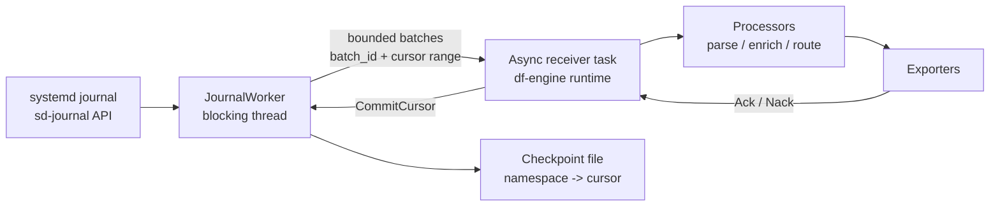
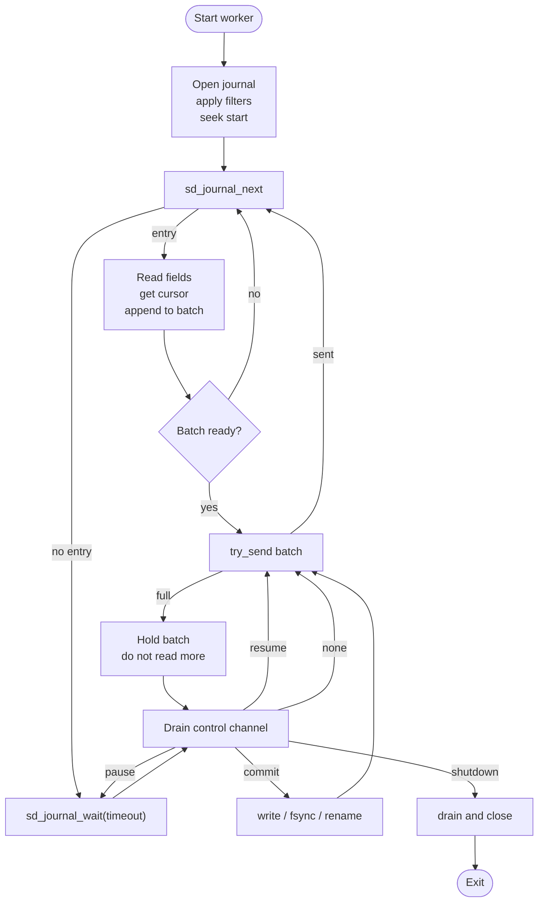

# Journald Receiver Design

<!-- markdownlint-disable MD013 -->

**Status:** Draft
**Tracking issue:** [#2858](https://github.com/open-telemetry/otel-arrow/issues/2858)
**Related epic:** [#2844](https://github.com/open-telemetry/otel-arrow/issues/2844)
**Owner:** @lalitb

## Summary

The journald receiver ingests local `systemd-journald` entries on Linux and
emits OTAP log records. It reads through the `sd-journal` API, not by tailing
`.journal` files and not by execing `journalctl`.

The receiver is a source-specific sibling to the proposed filelog receiver in
[#2844](https://github.com/open-telemetry/otel-arrow/issues/2844). It is **not**
a filelog variant: its progress unit is an opaque journald cursor and its
source API is `sd-journal`, not file discovery and byte offsets. It should not
depend on the #2844 filelog assignment extension landing first.

## Core Decisions

| Decision | Choice |
| --- | --- |
| Source API | `sd-journal` via the `systemd` crate or a small internal `libsystemd` FFI wrapper |
| Progress unit | Opaque journald cursor (`__CURSOR`) |
| First implementation | Linux-only, default local system journal, single-instance source pipeline (one core) |
| Delivery model | At-least-once from the last committed cursor |
| Checkpoint advance | Only after downstream Ack and durable checkpoint write |
| Backpressure | Stop calling `sd_journal_next()` when the bounded handoff is full |
| Semantic processing | Kept out of the receiver; processors do normalization, parsing, routing |
| Blocking calls | Isolated on a dedicated worker thread, never on the df-engine async task |
| NUMA | First PR exposes placement hints only; pinning/co-location is future work |

## Journald vs Filelog

Journald must stay a separate receiver, not a filelog variant. Even though
journal data is stored on disk, it is not a normal file tailing source. A
filelog receiver owns file discovery, file identity, byte offsets, line
framing, and rotation. A journald receiver owns journal source selection,
`sd-journal` iteration, cursor checkpoints, field extraction, and journal
retention/cursor-loss handling. The progress unit is an opaque cursor, the
source API is `sd-journal`, and the failure modes (vacuum, cursor loss,
priority filtering) have no analogue in `(file_identity, byte_offset)`
tracking.

```text
filelog:  file identity + byte offset + framing
journald: journal namespace + opaque cursor + structured entry
```

What journald and filelog share -- and only these -- should be source-neutral
engine contracts: backpressure, Ack/Nack-aware checkpoint advancement,
checkpoint envelopes, lifecycle/drain, and future source assignment.

## Architecture



In v1 the receiver reads one logical journal source per receiver instance
(default: the local system journal). When #2844 introduces assignment, startup
namespace selection can be replaced with assignment events without changing the
read, Ack, or checkpoint model.

## Startup and Instance Model

`namespace` is the stable OTAP source identifier. In v1, `system` means the
default local system journal; later, named systemd journal namespaces can use
their namespace name.

A single journal source is not sharded across per-core receiver instances. The
factory rejects `pipeline_ctx.num_cores() > 1` with a clear error directing
operators to use topic fanout for downstream parallelism:

```text
one-core pipeline:
  receiver:journald -> exporter:topic

multicore pipeline:
  receiver:topic -> processors/exporters
```

A process-local startup lease keyed by `journald:<namespace>` prevents duplicate
readers in the same process, even across different pipelines. Cross-process
duplication is not prevented in v1.

Multiple journald receivers in the *same* engine are still supported, as long
as each targets a distinct namespace. With a future assignment extension,
non-owner instances stay Ready but idle until assigned a namespace.

## Execution Model

All `sd_journal_*` calls are synchronous. Checkpoint writes also perform
blocking filesystem I/O (`write`, `fsync`, `rename`). None of these run on the
df-engine per-core async pipeline task.

The receiver uses one long-lived blocking worker thread per assigned namespace:

- worker owns the `sd_journal*` handle
- async task owns the engine `EffectHandler`, lifecycle state, and Ack tracker
- bounded worker-to-async channel carries completed batches
- bounded async-to-worker channel carries pause/resume/shutdown/commit commands
- no per-record shared lock is required on the hot path

This follows the existing `host_metrics_receiver` pattern for blocking system
calls: use a dedicated worker to cap the blast radius instead of using Tokio's
shared blocking pool.

## Read Loop



If a completed batch cannot be handed to the async task, the worker keeps that
batch in memory and does not call `sd_journal_next()` again until the batch is
accepted or shutdown begins. A held batch counts against the namespace's
in-flight budget.

Pause and shutdown responsiveness is bounded by `wait_timeout`. The configured
`drain_timeout` should be larger than `wait_timeout`.

## Ack and Checkpoint Model

The receiver advances its durable cursor only after a downstream Ack and never
after a Nack. It therefore subscribes to `Interests::ACKS | Interests::NACKS`
unconditionally, independent of telemetry/metric level.

Expected completion behavior:

- each emitted batch carries `Interests::ACKS | Interests::NACKS`
- Ack permits advancing past that batch's `last_cursor`
- Nack does not advance the cursor and may rewind to the last committed cursor
- missing completion before shutdown/drain does not advance the checkpoint

Each emitted batch carries:

- `batch_id`
- `first_cursor`
- `last_cursor`
- an epoch used to ignore stale completions after rewinds

The async task tracks pending ranges per namespace and advances the durable
cursor only through contiguous Acked ranges.

```text
emit range R1, R2, R3
Ack R2 first  -> R2 waits; checkpoint does not move
Ack R1 next   -> commit R1, then R2
Nack R3       -> checkpoint does not move past R2; rewind from committed cursor
```

Checkpoint commit ownership is split deliberately:

- async task decides which cursor should be committed and owns retry/failure
  state
- worker only executes blocking checkpoint I/O and returns success or failure
- in-memory `committed_cursor` advances only after the worker confirms the
  on-disk write succeeded

If there is no committed cursor yet, the receiver rewinds to a frozen initial
anchor captured at namespace open. For `start_at: end` on an empty journal,
the first arriving entry becomes the first emitted record; a rewind may
duplicate it, which is acceptable under at-least-once delivery.

## Checkpoints

Durable cursor recovery must survive process restarts, CPU count changes,
live reconfiguration, and ownership handoff under a future assignment
extension. The checkpoint identity must therefore be **stable** and
**independent of unstable per-run inputs**.

The checkpoint key (and the on-disk path derived from it) MUST be derived
only from inputs that are stable across restart and across instance churn:

- pipeline group id (operator-defined, stable)
- pipeline id (operator-defined, stable)
- receiver node name (operator-defined, stable)
- journal namespace identifier (e.g. `system`, or a named namespace; stable)

It MUST NOT include per-run inputs:

- `core_id`
- current CPU count / `num_cores`
- engine `instance_id` or any per-process generation id
- receiver runtime instance id
- the identity of the current owner under a future assignment extension
- deployment generation, pod name, container id, or any orchestrator-assigned
  ephemeral id

Recommended on-disk layout:

```text
${engine.state_dir}/journald/<pipeline_group>/<pipeline_id>/<receiver_name>/<namespace>.cursor
```

The `<namespace>` segment is `system` for the default local journal and the
namespace name for named namespaces. There is no `instance_id` or `core_id`
segment.

A single cursor file must not be written by two processes concurrently. In
v1, cross-process duplication is prevented operationally (operators run one
engine per host against a given namespace, or use distinct namespaces). The
process-local lease covers in-process duplication. A future enhancement may
add a file lock alongside the cursor file; that addition does not change the
checkpoint key shape above.

The cursor file is a small versioned envelope (cursor string + version +
checksum). Corrupt or unknown-version envelopes fail closed; see [Failure
Policy](#failure-policy). The local v1 envelope is provisional -- if #2844
later freezes a shared envelope format, this receiver will perform a one-time
migration but the **key/path identity above will not change**.

## Configuration

Example pipeline configuration:

```yaml
groups:
  default:
    pipelines:
      logs:
        nodes:
          journald:
            type: receiver:journald
            config:
              # Stable OTAP source identifier. "system" means the default
              # local system journal.
              namespace: system

              units: ["nginx.service", "ssh.service"]
              identifiers: []
              priorities: [0, 1, 2, 3, 4, 5, 6, 7]
              # max_priority: info

              start_at: end

              batch:
                max_records: 1024
                max_flush_period: 200ms

              checkpoint:
                # Receiver appends:
                # <pipeline_group>/<pipeline_id>/<receiver_name>/<namespace>.cursor
                directory: "${engine.state_dir}/journald"
                max_in_flight_batches: 1
                on_nack: rewind
                max_consecutive_failures: 5

              wait_timeout: 1s
              drain_timeout: 5s

              transient_error:
                max_retries: 3
                backoff: 100ms
                max_backoff: 5s
                jitter: true
```

`priorities` is an exact-match set. `max_priority` is shorthand expanded by the
receiver into explicit `PRIORITY=N` matches. The default should include all
levels `0..=7`; it should not silently drop debug entries.

Filter changes are not retroactive. If filters are widened after a checkpoint
exists, the receiver resumes from the existing cursor and does not backfill
older entries that now match.

## Field Projection

The receiver performs only mechanical OTLP projection. It preserves native
journal fields as attributes and leaves semantic-convention mapping to
processors.

| OTAP field | Source |
| --- | --- |
| `body` | `MESSAGE`, unset when missing |
| `time_unix_nano` | default `__REALTIME_TIMESTAMP`; `_SOURCE_REALTIME_TIMESTAMP` can be a future option |
| `severity_number` | derived from `PRIORITY` |
| `attributes` | all other native journal fields, key names preserved |
| internal completion state | cursor range and batch id, not emitted as attributes |

Initial severity mapping:

| Journald `PRIORITY` | Meaning | OTel severity |
| --- | --- | --- |
| `0` | emergency | `FATAL4` |
| `1` | alert | `FATAL3` |
| `2` | critical | `FATAL2` |
| `3` | error | `ERROR` |
| `4` | warning | `WARN` |
| `5` | notice | `INFO2` |
| `6` | info | `INFO` |
| `7` | debug | `DEBUG` |

Binary `MESSAGE` handling depends on the current OTAP body/attribute support.
If bytes can be represented directly, preserve bytes. Otherwise encode as
base64 and mark the encoding explicitly; do not lossy-decode.

## Failure Policy

| Case | Behavior |
| --- | --- |
| `sd_journal_open` / permission failure | startup failure; not treated as an empty stream |
| checkpoint missing | apply `start_at` |
| checkpoint corrupt / unknown version | fail closed; operator must remove or migrate it |
| cursor vacuumed | emit `journald.cursor_lost`; apply `start_at` |
| checkpoint commit I/O failure | do not advance in-memory cursor; retry with backoff; fail the receiver source after threshold |
| `sd_journal_get_cursor` failure | discard un-emitted partial batch, reopen, and reseek from committed cursor or initial anchor |
| Nack | do not advance checkpoint; rewind or fail according to config |
| shutdown deadline | abandon pending completions without advancing checkpoint; late completions are ignored and counted |
| duplicate namespace in same process | process-local lease rejects the second receiver |
| duplicate across processes | not prevented in v1; operators must avoid this or use distinct namespaces |
| `pipeline_ctx.num_cores() > 1` | factory rejects with "journald must run in a one-core source pipeline" |

Worker thread panic fails the receiver source, releases its process-local lease, and
surfaces an error through the receiver/engine path.

## NUMA and Placement

The first PR does not pin threads or guarantee NUMA-local reads. It only exposes
placement metadata so a future scheduler or #2844 assignment extension can act
on it.

Linux discovery should be best-effort:

```text
journal directory -> backing device -> /sys/block/<dev>/device/numa_node
```

If the journal is on tmpfs, overlayfs, a bind mount, or a device that cannot be
resolved, the NUMA node is reported as unknown.

Future goal:

```text
journal storage NUMA node -> journald worker thread -> same-node pipeline
```

## Implementation Scope

First PR:

- `crates/core-nodes/src/receivers/journald_receiver/`
- `urn:otel:receiver:journald`
- Linux gated behind a `journald` Cargo feature
- real `SdJournalReader` plus fake reader for tests
- single-namespace per receiver instance, configured by `namespace` (default
  `system`); factory rejects `pipeline_ctx.num_cores() > 1`
- process-local startup lease keyed by `journald:<namespace>`
- stable per-namespace cursor checkpoint file under
  `${engine.state_dir}/journald/<pipeline_group>/<pipeline_id>/<receiver_name>/<namespace>.cursor`
- dedicated worker thread and bounded channels
- unconditional subscription to `Interests::ACKS | Interests::NACKS`
- contiguous-Ack tracker with default `max_in_flight_batches = 1`

Not in first PR:

- #2844 assignment extension integration
- multi-namespace discovery
- NUMA pinning or scheduler co-location
- `journalctl` fallback
- semantic-convention normalization processor
- offline `.journal` file ingestion

## Tests

Use a fake journal reader for most tests and a Linux-only smoke test for real
`sd-journal` behavior.

Required unit coverage:

- config validation and priority expansion
- factory rejection on `num_cores() > 1`
- receiver subscribes to `ACKS | NACKS` regardless of telemetry/metric level
- field projection and severity mapping
- contiguous Ack tracker, out-of-order Acks, Nack rewind
- Nack does NOT advance the cursor; subsequent Ack of an earlier range still
  cannot move the cursor past the Nacked range
- initial-anchor behavior before the first committed cursor
- corrupt checkpoint load and checkpoint commit failure
- checkpoint path stability: identical key/path across runs with different
  `core_id`, `num_cores`, and engine `instance_id` values
- malformed entry fields and cursor-get failure
- backpressure: held batch stops further `sd_journal_next()` calls
- duplicate namespace lease and lease release on failure
- shutdown deadline and late completion handling
- worker panic path

Linux smoke coverage:

- read entries injected with `sd_journal_send`
- source-side matches for units, identifiers, and priorities
- restart from committed cursor
- live tailing through `sd_journal_wait`

## References

- [`sd-journal` API](https://www.freedesktop.org/software/systemd/man/sd-journal.html)
- [Journal file format](https://systemd.io/JOURNAL_FILE_FORMAT/)
- [Journal export format](https://systemd.io/JOURNAL_EXPORT_FORMATS/)
- [Native journal protocol](https://systemd.io/JOURNAL_NATIVE_PROTOCOL/)
- [Go contrib journaldreceiver](https://github.com/open-telemetry/opentelemetry-collector-contrib/tree/main/receiver/journaldreceiver)
- [`systemd` Rust crate](https://crates.io/crates/systemd)
- [`tracing-journald`](https://docs.rs/tracing-journald/latest/tracing_journald/)
