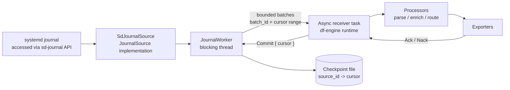
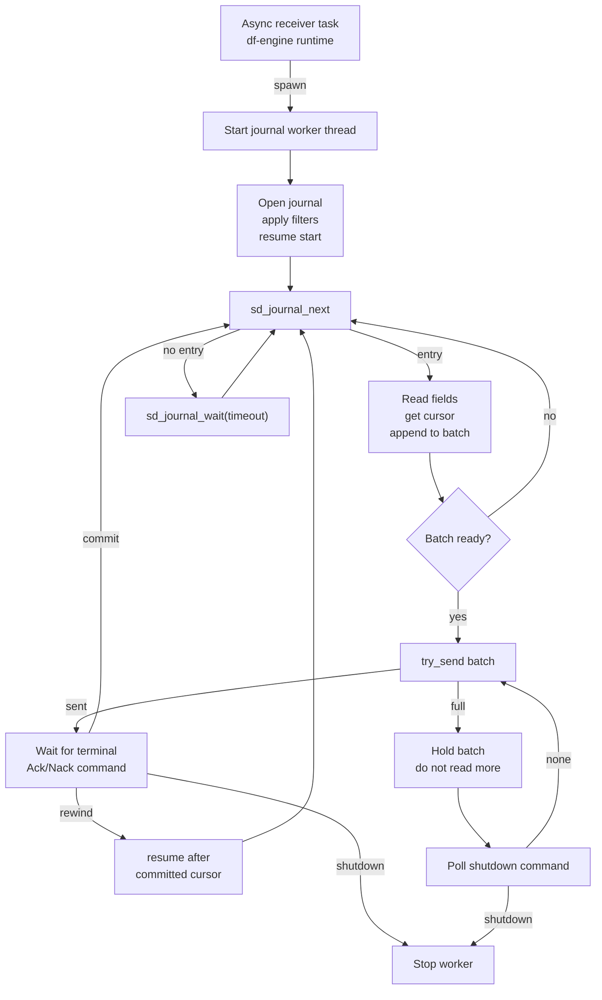
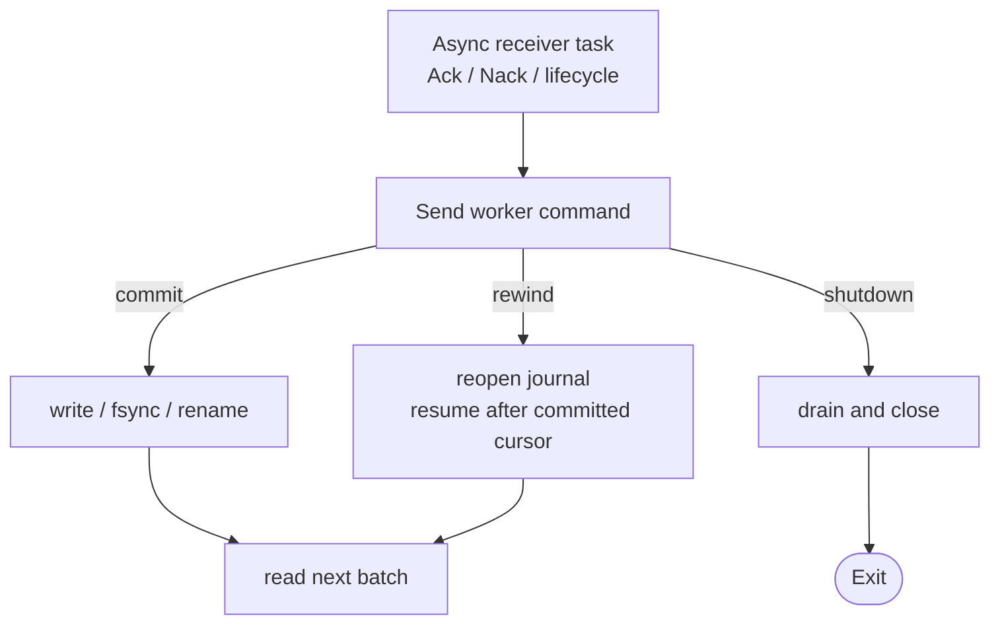

# Journald Receiver Design

<!-- markdownlint-disable MD013 -->

**Status:** Draft
**Tracking issue:** [#2858](https://github.com/open-telemetry/otel-arrow/issues/2858)
**Related epic:** [#2844](https://github.com/open-telemetry/otel-arrow/issues/2844)
**Owner:** @lalitb

## Summary

The journald receiver ingests local `systemd-journald` entries on Linux and
emits OTAP log records. It reads through the `sd-journal` API, not by tailing
`.journal` files and not by execing `journalctl`.

The receiver is a source-specific sibling to the proposed filelog receiver in
[#2844](https://github.com/open-telemetry/otel-arrow/issues/2844). It is **not**
a filelog variant: its progress unit is an opaque journald cursor and its
source API is `sd-journal`, not file discovery and byte offsets. It should not
depend on the #2844 filelog assignment extension landing first.

## Core Decisions

| Decision | Choice |
| --- | --- |
| Source API | `sd-journal` through runtime-loaded `libsystemd` FFI |
| Progress unit | Opaque journald cursor (`__CURSOR`) |
| First implementation | Linux-only, default local system journal, single-instance source pipeline (one core) |
| Delivery model | At-least-once from the last committed cursor |
| Checkpoint advance | Only after downstream Ack and durable checkpoint write |
| Backpressure | Stop calling `sd_journal_next()` when the bounded handoff is full |
| Semantic processing | Kept out of the receiver; processors do normalization, parsing, routing |
| Blocking calls | Isolated on a dedicated worker thread, never on the df-engine async task |
| NUMA | Not addressed in v1; pinning/co-location is future work |

The first implementation uses runtime-loaded `libsystemd` FFI because the
receiver needs only a narrow `sd-journal` API surface and should keep
`libsystemd` as a runtime dependency for this receiver path, instead of adding
native `pkg-config`/linker setup to normal builds. If `libsystemd.so.0` is not
available when the receiver starts, startup fails with an explicit error.

A future `JournalSource` trait boundary can keep the worker and Ack/checkpoint
logic independent from the raw FFI wrapper and allow deterministic
`FakeJournalSource` tests. Its surface should stay narrow: open the source,
seek after a cursor, read the next entry, wait for new entries, and close. It
does not imply support for `journalctl`, offline journal files, remote
journals, or multiple source backends.

## Journald vs Filelog

Journald is intended to be a separate receiver, not a filelog variant. Even
though journal data is stored on disk, it is not a normal file tailing source.
A filelog receiver owns file discovery, file identity, byte offsets, line
framing, and rotation. A journald receiver owns journal source selection,
`sd-journal` iteration, cursor checkpoints, field extraction, and journal
retention/cursor-loss handling. The progress unit is an opaque cursor, the
source API is `sd-journal`, and the failure modes (vacuum, cursor loss,
priority filtering) do not map cleanly to `(file_identity, byte_offset)`
tracking.

```text
filelog:  file identity + byte offset + framing
journald: journal namespace + opaque cursor + structured entry
```

For filelog and journald, the reusable boundary is source progress management,
not file access. Filelog tracks progress as `(file identity, byte offset)`;
journald tracks progress as an opaque `sd-journal` cursor. The source APIs and
framing rules are different, but both have a replayable local progress marker
that should advance only after downstream Ack. Shared pieces can cover bounded
worker handoff, lifecycle-aware shutdown, Ack/Nack-driven progress commit, and
checkpoint envelope I/O. These pieces should be consolidated only after the
filelog design proves the shared shape. Source-specific logic stays separate:
journald owns journal cursors and journal matching; filelog owns file identity,
byte offsets, framing, and rotation.

## Go Receiver Compatibility / Classification

This design uses the Go contrib journald receiver as a reference, but it does
not copy every behavior directly. The v1 classification is:

| Go receiver behavior | Classification | OTAP dataflow v1 choice |
| --- | --- | --- |
| `journalctl` backend | Reject | Use `sd-journal` through runtime-loaded `libsystemd`; no `journalctl` fallback |
| `start_at` | Preserve | Keep `start_at: beginning/end`, applied only when no checkpoint exists |
| Cursor storage | Improve | Ack-driven durable cursor envelope keyed by stable `source_id` |
| Priority default | Improve | Go defaults to `info`; v1 does not install a priority filter unless configured |
| `units` | Preserve | Keep exact unit matches |
| `matches` | Defer | V1 exposes common filters; arbitrary field matches can be added after the first implementation |
| `grep` | Defer | Content filtering belongs in a processor unless a receiver-side need is proven |
| `dmesg` | Reject | Kernel ring-buffer ingestion is a different source, not journald v1 |
| `directory` / `files` | Reject | Do not read `.journal` files directly in v1 |
| `root_path` | Decompose | Use `journal.root_path` only as host-root selection for `sd-journal` |
| `operators` | Decompose | Receiver emits mechanical OTAP logs; processors own parsing and normalization |
| Field projection | Improve | Define timestamp/cursor APIs, duplicate fields, binary fields, and extraction limits |

## Architecture



Flow:

1. At startup, the async receiver task validates configuration, takes the
   process-local journal-source lease, and starts one blocking worker thread
   for the assigned journal source.
2. The worker opens the v1 `SdJournalSource`, applies filters, resumes after
   the committed checkpoint cursor or configured start position, and builds
   bounded log batches.
3. The worker hands each batch to the async receiver task over a bounded
   channel.
4. The async receiver emits the batch into the df-engine pipeline with Ack/Nack
   interest.
5. Downstream components return Ack or Nack.
6. On Ack, the async task sends `Commit { cursor }` to the worker; the worker
   writes the checkpoint and advances the in-memory committed cursor.
7. On Nack, the checkpoint is not advanced; depending on `on_nack`, the worker
   rewinds or the receiver fails.
8. Drain and shutdown commands flow through the bounded command channel and stop
   the worker without additional journal reads.

In v1 the receiver reads one logical journal source per receiver instance
(default: the local system journal). When #2844 introduces assignment, startup
source selection can be replaced with assignment events without changing the
read, Ack, or checkpoint model.

## Startup and Instance Model

`source_id` is the stable OTAP source identifier used for checkpoint identity,
telemetry labels, and operator-facing source naming. It is separate from the
systemd journal namespace selection. In v1, `source_id: system` is the default
logical source id, while `journal.namespace: null` selects the default systemd
journal namespace. Named systemd journal namespaces require
`sd_journal_open_namespace` wiring and are rejected until that support lands.

A single journal source is not sharded across per-core receiver instances. The
factory rejects `pipeline_ctx.num_cores() > 1` with a clear error directing
operators to use topic fanout for downstream parallelism:

```text
one-core pipeline:
  receiver:journald -> exporter:topic

multicore pipeline:
  receiver:topic -> processors/exporters
```

A process-local startup lease keyed by the concrete journal source selection
(`journal.root_path` plus `journal.namespace`) prevents duplicate readers in
the same process, even across different pipelines. Cross-process duplication is
not prevented in v1. Filters such as units, syslog identifiers, and priorities
do not define separate source ownership; two receivers with different filters
but the same journal root/namespace still conflict in the same process.

The intended v1 deployment model is one active owner per concrete host journal
source. Running two collector processes against the same host journal may
duplicate exported logs, and running two processes with the same checkpoint
identity (`checkpoint.directory` plus pipeline/receiver identity plus
`source_id`) may race cursor writes. Operators should use a single collector
owner per host journal source unless duplicate collection is intentional.
Cross-process file locking is a planned follow-up.

Multiple journald receivers in the *same* engine are not useful in v1 because
only the default systemd journal namespace is supported and the process-local
lease rejects duplicate readers. With named-namespace support or a future
assignment extension, non-owner instances can stay Ready but idle until
assigned a source.

## Execution Model

All `sd_journal_*` calls are synchronous. Checkpoint writes also perform
blocking filesystem I/O (`write`, `fsync`, `rename`). None of these run on the
df-engine per-core async pipeline task.

The receiver uses one long-lived blocking worker thread per assigned source:

- worker owns the `sd_journal*` handle
- async task owns the engine `EffectHandler`, lifecycle state, and Ack tracker
- bounded worker-to-async channel carries completed batches
- bounded async-to-worker `sync_channel` carries commit, rewind, and shutdown
  commands
- no per-record shared lock is required on the hot path

The async-to-worker command channel is a bounded `sync_channel` with small
fixed capacity. With `max_in_flight_batches = 1`, at most one commit or rewind
plus a terminal shutdown should be outstanding; the bound is defense-in-depth.
The async task must never perform a blocking send on the df-engine runtime
thread. Commit, rewind, and shutdown commands must use `try_send`, an async
channel, or another non-blocking handoff. If the command channel is full, the
receiver treats it as a lifecycle/protocol error instead of blocking the
single-threaded runtime.

This follows the existing `host_metrics_receiver` pattern for blocking system
calls: use a dedicated worker to cap the blast radius instead of using Tokio's
shared blocking pool.

## Read Loop

Read and handoff path:



Ack/Nack and lifecycle control path:



If a completed batch cannot be handed to the async task, the worker keeps that
batch in memory and does not call `sd_journal_next()` again until the batch is
accepted or shutdown begins. While the held batch is waiting for handoff, the
worker performs no further reads or batch construction, so the source's
in-flight budget remains saturated until either the batch is accepted or
shutdown begins.

After a successful handoff, v1 also stops reading until the batch receives a
terminal Ack/Nack and the worker processes the resulting commit or rewind. This
keeps the source to one in-flight batch and avoids ordered multi-batch
cursor commits.

While a batch is held and not yet accepted by the async task, the worker polls
the command channel for shutdown only. With `max_in_flight_batches = 1`, no
commit or rewind for an unsent batch is produced; either command in that state
is treated as a protocol error.

Pause and shutdown responsiveness is bounded by `wait_timeout` while the worker
is inside `sd_journal_wait`. The implementation caps `wait_timeout` at 5s until
the worker uses an interruptible `sd_journal_get_fd`/poll path. During
downstream backpressure, the async task races the blocked send against lifecycle
control messages and the worker polls its command channel while holding a full
handoff batch.

During drain, the worker stops additional reads and attempts to let any batch
that has already been read from journald reach a terminal Ack/Commit,
Nack/Rewind, or configured fail outcome before the receiver reports drained. If
the drain deadline expires first, the receiver shuts down without advancing the
checkpoint for uncommitted work; those entries may replay on restart under the
at-least-once delivery model.

## Ack and Checkpoint Model

The receiver advances its durable cursor only after a downstream Ack and never
after a Nack. It therefore subscribes to `Interests::ACKS | Interests::NACKS`
for every emitted batch. These subscriptions are required for cursor-advance
correctness and must not be gated on telemetry settings.

Expected completion behavior:

- each emitted batch carries `Interests::ACKS | Interests::NACKS`
- Ack permits advancing past that batch's `last_cursor`
- Nack does not advance the cursor and may rewind to the last committed cursor
- missing completion before shutdown/drain does not advance the checkpoint

Checkpoint resume means **start after the committed cursor**. The committed
entry was already Acked before the checkpoint was written, so replaying that
entry is unnecessary and can duplicate data. The `JournalSource` resume helper
therefore performs the `sd_journal_seek_cursor` positioning and verifies
whether the selected entry is the committed entry before reading the next
uncommitted entry:

```text
seek_after_committed_cursor(cursor):
  seek_cursor(cursor)
  state = next()
  if state == no_entry:
    return invalid_or_stale_cursor
  if test_cursor(cursor):
    return next()
  return invalid_or_stale_cursor
```

If the committed cursor is invalid, stale, or vacuumed, v1 fails closed and
does not silently fall back to tail or head. The operator must remove the
checkpoint or choose an explicit recovery action.

Before the first successful checkpoint exists, `start_at: end` has no durable
resume anchor. If the process crashes after entries are read from journald but
before the first cursor commit succeeds, restart applies `start_at` again and
may skip those uncommitted entries. While the process stays alive, a Nack before
the first checkpoint replays the retained in-flight batch instead of reopening
at the live tail. A production follow-up should add an initial durable anchor or
document an operator policy for first-start loss tolerance.

Each emitted batch carries:

- `batch_id`
- `first_cursor`
- `last_cursor`

The v1 receiver allows one in-flight batch per source. The async task marks
the first Ack or Nack for a `batch_id` as terminal and ignores duplicate or late
opposite completions for that batch.

```text
emit range R1
Ack R1        -> worker commits R1.last_cursor, then reads the next batch
Nack R1       -> checkpoint does not move; worker rewinds from committed cursor
Ack then Nack -> first completion wins; late opposite completion is ignored
```

Checkpoint commit ownership is split deliberately:

- async task decides which cursor should be committed and owns checkpoint
  failure state
- worker only executes blocking checkpoint I/O and returns success or failure
- in-memory `committed_cursor` advances only after the worker confirms the
  on-disk write succeeded

If there is no committed cursor yet, `on_nack: rewind` replays the retained
un-Acked batch instead of reopening at the live tail and silently skipping it.
This is equivalent to rewinding from a committed cursor once one exists: the
batch replays until downstream Acks, drain or shutdown ends the receiver, or
operators choose `on_nack: fail` for terminal failure behavior.

## Checkpoints

Durable cursor recovery must survive process restarts, CPU count changes,
live reconfiguration, and ownership handoff under a future assignment
extension. The checkpoint identity must therefore be **stable** and
**independent of unstable per-run inputs**.

The checkpoint key (and the on-disk path derived from it) MUST be derived
only from inputs that are stable across restart and across instance churn:

- pipeline group id (operator-defined, stable)
- pipeline id (operator-defined, stable)
- receiver node name (operator-defined, stable)
- `source_id` (operator-defined, stable; `system` in the default v1 config)

It MUST NOT include per-run inputs:

- `core_id`
- current CPU count / `num_cores`
- engine `instance_id` or any per-process generation id
- receiver runtime instance id
- the identity of the current owner under a future assignment extension
- deployment generation, pod name, container id, or any orchestrator-assigned
  ephemeral id

Recommended on-disk layout:

```text
${engine.state_dir}/journald/<pipeline_group>/<pipeline_id>/<receiver_name>/<source_id>.cursor
```

The final segment is the configured `source_id`; it is `system` for the
default local journal. It is not the systemd journal namespace. There is no
`instance_id` or `core_id` segment.

A single cursor file must not be written by two processes concurrently. In v1,
cross-process duplication is prevented operationally by running one engine per
host against the default systemd journal namespace. The process-local lease
covers in-process duplication. A future enhancement may add a file lock
alongside the cursor file; that addition does not change the checkpoint key
shape above.

The cursor file is a small versioned envelope (cursor string + version +
checksum). Corrupt or unknown-version envelopes fail closed; see [Failure
Policy](#failure-policy). The local v1 envelope is provisional -- if #2844
later freezes a shared envelope format, this receiver will perform a one-time
migration but the **key/path identity above will not change**.

## Container / Host Journal Access

The receiver intentionally reads through `sd-journal` and does not exec
`journalctl`. Containerized host collection therefore depends on the
`libsystemd` runtime and host journal mounts, not on `journalctl_path` or
filelog-style root-path handling.

For v1, the supported source-root shape is:

```yaml
journal:
  # Unset or "/" reads the receiver process's local journal view.
  # In a container, "/host" means the host root is mounted at /host.
  root_path: /host
```

When `journal.root_path` is unset or `/`, the receiver opens the local journal
view. When it is set to a host-root mount such as `/host`, `SdJournalSource`
opens that root with `sd_journal_open_directory(..., SD_JOURNAL_OS_ROOT)`
so journald resolves the usual journal locations below that root, such as
`/host/run/log/journal` and `/host/var/log/journal`.

Containerized host collection requires:

- the container image includes a compatible `libsystemd.so.0`
- the host journal directories are mounted under `journal.root_path`
- the process has permission to read the mounted journals, usually by running
  as root or with a host-compatible `systemd-journal` group mapping
- SELinux, AppArmor, seccomp, and read-only mount policy allow the required
  `sd-journal` reads

If `libsystemd.so.0` is missing, the root path is invalid, no journal
directory is visible, or permissions deny access, receiver startup fails with
an explicit error. V1 does not support a `journalctl` fallback.

## Configuration

Example pipeline configuration:

```yaml
groups:
  default:
    pipelines:
      logs:
        nodes:
          journald:
            type: receiver:journald
            config:
              # Stable OTAP source identifier for checkpoints and telemetry.
              source_id: system

              journal:
                # null selects the default systemd journal namespace.
                namespace: null
                root_path: /host

              units: ["nginx.service", "ssh.service"]
              identifiers: []
              priorities: [0, 1, 2, 3, 4, 5, 6, 7]
              # max_priority: info

              start_at: end

              batch:
                max_records: 1024
                max_flush_period: 200ms

              extraction:
                max_entry_bytes: 1MiB
                max_field_bytes: 256KiB
                max_fields_per_entry: 256
                large_field_policy: drop_and_count

              checkpoint:
                # Receiver appends:
                # <pipeline_group>/<pipeline_id>/<receiver_name>/<source_id>.cursor
                directory: "${engine.state_dir}/journald"
                max_in_flight_batches: 1
                on_nack: rewind
                max_consecutive_failures: 5

              wait_timeout: 1s
              drain_timeout: 5s
```

`priorities` is an exact-match set. `max_priority` is shorthand expanded by the
receiver into explicit `PRIORITY=N` matches. When neither field is configured,
the receiver does not install a `PRIORITY` match, so entries without a
`PRIORITY` field are not silently excluded. Explicit `priorities: [0, 1, 2, 3,
4, 5, 6, 7]` remains a real filter and only matches entries that carry one of
those `PRIORITY` values.

Filter changes are not retroactive. If filters are widened after a checkpoint
exists, the receiver resumes from the existing cursor and does not backfill
older entries that now match.

## Field Projection

The receiver performs only mechanical OTAP projection. It preserves native
journal fields as attributes and leaves semantic-convention mapping to
processors.

| OTAP field | Source |
| --- | --- |
| `body` | `MESSAGE`, unset when missing |
| `time_unix_nano` | `sd_journal_get_realtime_usec() * 1000` |
| `severity_number` | derived from `PRIORITY` |
| `attributes` | native journal fields, key names preserved |
| internal completion state | cursor from `sd_journal_get_cursor()`, plus range and batch id; not emitted as attributes |

The receiver uses `sd_journal_get_data` and field enumeration for journal
fields such as `MESSAGE` and `PRIORITY`. Data returned by those APIs is owned
by the journal handle and is only valid until the journal pointer advances, so
the receiver must copy the required field names and values before calling
`sd_journal_next`, `sd_journal_previous`, seeking, or reopening the handle.

Attribute projection rules:

- a single occurrence of a field becomes a scalar attribute
- the first `MESSAGE` value becomes the OTAP body; all `MESSAGE` values are
  also preserved in a native journal attribute
- binary values are preserved as OTAP bytes
- field values must not be lossy-decoded

In the first implementation, duplicate field names are emitted as repeated
same-key attributes. A follow-up PR will coalesce repeated fields into array
attributes while preserving journald enumeration order. For example:

```text
CUSTOM=value1
CUSTOM=value2
```

will become:

```text
CUSTOM=["value1", "value2"]
```

Extraction has hard resource limits. The receiver configures libsystemd's
per-field data threshold from the extraction limits, with small headroom for the
`FIELD_NAME=` prefix, so pathological journal fields are not materialized
unboundedly before the receiver can apply its own copy limits. The receiver
enforces `max_field_bytes`, `max_entry_bytes`, and `max_fields_per_entry` while
copying fields out of the journal handle. With the v1
`large_field_policy: drop_and_count`, any field value that exceeds the per-field
limit, any field that would exceed the per-entry copied-byte budget, any field
at the libsystemd threshold, and any field beyond the per-entry field-count
limit is omitted and counted.
If the first `MESSAGE` value is dropped, the body is unset; preserved
`MESSAGE` values are still preserved as native journal attributes.

Initial severity mapping:

| Journald `PRIORITY` | Meaning | OTel severity |
| --- | --- | --- |
| `0` | emergency | `FATAL4` |
| `1` | alert | `FATAL3` |
| `2` | critical | `FATAL2` |
| `3` | error | `ERROR` |
| `4` | warning | `WARN` |
| `5` | notice | `INFO2` |
| `6` | info | `INFO` |
| `7` | debug | `DEBUG` |

## Failure Policy

| Case | Behavior |
| --- | --- |
| `libsystemd.so.0` load failure | startup failure; this receiver has no `journalctl` fallback |
| `sd_journal_open` / permission failure | startup failure; not treated as an empty stream |
| invalid `journal.root_path` / no visible journal directory | startup failure; operator must fix the mount or config |
| partially readable journal tree | v1 may start if at least one journal file is readable; production hardening should fail closed or emit a mandatory warning/metric |
| checkpoint missing | apply `start_at` |
| checkpoint corrupt / unknown version | fail closed; operator must remove or migrate it |
| cursor vacuumed / stale | fail closed; operator must remove the checkpoint or choose an explicit recovery action |
| checkpoint commit I/O failure | do not advance in-memory cursor; fail the receiver source after the configured consecutive failure threshold |
| `sd_journal_get_cursor` failure | fail the receiver source |
| Nack | do not advance checkpoint; rewind or fail according to config |
| drain deadline | stop ingress and wait for the pending Ack/Nack until the earlier of engine deadline or `drain_timeout`; uncommitted pending data may replay on restart |
| shutdown deadline | stop ingress immediately without advancing uncommitted checkpoints |
| duplicate journal source in same process | process-local lease rejects the second receiver |
| duplicate across processes | not prevented in v1; operators must run one engine per host against the default systemd journal namespace |
| `pipeline_ctx.num_cores() > 1` | factory rejects with "journald must run in a one-core source pipeline" |

Worker thread panic fails the receiver source, releases its process-local lease, and
surfaces an error through the receiver/engine path.

## Receiver Self-Telemetry

The receiver emits core self-telemetry because journald access is
operationally sensitive and failures can otherwise look like an idle source.
Metric names should follow the repository's receiver metric conventions. The
broader intended signal set includes:

| Signal | Type |
| --- | --- |
| entries read, emitted, and dropped | counters |
| batches emitted, Acked, and Nacked | counters |
| checkpoint commits and commit failures | counters |
| invalid or stale cursor events | counter |
| permission or partial-journal warnings | counter plus warning log |
| field drops and large-field drops | counters |
| last observed entry timestamp | gauge |
| worker restarts | counter |
| downstream backpressure duration | histogram or counter duration |

## Phased Implementation Notes

The first implementation intentionally focuses on the core receiver path:
Linux `sd-journal` ingestion, bounded worker isolation, Ack-driven checkpoint
advancement, durable cursor persistence, basic filtering, extraction limits,
and raw journald field projection.

Some design goals are deferred to follow-up PRs once the core receiver has
landed and the worker/checkpoint behavior is validated in production-like
environments.

Deferred follow-ups include:

- coalescing duplicate journald fields into array attributes
- introducing a `JournalSource` trait and `FakeJournalSource` test boundary
- expanding receiver self-telemetry for stale cursors, permission warnings,
  worker restarts, last-entry timestamp, and backpressure duration
- failing closed or warning clearly on partially readable journal trees
- an initial durable resume anchor for `start_at: end` before the first
  checkpoint commit
- configurable recovery for corrupt or unsupported checkpoint envelopes, such
  as falling back to `start_at` and writing a fresh cursor when the operator
  opts in
- configurable recovery for stale or vacuumed cursors, such as accepting the
  next available newer journal entry instead of failing closed
- aggregate batch byte limits in addition to per-entry and per-field extraction
  limits
- named systemd journal namespace support
- arbitrary journald match expressions
- NUMA-aware placement
- cross-process source locking

## NUMA and Placement

NUMA pinning and placement metadata are out of scope for v1. A future PR may
resolve the journal storage NUMA node and surface it for a scheduler or #2844
assignment extension.

Future Linux discovery should be best-effort:

```text
journal directory -> backing device -> /sys/block/<dev>/device/numa_node
```

If the journal is on tmpfs, overlayfs, a bind mount, or a device that cannot be
resolved, the NUMA node should be reported as unknown.

Future goal:

```text
journal storage NUMA node -> journald worker thread -> same-node pipeline
```

## Implementation Scope

Included in the first implementation:

- Linux-only local journald ingestion through `sd-journal`
- containerized host journal access through `journal.root_path`
- one logical `system` journal source per receiver instance
- one-core source pipeline with downstream fanout through topics
- process-local duplicate-reader protection
- stable per-source cursor checkpointing
- dedicated blocking worker thread with bounded handoff channels
- Ack-driven checkpoint advancement and Nack-aware rewind/fail behavior
- raw journald field projection without semantic-convention normalization
- receiver self-telemetry for lifecycle transitions, batches, Ack/Nack
  handling, checkpoint commits/failures, source failures, field drops, and
  rewinds

Excluded from the first implementation:

- #2844 assignment extension integration
- named systemd namespace support and multi-source discovery
- NUMA pinning or scheduler co-location
- `journalctl` fallback
- semantic-convention normalization processor
- offline `.journal` file ingestion

## References

- [`sd-journal` API](https://www.freedesktop.org/software/systemd/man/sd-journal.html)
- [Journal file format](https://systemd.io/JOURNAL_FILE_FORMAT/)
- [Journal export format](https://systemd.io/JOURNAL_EXPORT_FORMATS/)
- [Native journal protocol](https://systemd.io/JOURNAL_NATIVE_PROTOCOL/)
- [Go contrib journaldreceiver](https://github.com/open-telemetry/opentelemetry-collector-contrib/tree/main/receiver/journaldreceiver)
- [`systemd` Rust crate](https://crates.io/crates/systemd)
- [`tracing-journald`](https://docs.rs/tracing-journald/latest/tracing_journald/)
