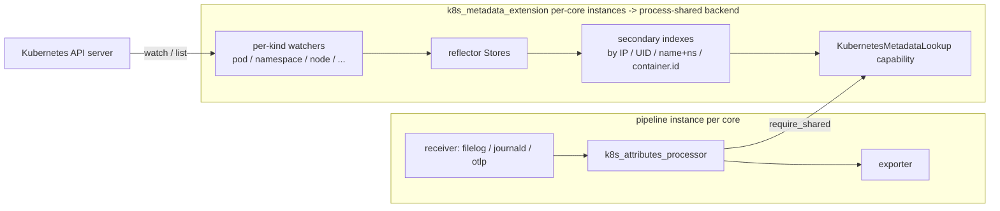

# Kubernetes Attributes Processor Design

<!-- markdownlint-disable MD013 -->

**Status:** Draft

**Tracking issue:** [#3094](https://github.com/open-telemetry/otel-arrow/issues/3094)

**Owner:** @pritishnahar95

**Processor URN:** `urn:otel:processor:k8s_attributes`
**Extension URN:** `urn:otel:extension:k8s_metadata`

**Target crate:** `crates/contrib-nodes`
**Target processor module:** `crates/contrib-nodes/src/processors/k8s_attributes_processor/`
**Target extension module:** `crates/contrib-nodes/src/extensions/k8s_metadata_extension/`

This design follows
[Reference-Informed OTAP-Native Capability Design](ai/reference-informed-otap-native-capability-design.md).
The Go contrib
[`k8sattributesprocessor`](https://github.com/open-telemetry/opentelemetry-collector-contrib/blob/main/processor/k8sattributesprocessor/README.md)
is used as a reference.

## Summary

The Kubernetes attributes processor enriches OTAP telemetry with resource
attributes derived from Kubernetes objects (pods, namespaces, nodes, and
optionally deployments / statefulsets / daemonsets / jobs / replicasets /
cronjobs). It associates each inbound resource with a pod using a small,
ordered set of association rules, then projects configured metadata, labels,
and annotations onto the resource's attribute set.

The processor responsibility is split into two pieces:

1. **`k8s_metadata_extension`** -- an active, shared extension that owns the
   Kubernetes client, runs the watch/informer event loop, maintains the
   in-memory metadata cache, and exposes a `KubernetesMetadataLookup`
   capability.
2. **`k8s_attributes_processor`** -- an inline single-route processor that
   resolves each inbound `OtapPdata` resource to a pod via the capability and
   writes the configured attributes onto Arrow resource attribute batches.

The split is forced by two engine constraints that have no Go analog:

- **Per-core duplication.** Processors are instantiated per pipeline
  instance, which is per core. If the watcher and cache lived inside the
  processor, an N-core collector would open N independent watches to the
  apiserver and hold N copies of the same pod metadata in RAM. The
  extension boundary is the correct place to host this concern; v1 then
  deduplicates across per-core extension instances with a process-local
  shared backend (see [Thread-per-Core Integration](#thread-per-core-integration)).
- **Hot-path safety.** The processor's `process()` runs on the per-core
  async runtime. Kubernetes client I/O, watcher reconnects, and cache
  rebuilds all introduce scheduling points. Keeping that work behind a
  synchronous, non-blocking capability surface (`KubernetesMetadataLookup`)
  makes it impossible to accidentally call Kubernetes API code from the
  data path -- the surface exposes no such method, and the processor crate
  has no direct Kubernetes client dependency. See the "Hot-path contract"
  row in [Core Decisions](#core-decisions) for the lookup guarantees.

The extension boundary is where blocking and async work belongs; the
processor stays a synchronous reader of a published snapshot.

## Goals

The v1 capability must:

- enrich logs, metrics, and traces with the default Kubernetes resource
  attributes recommended by the
  [semantic conventions for Kubernetes](https://opentelemetry.io/docs/specs/semconv/non-normative/k8s-attributes/);
- support file-log and journald receivers as the primary motivating sources --
  i.e. association by `k8s.pod.uid`, `k8s.pod.ip`, or
  `k8s.pod.name`+`k8s.namespace.name` from resource attributes already set by
  those receivers, and association by `container.id` for container log
  pipelines;
- support node-scoped filtering driven by the downward API
  (`KUBE_NODE_NAME`-style env var) so agent deployments only watch pods on the
  local node;
- support pod label and annotation extraction with `key` and `key_regex`
  modes;
- support OTEL annotation projection (`resource.opentelemetry.io/*` ->
  resource attribute);
- run in-cluster with a `ServiceAccount` token, and out-of-cluster with a
  kubeconfig file for development;
- operate correctly without ever blocking the per-core async runtime on
  Kubernetes API I/O;
- emit self-observability metrics through `MetricSet`.

## Non-Goals

The v1 capability does not include:

- field-selector (`filter.fields`) or label-selector (`filter.labels`) watch
  narrowing beyond `node` and `namespace`;
- ReplicaSet-informer-based deployment name lookup
  (`deployment_name_from_replicaset: false`); v1 uses only the
  ReplicaSet-name heuristic;
- multi-container-instance disambiguation via `k8s.container.restart_count`
  (latest instance is used);
- `wait_for_metadata` startup blocking (the processor is always ready; cache
  fill is asynchronous). This is blocked on the extension framework gaining
  an opt-in readiness probe that can delay data-path startup until a bound
  extension signals ready; once that hook exists, the extension would
  signal "cache initially synced" and `wait_for_metadata` would become a
  small local config option. See [Open Questions](#open-questions);
- Job-informer-based CronJob name resolution (v1 uses the
  Job-name-suffix heuristic);
- `service.namespace` / `service.name` / `service.version` /
  `service.instance.id` derivation (v1 can add them after the first scope
  is stable);
- Windows and any platform-specific path resolution (the extension is
  platform-agnostic from a Kubernetes-client perspective).

These items are explicit deferrals, not silent omissions. The user-facing
contract must say so.

## Core Decisions

| Decision | Choice |
| --- | --- |
| Component shape | Extension (`k8s_metadata_extension`) + processor (`k8s_attributes_processor`) |
| Kubernetes client | Async client pinned to a single supported Kubernetes minor version; rustls-only TLS |
| Watch mechanism | One watcher per resource kind, using streaming initial list + watch bookmarks |
| Cache backing | Per-kind reflector stores feed a published lookup snapshot; see [`KubernetesMetadataLookup` capability](#kubernetesmetadatalookup-capability) |
| Sharing model | `Active + Shared` extension; one watcher and one cache per process via a process-shared `OnceLock<Arc<KubernetesState>>` backend (see [Thread-per-Core Integration](#thread-per-core-integration)) |
| Hot-path contract | Capability lookups are constant-time, synchronous, and never block |
| Connection IP | Supported via `OtapPdata::peer_addr()` from socket-backed receivers (see [Connection-IP Association](#connection-ip-association)); usable as a `pod_association` source and to drive `passthrough` mode |
| Default association rules | `k8s.pod.uid`, then (`k8s.pod.name`, `k8s.namespace.name`), then `k8s.pod.ip` |
| Default extracted metadata | `k8s.namespace.name`, `k8s.pod.name`, `k8s.pod.uid`, `k8s.pod.start_time`, `k8s.deployment.name`, `k8s.node.name` |
| Authentication | `service_account` (in-cluster) and `kube_config` (out-of-cluster); no `auth_type: none` in v1 |
| Pod-delete grace | Default 120s |
| Watch resync | Default `0s` (disabled); event-driven only, matches large-cluster guidance |
| Live reconfiguration | Receives `NodeControlMsg::Config { config }` like `attributes_processor`; extraction/association/exclude changes are hot-swappable; client and watch-scope changes require restart |
| Startup readiness | Processor is always ready; cache fill is asynchronous and reported via metrics |
| Telemetry | `MetricSet`-backed counters and gauges for cache size, lookup hit/miss, watch errors |
| Semantic conventions version | Emit v1 K8s conventions (`k8s.pod.label.*` singular form); no feature gate for v0 |

## Reference Classification

This is the OTAP-native disposition of behaviors observed in the Go contrib
processor.

| Go processor behavior | Classification | OTAP v1 choice |
| --- | --- | --- |
| `auth_type: serviceAccount` | Preserve | In-cluster; the client is built from the explicit in-cluster config rather than a shortcut that can silently fall back to kubeconfig |
| `auth_type: kubeConfig` | Preserve | Out-of-cluster; kubeconfig loaded explicitly with the configured context |
| `auth_type: none` | Reject | Drop; an unauthenticated K8s client is a footgun |
| `context` | Preserve | Forwarded to `KubeConfigOptions::context` when `kube_config` |
| `kube_api_qps` / `kube_api_burst` | Preserve | Implemented as a token-bucket rate limiter on the Kubernetes client; covers both list and watch requests |
| `passthrough: true` | Preserve | When enabled, stamps `k8s.pod.ip` from `OtapPdata::peer_addr()` without further enrichment; rejected at config validation if the bound source pipeline cannot supply a peer address. See [Connection-IP Association](#connection-ip-association). |
| `wait_for_metadata` | Defer | Not in v1; blocked on the extension framework supporting opt-in readiness probes that gate data-path node startup -- called out as a future consideration in [Extension System Architecture](extension-system-architecture.md). Once that capability exists, this extension would signal "cache initially synced" via the probe, the engine would delay starting the data-path nodes bound to this extension until the signal arrives, and `wait_for_metadata` becomes a small local config option here. See [Open Questions](#open-questions). |
| `wait_for_metadata_timeout` | Defer | Tied to `wait_for_metadata` |
| `watch_sync_period` | Improve | Default `0s` instead of Go's `5m`; matches large-cluster recommendation |
| `pod_delete_grace_period` | Preserve | Default 120s |
| `filter.node` | Preserve | Static node-name watch narrowing |
| `filter.node_from_env_var` | Preserve | Resolved at startup |
| `filter.namespace` | Preserve | Single-namespace watch narrowing |
| `filter.fields` | Defer | Not in v1 |
| `filter.labels` | Defer | Not in v1 |
| `exclude.pods` | Preserve | Default excludes `jaeger-agent`, `jaeger-collector` |
| `extract.metadata` defaults | Preserve | Identical default set |
| `extract.annotations` (`key`, `key_regex`, `from`) | Preserve | All seven `from` values |
| `extract.labels` (`key`, `key_regex`, `from`) | Preserve | All seven `from` values |
| `extract.otel_annotations` | Preserve | Default `false` in Go; v1 default `false` |
| `deployment_name_from_replicaset: false` | Reject | Always use the ReplicaSet-name heuristic; explicit Deployment informer is future work |
| `from: deployment / statefulset / daemonset / job` extraction | Improve | Informers started lazily, only when extraction or `*.uid` references them |
| CronJob-name Job-suffix heuristic | Preserve | Default; Job informer not started for name-only use |
| `pod_association` `from: resource_attribute` | Preserve | Same shape; composite keys preserved (see [Pod Identifier Index Model](#pod-identifier-index-model)) |
| `pod_association` `from: connection` | Preserve | Reads `OtapPdata::peer_addr()`; the rule is treated as not-matching for batches with no peer address (file-based or non-socket receivers). See [Connection-IP Association](#connection-ip-association). |
| `pod_association` source `name: host.name` IP-only filter | Preserve | When the configured source name is `host.name`, the value is used only if it parses as an IP literal (`std::net::IpAddr::from_str`); otherwise the rule is treated as not-matching, matching Go's `pod_association.go` behavior |
| Empty `pod_association` defaulting | Reject | Go falls back to `k8s.pod.ip` / `client.ip` / connection-IP / `host.name` heuristics when `pod_association` is empty; v1 requires at least one explicit rule and fails config validation otherwise |
| Container-level enrichment by `container.id` / `k8s.container.name` | Preserve | Required for filelog/journald use cases; `container.id` is matched against both bare-ID and `<runtime>://<id>` forms (see [Container Identity](#container-identity)) |
| `k8s.container.restart_count` instance selection | Defer | Latest instance only |
| `service.namespace` / `service.name` / `service.version` / `service.instance.id` derivation | Defer | Add after first scope |
| `processor.k8sattributes.EmitV1K8sConventions` feature gate | Decompose | Emit v1 only; no gate, no `_v0` shim |
| In-memory cache replicated per replica | Preserve | Each pipeline instance reads from the shared extension; no cross-pod state |
| K8s API resync as default | Reject | Default off; event-driven only |
| Persistent storage | Preserve (none) | No persistent state |
| Pod ownership chain walking | Preserve | Walk `ownerReferences` for ReplicaSet -> Deployment, Job -> CronJob |

Entries marked `Defer` are explicit gaps to call out in the user-facing
contract until they land.

## Architecture



Flow on the data path:

1. Receiver emits `OtapPdata` with `resource` attributes that include at
   least one of the configured association sources (e.g. `k8s.pod.uid`).
2. Processor walks `pod_association` rules in order. The first rule whose
   sources are all present on the resource is used. Each rule's source values
   are joined into a lookup key and dispatched to the corresponding secondary
   index.
3. On a hit, the processor reads the cached `PodMetadata` (and parent
   workload metadata, if extracted) and applies the configured projection to
   the resource attribute Arrow batch in place.
4. On a miss, the processor records `k8s.lookup.miss` and forwards the
   resource unchanged.
5. The processor never awaits Kubernetes I/O on the hot path.

Flow on the control path:

1. The first extension `start()` builds the Kubernetes client, constructs
   the watchers, and spawns the background task; the work is gated so it
   runs once per process (see
   [Thread-per-Core Integration](#thread-per-core-integration)).
2. The background task watches each resource kind. The initial list is
   buffered and swapped into the lookup snapshot atomically when the list
   completes; incremental apply/delete events stream in after that and
   update the snapshot in place.
3. Pod deletes are not evicted from the lookup snapshot immediately. A
   delay queue defers eviction by `pod_delete_grace_period` so
   late-arriving telemetry can still be enriched.
4. The pipeline shutdown path drains data-path nodes first, then signals
   the extension to stop the watcher task and drop the client. This follows
   the ordering documented in
   [Extension System Architecture](extension-system-architecture.md).

## Component Boundaries

| Concern | Lives in |
| --- | --- |
| Kubernetes client construction | extension |
| Watcher / reflector loops | extension |
| Resource caches | extension |
| Secondary indexes for lookup | extension |
| Pod-delete grace timer | extension |
| Capability surface (`KubernetesMetadataLookup`) | extension |
| Watch self-observability (event counts, watch errors, cache sizes) | extension |
| Per-resource attribute projection | processor |
| Association rule evaluation | processor |
| Extraction-rule compilation (regex pre-compile) | processor (config-time) |
| Lookup hit/miss telemetry, attribute-write counts | processor |
| Live reconfiguration of extraction rules | processor |

The extension owns nothing that depends on a specific pipeline's data
schema. The processor owns nothing that depends on the cluster's runtime
state.

### `KubernetesMetadataLookup` capability

The capability is intentionally narrow: a generic composite-key pod
lookup, a handful of convenience methods for the well-known per-kind
shapes, and a per-batch snapshot accessor that gives the processor one
stable view across an entire `process()` call.

```rust
/// One configured association attribute -- the pair the user wrote in
/// `pod_association.sources`, paired with the value the processor read
/// from the resource for that source.
struct PodIdentifierAttribute {
    source_name: String, // e.g. "k8s.pod.uid" or "container.id"
    value: String,
}

/// AND of up to 4 attributes (matches the `pod_association` source cap).
type PodIdentifier = Vec<PodIdentifierAttribute>;

trait KubernetesMetadataLookup {
    /// Composite-key pod lookup. Returns `None` if no pod matches the
    /// full attribute set. Required to support user-extended association
    /// sources -- any extracted metadata attribute can be a source, so a
    /// fixed set of per-key indexes will not do.
    fn pod(&self, id: &PodIdentifier) -> Option<Arc<PodMetadata>>;

    fn namespace(&self, name: &str) -> Option<Arc<NamespaceMetadata>>;
    fn node(&self, name: &str) -> Option<Arc<NodeMetadata>>;
    fn workload(&self, owner: &OwnerRef) -> Option<Arc<WorkloadMetadata>>;

    /// Snapshot is taken once per `process()` call; the returned handle
    /// is used for every resource in the batch so the hot path never
    /// re-loads the published snapshot pointer.
    fn snapshot(&self) -> MetadataSnapshot;
}
```

All methods are infallible reads, take `&self`, and never block. The
processor resolves this capability once at node construction (per the
extension architecture contract) and holds the typed handle for its
lifetime; no runtime capability resolution happens on the hot path.

#### Cache structure

The extension holds one `kube_runtime::reflector::Store<K>` per watched
kind (pod, namespace, node, and any workload kinds the configuration
references). The reflector store is the writer-side source of truth for
"object exists in cache"; the lookup tables are projections derived
from store deltas.

The lookup tables are bundled into one struct that is published as a
single immutable snapshot:

```rust
struct MetadataTables {
    /// Composite-key pod index -- the only index used by
    /// `KubernetesMetadataLookup::pod`. Keyed by the full
    /// `PodIdentifier` shape the user configured.
    pod_index: HashMap<PodIdentifier, Arc<PodMetadata>>,

    /// Always populated -- used by workload-name derivation and by the
    /// well-known UID rule.
    pod_by_uid: HashMap<String, Arc<PodMetadata>>,

    namespace_by_name: HashMap<String, Arc<NamespaceMetadata>>,
    node_by_name: HashMap<String, Arc<NodeMetadata>>,

    /// Per workload kind (only those the configuration references).
    workload_by_uid: HashMap<(WorkloadKind, String), Arc<WorkloadMetadata>>,
}
```

`MetadataTables` is held inside an `ArcSwap<MetadataTables>`. The writer
applies reflector deltas into a builder, then atomically swaps the new
`Arc<MetadataTables>` into the cell; readers load the current `Arc`
through the capability's `snapshot()` method exactly once per
`process()` call and use that handle for every resource in the batch.
This keeps the hot path lock-free and allocation-free, and gives each
batch a consistent view even if the writer publishes a new snapshot
mid-call.

Pods with `spec.hostNetwork == true` are excluded from any
`k8s.pod.ip`-shaped `pod_index` entry because `status.podIP` for those
pods is the node IP and would collide across pods on the same node.
They remain reachable via `k8s.pod.uid` and `(name, namespace)`.

## Configuration

Configuration is OTAP-native; it does not mirror Go yaml field-for-field.
Fields removed or renamed relative to Go are called out in
[Reference Classification](#reference-classification).

```yaml
extensions:
  k8s_metadata:
    type: extension:k8s_metadata
    config:
      auth_type: service_account            # service_account | kube_config
      kube_config:
        path: ~                              # optional, falls back to KUBECONFIG / ~/.kube/config
        context: ~                           # optional
      api:
        qps: 5
        burst: 10
      filter:
        node_from_env_var: KUBE_NODE_NAME    # OR filter.node
        namespace: ~                          # optional single-namespace watch narrowing
      pod_delete_grace_period: 120s
      watch_sync_period: 0s                  # 0s disables resync; default
      cache:
        pod_index_capacity: 16384
        namespace_index_capacity: 256
        node_index_capacity: 256
      exclude:
        pods:
          - name: "jaeger-agent"
          - name: "jaeger-collector"

nodes:
  k8s_attributes:
    type: processor:k8s_attributes
    capabilities:
      metadata: k8s_metadata                  # binds to the extension above
    config:
      extract:
        metadata:
          - k8s.namespace.name
          - k8s.pod.name
          - k8s.pod.uid
          - k8s.pod.start_time
          - k8s.deployment.name
          - k8s.node.name
        labels:
          - { tag_name: "k8s.pod.label.app", key: "app", from: pod }
          - { tag_name: "$1", key_regex: "app\\.kubernetes\\.io/(.*)", from: pod }
        annotations:
          - { tag_name: "git.commit", key: "git-commit", from: pod }
        otel_annotations: true
      pod_association:
        - sources:
            - { from: resource_attribute, name: k8s.pod.uid }
        - sources:
            - { from: resource_attribute, name: k8s.pod.name }
            - { from: resource_attribute, name: k8s.namespace.name }
        - sources:
            - { from: resource_attribute, name: k8s.pod.ip }
```

Rules:

- `serde(deny_unknown_fields)` on every config struct.
- Each `pod_association` rule has at least one source; the maximum is 4.
- Within a rule, sources are evaluated as an AND; the first rule with all
  sources present on the resource is used. If that rule's lookup misses, no
  further rules are tried (first-match wins, even on miss).
- `extract.labels` and `extract.annotations` entries must specify exactly
  one of `key` or `key_regex`.
- `key_regex` is compiled at config validation time (linear-time engine).
  `tag_name` may contain `$1..$9` capture-group references.
- A regex without `tag_name` falls back to
  `k8s.<from>.label.<key>` / `k8s.<from>.annotation.<key>`.
- `filter.node_from_env_var` is resolved at startup; missing or empty env
  values fail startup with a clear error rather than silently watching the
  whole cluster.
- `filter.node` and `filter.node_from_env_var` are mutually exclusive.

## Pod Association

Pod association is the rule engine that maps `OtapPdata` resource
attributes to a `PodMetadata` entry in the extension's cache. The
semantics are:

- **Rule selection by attribute presence.** The processor evaluates the
  configured rule list in order and picks the first rule whose source
  attributes are all present on the resource.
- **Single lookup, no fallback.** The chosen rule's source values form a
  composite lookup key. Exactly one lookup is performed; a miss does not
  fall through to later rules (first-match wins, even on miss).
- **Default rule set.** `k8s.pod.uid` first, then
  `(k8s.pod.name, k8s.namespace.name)`, then `k8s.pod.ip`. Works well for
  filelog/journald receivers that already set `k8s.pod.*` resource
  attributes. `from: connection` is available but not in the default
  chain (see [Connection-IP Association](#connection-ip-association) for
  why).
- **Empty `pod_association` is a config error.** v1 requires at least
  one explicit rule rather than picking a default chain on the user's
  behalf -- the right chain depends on whether the upstream source is
  socket-backed, filelog-based, or already-enriched gateway traffic.
- **`name: host.name` is IP-gated.** When an association source has name
  `host.name`, the attribute value is used only if it parses as an
  `IpAddr`; otherwise the source is treated as absent.

The processor reads each association rule's referenced attribute names
from the Arrow resource attribute batch via
[`otap_df_pdata::otap::transform::apply_attribute_transform`](https://github.com/open-telemetry/otel-arrow/blob/main/rust/otap-dataflow/crates/pdata/src/otap/transform.rs)-style
helpers, batched across resources to avoid per-row dispatch. Per-rule
attribute name sets are precomputed at `Config` time into a single
rule-scan plan so the hot path performs at most one O(R) pass per
resource (R = referenced attribute names).

### Pod Identifier Index Model

v1 uses a single composite-key map (the `pod_index` field of
`MetadataTables`; see
[`KubernetesMetadataLookup` capability](#kubernetesmetadatalookup-capability))
rather than a set of per-attribute indexes, for two reasons:

1. **User-extended sources.** Any extracted metadata attribute can be an
   association source. Hard-coded per-key indexes cannot represent that.
2. **Composite rules.** The `(k8s.pod.name, k8s.namespace.name)` default
   is a composite. A composite-key map keeps lookups constant-time without
   needing a join.

The writer inserts one entry per pod for every association-source shape
that resolves on that pod. Default shapes always indexed when the
corresponding fields are present:

- `[(k8s.pod.uid, <uid>)]`
- `[(k8s.pod.name, <name>), (k8s.namespace.name, <ns>)]`
- `[(k8s.pod.ip, <pod_status_pod_ip>)]` (skipped for `hostNetwork` pods;
  see [`KubernetesMetadataLookup` capability](#kubernetesmetadatalookup-capability))
- `[(container.id, <stripped_id>)]` per container status

Additional shapes are added on demand for any source name referenced by a
loaded processor's `pod_association`. Adding a new shape rebuilds that
index column over the reflector store contents during config reload.

## Extraction

Extraction projects pod and workload metadata onto the resource attribute
Arrow batch in place. The supported `from` values are: `pod`, `namespace`,
`deployment`, `statefulset`, `daemonset`, `job`, `cronjob`, and `node`.

Default extracted metadata:

- `k8s.namespace.name`
- `k8s.pod.name`
- `k8s.pod.uid`
- `k8s.pod.start_time` (RFC3339)
- `k8s.deployment.name` (from the ReplicaSet-name heuristic; see below)
- `k8s.node.name`

Additional metadata names (`k8s.pod.ip`, `k8s.pod.hostname`,
`k8s.replicaset.uid`, `k8s.deployment.uid`, `k8s.statefulset.uid`, etc.)
are supported but excluded by default.

### Deployment-name heuristic

The default `k8s.deployment.name` derivation does **not** require a
ReplicaSet informer. It uses the pod's `ownerReferences` entry of
`kind: ReplicaSet`, plus the pod's `pod-template-hash` label, and strips
the trailing `-<hash>` from the ReplicaSet name. The ReplicaSet informer
is only started when `k8s.deployment.uid` is requested or when
`extract.labels`/`extract.annotations` references `from: deployment`.
Users who need authoritative deployment names should add
`k8s.deployment.uid` to the extracted metadata.

### CronJob-name heuristic

Likewise, `k8s.cronjob.name` defaults to deriving the CronJob name from
the Job-name time-hash suffix (Job names produced by a CronJob have the
form `<cronjob-name>-<time-hash-int>`). The Job informer is started lazily
on demand, the same way as ReplicaSet.

### Container Identity

Container-level attributes (`container.image.name`, `container.image.tag`,
`container.image.repo_digests`, `k8s.container.name`) require either
`container.id` or `k8s.container.name` on the resource. If both are absent
on a multi-container pod, container-level extraction is skipped for that
resource and counted as `k8s.container.disambiguation.miss`.

The `container.id` index is keyed by the bare ID (no runtime prefix).
Kubernetes' `Pod.Status.ContainerStatuses[].ContainerID` carries values
like `containerd://<id>`, `docker://<id>`, `cri-o://<id>`; the indexer
splits on `://` and keeps the last segment. On the lookup side, the
processor accepts both bare-ID and `<runtime>://<id>` forms in resource
attributes -- OTel SDKs occasionally emit either -- by applying the same
split before lookup.

`otel_annotations: true` projects pod annotations whose key starts with
`resource.opentelemetry.io/` into resource attributes with the prefix
stripped, matching the semantic conventions.

### Lazy informers

Informers for `Deployment`, `StatefulSet`, `DaemonSet`, `Job`, `CronJob`,
and `ReplicaSet` are not started by default. They are started lazily on
extension `start()` when the loaded processor configuration references the
corresponding `*.uid` metadata, or when `extract.labels` /
`extract.annotations` references the corresponding `from:` source. This
keeps memory and RBAC needs at the documented "node-filtered agent" floor
unless the user opts in.

## Filter and Exclude

`filter.node` / `filter.node_from_env_var` narrow the pod watcher with a
`spec.nodeName=<node>` field selector. The namespace, node, and workload
watchers are not node-narrowed.

`filter.namespace` narrows the pod watcher to a single namespace at API
scope (not via a selector). The namespace and node watchers remain at
cluster scope and silently degrade to empty when RBAC denies them (see
[RBAC](#rbac)).

This is the single supported watch-narrowing mechanism in v1; field- and
label-selector filtering of arbitrary pods is deferred and rejected at
config validation.

`exclude.pods` is post-watch: entries whose pod name matches any configured
regex are dropped from the indexes (and never enriched). The default
exclude list is `jaeger-agent` and `jaeger-collector`.

## Kubernetes Watch Model

- One watcher per resource kind, using streaming initial lists and watch
  bookmarks. Watchers reconnect on `410 Gone`, network failure, and auth
  failure with exponential backoff.
- `api.qps` / `api.burst` are applied as a token-bucket rate limiter on
  the client; both list and watch HTTP requests pass through the limiter.
- The watcher task runs on the same per-core async runtime as the
  extension instance that initialized it. All Kubernetes client I/O is
  non-blocking; no dedicated blocking worker thread is required.

## Connection-IP Association

Peer-IP-based pod association is logically this processor's job: it owns
the metadata cache, the lookup tables, and the projection. The peer IP
is only observable at the receiver -- by the time a batch reaches a
processor, the originating socket is gone -- so it has to be propagated
on `OtapPdata` itself.

### `from: connection`

A `pod_association` source with `from: connection` reads
`OtapPdata::peer_addr()` and uses the IP portion as the value. If the
batch has no peer address (non-socket receiver, or the receiver did not
set it), the source is treated as not-matching, the same way an absent
resource attribute is. This keeps the rule list's "first rule whose
sources are all present wins" semantics consistent.

The new association source plugs into the existing composite-key index:
the writer indexes pods by `[(connection.ip, <pod_status_pod_ip>)]`
alongside the other default shapes, with the same `hostNetwork` skip
rule as `k8s.pod.ip` (see
[`KubernetesMetadataLookup` capability](#kubernetesmetadatalookup-capability)).
No new index machinery is needed.

### `passthrough`

`passthrough: true` stamps `k8s.pod.ip` from `OtapPdata::peer_addr()`
onto every resource without performing enrichment. It is useful for
upstream agents that should forward connection facts to a downstream
enrichment stage without paying the cache cost themselves. When
`passthrough` is enabled, the processor performs no metadata lookup and
no other extraction -- it just writes `k8s.pod.ip`.

Config validation rejects `passthrough: true` together with any
`extract.*` configuration, since the two are mutually exclusive.

### Caveats

- Because `pod.Status.PodIP` of a `hostNetwork: true` pod is the node
  IP, `from: connection` (and any `k8s.pod.ip`-based rule) cannot
  disambiguate those pods.
- Connection IP is not always the originating client's IP: in the
  presence of NAT, load balancers, or service meshes the observed peer
  is the last hop, not the workload pod. Operators relying on this
  association need to know their network topology.

## Cache and Memory Model

Memory usage scales with cluster size and configured extraction. The
extension exposes the levers that matter:

- node-scoped filtering (default for agent deployments) holds only the pods
  scheduled on the local node;
- namespace-scoped filtering holds only the pods in the named namespace;
- label/annotation extraction is the dominant per-pod cost; the extension
  stores only the labels and annotations referenced by some processor's
  configuration (others are dropped at index time);
- workload informers are off by default and started lazily as described in
  [Lazy informers](#lazy-informers).

Per-pod overhead estimate (agent mode, default extraction, no
label/annotation extraction): ~1 KB of `Arc`-shared metadata plus index
entries. A 200-pod node should fit comfortably in <1 MiB. A 10k-pod gateway
with full label extraction is plausible at <500 MiB. These are design
targets, not contractual guarantees.

`cache.pod_index_capacity` and the other capacity hints set initial
index sizes so the first watcher list does not trigger repeated
rehashing.

## Lifecycle

### Startup

1. Extension `start()` resolves `filter.node_from_env_var` (failing fast if
   unset), builds the Kubernetes client, and starts watchers for the kinds
   required by:
   - the default pod / namespace / node set, plus
   - any workload kinds referenced by a processor that binds this
     extension instance.
2. Extension marks itself ready as soon as the task is spawned and the
   first `MetadataTables` snapshot is published (initial snapshot is
   empty).
3. Processor `start()` validates that its bound capability provides the
   `KubernetesMetadataLookup` surface, pre-compiles all `key_regex`
   patterns, and precomputes each association rule's attribute-name set
   for fast presence checks on the hot path.
4. The pipeline reaches Ready. Telemetry can flow before the cache is
   warm; until cache fill completes, lookups will miss and the
   `k8s.lookup.miss` counter will rise.

The pipeline is deliberately not blocked on cache fill: tying pipeline
readiness to Kubernetes API responsiveness couples two failure domains
together. Reporting cache-sync progress as telemetry lets the operator
decide.

### Shutdown

1. Engine sends `shutdown` to data-path nodes; the processor finishes its
   current `process()` call and drops its capability handle.
2. Engine sends `shutdown` to the extension after all data-path nodes
   drain.
3. Extension cancels all watcher tasks, drops the Kubernetes client, and
   returns. No persistent state to flush.

### Live Reconfiguration

The processor handles the standard `NodeControlMsg::Config { config }`
reload message (the same mechanism used by `attributes_processor`,
`condense_attributes_processor`, and `recordset_kql_processor`). On
receipt it re-parses the config, recompiles regexes, and atomically
publishes the new extraction and rule-scan plans. The extension
subscribes to the same message for its own bound config.

| Config field | Hot-swappable | Mechanism |
| --- | --- | --- |
| `extract.metadata` / `extract.labels` / `extract.annotations` | Yes | Processor publishes a new extraction plan atomically; extension extends the indexed-field set if a new `from:` source is referenced |
| `extract.otel_annotations` | Yes | Same |
| `pod_association` | Yes | Processor publishes a new rule-scan plan; extension adds new identifier shapes to the composite-key index |
| `exclude.pods` | Yes (extension) | Extension re-applies the exclusion filter to the existing cache; matching pods are removed from the indexes without restarting the watcher |
| `filter.namespace` | No | Requires watcher restart; namespace scope is fixed at watcher construction |
| `filter.node` / `filter.node_from_env_var` | No | Same -- the node selector is fixed at watcher construction |
| `auth_type` / `kube_config` | No | Requires client restart |
| `api.qps` / `api.burst` | No | Rate limiter is bound to the client; reconfiguring requires rebuilding the client. Could be made hot-swappable later if reviewers consider it important. |
| `pod_delete_grace_period` | Yes | New value applies to pods deleted from now on |
| `watch_sync_period` | No | Requires watcher restart |

Reconfigurations that require a restart are surfaced as explicit reload
errors so operators get a clear signal rather than a half-applied
change.

## Thread-per-Core Integration

Per [Extension System Architecture](extension-system-architecture.md), Phase 1
pipeline-scoped extensions are instantiated **per pipeline instance (per
core)**, regardless of the local/shared distinction. Replicating a
Kubernetes watcher per core would multiply both API server load and cache
memory, neither of which is acceptable for this component.

The extension declares itself `Active + Shared` and keeps its per-core
state empty. All persistent state -- the Kubernetes client, the per-kind
reflector stores, the published lookup snapshot (see
[`KubernetesMetadataLookup` capability](#kubernetesmetadatalookup-capability)),
and the pod-delete grace queue -- lives behind a single
`Arc<KubernetesState>` held in a process-shared
`OnceLock<Arc<KubernetesState>>` keyed by the extension config's hash.
Per-core extension instances each hold an `Arc::clone` of that backend;
the per-core wrapper itself is empty.

Initialization is gated by a `tokio::sync::OnceCell` inside the shared
`KubernetesState`. Inside `start()`, the first per-core extension to
reach the cell builds the Kubernetes client, constructs the watchers,
and spawns the background task on the core that called it; subsequent
`start()` calls on other cores observe the initialized cell and return
immediately, so neither the client nor the watcher loop is duplicated
across cores. Result: one watcher per process for a given extension
config, one Kubernetes client per process, one snapshot stream per
process.

This deliberately departs from the strictly per-core sharing pattern
shown in the extension architecture doc for token caches, because the
Kubernetes API server cost (extra watches, extra cache memory) is too
high to replicate naively per core. When engine- or group-scoped
extensions land (future work in the extension docs), the
`OnceLock<Arc<KubernetesState>>` workaround can be replaced with a
first-class engine- or group-scoped extension without changing processor
behavior.

On the data path, the processor never crosses a core boundary to read
metadata: each core reads through its own `Arc::clone` of the backend
and takes a snapshot reference through the local capability handle. The
hot path remains share-nothing. The watcher task itself runs on the
per-core async runtime; all Kubernetes client I/O is non-blocking, so
no dedicated blocking worker thread is needed (in contrast to the
journald and host metrics receivers).

## Telemetry

The extension reports through `MetricSet`:

| Metric | Type | Labels | Notes |
| --- | --- | --- | --- |
| `k8s.cache.entries` | Gauge | `kind` | Pods, namespaces, nodes, workloads currently cached. |
| `k8s.watch.events` | Counter | `kind`, `event` (`apply`/`delete`/`restart`) | Watch event stream. |
| `k8s.watch.errors` | Counter | `kind`, `reason` | Restart cause counts, including 410-gone. |
| `k8s.api.requests` | Counter | `verb` | List + watch HTTP calls. |
| `k8s.api.rate_limit_wait` | Histogram | -- | Time waiting for the QPS/burst limiter. |
| `k8s.delete.pending` | Gauge | -- | Pods in the post-delete grace queue. |

The processor reports through `MetricSet`:

| Metric | Type | Labels | Notes |
| --- | --- | --- | --- |
| `k8s.lookup.attempts` | Counter | `rule_index` | One per resource visited. |
| `k8s.lookup.hits` | Counter | `rule_index` | First-match hit count by rule. |
| `k8s.lookup.miss` | Counter | `rule_index` | First-match miss count by rule. |
| `k8s.attribute.applied` | Counter | `source` (`metadata`/`label`/`annotation`/`otel_annotation`) | Attribute writes. |
| `k8s.container.disambiguation.miss` | Counter | -- | Multi-container pods without `container.id` or `k8s.container.name`. |

Metric names align with the existing `otelcol_otelsvc_k8s_*` operator
conventions so dashboards remain portable.

## RBAC

The extension surfaces its RBAC needs through documentation only; it does
not attempt to verify them at startup. The minimum cluster-scoped role for
the v1 default extraction:

```yaml
rules:
- apiGroups: [""]
  resources: ["pods", "namespaces", "nodes"]
  verbs: ["get", "watch", "list"]
```

Optional rules, added only when the corresponding extraction or `*.uid`
metadata is configured:

```yaml
- apiGroups: ["apps"]
  resources: ["replicasets", "deployments", "statefulsets", "daemonsets"]
  verbs: ["get", "list", "watch"]
- apiGroups: ["batch"]
  resources: ["jobs", "cronjobs"]
  verbs: ["get", "list", "watch"]
```

When `filter.namespace` is set, the same rules can be a namespace-scoped
`Role` instead of a `ClusterRole`, with the documented caveat that
`Namespace` and `Node` metadata cannot be read in that mode.

## Validation Expectations

Per
[Reference-Informed OTAP-Native Capability Design](ai/reference-informed-otap-native-capability-design.md),
validation focuses on user-facing scenarios.

First useful end-to-end scenario:

- DaemonSet collector on a Kubernetes node;
- filelog receiver tailing `/var/log/pods/*` and producing resource
  attributes including `k8s.pod.uid`, `k8s.pod.name`, `k8s.namespace.name`,
  `container.id`;
- `k8s_metadata_extension` watching pods on the local node only;
- `k8s_attributes_processor` enriching with the default metadata set plus
  `k8s.container.name`, `container.image.name`, `container.image.tag`;
- an exporter (debug or OTLP) verifies the projection.

Additional scenario coverage:

- gateway-mode pipeline associating by `k8s.pod.ip` set upstream by an
  agent;
- label and annotation extraction with both `key` and `key_regex`;
- `otel_annotations: true` projection;
- post-delete grace window: telemetry arriving up to
  `pod_delete_grace_period` after a pod delete is still enriched;
- watcher restart on `410 Gone` is observable through
  `k8s.watch.events{event=restart}` and does not cause data loss;
- live reconfiguration of `extract` rules does not require restart and the
  next processed resource uses the new plan;
- live reconfiguration of `filter.namespace` is rejected with a clear
  error;
- regex DoS guard: `key_regex` is validated to compile under the regex
  engine's default budget; a runaway pattern is rejected at config time.

Robustness coverage:

- the processor never panics, even when the extension publishes an empty
  snapshot or when the cache shrinks mid-`process()`;
- the extension survives API server unavailability for at least the
  documented backoff window without leaking tasks or sockets;
- cache memory does not grow unbounded under churn: a stress test churns
  pods at 100 events/s for 10 minutes and the steady-state cache size
  remains bounded by the pod count and `pod_delete_grace_period`.

## Open Questions

1. **Cross-pipeline extension sharing.** The Phase 1 extension system
   instantiates extensions per pipeline instance (per core). The
   process-local shared backend in
   [Thread-per-Core Integration](#thread-per-core-integration) gives
   one-watcher-per-process semantics inside that constraint. Is this an
   acceptable interim shape, or should the extension system grow an
   engine-scope tier before this processor ships?
2. **Workload metadata growth under aggressive churn.** Caches are not
   bounded; a misconfiguration (e.g. extracting deployment labels in a
   cluster with hundreds of thousands of deployments) can use
   substantial memory. Should we add a `max_objects` guard per kind that
   refuses to start a watcher beyond a budget?
3. **`service.*` derivation.** Adding this in v1 is small but couples us
   to the semantic conventions' "how to compute" notes, which themselves
   have known ambiguity. Confirm this is acceptable as a v2 follow-up.
4. **Composite-key index size under user-defined sources.** A user who
   adds a high-cardinality attribute (e.g. `service.name`) as an
   association source will multiply the index size proportionally and
   may hit the documented caveat that multiple pods can share that
   value. v1 keeps one shared metadata entry per shape and lets the last
   write win. Should we instead reject high-cardinality sources with a
   `last_writer_wins_warning`?
5. **Readiness-probe hook in the extension framework.** Implementing
   `wait_for_metadata` (and its timeout) requires the engine to support
   opt-in readiness probes that gate data-path node startup on an
   extension signal -- called out as a future consideration in
   [Extension System Architecture](extension-system-architecture.md).
   Once that hook lands, this extension would signal "cache initially
   synced" after the first reflector-store sync per default kind, the
   engine would delay starting data-path nodes bound to this extension
   until the signal arrives, and `wait_for_metadata` becomes a small
   local config option here. Should the engine grow that hook before
   this processor ships, or should v1 ship with `wait_for_metadata`
   permanently deferred and revisited later?
