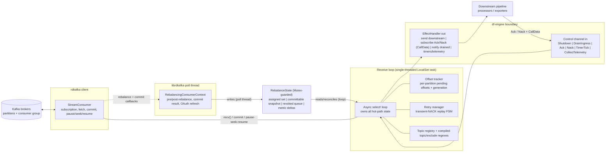
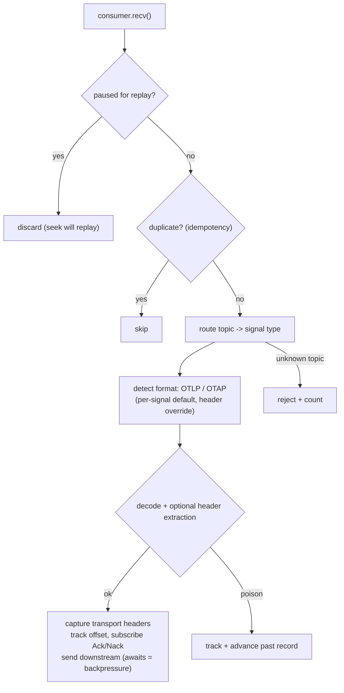
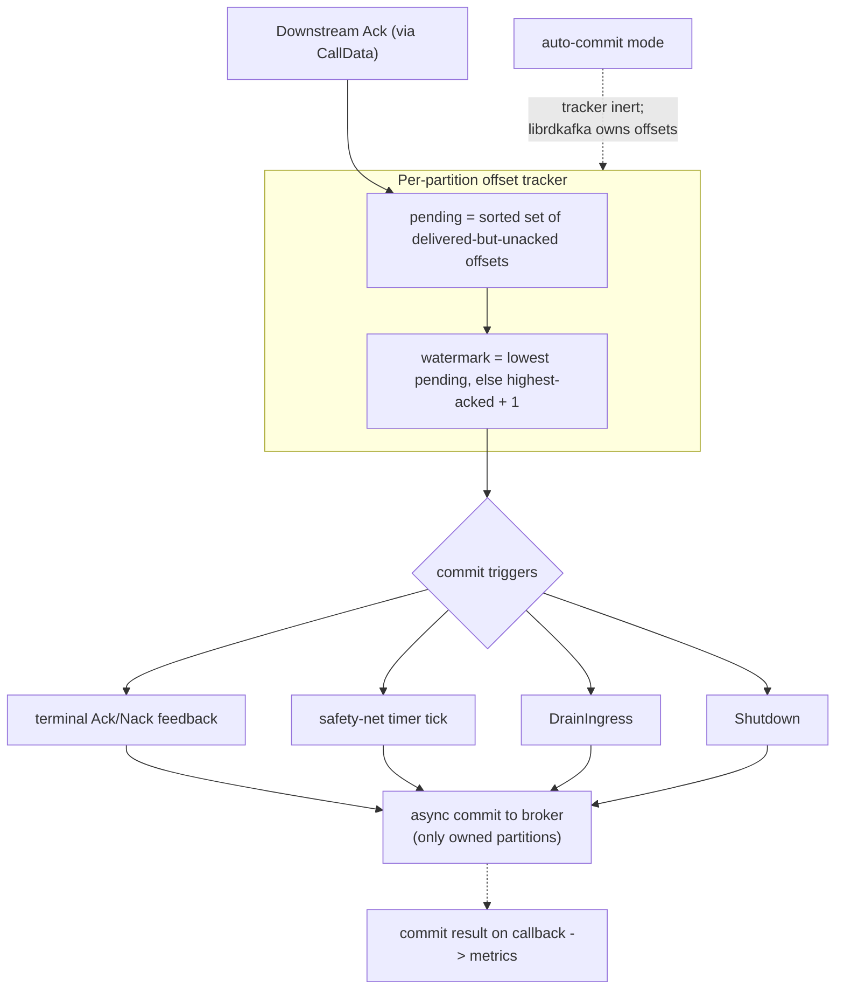
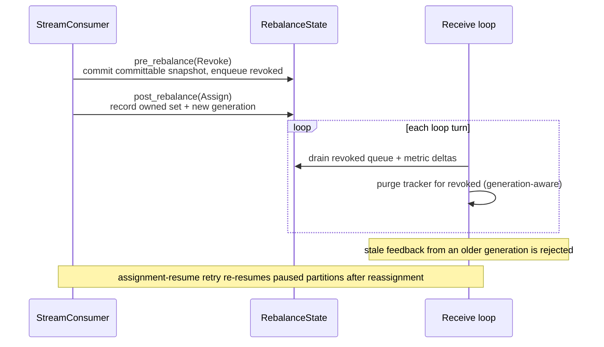
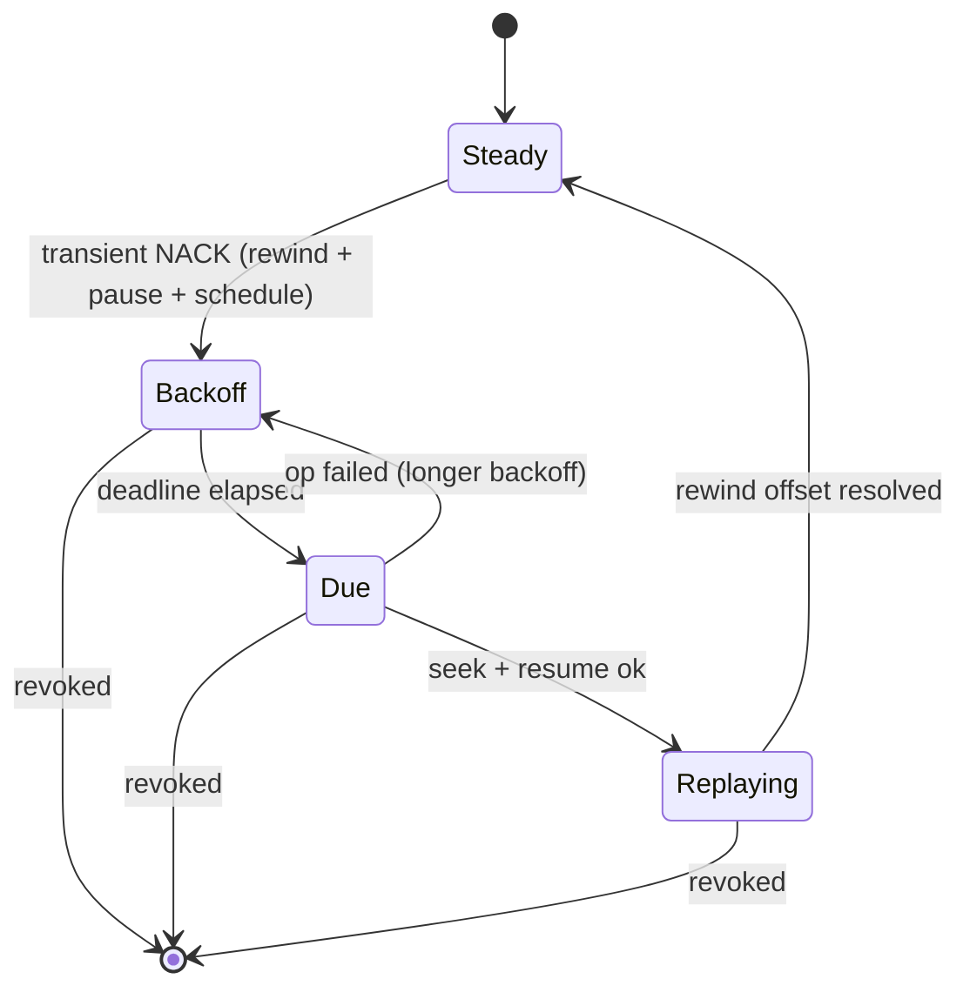

# Kafka Receiver Architecture

## Overview

The Kafka receiver (`urn:otel:receiver:kafka`) is a Kafka consumer-group member
that ingests OpenTelemetry telemetry (traces, metrics, logs) from Kafka topics
and emits it into the OTAP df-engine pipeline. Payloads may be OTLP-proto or
OTAP-proto, selected per signal by config and overridable per message by a
Kafka header. Topics are routed to a signal by subscription (literal names or
`^`-prefixed regex, with optional exclude patterns).

The single most important design fact is a **concurrency boundary**:

- The receiver's main loop runs on the df-engine **single-threaded, per-core
  `LocalSet` runtime**. All hot-path bookkeeping (offset tracking, replay
  state, topic registry) lives here and needs no locks.
- Kafka **consumer-group rebalances and commit results are delivered by
  librdkafka on its own poll thread** through `ConsumerContext` callbacks. That
  thread cannot touch the `LocalSet`-owned state directly.

These two worlds are bridged by exactly one small, mutex-guarded shared object
(`RebalanceState`). Understanding that bridge is the key to understanding the
receiver.

### Kafka-native framing

The receiver maps onto standard librdkafka consumer behavior as follows:

- **Manual commit (default)** sets `enable.auto.commit=false` **and**
  `enable.auto.offset.store=false`: the receiver fully owns the offset store and
  commits explicitly, and only the lowest un-acknowledged contiguous offset per
  partition is committed => **at-least-once** (out-of-order acks never skip an
  un-acked record).
- **Auto commit** sets `enable.auto.commit=true`: librdkafka owns offsets =>
  **at-most-once**. In this mode the offset tracker, rebalance handling, and
  retry subsystem are all inert.
- **Commit-before-revoke**: the `pre_rebalance(Revoke)` callback commits owned
  partitions' watermarks before they leave the member.
- **Transient-NACK replay**: a non-permanent downstream NACK drives a partition
  `pause` -> `seek(rewind_offset)` -> `resume` with exponential backoff.
- **Static membership** via `group.instance.id` (suffixed with the core id on a
  multi-core pipeline so members do not fence each other).
- Assignment (`partition.assignment.strategy`: `range` / `round_robin` /
  `cooperative_sticky`), read isolation (`isolation.level`), and start position
  (`auto.offset.reset`) are surfaced directly as config.

The receiver never blocks the single-threaded runtime on a broker round-trip:
commits are asynchronous (the broker result arrives later on the commit
callback), and any potentially blocking librdkafka call (consumer-lag lookups,
final consumer close) is bounded and off-loaded.

## Architecture

The top-level view: the two threads, the shared state that bridges them, the
loop-owned hot-path state, and the df-engine boundary.

Highlights:

- The **only** state shared across the thread boundary is `RebalanceState`. The
  poll thread writes assignment/revocation/commit-result facts into it; the loop
  reconciles them at the top of each turn.
- `CallData` is an opaque per-record token (topic id, partition, offset,
  delivery generation) that the receiver attaches when it subscribes for
  Ack/Nack. It comes back verbatim on the acknowledgement, letting the loop
  correlate feedback to a Kafka offset without holding the message.
- Backpressure is implicit: emitting downstream awaits the pipeline channel, so
  while the loop is blocked sending, it stops fetching new Kafka records.

## Message ingest path

The per-record path taken by each `consumer.recv()` result.

Highlights:

- **Poison pill**: a record that fails to decode is still tracked and advanced
  past, so one bad message cannot wedge a partition.
- **Idempotency** (opt-in, manual commit) is generation-aware: a record
  redelivered under a newer ownership generation (after revoke+reassign) is
  reprocessed, not skipped.
- Records buffered inside librdkafka for a partition that is paused for replay
  are discarded here; the pending seek is what re-reads them.

## Offset commit and at-least-once

Highlights:

- Out-of-order acks never move the watermark past an un-acked offset, so a crash
  re-delivers only genuinely un-acked records (at-least-once).
- Four independent triggers can commit: terminal Ack/Nack feedback, the
  safety-net timer, `DrainIngress`, and `Shutdown`. Only owned partitions are
  committed.
- Commits are asynchronous; the broker outcome is observed later on the commit
  callback (the single source of truth for commit success/failure metrics).

## Rebalance and consumer group

Highlights:

- The poll-thread callbacks only record facts (owned set, revoked queue, metric
  deltas) into `RebalanceState`; the loop reconciles them and purges the tracker
  on its next turn, generation-aware.
- `pre_rebalance(Revoke)` commits the committable snapshot so owned partitions
  are committed before they leave the member (commit-before-revoke).
- Assignment strategy (`range` / `round_robin` / `cooperative_sticky`) is chosen
  via config; cooperative-sticky minimizes partition movement across rebalances.

## Transient-NACK replay

Applies only in manual-commit `replay` mode. A non-permanent downstream NACK
rewinds the partition and replays from the failed offset instead of skipping it.

Highlights:

- While in `Backoff`/`Due`, buffered deliveries for the partition are discarded;
  the pending seek is the source of truth for what gets re-read.
- Each replay allocates a new **delivery generation** so acknowledgements from
  the pre-replay delivery are recognized as obsolete and ignored.
- The alternative `commit_and_skip` mode has no state machine: a transient NACK
  is treated like a terminal one (advance past the record).

---

## Configuration reference

Grouped by concern. Built-in fields take precedence over the raw
`consumer_config` escape hatch; the last write wins for `debug`/`log_level`.

| Category | Key options | librdkafka mapping |
| --- | --- | --- |
| Connection / auth | `brokers`, `client_id`, `auth` (SASL), `tls` | security protocol auto-resolved from tls+auth |
| Consumer group | `group_id`, `session_timeout_ms`, `heartbeat_interval_ms` | `group.id`, `session.timeout.ms`, `heartbeat.interval.ms` |
| Static membership | `group_instance_id` (per-core suffixed) | `group.instance.id` |
| Assignment | `rebalance_strategy` | `partition.assignment.strategy` |
| Per-signal topics | `{traces,metrics,logs}.topics`, `.exclude_topics` | subscription set (literal or `^regex`) |
| Encoding | `{signal}.encoding` (OTLP / OTAP) | per-signal payload decoder |
| Format override | `message_format_header` | per-message header selecting OTLP/OTAP |
| Commit mode | `commit.mode` (auto / manual), `commit.interval_ms` | `enable.auto.commit`, `enable.auto.offset.store`, safety-net timer |
| Read isolation | `isolation_level` | `isolation.level` |
| Start position | `auto_offset_reset` | `auto.offset.reset` |
| Transient NACK | `transient_nack.mode` (commit_and_skip / replay), `initial_backoff_ms`, `max_backoff_ms` | pause/seek/resume replay (manual only) |
| Idempotency | `enable_idempotency` | receiver-side dedupe (manual only) |
| Consumer lag | `lag_refresh_interval_ms` | background mean-lag gauge (manual only) |
| Fetch tuning | `min_fetch_bytes`, `max_fetch_bytes`, `max_fetch_wait_ms`, `max_partition_fetch_bytes` | fetch.* properties |
| Header enrichment | `resource_attrs_from_headers` | inject Kafka headers into resource attributes |
| Escape hatch / diag | `consumer_config`, `debug`, `log_level` | raw librdkafka properties |

## Metrics reference

All under `receiver.kafka.*`, with bounded-cardinality typed attributes.

| Concern | Metrics |
| --- | --- |
| Ingestion / admission | records received + bytes; messages started/completed + payload size (per signal); records in-flight; acknowledgement responses (per signal + outcome) |
| Rejections | rejected messages by reason (empty payload, unknown topic, decode, topic-id exhausted, internal) |
| Offset management | offset commits (per outcome, from the commit callback) |
| Rebalance / consumer group | rebalances; owned partitions; partition assignments/revocations; rebalance commit/resume failures; mean consumer-group lag; feedback-after-revocation |
| Retry / replay | transient NACKs; replay attempts; partitions paused; pause/seek/resume failures; stale replay feedback; duplicate records |
| Transport errors | consumer transport errors by category (transport, timeout, auth, authorization, unknown topic/partition, offset, poll-exceeded, other) |

## Concurrency and invariants

- **Single-threaded hot path.** The receive loop owns the offset tracker, retry
  manager, and topic registry outright; there are no locks on the per-record
  path.
- **One shared object.** `RebalanceState` is the only cross-thread state. Its
  mutex is poison-tolerant (a panic elsewhere recovers the guard rather than
  killing the receiver) because it protects plain bookkeeping.
- **Callbacks cannot mutate loop state.** librdkafka rebalance/commit callbacks
  run on the poll thread and only write facts into `RebalanceState`; the loop
  applies them (tracker purge, metric folding) at the top of each turn.
- **Never block the runtime.** Steady-state commits are asynchronous;
  consumer-lag lookups run on a `spawn_blocking` worker bounded by a deadline
  and a cancellation token; the final consumer close on shutdown/drain is
  bounded by the shutdown deadline.
- **Generations guard correctness.** An *ownership* generation scopes tracker
  state across rebalances (a stale revoke cannot purge freshly reassigned
  state; a stale ack cannot advance/roll back offsets). An independent
  *delivery* generation invalidates feedback from before a transient-NACK
  replay.
- **Auto-commit inertness.** In auto-commit mode librdkafka owns offsets, so the
  offset tracker, rebalance handling, and retry subsystem are all no-ops.
