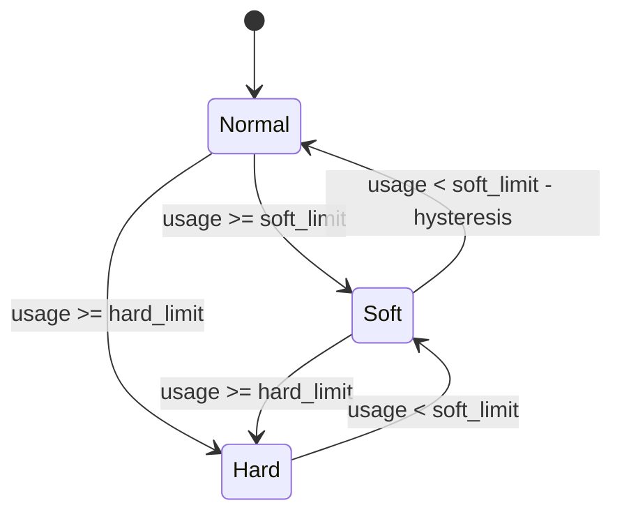

# Memory Limiter - Phase 1

This document describes the **Phase 1 implementation** of the process-wide memory
limiter. It covers current behavior only. The longer-term hierarchical
lease-and-ticket design is planned for a separate document.

## Problem

The collector already has bounded channels, topic publish limits, and
receiver-side backpressure. Those controls are local: each one protects a
single queue or subsystem, but nothing enforces a shared RAM ceiling across:

- concurrent receiver ingress
- decoded and buffered request bodies
- multiple queues and topics simultaneously
- allocator overhead and fragmentation
- retained protocol state

Phase 1 adds a **process-wide guardrail** against sustained memory pressure.

## Scope

Phase 1 is a **process-wide observed-memory limiter** implemented as an engine
service. It samples actual process memory on a fixed interval and gates
receiver ingress based on the result.

Implementation note:

- Sampling and pressure classification remain process-wide in the controller.
- On pressure transitions, the controller propagates updates to receivers
  through the pipeline control plane.
- These transitions are delivered as receiver control messages
  (`NodeControlMsg::MemoryPressureChanged`).
- Each receiver maintains receiver-local admission state and consults that
  local state on ingress hot paths.

**What it does:**

- Sample process memory on a configurable interval
- Classify pressure as `Normal`, `Soft`, or `Hard`
- Keep `Soft` informational - requests continue flowing
- Shed ingress at the receiver boundary only under `Hard` (in `enforce` mode)
- Optionally fail the readiness probe under `Hard` (in `enforce` mode)
- Optionally run in `observe_only` mode for metrics and logs without
  enforcement
- Expose process-level memory and pressure metrics

**What it does not do:**

- Per-pipeline memory budgets
- Ticketed byte accounting
- Per-core local leases
- Queue or topic byte charging
- Reclaim hooks for stateful components
- OTAP stream recycling

## Why This Complements Bounded Channels

Bounded channels and topic policies are not replaced by the memory limiter.
They serve different purposes:

- **Bounded channels / topics** control local backlog growth within one queue
- **Memory limiter** controls total process memory at the outer ingress boundary

When an internal queue fills, cooperative producers block or drop according to
that queue's policy. When the **process as a whole** approaches its memory
limit, a separate ingress policy is needed at the boundary - one that does not
depend on knowing which internal queue is the cause.

A key difference in timing: bounded channels react after a message has already
been accepted, decoded, and buffered. The memory limiter acts earlier - at the
receiver ingress boundary, before expensive body accumulation or downstream
admission. This means the limiter can shed load without the full cost of
accepting the work first.

## Configuration

The memory limiter is configured under `policies.resources.memory_limiter` in
the engine config. This field is supported only at the top-level `policies`
scope; group and pipeline overrides are rejected during validation.

```yaml
policies:
  resources:
    memory_limiter:
      mode: enforce        # or observe_only for metrics/logs without rejection
      source: auto          # prefer auto/cgroup on Linux containers
      check_interval: 1s    # minimum 100ms
      soft_limit: 7 GiB     # if set explicitly, keep headroom above idle
      hard_limit: 8 GiB     # shedding threshold; not a strict cap
      hysteresis: 512 MiB   # bytes below soft_limit required to leave Soft
      retry_after_secs: 5   # used only in enforce mode
      fail_readiness_on_hard: true  # used only in enforce mode
      purge_on_hard: false  # optional jemalloc purge hook, disabled by default
      purge_min_interval: 5s
```

### Limit selection

Limits are resolved in this order:

1. Explicit `soft_limit` and `hard_limit` (both required if either is set)
2. `source: auto` with cgroup-derived limits when a cgroup memory controller
   is detected

When `source: auto` is used and no explicit limits are configured, the limiter
reads the cgroup hard cap (`memory.max` on cgroup v2, `memory.limit_in_bytes`
on v1) and derives both thresholds from it:

- `soft_limit` = 90% of the cgroup limit
- `hard_limit` = 95% of the cgroup limit

This leaves a 5% buffer between the limiter's shedding threshold and the
kernel's actual OOM kill boundary.

When no cgroup memory controller is detected (for example on macOS, Windows,
or a bare-metal Linux process without a memory cgroup), `auto` does **not**
fall back to deriving limits from total physical RAM. Explicit `soft_limit`
and `hard_limit` must be provided, or startup fails with a configuration
error. This is intentional: silently deriving limits from total host RAM
could produce dangerously high thresholds on large machines.

### Sizing guidance

- Do not set `soft_limit` and `hard_limit` only a few MiB above observed idle
  RSS. Small run-to-run variance can be enough to flip the limiter from "never
  reaches Hard" to "enters Hard and stays there".
- Treat `hard_limit` as an ingress-shedding threshold, not as a promise that
  process memory will stay below that value. The limiter is periodic and
  reactive, so bursty workloads can overshoot it before shedding takes effect.
- For RSS-based configurations, size limits with explicit headroom above
  sustained steady-state memory, not just above an idle snapshot. As a rule of
  thumb, start with at least 15-20% headroom above observed steady-state
  memory, then adjust using production measurements.
- For Linux containerized deployments, prefer `source: auto` so the limiter can
  derive cgroup-based limits instead of relying on RSS alone.
- Auto-derived cgroup limits use 90%/95% of the cgroup cap. If you want the
  limiter to begin shedding well before the container approaches its memory
  limit, configure explicit `soft_limit` and `hard_limit` values relative to
  expected peak working-set usage.
- Recovery from `Hard` requires usage to fall below `soft_limit`, not merely
  below `hard_limit`. In practice, `soft_limit - steady_state_usage` is the
  real recovery headroom. If `soft_limit` is set below the process's
  irreducible working set, `Hard` becomes a permanent state.

### Mode

- `mode` is required when `memory_limiter` is configured. This is an explicit
  operator choice, not an implicit default.
- `mode: enforce` sheds ingress under `Hard` pressure and can fail readiness.
- `mode: observe_only` keeps classification, logs, and metrics enabled but
  suppresses ingress shedding, readiness failure, and forced jemalloc purge.
- For a first rollout, prefer `mode: observe_only` so you can validate sampled
  usage, pressure transitions, dashboards, and readiness behavior before
  enabling enforcement.

Mode is set at startup and cannot be changed while the process is running.

### Purge

- `purge_on_hard` is an optional jemalloc-only mitigation for RSS-based
  retention. When enabled, a tick whose pre-purge sample classifies as `Hard`
  attempts a forced jemalloc purge, then re-samples memory before classifying
  the next state.
- `purge_min_interval` controls the minimum time between purge attempts. Both
  successful and failed attempts count toward the rate limit, which prevents
  the limiter from spamming a broken purge call on every tick.
- Purge is best-effort. If the purge call or the post-purge re-sample fails,
  the limiter logs a warning (`process_memory_limiter.purge_failed`) and
  commits the pre-purge `Hard` classification. A purge failure never prevents
  the limiter from updating shared state.
- `purge_on_hard` is ignored in `observe_only` mode. If `purge_on_hard` is
  enabled but jemalloc purge support is not available in the build, the
  limiter logs a startup warning (`process_memory_limiter.purge_unavailable`)
  and continues without purge.
- Keep `purge_on_hard` disabled unless you have validated it on your workload.
  It is intended as an escape hatch for allocator-retained resident pages, not
  as the default recovery mechanism.

### Memory source

<!-- markdownlint-disable MD013 -->
| Source | Description |
| --- | --- |
| `auto` | Cgroup working set if available, otherwise RSS, otherwise jemalloc resident |
| `cgroup` | Cgroup working set (v1 and v2 supported); fails if no cgroup controller detected |
| `rss` | Process RSS via the `memory_stats` crate |
| `jemalloc_resident` | jemalloc resident bytes; requires `jemalloc` feature |
<!-- markdownlint-enable MD013 -->

Cgroup sampling subtracts `inactive_file` pages from the raw usage counter,
consistent with how container orchestrators report memory usage.

### Source selection guidance

- Prefer `source: auto` for Linux containerized deployments. In Kubernetes and
  other cgroup-managed environments, this usually resolves to `cgroup`.
- `cgroup` is not Kubernetes-specific. It is also meaningful for Linux services
  that run inside a memory-constrained systemd slice or another configured
  cgroup.
- For a plain Linux process started from a shell without a meaningful cgroup
  memory limit, explicit `soft_limit` and `hard_limit` are typically required.
- `jemalloc_resident` is a resident-memory signal, not a live-allocation
  signal. It is not a recovery-oriented alternative to `rss`.

## Platform Support

The Phase 1 limiter architecture is portable, but the current implementation is
strongest on Linux.

- Linux has the best support today because `auto` can use cgroup working-set
  sampling and cgroup-derived limits.
- On non-Linux platforms, the limiter can still use RSS-based sampling, and it
  can use explicit configured limits.
- `auto` does **not** fall back to total physical RAM on macOS or Windows.
  If no cgroup limit is available and no explicit limits are set, startup
  fails.

Internally, the implementation keeps the platform-specific logic at the memory
probe boundary. The pressure-state logic, receiver shedding behavior, and
controller integration remain platform-independent.

### Recovery caveat for `rss`

When the collector is built with jemalloc and configured with `source: rss`,
recovery after burst load can be slow. Freed allocations may remain resident in
jemalloc arenas for reuse, so process RSS can stay above `hard_limit` even
after live workload drops. In that state the limiter may continue to reject new
ingress until resident pages are released or the process restarts.

For containerized Linux deployments, prefer `source: auto` or `source: cgroup`
when available. Resident-memory sources are conservative protection signals,
but they are not ideal recovery signals after allocator-heavy bursts.

### Container deployment notes

- In containers, `source: auto` should resolve to `cgroup` and generally
  provides better recovery behavior than `rss`.
- If you rely on `/readyz` from Kubernetes or another orchestrator, bind the
  admin server to a pod-reachable address such as `--http-admin-bind
  0.0.0.0:8080`. The default loopback bind is not sufficient for external
  readiness probes.
- Set `--num-cores` in line with the container CPU limit. Otherwise the engine
  may start more worker threads than the container is intended to run, which
  increases idle memory overhead.

## Pressure Semantics

The limiter maintains a three-level pressure state:

| Level | Meaning | Receiver behavior |
| --- | --- | --- |
| `Normal` | Below `soft_limit` | No action |
| `Soft` | Above `soft_limit` | Informational only; requests continue flowing |
| `Hard` | Above `hard_limit` | Ingress shedding enabled (`enforce` mode only) |

When `mode: observe_only` is configured, the same state transitions still
occur, but `Hard` remains advisory: receivers continue accepting requests and
the readiness endpoint stays healthy.



### Transitions

- **Escalation** (Normal -> Soft, Soft -> Hard, Normal -> Hard) is immediate
  when the threshold is crossed.
- **Recovery from Soft** requires usage to drop below
  `soft_limit - hysteresis` before returning to `Normal`. This prevents
  oscillation when usage hovers near the soft threshold.
- **Recovery from Hard** requires usage to drop below `soft_limit`
  before returning to `Soft`.
- Phase 1 does **not** implement cooldown timers. Those are planned for a
  later phase.

Because sampling is periodic, the limiter can move directly from `Normal` to
`Hard` under fast bursts without spending a full interval in `Soft`.

Operationally, this means `soft_limit` is the reopening threshold after
shedding begins. `hard_limit` starts rejection, but recovery does not begin
until usage has fallen below `soft_limit`.

## Receiver Behavior Under Hard Pressure

Phase 1 applies protocol-native overload signals at each receiver. The
following behaviors apply in `enforce` mode only. In `observe_only` mode,
receivers continue accepting requests regardless of pressure level.

<!-- markdownlint-disable MD013 -->
| Receiver | Hard-pressure behavior |
| --- | --- |
| OTLP HTTP | `503 Service Unavailable` with `Retry-After: <retry_after_secs>` header |
| OTLP gRPC | `RESOURCE_EXHAUSTED` with `grpc-retry-pushback-ms: <retry_ms>` metadata |
| OTAP gRPC stream open / next-read boundary | `RESOURCE_EXHAUSTED` + `grpc-retry-pushback-ms` before stream admission, and for already-open streams at the next read boundary |
| OTAP gRPC per-batch | `ResourceExhausted` in the OTAP Arrow batch status (ArrowStatus code 8) |
| Syslog / CEF TCP | Accept then immediately drop new connections; close active connections mid-stream |
| Syslog / CEF UDP | Drop incoming datagrams |
<!-- markdownlint-enable MD013 -->

**Soft pressure:** all receivers continue operating normally - no requests are
rejected and no receiver-level rejection counters increment. The engine-level
`memory_pressure_state` metric reflects `1` (Soft) and
`process_memory_usage_bytes` reflects the elevated usage. A
`process_memory_limiter.transition` log event is emitted at `info` level on
entry to `Soft`. The behaviors in the table above apply only at `Hard` in
`enforce` mode.

**Syslog / CEF client behavior under Hard pressure:**

- **TCP:** The receiver accepts new connections and then immediately drops the
  socket, closing active connections mid-stream. The connection is closed at the
  transport layer with no application-level retry hint - unlike OTLP/OTAP,
  no `Retry-After` or pushback value is sent. Most syslog clients (rsyslog,
  syslog-ng, Fluent Bit) have their own reconnect backoff, but they have no
  signal about why the connection was closed or how long to wait before
  reconnecting.
- **UDP:** Datagrams are silently dropped at the receiver. UDP is fire-and-forget,
  so the sender receives no feedback at all. Events are permanently lost with no
  indication to the sending client. Operators relying on UDP syslog should treat
  Hard pressure as a potential data-loss event and monitor
  `received_logs_rejected_memory_pressure` to detect it.

**Design rationale:** explicit rejection is preferred over transport-level
stalling. For TCP, holding large numbers of stalled open connections under
pressure can consume more resources than the data they carry. Explicit close or
refusal is observable, bounded, and gives senders a clear signal to back off.

**Known gap:** OTAP stream reads are checked for memory pressure at the next
read boundary. If pressure flips to `Hard` while a stream task is already
blocked in `message().await`, one additional batch may still be read before the
stream is rejected.

## Readiness Integration

When `fail_readiness_on_hard` is enabled (default: `true`), the `/readyz`
endpoint returns `503 Service Unavailable` while the limiter is in `Hard`
pressure in `enforce` mode. In `observe_only`, readiness remains healthy even
if pressure reaches `Hard`. The `/livez` endpoint is unaffected.

## Metrics

### Engine-level (emitted by the engine metrics monitor)

All engine metrics are registered under the `engine.metrics` metric-set.

<!-- markdownlint-disable MD013 -->
| Metric | Description |
| --- | --- |
| `memory_rss` | Current process RSS in bytes |
| `process_memory_usage_bytes` | Most recent memory limiter sample in bytes |
| `process_memory_soft_limit_bytes` | Effective soft limit in bytes |
| `process_memory_hard_limit_bytes` | Effective hard limit in bytes |
| `memory_pressure_state` | Current pressure level (0=Normal, 1=Soft, 2=Hard) |
| `cpu_utilization` | Process CPU utilization as a ratio in [0, 1], normalized across all system cores |
<!-- markdownlint-enable MD013 -->

### Receiver-level

<!-- markdownlint-disable MD013 -->
| Metric | Receiver | Description |
| --- | --- | --- |
| `otlp.receiver.metrics.refused_memory_pressure` | OTLP (gRPC + HTTP) | Requests rejected due to memory pressure |
| `otlp.receiver.metrics.rejected_requests` | OTLP (gRPC + HTTP) | Total rejected requests (includes memory pressure) |
| `otap.receiver.metrics.refused_memory_pressure` | OTAP gRPC | Requests rejected due to memory pressure |
| `otap.receiver.metrics.rejected_requests` | OTAP gRPC | Total rejected requests (includes memory pressure) |
| `syslog_cef.receiver.metrics.tcp_connections_rejected_memory_pressure` | Syslog / CEF TCP | Connections rejected or closed |
| `syslog_cef.receiver.metrics.received_logs_rejected_memory_pressure` | Syslog / CEF | Log records dropped under pressure |
<!-- markdownlint-enable MD013 -->

### Structured log events

<!-- markdownlint-disable MD013 -->
| Event | Level | Description |
| --- | --- | --- |
| `process_memory_limiter.transition` | info/warn | Emitted on every pressure level change. `Hard` transitions log at warn level. |
| `process_memory_limiter.purge` | info | Emitted after a successful forced jemalloc purge. Includes pre/post usage and duration. |
| `process_memory_limiter.purge_failed` | warn | Emitted when a purge attempt or post-purge re-sample fails. |
| `process_memory_limiter.purge_unavailable` | warn | Emitted at startup when `purge_on_hard` is enabled but no allocator purge backend is available in this build. |
| `process_memory_limiter.sample_failed` | warn | Emitted when a periodic memory sample fails. |
| `process_memory_limiter.observe_only_ignored_setting` | warn | Emitted at startup when `purge_on_hard: true` is set with `mode: observe_only` (purge is suppressed in that mode). |
<!-- markdownlint-enable MD013 -->

## Tradeoffs

Phase 1 is deliberately simpler than the long-term design.

**Benefits:**

- Low implementation risk
- Additional process-wide protection against memory pressure
- Enforcement hot paths are receiver-local and NUMA-friendly; the process-wide
  sampler is not consulted on ingress
- Clean fit with existing receiver admission controls
- No invasive queue or pdata instrumentation required

**Limitations:**

- Reactive: detects pressure after memory is already allocated
- The configured `hard_limit` is a shedding threshold, not a strict cap on
  peak process memory
- Process-wide only: cannot isolate one misbehaving pipeline
- No accounting for bytes retained in queues, topics, or processor state
- No reclaim actions by default; optional `purge_on_hard` can force a
  jemalloc purge before reclassification

## Relationship to Later Phases

Later phases will add:

- Queue and topic byte accounting
- Per-pipeline memory budgets
- Per-core local leases with bounded overshoot
- `MemoryTicket` ownership on retained work items
- Reclaim hooks for stateful components (batch processor, retry, durable buffer)
- OTAP stream-state accounting and recycling

Those are out of scope for this document and this branch.
