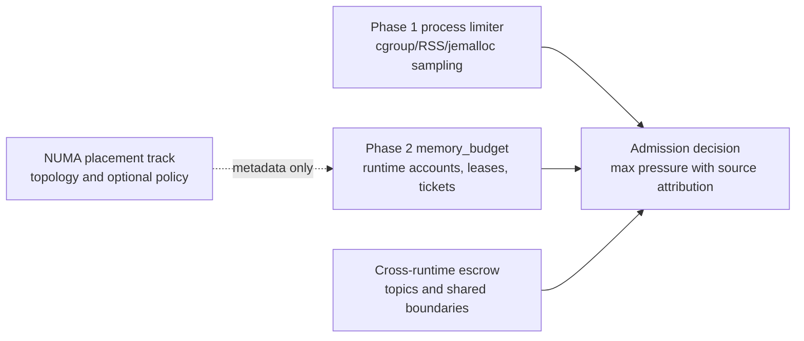
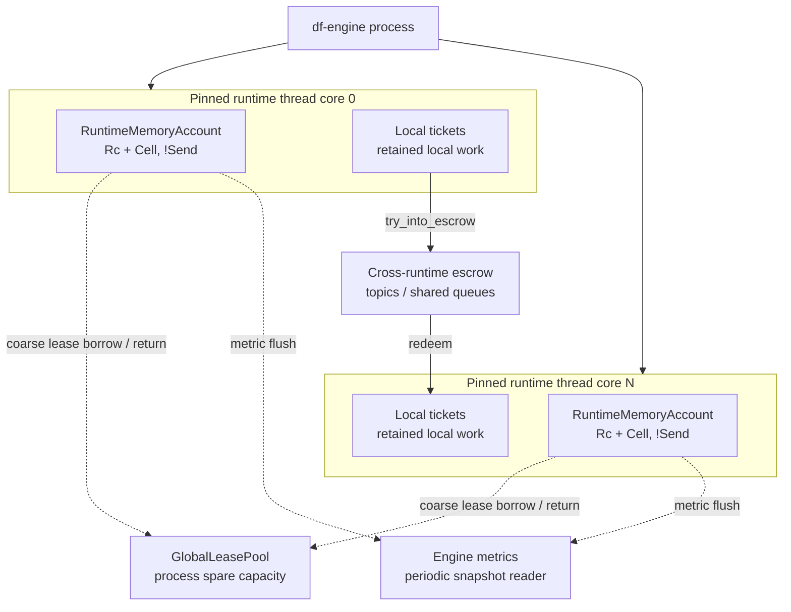
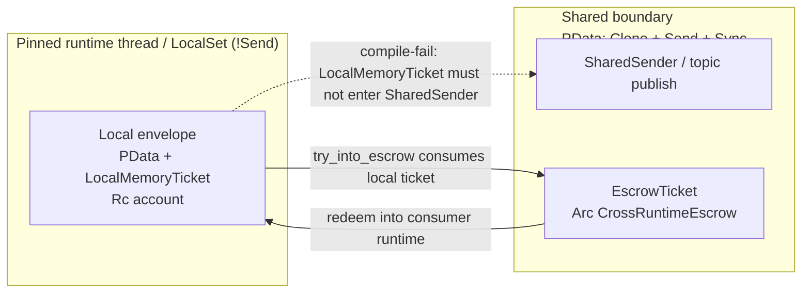
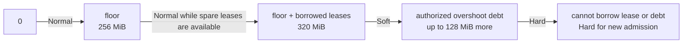
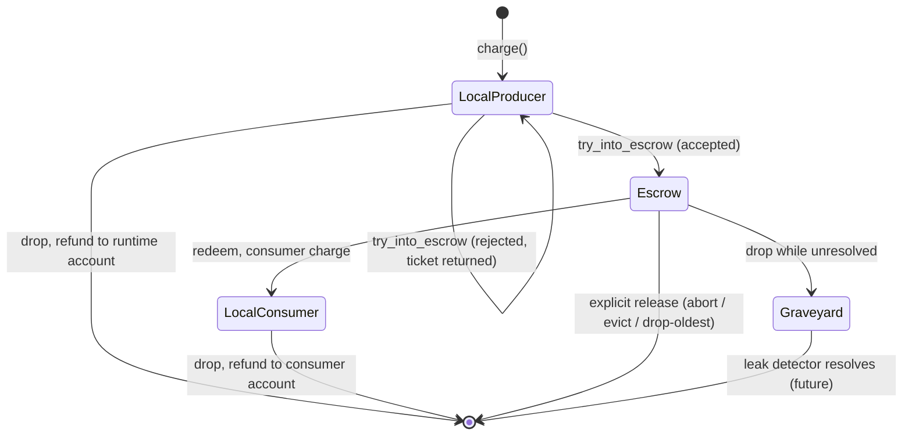
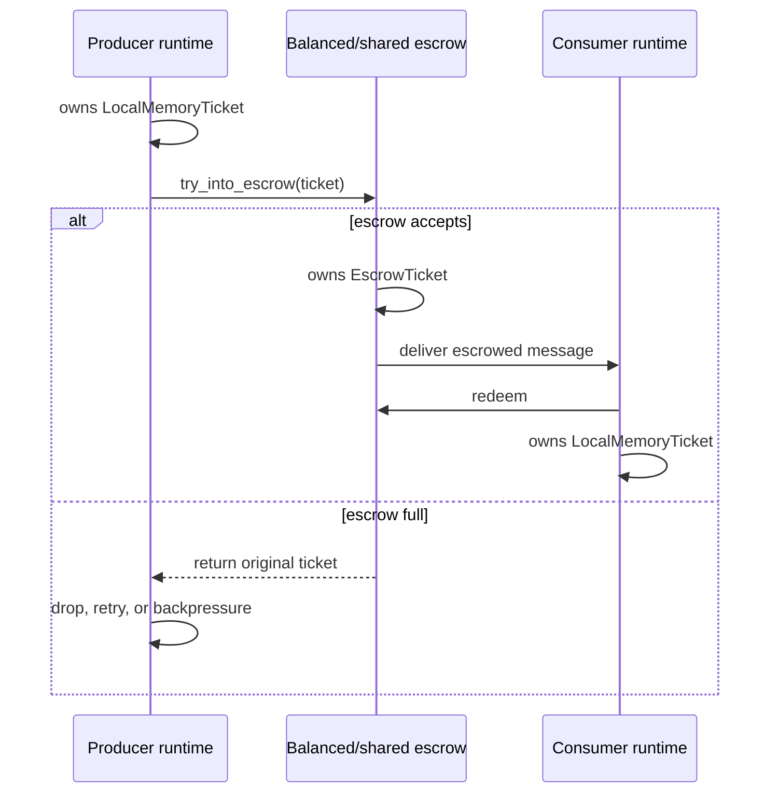
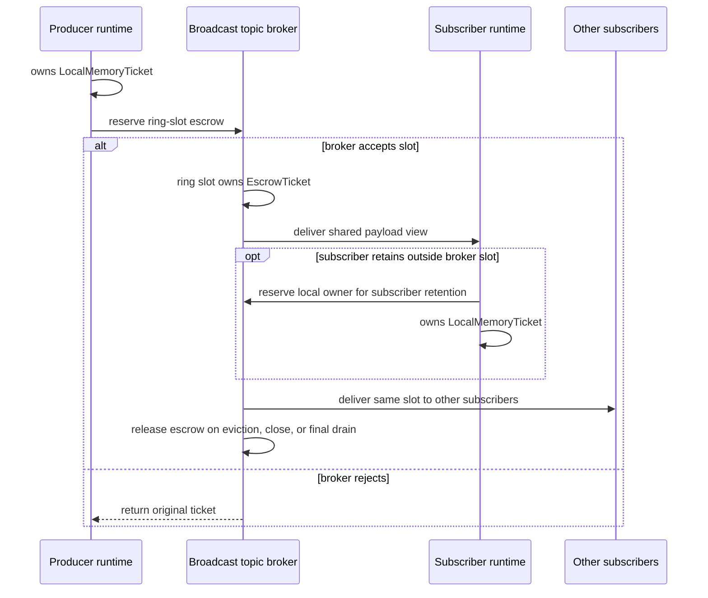

# Memory Limiter - Phase 2 Design

This document proposes Phase 2 of the df-engine memory limiter. Phase 1 is a
process-wide observed-memory limiter that samples process or cgroup memory and
sheds receiver ingress under `Hard` pressure. Phase 2 adds structured
per-runtime memory accounting and soft enforcement while keeping the Phase 1
process limiter as the outer safety net.

This is a design document. It intentionally does not describe a patch to the
current implementation.

In short:

- Phase 1 already provides a process-wide memory pressure guardrail.
- Phase 2's main feature is per-runtime memory budgeting across cores.
- NUMA-aware allocation is a related placement option, not the budget itself.

## Table of Contents

- [Goals](#goals)
- [Review Focus](#review-focus)
- [Non-Goals](#non-goals)
- [Design at a Glance](#design-at-a-glance)
- [Current Runtime Shape](#current-runtime-shape)
- [Design Principles](#design-principles)
- [Proposed Architecture](#proposed-architecture)
- [Budget Model](#budget-model)
- [Ticket Ownership](#ticket-ownership)
- [Cross-Runtime Escrow](#cross-runtime-escrow)
- [Admission Model](#admission-model)
- [NUMA Placement Appendix](#numa-placement-appendix)
- [Configuration](#configuration)
- [Metrics](#metrics)
- [Integration Guide](#integrating-a-component-with-memory-budgeting)
- [Phased Rollout](#phased-rollout)
- [Validation Scenarios](#validation-scenarios)

## Goals

Phase 2 should provide:

- Per-runtime attribution for retained memory.
- Fairness between pipeline runtime instances on different cores.
- Earlier and more local backpressure than a process-wide pressure signal.
- Bounded local hot-path overhead on the current-thread runtime.
- Correct ownership transfer when data crosses runtime or topic boundaries.
- Clear separation between logical memory ownership and physical allocator
  residency.
- Optional NUMA locality support as a placement feature, not as a memory limit.

Phase 2 should preserve the Phase 1 memory-limiter behavior where it applies:

- The process-wide limiter remains the final container/process safety net.
- Receivers continue to check local admission state on the hot path; process
  memory sampling remains centralized and propagated by pressure updates.
- If a platform cannot support a memory sampling feature, the engine reports
  that clearly instead of silently changing behavior.

## Review Focus

Feedback is especially useful on:

- whether `LocalMemoryTicket` plus `EscrowTicket` is the right ownership model
  for retained work
- whether Phase 2 should keep `memory_budget` top-level only at first
- whether broadcast topic accounting should start with broker ring-slot
  ownership instead of per-subscriber ownership
- whether receiver enforcement should remain gated until reclaim hooks exist
- whether the observe-only rollout phases are in the right order

## Non-Goals

Phase 2 does not provide a hard OS-enforced per-runtime memory quota. A single
df-engine process has one address space and one global heap. Inside that
process, per-runtime control is cooperative accounting and admission control.

Phase 2 also does not:

- Replace cgroups, Kubernetes memory limits, or systemd memory controls.
- Treat allocator resident bytes as the enforcement source of truth.
- Enforce on every allocation made by `Vec`, `Box`, Tokio, tonic, hyper, or
  third-party libraries.
- Require Linux NUMA support for correctness.
- Require jemalloc for the logical accounting design.
- Charge temporary scratch memory that is allocated and released within one
  poll turn unless it is retained across an await, queue, or state boundary.

## Design at a Glance

The rest of the design should preserve these invariants:

- Every retained item has exactly one logical owner.
- Logical charged bytes are not allocator bytes, RSS, jemalloc resident bytes,
  or cgroup usage.
- The common local charge path uses runtime-local `Cell` state; shared
  coordination is coarse.
- Local ownership is `!Send`; cross-runtime ownership uses sendable escrow.
- Release, refund, drop, drain, and control-plane cleanup never acquire budget.
- Observe-only metrics and coverage precede enforcement.

Glossary:

<!-- markdownlint-disable MD013 -->
| Term | Meaning |
| --- | --- |
| Charged bytes | Logical retained bytes currently owned by a runtime or escrow boundary. |
| Floor | Guaranteed logical budget assigned to each runtime before borrowing. |
| Lease / `lease_step` | Coarse chunk borrowed from the process spare pool when a runtime exceeds its floor. |
| Overshoot | Charged bytes above the local floor plus borrowed leases. |
| Spare pool | Process hard limit minus reserve and runtime floors; leases are drawn from this pool. |
| Escrow | Sendable ownership used while retained data sits in a shared queue, topic, or cross-runtime boundary. |
| Redemption | Moving escrow ownership into the consumer runtime's local account. |
| Graveyard | Leak-detection holding area for unresolved escrow drops. |
| Generation | Deployment instance of a runtime; runtime-local accounts are generation-scoped, escrow is not. |
<!-- markdownlint-enable MD013 -->

## Current Runtime Shape

The controller launches one pipeline runtime instance per resolved core
assignment. Each instance runs on one OS thread, pins that thread with
`core_affinity::set_for_current`, and then drives a Tokio current-thread
runtime with a `LocalSet`. This shape is a good fit for local accounting because
many hot-path local nodes and effect handlers already stay on one runtime
thread.

The engine also has shared nodes, shared channels, topics, ack/nack paths, and
`PData` bounds that include `Clone + Send + Sync` at controller and topic
boundaries. Phase 2 must respect that split. Local memory-account handles can be
`!Send`, but they must not be embedded directly in `PData` or any type that can
cross a shared boundary.

The current memory limiter is process-wide:

- A controller task samples process/cgroup/RSS/jemalloc-resident memory.
- It classifies memory pressure as `Normal`, `Soft`, or `Hard`.
- It broadcasts `MemoryPressureChanged` to pipeline runtimes.
- Receivers keep local admission state and shed ingress under process `Hard`.

Phase 1 explicitly leaves these Phase 2 items for later:

- queue and topic byte accounting
- per-runtime memory budgets with pipeline attribution
- per-core local leases with bounded overshoot
- `MemoryTicket` ownership on retained work items
- reclaim hooks for stateful components
- OTAP stream-state accounting and recycling

## Design Principles

### Keep Process Pressure and Runtime Budgets Separate

Process pressure answers: "Is the process or container close to its memory
limit?"

Runtime budget pressure answers: "Has this runtime instance exceeded its fair
share or local lease?"

The signals should be stored separately and combined only at admission:

```text
effective_pressure = max(
    process_pressure,        // local cached Phase 1 watch value
    runtime_budget_pressure,
    escrow_pressure,         // max over boundaries this runtime publishes to
)
```

If multiple sources report the same effective pressure level, admission must
choose one deterministic source for decisions, logs, metrics, and
`retry_after_secs`. Tie-break order is:

1. `ProcessHard`
2. `EscrowFull`
3. `RuntimeBudgetHard`

Process pressure wins because it is the outer safety guard. Escrow pressure
wins over runtime budget when a directly attributable shared boundary is
saturated.

Metrics and logs must preserve the source so operators can distinguish a
process-wide safety event, a single noisy runtime, and a saturated
cross-runtime boundary.

The runtime must not read the process-wide sampler on the hot path. The
`process_pressure` input is the Phase 1 pressure level already published to
receivers. Today that is a shared atomic level read locally by receivers, not a
sampler call or controller round trip. Phase 2 can add a runtime-local cached
projection later if profiling shows the atomic read matters. `escrow_pressure`
is scoped to boundaries the runtime publishes to or owns; it is not a max
across all process escrows.

### Use Logical Ownership for Enforcement

The enforcement number should be logical retained bytes, not allocator resident
bytes. A retained item owns a ticket. Dropping the item drops the ticket and
returns the charge.

This is necessary because pdata can cross cores. If a batch is allocated on
runtime A and consumed by runtime B, allocator resident memory may still be
attributed to A, but logical ownership has moved to B or to an intermediate
topic/queue. Enforcement should follow ownership, not the allocator arena that
originally served the allocation.

### Keep Hot Paths Local and Coordination Coarse

The common case should mutate local `Cell` state on the current-thread runtime.
Shared atomics are acceptable for:

- lease refill/return in coarse chunks
- metrics snapshots
- cross-runtime escrow queues
- controller-visible status

They should not be required for every charged byte or every receiver ingress
check.

Lease and escrow coordination must be chunked. A runtime should borrow from the
global pool in `lease_step_bytes` blocks, not one byte at a time. A runtime
should return borrowed capacity lazily when charged bytes fall below a low
watermark, not on every ticket drop. Escrow should publish shared state in
batched deltas where possible. A good implementation target is:

- no global atomic on the common charge path below the local lease
- at most two local `Cell` mutations per retained item
- at most one global coordination event per `lease_step_bytes`
- no budget acquisition for release, drop, drain, or control-plane cleanup

Phase 2 memory budgeting must be a hot-path non-regression. On the local
retained-item path below the lease boundary, charge, refund, local
runtime-budget admission, and local ticket drop must not acquire locks, read
shared configuration, publish metric snapshots, or touch shared atomics. Values
needed on that path should be copied into the runtime-local account or cached as
runtime-local state. Shared coordination is allowed only at coarse lease
refill/return, existing cross-runtime boundaries such as topics and shared
queues, metric tick publication, or pressure-level transitions.

Topic publish and shared-channel enqueue are real shared boundaries, so they
may pay a shared escrow coordination cost per accepted retained item. The
design goal is to keep ordinary local retention below the lease boundary free of
shared atomics, and to reduce boundary cost with chunking, credit reservation,
or batched escrow deltas where the topic or channel shape allows it.

### Never Block Reclaim or Release

Memory pressure handling must not deadlock. Releasing, dropping, draining,
reclaiming, and sending shutdown/control messages must not require acquiring
more memory budget. Admission may fail; cleanup must not.

### Roll Out Observe-Only First

Every new accounting layer should support `observe_only` mode before it can
enforce. This mirrors Phase 1 and gives operators time to validate skew,
retained byte estimates, and pressure transitions.

## Proposed Architecture

Add a new module instead of overloading the Phase 1 limiter:

```text
crates/engine/src/memory_budget/
    mod.rs
    account.rs
    admission.rs
    escrow.rs
    lease.rs
    metrics.rs
    ticket.rs
```

The module owns per-runtime logical accounting. Phase 1
`memory_limiter.rs` remains the process pressure implementation.

NUMA topology and placement should live in a sibling resource-placement module
or a future `memory-placement.md` design. It is discussed later only because
runtime budget metrics should carry real `numa_node_id` when available.



At runtime, the local-vs-shared ownership shape is:



Solid arrows are ownership transfer at retention boundaries. Dotted arrows are
coarse shared coordination or metric publication. The per-item local charge path
stays inside one pinned runtime thread.

### Core Types

```rust
pub enum BudgetMode {
    ObserveOnly,
    Enforce,
}

pub enum BudgetLevel {
    Normal,
    Soft,
    Hard,
}

pub struct BudgetScopeId {
    pipeline_group_id: Option<PipelineGroupId>,
    pipeline_id: Option<PipelineId>,
    runtime_generation: Option<u64>,
    topic_or_boundary: Option<TopicName>,
}

pub struct RuntimeMemoryAccount {
    deployment_key: DeployedPipelineKey,
    scope: BudgetScopeId,
    floor_bytes: u64,
    charged_bytes: Cell<u64>,
    peak_bytes: Cell<u64>,
    level: Cell<BudgetLevel>,
    lease: LocalMemoryLease,
    lease_authority: Rc<dyn LeaseAuthority>,
}

pub struct RuntimeMemoryBudget {
    account: Rc<RuntimeMemoryAccount>,
}

pub struct LocalMemoryLease {
    borrowed_bytes: Cell<u64>,
    lease_step_bytes: u64,
    return_low_watermark_bytes: u64,
}

pub struct GlobalLeasePool {
    spare_bytes: AtomicU64,
    overshoot_debt_available_bytes: AtomicU64,
    max_overshoot_per_runtime: u64,
}

pub trait LeaseAuthority {
    fn try_borrow(&self, bytes: u64) -> Result<LeaseGrant, BudgetError>;
    fn return_lease(&self, grant: LeaseGrant);
}

#[must_use]
pub struct LocalMemoryTicket {
    bytes: u64,
    account: Rc<RuntimeMemoryAccount>,
    generation: u64,
    scope: BudgetScopeId,
}

#[must_use]
pub struct EscrowTicket {
    bytes: u64,
    escrow: Arc<CrossRuntimeEscrow>,
    scope: BudgetScopeId,
}
```

These sketches are illustrative; exact names and method signatures can change
during implementation. The important split is:

- `RuntimeMemoryAccount` is local and `!Send`.
- `RuntimeMemoryBudget` is a thin local runtime wrapper around the current
  `RuntimeMemoryAccount`.
- `GlobalLeasePool` coordinates coarse spare leases and bounded overshoot debt.
- `LocalMemoryTicket` owns a logical charge while data is retained locally.
- `EscrowTicket` owns a charge while data is in a cross-runtime boundary.
- `BudgetScopeId` is immutable attribution carried by accounts, tickets, and
  escrow when identity is known.

Attribution carried on the hot path must be cheap to clone. The implementation
should use compact IDs or interned handles for `BudgetScopeId` fields rather
than repeatedly allocating strings while creating tickets or escrow owners.
Observe-only prototypes may use strings while the shape is still being
validated, but Phase 2b should land compact or interned IDs before enforcement
depends on per-item attribution.

`GlobalLeasePool` is the only `LeaseAuthority` implementation in Phase 2. This
keeps the capacity hierarchy flat: global spare pool to per-runtime leases.
Future group, pipeline, or tenant enforcement can add policy authorities later,
but only after local ticket ownership and escrow ownership are proven. Those
future authorities must layer on top of the same ticket and escrow ownership
shapes instead of changing what owns retained bytes.

### Ticket Attachment

Tickets must not be embedded in `PData`. `PData` is `Clone + Send + Sync` at
controller, topic, and shared-node boundaries, while a local ticket contains
`Rc<RuntimeMemoryAccount>` and is intentionally `!Send`.

Phase 2 should use an engine-owned envelope as the default attachment strategy.
A side table keyed by message id is allowed only as an explicit optimization for
channels or topics that already have stable message ids and document why an
envelope is not suitable.

Current local channels carry payload values directly, so this is an explicit
engine integration change. The implementation can introduce a local
`LocalEnvelope<T>` for ticketed local channels, or a channel-builder wrapper
that pairs the existing payload with its ticket. Enforce mode should not rely on
out-of-band ownership unless the side table has the same drop, send-error, and
drain guarantees as an envelope.

Attachment rules:

- Local channels may carry a local envelope that pairs `PData` with
  `LocalMemoryTicket`.
- Shared channels and topics must not carry `LocalMemoryTicket`.
- Publishing across a shared boundary must consume the local ticket and produce
  a sendable `EscrowTicket`.
- Receiving from escrow must redeem the escrow into the consumer runtime's
  local account before the message becomes locally retained.
- Return-path data-bearing control messages, such as ack/nack with `PData`,
  follow the same rule: local return paths keep local tickets; shared return
  paths must convert ownership to escrow before crossing.
- Failed sends must return the original owner: local ticket, escrow ticket, or
  uncharged `PData`, depending on the state before the send attempt.

Shared-node steady-state retention uses the same sendable ownership family as
shared queues and topics. If a `Send + Sync` node retains data outside a pinned
runtime, it must retain an escrow-backed shared owner with its own scope rather
than a `LocalMemoryTicket`. This is not a third ownership primitive; it is a
degenerate escrow account for shared-node state. Local reclaim hooks do not
reclaim this state until a later `SharedMemoryReclaim` surface exists.

This type-state boundary is the design invariant. It prevents a `!Send` ticket
from entering a `SharedSender` while preserving the existing `PData` bounds.
The `!Send` property is required for soundness because local tickets refund
through runtime-local state. Debug builds should assert that local ticket drop
runs on the creating runtime thread.



Solid arrows are ownership transfer. Dotted arrows are invalid ownership paths
that should be rejected by the type system or by construction.

### Runtime Budget Access

Local charge sites need a way to reach the single account owned by the pinned
pipeline runtime thread without passing it through `PData` or shared node APIs.
The intended implementation shape is a runtime-thread accessor installed after
core pinning and before node construction:

```rust
pub fn set_current_runtime_memory_budget(
    budget: Option<Rc<RuntimeMemoryBudget>>,
) -> RuntimeMemoryBudgetGuard;

pub fn current_runtime_memory_budget() -> Option<Rc<RuntimeMemoryBudget>>;
```

`RuntimeMemoryBudget` wraps the runtime's `Rc<RuntimeMemoryAccount>` and is
itself `!Send`. The RAII guard clears the thread-local slot on the same runtime
thread. Local charge sites may clone the returned `Rc` and charge retained work;
shared queues, topics, and shared nodes must use escrow instead.

## Budget Model

### Initial Sizing

The process-wide hard limit is not leased out entirely. The controller reserves
headroom for:

- admin server and control plane
- telemetry system
- process-wide sampler
- allocator metadata and fragmentation
- uncharged short-lived scratch memory
- OS and runtime overhead

The remainder is distributed as local floor leases.

An internal telemetry pipeline must be funded exactly once. It can either be
covered by reserved headroom as shared system overhead, or it can participate as
a normal runtime with its own floor. It should not be counted in both.
When enforcement is enabled for application pipelines, the internal telemetry
pipeline should remain observe-only unless a later design explicitly proves that
telemetry shedding cannot hide the pressure signals needed to diagnose budget
events.

Example:

```yaml
policies:
  resources:
    memory_limiter:
      mode: enforce
      source: auto
    memory_budget:
      mode: observe_only
      sizing:
        strategy: leased
        reserve: 512 MiB
        floor_per_runtime: 256 MiB
        max_overshoot_per_runtime: 128 MiB
```

If `floor_per_runtime` is omitted, the controller can derive it from:

```text
(process_hard_limit - reserve) / active_runtime_count
```

Here `active_runtime_count` means the total number of resolved runtime
instances in this df-engine process, summed across all regular pipelines and
any internal telemetry pipeline that participates in the budget. If no process
hard limit is known, derived sizing is not available; the config must provide
explicit `floor_per_runtime` and `reserve` values or remain disabled.

Explicit sizing should override derived sizing for production deployments that
know workload shape.

### Worked Example

Assume a 4 GiB process hard limit, 512 MiB reserve, and 4 active runtime
instances with a 256 MiB floor each:

```text
runtime_floors = 4 * 256 MiB = 1024 MiB
spare_pool = 4096 MiB - 512 MiB - 1024 MiB = 2560 MiB
```

With an explicit `lease_step = 64 MiB` and `max_overshoot_per_runtime = 128 MiB`,
runtime A classifies as follows when it has one borrowed lease and cannot borrow
another:

- 200 MiB charged: `Normal`, within its 256 MiB floor.
- 260 MiB charged: borrows one 64 MiB lease, still `Normal`.
- 380 MiB charged: 60 MiB above floor plus lease, so `Soft`.
- 460 MiB charged: above floor plus lease plus 128 MiB overshoot, so `Hard`.

If runtime A later drops retained work back to 240 MiB, it returns lease chunks
lazily and publishes the lower charged-byte snapshot at the next metric flush
or level transition.

This example ignores the redemption/drain allowance for simplicity. If an
allowance is carved out of the 256 MiB floor, the runtime's ordinary admission
floor is `256 MiB - redemption_allowance`; the allowance remains reserved for
draining, aborting, dropping, or redeeming already-admitted work.

### Elastic Leases

Equal hard partitions are too rigid. A runtime should have:

- a guaranteed local floor
- a bounded overshoot allowance
- access to a shared spare pool when other runtimes are idle

The common path charges against the local floor. When the runtime crosses its
floor, it requests a lease extension from `GlobalLeasePool`. If borrowing
succeeds, the runtime continues. If borrowing fails and the runtime crosses its
configured hard threshold, local `Hard` pressure is set.

This gives fairness without leaving unused memory stranded on idle runtimes.

### Lease Mechanics

The lease policy must define coarse refill and return behavior:

- `floor_bytes` is guaranteed local capacity.
- the current `Soft` threshold is `floor_bytes + borrowed_lease_bytes`.
- `Hard` is reached when the runtime cannot acquire the spare lease or
  overshoot debt needed to cover a new retained owner.
- current overshoot must be no greater than `max_overshoot_per_runtime`.
- `lease_step_bytes` controls global-pool borrow granularity.
- `return_low_watermark_bytes` controls when borrowed capacity is returned.
- `overshoot_debt_limit` is the per-runtime contribution to the process-wide
  debt pool used when runtimes consume overshoot instead of spare leases.

Recommended defaults:

```text
lease_step_bytes = min(
    max(64 KiB, floor_bytes / 16),
    max_overshoot_per_runtime / 2,
)
return_low_watermark_bytes = lease_step_bytes / 2
```

The `lease_step_bytes` clamp applies when overshoot is enabled. A configuration
with no overshoot allowance should choose an explicit lease step that satisfies
validation.

When charged bytes cross the currently leased capacity, the runtime borrows one
or more `lease_step_bytes` chunks. When charged bytes later fall far enough
below the leased capacity, it returns whole chunks lazily. Borrowed bytes are
tracked separately from charged bytes so metrics can explain whether a runtime
is large because of real retention or because capacity has not yet been
returned.

### Pressure Semantics

Runtime budget pressure has different meaning from process pressure:

<!-- markdownlint-disable MD013 -->
| Level | Meaning | Default behavior |
| --- | --- | --- |
| `Normal` | Charged bytes are within local floor plus borrowed leases. | Admit normally. |
| `Soft` | Runtime is above local floor plus borrowed leases and consuming authorized overshoot debt. | Continue, emit metrics/logs. |
| `Hard` | Runtime cannot borrow spare capacity or authorized overshoot debt for additional retained work. | Shed new local ingress in enforce mode. |
<!-- markdownlint-enable MD013 -->

Process `Hard` still overrides runtime state because it protects the whole
process or container.

The level bands classify the current `charged_bytes` position on the runtime's
logical budget axis:



Arrow labels show the pressure level while charged bytes are in the segment
between the two boundaries. Because the soft boundary is dynamic, a runtime can
move from `Soft` back to `Normal` when a spare lease is granted, even if
`charged_bytes` does not change.

There is no independent static `soft_bytes` trigger in Phase 2. The soft
boundary moves as leases are borrowed and returned. Implementations may expose
the current soft boundary as a cached or metric value, but enforcement should
derive it from `floor_bytes + borrowed_lease_bytes`.

### Budget Arithmetic

Floors are guaranteed. Overshoot is best-effort.

```text
0 < floor_bytes
0 <= current_overshoot_bytes <= max_overshoot_per_runtime
spare_pool_bytes = process_hard_limit - reserve - sum(floor_bytes)
```

If `spare_pool_bytes` is zero, a runtime can still operate within its floor but
cannot borrow. If a resize lowers a runtime's floor below its current charge,
the runtime should be grandfathered into `Soft` and asked to drain or reclaim
before it is classified as `Hard`, unless process pressure is already `Hard`.

The global logical invariant is:

```text
sum(runtime_charged_bytes) + sum(escrow_charged_bytes)
    <= process_hard_limit - reserve + allowed_overshoot
```

This is the normal admission invariant. `allowed_overshoot` is the bounded
process-wide debt allowance, initially `overshoot_debt_limit *
active_runtime_count`. It must be backed by an explicit global overshoot-debt
pool. When a runtime cannot borrow spare capacity and needs to retain above
`floor_bytes + borrowed_lease_bytes`, it must acquire debt from that pool before
the work is retained. The per-runtime `max_overshoot_per_runtime` is a
classification ceiling; the debt pool is the global enforcement mechanism that
keeps the tighter admission invariant true.

`reconcile_size` is the one post-hoc exception. If retained memory already grew
before the exact size was known, reconciliation charges the excess and attempts
to debit the same global overshoot-debt pool after the fact. If the pool cannot
cover the excess, the pool balance may go negative and the runtime records
`reconcile.debt.bytes`. A negative debt-pool balance is an explicit invariant
violation signal, not hidden capacity: the runtime transitions to `Hard`,
further growth reservations are disabled, and reclaim or drop must repay the
debt before new retained work can be admitted normally.

The runtime that records reconciliation debt is responsible for repaying it
when that runtime's own `charged_bytes` falls back below
`floor_bytes + borrowed_lease_bytes`. Reclaim or release by another runtime may
restore global spare capacity, but it must not clear the overdrawing runtime's
local `Hard` transition.

Floors are admission guarantees, not permanently carved physical reservations.
Moving bytes from a runtime account into escrow should transfer logical
ownership without increasing the global logical total. The transfer should
either draw from the producer's existing lease or eagerly return the converted
bytes from the producer before escrow borrows from global spare. It must not
double-draw spare for the same logical owner.

Creating additional retained owners is different from transferring ownership.
Fanout, mixed-topic branches, retries that keep both old and new retained
copies, or any other duplicate retained owner must reserve additional budget for
the additional owner before it becomes retained.

If the spare pool has fewer than `lease_step_bytes` available, the default
policy is to refuse the borrow rather than issue a partial chunk; this preserves
coarse coordination and keeps the final small remainder as process headroom.

## Ticket Ownership

Tickets are the enforcement source of truth. A ticket is attached to data or
state that is retained beyond immediate stack-local work.

Invariant: anything retained across an await, queue, topic, retry, durable
buffer, delayed work, stream state, or component-state boundary must have
exactly one logical owner. Pure stack-local scratch that is released within one
poll turn is not charged.

The ticket lifecycle and its single-owner transitions are:



### Charge Sizing Model

Phase 2 charges logical retained size. It must not use allocator allocation
size, `size_of_val`, jemalloc arena stats, RSS deltas, or cgroup usage as the
ticket size.

Charged size is a declared retained payload size, often the encoded payload
length, used as a stable logical approximation. It is not the exact Rust object
footprint. Even fully covered routes can diverge from process RSS: shallow
`Arc` or `Bytes` clones can make logical charged bytes exceed resident bytes,
while struct overhead, alignment, allocator metadata, and cached capacity can
make resident bytes exceed charged bytes. Operators should compare logical
charged bytes and process memory samples as related but different signals.

Implement a sizing contract such as:

```rust
pub trait ChargedSize {
    fn charged_size(&self) -> Option<u64>;
}
```

`ChargedSize` implementations used on hot paths must be O(1), allocation-free,
and lock-free. If exact retained size requires traversal, parsing, or
aggregation, the component should compute or cache that size when the retained
envelope or buffer is created and charge from the cached value. Returning
`None` means the retained item has unknown logical size; observe-only must count
it explicitly, and enforcement must exclude or reject it until a known-size path
exists.

Allowed charge sources:

- encoded payload byte length, such as `OtapPayload::num_bytes`
- declared serialized byte length
- queue/topic envelope payload size
- component-owned retained buffer length
- component-specific retained-state estimate documented by that component

Forbidden charge sources:

- allocator resident bytes
- allocator usable-size APIs
- process RSS or cgroup usage
- `std::mem::size_of::<T>()` or `size_of_val`
- Rust struct layout size
- inferred deltas from memory samples

If a component cannot compute a retained size, it must either use a conservative
documented estimate or remain excluded from enforcement until it can report one.
Enforcement must not be enabled on a route whose retained charge size is
unknown unless that route is explicitly excluded from the budget policy.

### Fanout and Shared-Buffer Semantics

Arrow and `Bytes` payloads can be shallow-cloned. That means multiple logical
owners may share the same physical bytes. Phase 2 deliberately charges per
retained logical owner, not per underlying allocation.

Consequences:

- A fanout with `N` retained branches charges up to `N * payload_bytes`.
- Logical charged bytes can exceed process resident bytes.
- Floor and overshoot sizing are fairness controls, not exact resident-memory
  partitioning.
- Metrics should expose charged bytes and sampled process memory separately.

For deep copies, each new retained copy also requires its own charge.

Processor fanout and topic broadcast are different ownership shapes. Processor
fanout materializes retained branches and should reserve one logical owner per
branch. The current topic backend stores sendable `Arc<T>` envelopes in a
process-global broker/ring, so the first topic-budget implementation should
charge broadcast by ring-slot occupancy and release on eviction, disconnect, or
topic close. Per-subscriber virtual branch tickets and final-subscriber release
are possible future extensions, but they require explicit subscriber-cursor
ownership rather than the current shared ring-slot model.

### Charge Sites

Phase 2 should charge these retention sites:

The common end-to-end path should look like this for one payload:

```mermaid
flowchart LR
    Net["Network<br/>OTLP request"]

    subgraph RA["Runtime A - pinned current-thread runtime"]
        RX["Receiver ingress<br/>charge LocalMemoryTicket"]
        Q["Local channel queue<br/>queue owns local envelope"]
        BP["Batch processor<br/>resizes retained ticket via try_resize"]
    end

    TB["Topic broker<br/>process-global Send + Sync<br/>holds EscrowTickets"]

    subgraph RB["Runtime B - pinned current-thread runtime"]
        RD["Delivery<br/>redeem EscrowTicket"]
        EX["Exporter pending request<br/>retains local ticket"]
        Done["Send success<br/>drop ticket and refund"]
    end

    Net --> RX --> Q --> BP
    BP -->|"try_into_escrow at shared publish boundary"| TB
    TB -->|"deliver escrowed payload"| RD --> EX --> Done
```



Solid arrows show ownership creation, transfer, or release at retention
boundaries. Global lease or metric coordination is intentionally absent from
this per-item path.

<!-- markdownlint-disable MD013 -->
| Site | Charge rule |
| --- | --- |
| Receiver ingress | Acquire provisional or final ticket before accepting retained work. |
| Local data envelope | Engine-owned local envelope carries `PData` plus `LocalMemoryTicket`. |
| Local channel queue | Queue owns the local envelope while the item is buffered. |
| Shared channel queue | Sender converts local ownership into sendable escrow before enqueue. |
| Topic queue | Current broker topics own sendable escrow; runtime-local topics require a new backend. Mixed topics must reserve all retained owners atomically. |
| Fanout/clone | Reserve one logical owner per retained branch. |
| Batch processor | Retains tickets for buffered items and adjusts to batch size. |
| Retry buffer | Owns tickets for retained retry payloads. |
| Durable buffer | Owns tickets until payload is durably handed off or released. |
| OTAP stream state | Charges retained stream buffers and recyclable state. |
| Delayed local work | Retained delayed payload keeps its ticket until delivered or dropped. |
| Ack/Nack with pdata | Return-path pdata keeps existing ownership; no fresh budget is required. Shared return paths must convert that ownership to escrow before crossing runtimes. |
<!-- markdownlint-enable MD013 -->

Pure control messages such as shutdown, configuration, timer ticks, telemetry
collection, and drain requests must never require memory budget. Control
messages that carry `PData`, such as ack/nack and delayed data, are
data-bearing control messages and must preserve existing ticket ownership
without requiring a new reservation. If the return path crosses a shared
runtime, topic, or process-global boundary, the owner must be represented as a
sendable escrow ticket on that boundary; a `LocalMemoryTicket` must never ride
the shared return path.

APIs that currently retain `Box<PData>`, such as delayed local scheduling,
would need a charged envelope or side-table entry. They should not accept raw
retained pdata in enforce mode unless a ticket is associated with that
retention.

Topic publish and data-bearing control-return APIs will need ticket-aware
variants or charged envelopes as part of Phase 2b/2d integration. In
particular, a publish API that accepts only `Arc<T>` cannot enforce escrow
conversion unless the caller also provides the current owner, and ack/nack
structures that carry returned `PData` must carry the owner or be paired with an
equivalent side-table entry.

### Size Adjustment

Some components change retained size. They should update the ticket:

```rust
impl LocalMemoryTicket {
    pub fn try_resize(&mut self, old_bytes: u64, new_bytes: u64) -> Result<(), BudgetError>;
    pub fn try_reserve_extra(&mut self, extra_bytes: u64) -> Result<(), BudgetError>;
    pub fn reconcile_size(&mut self, new_bytes: u64);
    pub fn try_reserve_clone(&self, bytes: u64) -> Result<LocalMemoryTicket, BudgetError>;
}
```

When a component knows both the previous and new retained size, it should use
`try_resize(old_bytes, new_bytes)`. The method reserves any positive delta
before the caller commits the growth, shrinks infallibly when `new_bytes` is
smaller, and leaves the original ticket and original charge valid if the grow
reservation fails.

Unknown-size tickets cannot use `try_resize` or `try_reserve_extra` directly,
because there is no known baseline to grow from. They must either remain
observe-only unknown charges, or be converted to a known charge through
`reconcile_size(new_bytes)` once the retained size is known. Enforcement should
exclude routes that can only produce unknown-size charges.

Some components only learn the final size after mutation. In those cases,
growing retained memory requires reserving before the grow:

1. Call `try_reserve_extra(extra_bytes)`.
2. Grow the retained buffer or state only if reservation succeeds.
3. Call `reconcile_size(new_bytes)` after the exact final size is known.

`reconcile_size` is infallible. If it observes that retained memory grew beyond
the reserved amount, it records an overshoot metric/event and updates the
logical charge. It must not reject after the allocation has already happened.
After reconciliation, the account immediately attempts to classify the excess
against available lease capacity or the global overshoot-debt pool. If the
excess cannot be authorized after the fact, the account records reconciliation
debt, transitions to local `Hard` for subsequent admission checks, and should
request reclaim or drain. In-flight retained work is not retroactively rejected.

Component-specific behavior applies when reservation fails before growth:

- receivers can reject before accepting more work
- queues can refuse publish
- processors can request drain/reclaim or stop buffering
- exporters can apply backpressure or fail according to existing policy

In all cases, a failed grow or resize must preserve the existing owner and
charge. The caller must be able to continue using, retrying, dropping, or
returning the original retained item without creating an uncharged interval.
Shrinking or dropping a ticket must always succeed.

Repeated reconciliation overshoot is current budget debt, not a monotonic
counter. It decreases as charged bytes drop back under authorized capacity. The
policy should define an `overshoot_debt_limit`; exceeding it forces local
`Hard`, emits a warning, and disables further growth reservations for that
runtime until reclaim or drop brings the account back under budget.

For fanout, `try_reserve_clone` reserves a new logical owner for each retained
branch. It does not split one charge into smaller parts unless the payload
itself is physically partitioned into smaller retained payloads.

## Cross-Runtime Escrow

Cross-runtime handoff is the main correctness issue. A naive design that drops
the producer charge before the consumer reserves a new charge creates an
unowned interval. A design that keeps the producer charged forever misattributes
consumer-retained work.

Point-to-point escrow solves this for balanced topics and shared queues:

1. Producer converts `LocalMemoryTicket` into `EscrowTicket` when publishing to
   a balanced topic or shared queue.
2. The escrow account owns the charge while the message is in transit.
3. Consumer redeems the escrow into its local `LocalMemoryTicket`.
4. If redemption fails in enforce mode, the queue applies its configured drop,
   retry, or backpressure behavior.



Escrow accounts are not generation-scoped. On `try_into_escrow`, ownership
leaves the producer runtime generation immediately and moves to the escrow
account. On redeem, ownership moves from escrow to the consumer runtime
generation. A producer or consumer generation ending must not leak escrowed
bytes.

Escrow has real pressure:

- escrow bytes count against a topic or boundary limit
- escrow bytes reduce available global spare capacity while in transit
- escrow pressure participates in `effective_pressure`

The current topic broker is process-global, `Send + Sync`, and stores `Arc<T>`
payloads. Therefore current broker topics are escrow-backed boundaries even when
the producer and consumer happen to run on the same runtime. Keeping local
tickets in a topic requires a new runtime-local topic backend.

Balanced topics and broadcast topics use different escrow shapes:

- balanced delivery is point-to-point transfer escrow
- broadcast delivery is retained-ring escrow owned by broker ring occupancy
- mixed topics combine one or more point-to-point owners with broadcast ring
  occupancy for the same publish operation

### Broadcast and Retained-Ring Boundaries

The current broadcast broker stores `Arc<T>` payloads in a process-global ring.
Physical resident bytes are shared by `Arc`, but the broker ring is still a
retained owner that must be charged while the slot can be delivered. The first
topic-budget implementation should charge broadcast escrow by accepted ring-slot
payload bytes, not by eagerly multiplying by subscriber count.

The broadcast escrow owner is the broker slot:

1. Publish reserves the ring-slot charge before the payload is accepted.
2. The broker owns that charge while the slot is retained.
3. Subscriber delivery may reserve a separate local owner when the subscriber
   actually retains the item outside the broker slot. The broker-slot escrow
   remains charged.
4. Ring overwrite, drop-oldest eviction, explicit abort, topic close, and final
   broker-slot drain must release the ring-slot escrow owner exactly once.



The broker may deliver the same ring slot to multiple subscribers. Ring-slot
escrow is released on eviction, topic close, or final drain, not on ordinary
subscriber receipt.

Per-subscriber virtual branch tickets are a future extension. If added, the
broker must snapshot the subscriber set at publish time and create refcounted
escrow ownership whose release paths are tied to each subscriber cursor. Until
that ownership exists, broadcast accounting is ring-slot occupancy plus any
local tickets created by actual subscriber retention.

### Mixed Topic Admission

Mixed topics can create multiple retained owners from one publish: balanced
queue entries, broadcast ring occupancy, or future subscriber-view ownership.
Admission must be all-or-nothing across those owners.

Publish should use two phases:

1. Reserve every retained owner needed by the publish without making the item
   visible in the broker.
2. Commit the publish only after all reservations succeed.

If any reservation fails in phase 1, the broker must release reservations
already acquired for that publish, preferably in reverse acquisition order, and
return the original local ticket or escrow owner to the caller. Partial topic
admission is not allowed because it creates ambiguous publish results and
accounting drift.

### Escrow Lifecycle

`CrossRuntimeEscrow` should be created by the broker when a topic or shared
boundary is declared. The initial implementation should use one escrow account
per topic or boundary, with scope metadata identifying the topic, producer
runtime when known, and consumer/runtime attribution when redeemed.

In-flight `EscrowTicket` instances keep the escrow account alive independently
of the producer or consumer generation. Topic removal during live
reconfiguration stops new publish, then waits for retained escrow owners to
redeem, abort, evict, or move to the leak-detection graveyard. The broker must
not tear down escrow state while live tickets can still release into it.

`try_into_escrow` must return the original ticket on failure:

```rust
fn try_into_escrow(
    self,
    escrow: &Arc<CrossRuntimeEscrow>,
) -> Result<EscrowTicket, (LocalMemoryTicket, EscrowFull)>;
```

This lets the caller apply the topic or queue's policy without losing
accounting ownership.

`EscrowTicket::drop` should not silently release accounting as if delivery had
succeeded. Dropping an unresolved escrow ticket records a sticky abandoned
escrow entry in the leak-detection graveyard, emits one bounded low-cardinality
alarm per memory-budget state, and keeps count, bytes, and oldest-age metrics
visible. By default, graveyard entries remain charged indefinitely so leaks
remain visible instead of being converted into silent accounting success. An
optional reaper policy (`escrow.abandoned_reap_after_millis`) reclaims a
graveyard entry once it has aged past the configured threshold: its bytes return
to the global pool while the cumulative abandoned- and reaped-escrow metrics
preserve the full history, so reclaimed leaks stay observable and are never
silently hidden. Reaping is always safe because an abandoned escrow charge is
permanently orphaned the moment its ticket is dropped (no code can redeem,
release, or abort it again), so the reaper only reverses an accounting charge
that can never otherwise be resolved. A normal abort, eviction, or tracked
negative outcome should release escrow explicitly before drop. Explicit abort
releases escrow inline; only bypassing the explicit abort, evict, redeem, or
release path routes the ticket to the graveyard.

Existing channel `SendError<T>` shapes should be reused where possible by
making `T` the local or escrow envelope. Phase 2 should not introduce a
parallel ticket-aware send-error hierarchy unless the existing returned-item
semantics are insufficient.

Broker eviction hooks are part of the escrow contract. The topic backend must
call the escrow release path when it drops an already-accepted item for
drop-oldest, disconnect, lag policy, ring overwrite, topic close, or final drain
cleanup. The abandoned-escrow graveyard is a safety net for unresolved drops,
not the normal release mechanism.

### Redemption Progress Guarantee

Consumers must be able to make forward progress under local `Hard` pressure.
Otherwise a full consumer budget can prevent redemption, which prevents
dequeue, which prevents release, which fills escrow and stalls producers.

Each runtime should reserve a small redemption/drain allowance that can redeem
at least one in-transit item or a bounded byte amount even when the runtime is
otherwise at local `Hard`. This allowance is only for consuming, dropping,
aborting, or draining already-admitted work. It must not admit new external
ingress.

The default allowance should be per runtime and carved out of `floor_bytes` so
sizing accounts for it. It should be at least:

```text
max(lease_step_bytes, largest_configured_topic_message_estimate)
```

Bytes redeemed through this allowance are still charged to the consumer runtime.
The allowance only permits redemption/drain progress while the runtime remains
at local `Hard`; it does not make the work uncharged and does not admit new
external ingress.

The allowance applies regardless of why the runtime is at local `Hard`,
including overshoot-debt-induced `Hard`. Otherwise a runtime that already owes
budget debt could lose the drain path it needs to return to `Normal`.

If the allowance is exhausted, the consumer should be able to abort the delivery
without acquiring budget. Abort/drop releases escrow ownership and reports the
configured topic outcome.

Balanced queues and broadcast rings release escrow differently:

- balanced delivery redeems on delivery, then commits or aborts exactly one
  item
- broadcast ring occupancy owns escrow until eviction, disconnect, topic close,
  or final broker-slot drain according to the topic policy
- lag/drop-oldest releases the evicted ring slot's escrow and records the
  configured lag outcome

Per-subscriber release requires future subscriber-cursor ownership.

### Failed-Send Lifecycle

Every boundary must have exactly one owner at all times:

<!-- markdownlint-disable MD013 -->
| Operation | Success | Failure |
| --- | --- | --- |
| Local channel send | Queue owns local ticket. | Caller receives original local ticket with message. |
| Shared channel send | Queue owns escrow ticket. | Caller receives original local ticket or escrow ticket. |
| Balanced topic publish | Topic transfer escrow owns the point-to-point charge. | Publisher keeps original local ticket. |
| Mixed topic publish | All retained owners are committed atomically. | All acquired owners unwind; publisher keeps original local ticket. |
| Broadcast ring accept | Broker ring slot owns escrow charge. | Publisher keeps original local ticket. |
| Broadcast ring eviction | Broker releases the slot escrow exactly once. | Abandoned escrow graveyard records unresolved release. |
| Broadcast subscriber disconnect | Broker releases pending subscriber-view escrow, if any. | Abandoned escrow graveyard records unresolved release. |
| Topic delivery redeem | Consumer owns local ticket. | Delivery can abort/drop and release escrow. |
| Ack/Nack unwind | Existing ticket follows returned pdata locally or becomes escrow on shared return. | Sender keeps returned pdata and ticket/escrow. |
<!-- markdownlint-enable MD013 -->

The implementation should encode these transitions in result types instead of
requiring callers to reconstruct ownership after an error.

### Alternatives Considered

Producer-retains-charge is simpler: the producer keeps its local charge until
the consumer ack/nack completes. It avoids escrow-generation complexity but
misattributes consumer-retained work and can pin producer budget for slow
consumers.

Boundary-only accounting charges queue/topic depth instead of every retained
item. It is less invasive and may be a useful initial observability phase, but
it cannot attribute retained processor state, retry buffers, delayed work, or
stream state.

Out-of-band side tables keyed by message id avoid modifying `PData` and are
compatible with the chosen type-state model. They are an implementation option
for the local envelope/escrow boundary, with extra lookup cost.

Escrow metrics should make boundary pressure visible:

- current escrow charged bytes
- publish refusals due to escrow full
- redemption failures
- oldest retained age
- per-topic or per-route attribution

## Admission Model

Receivers should consume a single admission API that combines process pressure,
runtime budget pressure, and optional estimated bytes:

```rust
pub enum AdmissionDecision {
    Admit,
    AdmitWithTicket(LocalMemoryTicket),
    Shed {
        level: BudgetLevel,
        source: AdmissionPressureSource,
        retry_after_secs: u32,
    },
}

pub enum AdmissionPressureSource {
    ProcessHard,
    RuntimeBudgetHard,
    EscrowFull,
}
```

When more than one source is eligible for `Shed` at the same level, admission
uses the tie-break order defined in the design principles section:
`ProcessHard`, then `EscrowFull`, then `RuntimeBudgetHard`.

In `ObserveOnly` mode, admission must not return `Shed` solely because of the
memory budget. It should return the normal admission outcome and record the
corresponding shadow-rejection metric or event.

`Admit` without a ticket is only valid for work that releases its memory within
one poll turn and does not cross an await, queue, topic, retry, durable-buffer,
delayed-work, stream-state, or component-state boundary. Any retained work must
use `AdmitWithTicket` or an equivalent charged owner.

`retry_after_secs` comes from the source:

- `ProcessHard` uses the Phase 1 memory limiter retry setting.
- `RuntimeBudgetHard` uses `memory_budget.retry_after_secs`.
- `EscrowFull` uses the topic or boundary policy, falling back to the memory
  budget retry setting.

Escrow pressure is most precise at publish time. Receiver admission should use
`EscrowFull` only for downstream boundaries owned by, or directly attributable
to, that receiver/runtime. It should not shed unrelated ingress because some
other process-wide topic is full.

Admission must not poll every downstream escrow's shared counters on the
per-item path. Escrow pressure used by admission should be delivered through a
coarse change notification, watch channel, or equivalent mechanism and cached
in runtime-local state, mirroring Phase 1 process-pressure caching. The hot
path should read a local cached `EscrowPressureLevel`, not load from every
`EscrowState` touched by the downstream route.

Admission should have up to three checkpoints:

1. **Pre-decode:** reject immediately if effective pressure is `Hard`.
2. **Estimated reserve:** reserve from content length, frame size, or known
   payload size when available.
3. **Final adjust:** update the ticket after exact retained bytes are known.

If final adjust requires additional budget and that growth cannot be authorized,
the original retained owner and charge remain valid. The receiver or component
then applies its existing failed-admission policy, such as rejecting the
request, applying connection backpressure, returning a protocol error, or
dropping according to configured policy. It must not commit a larger retained
item without either an authorized charge or a recorded reconciliation-debt
transition to local `Hard`.

This keeps expensive decode work out of the system when pressure is already
known and improves attribution once exact sizes are available.

### Receiver Admission Primitive (wired for syslog CEF)

The pre-decode pressure checkpoint above is now realized by a concrete, pure
engine primitive in `crate::memory_limiter`:

```rust
pub enum ReceiverAdmissionOutcome { Admit, ShadowReject, Reject }

pub enum ReceiverAdmissionSource { None, ProcessHard, RuntimeBudgetHard, EscrowOrTopicHard }

pub struct ReceiverAdmissionDecision {
    pub outcome: ReceiverAdmissionOutcome,
    pub source: ReceiverAdmissionSource,
    pub retry_after_secs: u32,
}

pub struct ReceiverAdmissionInputs {
    pub process_level: MemoryPressureLevel,
    pub process_enforce: bool,
    pub runtime_budget_level: Option<BudgetLevel>,
    pub runtime_budget_enforce: bool,
    pub retry_after_secs: u32,
}
// ReceiverAdmissionInputs::evaluate(self) -> ReceiverAdmissionDecision
```

This is a deliberately small first step. It implements only the **pre-decode
pressure classification** (checkpoint 1), not the estimated-reserve or
final-adjust checkpoints, so it never charges a ticket and never decodes. It is
a `Copy`-in/`Copy`-out pure function: it allocates nothing, acquires no budget,
performs no I/O, and is therefore safe to call on any ingress path and trivial
to unit-test without a real receiver.

Semantics:

- Only `Hard` pressure can reject. `Soft` is advisory and admits; `Normal`
  admits.
- A source produces `Reject` only when it is `Hard` **and** its enforcement is
  active. A `Hard` source whose enforcement is off (observe-only mode, or the
  gate disabled) produces `ShadowReject`: the item is still admitted, but a
  would-reject is recorded for metrics. No data is dropped in shadow mode.
- Source precedence is process > runtime-budget. The reserved
  `EscrowOrTopicHard` variant is **not produced** by `evaluate` yet (no caller
  supplies escrow pressure); when escrow/topic admission is wired it slots
  between process and runtime-budget, matching the design's
  `ProcessHard, EscrowFull, RuntimeBudgetHard` tie-break order.
- When more than one source is `Hard`, the highest-precedence *enforced* `Hard`
  source is attributed for a `Reject`; otherwise the highest-precedence `Hard`
  source is attributed for a `ShadowReject`. So an enforced runtime-budget
  `Hard` still rejects even when process pressure is only observe-only `Hard`.
- `retry_after_secs` is carried through to the decision so the receiver can
  advertise it where the protocol supports it (HTTP `Retry-After`, gRPC
  pushback). The caller supplies the hint (process limiter or
  `memory_budget.retry_after_secs`).

Caller responsibilities (for a future wiring slice): collect `process_level`
from the receiver-local process-pressure snapshot
(`Local`/`SharedReceiverAdmissionState`); collect `runtime_budget_level` from
`current_runtime_memory_budget()`, which is available only on the pinned pipeline
runtime thread, so it is `None` for receivers whose ingress runs on gRPC/HTTP
handler threads; set `runtime_budget_enforce` from the runtime budget's
`receiver_admission_active()` (true only when the budget mode is enforce and the
`enforcement.receiver_admission` gate is enabled, which config validation accepts
only under the `unstable-memory-enforcement` build feature).

**Reclaim-before-reject is future.** This slice does not attempt component-driven
pressure relief before rejecting at a receiver; admission must not block on or
spin a reclaim loop. Whether a receiver awaits one safe pressure-relief turn
before shedding is deferred to a later slice.

#### Wired receiver: syslog CEF

The syslog CEF receiver (`syslog_cef_receiver`) is the first and only receiver
wired to runtime-budget admission. It is a local receiver running on the pinned
pipeline thread, so it captures `current_runtime_memory_budget()` once at start
and, at each existing ingress shed point (UDP datagram, TCP accept, and the
per-message TCP read paths), evaluates the admission primitive instead of the
Phase 1 process-only `should_shed_ingress()`:

- Process `Hard` under the process limiter still sheds exactly as before
  (`evaluate(None, false).is_reject()` is identical to the old check), so
  existing process-pressure behavior and tests are unchanged.
- Runtime-budget `Hard` additionally sheds **only** when the budget is in enforce
  mode with `enforcement.receiver_admission` enabled. In observe-only mode or
  with the gate disabled, runtime-budget `Hard` is a shadow decision and never
  drops a datagram or closes a connection.
- `Soft` pressure (either source) never sheds. Process `Hard` outranks
  runtime-budget `Hard` for source attribution.
- Shedding reuses the receiver's existing drop/close behavior and the existing
  `received_logs_rejected_memory_pressure` / `tcp_connections_rejected_memory_pressure`
  counters. The reject `source` (`process_hard` / `runtime_budget_hard`) is added
  to the shed log lines for distinguishability; a source-labeled metric is left
  as future work. The shed path acquires no budget and retains no payload.
- syslog has no protocol-level retry-after, so the decision's `retry_after_secs`
  is ignored by this receiver.

Reading the runtime budget on the per-item path is cheap: the budget handle is
captured once (an `Rc` clone, no per-item thread-local lookup), and each check is
a few local `Cell` reads with no atomics, no allocation, and no budget
acquisition. When no runtime budget is installed the receiver behaves exactly as
the Phase 1 process-only path.

#### Receiver audit (first-wiring candidates)

<!-- markdownlint-disable MD013 -->
| Receiver | Trait | Reaches runtime budget? | Shed behavior today | Retry-after | Shed test | First-target risk |
| --- | --- | --- | --- | --- | --- | --- |
| `syslog_cef_receiver` | local | Yes (pipeline thread) | Drop UDP / close TCP conn, drop buffered batch | No | Yes (`udp_sheds_ingress_under_hard_memory_pressure`) | low |
| `user_events_receiver` (contrib) | local | Yes (pipeline thread) | Drop drained records/batch | No | Yes (`process_drained_records_drops_records_under_memory_pressure`) | low |
| `otlp_receiver` | shared | No (gRPC/HTTP handler threads) | HTTP 503 + `Retry-After`; gRPC `ResourceExhausted` + pushback | Yes | Yes (OTLP/OTAP stack) | high |
| `otap_receiver` | shared | No (gRPC handler threads) | Stream `BatchStatus { ResourceExhausted }` + pushback | Yes | Yes | high |
| `host_metrics`, `journald`, `internal_telemetry`, `topic`, `etw` | local | Yes | No admission today | n/a | No | medium (new admission point) |
| `traffic_generator` | local | Yes | Generates/yields; no shedding | n/a | No | low (test/source receiver) |

<!-- markdownlint-enable MD013 -->

The smallest clearly-safe first **local** wiring target was `syslog_cef_receiver`
(wired, see above): a local receiver running on the pinned pipeline thread, so it
reads `current_runtime_memory_budget()` directly. `user_events_receiver` is an
equivalent contrib-side local candidate that remains future.

#### Shared runtime-pressure snapshot and the OTLP HTTP receiver

Shared receivers (OTLP/OTAP gRPC/HTTP) run request handlers on tonic/axum/hyper
pool threads, **not** the pinned pipeline runtime thread, so they cannot read the
`!Send` runtime account via `current_runtime_memory_budget()`. To wire them, the
runtime's budget pressure is published into a sendable shared snapshot:

- `RuntimeMemorySnapshot` (an `Arc` of atomics, already `Send + Sync`) gains a
  `receiver_admission_enforce` atomic alongside its existing `level` atomic. The
  owning `!Send` account publishes both only at coarse points: `level` on level
  transitions / snapshot flush, and the enforce flag once at runtime init (and
  reset to a safe default on teardown). There are **no** new atomics on the
  per-item charge/refund hot path.
- `SharedRuntimeBudgetPressure` is a small `Send + Sync + Clone` view derived
  from that snapshot. It exposes **only** `budget_level()` and
  `receiver_admission_enforce()` -- no charge/refund, no account, no `Rc`. Shared
  handlers clone it and read it with cheap relaxed atomic loads.
- `RuntimeMemorySnapshotHandle::shared_budget_pressure()` produces the view. The
  handle is `Send + Clone` and is available on `PipelineContext` at receiver
  construction (registered on the pinned thread before nodes are built), so the
  receiver derives the view at construction and clones it into handler threads --
  the `!Send` runtime budget never crosses a thread boundary.

The **OTLP HTTP receiver** is the first shared receiver wired. At each of its
existing pre-decode admission checkpoints (before `req.into_parts()` / body
collection) it evaluates `SharedReceiverAdmissionState::evaluate(runtime_level,
runtime_enforce)` instead of the process-only `should_shed_ingress()`:

- Process `Hard` still returns `503 Service Unavailable` + `Retry-After` exactly
  as before (`evaluate(None, false).is_reject()` equals the old check).
- Runtime-budget `Hard` additionally returns `503` + `Retry-After` **only** in
  enforce mode with `enforcement.receiver_admission` enabled. Observe-only mode
  and a disabled gate never reject on runtime-budget pressure (shadow only);
  `Soft` is advisory; process `Hard` outranks runtime `Hard` for source.
- Rejection happens before body decode, acquires no budget, retains no payload,
  and reuses the existing `refused_memory_pressure`/`rejected_requests` counters.
  A source-labeled metric is left as future work.
- Teardown resets the shared snapshot to `Normal` + enforcement disabled, so a
  torn-down runtime can never keep shedding ingress.

The **OTAP/OTLP gRPC** receivers (tonic `ResourceExhausted` + `grpc-retry-pushback-ms`)
are **not** wired in this slice; they can reuse the same
`SharedRuntimeBudgetPressure` view in a follow-up. This is shared *runtime
pressure* publication only; shared-channel/shared-node retained-ownership
adoption of `SharedEnvelope<T>` remains a separate, unstarted track.

**Status:** the admission primitive is implemented and unit-tested and is wired
end to end for **(1)** the syslog CEF local receiver and **(2)** the OTLP HTTP
shared receiver. `enforcement.receiver_admission` is accepted at config
validation **only** under the `unstable-memory-enforcement` build feature
(rejected in default/production builds), exactly like `queue_publish` and
`reclaim_hooks`. OTAP/OTLP gRPC and all other receivers still consult process
pressure only; their runtime-budget admission remains future work.

## NUMA Placement Appendix

NUMA locality is useful because the engine already runs each runtime instance on
one pinned OS thread, but it is not a memory-limit mechanism. Memory budgeting
answers how many logical retained bytes a runtime may own. NUMA placement
answers where the OS should try to place physical pages for locality.

Phase 2 should keep NUMA optional and orthogonal:

- memory-budget enforcement must work when NUMA support is unavailable
- budget state should preserve runtime-local first-touch behavior
- shared-memory traffic remains limited to coarse lease, metric, or explicit
  shared-boundary operations
- metrics may include `numa_node_id` when topology is known

If NUMA work grows beyond topology metadata and optional runtime-thread
placement, it should move into a separate `memory-placement.md` design.

An optional topology backend can use a small abstraction:

```rust
pub struct NumaTopology {
    pub nodes: Vec<NumaNode>,
    pub node_for_core: HashMap<usize, usize>,
}

pub trait NumaTopologyBackend {
    fn discover(&self) -> Result<NumaTopology, NumaError>;
}
```

An initial Linux backend can read `/sys/devices/system/cpu/cpu*/node*` or
`/sys/devices/system/node/node*/cpulist`. Unsupported platforms should report a
single synthetic node, or return an explicit unsupported status when operators
request strict placement.

Optional core and memory-placement policies can be layered later:

- `core_allocation` can pack or spread runtimes by NUMA node
- `memory_placement` can prefer local allocation or bind to a node
- strict binding must be opt-in because it can fail even when other NUMA nodes
  have available memory
- runtime-local budget state should be created after CPU pinning and placement
  so frequent local writes stay local where possible

Strict NUMA memory isolation is out of scope for Phase 2. Eliminating
cross-NUMA access would require a separate architecture, such as per-NUMA
engine shards or NUMA-local topic brokers with explicit cross-node bridge,
copy, or re-home boundaries.

## Configuration

Additive resource policy:

```yaml
policies:
  resources:
    memory_limiter:
      mode: enforce
      source: auto
    memory_budget:
      mode: observe_only
      retry_after_secs: 1
      sizing:
        strategy: leased
        reserve: 512 MiB
        floor_per_runtime: 256 MiB
        lease_step: 64 MiB
        max_overshoot_per_runtime: 128 MiB
        overshoot_debt_limit: 16 MiB
      escrow:
        topic_default_limit: 64 MiB
        # Optional: reclaim abandoned (leaked) escrow after this long. Omitted =
        # disabled (abandoned escrow stays sticky/visible indefinitely).
        abandoned_reap_after_millis: 300000
      enforcement:
        receiver_admission: false
        queue_publish: false
        reclaim_hooks: false
    memory_placement:
      mode: local_to_cpu
      unsupported: warn
```

Validation:

- `memory_budget` is supported only at top-level `policies.resources`.
- `memory_budget.mode` is required when configured.
- `memory_budget.mode = enforce` is **rejected at validation time** unless the
  crate is built with the `unstable-memory-enforcement` feature. Production
  builds do not enable that feature, so enforce mode cannot be reached
  accidentally from normal config; it is a compile-time opt-in for tests and
  experimental builds. The default remains `observe_only`.
- Enforcement-flag gating is honest about what is actually wired:
  - `enforcement.queue_publish` is the wired owned topic-publish enforcement
    path. It is rejected in default builds and accepted only with the
    `unstable-memory-enforcement` feature.
  - `enforcement.reclaim_hooks` currently gates component-driven pressure relief
    for the batch processor: when the runtime budget is at `Soft` or `Hard`
    pressure, the batch processor can flush its pending buffer early through its
    normal `EffectHandler` path. It is rejected in default builds and accepted
    only with the `unstable-memory-enforcement` feature.
  - `enforcement.receiver_admission` gates runtime-budget receiver shedding,
    currently wired for the **syslog CEF receiver** (local) and the **OTLP HTTP
    receiver** (shared): with `mode = enforce` and `receiver_admission: true`,
    those receivers shed ingress when the runtime budget is at `Hard` pressure
    (in addition to the existing process-`Hard` shedding). It is rejected in
    default builds and accepted only with the `unstable-memory-enforcement`
    feature. Observe-only mode and a disabled gate never drop on runtime-budget
    pressure, and all other receivers (including OTAP/OTLP gRPC) still consult
    process pressure only.
- The wired `enforcement.queue_publish` path works at the owned topic-publish
  boundary: with `mode = enforce` and `queue_publish: true`, an owned publish
  whose payload exceeds the topic/per-boundary escrow bucket cap or the global
  spare pool is rejected and returns the original local ticket (`DroppedOnFull`),
  committing nothing. Topic-owned publish uses per-topic/per-boundary buckets
  with aggregate escrow rollup, but this remains only the topic publish
  enforcement slice, not full retained-work production coverage. Observe-only
  (and `mode = enforce` with `queue_publish: false`) records escrow/pool pressure
  without rejecting.
- Observe-only retained-work **accounting** (no admission/rejection) is wired at
  these production sites today, charging against the runtime account so retained
  bytes are attributed even before any enforcement is enabled:
  - retry processor delayed-retry payloads (local ticket per queued payload);
  - the OTLP gRPC exporter's backpressure-parked pending request and each
    in-flight encoded request (local ticket per retained request, released on
    completion success/error/nack/timeout, on shutdown drain, and on early
    teardown when the in-flight queue is dropped);
  - the OTLP HTTP exporter's in-flight request bodies (local ticket per retained
    request body, released on completion success/partial-success/error/nack, on
    shutdown drain, and on early teardown; this exporter has no separate
    backpressure-parked pending request);
  - the exclusive-router processors (content router and signal-type router)
    backpressure-parked routes (local ticket per parked message, carried across
    probe/re-park cycles and released on downstream admission, route-closed nack,
    shutdown drain, or drop);
  - the fanout processor's in-flight requests (local ticket per retained
    `original_pdata` in both the slim-primary and full await/sequential/fallback
    paths, released on completion ack/nack, timeout, capacity eviction, or
    processor drop; the fire-and-forget path retains nothing);
  - the batch processor's pending input buffer (local ticket per buffered input,
    kept parallel to the pending batches and charged on accept; tickets move with
    the buffer on internal drain and are released when the batches leave for
    output on flush, or on processor drop. Known-size OTLP-bytes inputs charge
    their byte length; unknown-size OTAP arrow inputs are tracked as unknown).
    With `enforcement.reclaim_hooks` enabled in an unstable build, runtime
    `Soft`/`Hard` pressure triggers an early flush of this pending buffer through
    the normal flush path. This is pressure relief, not silent dropping: buffered
    telemetry is sent downstream and the parallel tickets are released by the
    existing handoff.
  These exporter/processor sites are accounting points, not admission points:
  under `mode = enforce` a rejected charge yields no ticket and the work still
  proceeds, so they never drop data. Admission/enforcement of retained work
  remains the receiver/queue layer's responsibility and stays gated.
- Exporter retained-work coverage is **not** complete across all exporters. The
  topic exporter's retained work is the topic queue, already accounted by the
  topic/per-boundary escrow buckets (and enforced via `queue_publish`). The OTAP
  (streaming) and parquet exporters retain in-flight/buffered work that is **not
  yet** charged and remains an open gap. The console, perf, noop, and error
  exporters hand off synchronously and have no retained pending request.
- `reserve` must be smaller than the process hard limit when a hard limit is
  known.
- `runtime_count` is the total resolved runtime instances in the process.
- `floor_per_runtime * runtime_count + reserve` must not exceed the process
  hard limit in `enforce` mode.
- If no process hard limit is known, derived sizing is unavailable and
  `floor_per_runtime` must be explicit.
- `max_overshoot_per_runtime` must be bounded.
- `lease_step` must be greater than zero and no larger than
  both `floor_per_runtime` and half of `max_overshoot_per_runtime`, so at
  least two borrow chunks fit inside the overshoot allowance.
- `overshoot_debt_limit` must be bounded and smaller than
  `max_overshoot_per_runtime`.
- `escrow.abandoned_reap_after_millis`, when present, must be greater than zero.
  Omitting it disables the reaper (abandoned escrow stays sticky). It is not an
  enforcement gate, so it is accepted in default (non-`unstable`) builds.
- `memory_placement.bind_node` requires Linux NUMA support and explicit
  unsupported handling.

The top-level-only scope is a Phase 2 policy choice, not a permanent statement
that group budgets are impossible. Reserve sizing, runtime floors, lease
authority, and escrow spare all begin as process-global concerns. Group and
pipeline budgets are future hierarchical fairness scopes over the same ticket
and escrow ownership graph.

Some validation requires resolved runtime count and the effective process hard
limit, so it must run during controller startup after preflight core resolution,
not only at YAML parse time. Startup should fail with a budget-specific error
when `floor_per_runtime * runtime_count + reserve` exceeds the process hard
limit in a mode that needs derived sizing, for example
`MemoryBudgetError::OverBudget { floors_sum, reserve, process_hard_limit }`.

Sizing and placement fields should be ignored by
`ResolvedPolicies::eq_ignoring_resources`, just like other resource placement
and scaling controls. Behavioral fields such as `memory_budget.mode` and
`memory_budget.enforcement.*` are not just placement; live reconfiguration must
detect and apply them to running accounts.

### Pipeline Group and Topic Scope

The first `memory_budget` configuration shape is intentionally top-level only.
Pipeline-group and pipeline-level `policies.resources.memory_budget` overrides
must be rejected until ownership metadata and escrow accounting are proven.

Pipeline groups are useful attribution and policy domains, but they are not the
first ownership boundary for retained bytes. A group may run on multiple runtime
instances, publish to topics consumed by other groups, or share process-global
broker state. Enforcing a group budget before local tickets and escrow tickets
own those bytes would risk double-counting, missed releases, or ambiguous
admission decisions.

Phase 2 should still carry group and pipeline attribution as soon as that
identity is known. Observe-only accounting and diagnostics can aggregate charged
bytes by pipeline group, pipeline, node, and retention site without making those
dimensions budget owners. This gives operators group-level visibility before
group-level enforcement exists.

Future group budgets should be layered on top of the runtime and escrow
ownership model instead of becoming a separate allocator:

- local tickets and escrow tickets carry `pipeline_group_id` and `pipeline_id`
  attribution when that identity is known
- runtime snapshots and escrow snapshots aggregate charged bytes by group and
  pipeline for metrics
- group quota enforcement uses those aggregates only after local, shared-channel,
  topic, retry, fanout, failed-send, drop, reclaim, and live-reconfiguration
  ownership paths are complete
- group pressure can become an additional admission-decision source, alongside
  process, runtime, and escrow pressure

Topics remain escrow boundaries in the current broker design. The current
process-global topic broker must not carry `LocalMemoryTicket`; topic publish,
balanced delivery, broadcast ring occupancy, eviction, lag/drop-oldest,
disconnect, and final release paths must use escrow ownership or remain
uncovered observe-only until the escrow path is complete. A runtime-local topic
backend could carry local tickets later, but that requires a distinct backend
with explicit single-runtime ownership.

## Metrics

Add engine metric-set fields for runtime budget visibility. Exact names can be
finalized with the implementation. The table below is representative rather
than exhaustive.

`uncovered.retained.bytes` requires an independent retained-depth measurement,
such as queue or topic byte depth. It is computed as observed retained bytes
minus charged bytes on the same route or site, not by inspecting an unticketed
item that has no owner.

<!-- markdownlint-disable MD013 -->
| Metric | Description |
| --- | --- |
| `engine.runtime.memory.budget.charged.bytes` | Logical bytes charged to runtimes. |
| `engine.runtime.memory.budget.peak.charged.bytes` | Peak logical bytes since runtime start. |
| `engine.runtime.memory.budget.floor.bytes` | Guaranteed local floor. |
| `engine.runtime.memory.budget.borrowed.bytes` | Bytes borrowed from the global lease pool. |
| `engine.runtime.memory.budget.current.overshoot.bytes` | Current bytes above local floor plus leases. |
| `engine.runtime.memory.budget.reconcile.debt.bytes` | Current bytes reconciled after growth without prior authorization. |
| `engine.runtime.memory.budget.drain.allowance.bytes` | Configured per-runtime redemption/drain allowance, summed across runtimes. |
| `engine.runtime.memory.budget.drain.committed.bytes` | Drain/redemption bytes currently outstanding against the allowance. |
| `engine.runtime.memory.budget.level` | Runtime budget pressure state. |
| `engine.runtime.memory.budget.lease.borrows` | Count of successful lease borrows. |
| `engine.runtime.memory.budget.lease.failures` | Count of failed lease borrows. |
| `engine.runtime.memory.budget.rejections` | Rejections by local memory budget. |
| `engine.runtime.memory.budget.shadow.rejections` | Work that would have been rejected if enforcement were enabled. |
| `engine.runtime.memory.budget.unknown.bytes` | Retained bytes excluded from enforcement because exact logical size is unknown. |
| `engine.runtime.memory.budget.uncovered.retained.bytes` | Retained bytes observed without a ticket owner. |
| `engine.runtime.memory.budget.escrow.charged.bytes` | Logical bytes owned by an escrow boundary. |
| `engine.runtime.memory.budget.escrow.pool.held.bytes` | Escrow bytes backed by an explicit borrow against the global spare pool. |
| `engine.runtime.memory.budget.escrow.pool.overshoot.bytes` | Escrow bytes not backed by a pool borrow, tolerated only in observe-only mode. |
| `engine.runtime.memory.budget.escrow.ring.occupancy.bytes` | Broadcast or mixed-topic ring-slot escrow bytes. |
| `engine.runtime.memory.budget.escrow.abandoned.bytes` | Escrow bytes moved to the leak-detection graveyard. |
| `engine.runtime.memory.budget.escrow.abandoned.count` | Escrow tickets moved to the leak-detection graveyard. |
| `engine.runtime.memory.budget.escrow.abandoned.oldest_age_ms` | Oldest abandoned escrow age retained for leak detection. |
| `engine.runtime.memory.budget.escrow.abandoned.alarms` | Bounded abandoned-escrow alarms emitted by the engine. |
| `engine.runtime.memory.budget.escrow.reaped.count` | Abandoned-escrow entries reclaimed by the reaper (cumulative). |
| `engine.runtime.memory.budget.escrow.reaped.bytes` | Bytes reclaimed from abandoned escrow by the reaper (cumulative). |
| `engine.runtime.memory.budget.escrow.rejections` | Publish or redemption failures by escrow. |
| `engine.runtime.memory.budget.escrow.shadow.rejections` | Publish or redemption work that would have failed under enforcement. |
| `engine.runtime.memory.budget.spare.available.bytes` | Remaining global spare pool. |
| `engine.runtime.memory.budget.site.charged.bytes` | Known logical retained bytes charged to one retention site (selected by the `site` attribute). Summing across all `site` values reproduces `charged.bytes`. |
| `engine.runtime.memory.budget.site.unknown.count` | Unknown-size retained item count for one retention site (selected by the `site` attribute). Summing across all `site` values reproduces `unknown.count`. |
| `engine.numa.node.id` | NUMA node assigned to the runtime core. |
| `engine.allocator.arena.resident.bytes` | Optional jemalloc arena resident bytes. |
<!-- markdownlint-enable MD013 -->

Metric attributes should include:

- `pipeline_group_id`
- `pipeline_id`
- `core_id`
- `deployment_generation`
- `numa_node_id`, when known
- `site`, for low-cardinality charge sites such as receiver, queue, topic,
  batch, retry, durable_buffer, stream, or delayed_work
- `release_cause`, for escrow release paths such as redeemed, evicted, aborted,
  disconnected, dropped, or graveyard
- `source`, for rejection and pressure source metrics

Metrics backed by local `Cell` state must be snapshotted on the pipeline runtime
thread. Cross-thread metric consumers should read a separately published atomic
or registry snapshot. Global metrics such as spare-pool bytes and global
runtime/escrow totals read from global atomic counters and do not use the
per-runtime local snapshot protocol. Expensive ticket cardinality metrics such as
`outstanding_tickets` and `oldest_ticket_age_ms` are observe-only diagnostics or
feature-gated debug metrics; they must not add ordered per-ticket tracking to
the enforce hot path by default.

### Per-Retention-Site Attribution

Operators need to know *which kind* of retained work is holding memory, not just
the aggregate runtime total. Retained-work accounting therefore carries a small,
low-cardinality site discriminator, `RetainedSiteKind`, and the engine exposes a
per-site breakdown of the aggregate runtime counters.

`RetainedSiteKind` is a `Copy` enum (one byte). Each `LocalMemoryTicket` records
its site once, at charge time, and every charge, refund, resize, reconcile, and
escrow-transfer path for that ticket updates the matching per-site slot. The
per-runtime account keeps fixed-size `[Cell<u64>; N]` arrays (charged bytes and
unknown-size count) indexed by the site, so the per-site slots **always sum back
to** the aggregate `charged_bytes`/`unknown_count`. There is no dynamic map, no
per-item string, and no atomics on the local charge/refund path: the only
hot-path cost is one extra `Cell` read+write on a fixed array. The per-site
arrays are published into the shared snapshot at the same flush/level-transition
points as the scalar snapshot, never per item.

The back-compatible `charge(size)` entry point attributes to `Unknown`; call
sites that know their retention kind use `charge_at(site, size)`, which keeps the
exact same ownership semantics.

Sites attributed in this slice (local-ticket retention):

<!-- markdownlint-disable MD013 -->
| `site` value | Retention site |
| --- | --- |
| `batch_pending` | Batch processor pending-input buffer. |
| `retry_buffer` | Retry processor delayed-retry payload buffer. |
| `fanout_inflight` | Fanout processor in-flight retained original request. |
| `router_parked` | Router (exclusive/content) backpressure-parked route. |
| `exporter_pending` | Exporter request parked before send (e.g. OTLP gRPC pending). |
| `exporter_inflight` | Exporter request retained while in flight (OTLP gRPC/HTTP encoded body). |
| `unknown` | Fallback for `charge`, the drain/redemption allowance path, and any not-yet-attributed local charge. |
<!-- markdownlint-enable MD013 -->

Sites **not** folded into these local-ticket counters (deliberately, to avoid
conflating two ownership models):

- **Topic queue / topic ring** retention is owned by **escrow buckets**, which
  already have their own per-boundary aggregate gauges
  (`escrow.charged.bytes`, `escrow.active.bucket.count`,
  `escrow.max.bucket.bytes`, ...). When a local ticket converts to escrow its
  local per-site slot is decremented, so the two views never double-count.
- **Shared channel** retention via `SharedEnvelope` is a primitive that is not
  yet production-adopted, so it has no site variant yet.
- The aggregate `unknown.bytes` observe-only diagnostic is not split per site.

This is per-*site* attribution only. Per-group, per-pipeline, and per-tenant
attribution (and any enforcement keyed off these metrics, such as receiver
admission) remain future work.

## Structured Events

Add events that mirror Phase 1 naming style:

<!-- markdownlint-disable MD013 -->
| Event | Level | Description |
| --- | --- | --- |
| `runtime_memory_budget.transition` | info/warn | Runtime budget level changed. |
| `runtime_memory_budget.lease_borrow` | info | Runtime borrowed from global spare pool. |
| `runtime_memory_budget.lease_failed` | warn | Runtime could not borrow needed lease. |
| `runtime_memory_budget.rejection` | warn | Admission or publish rejected by local budget. |
| `runtime_memory_budget.ticket_adjust_failed` | warn | Retained item could not grow its ticket. |
| `runtime_memory_escrow.abandoned` | warn | First unresolved escrow drop recorded in the sticky graveyard. |
| `runtime_memory_escrow.rejection` | warn | Escrow boundary refused or failed redemption. |
| `numa.topology.detected` | info | NUMA topology discovered. |
| `numa.placement.applied` | info | Runtime thread memory policy applied. |
| `numa.placement.failed` | warn/error | Requested placement could not be applied. |
<!-- markdownlint-enable MD013 -->

## Reclaim Hooks

Receiver shedding alone is not enough because memory pressure can originate
inside the graph after ingress admission. Stateful components should eventually
support reclaim hooks:

```rust
pub enum ReclaimPriority {
    Queue,
    Processor,
    Buffer,
    Stream,
}

pub struct ReclaimContext<'a> {
    // Exposes budget-free drop, drain, abort, and release primitives only.
    _private: &'a (),
}

pub struct ReclaimResult {
    attempted_bytes: u64,
    released_bytes: u64,
    more_available: bool,
}

pub trait LocalMemoryReclaim {
    fn reclaim_priority(&self) -> ReclaimPriority;
    // Synchronous and non-blocking: reclaim releases memory by dropping owners
    // the component already holds (RAII), so it cannot await, yield, or acquire
    // budget while the registry holds it borrowed.
    fn reclaim(
        &mut self,
        target_bytes: u64,
        context: ReclaimContext<'_>,
    ) -> ReclaimResult;
}
```

Candidate components:

- batch processors
- retry buffers
- durable buffer processors
- topic queues
- OTAP stream state
- delayed local scheduler payloads

Reclaim is synchronous, best-effort, and bounded. It must not block, await, or
require additional budget to release memory; release happens through RAII drop
of the component's owners. Keeping `reclaim` synchronous makes that contract
enforceable: a reclaimer cannot yield to other tasks while the registry holds
it borrowed, so there is no borrow-across-await hazard. The reclaim context
exposes only inspection, not reservation APIs. Shared components can add a
separate `SharedMemoryReclaim` variant if needed, mirroring the engine's
local/shared node split. `attempted_bytes` lets the driver distinguish no useful
reclaim from partial reclaim and avoid immediately repolling a component that
released far less than requested.

Reclaim ordering should be deterministic. The engine should ask reclaimers in
`ReclaimPriority` order, use a fixed component-kind tie breaker, and stop once
the target byte count is met or all reclaimers report no progress.

The engine provides a runtime-local registration lifecycle over this primitive:

```rust
// Runtime-local: holds Rc, runs on the pinned runtime thread.
pub struct ReclaimRegistry { /* ... */ }

impl ReclaimRegistry {
    // Register a shared, runtime-local reclaimer; the returned guard
    // unregisters it on drop (RAII teardown, no explicit unregister call).
    pub fn register(
        &self,
        reclaimer: Rc<RefCell<dyn LocalMemoryReclaim>>,
    ) -> ReclaimRegistration;

    // Drive every currently-registered reclaimer to release up to
    // `target_bytes`, in priority order, refusing re-entry. Synchronous: each
    // reclaimer is borrowed only for the duration of its own (non-awaiting) call.
    pub fn reclaim(&self, target_bytes: u64) -> ReclaimOutcome;
}
```

A stateful retention site registers an `Rc<RefCell<_>>` reclaimer over the state
it already owns and keeps a clone for its own hot-path mutations; the registry
borrows each reclaimer only for the duration of its own synchronous `reclaim`
call, so registered reclaimers are never all borrowed at once and a reclaimer may
register or unregister others mid-pass (changes apply to the next pass). Dropping
the [`ReclaimRegistration`] removes the reclaimer automatically when the site is
torn down. The registry is the *mechanism*: registering concrete site reclaimers
and triggering reclaim from admission/pressure stays gated behind
`enforcement.reclaim_hooks`, which the config layer rejects until that wiring
exists, and is wired site by site.

The per-runtime registry is reachable the same way as the runtime memory budget:
the controller installs a fresh `ReclaimRegistry` on each pinned pipeline thread
(alongside `current_runtime_memory_budget`), and a site running on that thread
reaches it through `current_reclaim_registry()` to register its reclaimer. The
slot is cleared when the per-runtime guard drops, on the same thread. **No
concrete registry reclaimer registers and no driver calls `reclaim` yet**, so
the registry mechanism is present but inert and installing it is a no-op for
budget behavior.

The first live `reclaim_hooks` behavior is intentionally **component-driven
pressure relief**, not registry-driven reclaim: the batch processor checks the
current runtime budget on its own `process()` turn, where its `EffectHandler` is
available, and flushes its pending buffer early when the runtime is at `Soft` or
`Hard` pressure. This releases retained payloads and tickets together through
the normal flush handoff and does not drop telemetry. Registry reclaim remains a
foundation for future sites that can safely release retained owners without
component-side effects.

### First-site blocker: retry processor is not a valid first reclaimer

The retry processor was the preferred first concrete reclaimer (it runs on the
current-thread runtime and owns per-payload `LocalMemoryTicket`s). On inspection
it is **not** a valid site, and wiring a reclaimer there would be misleading:

- The retry processor owns only the budget tickets
  (`retry_budget_tickets: HashMap<LocalResumeId, LocalMemoryTicket>`), keyed by
  the scheduler-assigned resume id.
- The retained payload itself is a `Box<OtapPdata>` that `requeue_later` moves
  into the engine's `node_local_scheduler` delayed-resumes heap. The processor
  does not hold the data after requeue; the scheduler does.
- The scheduler exposes no cancel-resume-by-id API (only `cancel_wakeup`, which
  carries no payload), so there is no way to selectively drop one retained
  delayed payload.
- A registry-driven reclaimer runs outside the processor's `process()` method
  and has no `EffectHandler`/scheduler access, so it cannot reach the heap at
  all.

Consequently a retry "reclaimer" could only drop tickets. That would lower
`charged_bytes` **without** freeing the retained `OtapPdata` (it still resumes
and is processed) and without shedding any telemetry, undercounting retained
memory and silently violating the reclaim contract ("release only by dropping
the owners already held"). We therefore do **not** wire it, and keep
`reclaim_hooks` rejected at config validation.

A valid first reclaim site requires one of the following future fixes:

1. **Co-locate ownership**: move ownership of the scheduler-retained payload so
   a single owner holds both the `Box<OtapPdata>` and its `LocalMemoryTicket`
   and can drop them together under reclaim (the reclaimer sheds real data and
   the charge in one step). This is the preferred shape and also clarifies the
   data path.
2. **Scheduler cancel-resume API**: add a safe `node_local_scheduler` API that
   cancels a pending delayed resume by id and returns (or drops) the retained
   payload together with its ticket, callable from the owning component so the
   reclaimer can drive it. If reclaim drops cancelled retry work, that is a
   deliberate shed of retry-buffered telemetry under memory pressure and must be
   documented and tested as data loss at that site.

Until one of these lands, the retry processor cannot be the first reclaim site.

### Candidate audit: no site is a safe registry reclaimer yet

A wider audit of co-located retention sites (those that own both the retained
payload and its `LocalMemoryTicket` in the same state) found that none is a
clearly-safe, small first reclaimer, for one systemic reason:

> **`LocalMemoryReclaim::reclaim(&mut self, target_bytes, context)` has no
> `EffectHandler`.** A registry-driven reclaimer runs outside the owning
> component's `process()` turn, so it cannot notify ack/nack or forward work
> downstream. It can only *drop* owners.

Every co-located retention site holds **subscribed** work (work that a
downstream consumer expects to be acked, nacked, or forwarded). Shedding it
safely therefore requires the `EffectHandler` (to nack the shed item or to
early-flush it downstream), which the reclaim trait does not provide. The
engine's own teardown paths confirm this contract: the batch processor
*flushes* its buffered inputs downstream on shutdown (it does not drop them), and
the routers turn parked routes back into retryable nacks on shutdown. A silent
reclaim-drop would both lose data and strand the ack/nack subscriber (a hung or
inconsistent upstream), which is worse than the existing contracts allow.

<!-- markdownlint-disable MD013 -->
| Candidate site | Payload + ticket co-located? | Can reclaim release both safely? | Why not (first slice) |
| --- | --- | --- | --- |
| Batch processor pending buffer (`Inputs.pending` + `Inputs.tickets`) | Yes | No | Shutdown *flushes* downstream (needs `EffectHandler`); subscribed inputs need nack/flush. Only the unsubscribed (`inkey == None`) subset is drop-safe, but it is interleaved with subscribed inputs in delicate parallel vectors and would need hot-path `Rc<RefCell>` restructuring + intricate selective drop. |
| Content/signal router parked routes (`PendingRoute.data` + `.ticket`) | Yes | No | Parked routes are subscribed; shedding requires a nack via `EffectHandler` (`emit_shutdown_nack`). |
| Fanout in-flight (`Inflight.original_pdata` / `SlimInflight` + `_ticket`) | Yes | No | Dropping in-flight state strands the awaited downstream ack/nack correlation (protocol inconsistency). |
| OTLP gRPC/HTTP exporter in-flight (request body + `ticket` in the export future) | Yes | No | Releasing means aborting an in-flight network request and breaking send/retry semantics. |
| Retry processor delayed work | No | No | Ticket and payload are split (payload lives in `node_local_scheduler`); see above. |
<!-- markdownlint-enable MD013 -->

Recommended smallest enabling change (do not implement in this audit slice):

1. **Preferred: early-flush under pressure, driven from the owning component's
   runtime turn.** Drive memory relief from inside a processor's `process()` /
   control path (e.g. on `MemoryPressureChanged` or a maintenance tick), where
   the `EffectHandler` is in scope, so the component can *flush* buffered work
   downstream (no data loss) when runtime budget pressure is high and
   `reclaim_hooks` is enabled. The batch processor is the natural first target:
   its existing flush path already releases `pending` + `tickets` together by
   sending data downstream, is budget-free, and creates no new retained memory.
   Note this is a processor-self-flush, **not** the effect-handler-less registry
   `reclaim()` mechanism, so it would either reshape what "reclaim driver" means
   or remain a pressure response distinct from the registry.
2. **Alternative: give the reclaim mechanism a constrained terminal-action
   sink.** Extend `ReclaimContext` (or the registry pass) with a budget-free way
   for a reclaimer to hand back deferred ack/nack/forward actions that the owning
   component completes on its next runtime turn. This keeps the registry
   `reclaim()` path but is a larger design and must preserve "release only by
   dropping owners already held" plus exactly-once terminal delivery.

Because neither change exists yet, **no concrete registry reclaimer is wired and
no driver invokes `ReclaimRegistry::reclaim`**. The `reclaim_hooks` flag is
accepted only in unstable builds because it now gates the batch processor's
component-driven early flush path; it does not mean registry reclaim is live.

In Phase 2e, shared retained memory is reported through metrics but is not
eligible for local reclaim hooks. A later phase can add `SharedMemoryReclaim`
for shared retention sites that materially contribute to runtime or escrow
pressure.

## Integrating a Component with Memory Budgeting

This is a practical checklist for node and component authors. The goal is that
every byte retained across an `await`, queue, topic, retry, or state boundary
has exactly one charged owner, and that release never needs budget.

### When to charge

Charge when your component starts retaining a payload beyond the current call:

- before pushing into a local queue, batch buffer, retry buffer, delayed
  scheduler, or any processor state that outlives the message handler
- before holding a payload across an `await`

Do not charge for transient, stack-local work that is dropped before the next
`await`.

### How to attach a ticket

Reach the runtime account through the thread-local accessor and charge the
retained size:

```rust
if let Some(budget) = current_runtime_memory_budget() {
    if let Some(ticket) = budget.charge(retained_bytes) {
        // keep `ticket` alongside the payload
    }
}
```

Pair the payload with its ticket using `LocalEnvelope<T>`, or a side table that
has the same drop, send-error, and drain guarantees. Never place a
`LocalMemoryTicket` inside `PData`: `PData` is `Clone + Send + Sync` and the
ticket is intentionally `!Send`.

### When to convert to escrow

When the payload crosses a shared (`Send + Sync`) boundary - a shared channel,
a topic publish, or a shared-return ack/nack - consume the local ticket and
produce a sendable `EscrowTicket` with `try_into_escrow`. The accepting boundary
owns the escrow. On a failed send, the original owner is returned: you keep the
local ticket (or escrow) and can retry or drop. Never send a `LocalMemoryTicket`
across a shared boundary.

For retained work that moves from a local (`!Send`) context into a shared
channel or shared node, the intended owner type is `SharedEnvelope<T>`, produced
by `LocalEnvelope::into_shared`. It converts the local ticket into a sendable
owner that holds only an `EscrowSlot`. `SharedEnvelope<T>` is `Send` whenever
`T` is `Send`, so a local ticket cannot enter a shared boundary inside it by
construction; the shared charge is held until the envelope is dropped (clean
RAII release) or split with `into_parts` to hand the `EscrowSlot` to the
boundary.

`SharedEnvelope<T>` is currently a primitive: it is verified to cross a real
`Send`/thread boundary and release exactly once, but the engine's shared
channels still carry plain `PData` and do not yet attach it, so shared-channel
and shared-node steady-state retention is **not** production-complete. New
shared retention sites should adopt it as they are wired. Topic publishers do
not call it directly: `try_publish_owned` performs the equivalent conversion at
the broker boundary (point-to-point escrow for balanced, ring-slot escrow for
broadcast, and an all-or-nothing fanout of one owner per retained destination
for mixed).

### How to release, drop, drain, or abort

Release is RAII. Dropping a `LocalMemoryTicket`, `EscrowTicket`, `EscrowSlot`,
`LocalEnvelope`, or `SharedEnvelope` refunds the charge exactly once. Use the
explicit `EscrowTicket::{redeem, redeem_into, release, abort}` methods to make
the release cause clear at boundaries. The hard rule: **release, drop, drain,
abort, and reclaim must never acquire budget.** A consumer pinned to local
`Hard` may still redeem already-admitted escrow through the per-runtime drain
allowance (`try_charge_for_drain`); that path charges the bytes but does not
admit new external work.

### How to handle unknown sizes

If the exact retained size is not known, return `None` from `ChargedSize` (or
call `observe_unknown`). The bytes are tracked separately as unknown/uncovered
retention instead of being silently treated as zero. Make unknown-size routes
explicit and observable; do not guess a size.

### What not to do

- Do not put a `LocalMemoryTicket` in `PData` or any shared/topic envelope.
- Do not let a `LocalMemoryTicket` cross a `Send + Sync` boundary.
- Do not acquire budget on a release, drop, drain, abort, or reclaim path.
- Do not clone rich attribution or `String`s per retained item; attribution is
  interned once per runtime and carried by the account `Rc` (local) or the
  cheap `Arc` scope handle (escrow).
- Do not enable enforcement in production: it is gated behind the
  `unstable-memory-enforcement` build feature (off by default) and rejected by
  config validation in normal builds. Use it only for tests and experiments
  where the ownership and escrow paths your component touches are complete.

## Live Reconfiguration

Budget state must be generation-scoped. A runtime instance key includes
`deployment_generation`, and memory accounts should use the same key.

On replacement:

- old runtime retains its account until drained or terminated
- new runtime receives a new account and generation
- global lease pool accounts for both during overlap
- metrics remain distinguishable by generation
- local tickets tied to the old generation keep refunding to the old account
  until that account closes
- escrow tickets are not tied to the producer or consumer generation and remain
  owned by the escrow account until redeemed, aborted, or dropped

On resize:

- the controller recomputes runtime count and lease sizing
- existing runtime accounts receive updated soft/hard/floor settings through
  control-plane messages
- shrinking floors should be grandfathered and drained down instead of pushing
  existing runtimes immediately to local `Hard`
- enforcement changes should preserve observe-only safety during rollout
- sizing and placement changes can be treated as resource updates, but
  behavioral changes such as `mode` and `enforcement.*` must be applied to
  running accounts and admission gates

On runtime teardown:

- local queues drop local tickets as part of normal drain or abort
- in-transit escrow is either redeemed by a live consumer or released by abort
- abandoned escrow moves to a sticky leak-detection graveyard with bounded
  first-alarm logging and oldest-age metrics so shutdown cannot hide accounting
  drift; an optional reaper (`escrow.abandoned_reap_after_millis`) reclaims aged
  graveyard entries back to the pool while preserving cumulative
  abandoned/reaped metrics
- pure control-plane shutdown must not acquire memory budget

## Platform Support

Logical memory budgets are platform-independent.

Platform-specific functionality should sit behind small backend traits. The
logical memory-budget model must not depend on a Linux-only implementation.
Initial backends may target Linux, but process hard-limit discovery, NUMA
topology discovery, memory placement, and allocator diagnostics should remain
replaceable so Windows, macOS, and other Unix platforms can degrade explicitly
or add native support later. Examples include process-memory-limit,
NUMA-topology, memory-placement, and allocator-diagnostics backends; detailed
trait APIs can be defined when each backend is implemented.

NUMA placement is platform-specific:

<!-- markdownlint-disable MD013 -->
| Platform | Support |
| --- | --- |
| Linux | Topology discovery and optional thread memory policy. |
| Windows | Future topology backend possible; no initial thread policy requirement. |
| macOS | Treat as single-node/no-op for this feature. |
| Other Unix | Single-node/no-op unless a backend is added. |
<!-- markdownlint-enable MD013 -->

Unsupported placement should default to `warn`, not startup failure. Operators
who require placement can choose `unsupported: error`.

## Phased Rollout

### Phase 2a: Design and Observability

- Add this design doc.
- Add NUMA topology discovery in the parallel placement track if runtime NUMA
  attributes are desired for metrics.
- Populate real runtime `numa_node_id` when the placement track is available.
- Do not gate memory-budget observability on the placement track. If placement
  has not landed, emit `numa_node_id = 0` and report topology as unavailable.
- Add runtime memory budget config in disabled/observe-only mode.
- Add `RuntimeMemoryAccount` and metrics with manual or coarse charge points.
- No behavior change.

### Phase 2a.5: Coarse Logical Accounting

- Add manual charges at receiver ingress and selected retained buffers.
- Add queue/topic byte-depth observability.
- Validate charged bytes, resident bytes, and process samples side by side.
- Add observe-only coverage metrics for charged, uncovered, and unknown-size
  retained paths.
- Add shadow-rejection counters for runtime and escrow decisions.
- Continue observe-only.

### Phase 2b: Ticket Ownership

- Add `LocalMemoryTicket`.
- Add immutable attribution metadata to local and escrow ownership.
- Add local envelopes or side tables; do not modify `PData`.
- Add ticket-aware wrappers for local channels and retained `Box<PData>` paths.
- Add owner-carrying shapes for data-bearing ack/nack return paths.
- Add ticket adjustment for known size changes.
- Add cross-runtime `EscrowTicket` for topics and queues.
- Model shared-node steady-state retention as scoped shared escrow when needed.
- Add topic escrow release-cause metrics before topic enforcement.
- Continue observe-only.

### Phase 2c: Receiver Enforcement

- Add combined `AdmissionDecision`.
- Keep current process `Hard` receiver shedding.
- Optionally shed receiver ingress for runtime budget `Hard` behind a separate
  `receiver_admission` flag.
- Preserve rejection source in metrics/logs.
- Keep queue and processor enforcement disabled.
- `receiver_admission: true` for runtime budget pressure is supported only
  after reclaim paths exist for the dominant retained-memory sources in that
  deployment. **Status:** the engine-level admission primitive
  (`ReceiverAdmissionInputs::evaluate`) is implemented and unit-tested (see
  [Receiver Admission Primitive](#receiver-admission-primitive-wired-for-syslog-cef)),
  and it is wired end to end for the **syslog CEF receiver** (local) and the
  **OTLP HTTP receiver** (shared, via the `SharedRuntimeBudgetPressure`
  snapshot). `receiver_admission` is accepted at config validation only under
  the `unstable-memory-enforcement` feature (rejected in default builds).
  OTAP/OTLP gRPC and all other receivers still consult process pressure only;
  wiring them (gRPC can reuse the shared snapshot) remains future work.

### Phase 2d: Queue and Topic Enforcement

- Enforce escrow and queue byte limits.
- Add publish refusal/backpressure behavior.
- Add per-topic budget metrics beyond the current topic/per-boundary escrow
  bucket counts and aggregate rollup.
- Gate topic enforcement on the finalized balanced/broadcast/mixed ownership
  model, all-or-nothing publish reservation, and eviction/disconnect release
  hooks.
- Add ticket-aware or transactional publish APIs needed for mixed-topic
  all-or-nothing reservation and commit.

### Phase 2e: Reclaim Hooks

- Add the reclaim primitive (`LocalMemoryReclaim`, `ReclaimContext`,
  `ReclaimCoordinator`) and the runtime-local `ReclaimRegistry` lifecycle
  (register/unregister with RAII teardown, deterministic priority-ordered,
  re-entry-safe, budget-free, **synchronous** passes), installed per pipeline
  runtime thread and reachable through `current_reclaim_registry()`. **Done.**
- Add component-driven pressure relief for sites that need their own
  `EffectHandler`: the batch processor flushes its pending input buffer early
  under runtime `Soft`/`Hard` pressure when `enforcement.reclaim_hooks` is
  enabled in an unstable build. **Done for batch pending buffer only.**
- Register concrete site reclaimers (batch/retry/durable/queue/stream) and
  trigger reclaim from pressure/admission, gated behind
  `enforcement.reclaim_hooks`. **Pending for the registry path:** no concrete
  registry reclaimer registers and no driver invokes `ReclaimRegistry::reclaim`
  yet.
- Retry processor was evaluated as the first concrete reclaimer and **rejected**
  (see the "First-site blocker" note above): it owns the tickets but not the
  scheduler-retained payload, so a reclaimer there could only undercount memory
  without freeing it. Registry reclaim stays pending until a site that owns both
  its retained data and ticket can release safely without component-side effects,
  or a scheduler cancel-resume API lands.
- Prefer reclaim/drain before local shedding where possible.
- Make runtime-budget receiver enforcement generally available only after
  reclaim paths exist for the main retained-memory sources.

### Phase 2f: Optional Allocator and NUMA Hardening

- Add optional jemalloc arena metrics.
- Add optional per-runtime arena creation if validated.
- Add optional targeted arena purge.
- Add Linux thread memory placement if not already shipped with NUMA telemetry.

## Validation Scenarios

Before each enforcement gate is enabled, focused tests should cover these
areas:

- **Configuration and sizing:** reject unsupported group/pipeline overrides,
  reject enforcement before ticket and escrow ownership are implemented, reject
  derived sizing without a process hard limit, validate runtime-count sizing
  after core resolution, validate `lease_step_bytes` against floor and
  overshoot constraints, and count internal telemetry budget exactly once
  without double-funding it from both runtime floor and reserve.
- **Type and ownership:** prove `LocalMemoryTicket` is `!Send`, keep local
  tickets out of shared/topic envelopes, return the original owner on failed
  sends, preserve ownership on ack/nack return paths, and reject raw retained
  `PData` in enforced paths unless it has a charged owner or explicit
  exclusion. Shared-node steady-state retention should be charged exactly once
  through scoped shared escrow if that path is implemented.
- **Topic and escrow:** prove balanced publish/redeem transfers ownership once,
  broadcast uses broker ring-slot ownership, mixed publish is all-or-nothing,
  eviction racing with late redeem cannot double-release or underflow escrow,
  producer or consumer teardown with in-flight escrow does not leak silently,
  and abandoned escrow is visible instead of silently released.
- **Accounting and pressure:** preserve global logical totals across local,
  escrow, redeem, abort, and lazy-return paths; charge fanout owners according
  to the chosen ownership model; verify spare-pool conservation across borrow,
  transfer, redeem, abort, and lazy return; handle `reconcile_size`
  shrink/overshoot, including negative debt-pool signaling and repayment; check
  uncovered bytes as measured retained depth minus charged bytes on a
  partially-ticketed route; and keep observe-only behavior side-effect free.
- **Lifecycle and reclaim:** preserve generation-scoped local accounts during
  reconfiguration, keep escrow alive across producer/consumer teardown, ensure
  a consumer at local `Hard` can still drain at least one item through the
  redemption allowance, ensure shutdown/drain/release/abort/reclaim never
  acquire budget, and prevent concurrent re-entry of the same reclaim hook.

## Risks and Mitigations

<!-- markdownlint-disable MD013 -->
| Risk | Mitigation |
| --- | --- |
| Uncharged retained memory bypasses budgets. | Define the invariant: retained across await, queue, topic, retry, or state boundary must be charged. |
| Accounting overhead hurts hot path. | Use local `Cell` accounting and lease refill boundaries. |
| Enforcement causes deadlock. | Never require budget to release, reclaim, drain, or send control messages. |
| Escrow leaks across reconfiguration. | Keep escrow generation-independent and add teardown leak detection. |
| Process limiter remains the only real guardrail. | Roll out tickets at all retention sites before enabling enforcement. |
| Logical charged bytes are confused with allocator resident bytes. | Publish allocator signals separately; never sum them with logical charged bytes. |
| NUMA placement fails in containers. | Default to preferred/local or no-op with explicit telemetry; strict mode is opt-in. |
<!-- markdownlint-enable MD013 -->

## External References

- Linux NUMA memory policy:
  <https://www.kernel.org/doc/html/v6.7/admin-guide/mm/numa_memory_policy.html>
- `set_mempolicy(2)`:
  <https://man7.org/linux/man-pages/man2/set_mempolicy.2.html>
- Linux cgroup v2 memory controller:
  <https://www.kernel.org/doc/html/latest/admin-guide/cgroup-v2.html>
- Tokio runtime behavior:
  <https://docs.rs/tokio/latest/tokio/runtime/>
- Tokio `LocalSet` for `!Send` tasks:
  <https://docs.rs/tokio/latest/tokio/task/struct.LocalSet.html>
- Rust `Arc`:
  <https://doc.rust-lang.org/std/sync/struct.Arc.html>
- Rust Send and Sync:
  <https://doc.rust-lang.org/nomicon/send-and-sync.html>
- Apache Arrow Rust `Buffer`:
  <https://arrow.apache.org/rust/arrow_buffer/buffer/struct.Buffer.html>
- jemalloc manual:
  <https://jemalloc.net/jemalloc.3.html>
