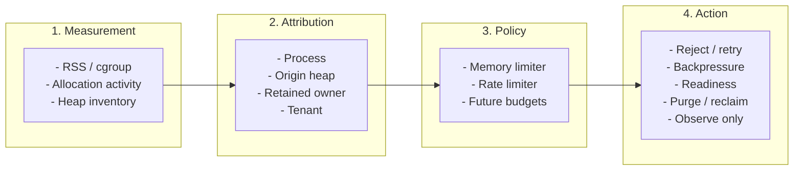
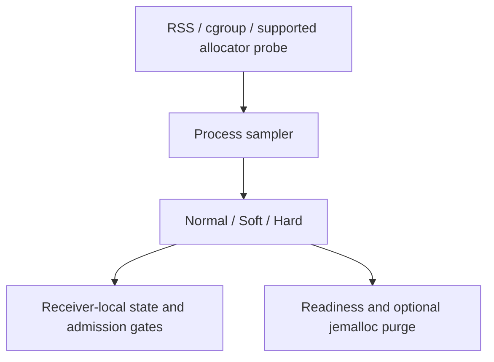
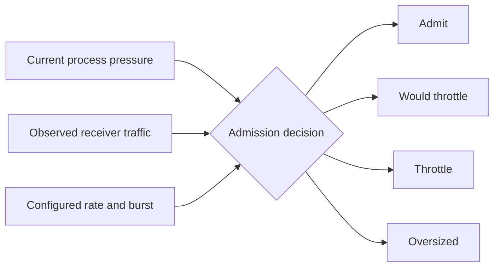
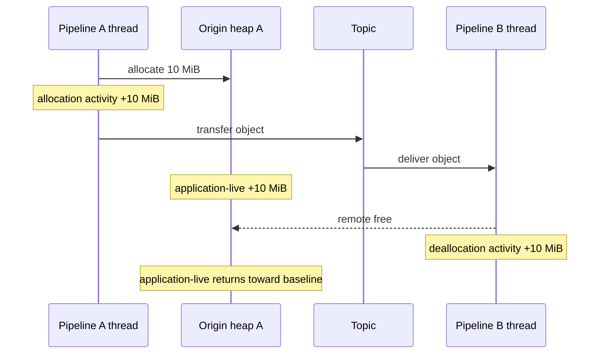
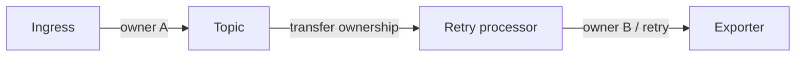
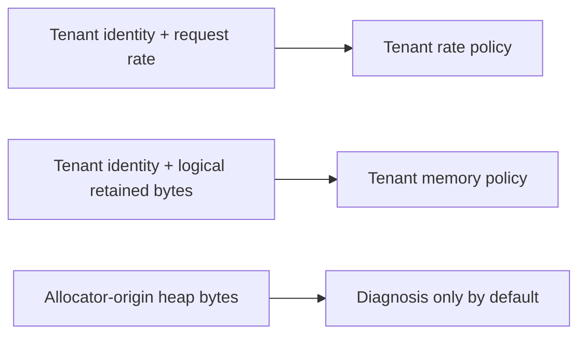
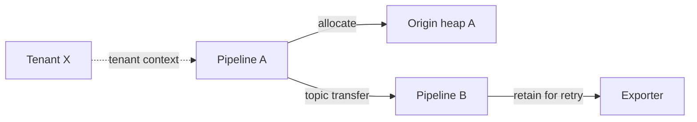

# Memory Resource Management

> [!IMPORTANT]
> This is a status-labelled architecture map. **Proposed** and **Future**
> mechanisms are not implemented; **Partial** mechanisms have the stated
> limitations. Follow the linked implementation documents, RFCs, and issues for
> authoritative behavior and configuration.

This document maps the OTAP Dataflow Engine (DFE) memory views, attribution
models, policies, and control actions. It is an overview, not the authoritative
configuration reference.

Each mechanism is marked as one of:

- **Current:** implemented on `main`.
- **Partial:** some capabilities or backends exist, but the stated use case is not
  complete.
- **Proposed:** tracked by an accepted or open design issue.
- **Future:** a use case or policy boundary without a complete design.

A status can carry a qualifier for stability, allocator backend, build feature,
or platform availability.

Detailed behavior remains in the linked implementation documents, RFCs, and
issues.

## Why Multiple Memory Views Are Necessary

No single measurement can answer all of these questions:

- Is the process or container approaching an out-of-memory condition?
- Which pipeline thread is creating allocator churn?
- Which pipeline originally allocated physical heap memory?
- Which component or pipeline currently retains accepted work?
- Which tenant should be charged or throttled?

DFE therefore separates measurement, attribution, policy, and action:

An attribution mechanism does not automatically become an enforcement input.
New policy must define its activation conditions, how it composes with the
process-wide guardrail, how it remains bounded, and how it recovers.

## Mechanisms at a Glance

<!-- markdownlint-disable MD013 -->
| Mechanism | Primary question | Scope | Typical use | Status |
| --- | --- | --- | --- | --- |
| Process memory sampling | How much memory is the process or container using? | Process | Detect OOM risk and classify pressure | Current |
| Process memory limiter | Is process memory unsafe? | Process | Shed ingress, change readiness, optionally purge jemalloc | Current |
| Pressure-aware receiver throttling | How quickly may this receiver admit work while pressure is active? | Receiver instance | Reduce ingress before accepting more work | Current |
| Bounded channels and topics | Is a local transport boundary full? | Queue or topic | Apply local backpressure or configured refusal behavior | Current |
| Durable buffering and disk budget | Can outage backlog survive restart without remaining only in volatile queues? | Durable-buffer instance | Persist backlog, bound disk use, and backpressure or drop at the storage cap | Current, experimental |
| Pipeline allocation activity | Where do allocation and free calls execute? | Pipeline thread | Diagnose allocator churn and allocation-heavy paths | Partial: non-Windows builds with the `jemalloc` feature and jemalloc active as the global allocator |
| Pipeline allocator inventory | Which pipeline domain originally allocated live physical memory? | Pipeline allocator domain | Diagnose physical retention, fragmentation, and retired generations | Proposed in [#3725](https://github.com/open-telemetry/otel-arrow/issues/3725) |
| Retained-work accounting | Which component or pipeline currently retains logical work? | Retention site and work owner | Explain queue, retry, batch, and exporter retention | Proposed in the [Observe-Only Retained-Work Accounting RFC (number pending)](../rfcs/0000-observe-only-retained-work-accounting.md) and tracked by [#3272](https://github.com/open-telemetry/otel-arrow/issues/3272) |
| Pipeline retained-memory budget | Has one pipeline retained more work than allowed? | Pipeline or pipeline group | Targeted backpressure and isolation | Future |
| Tenant-aware policy | Which tenant should consume shared capacity? | Tenant across one or more pipelines | Fairness, quotas, and tenant-specific throttling | Future; identity foundation proposed in the [Pdata Context RFC](https://github.com/open-telemetry/otel-arrow/pull/3742) |
| Component reclaim | Can buffered state be reduced without waiting for normal completion? | Stateful component | Reclaim retry, batch, stream, or cache state | Future |
<!-- markdownlint-enable MD013 -->

## Current Process-Wide Protection

The current memory limiter is the outer safety boundary. It periodically
samples process memory, classifies it as `Normal`, `Soft`, or `Hard`, and
publishes pressure changes through the control plane.

In enforce mode, `Hard` pressure sheds work at supported receiver boundaries.
`Soft` remains informational to the memory limiter itself, but can activate a
configured pressure-aware rate limiter. Observe-only mode reports state without
enforcement.

This is intentionally process-wide. It does not identify which pipeline,
component, tenant, queue, or retained work item caused pressure. Its hard limit
is a shedding threshold, not a strict memory cap, because sampling and rejection
are reactive.

See [Memory Limiter - Phase 1](memory-limiter-phase1.md) for configuration,
protocol behavior, metrics, readiness, purge behavior, and limitations.

## Current Receiver Throttling

Pressure-aware throttling combines the process pressure level with a
receiver-instance rate bucket:

The first implementation applies to participating OTLP and Syslog / CEF
receivers. It controls excess input rate; it does not measure retained memory or
provide group-wide or tenant fairness. Receiver behavior is protocol-specific:
some transports can return retry guidance, while others can only close a
connection or drop a datagram.

During `Normal` pressure, the receiver updates its rate state but does not reject
traffic for exceeding the configured rate. At `Soft` or higher pressure, an
enforcing rate limiter may throttle over-limit traffic. At `Hard`, global
memory-limiter shedding also applies when the memory limiter is enforcing.

The admission hot path consumes receiver-local pressure state rather than
sampling process memory directly. This keeps ingress decisions cheap and avoids
turning the global sampler into a point of contention.

See [RFC 0002: Pressure-Aware Rate Throttling](../rfcs/0002-pressure-aware-rate-throttling.md)
for units, aggregation, pressure activation, protocol mappings, and future
scoped policies.

## Local Capacity and Durable Buffering

Bounded channels and topics protect individual transport boundaries. A full
bounded queue applies its configured backpressure or refusal behavior without
waiting for the process memory sampler. These local capacity controls limit
message counts or tracked in-flight work; they do not impose a shared byte
budget across the process.

The current topic runtime uses bounded queues or rings according to topic mode.
See [Topic Architecture](topic-architecture.md) for the in-memory structures and
tracked publish flow.

The experimental durable-buffer processor uses Quiver to persist accepted data
through a write-ahead log and segment storage before forwarding it downstream.
It has a disk retention cap, applies backpressure or `drop_oldest` at that cap,
and bounds downstream work with `max_in_flight`.

Durable buffering can keep outage backlog out of ordinary volatile queues and
survive process restart, but it is not a process memory limiter. Open segments,
indexes, memory mappings, adapters, and in-flight bundles still consume memory.
The process limiter remains the outer RAM guardrail, while the durable buffer's
retention policy governs disk capacity and durability tradeoffs.

See the [Durable Buffer documentation](../crates/core-nodes/src/processors/durable_buffer_processor/README.md)
and [Quiver documentation](../crates/quiver/README.md).

## Pipeline Allocation Activity

Pipeline allocation activity answers where allocation and free calls execute.
The current jemalloc implementation reads calling-thread cumulative allocation
and deallocation counters and derives interval deltas. These metrics require a
non-Windows build with the engine `jemalloc` feature and jemalloc active as the
global allocator. If the thread counters cannot be initialized, the current
metrics remain unchanged at zero.

Activity is useful for finding:

- allocation-heavy transformations and allocator churn;
- CPU or latency changes correlated with allocation/free rates;
- asymmetric allocation and free activity across pipeline threads.

Activity does not identify physical live memory. In particular, one pipeline
can allocate an object that another pipeline later frees.

The current `pipeline.memory_usage` metric subtracts the calling thread's
deallocation counter from its allocation counter and saturates at zero. It must
not be interpreted as authoritative per-pipeline live memory when data crosses
threads. A downstream pipeline that frees more than it allocates can appear
idle. [Issue #3725](https://github.com/open-telemetry/otel-arrow/issues/3725)
tracks the allocator-neutral activity and physical-inventory model.

The metric is expected to be removed rather than renamed. Use the allocation
and deallocation deltas to diagnose churn; the proposed `pipeline.heap.live`
view would report physical live memory.

See the [engine telemetry inventory](../crates/engine/telemetry.md) for the
currently emitted metrics.

## Proposed Pipeline Allocator Inventory

Per-pipeline allocator domains would answer where physical heap memory
originated. Each pinned pipeline thread would allocate from a dedicated
allocator domain, and inventory metrics would sample that domain's live and
footprint values. Any DFE-maintained peak based on periodic sampling is a peak
of samples, not an instantaneous high-water mark.

Calling-thread activity and origin-domain inventory are separate axes:

The origin domain remains A even while B logically holds the work. This makes
allocator inventory useful for physical diagnosis, but unsuitable as the sole
basis for deciding which pipeline or tenant should be throttled.

Per-pipeline domains also introduce costs and lifecycle requirements:

- independent arenas or heaps can increase fragmentation and resident memory;
- global purge behavior can affect every private allocator domain;
- remote frees can outlive the pipeline thread that created the allocation;
- retired pipeline generations require bounded, post-exit observation.

These costs must be measured before changing the default allocation topology.

See [issue #3725](https://github.com/open-telemetry/otel-arrow/issues/3725) for
the proposed allocator-domain metrics, backend requirements, lifecycle, and
validation criteria.

## Proposed Logical Retained-Work Accounting

Retained-work accounting answers who currently holds accepted work and where it
is retained. Unlike allocator-origin inventory, ownership follows the work
through queues, topics, batchers, retry buffers, exporters, and other retaining
boundaries.

Logical retained size is an estimate chosen for stable, cheap accounting. It is
not allocator RSS, usable allocation size, or an assertion that every physical
byte can be assigned to one work item.

Retained ownership can support future per-pipeline or per-group budgets,
targeted backpressure, and reconciliation against allocator inventory and
process memory. Tenant identity can be propagated alongside retained ownership
without becoming an allocator label.

Retained accounting should begin as observe-only. Enforcement needs additional
design for reserves, fairness, shared ownership, overshoot, reclaim, recovery,
and admission precedence. See
[Observe-Only Retained-Work Accounting RFC (number pending)](../rfcs/0000-observe-only-retained-work-accounting.md)
and tracking issue [#3272](https://github.com/open-telemetry/otel-arrow/issues/3272).

## Tenant-Aware Policy

Tenant identity answers whose work is being processed. It is neither a memory
measurement nor an allocator property.

A future tenant-aware limiter could combine tenant identity with an explicitly
selected usage dimension:

Tenant policy requires bounded key cardinality, trusted identity extraction,
default behavior for unknown tenants, and a fairness or scheduling contract.
Raw tenant identities must not become unbounded metric attributes.

Routing tenants into separate pipelines can provide macro-scale isolation, but
it is different from fairness among tenants sharing one receiver or pipeline.

The draft [Pdata Context RFC](https://github.com/open-telemetry/otel-arrow/pull/3742)
provides the message-scoped identity and propagation foundation for these
policies. It does not itself define tenant memory measurement, budgets,
fairness, or enforcement.

## Example: One Batch, Four Answers

Consider a batch allocated by Pipeline A, transferred through a topic, retained
for retry by Pipeline B, and associated with Tenant X:

- The process limiter evaluates total process risk.
- Allocator inventory attributes the physical bytes to Pipeline A.
- Retained-work accounting attributes the outstanding work to Pipeline B's
  retry site.
- Tenant policy attributes the work to Tenant X.

Allocation activity separately records where allocation and deallocation calls
execute. A separate policy decides which scope, if any, should be throttled.

The answers intentionally differ. Requiring them to match would erase useful
information and could throttle the wrong scope.

## Policy Precedence

Future scoped policies must preserve an explicit precedence model:

1. When the memory limiter is enforcing, process `Hard` pressure remains the
   outer safety backstop.
2. Receiver pressure-aware rate policy limits new work at participating ingress
   points.
3. A future retained-work budget targets the pipeline, component, or group
   retaining work.
4. A future tenant policy applies fairness or quotas within its declared scope.
5. Allocator activity and heap inventory remain diagnostic unless a separate
   policy explicitly adopts them.

Scoped enforcement must not weaken the process-wide backstop. Conversely,
process pressure alone must not be presented as proof that a particular
pipeline or tenant caused the pressure.

## Relationship to the Go Collector

The Go Collector memory limiter is useful precedent for the outer guardrail. It
periodically checks memory, refuses data with retryable errors above its soft
limit, forces garbage collection above its hard limit, and resumes after memory
falls below the soft limit. Its documentation recommends placing the processor
first in each pipeline and coordinating it with `GOMEMLIMIT`.

The Go Collector also documents an important failure mode: forced garbage
collection can waste CPU without releasing memory when live references remain
in exporter queues during a downstream outage. That is a concrete example of
why process pressure needs retention diagnostics.

DFE differs in where it enforces pressure. Its process sampler propagates state
to receiver-local admission paths, which can reject some work before full body
accumulation or downstream processing. The Go Collector documentation warns
that incoming data can consume memory before its memory-limiter processor can
reject it.

This comparison is limited to the Go Collector memory-limiter component. It
does not claim that no custom or external Collector component can implement a
scoped policy.

References:

- [Go Collector memory limiter](https://github.com/open-telemetry/opentelemetry-collector/tree/main/processor/memorylimiterprocessor)
- [Scaling the OpenTelemetry Collector](https://opentelemetry.io/docs/collector/scaling/)

## Reading the Memory Views Together

The following combinations are useful for investigation. They are hypotheses,
not proofs:

<!-- markdownlint-disable MD013 -->
| Observation | Likely investigation |
| --- | --- |
| High allocation/free rates with flat origin-domain live bytes | Temporary allocation churn |
| Rising origin-domain live bytes and rising retained-work bytes | Real retained growth associated with accepted work |
| Rising origin-domain live bytes with flat retained-work bytes | Missing retained charge, allocator slack, non-PData state, or shared capacity |
| Rising retained-work bytes with flat origin-domain live bytes | Logical overestimate, shared backing allocation, or allocation in another origin domain |
| Flat pipeline views with rising process usage | Allocations outside pipeline domains, allocator overhead, runtime state, or incomplete coverage |
| High process pressure with one dominant retained owner | Candidate for targeted future budget or reclaim policy |
<!-- markdownlint-enable MD013 -->

Representative benchmarks and controlled fault scenarios are required before
turning any diagnostic correlation into enforcement.

## Maintenance

Update the status table when a linked implementation PR changes a mechanism
from proposed to partial or current, changes its supported scope, or adds an
enforcement action.

PRs implementing [#3725](https://github.com/open-telemetry/otel-arrow/issues/3725),
[#3272](https://github.com/open-telemetry/otel-arrow/issues/3272), scoped memory
budgets, or tenant-aware memory policy should update this document in the same
change.

When the observe-only retained-work accounting RFC receives its final number,
update its title and links in this document.

When the Pdata Context RFC merges, replace its pull-request links with the
repository-relative RFC path.

## Detailed References

- [Memory Limiter - Phase 1](memory-limiter-phase1.md)
- [RFC 0002: Pressure-Aware Rate Throttling](../rfcs/0002-pressure-aware-rate-throttling.md)
- [Observe-Only Retained-Work Accounting RFC (number pending)](../rfcs/0000-observe-only-retained-work-accounting.md)
- [Configuration Model](configuration-model.md)
- [Telemetry Metrics Guide](telemetry/metrics-guide.md)
- [Engine Telemetry Inventory](../crates/engine/telemetry.md)
- [Topic Architecture](topic-architecture.md)
- [Durable Buffer](../crates/core-nodes/src/processors/durable_buffer_processor/README.md)
- [Quiver](../crates/quiver/README.md)
- [Per-pipeline allocator activity and inventory issue](https://github.com/open-telemetry/otel-arrow/issues/3725)
- [Retained-work memory budgeting issue](https://github.com/open-telemetry/otel-arrow/issues/3272)
