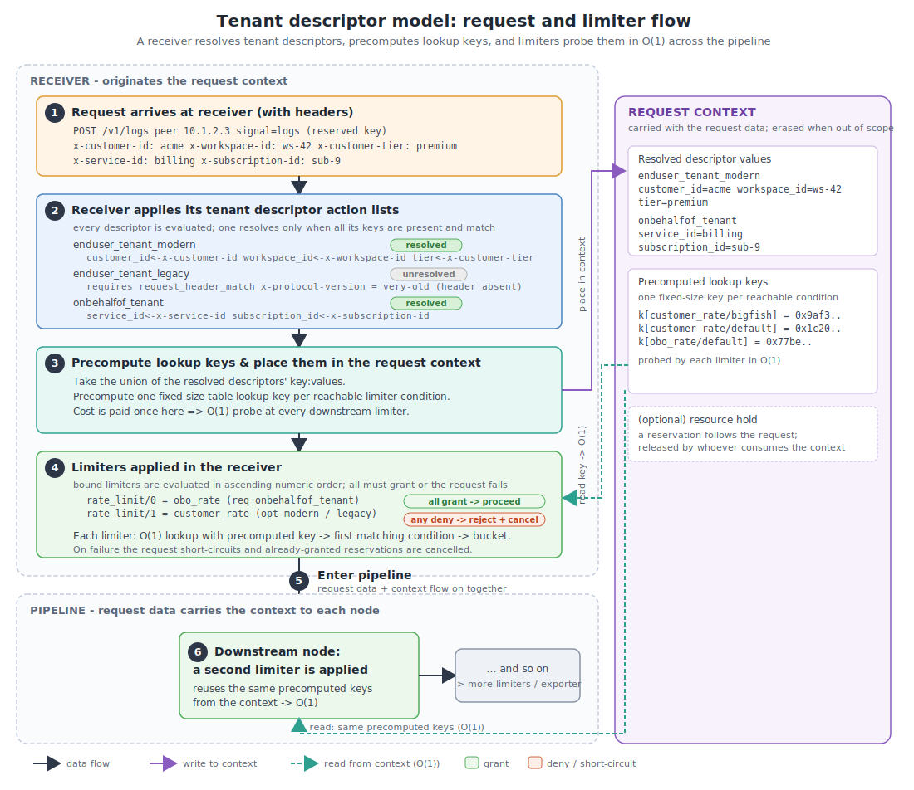

# Agent Multitenancy Design

## Background

Two other open-source systems influence this design:

- [Kubernetes multitenant concepts](https://kubernetes.io/docs/concepts/security/multitenancy/)
- [Envoy rate limit configuration](https://www.envoyproxy.io/docs/envoy/latest/intro/arch_overview/other_features/global_rate_limiting.html)

Both of these systems will be familiar to many users and we aim to
keep our concepts close to theirs.

## Definitions

As telemetry collection agents can be deployed to perform in a wide
range of application scenarios, there is no single definition of, or
data model for, a tenant. _Multitenancy_ describes a set of features
for managing tenancy requirements, not a specific aspect of the
dataflow engine.

Tenancy requirements depend on the use-case, covering what resources
are being shared, what needs to be isolated, and the acceptable level
of operational complexity. Tenancy use-cases are often divided into
categories based on the types of relationship between the principal
and the tenant(s):

- **Multiple teams** that share an administrator boundary (e.g., divisions
  in a company). These are usually small in number, tenants are
  cooperative and share administrative control.
- **Multiple customers** of a SaaS sharing a service endpoint have a
  contractual relationship, compete for shared service resources, and
  may be large in number.

Sometimes there will be more than one concept of tenancy in use at a
time (e.g., SaaS customer account and signed-in user). Sometimes
multitenancy is applied at multiple levels (e.g., both thread-local
and global rate limits).

## Scope

This document covers the design for tenant identity and a framework
with two basic categories of limiter. In scope are:

- Configuration model for tenant identity
- Configuration model for limiter policies
- Isolation model for multiple tenants
- Conditional limiter behavior.

This document leaves a lot out of scope:

- How to configure operating system-specific isolation mechanisms
  (e.g., cgroups, job objects).
- How to track fine-grain memory allocations in the telemetry
  pipeline.
- Feasability checking of memory configuration (e.g., can we estimate
  memory usage from tenant configuration to avoid out-of-memory?).

## Request and tenant context

System operators require multiple tenants to share pipeline
resources, with fine-grained limits configured to achieve isolation
and fairness between tenants. Tenant identification depends on the
use-case and what is being shared. How the engine identifies a tenant
is a matter of choice. It is often possible to express tenancy
directly through configuration, by associating specific resources with
specific tenants in whole terms. As an example, by giving each tenant
a dedicated port and pipeline, they can physically separate tenants
without the use of specific multi-tenant features. By isolating
whole-ports, whole CPUs, or whole threads to a single tenant or tenant
group, the operator may be able to avoid using tenant tokens
entirely.

However, where there are context-specific attributes used for
limiting, a **tenant token** will be used. A tenant token is
a small vector of key:value identifiers which represent the current
tenant in some context. Usually, the context is a request, however,
custom contexts can be defined as long as a tenant token can be
stored.

Tenant tokens are multi-dimensional to enable tenant assignment
in logically independent ways with user control over cardinality. For
example, a request may be accompanied by an environment name, a
project name, and a user name for three forms of tenancy. Choosing
three forms means a single limiter table with three-dimensions.

Multiple tenant tokens per request are supported, enabling
multiple independent limiters with lower dimensions. For example, a
request may be accompanied by both an end-user tenant identifier and
an acting-on-behalf-of tenant identifier. These are logically
independent, two single-dimensional limiters.

Multiple tenant tokens can be used to express various forms of a
single tenant identity. When there are multiple sets of header
conventions that describe a tenant (e.g., "modern" and "legacy"), they
are listed as alternatives. Generally, the alternatives should be
non-overlapping, but the behavior is well-defined either way: all
tokens of the request must match all the conditions of the
limiter.

To create a new request context, tenant token extractors are
applied; we take the union of key:values of the resolved tenant
tokens and precompute a table lookup key for every distinct set
of condition entries defined in the engine. Later in the pipeline,
these precomputed table-lookup keys will be used to evaluate limiter
conditions in **O(1)** time.

To evaluate which limiter bucket a given request falls in to, the
sequence of conditions is applied in order. For a context to match a
condition, all its entries must match for all tenant token values
to qualify.

### Model terms and request flow

The model uses the following terms, which are developed in more detail below.

| Term            | Definition                                                                                                                                       |
|-----------------|--------------------------------------------------------------------------------------------------------------------------------------------------|
| Tenant token    | A list of extractors, possibly conditional, that determine a resolved token value. These can be defined at several levels for restricted access. |
| Token extractor | A configured rule that extracts and/or matches one token key from a request.                                                                     |
| Token value     | The set of keys and values forming a resolved token, with a number of associated table lookup keys.                                              |
| Key / value     | A single dimension of a tenant token value.                                                                                                      |
| Entry           | A single `{ key, value }` term within a condition; no `value` means wildcard.                                                                    |
| Condition       | An ordered list of entries selecting a bucket; the first matching condition wins.                                                                |
| Bucket          | Contains one distinct limiter instance per distinct set of entry keys for the matching condition, up to the cardinality limit.                   |

Token extractors are evaluated and the matching results are placed
in the request context where it passes with the request data in a
pipeline where individual nodes will apply specific limiters.



### Tenant token extractors

Tenant tokens originate in a series of extractors, configured at the
top level, group-level, and pipeline-level of the dataflow engine
configuration, since these definitions are shared across pipeline
groups. Token values refer to one or more tenant associations,
each association consisting of multiple keys and values and used as a
lookup key for evaluating limiter conditions. Tenant token values
must be erased when they go out of scope to avoid leaking sensitive
data across unintended boundaries.

Token extractors are applied by receivers (or processors) when they
originate new request contexts. They support attribute
extraction in a variety of ways, for example,

- `receiver_id`, `source_node_id`: the first node or preceding node traversed by the request.
- `remote_address`, `masked_remote_address`: origin network address, optionally CIDR-masked.
- `generic_key`: a static, hard-coded key-value.
- `transport_header`: copy a transport header value into a token key.
- `transport_header_match`: token key value must match a condition.

Here, the term _transport header_ is generic. Although we model these as
HTTP headers, receivers for other protocols are responsible for
deriving headers according to the protocol that is in use, using
semantic conventions as needed. The engine reserves the token key
`signal` to identify the type of signal in the request (e.g., "logs").

### Tenant token examples

Here is an example of a single token extractor list based on the
client address, a hard-coded value, and an extracted transport header as
the keys:

```yaml
extractors:
- key: client_address
  remote_address: {}     # use the network peer's socket address as the value
- key: route_name
  generic_key: http/otlp
- key: user_id
  transport_header: x-user-id
```

Here is an example engine configuration defining three tenant
tokens: two end-user forms (modern and legacy) and one
acting-on-behalf-of service token.

```yaml
# Engine top-level tenant tokens, shared across all pipeline groups.
tenant_tokens:
  enduser_tenant_modern:
    extractors:
    - key: customer_id
      transport_header: x-customer-id
    - key: workspace_id
      transport_header: x-workspace-id
    - key: tier
      transport_header: x-customer-tier
  enduser_tenant_legacy:
    extractors:
    - key: customer_id
      transport_header: x-legacy-customer-id
    - key: workspace_id
      transport_header: x-legacy-workspace-id
    # legacy tenants are identified by a version header
    - transport_header_match: x-protocol-version
      value: "very-old"
  onbehalfof_tenant:
    extractors:
    - key: service_id
      transport_header: x-service-id
    - key: subscription_id
      transport_header: x-subscription-id
groups:
  # ... pipeline groups reference the tokens above ...
```

### Engine tenancy support

The Dataflow Engine's pipeline data type (`OtapPdata`) will be
modified to propagate tenant tokens in the context. Receivers and
processors that create new contexts will be upgraded to evaluate the
applicable tenant token extractors based on their transport headers.
When all extractor conditions succeed for a token and request, the
resulting tenant token value is entered into the context.

Any kind of node can apply a limit. When the engine starts, it applies
the resolved limit policies at the nodes and chokepoints where they
take effect. The engine implements the standard limits itself and
provides helpers to apply them in a uniform way, so most limits require
no custom code.

### Resource-level tenants

At the top of the OpenTelemetry data model, the Resource value
describes a single producer of telemetry. When a pipeline request
contains data for a single resource, as typically produced by an OpenTelemetry SDK,
the request's resource attributes can be made to act like transport headers as the input
for tenant token extractors.

Receivers for non-HTTP telemetry protocols that convey single-resource
requests may apply token extractors directly to resource
attributes. Limiters that are applied in those contexts may refer to
single-resource token extractors `resource_attribute` and
`resource_attribute_match` to extract or conditionally extract tenancy
information. These extractors can only be applied in single-resource
contexts. For example to extract a `service_name` tenant for the
production namespace in a single-resource context:

```yaml
extractors:
- key: service_name
  resource_attribute: service.name
- resource_attribute_match: service.namespace
  value: production
```

These extractors do not apply in contexts where multiple resources are
present. Under this proposal, the options for handling multi-resource
requests with these resource token extractors are:

- Nack the request.
- Reject the configuration: callers asserts single-reource context or else
  invalid configuration.
- Do not resolve the extractor, the token will be unresolved; receivers
  and limiters that require this token will reject, otherwise these
  requests will not match conditions and take the default limit.

Routing and batching by tenant token based on resource attributes
generalizes in useful ways. Telemetry collection agents are sometimes
required to aggregate by both tenant-token property and
sub-characteristic such as metric name or TraceId. In general, the
engine must add support splitting requests in these ways to enable
routing, shuffling, grouping and load balancing by tenant token.

### Tenant trust

Pipeline operators are responsible for secure tenant
configurations. Tenant tokens can be defined at multiple levels
of the engine configuration (e.g., global, pipeline group, pipeline)
to avoid leaking tenant details outside their scope. The dataflow
engine is responsible for enforcing this discipline automatically.

Pipeline operators are advised not to use unauthenticated request
headers.

Pipeline operators are advised to configure sensible cardinality
limits to protect the pipeline.

### Routing/batching by tenant token

Processors (e.g., fanout) and exporters (e.g., topic) will be
configurable to route by token condition.

```yaml
nodes:
  tenant_split:
    type: processor:tenant_router
    config:
      optional_tenant_tokens: [enduser_tenant_modern, enduser_tenant_legacy]

      # first-match wins
      routes:
      # customer_id=bigfish
      - entries:
        - key: customer_id
          value: bigfish
        output: bigfish_pipeline
      # for premium-tier customers
      - entries:
        - key: tier
          value: premium
        output: premium_pipeline
      # for any customer
      - entries:
        - key: customer_id
        output: shared_pipeline
      default_output: fallback

    outputs:
      bigfish_pipeline: {...}
      premium_pipeline: {...}
      shared_pipeline: {...}
      fallback: {...}
```

The same applies to the batch processor specifically. Note that
[OpenTelemetry Collector supports batching by selected transport headers
using
`sending_queue::batch::partition::metadata_keys`](https://github.com/open-telemetry/opentelemetry-collector/blob/main/exporter/exporterhelper/README.md#sending-queue-batch-settings)
and a configurable cardinality limit. Tenant tokens and batching
conditions will be used to this effect in the dataflow engine.

### Load balancing by tenant token

The example above shows to isolate a small number of routes in static
configuration based on the tenant token. Engines running on
multiple cores are also required to route and load balance when the
number of tokens is large.

Load balancing by tenant token will be organized using the
dataflow engine's topic broker infrastructure based using tenant
tokens and conditions to compute a hash value, and then to use
(hash-value % N) to distribute the request to one of N topic
receivers. The design of the load balancing mechanism is out of scope
for this document and part of a larger scope. Often, there is a
simultaneous need to aggregate and load-balance multi-tenant request
by features in the data other than tenant, such as metric name or
TraceId. In both cases, the dataflow engine requires a mechanism to
create multi-tenant, multi-request batches destined for a single
consumer.

## Limiter policies

Limits are declared as policies under `policies.resources`, alongside
the process-wide `memory_limiter`. Because policies are already
hierarchical, every limit inherits the engine's policy resolution:
top-level defaults are overridden by pipeline-group policies, which are
in turn overridden by pipeline policies, with precedence applied by
family. The policy hierarchy and its resolution rules are defined in
[configuration-model.md](configuration-model.md). Limits come in two
categories, held in two policy families:

- **Rate limits**, under `policies.resources.rate_limits`, count
  resources that are limited as a function of time. When the resource
  is not available, the caller can choose to wait a definite amount of
  time, provided they hold a reservation. These resources are consumed
  immediately and not returned by the caller.
- **Resource limits**, under `policies.resources.resource_limits`,
  count resources that are limited by a current total. When the
  resource is not available, the caller can choose to wait indefinitely
  for the resource to be returned. These apply anywhere in the engine
  there is a resource held in-use by ongoing work, such as queues,
  batches, and topics.

Both kinds of limit can be used with different weight measures, for
example we can limit by request count, by in-memory bytes count, by
compressed bytes count, or by items of telemetry. Rate and resource
limits have distinct runtime interfaces, and of course use different
configuration; however, they generally use the same model for
multitenancy and share a common policy schema:

- **unit**: Describes the units of weight being limited. For rate
  limits this must end with "/second", for example
  `request_count/second` or `memory_bytes/second`. For resource limits,
  omit the rate suffix, for example `memory_bytes`. In the yaml
  configuration, this gives the raw numbers meaning; in the code, a
  verification step ensures that each limit is applied to the correct
  category of weight.
- **optional_tenant_tokens**: Optional, a list of the tenant tokens
  used by the limiter. These token values are extracted from the
  request and used to evaluate conditions.
- **required_tenant_tokens**: Optional, a list of the tenant tokens
  used by the limiter that must be present, otherwise the request is
  immediately failed. These token values are extracted from the
  request and used to evaluate conditions.
- **conditions**: A list of conditions, each of them defined by a name
  and a list of entries with a bucket-specific limit. When all the entries
  are satisfied for all the input tokens, the conditional limit
  is chosen. The first matching condition is selected, otherwise a
  default is used.
- **cardinality**: Determines the limit of unique combinations for
  buckets in the limiter and what happens when the number is exceeded.

Users may provide one or both of `optional_tenant_tokens` and
`required_tenant_tokens`.

The engine provides a built-in implementation for each category, so
the common case needs no custom code: a token bucket for rate limits
and a semaphore for resource limits. A policy selects the built-in by
naming its specific configuration block, so a `token_bucket` block
selects the token-bucket rate limiter and a `semaphore` block selects
the semaphore resource limiter. The general form exposes the shared
schema, one specific setting per condition, and one default value. For
example:

```yaml
policies:
  resources:
    rate_limits:
      some_rate_limit:
        unit: request_items/second
        optional_tenant_tokens: [tenant_form_a, tenant_form_b]
        conditions:
        - name: first
          entries: { ... }
          token_bucket: { ... } # first condition specifics
          cardinality: { ... }
        - name: second
          entries: { ... }
          token_bucket: { ... } # second condition specifics
          cardinality: { ... }
        token_bucket: { ... }   # default condition specifics
        cardinality: { ... }
```

The engine applies each limit policy at the enforcement points that
handle its declared weight, within the policy's scope. Where a specific
node must be selected, a node references a named policy directly, as
shown in the examples below. Limits that exceed the built-ins are
supplied as policy extensions, described under Shared limiters.

### Resource limiters

The built-in thread-local resource limiter is a semaphore that restricts the
total weight of some concurrent activity, for example the number of
requests in flight, the total memory in use, or the number of items in
a queue. The semaphore acts as a gate, limiting the amount of weight
admitted into a logical-admitted state.

The main resource limiter interface **acquire** returns a reservation
object. If the resource reservation was a success, the caller is given
a **resource hold** object with a corresponding **release**
operation. The engine supports storing the resource hold object in the
request Context, for a reservation to follow the request.

When a hold is stored in the request Context, ownership transfers with
the context: whichever component consumes the context becomes
responsible releasing it. The detailed Rust ownership mechanics are an
out of scope here (see
[otel-arrow#3316](https://github.com/open-telemetry/otel-arrow/pull/3316),
however the main requirement is that owners are responsible for
releasing resource reservations and sometimes the reservation is
carried by the request, to be dropped at the same time. Additionally,
resource holds do not automatically cross shared boundaries (i.e.,
they are `!Send`). Sub-components within the engine (e.g., channels)
assume responsibility for resources, and special nodes (e.g., topic
exporter and receiver) will require an explicit mechanisms to transfer
resource holds across threads and CPUs.

The resource limiter interface also controls the total number of
waiters and/or the total amount of pending weight through its
reservation interface. The built-in semaphore limiter's specific
configuration, for example:

```yaml
semaphore:
  admitted: 100_000_000  # max admitted weight
  waiting:  20_000_000   # max waiting weight
  waiters:  100          # max number waiting
  mode:     lifo         # prioritize freshness
```

### Rate limiters

The rate limiter interface **limit** returns a reservation object. If
the rate reservation was a success, the caller just continues. If the
reservation was not granted, limiters may return to the
caller an option to wait. The option to wait is cancellable.

The built-in token bucket limiter's specific configuration, for
example:

```yaml
token_bucket:
  allow:    100_000_000  # maximum per interval
  burst:    20_000_000   # maximum individual weight
  interval: 60s          # interval duration
  waiters:  100          # max number waiting
  mode:     fifo         # prioritize fairness
```

### Shared limiters

Sharing a limit at the pipeline-group or engine scope, meaning across
threads or CPUs, requires careful attention to avoid synchronization
costs. The engine's built-in token bucket and semaphore limiters
support thread-local use only, so they resolve at pipeline scope. Wider
scopes are served by **policy extensions**: the policy machinery lets a
limit request a shared implementation at CPU-local (pipeline group),
global (engine), and eventually NUMA-regional scope.

For performance reasons, a shared limiter policy extension should
separate its hot and cold paths. Commonly, this is done by aggregating
requests in the background and using asynchronous or relaxed-memory
mechanisms to refresh hot-path limiter state.

Among open-source global rate limit solutions, Envoy implements the
[gRPC Global Rate Limit
service](https://github.com/envoyproxy/ratelimit); another popular
solution is
[Gubernator](https://github.com/gubernator-io/gubernator). A global
rate limit policy extension will map fields of the tenant token
into rate-limit requests on systems such as these.

Shared resource limits may be implemented using conventional
synchronization primitives, for example a policy extension with
Mutex-wrapped internal state, but as with a shared rate limit, these
implementations should leverage thread-local state and separate their
hot and cold paths to avoid interference with the dataflow engine.

The limits described in previous examples resolve at thread-local
scope, making them per-tenant and per-pipeline. To implement
engine-wide or group-wide limits on a per-tenant basis, there are two
options:

1. Use a group- or engine-shared limiter instance, supplied as a policy
   extension.
2. Route the data by tenant token to a single pipeline, then use
   the built-in thread-local limiter.

Both are reasonable options.

### Example limiter yaml

Completing the example started above, we can use the three tokens
declared above to implement two rate limit policies.

```yaml
tenant_tokens: { ... }
groups:
  main-group:
    pipelines:
      main-pipe:
        # Limit policies at pipeline scope resolve thread-local, per core.
        policies:
          resources:
            rate_limits:
              # The first rate limit applies to the customer.
              customer_rate:
                unit: network_bytes/second
                optional_tenant_tokens: [enduser_tenant_modern, enduser_tenant_legacy]
                conditions:
                # This gives each workspace with customer_id=bigfish more allowance.
                - name: bigfish
                  entries:
                  - key: workspace_id
                  - key: customer_id
                    value: bigfish
                  token_bucket:
                    allow: 50_000   # 50KB/s allowance per pipeline PER CORE
                    burst: 100_000  # 100KB maximum size PER CORE
                  cardinality:
                    max_count: 1000 # Up to 1000 workspaces (single customer)
                # Every combination of { customer_id != bigfish, workspace_id }
                # uses this limit PER CORE.
                token_bucket: { allow: 25_000, burst: 50_000 }
                # Limit to 10000 buckets, the point where isolation breaks down.
                cardinality:
                  max_count: 10000
                  # When the limit is reached, choose to "break" isolation
                  # or else choose to "reject" the tenant.
                  failure_mode: break

              # Second rate limit applies to the OBO service
              obo_rate:
                unit: network_bytes/second
                required_tenant_tokens: [onbehalfof_tenant]
                # ...

        nodes:
          otlp:
            type: receiver:otlp
            # The engine applies ingress rate-limit policies at this receiver.
            # Listed order is the evaluation order; all must grant to proceed.
            rate_limits: [obo_rate, customer_rate]
            config:
              # determine which tenant tokens are evaluated
              tenant_tokens: [enduser_tenant_modern, enduser_tenant_legacy, onbehalfof_tenant]
              protocols:
                grpc:
                  listening_addr: "127.0.0.1:4317"
```

In this example, where multiple limits are listed for a node as with
`rate_limits: [obo_rate, customer_rate]` above, they are evaluated in
listed order and all must grant for the request to proceed. If a limit
failure causes the request to short-circuit, the granted reservations
are cancelled. Specific implementation details are out-of-scope, see
open questions.

### Limiter fairness

The built-in thread-local limiters support a fairness mode enabling
LIFO and FIFO behavior. We choose LIFO as the default for both because
it prioritizes fresh data and because LIFO is more robust for bursty
workloads, especially considering that telemetry data is usually sent
with a timeout in effect. LIFO-based limiters are less likely to enter
states where all requests exceed their deadline because of limits.

A third option, when queueing, is to prevent blocking in which case
`mode: nonblocking` prevents callers from waiting at the limiter
interface. This is the only valid mode setting in cases where the
caller is unable to block. See blocking and queuing implementation
details below.

In addition to queueing mode, a policy extension can take advantage of
tenant token fields. As an example, a tenant token might be
used to implement a notion of priority among waiters. A hypothetical
`priority_semaphore` policy extension could allow higher-priority
requests to jump ahead of lower-priority requests using this
configuration:

```yaml
priority_semaphore:
  admitted: 100_000_000
  waiting:  20_000_000
  # requests are admitted in order by level
  levels:
  # bigfish always first priority
  - name: high_priority
    entries:
    - key: customer_id
      value: bigfish
  # metrics are second priority
  - name: medium_priority
    entries:
    - key: signal
      value: metrics
  # otherwise lowest priority
  # mode applies within levels.
  mode: lifo
```

### Cardinality limits

The common limiter configuration includes a cardinality limit, which
places a hard limit on the number of buckets. This is the point at
which isolation between limiters has to break somehow. When the number
of distinct limiter instances is reached, we expect several
configurable behaviors:

- Block new tenants, hard error
- Try using least-recently-used or random limiter
- Block the heaviest user.

## Implementation details

The tenancy features described above have an efficient, table-driven
implementation. It runs in three steps: a one-time build step, then
two per-request steps: context creation and limiter lookup. Using
these structures, the algorithm reduces to O(1) work per condition. We
assume the use of a fixed-size hash function over ordered key:values,
as in a database group-by hash-join operation.

### Compile tokens and conditions

When loading the engine configuration, produce static data
structures to accelerate the two steps that follow. First, from
the pipeline graph structure, determine a reachability mapping
for all nodes, indicating whether a context created at any given
node can reach any other limiter in the engine.

Next, partition the token extractors into two groups. Conditional
extractors are those whose key is tested by some reachable condition;
their presence and value will resolve the tokens, and they are
indexed here. Wildcard extractors that require a key without a specific
value are indexed to accept all values. Remaining extractors are deferred
until the matching tokens are known.

The index is a map by header key; any-value cases are resolved here,
then a second map by header value. The any-value and specific-value
cases are identical, each a list of _(token, extractor)_ slots that the
corresponding header satisfies.

Finally, precompute the token-by-condition cross-product: for
every token and every reachable condition (the conditions of
limiters reachable from the node), the projection that yields that
condition's table-lookup key.

### Context creation step

Using the structures above, a receiver builds the token values
for a request:

- Take the union of tokens over the applicable limiters. Initialize a
  candidate vector indexed by token, each entry a bit-vector with a
  1-bit for every unsatisfied token key.
- For each header key/value on the request, look up the key, consider
  any-value case, then the specific case. For each (token,
  extractor) slot listed, clear that token's corresponding bit.
- A token whose bit-vector reaches 0 has all keys present and
  matching: construct its value, and with it the precomputed lookup
  key for each reachable condition that references it. A token
  that never reaches 0 is unresolved for this request.

### Limiter lookup step

The context value carries, for each resolved token, a precomputed
lookup key per reachable condition. When a request arrives, each
limiter scans its conditions and performs one table lookup per
condition, per bound token, using the precomputed keys.

### Algorithm Analysis

Let `D_recv` be the number of tokens in the node, `C_reachable`
the reachable limiter conditions from that node, `H` the header count,
and `k_d`, `k_c` the token and condition key counts. A condition
applies to a token only when the token's schema covers the
condition's keys. Let `P` be the number of applicable (token,
condition) pairs: `C_reachable <= P <= D_recv * C_reachable`, the
upper bound reached only when a limiter binds multiple same-schema
tokens.

The space used in this approach:

- resolved token values: `O(D_recv * k_d)`
- precomputed lookup keys: one fixed-size fingerprint per applicable pair,
  total size `O(P)`.

The time used in this approach:

- context creation: `O(H + D_recv * k_d)` to resolve tokens and
  materialize values, plus `O(P * k_c)` to project and hash one lookup
  key per applicable pair
- limiter lookup: one `O(1)` table probe per applicable (token,
  condition) pair, `O(P)` total, independent of `k_d` and `k_c`,
  because projection and hashing cost were paid at context creation.

### Limiter observability

Limiters record a primary observability signal with the declared units,
exposing the current value of the limiter.

- For rate limiters, an OpenTelemetry Counter named `otelcol.rate_limiter.accepted` measuring the accepted weight
- For resource limiters, an OpenTelemetry UpDownCounter named `otelcol.resource_limiter.admitted` measuring the currently admitted weight

Each of these uses the following dimensions:

- Condition name
- Key:values in condition entries of matching bucket
- Signal name of the request.

To bound metric cardinality, these dimensions use the entry keys of
the limiter condition bucket, which are bounded in cardinality by the
limiter.

Additional common metrics are supported at varying levels of detail:

- Cardinality of limiter instances by bucket name (UpDownCounter)
- Number of waiting requests by bucket name (UpDownCounter)
- Amount of waiting weight by bucket name (UpDownCounter)
- Requests arriving, by outcome (accepted/failed)
- Histogram of arriving request weight by accepted/failed

## Limiting use-cases

The two forms of limiter interface have many applications. They can be
thread-local or shared through pipeline-group, NUMA-regional and
global-level policy extensions. The set of weights is not fixed;
however, it is well known. Limiter units determine the mechanism being
limited, and the code and the configuration must agree on what is
being limited when the policy is applied, so that the limit is
applied to the correct weight.

So far, examples have illustrated the use of several weight names:

- `request_bytes` measures the in-memory size of the request
- `network_bytes` measures the on-wire size of the request
- `request_count` measures one unit per request
- `request_items` measures one unit per item of telemetry data
- `storage_bytes` measures one unit per byte of storage
- `storage_ops` measures one unit per storage read or write

### Storage limits

As an example, consider extending the Durable Buffer processor with
per-tenant rate and storage limits.

```yaml
tenant_tokens: { ... }   # enduser_tenant_modern / _legacy, as defined earlier

groups:
  main-group:
    pipelines:
      main-pipe:
        policies:
          resources:

            resource_limits:
              # Per-tenant disk space quota: a semaphore over bytes resident on disk.
              disk_space:
                unit: storage_bytes
                optional_tenant_tokens: [enduser_tenant_modern, enduser_tenant_legacy]
                conditions:
                - name: bigfish
                  entries:
                  - key: workspace_id
                  - key: customer_id
                    value: bigfish
                  semaphore: { admitted: 1_000_000_000, waiting: 100_000_000, waiters: 64, mode: lifo }
                  cardinality: { max_count: 1000 }
                semaphore: { admitted: 100_000_000, waiting: 10_000_000, waiters: 64, mode: lifo }
                cardinality: { max_count: 10000, failure_mode: break }

            rate_limits:
              # Per-tenant disk limit: a token bucket over disk ops/second.
              disk_iops:
                unit: storage_ops/second
                optional_tenant_tokens: [enduser_tenant_modern, enduser_tenant_legacy]
                conditions:
                - name: bigfish
                  entries:
                  - key: workspace_id
                  - key: customer_id
                    value: bigfish
                  token_bucket: { allow: 2_000, burst: 4_000, interval: 1s }
                  cardinality: { max_count: 1000 }
                token_bucket: { allow: 500, burst: 1_000, interval: 1s, mode: fifo }
                cardinality: { max_count: 10000, failure_mode: break }

        nodes:
          durable_buffer:
            type: processor:durable_buffer
            # The engine applies these named limit policies at the durable buffer.
            resource_limits: [disk_space]
            rate_limits: [disk_iops]
            config:
              path: /var/lib/otap/buffer
              retention_size_cap: 10 GiB
              size_cap_policy: backpressure
```

### Observability limits

The dataflow engine's internal telemetry system can be configured to
rate-limit log records by tenant, as an example below. First, the
codebase would have to be extended to make its logging macros
optionally context-specific. In locations where a log event is
associated with a request context, its tenant tokens would be
used to locate a limiter before evaluating the log statement.

```yaml
policies:
  resources:
    rate_limits:
      tenant_log_rate:
        unit: log_records/second
        required_tenant_tokens: [ ... ]
        conditions: { ... }
        token_bucket: { allow: 5, burst: 10, interval: 1s, mode: nonblocking }

engine:
  telemetry:
    logs:
      level: info
      rate_limit: tenant_log_rate
  tenant_tokens: { ... }
  observability:
    pipeline:
      nodes:
        itr:
          type: receiver:internal_telemetry
          config: {}
        otlp_out:
          type: exporter:otlp_grpc
          config:
            grpc_endpoint: "http://127.0.0.1:4317"
      connections:
        - from: itr
          to: otlp_out
```

### Rust async blocking and queueing

The mode configuration described for standard limiter requires a
degree of coordination between the caller of the limiter and the
runtime. Limiters themselves never block the runtime, they are
synchronous interfaces that return reservations. Reservations describe
a contract between the caller and the runtime to enable blocking with
LIFO or FIFO semantics, however it is the caller's responsibility
to delay the request.

This explains why the `nonblocking` mode is sometimes necessary, as it
is the only viable setting for callers that cannot delay a request.
When the receiver is able to delay a request (e.g., in memory) and
unless the `nonblocking` is configured, the reservation object is used
to coordinate with the limiter.

## Open questions

These things have been considered out of scope:

- Live reconfiguration of tenant token and limiter policies
  has not been considered.
- Rust mechanics for holding resource reservations, thread-shared and
  thread-local cases; this should align with the retained-work
  accounting described in
  [otel-arrow#3316](https://github.com/open-telemetry/otel-arrow/pull/3316).
- The document has described a simple approach to evaluating multiple
  limiters that may be inefficient in practice. Users are expected to
  configure limiters in the order that limiters should be applied,
  aware that requests granted by earlier limiters can be lost when a
  subsequent limiter fails. An efficient reserve-and-commit interface
  may be required.
- The topic exporter/receiver will be potentially responsible for
  erasing and/or recomputing tenant tokens as they cross scope
  boundaries. This was not covered above.
- Multi-valued limiter requests (e.g., map of key:value to weight) to
  support resource token extractors in multi-resource contexts. Could
  we add a helper to acquire many limits at once?
- Some forms of limiter are applied independent of request context,
  before headers are incomplete or unknown, where isolation is
  required to separate tenant groups. For example, receiver connection
  limits, pipeline cpu limits, these are outside of request context
  and resource/request-header tokens do not apply. However they
  still can define tenant tokens and limit on token extractors
  as appropriate; for example, the rate of new connections could be
  limited in terms of source-address.
