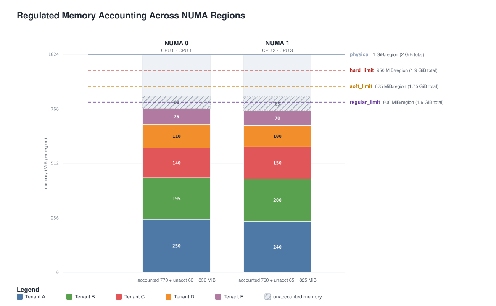

# Multitenancy Memory Management

**Status:** Draft

## Overall limits

When CPU demand exceeds a usage limit, the operating system mechanism
can throttle the process by waiting for time to pass. When the dataflow
engine process exceeds its memory limit, the operating system kills the
process.

The fundamental asymmetry in enforcement makes memory management the
primary objective in a multitenant resource framework. Before the
dataflow engine can subdivide its resources into portions assigned to
multiple tenants, it must take care of itself, a responsibility for
never reaching its own memory limit.

## Memory Regulation

The dataflow engine is required to implement a system of **memory
regulation** over its primary data structures. Users of memory are
registered inside the dataflow engine and required to use dedicated
interfaces. Significant data structure and reserves of non-request
memory allocated within the dataflow engine are accounted for,
including associated with tenant identity(ies), using a fallible
request pattern.

Among its first principles, a dataflow engine must ensure it can start
and become observable, including memory observability. Starting its
own internal telemetry pipeline is a critical first step in the
operational lifecycle. On failing to construct a viable
self-observability pipeline, the dataflow engine should immediately
exit, this is considered a fatal misconfiguration.

## Memory Requests

Dataflow engine components acting under memory regulation will identify
themselves for accounting and provide the applicable tenant tokens. We
expect all bulk memory allocation to go through regulated memory
interfaces.

A major source of memory in the pipeline is telemetry data
itself. Processor and exporter nodes each include a queue of requests,
measured in slots, that will consume memory at runtime. When a new
pipeline is being configured, the engine will know the tenant identity
and associated configuration, including maximum request size.

We prefer when memory limits are based on this predictive power. The
dataflow engine:

- can predict memory usage from configuration, knowing each node's
  settings and limits, data structure sizes, and average and/or
  maximum request size.
- can adjust the initial configuration before pipelines start
- can adjust node configuration on the fly.

By these means, the dataflow engine should be configured by users to
avoid memory allocation failures under normal operating
conditions. However, when unexpected load or number of tenants arise,
callers will see allocations that fail. When regulated memory limits
are reached, typically there will be a choice of hard failure, waiting
to acquire the limit, or taking memory reserved by a lower-priority
tenant.

## Memory Configuration

To give operators certainty over memory usage, along with conceptually
simple configuration, memory configuration can be either relative to
the container or given in absolute terms. For example, a pipeline
group may be configured with 100MiB of regulated memory or with 10% of
its group regulated memory, instead of requiring users to understand
the relationship between request size and queue slots to correctly
set memory limits.

Regulated memory will be configured as a target relative to the total
container memory, to allow for background levels of unaccounted
memory.

```
policies:
  resources:
    memory_limiter:
      # In a 100MiB container, set the hard limits at
      # 85% and 90% of available memory.
      hard_limit: 90MiB
      soft_limit: 85MiB

      # Limit regulated memory to 80% of container
      regular_limit: 80MiB

engine:
  observability:
    policies:
      resources:
        memory_limiter:
          # The self-observability pipeline admits 8MiB of regulated memory
          # 80*10/(10+90) = 8
          regular_weight: 10
    pipeline: { ... }

groups:
  main-group:
    policies:
      resources:
        memory_limiter:
          # The main group admits 72MiB of regulated memory
          # 80*90/(10+90) = 72
          regular_weight: 90

    # Note memory limits are set at group level, memory is
    # shared by the pipelines.
    pipelines:
      # ...
```

In the example configuration above, the `regular_limit` and
`regular_weight` fields in the `memory_limiter` resource policy
determine the regulated memory available to each group; memory is
accounted at group level and shared by the group's pipelines.

The hard and soft limits are defined using the operating system's
memory accounting. Soft and hard limits are coarse thresholds used to
configure global overload behavior, for example to use as a load
signal or to stop new requests.

While regular memory limits have complete accounting by design, when
hard and soft limits are reached, it means there is too much memory
that is unaccounted for. We aim to achieve 95% or greater coverage of
allocated bytes under memory regulation so that the difference between
soft and hard limits become a predictably small fraction of total
memory.


