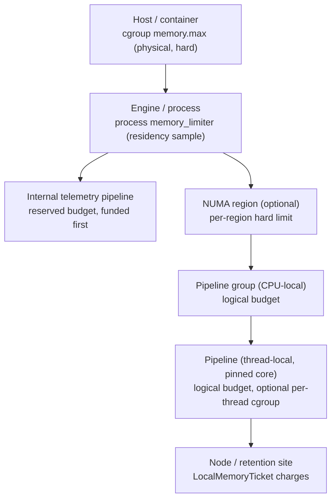
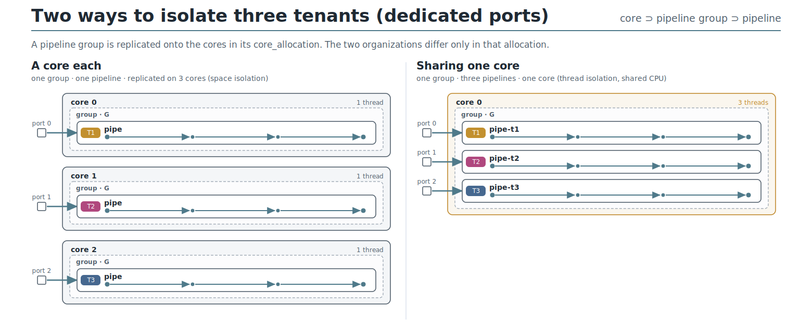
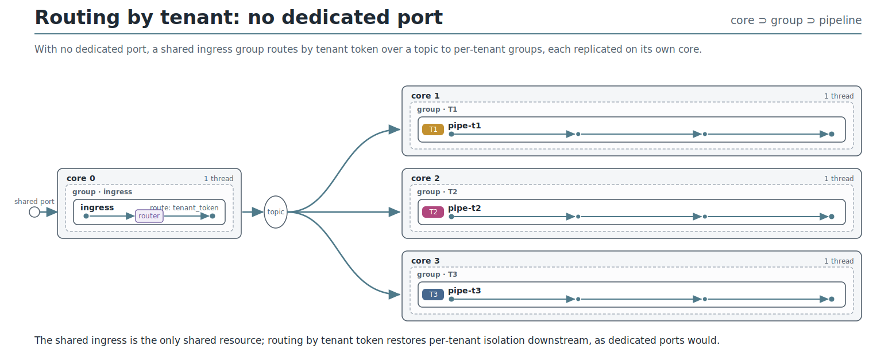
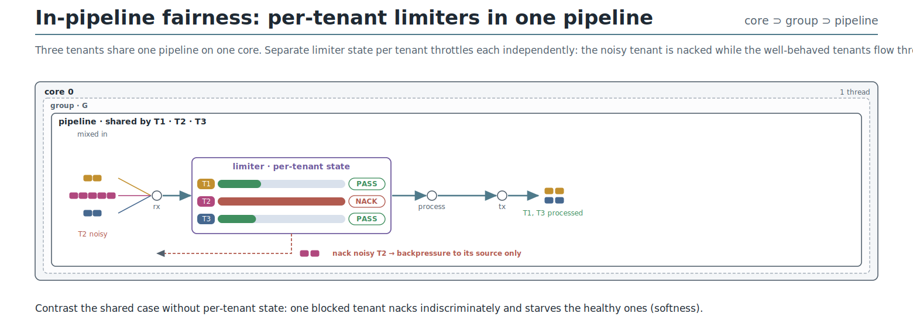
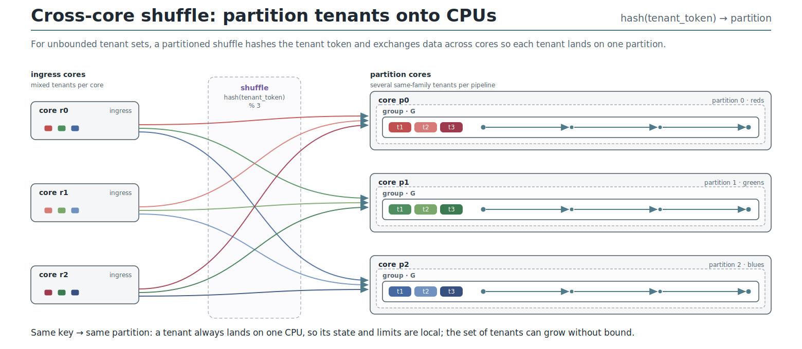

# Multitenancy Overview

This document is a higher-level overview of the isolation mechanisms and
architectural arrangements in the OpenTelemetry-Arrow Dataflow Engine, and
how they combine to deliver multitenancy. It is a companion to the [tenant
identity design](./multitenancy-design.md), which defines how tenants are
identified through route-specific and variable tenant tokens and conditions,
and how tenancy integrates with the configuration and data model.

Where the identity design answers "who is the tenant?", this document answers
"how are tenants isolated?". The engine gives operators command over the
pipeline topology, and there are numerous ways to arrange isolation. Mapping
tenancy concepts onto the isolation model is what produces configurable
multitenant behavior.

## Abstract and physical limits

An isolation mechanism is ultimately a limit on some resource. The engine
distinguishes two kinds.

**Abstract limits** apply to arbitrary quantities the engine counts for
itself, such as requests in flight, items in a queue, bytes on disk, or
records per second. These are expressed with the limiter policies described
below, and the engine is free to choose how it counts and enforces them.

**Physical limits** apply to the two natural resources every process consumes,
time and space, realized as CPU and memory. These are special. From the
application layer the engine cannot guarantee CPU or memory to a tenant on its
own; it relies on operating-system features to establish real limits. Physical
limits are therefore tied to operating-system constructs: threads, CPUs, and
NUMA regions.

The two physical resources are fundamentally different and are treated
separately below. CPU limits are placed on pipelines, which run on threads
pinned to CPUs, and there are several ways to arrange threads to isolate
tenants. Memory limits coordinate with the allocator and use centralized,
hierarchical accounting to track per-tenant usage. Both build on the same
limiter-policy primitive, so we describe that first.

## Limiter policies

Limits are declared as policies under `policies.resources`, alongside
the process-wide `memory_limiter`. Because policies are already
hierarchical, every limit inherits the engine's policy resolution:
top-level defaults are overridden by pipeline-group policies, which are
in turn overridden by pipeline policies, with precedence applied by
family. The policy hierarchy and its resolution rules are defined in
[configuration-model.md](configuration-model.md). Limits come in two
categories, held in two policy families:

- **Rate limits**, under `policies.resources.rate_limits`, count
  resources that are limited as a function of time. When the resource
  is not available, the caller can choose to wait a definite amount of
  time, provided they hold a reservation. These resources are consumed
  immediately and not returned by the caller.
- **Resource limits**, under `policies.resources.resource_limits`,
  count resources that are limited by a current total. When the
  resource is not available, the caller can choose to wait indefinitely
  for the resource to be returned. These apply anywhere in the engine
  there is a resource held in-use by ongoing work, such as queues,
  batches, and topics.

The tenant tokens, conditions, entries, and buckets referenced throughout
this section are defined in the [tenant identity
design](./multitenancy-design.md).

Both kinds of limit can be used with different weight measures, for
example we can limit by request count, by in-memory bytes count, by
compressed bytes count, or by items of telemetry. Rate and resource
limits have distinct runtime interfaces, and of course use different
configuration; however, they generally use the same model for
multitenancy and share a common policy schema:

- **unit**: Describes the units of weight being limited. For rate
  limits this must end with "/second", for example
  `request_count/second` or `memory_bytes/second`. For resource limits,
  omit the rate suffix, for example `memory_bytes`. In the yaml
  configuration, this gives the raw numbers meaning; in the code, a
  verification step ensures that each limit is applied to the correct
  category of weight.
- **optional_tenant_tokens**: Optional, a list of the tenant tokens
  used by the limiter. These token values are extracted from the
  request and used to evaluate conditions.
- **required_tenant_tokens**: Optional, a list of the tenant tokens
  used by the limiter that must be present, otherwise the request is
  immediately failed. These token values are extracted from the
  request and used to evaluate conditions.
- **conditions**: A list of conditions, each of them defined by a name
  and a list of entries with a bucket-specific limit. When all the entries
  are satisfied for all the input tokens, the conditional limit
  is chosen. The first matching condition is selected, otherwise a
  default is used.
- **cardinality**: Determines the limit of unique combinations for
  buckets in the limiter and what happens when the number is exceeded.

Users may provide one or both of `optional_tenant_tokens` and
`required_tenant_tokens`.

The engine provides a built-in implementation for each category, so
the common case needs no custom code: a token bucket for rate limits
and a semaphore for resource limits. A policy selects the built-in by
naming its specific configuration block, so a `token_bucket` block
selects the token-bucket rate limiter and a `semaphore` block selects
the semaphore resource limiter. The general form exposes the shared
schema, one specific setting per condition, and one default value. For
example:

```yaml
policies:
  resources:
    rate_limits:
      some_rate_limit:
        unit: request_items/second
        optional_tenant_tokens: [tenant_form_a, tenant_form_b]
        conditions:
        - name: first
          entries: { ... }
          token_bucket: { ... } # first condition specifics
          cardinality: { ... }
        - name: second
          entries: { ... }
          token_bucket: { ... } # second condition specifics
          cardinality: { ... }
        token_bucket: { ... }   # default condition specifics
        cardinality: { ... }
```

The engine applies each limit policy at the enforcement points that
handle its declared weight, within the policy's scope. Where a specific
node must be selected, a node references a named policy directly, as
shown in the examples below. Limits that exceed the built-ins are
supplied as policy extensions, described under Shared limiters.

### Resource limiters

The built-in thread-local resource limiter is a semaphore that restricts the
total weight of some concurrent activity, for example the number of
requests in flight, the total memory in use, or the number of items in
a queue. The semaphore acts as a gate, limiting the amount of weight
admitted into a logical-admitted state.

The main resource limiter interface **acquire** returns a reservation
object. If the resource reservation was a success, the caller is given
a **resource hold** object with a corresponding **release**
operation. The engine supports storing the resource hold object in the
request Context, for a reservation to follow the request.

When a hold is stored in the request Context, ownership transfers with
the context: whichever component consumes the context becomes
responsible releasing it. The detailed Rust ownership mechanics are an
out of scope here (see
[otel-arrow#3316](https://github.com/open-telemetry/otel-arrow/pull/3316),
however the main requirement is that owners are responsible for
releasing resource reservations and sometimes the reservation is
carried by the request, to be dropped at the same time. Additionally,
resource holds do not automatically cross shared boundaries (i.e.,
they are `!Send`). Sub-components within the engine (e.g., channels)
assume responsibility for resources, and special nodes (e.g., topic
exporter and receiver) will require an explicit mechanisms to transfer
resource holds across threads and CPUs.

The resource limiter interface also controls the total number of
waiters and/or the total amount of pending weight through its
reservation interface. The built-in semaphore limiter's specific
configuration, for example:

```yaml
semaphore:
  admitted: 100_000_000  # max admitted weight
  waiting:  20_000_000   # max waiting weight
  waiters:  100          # max number waiting
  mode:     lifo         # prioritize freshness
```

### Rate limiters

The rate limiter interface **limit** returns a reservation object. If
the rate reservation was a success, the caller just continues. If the
reservation was not granted, limiters may return to the
caller an option to wait. The option to wait is cancellable.

The built-in token bucket limiter's specific configuration, for
example:

```yaml
token_bucket:
  allow:    100_000_000  # maximum per interval
  burst:    20_000_000   # maximum individual weight
  interval: 60s          # interval duration
  waiters:  100          # max number waiting
  mode:     fifo         # prioritize fairness
```

### Shared limiters

Sharing a limit at the pipeline-group or engine scope, meaning across
threads or CPUs, requires careful attention to avoid synchronization
costs. The engine's built-in token bucket and semaphore limiters
support thread-local use only, so they resolve at pipeline scope. Wider
scopes are served by **policy extensions**: the policy machinery lets a
limit request a shared implementation at CPU-local (pipeline group),
global (engine), and eventually NUMA-regional scope.

For performance reasons, a shared limiter policy extension should
separate its hot and cold paths. Commonly, this is done by aggregating
requests in the background and using asynchronous or relaxed-memory
mechanisms to refresh hot-path limiter state.

Among open-source global rate limit solutions, Envoy implements the
[gRPC Global Rate Limit
service](https://github.com/envoyproxy/ratelimit); another popular
solution is
[Gubernator](https://github.com/gubernator-io/gubernator). A global
rate limit policy extension will map fields of the tenant token
into rate-limit requests on systems such as these.

Shared resource limits may be implemented using conventional
synchronization primitives, for example a policy extension with
Mutex-wrapped internal state, but as with a shared rate limit, these
implementations should leverage thread-local state and separate their
hot and cold paths to avoid interference with the dataflow engine.

The limits described in previous examples resolve at thread-local
scope, making them per-tenant and per-pipeline. To implement
engine-wide or group-wide limits on a per-tenant basis, there are two
options:

1. Use a group- or engine-shared limiter instance, supplied as a policy
   extension.
2. Route the data by tenant token to a single pipeline, then use
   the built-in thread-local limiter.

Both are reasonable options.

### Example limiter yaml

Completing the example started above, we can use the three tokens
declared above to implement two rate limit policies.

```yaml
tenant_tokens: { ... }
groups:
  main-group:
    pipelines:
      main-pipe:
        # Limit policies at pipeline scope resolve thread-local, per core.
        policies:
          resources:
            rate_limits:
              # The first rate limit applies to the customer.
              customer_rate:
                unit: network_bytes/second
                optional_tenant_tokens: [enduser_tenant_modern, enduser_tenant_legacy]
                conditions:
                # This gives each workspace with customer_id=bigfish more allowance.
                - name: bigfish
                  entries:
                  - key: workspace_id
                  - key: customer_id
                    value: bigfish
                  token_bucket:
                    allow: 50_000   # 50KB/s allowance per pipeline PER CORE
                    burst: 100_000  # 100KB maximum size PER CORE
                  cardinality:
                    max_count: 1000 # Up to 1000 workspaces (single customer)
                # Every combination of { customer_id != bigfish, workspace_id }
                # uses this limit PER CORE.
                token_bucket: { allow: 25_000, burst: 50_000 }
                # Limit to 10000 buckets, the point where isolation breaks down.
                cardinality:
                  max_count: 10000
                  # When the limit is reached, choose to "break" isolation
                  # or else choose to "reject" the tenant.
                  failure_mode: break

              # Second rate limit applies to the OBO service
              obo_rate:
                unit: network_bytes/second
                required_tenant_tokens: [onbehalfof_tenant]
                # ...

        nodes:
          otlp:
            type: receiver:otlp
            # The engine applies ingress rate-limit policies at this receiver.
            # Listed order is the evaluation order; all must grant to proceed.
            rate_limits: [obo_rate, customer_rate]
            config:
              # determine which tenant tokens are evaluated
              tenant_tokens: [enduser_tenant_modern, enduser_tenant_legacy, onbehalfof_tenant]
              protocols:
                grpc:
                  listening_addr: "127.0.0.1:4317"
```

In this example, where multiple limits are listed for a node as with
`rate_limits: [obo_rate, customer_rate]` above, they are evaluated in
listed order and all must grant for the request to proceed. If a limit
failure causes the request to short-circuit, the granted reservations
are cancelled. Specific implementation details are out-of-scope, see
open questions.

### Limiter fairness

The built-in thread-local limiters support a fairness mode enabling
LIFO and FIFO behavior. We choose LIFO as the default for both because
it prioritizes fresh data and because LIFO is more robust for bursty
workloads, especially considering that telemetry data is usually sent
with a timeout in effect. LIFO-based limiters are less likely to enter
states where all requests exceed their deadline because of limits.

A third option, when queueing, is to prevent blocking in which case
`mode: nonblocking` prevents callers from waiting at the limiter
interface. This is the only valid mode setting in cases where the
caller is unable to block. See blocking and queuing implementation
details below.

In addition to queueing mode, a policy extension can take advantage of
tenant token fields. As an example, a tenant token might be
used to implement a notion of priority among waiters. A hypothetical
`priority_semaphore` policy extension could allow higher-priority
requests to jump ahead of lower-priority requests using this
configuration:

```yaml
priority_semaphore:
  admitted: 100_000_000
  waiting:  20_000_000
  # requests are admitted in order by level
  levels:
  # bigfish always first priority
  - name: high_priority
    entries:
    - key: customer_id
      value: bigfish
  # metrics are second priority
  - name: medium_priority
    entries:
    - key: signal
      value: metrics
  # otherwise lowest priority
  # mode applies within levels.
  mode: lifo
```

### Cardinality limits

The common limiter configuration includes a cardinality limit, which
places a hard limit on the number of buckets. This is the point at
which isolation between limiters has to break somehow. When the number
of distinct limiter instances is reached, we expect several
configurable behaviors:

- Block new tenants, hard error
- Try using least-recently-used or random limiter
- Block the heaviest user.

### Limiter observability

Limiters record a primary observability signal with the declared units,
exposing the current value of the limiter.

- For rate limiters, an OpenTelemetry Counter named `otelcol.rate_limiter.accepted` measuring the accepted weight
- For resource limiters, an OpenTelemetry UpDownCounter named `otelcol.resource_limiter.admitted` measuring the currently admitted weight

Each of these uses the following dimensions:

- Condition name
- Key:values in condition entries of matching bucket
- Signal name of the request.

To bound metric cardinality, these dimensions use the entry keys of
the limiter condition bucket, which are bounded in cardinality by the
limiter.

Additional common metrics are supported at varying levels of detail:

- Cardinality of limiter instances by bucket name (UpDownCounter)
- Number of waiting requests by bucket name (UpDownCounter)
- Amount of waiting weight by bucket name (UpDownCounter)
- Requests arriving, by outcome (accepted/failed)
- Histogram of arriving request weight by accepted/failed

## Operating-system isolation mechanisms

Physical CPU and memory limits are enforced by the operating system, so the
engine maps tenant configuration onto OS-level mechanisms. The engine states
requirements for two:

- **Linux control groups**, called cgroups, set coarse CPU and memory limits
  on a process and its threads, and nest to match the engine's scope
  hierarchy.
- **Windows Job Objects** provide equivalent coarse CPU and memory limits on
  Windows.

Placing a cgroup or Job Object is itself a policy. A physical `resources`
policy can be declared at the scopes where the operating system can enforce
it: the process, a NUMA region, and a worker thread. It sits alongside the
`core_allocation` policy that pins pipelines to cores. The memory section
develops this cgroup-as-policy model in detail, and the same principle applies
to Windows Job Objects.

## CPU isolation (time)

CPU is the time resource. The engine isolates CPU by controlling which tenants
run on which cores. A pipeline is replicated onto the cores in its allocation,
one thread per core, and a pipeline group is the container of pipelines whose
allocation may line up with a NUMA region. CPU limits are therefore placed on
pipelines through the `core_allocation` policy, resolved from engine to group to
pipeline, which assigns a core set with `all_cores`, `core_count`, or
`core_set`; coarse CPU ceilings come from the cgroup or Job Object above.

Because each per-core pipeline instance is a thread, isolating tenants across
threads is a matter of arranging the topology. The two poles are familiar from
the memory model: routing a tenant to a dedicated pipeline turns tenant
isolation into a topology subdivision, while sharing a pipeline and applying
per-tenant limits keeps tenant as a label on shared threads. Between these poles
are several arrangements that trade isolation strength against resource
efficiency.

The specific arrangements, and the diagrams that illustrate them, are
developed under [Mapping tenancy onto
isolation](#mapping-tenancy-onto-isolation) below, where each appears as
a configuration control.

## Memory isolation (space)

Memory is the space resource. Unlike CPU, which the operating system schedules
over time, memory is held until it is released, so the engine isolates memory
by coordinating with the allocator and tracking usage with centralized,
hierarchical accounting. The model starts from one total budget and subdivides
it across the engine hierarchy, from NUMA region through CPU, pipeline group,
pipeline, and retention site, with tenants as a cross-cutting dimension.
Physical cgroup or Job Object limits act as hard backstops at the levels the
operating system can enforce.

The remainder of this section develops that model: the operator stories it
serves, the budget tree and its conservation invariant, the distinction
between physical and logical limits, how the resource limiter above serves as
the common primitive, how cgroups act as policies, the enforcement staging, and
the observability it yields.

### User stories

The design is driven by a small set of operator-facing stories.

- **Internal telemetry keeps flowing.** The engine's own telemetry is
  the channel operators use to see what is wrong. It should keep flowing
  for the whole process lifetime, and when the process cannot even fund
  its own internal telemetry at startup, it should fail fast with a
  clear error rather than start blind.
- **Fairness under pressure.** When a process is configured with less
  memory than all tenants would like, the most important work should be
  protected while less important tenants are shed, and the accounting
  should show which tenants were squeezed and why.
- **Find the hot spot.** When a process is under memory pressure, an
  operator should be able to say which runtime, which kind of buffer,
  which component, and which tenant is holding the retained work, not
  merely that the process number is high.
- **Know before you promise.** Before admitting traffic, the engine
  should be able to check that its configured budgets fit within the
  memory it actually has, so that infeasible configurations are caught
  at startup rather than discovered as an out-of-memory kill.

### Model: one budget, hierarchically subdivided

#### Inferring the total

The root of the hierarchy is a total memory budget for the process. It
is either configured explicitly or inferred from the container, by
reading the cgroup memory limit the same way the phase-1 limiter already
does. The total is the ceiling that every subordinate budget must fit
within, after reserving headroom for allocator overhead and untracked
state.

#### The budget tree

Budgets nest along a tree. Each node owns a budget that is a subdivision
of its parent, and the engine can attach a physical cgroup at selected
levels as a hard backstop.



The logical scopes engine, group, pipeline, and site come from the
dataflow model. The physical scopes host, process, NUMA region, and core
thread come from the operating system. A pipeline is pinned to a worker
thread on a core, a pipeline group spans a set of cores that may line up
with a NUMA region, and the engine spans the whole process. Budgets are
declared along the logical tree, and cgroups may be attached at the
process, NUMA, and thread levels where the operating system can enforce
them.

#### Conservation invariant

The single invariant that makes the model usable is conservation: at
every node, the sum of the children's budgets plus a reserve is less
than or equal to the node's own budget. Because logical accounting is
conservative and does not count overhead, the reserve at each level
absorbs allocator slack and untracked state. The physical cgroup at a
level, where present, enforces the true ceiling regardless of how good
the logical estimate was.

This invariant lets the engine answer the startup-feasibility story: a
configuration is feasible when the budget tree sums correctly under the
inferred total, and infeasible configurations are rejected before any
traffic is admitted.

#### Internal telemetry is a reserved subdivision

Internal telemetry already runs as its own pipeline, the dedicated
engine observability pipeline. In this model it becomes a reserved
subdivision of the engine budget that is funded before any tenant
pipeline. Given its own CPU allocation, a dedicated worker thread, and
optionally its own cgroup, internal telemetry is isolated by
construction rather than by priority arbitration. It keeps flowing while
tenant pipelines are squeezed, because its budget is carved out first
and the operating system protects it. This requires lifting the current
restriction that rejects a `resources` policy on the observability
pipeline.

#### Tenants are a cross-cutting dimension

Tenancy does not add a new level to the tree; it cuts across it. Data
carries tenant tokens, the resolved tenant tokens from the tenant
identity design ([multitenancy-design.md](./multitenancy-design.md)), and
those tokens follow the data through whatever
thread, group, and pipeline retains it. Tenant budgets are therefore
expressed either by routing a tenant to a dedicated pipeline, which
turns tenant isolation into a tree subdivision, or by a per-tenant
resource limiter within a scope, which keeps tenant as a label on the
shared budget. Both are supported, and the choice is a configuration
matter.

### Two classes of limit

The engine limits memory along a second axis, physical versus logical,
distinct from the abstract-versus-physical split introduced earlier.
Both use the same limiter interface, and it is worth naming the
difference because memory sits astride it.

#### Physical limits: the higher power

Physical limits are enforced by the operating system: a cgroup
`memory.max` on the process, and, where we choose to place them, hard
limits per NUMA region and per worker thread. These limits count real
residency, including allocator overhead and fragmentation, and they are
authoritative. When a physical limit is hit, there is a higher power
than the engine, and the outcome is a kernel decision such as an
allocation failure or an out-of-memory kill. The engine's job is to stay
comfortably under these limits, not to reason about the exact byte.

#### Logical limits: conservative and ticketed

Logical limits are enforced inside the engine by counting a declared
logical size for each unit of retained work, following the ticket design
in otel-arrow#3316. A `LocalMemoryTicket` owns a charge while data stays
on one pinned runtime, and an `EscrowTicket` owns the charge once the
work crosses a shared boundary. These charges model memory by size only.
They deliberately do not count allocator overhead, do not query
`size_of_val` or the allocator, and report sites that cannot estimate a
size as unknown rather than guessing. Logical accounting is therefore a
conservative under-estimate of residency, precise about attribution but
blind to overhead.

#### How they compose

The two classes are complements, not alternatives, and they line up with
the two facets we already have.

<!-- markdownlint-disable MD013 -->
| Aspect | Physical limit | Logical limit |
| --- | --- | --- |
| Enforced by | Operating system (cgroup, kernel) | Engine (ticket + semaphore) |
| Counts | Real residency, including overhead | Declared logical size only |
| Attribution | None | Runtime, site, component, tenant |
| Failure mode | Allocation failure, OOM kill | Admission wait or rejection |
| Role | Hard backstop, the higher power | Fine-grained budgeting and insight |
| Existing basis | phase-1 limiter, cgroups | otel-arrow#3316 ticketing |
<!-- markdownlint-enable MD013 -->

Because logical totals under-count and physical limits over-count
relative to what the pipeline logically holds, the two bound the truth
from both sides. The headroom reserve in the conservation invariant is
exactly the gap we leave between the logical budget and the physical
ceiling so that the physical limit is a backstop and not a routine
trigger.

### ResourceLimiter as the common primitive

The resource limiter described above, with its `acquire` and
`release` interface, is the natural primitive for every level of this
hierarchy. A resource limiter limits the concurrent total of some
weight, and it is agnostic to what the weight measures. It can count
requests in flight, items in a queue, bytes on disk, or bytes of memory.
This generality is what lets one mechanism serve both the physical and
the virtual side of the design.

For memory specifically, a semaphore-style resource limiter at each
scope holds that scope's budget. A ticket acquires against the nearest
scope budget when retention starts and releases when retention ends, and
the charge rolls up the tree so that a parent scope sees the sum of its
children. The `acquire` and `release` contract is appropriate here in
the generic sense: the caller reserves a logical amount and returns it
when the work is done.

The one caveat, which the physical layer exists to handle, is that
memory has a higher power. A logical `acquire` that succeeds is a
statement about modeled size, not a guarantee from the allocator. We are
being deliberately conservative when we model memory by size and ignore
overhead, and we lean on the physical cgroup to enforce the real ceiling
when the model and reality diverge.

### Cgroups are policies too

As introduced under operating-system isolation mechanisms above, placing
a cgroup is itself a policy, and the same is true of a Windows Job
Object. This section makes that concrete for memory. A cgroup is
a physical `resources` policy that can be declared at the scopes where
the operating system can enforce it: the process, a NUMA region, and a
worker thread. It sits alongside the existing `core_allocation` policy,
which already supports pinning a pipeline to a specific set of cores
through `all_cores`, `core_count`, and `core_set`.

Two extensions to the current policy model follow:

- The `memory_limiter` policy, today restricted to the top-level scope,
  becomes available per scope, so a group, a pipeline, or the internal
  telemetry pipeline can declare its own memory floor and ceiling.
- A new physical cgroup policy expresses hard limits per thread and per
  NUMA region, so that the reserved subdivisions, most importantly
  internal telemetry, are protected by the kernel and not only by the
  engine's own bookkeeping.

Both extensions keep the same rule the limiter-policy model already
insists on: the hot path stays runtime-local, and no global
synchronization is introduced by adding a limiter or a cgroup at a
scope.

### Enforcement mechanics

The model is meant to be adopted in the same staged way the retained-work
accounting proposes, so that measurement is trusted before control is
switched on.

1. **Observe only.** Tickets charge and release, budgets are declared,
   and the engine publishes retained and budgeted bytes per scope. No
   traffic is rejected. This is the phase where attribution is
   validated, matching the `observe_only` posture of both the phase-1
   limiter and otel-arrow#3316.
2. **Enforce logically.** Scope budgets begin to admit and backpressure
   at explicit boundaries when a subdivision would exceed its logical
   budget. Rejection belongs at admission points, not scattered through
   the pipeline.
3. **Backstop physically.** Cgroups at the process, NUMA, and thread
   levels enforce the hard ceilings, and the process-wide limiter
   remains the final guard that sheds ingress under real pressure.

The three layers are ordered from most attributable and least
authoritative to least attributable and most authoritative. Logical
enforcement acts first because it knows who owns what; the physical
backstop acts last because it is the higher power.

### Observability

The payoff of subdividing one total is that the total decomposes into
subtotals that add up. The engine publishes a single multidimensional
`UpDownCounter` for retained memory, so that any slice of the hierarchy
can be read off by aggregating over the other dimensions.

<!-- markdownlint-disable MD013 -->
| Dimension | Purpose |
| --- | --- |
| NUMA region | Which memory region holds the work |
| CPU / core | Which worker thread holds the work |
| Pipeline group | Which CPU-local group owns the budget |
| Pipeline | Which thread-local pipeline owns the budget |
| Tenant | Which tenant token the retained work carries |
| Retention site | Queue, batch, retry, router, topic, or exporter |
| Component | Which receiver, processor, or exporter |
<!-- markdownlint-enable MD013 -->

Alongside the retained-bytes counter, each scope publishes its declared
budget and its headroom, so an operator can see not just where memory is
held but how close each subdivision is to its own limit. These logical
metrics complement, and do not replace, the residency gauges the phase-1
limiter already emits, such as `memory_rss` and `memory_pressure_state`.

Tenant is the one dimension that needs care, because tenant values can be
sensitive or high-cardinality even when bucket counts are bounded.
Tenant labeling should follow the same policy the limiter policies
above adopt for limiter metrics, which may mean bucketed, hashed, or disabled
by default.

### How the model satisfies the user stories

- **Internal telemetry keeps flowing** because it is a reserved
  subdivision with its own thread and optionally its own cgroup, funded
  before any tenant pipeline. When the inferred total cannot even fund
  that reserved subdivision, the startup-feasibility check fails and the
  process can exit with a clear error instead of starting blind.
- **Fairness under pressure** falls out of per-scope and per-tenant
  budgets. The reserved subdivisions are protected while other tenants'
  budgets are the ones that backpressure or shed, and the accounting
  shows which tenants were squeezed.
- **Find the hot spot** is answered directly by the multidimensional
  counter, which names the runtime, the site, the component, and the
  tenant holding retained work.
- **Know before you promise** is the conservation invariant checked at
  startup: budgets that do not fit under the inferred total are rejected
  before traffic is admitted.

### Memory model non-goals

- This document does not specify the ticket types, traits, or release
  paths; those belong to otel-arrow#3316.
- It does not specify tenant token resolution; that belongs to the tenant
  identity design, and the limiter configuration surface is described above.
- It does not attempt to reconcile logical bytes with allocator
  residency. The two are related by a headroom reserve, not by equality.
- It does not define an eviction or reclaim policy for components that
  are over budget; that is a later phase.

## Mapping tenancy onto isolation

Tenant tokens from the identity design are the thread that ties tenancy to the
isolation mechanisms above. A token can select a limiter policy bucket, route a
request to a dedicated pipeline, or label a shared budget. Because operators
command the topology, the same tenancy concepts map onto many isolation
arrangements, and the choice is a configuration matter rather than a fixed
behavior. The arrangements below are concrete examples, ordered from the strongest
physical isolation to the most elastic sharing. All use the inclusion
`core > pipeline group > pipeline`, and all rely on one primitive.

Backpressure at each hop connects the two physical limits. A pipeline
instance runs on one core, so its time budget is that core's CPU and its
space budget is that core's memory. The bounded channels, limiter
policies, and topic publish limits between nodes couple the two, because
work that cannot be admitted for space also stops consuming time, and
work that cannot keep up in time stops admitting space. Separating these
budgets onto different cores creates isolation; limiting them in place
creates the potential to share. The same backpressure appears in every
arrangement below.

One rule governs every tenant-oriented fan-out. A topic router, a
partition manager, or any node that serves several tenants from one
queue must preserve their independence: it is configured to fail fast,
returning a nack, rather than to block. A blocking node would let one
tenant's backpressure stall the head of a shared queue and starve the
others, which is head-of-line blocking and defeats the isolation the
arrangement is meant to provide. Fast failure keeps a slow or over-limit
tenant from delaying its neighbors.

### Dedicate or share cores



The first control is physical layout, expressed through the
`core_allocation` policy. A pipeline group is replicated onto the cores
in its allocation, so the same three tenants can be isolated two ways.
In the first, one pipeline is replicated across a core set of three:
each per-core instance runs on its own core with separate CPU and
separate memory, and a dedicated port maps each tenant to a core. This
is the hardest isolation, bounded by core count. In the second, three
distinct pipelines share a core set of one: they run as separate threads
on a single core, isolated by thread and by per-thread memory budget but
sharing CPU time, with a dedicated port mapping each tenant to a
pipeline. In both, backpressure stays local to the per-core instance.

### Route by tenant



When ingress cannot be separated, because there is one shared port, a
shared ingress pipeline routes by tenant token over a topic to
per-tenant pipelines, each on its own core. This recovers the per-tenant
isolation that dedicated ports would provide, at the cost of one shared
resource, the ingress pipeline. That is where the fast-fail rule matters
most: the router nacks a tenant whose destination is over budget rather
than blocking, so the shared ingress cannot head-of-line-block the other
tenants behind it.

### Per-tenant limits in a shared pipeline



Tenants can instead share a single pipeline and still be isolated, by
giving the limiter a separate state per tenant. Three tenants share one
pipeline on one core, and the limiter throttles each independently
against its own budget. A noisy tenant is nacked when its bucket is
full, while the well-behaved tenants continue, and the nack applies
backpressure only to the noisy tenant's source. Without per-tenant state
one blocked tenant would nack indiscriminately and starve the healthy
ones; that softness is exactly what per-tenant limiters remove. Here
backpressure ties space and time together directly, because the
limiter's weight can be bytes or a rate and the same interface throttles
both.

### Balance unbounded tenants by shuffle



The arrangements above work for a small, bounded number of tenant
groups. For a large or unbounded set, the engine balances with a
partitioned shuffle: a topic router hashes the tenant token and
exchanges data across cores so that every tenant lands on a single
partition, and each partition pipeline hosts several tenants that hash
to it. Because the same key always reaches the same CPU, a tenant's
limiter state and budgets stay local, and the tenant set can grow
without bound while a user can still address a single partition. The
shuffle follows the fast-fail rule per partition: a full partition nacks
its tenants rather than blocking the exchange, so one hot partition
cannot stall the others.

Load balancing uses the dataflow engine's topic-broker infrastructure,
computing `hash(tenant_token) % N` to distribute a request to one of N
topic receivers; the detailed load-balancer design is out of scope here.
Often there is a simultaneous need to aggregate and load-balance by
features other than tenant, such as metric name or trace id, which
requires creating multi-tenant, multi-request batches destined for a
single consumer.

### Composing arrangements

These are primitives, not alternatives. One deployment can dedicate
cores to its largest tenants, shuffle the long tail across a partition
pool, and apply per-tenant limits inside each shared pipeline, all in a
single configuration. In every case the backpressure at each hop is what
ties the space and time budgets together, and the fast-fail rule is what
keeps tenants independent.

## Limiting use-cases

The two forms of limiter interface have many applications. They can be
thread-local or shared through pipeline-group, NUMA-regional and
global-level policy extensions. The set of weights is not fixed;
however, it is well known. Limiter units determine the mechanism being
limited, and the code and the configuration must agree on what is
being limited when the policy is applied, so that the limit is
applied to the correct weight.

So far, examples have illustrated the use of several weight names:

- `request_bytes` measures the in-memory size of the request
- `network_bytes` measures the on-wire size of the request
- `request_count` measures one unit per request
- `request_items` measures one unit per item of telemetry data
- `storage_bytes` measures one unit per byte of storage
- `storage_ops` measures one unit per storage read or write

### Storage limits

As an example, consider extending the Durable Buffer processor with
per-tenant rate and storage limits.

```yaml
tenant_tokens: { ... }   # enduser_tenant_modern / _legacy, as defined earlier

groups:
  main-group:
    pipelines:
      main-pipe:
        policies:
          resources:

            resource_limits:
              # Per-tenant disk space quota: a semaphore over bytes resident on disk.
              disk_space:
                unit: storage_bytes
                optional_tenant_tokens: [enduser_tenant_modern, enduser_tenant_legacy]
                conditions:
                - name: bigfish
                  entries:
                  - key: workspace_id
                  - key: customer_id
                    value: bigfish
                  semaphore: { admitted: 1_000_000_000, waiting: 100_000_000, waiters: 64, mode: lifo }
                  cardinality: { max_count: 1000 }
                semaphore: { admitted: 100_000_000, waiting: 10_000_000, waiters: 64, mode: lifo }
                cardinality: { max_count: 10000, failure_mode: break }

            rate_limits:
              # Per-tenant disk limit: a token bucket over disk ops/second.
              disk_iops:
                unit: storage_ops/second
                optional_tenant_tokens: [enduser_tenant_modern, enduser_tenant_legacy]
                conditions:
                - name: bigfish
                  entries:
                  - key: workspace_id
                  - key: customer_id
                    value: bigfish
                  token_bucket: { allow: 2_000, burst: 4_000, interval: 1s }
                  cardinality: { max_count: 1000 }
                token_bucket: { allow: 500, burst: 1_000, interval: 1s, mode: fifo }
                cardinality: { max_count: 10000, failure_mode: break }

        nodes:
          durable_buffer:
            type: processor:durable_buffer
            # The engine applies these named limit policies at the durable buffer.
            resource_limits: [disk_space]
            rate_limits: [disk_iops]
            config:
              path: /var/lib/otap/buffer
              retention_size_cap: 10 GiB
              size_cap_policy: backpressure
```

### Observability limits

The dataflow engine's internal telemetry system can be configured to
rate-limit log records by tenant, as an example below. First, the
codebase would have to be extended to make its logging macros
optionally context-specific. In locations where a log event is
associated with a request context, its tenant tokens would be
used to locate a limiter before evaluating the log statement.

```yaml
policies:
  resources:
    rate_limits:
      tenant_log_rate:
        unit: log_records/second
        required_tenant_tokens: [ ... ]
        conditions: { ... }
        token_bucket: { allow: 5, burst: 10, interval: 1s, mode: nonblocking }

engine:
  telemetry:
    logs:
      level: info
      rate_limit: tenant_log_rate
  tenant_tokens: { ... }
  observability:
    pipeline:
      nodes:
        itr:
          type: receiver:internal_telemetry
          config: {}
        otlp_out:
          type: exporter:otlp_grpc
          config:
            grpc_endpoint: "http://127.0.0.1:4317"
      connections:
        - from: itr
          to: otlp_out
```

### Rust async blocking and queueing

The mode configuration described for standard limiter requires a
degree of coordination between the caller of the limiter and the
runtime. Limiters themselves never block the runtime, they are
synchronous interfaces that return reservations. Reservations describe
a contract between the caller and the runtime to enable blocking with
LIFO or FIFO semantics, however it is the caller's responsibility
to delay the request.

This explains why the `nonblocking` mode is sometimes necessary, as it
is the only viable setting for callers that cannot delay a request.
When the receiver is able to delay a request (e.g., in memory) and
unless the `nonblocking` is configured, the reservation object is used
to coordinate with the limiter.

## Relationship to other documents

- [`multitenancy-design.md`](./multitenancy-design.md) defines tenant identity:
  tenant tokens, extractors, conditions, and how tenancy integrates with the
  configuration and data model. The limiter policies and isolation mechanisms
  in this document consume the tenant tokens it resolves.
- [`memory-limiter-phase1.md`](./memory-limiter-phase1.md) is the process-wide
  residency backstop and the source of the inferred total budget.
- [otel-arrow#3316](https://github.com/open-telemetry/otel-arrow/pull/3316) is
  the ticketing implementation for logical, attributable retained-work
  accounting.

## Open questions

These items are out of scope here or deferred:

- How is a NUMA region modeled as a first-class scope, and how does a pipeline
  group's core set map onto it?
- Is a per-thread cgroup practical on the target platforms, or is per-thread
  limiting better done logically with the cgroup applied only at the process
  and NUMA levels?
- How is the headroom reserve at each level sized, and is it a fixed fraction, a
  configured amount, or derived from observed overhead?
- When several limiters guard one admission, how do they reserve and commit
  together so that an earlier grant is not wasted when a later limiter denies?
  This is the reserve-and-commit question: the current design evaluates limiters
  in order and a request granted by earlier limiters can be lost when a
  subsequent limiter fails, so an efficient reserve-and-commit interface may be
  required.
- How does the budget tree, and the limiter policies generally, respond to live
  reconfiguration when pipelines and tenants are added or removed at runtime?
- Rust mechanics for holding resource reservations, in both thread-shared and
  thread-local cases, should align with the retained-work accounting described
  in [otel-arrow#3316](https://github.com/open-telemetry/otel-arrow/pull/3316).
- Multi-valued limiter requests, for example a map of key:value to weight, would
  support resource token extractors in multi-resource contexts. Could we add a
  helper to acquire many limits at once?
- Some forms of limiter are applied independent of request context, before
  headers are known, where isolation is still required to separate tenant
  groups. For example, receiver connection limits and pipeline CPU limits are
  outside of request context and resource or transport-header tokens do not
  apply. However they can still define tenant tokens and limit on token
  extractors as appropriate; for example, the rate of new connections could be
  limited in terms of source address.
