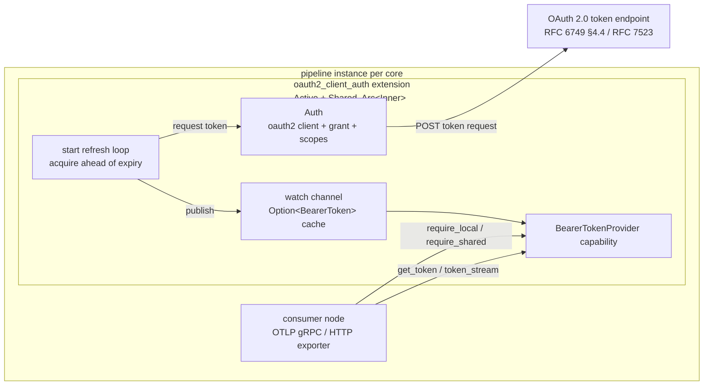

# OAuth 2.0 Client Auth Extension

<!-- markdownlint-disable MD013 -->

**Status:** Draft

**Extension URN:** `urn:otel:extension:oauth2_client_auth`

**Capability exposed:** `BearerTokenProvider`

**Execution model:** Active + Shared

**Target crate:** `crates/contrib-extensions`

**Target module:** `crates/contrib-extensions/src/oauth2_client_auth/`

This document describes the design of the **OAuth 2.0 Client Auth extension**
(`oauth2_client_auth`) for the OTAP dataflow engine. The extension acquires and
refreshes OAuth 2.0 access tokens using the **client-credentials** grant
(RFC 6749 §4.4, 2-legged) and the **JWT-bearer** grant (RFC 7523), and exposes
them to data-path nodes through the `BearerTokenProvider` capability. It is the
generic, provider-neutral counterpart to the Azure-specific
[Azure Identity Auth extension](azure-identity-auth-extension.md), modeled on the
Go collector's
[`oauth2clientauthextension`](https://github.com/open-telemetry/opentelemetry-collector-contrib/blob/main/extension/oauth2clientauthextension/README.md).

It builds on the extension system foundations:

- [Extension System Proposal](extension-requirements.md) - the *what* and *why*
  of the capability-based extension system.
- [Extension System Architecture](extension-system-architecture.md) - the
  Phase 1 *how* (capability proc macro, registry, Active/Passive lifecycle,
  local/shared execution models).
- [Design Principles and Constraints](design-principles.md) - thread-per-core
  execution, minimal synchronization, security/privacy first.

## Problem

The OTLP exporters (`urn:otel:exporter:otlp_grpc`, `urn:otel:exporter:otlp_http`)
today support only **static** request headers. A fixed `Authorization` header
cannot express an OAuth 2.0 flow, cannot refresh a token before it expires, and
forces credentials into every node's config. Any node authenticating to an
OAuth-protected endpoint (an OTLP backend, a vendor gateway) must either use a
long-lived static token or re-implement client-credentials acquisition, caching,
and refresh inline on its data path.

The extension system lets us factor this out into a **shared, cross-cutting
capability** that any node binds to, while keeping the data path free of
authentication plumbing - the same rationale as the Azure extension, but for
standard OAuth 2.0 endpoints rather than Azure identity flows.

## Goals

- Provide a reusable OAuth 2.0 token source backed by the client-credentials and
  JWT-bearer grants, exposed through the existing `BearerTokenProvider`
  capability so it is a drop-in alternative to the Azure provider for any
  consumer (primarily the OTLP exporters; see
  [Consumer Integration](#consumer-integration)).
- Support credential rotation without a restart, by reading `client_id` /
  `client_secret` / signing-key material from files that can change at runtime.
- Refresh tokens **in the background**, ahead of expiry, so consumers read a
  fresh token from cache on the hot path with no per-call token round-trip.
- Coalesce concurrent token acquisitions so a cache miss does not stampede the
  token endpoint.
- Preserve the engine's performance model: no locks on the data-path hot path,
  no blocking I/O on the per-core async runtime.
- Emit telemetry (success/failure counts, publish count, acquisition latency)
  for operability.

## Non-Goals

- A new capability. This extension **reuses** the `BearerTokenProvider`
  capability introduced with the
  [Azure Identity Auth extension](azure-identity-auth-extension.md#capability-bearertokenprovider);
  it adds no capability machinery.
- Provider-specific identity flows (Managed Identity, Workload Identity). Those
  belong to the Azure extension.
- 3-legged (authorization-code) or device-code flows. This extension is a
  machine-to-machine (2-legged) token source only.
- Per-request, per-tenant token selection. One extension instance serves one
  configured client + scope set.
- User-tunable refresh cadence beyond the `expiry_buffer` knob; timing is
  otherwise governed by token lifetime and fixed constants (see
  [Refresh Loop](#refresh-loop)).

## Core Decisions

| Decision | Choice |
| --- | --- |
| Component shape | Standalone extension in the `otap-df-contrib-extensions` crate; the `oauth2`/HTTP client dependency is isolated behind a feature flag. |
| Capability surface | Implements the existing `BearerTokenProvider` (`get_token()` cached fast path / single coalesced slow path, `token_stream()` refresh subscription). No new capability. |
| Execution model | `Active + Shared`. Shared serves both `require_shared()` and `require_local()` consumers via the macro's local fallback; Active drives the background refresh loop. |
| Startup gating | Opt into the engine readiness probe; `signal_ready()` after the first token publish so the engine holds data-path node startup until a token exists (bounded by the probe timeout). |
| Sharing model | All state behind `Arc<Inner>`; every clone (consumers + background task) observes one token cache. At pipeline scope this is per pipeline instance (per core). |
| Token cache | `tokio::sync::watch<Option<BearerToken>>` - lock-free fast-path read + pub/sub for `token_stream()`. |
| Slow-path coalescing | An async `fetch_lock` with double-checked caching so concurrent cache-miss callers - and the background refresh - share one in-flight token request. |
| Grant types (v1) | `client_credentials` (client secret) and `jwt-bearer` (RFC 7523, signed client assertion). |
| Credential rotation | `client_id` / `client_secret` / signing key may be supplied inline or via `*_file` paths re-read on each acquisition; the file form takes precedence. |
| Refresh tuning | `expiry_buffer` is user-configurable; the min cadence, refresh jitter, and exponential-backoff-with-jitter retry are fixed constants. |
| Transport security | Per-instance TLS config (CA / client cert / insecure) for the token endpoint; a `timeout` bounds each token request. |
| Registration | `#[distributed_slice(OTAP_EXTENSION_FACTORIES)]` link-time discovery, same mechanism as nodes. |
| Telemetry | `MetricSet`-backed counters + latency histogram, flushed via `ExtensionControlMsg::CollectTelemetry`. |

## Capability

The extension implements `BearerTokenProvider` unchanged - the same
`get_token()` / `token_stream()` trait, `BearerToken` data type, and
`CapabilityError` semantics defined in the
[Azure Identity Auth extension](azure-identity-auth-extension.md#capability-bearertokenprovider).
Because both extensions expose the same capability, a consumer binds either one
interchangeably; the choice is a configuration concern, not a code change. This
document therefore covers only what differs: the OAuth 2.0 token source, its
configuration, and its refresh behavior.

## Architecture



### Token flow

1. **Construction.** At factory time, `create()` deserializes and validates the
   config, builds an `Auth` (an OAuth 2.0 client bound to the grant type,
   `token_url`, scopes, `endpoint_params`, and a TLS-configured HTTP client),
   registers the metric set, and constructs the extension with an empty `watch`
   channel (`Option<BearerToken> = None`).
2. **Background refresh.** When the engine spawns the extension, `start()` runs a
   loop that requests a token, publishes it onto the `watch` channel, and
   schedules the next refresh `expiry_buffer` ahead of expiry. After the first
   successful publish it calls `signal_ready()`, releasing the engine's readiness
   gate so the data path starts with a warm cache.
3. **Fast-path read.** `get_token()` first checks the `watch` cache; a token
   outside the refresh window is returned immediately - no token round-trip, no
   lock.
4. **Slow-path read.** On a cache miss (before the first refresh, or after a
   failed refresh), `get_token()` performs a single token request under the
   `fetch_lock` with double-checked caching, so concurrent callers coalesce onto
   one in-flight request.
5. **Stream.** `token_stream()` subscribes to the `watch` channel and yields each
   subsequent published token; the initial `None` is filtered out.

### Internal state

```rust
#[derive(Clone)]
pub struct OAuth2ClientAuthExtension {
    inner: Arc<Inner>,
}

struct Inner {
    auth: Auth,                                       // oauth2 client + grant + scopes
    tx: watch::Sender<Option<BearerToken>>,           // token cache + pub/sub
    cap_err: CapabilityErrorSource<BearerTokenProvider>,
    fetch_lock: tokio::sync::Mutex<()>,               // coalesce slow-path fetches
    metrics: std::sync::Mutex<OAuth2ClientAuthMetricsTracker>,
}
```

All mutable state lives behind `Arc<Inner>` so the engine can clone the extension
freely. The `fetch_lock` is an async `Mutex` (held across an `.await`); the
metrics `Mutex` is a `std` `Mutex` whose critical sections are short and never
held across an `.await`. This mirrors the Azure extension's sharing model - only
the `auth` field differs.

## Configuration

The extension is declared in the pipeline's `extensions:` section and bound to a
node via the node's `capabilities:` map.

```yaml
groups:
  default:
    pipelines:
      main:
        extensions:
          oauth2:
            type: "urn:otel:extension:oauth2_client_auth"
            config:
              grant_type: client_credentials
              token_url: "https://idp.example.com/oauth2/v1/token"
              client_id: "someclientid"
              client_secret_file: "/etc/secrets/oauth2_client_secret"
              scopes: ["telemetry.write"]
              endpoint_params:
                audience: "https://otlp.example.com"
              expiry_buffer: 5m
              timeout: 2s
              tls:
                ca_file: "/etc/ssl/idp-ca.pem"

        nodes:
          otlp-exporter:
            type: "urn:otel:exporter:otlp_grpc"
            capabilities:
              bearer_token_provider: oauth2
            config:
              endpoint: "https://otlp.example.com:4317"
```

### Config schema

| Field | Type | Default | Notes |
| --- | --- | --- | --- |
| `grant_type` | enum | `client_credentials` | `client_credentials` or `jwt-bearer` (`urn:ietf:params:oauth:grant-type:jwt-bearer`). |
| `token_url` | `string` | *required* | The token endpoint URL. Must be non-empty. |
| `client_id` | `string?` | *none* | Client identifier. Required unless `client_id_file` is set. |
| `client_id_file` | `string?` (path) | *none* | Path re-read on each acquisition; takes precedence over `client_id`. Enables rotation. |
| `client_secret` | `string?` | *none* | Client secret. Required for `client_credentials` unless `client_secret_file` is set. |
| `client_secret_file` | `string?` (path) | *none* | Path re-read on each acquisition; takes precedence over `client_secret`. |
| `scopes` | `[string]` | `[]` | Requested scopes. |
| `endpoint_params` | `map<string,string>` | `{}` | Extra parameters sent to the token endpoint (e.g. `audience`). |
| `expiry_buffer` | duration | `5m` | Refresh this far ahead of `expires_on`. Must be non-zero. |
| `timeout` | duration? | *none* (no timeout) | Per-request timeout on the token client. |
| `tls` | object? | *none* | TLS settings for the token client (`ca_file`, `cert_file`, `key_file`, `insecure`). |
| `startup_timeout` | duration | `30s` | How long the engine holds data-path startup waiting for the first token publish before aborting (see [Lifecycle](#lifecycle)). Must be non-zero. |

For `grant_type: jwt-bearer` (RFC 7523), the extension signs a client assertion
instead of sending a client secret. These fields apply only to that grant and
are rejected for `client_credentials`:

| Field | Type | Default | Notes |
| --- | --- | --- | --- |
| `client_certificate_key` / `client_certificate_key_file` | `string?` | *required for jwt-bearer* | Private key used to sign the assertion. The `_file` form is re-read on each acquisition and takes precedence. |
| `signature_algorithm` | enum | `RS256` | RSA algorithm for the assertion (`RS256`/`RS384`/`RS512`). |
| `client_certificate_key_id` | `string?` | *none* | Optional `kid` header on the assertion. |
| `iss` | `string?` | `client_id` | Assertion issuer. |
| `audience` | `string?` | `token_url` | Assertion audience. |
| `claims` | `map<string,string>` | `{}` | Extra assertion claims. |

The config struct uses `#[serde(deny_unknown_fields)]` and is validated by the
factory's `validate_config` hook before the pipeline starts. Validation rejects
an empty `token_url`, a zero `expiry_buffer`/`startup_timeout`, a missing
client identifier, a missing secret/signing key for the selected grant, and any
grant-specific field that does not apply to the selected `grant_type`.

## Refresh Loop

`start()` runs a `select!` loop with two arms, identical in shape to the Azure
extension's loop (control channel + refresh timer); only the acquisition call and
the `expiry_buffer` source differ:

1. **Control channel** (`ctrl.recv()`): `Shutdown` returns the final metric
   snapshot as the terminal state; `Config` is a no-op in v1; `CollectTelemetry`
   flushes the metric set. The control channel is polled even while a refresh is
   in flight, so a shutdown arriving mid-acquisition cancels the in-progress
   token call rather than letting a slow request run past the shutdown deadline,
   and telemetry flushes are serviced without interrupting a refresh.
2. **Refresh timer** (`sleep_until(next_refresh)`):
   - On tick: take the `fetch_lock` (the same one the slow-path `get_token` uses)
     and re-check the cache. Coalesce onto a concurrently-acquired token **only
     if it is not yet due for refresh** (still outside the `expiry_buffer`
     window); a token that is merely still valid but inside that window does not
     count, so a scheduled early refresh is never deferred by a concurrent
     cache-miss fetch. Otherwise, acquire a new token.
   - On success: publish with `send_replace` (updates the cache regardless of
     subscriber count), reset the consecutive-failure count, then compute
     `next_refresh` from `expires_on` minus `expiry_buffer` (clamped to a minimum
     cadence) with a small negative jitter so per-core extensions do not all
     refresh on the same tick.
   - On failure: log and reschedule using bounded exponential backoff with jitter
     (from the base retry delay up to the cap), tracking consecutive failures;
     keep retrying for the lifetime of the extension. The backoff spreads retries
     across cores so a token-endpoint outage is not stampeded on a fixed cadence.

Tuning constants:

| Constant | Value | Purpose |
| --- | --- | --- |
| `expiry_buffer` (config) | `5m` default | Refresh this far before `expires_on`. |
| `MIN_TOKEN_REFRESH_INTERVAL_SECS` | 10 | Floor between successful refreshes; also the earliest a jittered refresh may land. Avoids busy-looping on near-expired tokens. |
| `TOKEN_REFRESH_RETRY_SECS` | 10 | Base reschedule delay after a failed acquisition; doubles per consecutive failure. |
| `MAX_TOKEN_REFRESH_RETRY_SECS` | 300 (5m) | Ceiling for the exponential retry backoff. |
| `REFRESH_JITTER_SECS` | 60 | Max negative jitter applied to a scheduled refresh (never pulling it below the min cadence), to de-correlate per-core refreshes. |

### Expiry handling

The token endpoint returns a relative `expires_in`; the extension anchors it to a
monotonic `Instant` (`Instant::now() + expires_in`) once, so the schedule is
immune to wall-clock jumps thereafter. A response without expiry pushes the next
refresh far into the future; the loop is still woken by control messages.

## Consumer Integration

A consumer binds `bearer_token_provider` to an `oauth2_client_auth` instance and
resolves it once at factory time - exactly the mechanism described in the
[Azure extension's Consumer Integration](azure-identity-auth-extension.md#consumer-integration).
Nothing on the consumer side is OAuth-specific; a node cannot tell which provider
backs the capability. The primary consumers are the **OTLP gRPC and HTTP
exporters**, which inject a fresh `Authorization: Bearer <token>` on outgoing
requests by reading the cached token via `get_token()` (replacing today's static
header). Any other `BearerTokenProvider` consumer works unchanged.

## Telemetry

Metrics are recorded in the background refresh loop and the slow-path
`get_token()` branch, and flushed via `ExtensionControlMsg::CollectTelemetry`.

| Metric (set: `extension.oauth2_client_auth`) | Type      | Description                                             |
|-----------------------------------------------|-----------|---------------------------------------------------------|
| `auth_successes`                              | Counter   | Successful token acquisitions.                          |
| `auth_failures`                               | Counter   | Failed token acquisitions.                              |
| `auth_token_publish`                          | Counter   | Tokens published to consumers via the watch channel.    |
| `auth_success_latency`                        | Mmsc (ms) | Latency of successful acquisitions (min/max/sum/count). |

## Lifecycle

### Startup

1. The engine starts the extension before any consumer that binds it (extensions
   start first; see
   [Extension System Architecture](extension-system-architecture.md#key-design-decisions)).
   At factory time `create()` has already built `Auth`, registered the metric
   set, and constructed the extension with an empty token cache.
2. `SharedExtension::start()` runs the refresh loop. The first successful token
   request publishes a token onto the `watch` channel, then calls
   `EffectHandler::signal_ready()`.
3. The engine holds data-path node spawning on the extension's readiness probe
   (`wait_all_ready`) until that signal fires, bounded by the probe timeout. The
   extension sets this via `with_readiness_probe_timeout_override` from the
   `startup_timeout` config field (default `30s`, larger than the engine's 5 s
   default to accommodate a slow token endpoint plus a ~10 s failure-retry inside
   the gate). If the first token is not acquired in time, startup aborts with a
   readiness-timeout error rather than starting nodes without a token.
4. Data-path nodes then start. Each consumer resolves the capability once at
   construction (`require_local()` / `require_shared()`) and holds the typed
   handle for its lifetime - no capability resolution on the hot path. Because
   the readiness gate already ensured a token is published, the first
   `get_token()` hits the warm cache; the slow path remains only for later cache
   misses (e.g. a refresh failure mid-run).

### Shutdown

1. The engine drains data-path nodes first. Each consumer finishes in-flight work
   and drops its capability handle.
2. After all consumers drain, the engine sends `ExtensionControlMsg::Shutdown` on
   the control channel. The refresh loop returns the final metric snapshot as its
   terminal state and drops the OAuth 2.0 client and `watch` sender; a token
   acquisition in flight at that moment is cancelled (see
   [Refresh Loop](#refresh-loop)) so shutdown is not delayed by a slow request.
   No token request is issued after shutdown begins.

### Live reconfiguration

The extension is reconfigured over the extension system's own control channel
(`ExtensionControlMsg`), independent of pipeline-node reconfiguration
(`NodeControlMsg::Config`). In v1, `ExtensionControlMsg::Config` is a no-op:
refresh cadence is governed by token lifetime and `expiry_buffer`, and changing
the client, grant, or scopes is treated as an extension restart rather than an
in-place swap. Credential *values* still rotate without a restart when supplied
via the `*_file` fields, since those are re-read on each acquisition (see
[Configuration](#config-schema)). Promoting the client/grant/scopes to
hot-swappable config is possible future work (see [Open Questions](#open-questions)).

### Cargo features

```toml
[features]
contrib-extensions = ["oauth2-client-auth-extension"]
oauth2-client-auth-extension = ["dep:oauth2", "dep:reqwest"]

[dependencies]
oauth2 = { workspace = true, optional = true }
reqwest = { workspace = true, optional = true, features = ["rustls-tls"] }
```

**Crypto provider prerequisite.** The `reqwest`/`rustls` HTTP client requires a
process-wide `rustls` crypto provider. `Auth::new()` calls
`otap_df_otap::crypto::ensure_crypto_provider()` before constructing the client,
and the deployed binary **must** enable exactly one `crypto-*` feature; otherwise
token requests panic at runtime with "No provider set". This is the same
prerequisite as the Azure extension.

### Factory registration

```rust
pub const OAUTH2_CLIENT_AUTH_URN: &str = "urn:otel:extension:oauth2_client_auth";

#[distributed_slice(OTAP_EXTENSION_FACTORIES)]
pub static OAUTH2_CLIENT_AUTH_EXTENSION: ExtensionFactory = ExtensionFactory {
    name: OAUTH2_CLIENT_AUTH_URN,
    description: "Active+Shared extension exposing BearerTokenProvider via OAuth 2.0 client credentials",
    documentation_url: "",
    capabilities: Some(extension_capabilities!(
        shared: OAuth2ClientAuthExtension => [BearerTokenProvider]
    )),
    create,
    validate_config: validate_typed_config::<Config>,
};
```

The URN follows the [URN format](urns.md): `urn:otel:extension:oauth2_client_auth`
uses the `otel` namespace (standard OAuth 2.0, not vendor-specific). The main
binary links the crate with a side-effect import so the registration takes
effect.

## Security Considerations

- **Secret handling.** Client secrets, signing keys, and access tokens are held
  only in memory (behind `Arc<Inner>` / the `watch` cache) and are never logged;
  log/telemetry sites emit grant type, `token_url`, scopes, and refresh timing
  only.
- **Secret sourcing.** Prefer the `*_file` fields over inline secrets so
  credentials are not embedded in pipeline config and can be rotated by updating
  the file; the extension re-reads them on each acquisition.
- **Transport security.** The token endpoint is contacted over TLS by default;
  `tls.insecure` is offered only for local testing and is discouraged. A
  `timeout` bounds each token request so a hung endpoint cannot stall refresh.
- **Endpoint protection.** Slow-path fetch coalescing (`fetch_lock`) prevents
  request stampedes against the token endpoint on cache misses.
- **Least privilege.** The extension requests exactly the configured `scopes`.

## Performance Considerations

- **No hot-path token calls.** Steady-state `get_token()` is a lock-free read of
  the `watch` cache; token-endpoint round-trips happen only on the background
  loop or on a cold cache miss.
- **No data-path locks.** Shared state is `Arc`-wrapped; the only locks are the
  async `fetch_lock` (slow path only) and the short metrics `Mutex` (never held
  across `.await`).
- **Per-core instantiation.** At pipeline scope the extension is instantiated per
  pipeline instance (per core), consistent with the Phase 1 sharing-boundary
  rule. The cache, refresh loop, and token acquisitions **replicate per core**,
  not per consumer: on an N-core deployment a single-exporter pipeline yields N
  caches, N refresh loops, and N independent token fetches. The `shared` model
  only collapses duplication *within* a core (multiple consumers on the same core
  share one `Arc<Inner>`); it does not share across cores. Consequently,
  **slow-path coalescing (`fetch_lock`) bounds the startup thundering herd to N
  concurrent acquisitions (one per core), but does not eliminate it** - the
  per-core loops are uncoordinated. To stop those uncoordinated loops from
  realigning after startup, scheduled refreshes carry negative jitter and failed
  acquisitions use bounded exponential backoff with jitter, so steady-state
  refreshes and outage retries stay spread across cores rather than firing on a
  shared cadence. A future move to a broader scope (group/engine) would let a
  single instance be shared across cores without code changes (see
  [Extension Scopes](extension-requirements.md#extension-scopes)).
- **Runtime discipline.** The refresh loop runs on the per-core async runtime;
  all token I/O is async (`reqwest` HTTP), so it never blocks other futures on
  the core. TLS handshakes and JWT signing for the `jwt-bearer` grant happen only
  on the background loop or slow path, never on the data-path hot path.

## Validation Expectations

Validation focuses on user-facing scenarios; where behavior overlaps the Azure
extension (refresh-ahead-of-expiry, slow-path coalescing, refresh/retry,
shutdown ordering) the same expectations apply.

OAuth-specific coverage:

- **Client-credentials happy path.** A `client_credentials` config against a test
  token endpoint publishes a token, the bound OTLP exporter only exports once a
  token exists, and `auth_successes` / `auth_token_publish` increment.
- **JWT-bearer grant.** A `jwt-bearer` config signs a client assertion with the
  configured key/algorithm and obtains a token; `client_credentials`-only fields
  are rejected for this grant and vice versa.
- **Config validation.** Missing `token_url`, missing client id, missing
  secret/key for the selected grant, a zero `expiry_buffer`, and unknown fields
  are all rejected at config time.
- **Credential rotation.** Updating a `client_secret_file` (or key file) causes
  the next acquisition to use the new value with no restart.
- **Endpoint errors.** A 4xx/5xx or timeout from the token endpoint increments
  `auth_failures`, the loop reschedules with bounded exponential backoff plus
  jitter, and a subsequent success recovers without restarting the extension.

## Open Questions

1. **Grant coverage.** v1 ships `client_credentials` and `jwt-bearer`. Is there
   demand for password or refresh-token grants, or should those stay out of
   scope as non-machine-to-machine flows?
2. **Multi-scope / multi-endpoint.** As with the Azure extension, one instance
   serves one client + scope set; a node needing multiple audiences declares one
   instance per audience. Is a single multi-scope instance worth the added
   surface? (Shared with the Azure extension's
   [Multi-resource tokens](azure-identity-auth-extension.md#open-questions)
   question.)
3. **Identity/scope hot-swap.** Should `ExtensionControlMsg::Config` rebuild
   `Auth` in place (new client / scopes) instead of requiring an extension
   restart?

## Future Work

- **mTLS-only clients.** Support token endpoints requiring client-certificate
  authentication as a first-class grant, beyond the `jwt-bearer` assertion.
- **Broader extension scope.** Hoist to group/engine scope (Phase 2) for genuine
  cross-core token-cache sharing (see
  [Extension Scopes](extension-requirements.md#extension-scopes)).
- **Shared token-source module.** Factor the `watch`-cache + refresh-loop +
  `fetch_lock` machinery common to this and the Azure extension into a reusable
  internal helper.

## References

- [Azure Identity Auth Extension](azure-identity-auth-extension.md) - sibling
  `BearerTokenProvider` provider; source of the capability, cache, and lifecycle
  design reused here.
- [Extension System Proposal](extension-requirements.md)
- [Extension System Architecture](extension-system-architecture.md)
- [Design Principles and Constraints](design-principles.md)
- [Architecture](architecture.md)
- [URN Format](urns.md)
- [Go collector `oauth2clientauthextension`](https://github.com/open-telemetry/opentelemetry-collector-contrib/blob/main/extension/oauth2clientauthextension/README.md)
- [RFC 6749 §4.4 - Client Credentials Grant](https://datatracker.ietf.org/doc/html/rfc6749#section-4.4)
- [RFC 7523 - JWT Profile for OAuth 2.0 Client Authentication](https://datatracker.ietf.org/doc/html/rfc7523)
