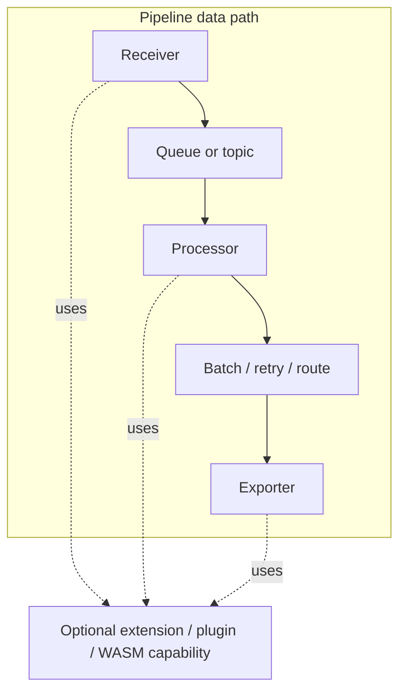
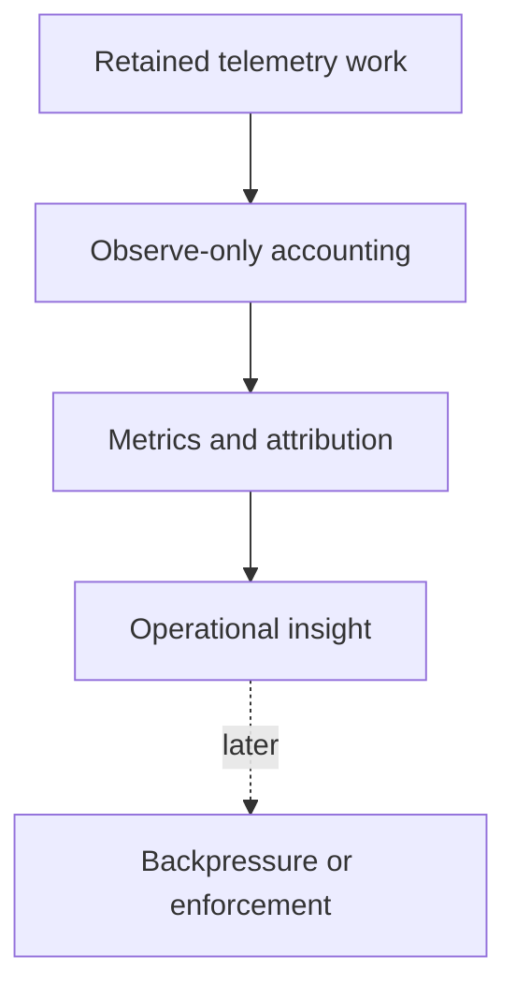
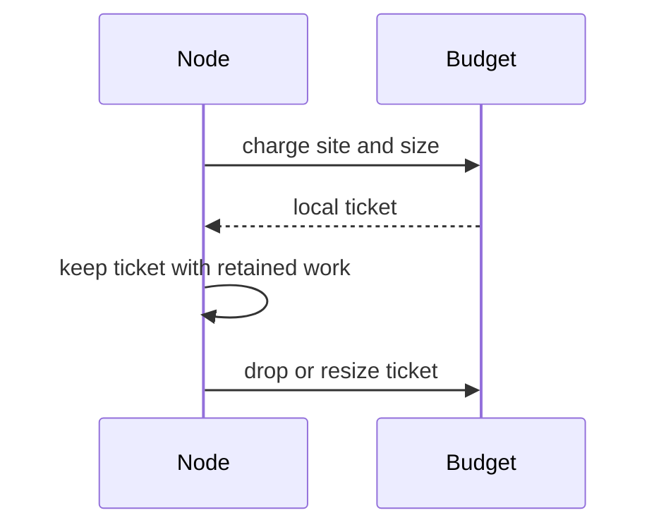
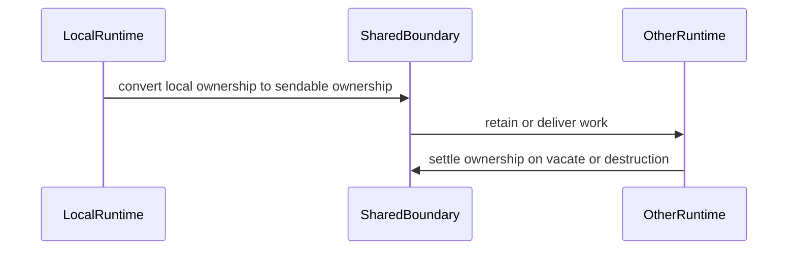

# Observe-Only Retained-Work Memory Accounting

This document defines the first level of retained-work memory accounting for
the OTAP dataflow engine: an observe-only layer for seeing where admitted
telemetry waits in memory and which component logically owns it.

This document deliberately stops before enforcement. The goal here is to agree
on the measurement model first.

## Summary

A telemetry pipeline can hold admitted data in receiver intake, queues, batch
buffers, retry buffers, routers, topics, and exporter requests. Any of these can
hold a large share of process memory at a given moment.

Process-level signals such as resident set size (RSS) or cgroup usage tell us
that the process is under pressure. They do not tell us *where* admitted
telemetry is waiting, or *who* is responsible for it. That gap is what
observe-only retained-work accounting is meant to close.

Observe-only accounting should:

- attribute retained telemetry bytes to a runtime, a retention site, and a
  component,
- preserve normal traffic flow while measuring retained work,
- and provide the visibility needed before any later enforcement or tenant
  isolation work.

## Why this exists

A pipeline can look healthy at the process level while one queue, exporter, or
retry buffer holds most of the retained work. An operator with only a process
gauge has no direct way to find that hot spot.

The problem gets worse with more than one pipeline or tenant in a process. One
noisy source can push work into shared queues and topics and indirectly consume
memory that shows up as a single process number. Without attribution, every
source looks equally responsible.

Before anyone can safely isolate, reject, or backpressure a source, they need to
know who is actually holding memory and where. The first step is visibility, not
rejection. Get attribution right, validate it, and only then consider control.

## Relationship to the process-wide limiter

The process-wide memory limiter (`memory-limiter-phase1.md`) remains the outer
safety guard: it samples real process or cgroup memory and sheds ingress under
`Hard` pressure. This document designs the attribution layer beneath it - the
"`MemoryTicket` ownership on retained work items" and "queue and topic byte
accounting" items that the Phase 1 document explicitly deferred to later
phases.

The two layers measure different things and are complements, not alternatives.
The process limiter sees every resident byte, including allocator overhead, but
cannot attribute any of it. Retained-work accounting attributes admitted
telemetry precisely, but does not see allocator slack or non-pdata state.
Neither number replaces the other, and later enforcement layers are expected to
keep the process limiter as the final backstop.

## Future tenant and priority attribution

This observe-only phase does not enforce tenant limits, reserve memory for
internal telemetry, or preempt already-admitted work. It only establishes the
retained-work ownership model needed to make those policies possible later.

Future tenant-aware enforcement may need to distinguish protected internal
telemetry, pipeline groups, tenants, or other policy-defined classes. The
ownership model should therefore allow tickets, escrow, and shared-boundary
owners to carry an optional stable work-owner attribution key. That key should
be a small, stable value such as an interned id or compact numeric handle, not a
per-item string. Human-readable names can be resolved when metrics are exported.

That attribution key may come from a tenant descriptor, pipeline group,
internal-telemetry classification, or another policy source. Tenant descriptor
design remains separate: it defines how the engine identifies the work owner;
this document defines how retained bytes are owned and released.

A later enforcement phase can use this attribution to reserve capacity for
agent internal telemetry, cap lower-priority tenants, reject or backpressure
lower-priority work first, and account shared queues or topics by tenant or
policy class. Dynamic reclaim or preemption of already-admitted lower-priority
work is separate future work and is not part of this observe-only phase.

Internal telemetry should eventually be modeled as a protected owner class, not
as ordinary tenant work. Enforcement can then fund that class from a reserved
budget before admitting other tenant work, and startup validation can fail fast
when the configured process budget cannot fund the internal telemetry floor.
Observe-only accounting does not enforce that reservation; it only leaves room
for the owner attribution needed to add it later.

Future hierarchical budgeting may add parent-child budget scopes such as
engine, internal telemetry, pipeline group, pipeline, runtime, and tenant or
policy class. This observe-only phase does not define that budget tree or its
enforcement rules. It only requires retained-work ownership to carry stable
scope attribution so later budgeting layers can aggregate over prefixes of that
scope and enforce without changing the ownership model.

## A minimal mental model

The OTAP dataflow engine moves telemetry through a small set of roles. A
reviewer does not need to know every internal type to follow this document.

- **Receivers** admit telemetry into the pipeline.
- **Processors** transform, batch, route, retry, or delay it.
- **Topics and shared boundaries** may retain work between runtimes or
  components.
- **Exporters** may hold encoded payloads or in-flight requests until a send
  completes.
- A **controller** starts and supervises pipelines, while **worker runtimes** do
  the actual data movement, usually one pinned runtime per core.

Once an item is admitted, it occupies memory somewhere in this chain until it is
delivered, dropped, or acknowledged. Retained-work accounting is about naming
that "somewhere".

## Diagrams

### Where work can be retained



Retained work may sit at any of these points after it has been admitted but
before it has been delivered, dropped, or acknowledged. Extensions, plugins, and
WASM providers are shown with dotted lines because they are optional capability
boundaries that may be used by receivers, processors, or exporters. If a custom
plugin or WASM module runs as a data-path node, or if a capability buffers
admitted telemetry, its retained work follows the same ownership discipline as
the built-in pipeline stages.

### Observe-only versus enforcement



Observe-only mode records where work is retained, attributes ownership, and
exposes that information through metrics. Traffic continues to flow as before.
The dotted path is intentional: backpressure or rejection comes later, after the
ownership and release paths are trustworthy.

### Local ownership



Local ownership is the lowest-overhead case. A node keeps a local ticket beside
the data it is holding, and the ticket is valid only on that runtime. This keeps
the common path local for work that never leaves the runtime.

### Shared-boundary ownership



Shared ownership starts when retained work crosses a boundary where a local
ticket cannot safely travel. The local owner is converted into a sendable owner,
which is then responsible for release while the work sits outside the local
runtime.

## Core idea: retained work has an owner

The whole design rests on one rule: every admitted item that waits in memory has
exactly one logical owner.

The owner is the component or boundary responsible for that retained work at the
moment. It holds the accounting and settles it when that retention interval
ends.

Two shapes of ownership are enough to start:

- **Local ownership** for work that stays on one pinned runtime.
- **Shared ownership** for work that crosses into a shared queue, a topic, or
  another runtime.

Ownership stays with the data structure that retains the work. It usually moves
with an envelope, but a broadcast ring keeps ownership in its occupied slot when
it clones a payload reference for a subscriber. Any accounting kept beside a
payload should have a lifetime tied directly to the retaining entry so it cannot
drift away from the work it describes.

## Ownership types

### Local retained ownership

Local retained ownership is used when retained work stays on the same pinned
runtime.

- It should be cheap and runtime-local.
- It should not require shared locks or atomics on every item.
- It is intentionally not safe to send across threads: it never
  needs to.

In Rust terms this maps to a non-`Send` ticket held next to retained data.

### Shared retained ownership

Shared retained ownership is used when retained work crosses a `Send` boundary:
a shared queue, a topic, or a cross-runtime path.

- It must be safe to move between threads.
- It must settle exactly once when its actual retention interval ends.

In Rust terms this maps to a sendable ownership handle, such as an escrow
ticket.

### Envelope-style ownership

A retained item can be carried as an envelope that holds the payload and its
ownership together. Bundling them is a simple way to make sure the data and its
accounting cannot diverge: you cannot move or drop one without the other.

A concrete design should keep this shape simple: local owners for runtime-local
retention, sendable owners for shared boundaries, and optional envelopes when a
payload and its owner must move together. Most nodes should not need a broad
trait hierarchy; they only need to create ownership when they retain work and
release or transfer it when the payload leaves.

### Concrete ownership sketch

One proposed observe-only shape uses a small set of ownership primitives:

- `LocalMemoryTicket` would own a logical retained-byte charge while data stays
  on one pinned runtime. It should be intentionally not `Send`, because it
  refunds through runtime-local accounting state.
- `EscrowTicket` would own the same kind of charge after retained work crosses a
  shared queue, topic, or runtime boundary. It should be sendable and follow the
  same exactly-once settlement rule as a local ticket.
- `EscrowSlot` would be the queue-slot form of shared ownership. A shared
  boundary can store the slot next to the retained payload so every queue-exit
  path releases the shared charge uniformly.
- `LocalEnvelope<T>` would pair a local payload with a `LocalMemoryTicket` when
  the payload and owner must move together inside one runtime.
- `SharedEnvelope<T>` would pair a sendable payload with an escrow owner after a
  local owner has been converted at a shared boundary.

In code terms, the primitives would look roughly like this. The sketch fixes
the ownership and transfer semantics, not the final names or signatures.

```rust
/// Declared logical size of a retained payload. `None` means the site reports
/// into the unknown-size dimension instead of guessing.
pub trait RetainedSize {
    fn retained_size(&self) -> Option<u64>;
}

/// Owns a retained-byte charge on one pinned runtime. Intentionally not
/// `Send`: it refunds through runtime-local accounting state when settled.
pub struct LocalMemoryTicket {
    /* scope handle + charged size + explicitly-settled state */
}

impl LocalMemoryTicket {
    /// Normal completion. Refunds the charge exactly once and marks this ticket
    /// settled so Drop does not report abandonment.
    pub fn complete(self);

    /// Convert local ownership to sendable escrow ownership at a shared
    /// boundary. On failure the local ticket is returned unchanged, so
    /// ownership is never lost mid-transfer.
    pub fn try_into_escrow(
        self,
        boundary: &EscrowScope,
    ) -> Result<EscrowTicket, LocalMemoryTicket>;

    /// Replace the existing charge without an interval in which it is missing
    /// or duplicated. Failure returns this ticket and its original charge.
    pub fn try_resize(
        self,
        new_size: u64,
    ) -> Result<LocalMemoryTicket, (LocalMemoryTicket, ResizeError)>;
}

/// Sendable ownership of the same charge while work waits in a shared queue,
/// topic, or crosses runtimes.
pub struct EscrowTicket {
    /* boundary handle + charged size + explicitly-settled state */
}

impl EscrowTicket {
    /// Normal completion with the same exactly-once settlement rule as a local
    /// ticket.
    pub fn complete(self);
}

/// Queue-slot form of escrow ownership, stored beside the retained payload so
/// every slot-exit path releases the charge uniformly.
pub struct EscrowSlot { /* escrow ticket, released on vacate */ }

/// Sendable payload paired with the escrow owner for its current retention
/// interval.
pub struct SharedEnvelope<T> {
    pub payload: T,
    escrow: EscrowSlot,
}

// SharedEnvelope is not normally Clone. An ownership-aware fork would clone
// the payload and create a new accounting owner explicitly.
```

These names and signatures are provisional. The important lifecycle is that
each ticket stores whether it was explicitly settled. A consuming `complete()`
or `release()` operation would mark normal completion and refund the charge
exactly once without recording abandonment. Dropping an unresolved local or
escrow ticket would also refund exactly once, but would record an abandonment
event. This is conceptually similar to the topic `Delivery` pattern: normal
paths commit explicitly, while unresolved `Drop` is distinguishable from
successful completion.

Conversion, resizing, and transfer must preserve the existing charge
continuously. A failed ownership conversion returns the original ticket
unchanged, and a resize or transfer must never create a window in which the old
charge is lost or both old and new charges are active. The payload's declared
size is read when retention starts and remains on the ticket unless an explicit
resize replaces it atomically.

The important split is that local tickets do not go inside `PData` or any
shared/topic envelope. `PData`-shaped messages are `Send` in several engine
paths, while a local ticket is not. For runtime-local retained work, the ticket
should live in an envelope, component state, or a side table whose lifetime is
tied to the retained payload.

`OtapPdata` should remain accounting-neutral. `LocalMemoryTicket`,
`EscrowTicket`, and `EscrowSlot` should not be embedded directly inside it.
Shared boundaries would instead carry an external
`SharedEnvelope<OtapPdata>`. Cloning `OtapPdata` would clone only its telemetry
payload and context; it would not clone, share, or transfer accounting
ownership. `LocalMemoryTicket` must remain outside every `Send` payload type.

When fanout creates another independently retained branch, an explicit,
ownership-aware fork operation would create a new envelope and a new accounting
owner for that branch. A shallow payload clone must never implicitly duplicate
or share an exactly-once ticket. If a downstream node batches, retries, parks,
or otherwise retains a delivered payload locally, it would create a new local
ticket for that new retention interval.

This keeps each retained interval single-owned:

```text
local retained data
  -> LocalMemoryTicket
  -> shared boundary converts to EscrowTicket / EscrowSlot
  -> balanced queue delivery settles its slot owner, while a broadcast ring
     keeps its slot owner until overwrite, explicit clearing, or destruction
  -> downstream local retention creates a new LocalMemoryTicket if needed
```

Any future code that unpacks, clones, rebuilds, or repacks `OtapPdata` is
therefore an accounting boundary to review. It must preserve or transfer the
relevant owner, or it must intentionally release the owner because the retained
interval ended. A plain `OtapPdata::clone()` has no accounting effect; only an
explicit ownership-aware fork creates another owner. Failed sends must return or
settle the original owner, and terminal paths must settle ownership without
acquiring new budget.

This constraint has a cost worth stating plainly: because a local ticket cannot
travel inside the payload, every retaining component holds its owner beside its
own retained state, and coverage is added site by site. A site that is not
instrumented simply does not appear in the accounting. The design accepts this
deliberately, but unknown-size and abandoned-ownership signals do not expose
that missing site. An explicit coverage inventory is needed to find it. Debug
builds should assert that local owners are settled on the runtime that created
them.

Two placement rules follow from this. First, a component should receive its
accounting handle explicitly when it is constructed, the same way it receives
its configuration and metrics; if the handle is instead picked up from ambient
runtime state, a missing handle silently disables accounting at that site
instead of failing at startup. Second, when engine infrastructure retains an
item on a component's behalf - a delay scheduler or timer holding a payload for
later redelivery - the retained entry should carry or return the owner itself,
so that release is tied to the item's identity rather than reconstructed by
matching deadlines or sizes.

### Clones, fanout, and broadcast

Accounting charges per retained logical owner, not per underlying allocation.
Arrow and `Bytes` payloads can be shallow-cloned, so several retained branches
may share one physical buffer. The accounting deliberately reports one charge
per retained branch in that case: a fanout with N retained branches accounts up
to N times the payload bytes, and logical retained bytes can exceed resident
bytes. That is intentional - the number answers "who is holding admitted work",
not "what does the allocator hold".

Balanced queues and broadcast rings have different ownership lifetimes. A
balanced queue slot owns the charge only while its envelope waits in that queue;
delivery, drain, failed-send cleanup, or another operation that vacates the slot
settles that queue owner. Later retention by the consumer is a new interval with
a new owner.

The current broadcast broker instead stores one shared envelope per occupied
ring slot. The ring slot is the retained owner. Subscriber delivery clones the
envelope or payload reference; it does not transfer or clone the ring-slot
accounting owner, and the charge is not multiplied by subscriber count.
Subscriber disconnect does not vacate or release a ring slot. The current topic
close operation marks the ring closed but does not clear occupied slots, so it
does not by itself end their charges. A ring-slot charge ends on overwrite,
explicit slot clearing, or destruction of the ring or slot. Topic close could
release those charges only if a future implementation explicitly clears the
occupied slots.

A subscriber that retains a delivered payload after delivery creates a
separate local retention interval and a new local owner.

### Abandoned ownership

If ownership is dropped without a normal release path, the bytes should not
silently disappear from the accounting. The drop should be recorded as an
abandoned owner.

Abandoned ownership reports an instrumented owner whose ticket was dropped
without explicit completion. It usually points at a terminal or error path that
needs review. Normal completion and abandonment both refund exactly once, but
only the unresolved drop records abandonment.

## What observe-only should measure

The goal is to answer "where is admitted work waiting, and who owns it" with a
small, low-cardinality set of dimensions.

<!-- markdownlint-disable MD013 -->
| Dimension | Purpose |
| --- | --- |
| Runtime retained bytes | Shows which worker or runtime is holding admitted work. |
| Retention site | Shows whether memory is in a queue, batcher, retry buffer, exporter, topic, or processor state. |
| Component identity | Connects retained work to the receiver, processor, topic, or exporter. |
| Pipeline group / pipeline | Connects retained work to the owning pipeline group and pipeline - the scope that later group or tenant budgets will aggregate over. |
| Shared-boundary ownership | Shows work retained outside a single runtime. |
| Unknown-size count | Shows where accounting could not estimate bytes precisely. |
| Abandoned ownership | Highlights possible leaks or incomplete terminal paths. |
| Instrumentation coverage | Reports a coarse, bounded covered/uncovered status for known retention sites. |
<!-- markdownlint-enable MD013 -->

These dimensions are intentionally coarse. They are meant to point an operator at
the right runtime, the right kind of buffer, and the right component, not to
track individual items.

Group and pipeline attribution should be carried on ownership scope from the
first implementation, as interned or compact ids rather than per-item strings.
The engine already knows the pipeline group and pipeline identity at node
construction, so this dimension is cheap and low-cardinality - and retrofitting
it later would mean revisiting every charge site. Attribution should be a
required input when an ownership scope is created, not an optional field that
defaults to empty: the engine always knows the identity, and optional
attribution decays into unattributed accounting. It should be stored once on the
scope that owners reference, not copied into every owner.

For per-pipeline-instance visibility, the ownership scope should identify the
deployed runtime, not just the logical pipeline. At minimum, the scope should
include the pipeline group id, pipeline id, runtime or core id, and runtime
deployment generation. A pipeline instance's retained memory is the sum of active
local tickets and shared-boundary owners carrying that scope. This is logical
retained memory attributed to that pipeline instance, not exact allocator RSS for
that pipeline instance.

## Applying the model

Observe-only accounting is added where a component starts retaining admitted
work, not where bytes happen to be allocated. For each waiting item, the design
should identify who owns it until it moves again.

Each node or boundary follows the same pattern:

1. Estimate the logical size of the retained work.
2. Create local or shared ownership for that size.
3. Keep the owner with the retained payload.
4. Move, resize, or release the owner when the payload moves, changes size, or
   leaves the system.
5. Publish coarse metrics from runtime or boundary snapshots.

<!-- markdownlint-disable MD013 -->
| Pipeline area | Design guidance |
| --- | --- |
| Receivers | Treat data as retained after it crosses the receiver's admission point. Receivers that queue or batch admitted data should keep ownership with that queued data. |
| Processors | Account for work that is buffered, delayed, parked, batched, or waiting for downstream acknowledgement. Stateless transform work that does not retain data between turns does not need a long-lived owner. |
| Topics and queues | Use shared ownership when data can be retained independently of the producing runtime. Settle balanced queue ownership when a slot is vacated. Keep broadcast-ring ownership until overwrite, explicit clearing, or ring destruction. |
| Batch and retry | Keep ownership beside pending batches or delayed retry payloads. If retry state is split between a ticket and a scheduler payload, the design should avoid pretending that dropping only the ticket frees retained work. |
| Routers and fanout | Carry ownership for parked routes or in-flight fanout work until all downstream paths complete or the original work is released. Failed fanout should unwind any ownership it created. |
| Exporters | Account for pending encoded requests and in-flight sends while they wait for completion, retry, timeout, or shutdown cleanup. Completion should release the owner with no new budget acquisition. |
| Extensions, plugins, and WASM | Treat optional capability or custom-node boundaries like any other retaining component. If they buffer admitted telemetry, ownership should enter the boundary with the payload and leave when the payload returns, is forwarded, or is dropped. |
| Shared runtime boundaries | Convert local ownership to sendable ownership before crossing the boundary. The sendable owner is responsible for release while the work is outside the local runtime. |
<!-- markdownlint-enable MD013 -->

This keeps the design consistent across node kinds without requiring every node
to use the same internal data structure. The rule is about ownership of retained
work, not about forcing a specific queue, buffer, or scheduler implementation.

### What counts as retained size

Charged size is a declared logical size for the retained payload: stable, cheap
to obtain, and known at the moment retention starts. Good sources are the
encoded payload byte length, a retained buffer's length, or a component-specific
estimate that the component documents.

Charged size is never derived from the allocator or the operating system.
`size_of_val`, allocator usable-size queries, jemalloc statistics, and RSS or
cgroup deltas are all unsuitable as ticket sizes: they measure residency rather
than retention, they include memory the component does not own, and they change
underneath the accounting. At an instrumented site, a payload whose size cannot
be estimated reports unknown-size rather than guessing. This exposes an
estimation gap at that site, not missing instrumentation elsewhere.

The engine's two payload forms do not make this equally easy. An encoded OTLP
payload has an exact byte length. A columnar record-batch payload has no single
encoded length, and if the native payload type declares no size, every charge on
the engine's main data path lands in the unknown-size dimension and the totals
stop being complete. Observe-only can begin by reporting those records as
unknown-size, because that makes the coverage gap visible. However, the
unknown-size state should not be the long-term answer for the main OTAP-native
path. Before retained-byte totals are treated as complete, or before
enforcement uses them for capacity decisions, the columnar form needs a
documented estimate - for example, the sum of its constituent buffer or
record-batch memory sizes, computed once when retention starts and reused
unchanged.

That estimate is still a logical retained size, not allocator ownership. Shared
Arrow buffers, sliced arrays, and fanout can cause the same underlying memory to
be charged once per retaining owner. That is acceptable for this accounting
model: logical retained bytes answer "who is holding admitted work", and may be
larger than process RSS. The process-wide limiter remains responsible for real
residency.

## Initial observe-only scope

The first level should cover the places where retained work commonly
accumulates and leave control policy for later.

### In scope for the first level

- local retained work on pinned runtimes,
- topic or queue retained work,
- batch pending data,
- retry or delayed work,
- routed or parked work,
- exporter pending and in-flight requests,
- abandoned-ownership visibility,
- low-cardinality attribution by runtime, site, and component.

Partial coverage is acceptable and expected during rollout, but it must be
reported honestly. The first rollout needs an explicit inventory of known
retention sites and their instrumentation status. Coverage should use a coarse,
bounded covered/uncovered status or equivalent diagnostic, without per-item
labels. Unknown-size reports an instrumented site whose payload size cannot be
estimated, while abandoned ownership reports an instrumented owner dropped
without explicit completion. Neither detects a completely uninstrumented
retention site. Retained-byte totals must not be described as complete until the
required retention-site inventory is covered.

## Implementation sequence

1. Define scopes, ticket lifecycle, ownership metrics, and a no-op or disabled
   handle.
2. Instrument one runtime-local retry or delayed-work retention site.
3. Validate normal completion, failure, abandonment, resize, and shutdown paths.
4. Add balanced and shared queue escrow.
5. Add broadcast-ring and fanout accounting with their distinct ownership rules.
6. Add remaining batch, processor-state, and exporter retention sites.
7. Validate the coverage inventory and unknown-size rate.
8. Consider enforcement only after accounting coverage and release behavior are
   trustworthy.

## Non-goals for the first level

These are explicit non-goals:

- No traffic rejection.
- No tenant isolation enforcement.
- No policy tree for group, pipeline, or tenant budgets.
- No budget sizing configuration. Observe-only accounting has no floors, lease
  sizes, or overshoot allowances to configure; the only configuration is whether
  it is enabled. Sizing vocabulary enters the design only when budgets do.
- No silent data dropping.
- No attempt to make every allocator byte match logical retained bytes.
- No high-cardinality labels.
- No invasive scheduler rewrite.

Logical retained bytes are not the same as allocator residency or RSS, and the
first level should not try to reconcile the two. It tracks what the pipeline
logically holds, which is a different and more actionable number than what the
allocator happens to keep resident.

## Accounting principles

Observe-only accounting should be simple enough to reason about during review.

- Each retained telemetry item should have one accounting owner.
- Accounting should start when work is admitted or retained.
- Accounting ownership should move with the telemetry data.
- Accounting should end once the retained work is delivered, dropped, drained,
  or otherwise no longer held.
- Failed transfers should not lose or duplicate ownership.
- Updating an estimated size should not corrupt the previous accounting value.
- Shared owners should settle according to the boundary's actual lifetime:
  balanced slots on vacate, and broadcast slots on overwrite, explicit clearing,
  or ring destruction.
- Cleanup paths should not need to acquire additional budget.
- Observe-only mode should not reject, shed, or backpressure traffic because of
  retained-work accounting.
- Metric labels should stay low-cardinality and should not require per-item
  string allocation.

## Performance principles

The accounting has to be cheap enough to leave on in production.

- Local accounting should be runtime-local and cheap, so the common path is a
  small read and write on local state rather than a lock or an atomic.
- Shared synchronization should appear only at real shared boundaries, where
  work actually crosses runtimes, and not on every local item.
- Per-item string labels should be avoided. Attribution should be interned or
  encoded once, not formatted per item.
- Metric aggregation can happen at snapshot or flush points rather than on every
  item.
- The design should fit the current-thread, pinned-per-core runtime model rather
  than fight it.

## How this helps operators

The payoff is being able to make concrete statements instead of guesses:

- "The process is under pressure, and most retained work is in exporter
  in-flight requests."
- "A retry buffer is growing while receivers keep admitting."
- "One topic boundary is retaining much more work than the others."
- "Abandoned ownership is showing up, so a terminal path probably needs review."
- "Unknown-size counts are high here, so accounting quality needs to improve
  before we trust enforcement."

Each of these is something an operator can act on, and none of them require
changing traffic to learn.

## How this prepares for later enforcement

Enforcement remains out of scope. This phase would only establish trustworthy
ownership, release behavior, coverage, and stable scope attribution. Those
measurements can later inform limits, while rejection and backpressure should
remain at explicit admission points. The possible tenant, priority, reserved
capacity, and hierarchical scope policies are summarized above; their budget
configuration and enforcement rules require a separate design.
