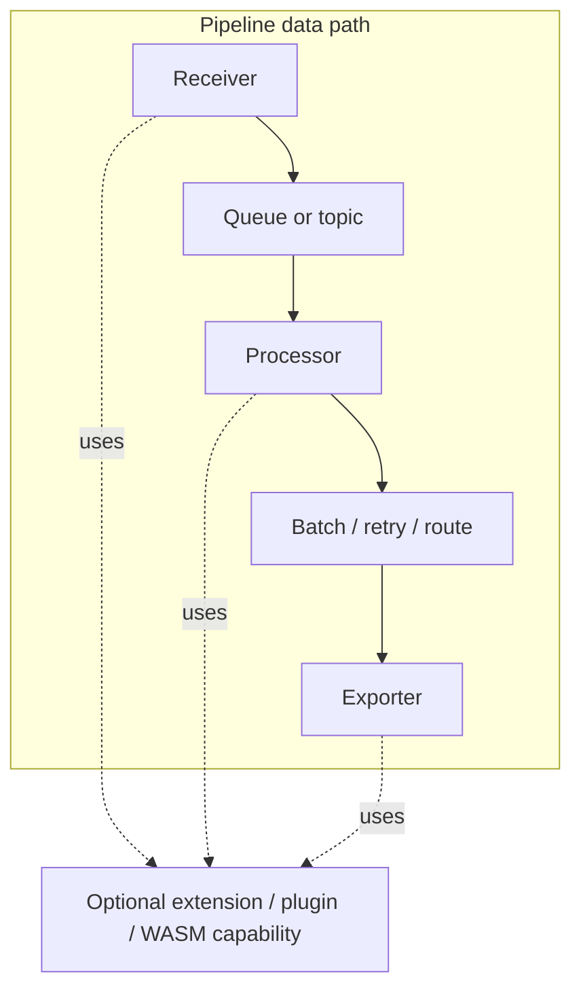
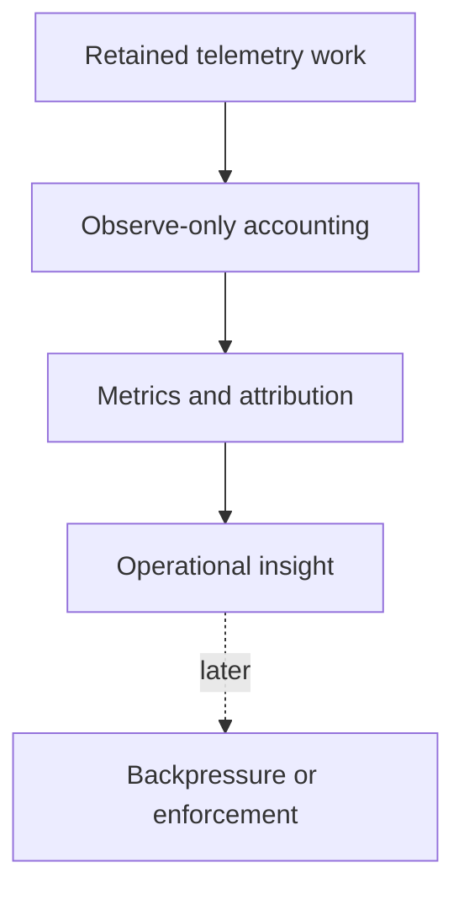
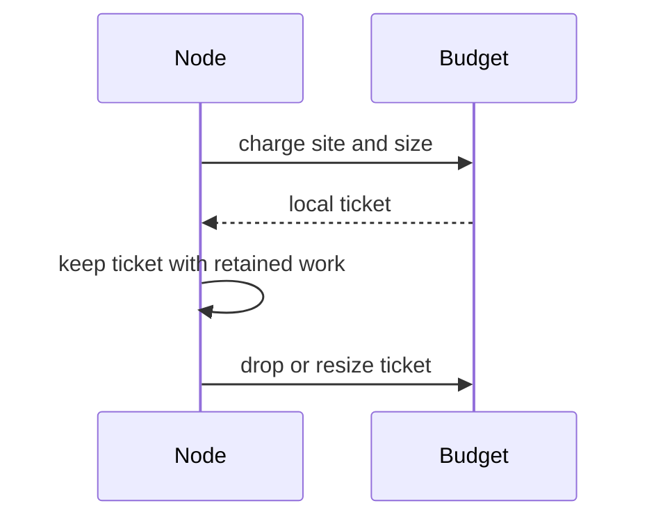
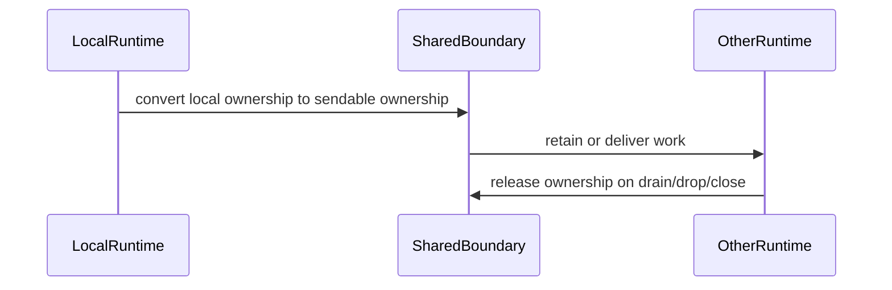

# Observe-Only Retained-Work Memory Accounting

This document defines the first level of retained-work memory accounting for
the OTAP dataflow engine: an observe-only layer for seeing where admitted
telemetry waits in memory and which component logically owns it.

This document deliberately stops before enforcement. The goal here is to agree
on the measurement model first.

## Summary

A telemetry pipeline can hold admitted data in receiver intake, queues, batch
buffers, retry buffers, routers, topics, and exporter requests. Any of these can
hold a large share of process memory at a given moment.

Process-level signals such as resident set size (RSS) or cgroup usage tell us
that the process is under pressure. They do not tell us *where* admitted
telemetry is waiting, or *who* is responsible for it. That gap is what
observe-only retained-work accounting is meant to close.

Observe-only accounting should:

- attribute retained telemetry bytes to a runtime, a retention site, and a
  component,
- preserve normal traffic flow while measuring retained work,
- and provide the visibility needed before any later enforcement or tenant
  isolation work.

## Why this exists

A pipeline can look healthy at the process level while one queue, exporter, or
retry buffer holds most of the retained work. An operator with only a process
gauge has no direct way to find that hot spot.

The problem gets worse with more than one pipeline or tenant in a process. One
noisy source can push work into shared queues and topics and indirectly consume
memory that shows up as a single process number. Without attribution, every
source looks equally responsible.

Before anyone can safely isolate, reject, or backpressure a source, they need to
know who is actually holding memory and where. The first step is visibility, not
rejection. Get attribution right, validate it, and only then consider control.

## A minimal mental model

The OTAP dataflow engine moves telemetry through a small set of roles. A
reviewer does not need to know every internal type to follow this document.

- **Receivers** admit telemetry into the pipeline.
- **Processors** transform, batch, route, retry, or delay it.
- **Topics and shared boundaries** may retain work between runtimes or
  components.
- **Exporters** may hold encoded payloads or in-flight requests until a send
  completes.
- A **controller** starts and supervises pipelines, while **worker runtimes** do
  the actual data movement, usually one pinned runtime per core.

Once an item is admitted, it occupies memory somewhere in this chain until it is
delivered, dropped, or acknowledged. Retained-work accounting is about naming
that "somewhere".

## Diagrams

### Where work can be retained

Retained work may sit at any of these points after it has been admitted but
before it has been delivered, dropped, or acknowledged. Extensions, plugins, and
WASM providers are shown with dotted lines because they are optional capability
boundaries that may be used by receivers, processors, or exporters. If a custom
plugin or WASM module runs as a data-path node, or if a capability buffers
admitted telemetry, its retained work follows the same ownership discipline as
the built-in pipeline stages.

### Observe-only versus enforcement

Observe-only mode records where work is retained, attributes ownership, and
exposes that information through metrics. Traffic continues to flow as before.
The dotted path is intentional: backpressure or rejection comes later, after the
ownership and release paths are trustworthy.

### Local ownership

Local ownership is the lowest-overhead case. A node keeps a local ticket beside
the data it is holding, and the ticket is valid only on that runtime. This keeps
the common path local for work that never leaves the runtime.

### Shared-boundary ownership

Shared ownership starts when retained work crosses a boundary where a local
ticket cannot safely travel. The local owner is converted into a sendable owner,
which is then responsible for release while the work sits outside the local
runtime.

## Core idea: retained work has an owner

The whole design rests on one rule: every admitted item that waits in memory has
exactly one logical owner.

The owner is the component or boundary responsible for that retained work at the
moment. It holds the accounting and releases it when the work is delivered,
dropped, or acknowledged.

Two shapes of ownership are enough to start:

- **Local ownership** for work that stays on one pinned runtime.
- **Shared ownership** for work that crosses into a shared queue, a topic, or
  another runtime.

Ownership travels *with* the data. If the data moves, ownership moves with it.
If the data is dropped, ownership is released. The accounting should not live in
a side table that can drift away from the payload it describes.

## Ownership types

### Local retained ownership

Local retained ownership is used when retained work stays on the same pinned
runtime.

- It should be cheap and runtime-local.
- It should not require shared locks or atomics on every item.
- It is intentionally not safe to send across threads: it never
  needs to.

In Rust terms this maps to a non-`Send` ticket held next to retained data.

### Shared retained ownership

Shared retained ownership is used when retained work crosses a `Send` boundary:
a shared queue, a topic, or a cross-runtime path.

- It must be safe to move between threads.
- It must release exactly once, on close, drain, failed send, eviction, or drop.

In Rust terms this maps to a sendable ownership handle, such as an escrow
ticket.

### Envelope-style ownership

A retained item can be carried as an envelope that holds the payload and its
ownership together. Bundling them is a simple way to make sure the data and its
accounting cannot diverge: you cannot move or drop one without the other.

The implementation should keep this shape simple: local owners for
runtime-local retention, sendable owners for shared boundaries, and optional
envelopes when a payload and its owner must move together. Most nodes should not
need a broad trait hierarchy; they only need to create ownership when they
retain work and release or transfer it when the payload leaves.

### Abandoned ownership

If ownership is dropped without a normal release path, the bytes should not
silently disappear from the accounting. The drop should be recorded as an
abandoned owner.

Abandoned ownership usually points at a terminal or error path that needs
review. Keeping it visible is what lets reviewers find and fix those paths.

## What observe-only should measure

The goal is to answer "where is admitted work waiting, and who owns it" with a
small, low-cardinality set of dimensions.

<!-- markdownlint-disable MD013 -->
| Dimension | Purpose |
| --- | --- |
| Runtime retained bytes | Shows which worker or runtime is holding admitted work. |
| Retention site | Shows whether memory is in a queue, batcher, retry buffer, exporter, topic, or processor state. |
| Component identity | Connects retained work to the receiver, processor, topic, or exporter. |
| Shared-boundary ownership | Shows work retained outside a single runtime. |
| Unknown-size count | Shows where accounting could not estimate bytes precisely. |
| Abandoned ownership | Highlights possible leaks or incomplete terminal paths. |
<!-- markdownlint-enable MD013 -->

These dimensions are intentionally coarse. They are meant to point an operator at
the right runtime, the right kind of buffer, and the right component, not to
track individual items.

## Applying the model

Observe-only accounting is added where a component starts retaining admitted
work, not where bytes happen to be allocated. For each waiting item, the design
should identify who owns it until it moves again.

Each node or boundary follows the same pattern:

1. Estimate the logical size of the retained work.
2. Create local or shared ownership for that size.
3. Keep the owner with the retained payload.
4. Move, resize, or release the owner when the payload moves, changes size, or
   leaves the system.
5. Publish coarse metrics from runtime or boundary snapshots.

<!-- markdownlint-disable MD013 -->
| Pipeline area | Design guidance |
| --- | --- |
| Receivers | Treat data as retained after it crosses the receiver's admission point. Receivers that queue or batch admitted data should keep ownership with that queued data. |
| Processors | Account for work that is buffered, delayed, parked, batched, or waiting for downstream acknowledgement. Stateless transform work that does not retain data between turns does not need a long-lived owner. |
| Topics and queues | Use shared ownership when data can be retained independently of the producing runtime. Queue close, drain, failed send, eviction, and overwrite paths must release ownership. |
| Batch and retry | Keep ownership beside pending batches or delayed retry payloads. If retry state is split between a ticket and a scheduler payload, the design should avoid pretending that dropping only the ticket frees retained work. |
| Routers and fanout | Carry ownership for parked routes or in-flight fanout work until all downstream paths complete or the original work is released. Failed fanout should unwind any ownership it created. |
| Exporters | Account for pending encoded requests and in-flight sends while they wait for completion, retry, timeout, or shutdown cleanup. Completion should release the owner with no new budget acquisition. |
| Extensions, plugins, and WASM | Treat optional capability or custom-node boundaries like any other retaining component. If they buffer admitted telemetry, ownership should enter the boundary with the payload and leave when the payload returns, is forwarded, or is dropped. |
| Shared runtime boundaries | Convert local ownership to sendable ownership before crossing the boundary. The sendable owner is responsible for release while the work is outside the local runtime. |
<!-- markdownlint-enable MD013 -->

This keeps the design consistent across node kinds without requiring every node
to use the same internal data structure. The rule is about ownership of retained
work, not about forcing a specific queue, buffer, or scheduler implementation.

## Initial observe-only scope

The first level should cover the places where retained work commonly
accumulates and leave control policy for later.

### In scope for the first level

- local retained work on pinned runtimes,
- topic or queue retained work,
- batch pending data,
- retry or delayed work,
- routed or parked work,
- exporter pending and in-flight requests,
- abandoned-ownership visibility,
- low-cardinality attribution by runtime, site, and component.

Partial coverage is acceptable and expected. A site that cannot yet estimate its
size precisely should show up as unknown-size rather than be omitted, so the gaps
are visible too.

## Non-goals for the first level

These are explicit non-goals:

- No traffic rejection.
- No tenant isolation enforcement.
- No policy tree for group, pipeline, or tenant budgets.
- No silent data dropping.
- No attempt to make every allocator byte match logical retained bytes.
- No high-cardinality labels.
- No invasive scheduler rewrite.

Logical retained bytes are not the same as allocator residency or RSS, and the
first level should not try to reconcile the two. It tracks what the pipeline
logically holds, which is a different and more actionable number than what the
allocator happens to keep resident.

## Accounting principles

Observe-only accounting should be simple enough to reason about during review.

- Each retained telemetry item should have one accounting owner.
- Accounting should start when work is admitted or retained.
- Accounting ownership should move with the telemetry data.
- Accounting should end once the retained work is delivered, dropped, drained,
  or otherwise no longer held.
- Failed transfers should not lose or duplicate ownership.
- Updating an estimated size should not corrupt the previous accounting value.
- Shared queues, broadcast buffers, and fanout paths should release accounting
  when retained work is closed, drained, overwritten, evicted, or dropped.
- Cleanup paths should not need to acquire additional budget.
- Observe-only mode should not reject, shed, or backpressure traffic because of
  retained-work accounting.
- Metric labels should stay low-cardinality and should not require per-item
  string allocation.

## Performance principles

The accounting has to be cheap enough to leave on in production.

- Local accounting should be runtime-local and cheap, so the common path is a
  small read and write on local state rather than a lock or an atomic.
- Shared synchronization should appear only at real shared boundaries, where
  work actually crosses runtimes, and not on every local item.
- Per-item string labels should be avoided. Attribution should be interned or
  encoded once, not formatted per item.
- Metric aggregation can happen at snapshot or flush points rather than on every
  item.
- The design should fit the current-thread, pinned-per-core runtime model rather
  than fight it.

## How this helps operators

The payoff is being able to make concrete statements instead of guesses:

- "The process is under pressure, and most retained work is in exporter
  in-flight requests."
- "A retry buffer is growing while receivers keep admitting."
- "One topic boundary is retaining much more work than the others."
- "Abandoned ownership is showing up, so a terminal path probably needs review."
- "Unknown-size counts are high here, so accounting quality needs to improve
  before we trust enforcement."

Each of these is something an operator can act on, and none of them require
changing traffic to learn.

## How this prepares for later enforcement

Enforcement is a separate step, and this document does not design it. It only
makes sure the measurement layer leaves enforcement on solid ground.

- Enforcement should be added only after ownership and release paths are
  trustworthy, which observe-only metrics help confirm.
- Observe-only numbers help choose limits that are safe rather than guessed.
- Rejection and backpressure belong at explicit admission points, not scattered
  through the pipeline.
- Shared boundaries need sendable ownership in place before they can be enforced.
- Tenant or pipeline isolation needs scoped attribution before any budget can be
  applied to it.
