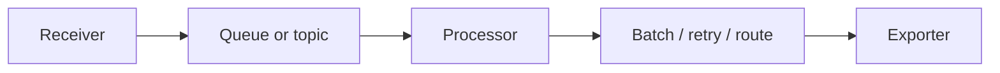
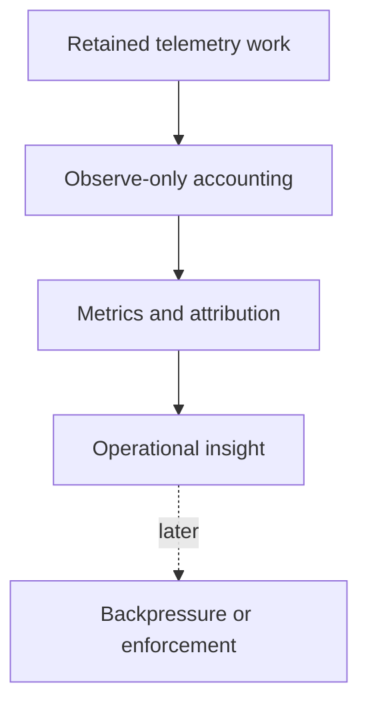
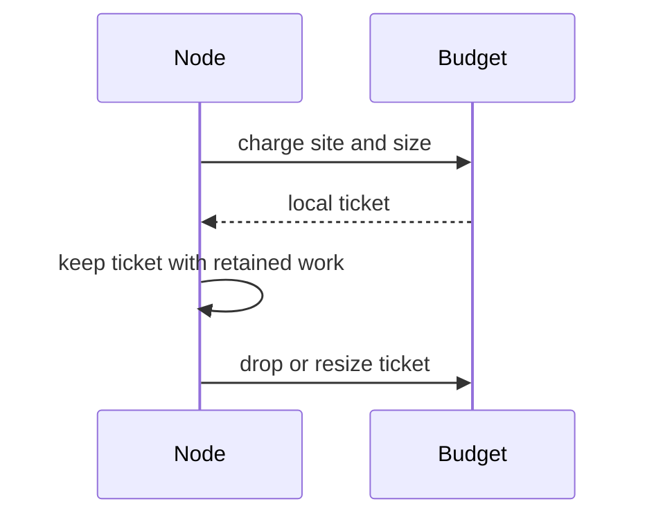
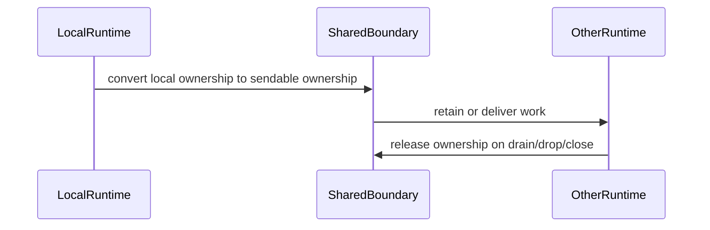

# Observe-Only Retained-Work Memory Accounting

This document describes the first level of retained-work memory accounting for
the OTAP dataflow engine: an observe-only layer that makes it possible to see
where admitted telemetry is waiting in memory and which component logically owns
that retained work.

This document deliberately stops before enforcement. The goal here is to agree
on the measurement model first.

## Summary

A telemetry pipeline holds admitted data in many places: receiver intake,
queues, batch buffers, retry buffers, routers, topics, and exporter requests
that are waiting to be sent or acknowledged. Any of these can hold a large share
of process memory at a given moment.

Process-level signals such as resident set size (RSS) or cgroup usage tell us
that the process is under pressure. They do not tell us *where* admitted
telemetry is waiting, or *who* is responsible for it. That gap is what
observe-only retained-work accounting is meant to close.

Observe-only accounting is designed to:

- attributes retained telemetry bytes to a runtime, a retention site, and a
  component,
- does this without changing how traffic flows,
- and provides the visibility layer that any later enforcement or tenant
  isolation work would build on.

It is a measurement layer, not a control layer.

## Why this exists

A pipeline can look healthy at the process level and still have a problem. RSS
might be stable while one queue, one exporter, or one retry buffer quietly holds
most of the retained work. When that happens, an operator with only a process
gauge has no way to find the hot spot.

The problem gets worse with more than one pipeline or tenant in a process. One
noisy source can push work into shared queues and topics and indirectly consume
memory that shows up as a single process number. Without attribution, every
source looks equally responsible.

Before anyone can safely isolate, reject, or backpressure a source, they need to
know who is actually holding memory and where. The first step is visibility, not
rejection. Get attribution right, validate it, and only then consider control.

## A minimal mental model

The OTAP dataflow engine moves telemetry through a small set of roles. A
reviewer does not need to know every internal type to follow this document.

- **Receivers** admit telemetry into the pipeline.
- **Processors** transform, batch, route, retry, or delay it.
- **Topics and shared boundaries** may retain work between runtimes or
  components.
- **Exporters** may hold encoded payloads or in-flight requests until a send
  completes.
- A **controller** starts and supervises pipelines, while **worker runtimes** do
  the actual data movement, usually one pinned runtime per core.

The key idea: once an item is admitted, it occupies memory somewhere in this
chain until it is delivered, dropped, or acknowledged. Retained-work accounting
is about naming that "somewhere".

## Diagrams

### Where work can be retained

Retained work may sit at any of these points after it has been admitted but
before it has been delivered, dropped, or acknowledged.

### Observe-only versus enforcement

Observe-only mode should not reject traffic. It should make later policy
decisions safer.

### Local ownership

### Shared-boundary ownership

## Core idea: retained work has an owner

The whole design rests on one rule: every admitted item that waits in memory has
exactly one logical owner.

The owner is whatever component is responsible for that retained work right now.
The owner holds the accounting for it and is responsible for releasing that
accounting when the work leaves memory, whether it is delivered, dropped, or
acknowledged.

Two shapes of ownership are enough to start:

- **Local ownership** for work that stays on one pinned runtime.
- **Shared ownership** for work that crosses into a shared queue, a topic, or
  another runtime.

The important property is that ownership travels *with* the data. The accounting
should not live in a side table that can drift out of sync with the payload it
is supposed to describe. If the data moves, its ownership moves with it. If the
data is dropped, its ownership is released. This is what keeps the numbers
honest.

## Ownership types

The concepts come first. Likely Rust shapes are named afterward, only to keep
the design concrete; the names matter less than the properties.

### Local retained ownership

Used when retained work stays on the same pinned runtime.

- It should be cheap and runtime-local.
- It should not require shared locks or atomics on every item.
- It is naturally not safe to send across threads, and that is fine: it never
  needs to.

In Rust terms this maps to a non-`Send` ticket held next to the retained data
(for example, a local memory ticket backed by runtime-local cell state).

### Shared retained ownership

Used when retained work crosses a `Send` boundary: a shared queue, a topic, or a
cross-runtime path.

- It must be safe to move between threads.
- It must release exactly once, on close, drain, failed send, eviction, or drop.

In Rust terms this maps to a sendable ownership handle (for example, an escrow
ticket) that represents the same retained bytes while they sit on the shared
boundary.

### Envelope-style ownership

A retained item can be carried as an envelope that holds the payload and its
ownership together. Bundling them is a simple way to make sure the data and its
accounting cannot diverge: you cannot move or drop one without the other.

### Abandoned ownership

If ownership is dropped without going through a normal release path, the bytes
should not silently disappear from the accounting. Instead, the drop should be
recorded as a visible diagnostic signal: an abandoned owner.

Abandoned ownership usually points at a terminal path that forgot to release, or
an error path that was not wired correctly. Keeping it visible (rather than
quietly forgiving it) is what lets reviewers find and fix those paths.

## What observe-only should measure

The goal is to answer "where is admitted work waiting, and who owns it" with a
small, low-cardinality set of dimensions.

<!-- markdownlint-disable MD013 -->
| Dimension | Purpose |
| --- | --- |
| Runtime retained bytes | Shows which worker or runtime is holding admitted work. |
| Retention site | Shows whether memory is in a queue, batcher, retry buffer, exporter, topic, or processor state. |
| Component identity | Connects retained work to the receiver, processor, topic, or exporter. |
| Shared-boundary ownership | Shows work retained outside a single runtime. |
| Unknown-size count | Shows where accounting could not estimate bytes precisely. |
| Abandoned ownership | Highlights possible leaks or incomplete terminal paths. |
<!-- markdownlint-enable MD013 -->

These dimensions are intentionally coarse. They are meant to point an operator at
the right runtime, the right kind of buffer, and the right component, not to
track individual items.

## Initial observe-only scope

Scope matters more than completeness here. A first level should cover the places
where retained work most commonly accumulates, and explicitly leave the rest for
later.

### In scope for the first level

- local retained work on pinned runtimes,
- topic or queue retained work,
- batch pending data,
- retry or delayed work,
- routed or parked work,
- exporter pending and in-flight requests,
- abandoned-ownership visibility,
- low-cardinality attribution by runtime, site, and component.

### Out of scope for the first level

- rejecting receiver traffic,
- enforcing tenant budgets,
- dropping buffered work to reclaim memory,
- changing retry or acknowledgement semantics,
- requiring every processor state machine to be fully attributed on day one.

Partial coverage is acceptable and expected. A site that cannot yet estimate its
size precisely should show up as unknown-size rather than be omitted, so the gaps
are visible too.

## Non-goals for the first level

To keep the first level reviewable, these are explicit non-goals:

- No traffic rejection.
- No tenant isolation enforcement.
- No policy tree for group, pipeline, or tenant budgets.
- No silent data dropping.
- No attempt to make every allocator byte match logical retained bytes.
- No high-cardinality labels.
- No invasive scheduler rewrite.

Logical retained bytes are not the same as allocator residency or RSS, and the
first level should not try to reconcile the two. It tracks what the pipeline
logically holds, which is a different and more actionable number than what the
allocator happens to keep resident.

## Safety invariants

This is the checklist a reviewer can hold the design against. Most review
attention should go here.

- A retained item has exactly one logical owner.
- The owner is created when the item is admitted or retained.
- Ownership moves with the payload, not in a separate table that can drift.
- Dropping the owner releases accounting exactly once.
- A failed send or failed conversion returns ownership or releases it exactly
  once.
- Resizing a charge either succeeds or leaves the original accounting intact.
- Shared or broadcast retention releases on close, drain, overwrite, eviction,
  or final drop.
- Cleanup paths (drop, drain, abort, shutdown) never acquire new budget.
- Observe-only mode does not reject, shed, or backpressure because of the
  retained-work budget.
- Labels are low-cardinality and do not allocate per item.

## Performance principles

The accounting has to be cheap enough to leave on in production.

- Local accounting should be runtime-local and cheap, so the common path is a
  small read and write on local state rather than a lock or an atomic.
- Shared synchronization should appear only at real shared boundaries, where
  work actually crosses runtimes, and not on every local item.
- Per-item string labels should be avoided. Attribution should be interned or
  encoded once, not formatted per item.
- Metric aggregation can happen at snapshot or flush points rather than on every
  item.
- The design should fit the current-thread, pinned-per-core runtime model rather
  than fight it.

## How this helps operators

The payoff is being able to make concrete statements instead of guesses:

- "The process is under pressure, and most retained work is in exporter
  in-flight requests."
- "A retry buffer is growing while receivers keep admitting."
- "One topic boundary is retaining much more work than the others."
- "Abandoned ownership is showing up, so a terminal path probably needs review."
- "Unknown-size counts are high here, so accounting quality needs to improve
  before we trust enforcement."

Each of these is something an operator can act on, and none of them require
changing traffic to learn.

## How this prepares for later enforcement

Enforcement is a separate step, and this document does not design it. It only
makes sure the measurement layer leaves enforcement on solid ground.

- Enforcement should be added only after ownership and release paths are
  trustworthy, which observe-only metrics help confirm.
- Observe-only numbers help choose limits that are safe rather than guessed.
- Rejection and backpressure belong at explicit admission points, not scattered
  through the pipeline.
- Shared boundaries need sendable ownership in place before they can be enforced.
- Tenant or pipeline isolation needs scoped attribution before any budget can be
  applied to it.

## Review guide

A suggested path through this design:

1. Review the mental model and make sure the pipeline shape reads correctly.
2. Review the ownership invariants in the safety-invariants checklist.
3. Review local versus shared ownership and where the boundary sits.
4. Review what the first-level scope includes and what it excludes.
5. Check that nothing in the design changes runtime behavior or traffic.
6. Keep enforcement and rollout policy separate until the measurement model is
   clear.

This document intentionally focuses on the observe-only measurement model. It
keeps enforcement, tenant isolation, and rollout policy out of scope so the
ownership and attribution model can be reviewed first.
