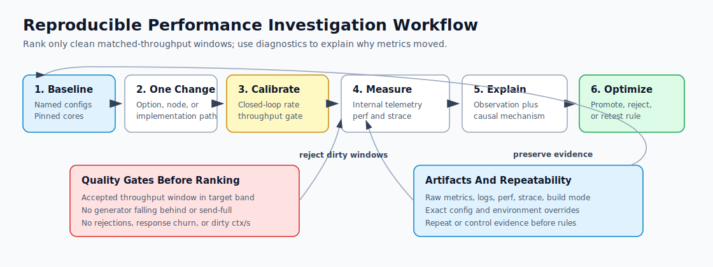
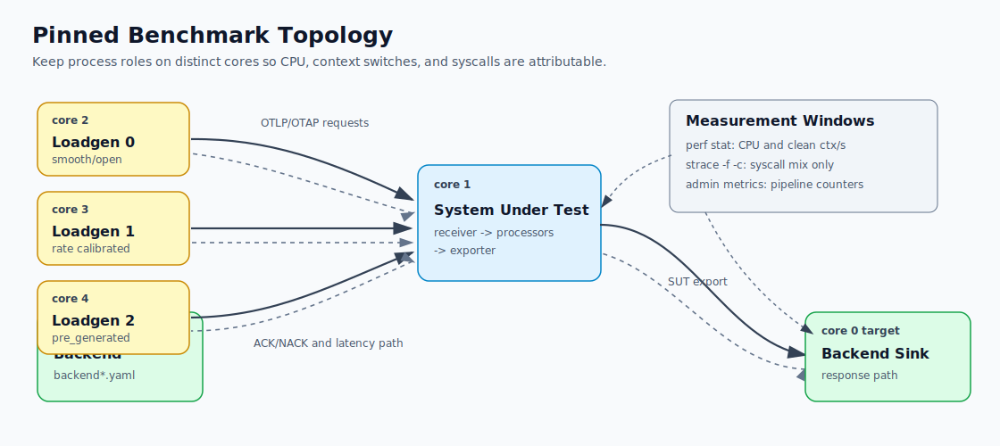
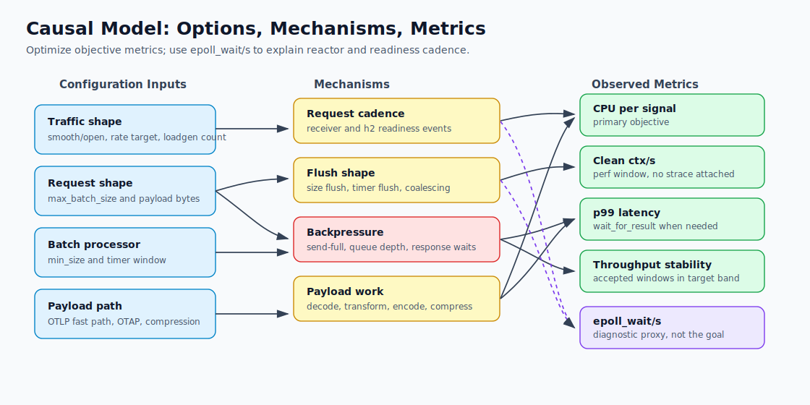
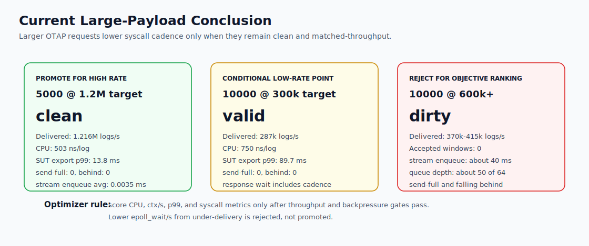

# Performance Experiment Log

This document tracks performance experiments for the OTAP dataflow engine.
The goal is to preserve enough context to explain observed regressions and to
turn repeated findings into rules for a future configuration and pipeline
optimizer.

## Overall Approach

The experiments in this log follow a causal-debugging workflow rather than a
simple benchmark leaderboard. The goal is to explain why a metric moved, then
decide whether that movement is useful for the real objective: lower CPU per
signal, lower clean context switches, bounded p99 latency, and stable matched
throughput. `epoll_wait/s` is treated as a diagnostic proxy for reactor
cadence, not as an objective by itself.

To reproduce the approach:

1. Start from a named baseline pipeline and pin each process to distinct CPU
   cores. Keep backend, SUT, and load generators on separate cores so CPU,
   context-switch, and syscall attribution are not dominated by process
   overlap.
2. Change one parameter, option, node, or implementation detail at a time.
   When more than one thing must change, state which effect is being isolated
   and add a control run.
3. Match delivered throughput before ranking candidates. Use closed-loop rate
   calibration to pick a starting loadgen rate, then gate each objective
   measurement window on observed delivered `logs/s` being inside the target
   tolerance band.
4. Classify benchmark quality before interpreting results. Reject or label
   windows with loadgen falling-behind warnings, send-full counters,
   rejections, response-path failures, saturated generator CPU, or zero
   accepted objective windows.
5. Collect both internal telemetry and external measurements. Internal metrics
   explain pipeline behavior and backpressure; `perf stat` gives clean CPU and
   context-switch rates; `strace -f -c` gives syscall mix. Do not use
   strace-attached context-switch counts for ranking.
6. Separate observation from causality. Record the raw metric movement first,
   then explain the likely mechanism using counters that connect the changed
   option to the observed CPU, latency, throughput, or wakeup behavior.
7. Convert repeated findings into optimizer rules. A result should only become
   a rule when the workload quality gates pass, the causal path is plausible,
   and repeat or control evidence rules out measurement artifacts.
8. Preserve artifacts and exact workload shape. Each experiment should name
   configs, traffic mode, rate target, core placement, build mode, relevant
   environment overrides, and the artifact directory containing raw metrics,
   logs, perf output, and strace output.

This structure is intentionally conservative. A candidate that lowers
`epoll_wait/s` by under-delivering traffic, becoming compute-bound, or adding
hidden latency is not considered an improvement. A candidate that raises
`epoll_wait/s` can still be a win if CPU per signal, clean `ctx/s`, p99, and
throughput stability improve.

## Visual Guide

The following diagrams summarize the investigation method, benchmark topology,
causal model, and current large-payload conclusion. They are intentionally
high-level; the experiment entries below contain the exact metrics and raw
artifact paths.









## How To Update

Add one entry per experiment. Keep raw command output in a separate artifact
when it is large, but copy the important rates and counts here.

Each entry should include:

- `Workload`: configs, traffic mode, signal rate, core placement, and build.
- `Change`: one option, node, or code path changed from the baseline.
- `Metrics`: internal telemetry plus external tool observations.
- `Causal interpretation`: why the changed parameter likely moved metrics.
- `Optimizer implication`: whether an optimizer should prefer, avoid, or
  conditionally test this option.

## Measurement Protocol

The current local benchmark uses five processes:

- Backend: `benchmark_configs/backend.yaml`, pinned to core `0`.
- SUT: a variant of `benchmark_configs/engine-attr.yaml`, pinned to core `1`.
- Load generators: three `benchmark_configs/loadgen.yaml` instances, one each
  pinned to cores `2`, `3`, and `4`.

The current smooth-load target is three load generator instances at
`70k` signals per second each. This produces about `210k` signals per second
total when the generator keeps up.

Important external metrics:

- `perf stat`: CPU utilization, context switches, cycles, instructions.
- `strace -f -c`: syscall mix, especially `epoll_wait`, `recvfrom`, `writev`.

Important internal metrics:

- OTLP receiver requests and request bytes.
- Batch processor consumed and produced batch counts.
- Attribute processor apply and rename counts.
- Exporter exported counts.
- Pipeline CPU time, context switches, Tokio park and unpark counts.
- Processor-local wakeup scheduler counters: inserted/replaced wakeups,
  cancel hits/misses, due pops, live slots, and capacity.
- OTLP gRPC exporter RPC duration, including p50/p90/p99 gauges for the latest
  telemetry interval.

For experiments that need externally visible request latency, the SUT receiver
is run with `wait_for_result: true`. In that mode the load generators' outbound
OTLP gRPC exporter latency includes the SUT receiver, batch processor,
attribute processor, SUT exporter, backend response, and ACK/NACK return path.
With `wait_for_result: false`, the same loadgen RPC metric mostly measures SUT
admission latency and must not be interpreted as full pipeline latency.

For E045 and later, the objective table uses CPU nanoseconds per delivered log
and clean context switches per wall-clock second. Older summary rows preserved
the earlier perf-rendered `ctx/s` convention; use same-experiment comparisons
for context-switch conclusions.

## Current Baseline

The SUT pipeline is:

```text
otlp receiver -> attributes processor -> otlp_grpc exporter
```

The current balanced workload uses OTLP/gRPC, `production_mode: smooth`, three
load generators, and `5000`-signal ingress request batches. The SUT batch
processor uses OTLP byte sizing with `min_size` below the typical incoming
request bytes so it normally emits one size-flushed batch per incoming request.

The most important baseline finding is that request cadence and payload path
both dominate performance. Smooth mode drives evenly spaced completions; open
mode lowers CPU/log and `epoll_wait/s` but increases clean `ctx/s` and p99.
The signal-only attributes rename must stay on the OTLP-preserving fast path to
sustain the current one-core throughput target.

## Experiment Summary

Rates are approximate. `epoll_wait/s`, `recvfrom/s`, and `writev/s` are derived
from `strace -f -c` sample windows.

Important measurement caveat: context-switch rates must be measured in a
separate window without `strace` attached. E037 showed that running
`perf stat` while `strace -f -c` is attached can inflate `context-switches` by
orders of magnitude because ptrace syscall tracing repeatedly stops and
resumes the traced process. Use such combined windows for syscall mix only,
not for `ctx/s`.

| ID | Change | CPU | ctx/s | epoll/s | recvfrom/s | writev/s |
| -- | ------ | --: | ----: | ------: | ---------: | -------: |
| E001 | No batch, no receiver coalesce | 0.709 | 2411 | 243 | n/a | n/a |
| E002 | Batch processor, 5 ms | 0.708 | 1587 | 49 | n/a | n/a |
| E003 | Receiver request coalesce, 5 ms | 0.700 | 1932 | 130 | n/a | n/a |
| E004 | Fast channel admission, no batch | 0.705 | 1488 | 256 | 16737 | 1225 |
| E005 | Fast admit + 5 ms batch | 0.712 | 1176 | 58 | 19362 | 908 |
| E006 | Fast admit + h2 frame 1 MiB | 0.697 | 747 | 1663 | 2029 | 2245 |
| E007 | Fast admit + batch + h2 1 MiB | 0.696 | 577 | 859 | 1438 | 1177 |
| E008 | Fast admit + batch + h2 64 KiB | 0.700 | 651 | 678 | 5581 | 1174 |
| E009 | Fast admit + batch + Nagle | 0.700 | 2070 | 57 | 15867 | 738 |
| E010 | 5 ms batch + no export comp | 0.630 | 1502 | 40 | 9047 | 4756 |
| E011 | 5 ms batch + gzip export | 0.710 | 1793 | 26 | 8137 | 376 |
| E012 | 5 ms batch + zstd export | 0.634 | 1693 | 266 | 9114 | 538 |
| E013 | 10 ms batch + no export comp | 0.602 | 2337 | 39 | 8991 | 4949 |
| E014 | 10 ms batch + gzip export | 0.764 | 756 | 26 | 8206 | 380 |
| E015 | 10 ms batch + zstd export | 0.609 | 1268 | 136 | 9069 | 407 |
| E016 | 20 ms batch + no export comp | 0.613 | 1345 | 49 | 9052 | 4934 |
| E017 | 20 ms batch + gzip export | 0.829 | 883 | 18 | 8327 | 367 |
| E018 | 20 ms batch + zstd export | 0.641 | 1191 | 92 | 9036 | 339 |
| E019 | CPU profile, 10 ms + no export comp | 0.619 | 2514 | 44 | 9064 | 4711 |
| E020 | CPU profile, 20 ms + zstd export | 0.638 | 2115 | 98 | 9079 | 348 |
| E021 | CPU profile, 20 ms + gzip export | 0.854 | 482 | 22 | 7998 | 372 |
| E022 | 20 ms + zstd, metrics on | 0.630 | 2526 | 107 | 9035 | 349 |
| E023 | E022 + exporter max_in_flight=1 | 0.638 | 2325 | 122 | 9062 | 361 |
| E024 | E022 + runtime metrics off | 0.637 | 2429 | 109 | 9064 | 351 |
| E025 | E022 + receiver max_concurrent=3 | 0.642 | 2149 | 114 | 9060 | 387 |
| E026 | E022 + receiver max_concurrent=1 | 0.563 | 1443 | 196 | 8966 | 453 |
| E027 | 3 loadgens, default event interval | 0.675 | 28485 | 100 | 9041 | 352 |
| E028 | E027 + Tokio event_interval=256 | 0.652 | 29501 | 107 | 9049 | 366 |
| E029 | E027 + Tokio event_interval=1024 | 0.652 | 29522 | 104 | 9022 | 369 |
| E030 | Custom incoming, default buffers | 0.668 | 28796 | 96 | 9022 | 357 |
| E031 | E030 + accepted recv buffer 4 MiB | 0.677 | 28671 | 159 | 9088 | 378 |
| E032 | E030 + accepted recv buffer 16 MiB | 0.674 | 28579 | 124 | 9070 | 351 |
| E033 | 3 loadgens, loadgen batch 500 | 0.647 | 29757 | 203 | 8888 | 423 |
| E034 | 3 loadgens, loadgen batch 1000 | 0.662 | 29079 | 105 | 9067 | 361 |
| E035 | 3 loadgens, loadgen batch 2000 | 0.668 | 28930 | 94 | 9170 | 310 |
| E036 | 3 loadgens, loadgen batch 5000 | 0.675 | 28371 | 80 | 9150 | 273 |
| E037 | Batch 5000 zstd, clean ctx | 0.651 | 653 | 61 | 9118 | 273 |
| E038 | Batch 5000 no comp, clean ctx | 0.612 | 769 | 61 | 9128 | 4650 |
| E039 | Prost OTLP rename fast path, zstd | 0.669 | 822 | 64 | 9094 | 249 |
| E040 | Prost OTLP rename fast path, no comp | 0.649 | 902 | 41 | 9054 | 4454 |
| E041 | Byte OTLP rename fast path, zstd | 0.520 | 519 | 153 | 9156 | 274 |
| E042 | Byte OTLP rename fast path, no comp | 0.533 | 464 | 86 | 9118 | 4636 |
| E043 | Async wait attribution, zstd | 0.527 | 572 | 188 | 9209 | 274 |
| E044 | Async wait attribution, no comp | 0.490 | 511 | 106 | 9138 | 4643 |
| E045 | WFR + 10 ms batch, no comp | 0.461 | 176 | 119 | 9193 | 4669 |
| E046 | WFR + 20 ms batch, no comp | 0.539 | 226 | 135 | 9132 | 4659 |
| E047 | WFR + 40 ms batch, no comp | 0.492 | 260 | 100 | 9182 | 4609 |
| E048 | WFR + 80 ms batch, no comp | 0.576 | 243 | 79 | 9171 | 4616 |
| E049 | WFR + 10 ms + 2MiB min | 0.459 | 183 | 132 | 9177 | 4675 |
| E050 | WFR + 10 ms + 4MiB min | 0.502 | 152 | 95 | 9152 | 4621 |
| E051 | WFR + 10 ms + 6MiB min | 0.479 | 214 | 136 | 9195 | 4682 |
| E052 | WFR + 15 ms + 2MiB min | 0.486 | 212 | 109 | 9135 | 4634 |
| E053 | WFR + 15 ms + 4MiB min | 0.485 | 215 | 141 | 9136 | 4654 |
| E054 | WFR + 15 ms + 6MiB min | 0.487 | 205 | 111 | 9194 | 4663 |
| E055 | WFR + 20 ms + 2MiB min | 0.534 | 216 | 87 | 9179 | 4639 |
| E056 | WFR + 20 ms + 4MiB min | 0.528 | 183 | 87 | 9145 | 4616 |
| E057 | WFR + 20 ms + 6MiB min | 0.524 | 165 | 79 | 9156 | 4650 |
| E058 | E057 + exporter multi-recv | 0.480 | 164 | 89 | 9185 | 4641 |
| E059 | Byte-size fix + 256KiB min | 0.415 | 96 | 122 | 9190 | 4699 |
| E060 | Byte-size fix + 512KiB min | 0.423 | 302 | 139 | 9194 | 4718 |
| E061 | Byte-size fix + 1MiB min | 0.473 | 150 | 145 | 9195 | 4718 |
| E062 | Byte-size fix + 2MiB min | 0.483 | 271 | 179 | 9182 | 4658 |
| E063 | Byte-size fix + 6MiB min | 0.546 | 226 | 97 | 9170 | 4644 |
| E064 | No batch control | 0.425 | 171 | 178 | 9197 | 4719 |
| E065 | Immediate batch control | 0.478 | 165 | 263 | 9207 | 4707 |
| E066 | Repeat 20 ms + 256KiB min | 0.435 | 217 | 130 | 9215 | 4705 |
| E067 | Repeat 20 ms + 512KiB min | 0.407 | 209 | 129 | 9148 | 4703 |
| E068 | Repeat 20 ms + 6MiB min | 0.505 | 232 | 95 | 9152 | 4642 |
| E069 | Timer-defer 20 ms + 256KiB | 0.405 | 248 | 155 | 9234 | 4705 |
| E070 | Timer-defer 20 ms + 512KiB | 0.416 | 138 | 135 | 9236 | 4694 |
| E071 | Timer-defer 20 ms + 6MiB | 0.533 | 223 | 83 | 9183 | 4600 |
| E072 | Timer-defer immediate batch | 0.421 | 103 | 113 | 9206 | 4720 |
| E073 | Scheduler metrics 20 ms + 512KiB | 0.460 | 199 | 157 | 9225 | 4725 |
| E074 | Scheduler metrics immediate batch | 0.448 | 252 | 119 | 9162 | 4701 |
| E075 | Scheduler metrics 20 ms + 6MiB | 0.523 | 254 | 179 | 9143 | 4631 |

`WFR` means `wait_for_result`.

## Findings

### E001: Smooth Load Without Downstream Batching

Workload: three smooth load generator instances at `70k` signals per second
each, SUT pinned to one core, no batch processor.

Observation: the SUT sustains the requested load, but context switches and
`epoll_wait` stay high. The attribute processor and exporter see one downstream
message per incoming request.

Causal interpretation: smooth mode removes burst-level natural coalescing.
The receiver, h2 stack, downstream channel, attribute processor, and exporter
are all activated at request cadence.

Optimizer implication: a single-core SUT receiving smooth OTLP/gRPC traffic
needs an explicit coalescing point downstream of ingress. Otherwise each
request drives too much scheduling work.

### E002: Add A 5 ms Batch Processor

Change: insert an OTLP-preserving batch processor between receiver and
attribute processor with `max_batch_duration: 5ms`.

Observation: `epoll_wait` drops from about `243/s` to about `49/s`, and context
switches drop from about `2411/s` to about `1587/s`. CPU is mostly unchanged.
Downstream processor/exporter batch rate falls from about `210/s` to about
`55-57/s`.

Causal interpretation: the batch processor changes the cadence seen by the
attribute processor and exporter. It does not remove receiver decode or network
work, so CPU is not expected to drop much, but it does reduce downstream
scheduler and reactor wakeups.

Optimizer implication: a short processor batch window is currently the best
known default response to smooth ingress. It improves wakeup metrics while
preserving request completion semantics.

### E003: Receiver-Side Request Coalescing

Change: receiver-side request coalescing with a 5 ms window.

Observation: context switches improved relative to no batching, but the result
was worse than the normal batch processor: `epoll_wait` was about `130/s`
instead of about `49/s`.

Causal interpretation: the gRPC/h2 receiver still wakes at ingress cadence, and
holding request responses in the receiver adds latency-sensitive coordination.
The mechanism attacks the symptom too early in the pipeline and is less
aligned with where most downstream wakeup reduction is needed.

Optimizer implication: do not pursue receiver-side coalescing as the primary
optimization. Prefer a processor-level batch/coalesce node unless a workload
requires changing request response semantics explicitly.

### E004: Fast Channel Admission Without Batching

Change: in the OTLP unary receiver, try the downstream send synchronously first
and fall back to the existing async send only when the channel is full.

Observation: context switches improve materially versus the no-batch baseline,
but `epoll_wait` does not improve. It remains around the same order as the
original no-batch run.

Causal interpretation: avoiding an await on the non-full channel path removes
some scheduler handoff overhead. It does not change ingress request cadence or
downstream message cardinality, so it cannot by itself fix reactor wakeups.

Optimizer implication: this is a good engine default candidate because it
preserves backpressure semantics and reduces scheduler churn. It should be
combined with batching for smooth workloads.

### E005: Fast Channel Admission Plus 5 ms Batch

Change: combine fast channel admission with the 5 ms batch processor.

Observation: this produced the best balanced result so far: context switches
around `1176/s`, `epoll_wait` around `58/s`, and sustained target throughput.
CPU remained around `0.71`.

Causal interpretation: fast admission reduces receiver-to-pipeline handoff
overhead, while the batch node reduces downstream wakeup cadence. The two
changes address different parts of the path.

Optimizer implication: this is the preferred current configuration pattern for
smooth high-rate OTLP/gRPC logs on a one-core SUT.

### E006-E008: Increase HTTP/2 Maximum Frame Size

Changes tested:

- No batch, `max_frame_size: 1MiB`.
- 5 ms batch, `max_frame_size: 1MiB`.
- 5 ms batch, `max_frame_size: 64KiB`.

Observation: larger frames reduced context switches and often reduced
`recvfrom`, but `epoll_wait` rose sharply. With batching, `epoll_wait` moved
from about `58/s` to hundreds per second.

Causal interpretation: frame sizing changes the transport read/write shape,
but it does not reduce request cadence. Larger frames can reduce some syscall
counts while making readiness and task wakeup behavior worse for this workload.

Optimizer implication: do not treat larger HTTP/2 frames as a general SUT
optimization. Only test this knob when the objective is specifically reducing
read syscall volume and `epoll_wait` is not the limiting metric.

### E009: Disable TCP_NODELAY On The SUT Receiver

Change: set SUT receiver `tcp_nodelay: false` with the 5 ms batch processor.

Observation: `epoll_wait` stayed low, but context switches rose to about
`2070/s`, worse than the batch-only and fast-admission-plus-batch results.

Causal interpretation: Nagle-style socket coalescing changes packet/response
timing, but it introduces waiting behavior and more scheduler churn in this
request/response workload.

Optimizer implication: keep `tcp_nodelay: true` as the default for this SUT.
An optimizer should not disable it unless it has a latency-tolerant workload
and direct evidence that context switches are not a problem.

### E010-E018: Batch Window And Exporter Compression Sweep

Change: sweep `max_batch_duration` across `5ms`, `10ms`, and `20ms`, crossed
with SUT-to-backend exporter compression set to no compression, gzip, and zstd.
The backend accepted `[zstd, gzip, deflate]` compressed requests. The load
generator still sent uncompressed OTLP/gRPC into the SUT.

Observation: no exporter failures were reported. Gzip produced the lowest
`writev` and `epoll_wait` rates, especially at longer batch windows, but had
the highest SUT CPU. No compression had the lowest CPU, but it produced about
`4.8k-4.9k` `writev/s`. Zstd was close to no compression on CPU and close to
gzip on `writev`, but `epoll_wait` was higher than both in this run.

Causal interpretation: compression is a clear CPU-vs-I/O tradeoff in the SUT
exporter path. Disabling compression avoids compressor work but pushes many
larger uncompressed writes through h2. Gzip reduces write pressure and reactor
wakeups, but the compressor dominates CPU as batch windows grow. Zstd appears
to be a middle ground for CPU and write volume, but its higher `epoll_wait`
suggests a different readiness cadence in the h2/socket path that needs a
repeat run and byte-level telemetry before promoting it as a default.

Optimizer implication: compression choice must be part of the optimizer cost
model. If the objective is SUT CPU, prefer no compression with a `10ms-20ms`
batch window. If the objective is context switches and `epoll_wait`, gzip with
a longer batch window is strongest but expensive. If network write volume is
also part of the objective, zstd is the most interesting next candidate, but it
needs more investigation because it did not reduce `epoll_wait` in this sweep.

### E019-E021: CPU Attribution For Compression Candidates

Change: profile three candidate configurations with
`perf record -e cycles:u -F 99`: `10ms` batch with no exporter compression,
`20ms` batch with zstd exporter compression, and `20ms` batch with gzip
exporter compression. The same run also captured `perf stat` and
`strace -f -c` for the SUT. Artifacts are in
`/tmp/otap-cpu-attribution-20260425-162909`.

Observation: the flat profiles show that `epoll_wait` is not a CPU consumer.
It is a symptom of wakeup cadence. User-space CPU is dominated by payload
conversion and compression:

- `10ms` + no compression: OTLP byte decode about `14.7%`, OTAP/OTLP encode
  helpers about `27.1%`, Arrow/dictionary access and builders about `19.8%`,
  libc copy/compare/set about `14.1%`, and transport/Tokio/h2 about `3.7%`.
- `20ms` + zstd: zstd about `17.7%`, OTLP byte decode about `10.7%`,
  OTAP/OTLP encode helpers about `23.8%`, Arrow/dictionary access and builders
  about `15.5%`, and libc copy/compare/set about `16.5%`.
- `20ms` + gzip: zlib/gzip about `46.2%`, OTLP byte decode about `8.5%`,
  OTAP/OTLP encode helpers about `13.9%`, Arrow/dictionary access and builders
  about `9.4%`, and libc copy/compare/set about `9.0%`.

The groups above are approximate and not perfectly disjoint because generic
Rust symbols can appear in multiple logical stages.

Causal interpretation: no compression leaves the SUT CPU mostly in
OTLP-to-OTAP and OTAP-to-OTLP conversion work, while producing many more
transport writes. Zstd adds a moderate compression cost but cuts `writev` by
more than an order of magnitude compared with no compression. Gzip cuts write
and wakeup pressure too, but the compressor becomes the largest CPU consumer by
a wide margin. The gzip run also produced load-generator falling-behind
warnings, so its low context-switch and `epoll_wait` rates should be treated as
partly caused by the SUT becoming compute-bound, not as a free win.

The observed zstd result is likely a middle-regime effect rather than a direct
zstd-to-context-switch causality. Zstd makes exporter writes much smaller, but
it does not keep the worker busy for as long as gzip. The SUT can therefore
return to the h2/socket readiness path more often than in the gzip run. In that
regime, `epoll_wait/s` can rise even though `writev/s` and output bytes fall.
Gzip shows the opposite failure mode: it parks less often partly because it is
spending much more time compressing.

The current causal hypothesis is:

```text
zstd: moderate CPU + much smaller writes
  -> exporter reaches socket readiness and response awaits more often
  -> more Tokio park/unpark cycles
  -> higher epoll_wait/s than gzip

gzip: high CPU compression cost
  -> worker stays compute-bound longer
  -> fewer opportunities to park
  -> lower epoll_wait/s, but higher CPU and lower headroom
```

Optimizer implication: syscall metrics and CPU attribution must be evaluated
together. An optimizer should not choose gzip solely because it minimizes
`epoll_wait`; it must check CPU headroom and delivered throughput. For this
workload, zstd remains the better compression candidate when write volume
matters, while no compression remains best when SUT CPU is the primary
objective. The next implementation-level optimization target is the
OTLP/OTAP conversion path: reduce repeated byte scanning, dictionary building,
copying, and re-encoding for OTLP-in/OTLP-out pipelines.

### E022-E024: Event-Loop Attribution And Telemetry Controls

Change: use the `20ms` batch plus zstd configuration as the event-loop
baseline, then test exporter `max_in_flight=1` and disabling internal runtime
metrics. Artifacts are in `/tmp/otap-epoll-sweep-20260425-172420`.

Observation: `strace` attached per thread showed that `epoll_wait` is dominated
by the pipeline thread, not the admin or metrics threads. In E022 the pipeline
thread issued `1362` `epoll_wait` calls in the per-thread sample; the metrics
aggregator issued `17`, engine metrics `12`, admin `1`, and observed-state `1`.
The pipeline-thread calls were mostly immediate I/O-driver polls:
`804` had timeout `0` and `558` had a positive timeout. Disabling internal
runtime metrics in E024 did not materially change aggregate `epoll_wait`
(`107/s` to `109/s`) or context switches.

Causal interpretation: the suspicious `epoll_wait` rate is not caused by the
admin server or internal metrics collection. It is produced by the main
pipeline runtime while h2/socket tasks remain active. The many timeout-0 polls
look like Tokio checking the I/O driver while work is still ready, not the
thread spending most of its time asleep.

Optimizer implication: disabling observability is not a useful optimization
for this issue. Optimizer rules should treat high `epoll_wait/s` here as a
pipeline event-loop cadence symptom, and should look at ingress request cadence
and transport readiness shape before trimming metrics.

### E025-E026: Receiver Concurrency Limits

Change: keep `20ms` batch plus zstd and vary receiver
`max_concurrent_requests`.

Observation: `max_concurrent_requests=3` modestly reduced context switches and
Tokio park/unpark counts, but did not reduce `epoll_wait`; aggregate
`epoll_wait` was about `114/s`, and the pipeline thread had more timeout-0
polls than the baseline. `max_concurrent_requests=1` reduced CPU and context
switches only by throttling the workload: load generators produced repeated
`resource_exhausted` errors, and aggregate `epoll_wait` rose to about `196/s`.

Causal interpretation: lowering receiver concurrency can reduce runnable work,
but if set too low it changes the workload by rejecting or delaying requests.
The invalid `1`-request case is lower load, not a real SUT efficiency gain.

Optimizer implication: receiver concurrency should be a guardrail/backpressure
knob, not the primary `epoll_wait` reduction mechanism. An optimizer must
reject configurations that improve CPU or context switches by causing loadgen
errors, request rejection, or lower delivered throughput.

### E027-E029: Tokio Current-Thread Event Interval

Change: add a temporary runtime-builder override for
`tokio::runtime::Builder::event_interval` and sweep the default, `256`, and
`1024` with three distinct load generator processes pinned to cores `2-4`.
Artifacts are in `/tmp/otap-epoll-event-20260425-183329`.

Observation: increasing `event_interval` lowered Tokio park/unpark counters but
did not lower context switches or `epoll_wait`. Internal park deltas over the
measurement window were `1122`, `1080`, and `850` for default, `256`, and
`1024`. Aggregate `epoll_wait` was about `100/s`, `107/s`, and `104/s`.
Pipeline-thread timeout-0 `epoll_wait` calls increased from `777` to `877` and
`954`.

Causal interpretation: the default periodic I/O check interval is not the
dominant cause of the external syscall rate. A higher interval can make the
runtime park less often, but the h2/socket tasks still reach readiness polls at
the same overall cadence. The increased timeout-0 count suggests work is being
bunched differently, not eliminated.

Optimizer implication: do not expose `event_interval` as a primary optimizer
knob for this workload. It may be worth retaining as a diagnostic or advanced
runtime policy knob if latency measurements show a useful tradeoff, but it did
not solve the combined CPU/context-switch/`epoll_wait` objective.

### E030-E032: Accepted Socket Receive Buffer Size

Change: temporarily replace tonic's `TcpIncoming` with an equivalent local
incoming stream so accepted gRPC sockets could receive experimental receive
buffer sizes via environment variable. Sweep default, `4MiB`, and `16MiB`
receive buffers. Artifacts are in `/tmp/otap-epoll-event-20260425-190743`.

Observation: larger accepted receive buffers did not reduce context switches or
`recvfrom`; `recvfrom` stayed near `9k/s`. `epoll_wait` got worse: about
`96/s` for default socket buffers, `159/s` for `4MiB`, and `124/s` for
`16MiB`. Tokio park deltas also rose from `985` to `1551` and `1377`.
No SUT or loadgen warnings were reported.

Causal interpretation: receive-buffer capacity is not the limiting factor for
this smooth local workload. Increasing the kernel queue does not change the
number of h2 request completions or the application read cadence. It may even
allow the transport to stay readable more often, increasing readiness polling
without improving useful throughput.

Optimizer implication: do not tune accepted socket receive buffer size for this
objective. A more direct readiness-coalescing option such as `SO_RCVLOWAT`
would be a better conceptual experiment, but it needs careful treatment because
HTTP/2 control frames are small and delayed readability can hurt handshake,
flow-control, and tail latency.

### E033-E036: Ingress Request Shape

Change: keep the SUT fixed at `20ms` downstream batch window, zstd exporter
compression, `max_in_flight=5`, and `max_concurrent_requests=100`. Keep three
smooth load generators pinned to cores `2-4` at `70k` signals per second each,
but sweep load generator `max_batch_size` across `500`, `1000`, `2000`, and
`5000`. Artifacts are in `/tmp/otap-request-shape-20260425-193619`.

Observation: delivered signal volume stayed about `210k/s` in all four cases,
but SUT request starts followed batch size: about `420/s`, `210/s`, `105/s`,
and `42/s`. Aggregate `epoll_wait` fell from about `203/s` at batch `500` to
about `80/s` at batch `5000`. The pipeline thread showed the same trend in the
per-thread trace: `2763`, `1339`, `961`, and `958` `epoll_wait` calls during
the sample. Tokio park/unpark also fell overall, from about `118` parks/s and
`235` unparks/s at batch `500` to about `62` parks/s and `124` unparks/s at
batch `5000`.

CPU did not improve materially. CPU moved from about `0.65` to `0.68` CPUs.
The `ctx/s` values for E033-E036 were later shown to be measurement artifacts
because that harness ran `perf stat` while `strace` was attached. Use these
rows for request, `epoll_wait`, `recvfrom`, and `writev` trends, not for true
context-switch rates. `recvfrom` stayed near `9k/s`, which is consistent with
the same inbound byte volume being read from the same local gRPC transport
even as request count changed.

Causal interpretation: ingress request size is a direct control on
request-completion cadence. Larger loadgen batches reduce the number of unary
gRPC requests the SUT must accept, complete, and wake around, so
`epoll_wait`, timeout-0 polls, and Tokio park/unpark activity fall. This does
not remove the fixed per-byte decode/convert/export cost.

Optimizer implication: treat upstream request cadence as a first-class
optimizer parameter. If latency and memory budgets allow it, prefer larger
upstream/exporter batches before attempting low-level runtime or socket
tuning. For this workload, moving from `1000` to `2000` or `5000` records per
loadgen request reduces reactor wakeups, but it should be accepted only with
latency measurements because it changes ingress request granularity.

### E037-E038: Scheduler Attribution Without Strace Interference

Change: keep three smooth load generators at `70k` signals per second each and
`max_batch_size=5000`, then measure scheduler behavior in a window without
`strace` attached. Compare zstd exporter compression with no exporter
compression. `perf sched` could not be used because sched tracepoints were not
readable from tracefs, so this experiment used `pidstat -w -t`, per-thread
`/proc/<pid>/task/<tid>/status` deltas, process and pipeline-thread
`perf stat`, and sampled `context-switches` stacks. A separate `strace` window
captured syscall mix. Artifacts are in
`/tmp/otap-sched-attribution-20260425-195318`.

Observation: the true SUT context-switch rate is hundreds per second, not tens
of thousands. With zstd, process `perf stat` reported about `653 ctx/s`; the
pipeline thread alone reported about `608 ctx/s`. With no exporter
compression, the process reported about `769 ctx/s`; the pipeline thread alone
reported about `719 ctx/s`. The `/proc` and `pidstat` views agreed on
attribution: the `pipeline-default` thread dominates context switches, the
metrics aggregator contributes only about `30-34/s`, and admin/observed-state
threads are effectively idle.

Sampled context-switch stacks also pointed to the pipeline thread. About
`94-95%` of samples were on `pipeline-default`, mostly under
`epoll_wait -> mio::poll::Poll::poll`, with a smaller path through
`mio::sys::unix::waker::Waker::wake`. The metrics aggregator's small share was
mostly blocked in `flume::Shared<T>::recv`.

The separate syscall window showed similar `epoll_wait` for zstd and no
compression, about `61/s` in both cases. `recvfrom` stayed near `9.1k/s`.
Exporter `writev` was the differentiator: zstd was about `273/s`, while no
compression was about `4650/s`. No real SUT or load-generator warnings were
found.

Causal interpretation: the previous `28k-30k ctx/s` readings from E027-E036
were caused by the measurement method, not the SUT. Running `strace -f -c`
under ptrace while also counting context switches with `perf stat` creates
stop/resume scheduling activity around traced syscalls. When measured without
strace, real context switching is concentrated in the pipeline runtime parking
and waking around the Tokio/mio reactor, plus a small metrics-channel receive
component. Exporter compression is not the source of the remaining
context-switch rate; disabling compression slightly increased context switches
and massively increased write syscalls.

Optimizer implication: do not optimize against context-switch measurements
taken while `strace` is attached. The optimizer should collect syscall mix and
context switches in separate windows. For this workload, the context-switch
rate is no longer the primary bottleneck; focus should move back to reactor
wakeup cadence (`epoll_wait`/Tokio park-unpark) and user-space CPU in payload
conversion, compression, and export encoding.

### E039-E042: OTLP-Preserving Attribute Rename Fast Paths

Change: keep the clean scheduler-attribution harness from E037-E038 and
replace the attribute processor's generic OTLP-to-OTAP-to-OTLP path for the
benchmarked action. Two implementation strategies were tested:

- E039-E040 used a narrow prost path: decode `ExportLogsServiceRequest`, rename
  signal-level log attributes, then re-encode OTLP bytes.
- E041-E042 used a narrower byte-level protobuf rewrite: scan only
  `resource_logs -> scope_logs -> log_records -> attributes -> key`, rewrite
  matching `KeyValue.key` fields, and update enclosing length prefixes.

Artifacts:

- Prost attempt: `/tmp/otap-sched-attribution-20260425-201911`.
- Byte-level rewrite: `/tmp/otap-sched-attribution-20260425-202723`.

Observation: the prost path was not an improvement. With zstd it used about
`0.669` CPUs and `822 ctx/s`; with no compression it used about `0.649` CPUs
and `902 ctx/s`. This is slightly worse than the generic path measured in
E037-E038. It preserved the OTLP-byte output shape but still materialized and
re-encoded the full logs request.

The byte-level rewrite was a real CPU and scheduler improvement. With zstd,
CPU fell from `0.651` to `0.520` CPUs and clean context switches fell from
`653/s` to `519/s`. With no compression, CPU fell from `0.612` to `0.533` CPUs
and clean context switches fell from `769/s` to `464/s`. The pipeline thread
remained the dominant context-switch source, but its rate fell from about
`608/s` to `466/s` with zstd, and from about `719/s` to `410/s` with no
compression.

`epoll_wait/s` did not improve. It rose from about `61/s` to `153/s` with zstd
and from about `61/s` to `86/s` with no compression. Tokio park/unpark counters
still improved compared with the prost attempt, and clean context switches
improved compared with the generic path. This reinforces that `epoll_wait/s`
is a cadence signal, not a direct CPU-cost signal. Making the user-space
attribute work much cheaper can let the current-thread runtime return to the
I/O driver more often. That can raise `epoll_wait/s` while lowering CPU and
actual scheduler context switches.

Causal interpretation: for this pipeline, the expensive part of the attribute
node is not the logical rename operation; it is broad payload conversion and
copy-heavy re-encoding. Full prost decode/re-encode does not remove enough of
that work. A byte-level rewrite avoids Arrow conversion, object graph
materialization, dictionary work, and full request re-encoding. The remaining
reactor activity is mostly the transport staying active around request and
export readiness.

Optimizer implication: the optimizer should understand operation capabilities,
not just node names. A signal-level log attribute rename on OTLP-in/OTLP-out
traffic can use an OTLP-preserving byte transform. More complex attribute
operations should fall back to the generic OTAP/Arrow path. `epoll_wait/s`
must not be the sole acceptance metric for this class of change; CPU, clean
`ctx/s`, delivered throughput, and correctness of output payload shape are the
primary gate.

### E043-E044: Async Wait Attribution

Change: keep the E041-E042 byte-level attribute fast path and add diagnostic
engine telemetry for async waits:

- `channel.sender send.await.duration` when a send starts on a full channel.
- `channel.receiver recv.await.duration` when a receive starts on an empty
  channel.
- `otlp.exporter.grpc.async` waits for exporter in-flight completion,
  exporter inbox receive, and full-in-flight backpressure.

Artifacts are in `/tmp/otap-sched-attribution-20260425-222457`.

Observation: the run sustained the same workload shape with no SUT or loadgen
warnings. Zstd measured about `0.527` CPUs and `572 ctx/s` at process scope;
the pipeline thread alone was about `520 ctx/s`. No compression measured about
`0.490` CPUs and `511 ctx/s` at process scope; the pipeline thread alone was
about `437 ctx/s`.

The new wait telemetry showed no async send waits in either case. That means
the bounded engine channels were not full and downstream channel backpressure
was not the source of parks.

The receive and exporter wait counts did line up with pipeline cadence:

- Zstd: receiver-to-batch receive waits were `534` over the sample window
  (`~44.5/s`), batch-to-attr waits were `291` (`~24.3/s`),
  attr-to-exporter waits were `292` (`~24.3/s`), and exporter gRPC completion
  waits were `294` (`~24.5/s`). Exporter `inflight.full` waits were `0`.
- No compression: receiver-to-batch receive waits were `538` (`~44.8/s`),
  batch-to-attr waits were `304` (`~25.3/s`), attr-to-exporter waits were
  `305` (`~25.4/s`), and exporter gRPC completion waits were `305`
  (`~25.4/s`). Exporter `inflight.full` waits were `0`.

Batch metrics confirmed the downstream cadence: timer flushes matched
downstream produced batches (`293` zstd and `305` no compression in the
measurement delta), with no size-triggered flushes.

The separate syscall window still showed the pipeline runtime issuing many
`epoll_wait` calls: about `188/s` for zstd and `106/s` for no compression.
The sampled context-switch stacks again pointed mostly to
`pipeline-default -> epoll_wait -> mio::poll::Poll::poll`, with a smaller
metrics-aggregator contribution blocked in `flume::Shared<T>::recv`.

Causal interpretation: the remaining `epoll_wait` and park/unpark activity is
not caused by downstream channel saturation. It is caused by the current-thread
runtime reaching idle points between three recurring wakeup sources:

- ingress request delivery into the batch processor, still about `45/s`;
- batch timer flushes and downstream node receives, about `24-25/s`;
- exporter h2/gRPC completion readiness, also about `24-25/s`.

The exporter `max_in_flight=5` limit was not binding in this workload because
`inflight.full` wait count stayed at zero. Increasing `max_in_flight` is
therefore unlikely to reduce parks here.

Optimizer implication: a future optimizer should treat channel send-wait
metrics as a backpressure detector. If send waits are zero, channel capacity
or max-in-flight tuning is not the first lever. For this workload, the useful
levers remain cadence shaping: ingress batch size, batch timer/min-size policy,
and transport/export completion coalescing. To further identify `epoll_wait`
causality, add native telemetry for timer wakeups and Tokio/mio poll reasons,
not more channel capacity sweeps.

`epoll_wait/s` should not be treated as the top-level optimization goal. It is
a useful diagnostic for reactor cadence, but it can move in the opposite
direction from useful efficiency. E041-E042 lowered CPU and clean context
switches while raising `epoll_wait/s`, because the faster user-space path let
the runtime reach the I/O driver more often. Conversely, gzip showed lower
`epoll_wait/s` partly by spending much more CPU in compression. A configuration
or code change should be considered better only when lower `epoll_wait/s`
comes with stable throughput and improved CPU, clean `ctx/s`, or latency.

The practical target is therefore not "minimize `epoll_wait`". It is:

```text
minimize CPU per signal and clean context switches
while maintaining delivered throughput and latency budget,
using epoll_wait/s as attribution evidence for wakeup cadence.
```

### E045-E048: P99-Aware Batch Window Sweep

Change: add exporter-side RPC latency telemetry and run the SUT receiver with
`wait_for_result: true` so the load generators' OTLP gRPC export latency
measures visible request completion through the SUT pipeline. Keep three smooth
load generators at `70k` signals per second each, `max_batch_size=5000`, no
SUT exporter compression, byte-level attribute rename fast path, and
`min_size=10485760` bytes. Sweep SUT batch windows across `10ms`, `20ms`,
`40ms`, and `80ms`. Artifacts are in
`/tmp/otap-objective-sweep-20260425-230235`.

Objective summary:

| ID | Window | CPU ns/log | ctx/s | p99 avg | p99 max | logs/s | epoll/s |
| -- | -----: | ---------: | ----: | ------: | ------: | -----: | ------: |
| E045 | 10 ms | 2027 | 176 | 75 | 311 | 227500 | 119 |
| E046 | 20 ms | 2371 | 226 | 71 | 97 | 227500 | 135 |
| E047 | 40 ms | 2169 | 260 | 108 | 355 | 227083 | 100 |
| E048 | 80 ms | 2550 | 243 | 278 | 500 | 225833 | 79 |

All four cases completed without rejected requests or real warning/error
signals. The workload delivered about `226k-228k` logs/s, slightly above the
nominal `210k` target because the smooth generator rounds to whole production
batches. `recvfrom/s` stayed near `9.1k`; no-compression `writev/s` stayed near
`4.6k`, so the sweep mostly changed downstream timer/export cadence, not
inbound byte volume.

Observation: the longest batch window minimized `epoll_wait/s`, but it was the
worst objective result because p99 latency degraded sharply. `80ms` batching
dropped `epoll_wait` to about `79/s`, but loadgen RPC p99 averaged about
`278ms` and peaked around `500ms`. `40ms` was also dominated: lower `epoll`
than `20ms`, but worse CPU, context switches, and tail latency. The useful
tradeoff is between `10ms` and `20ms`: `10ms` had the best CPU per log and
lowest clean context switches, while `20ms` had the most stable tail latency
with p99 max below `100ms` in this run.

Causal interpretation: once external request completion is part of the
objective, longer timer-driven batching directly increases the time requests
wait for a timer flush and can create phase-alignment spikes across the three
load generators. This validates the earlier conclusion that `epoll_wait/s` is
a diagnostic proxy only: lowering reactor parks by waiting longer is not an
optimization when it worsens p99 and does not reduce CPU per signal. The
`20ms` result looks like the best latency-stability point in this run because
it flushes less often than `10ms` but avoids the large timer-hold spikes seen
at `40ms` and `80ms`.

Optimizer implication: include `wait_for_result`/request-latency mode in the
measurement profile and reject configurations that improve `epoll_wait` by
consuming latency budget. For this workload, the optimizer should keep `10ms`
and `20ms` on the candidate frontier, prefer `20ms` when p99 max stability is
strict, and avoid `40ms+` unless the latency budget is much looser. The next
useful sweep is around this frontier: repeat `10ms` and `20ms`, then test
intermediate windows such as `12ms`, `15ms`, and `18ms`, optionally with a
size-trigger threshold low enough to cap tail latency when ingress happens to
arrive in phase.

### E049-E057: Hybrid Batch Window And Min-Size Sweep

Change: keep the E045-E048 p99-aware workload and no-compression SUT exporter,
but sweep batch windows `10ms`, `15ms`, and `20ms` with `min_size` set to
`2MiB`, `4MiB`, and `6MiB`. The intended design was a hybrid policy: timer
flush for steady cadence, plus size flush as a guardrail when enough payload
accumulates before the timer fires. Artifacts are in
`/tmp/otap-hybrid-batch-sweep-20260425-232234`.

Objective summary:

| ID | Win | Min | CPU/log | ctx/s | p99a | p99m | logs/s | epoll/s |
| -- | --: | --: | ------: | ----: | ---: | ---: | -----: | ------: |
| E049 | 10 ms | 2MiB | 2249 | 183 | 26 | 28 | 204167 | 132 |
| E050 | 10 ms | 4MiB | 2209 | 152 | 88 | 318 | 227500 | 95 |
| E051 | 10 ms | 6MiB | 2281 | 214 | 88 | 327 | 210000 | 136 |
| E052 | 15 ms | 2MiB | 2136 | 212 | 52 | 306 | 227500 | 109 |
| E053 | 15 ms | 4MiB | 2133 | 215 | 71 | 384 | 227500 | 141 |
| E054 | 15 ms | 6MiB | 2143 | 205 | 68 | 404 | 227500 | 111 |
| E055 | 20 ms | 2MiB | 2544 | 216 | 69 | 81 | 210000 | 87 |
| E056 | 20 ms | 4MiB | 2514 | 183 | 80 | 331 | 210000 | 87 |
| E057 | 20 ms | 6MiB | 2305 | 165 | 75 | 83 | 227500 | 79 |

`p99a` and `p99m` are average and maximum observed loadgen RPC p99 in ms.

Observation: the size-trigger part of the intended hybrid policy did not
engage. Every case had `batch_flushes_size=0`; all observed batch flushes were
timer flushes. This means the `2MiB`, `4MiB`, and `6MiB` settings cannot be
credited as successful size-trigger caps for this workload. The sweep still
found an interesting operating point: E057 (`20ms`, `6MiB`) sustained full
throughput, had low clean context switches, kept p99 max near `83ms`, and
matched the best observed `epoll_wait` rate at about `79/s`.

Relative to E046 (`20ms`, `10MiB`), E057 improved CPU per delivered log
(`2305` vs `2371` ns/log), clean context switches (`165/s` vs `226/s`), p99 max
(`83ms` vs `97ms`), and `epoll_wait` (`79/s` vs `135/s`) while keeping the same
delivered throughput. Relative to E045 (`10ms`, `10MiB`), E057 used more CPU
per log (`2305` vs `2027` ns/log), but had slightly lower clean context
switches, far better p99 max (`83ms` vs `311ms`), and lower `epoll_wait`.

Causal interpretation: the intended size-threshold causal path was not active.
E059 later identified the concrete implementation cause: the processor accepted
OTLP `min_size` as bytes, but the flush decision compared that byte threshold
against pending item count. With loadgen batches around `5000` log records, byte
thresholds in the millions could never trigger before the timer fired. The
measured improvements in E057 are therefore best treated as a timer-cadence
operating point and run-to-run phase result, not as evidence that the `6MiB`
size cap improved p99 or `epoll_wait`.

Optimizer implication: never credit a `min_size` setting unless the batch
processor reports non-zero size-triggered flushes, or unless pending-size
telemetry proves that the threshold is active. E057 remains useful as a
timer-driven comparison point, but it is superseded as a size-threshold
candidate by the byte-size fix and E059-E063 sweep.

### E058: Exporter Inbox Multi-Recv

Change: add bounded multi-recv support to the local channel APIs and receiver
wrappers, then use it in the OTLP gRPC exporter as an opportunistic drain. The
exporter drains only when it has spare `max_in_flight` capacity, no pending
control is visible in the inbox, and the bounded drain budget allows it. The
benchmark uses the E057 configuration: `20ms` batch window, `6MiB` OTLP
`min_size`, no SUT exporter compression, `wait_for_result=true`, three smooth
load generators at `70k` signals/s each, and loadgen batch size `5000`.
Artifacts are in `/tmp/otap-multirecv-sweep-20260425-235012`.

Objective summary:

| ID | CPU/log | ctx/s | p99 avg | p99 max | logs/s | epoll/s | drains |
| -- | ------: | ----: | ------: | ------: | -----: | ------: | -----: |
| E058 | 2291 | 164 | 96 | 360 | 209583 | 89 | 0 |

Observation: the exporter multi-recv path did not activate. The new exporter
metrics reported `inbox.recv.drain.count=0` and
`inbox.recv.drain.messages=0`. The run had no warnings or rejected requests,
but it delivered about `209.6k` logs/s rather than the `227.5k` seen in E057,
and the observed p99 max spiked to about `360ms`. Because the drain counters
were zero, those differences cannot be attributed to multi-recv behavior.

Causal interpretation: the exporter input channel was not accumulating multiple
ready `pdata` messages at the moments the exporter had spare in-flight
capacity. The exporter still mostly alternated between ordinary completion
waits and low-rate receives. In this pipeline shape, after the batch processor
the exporter sees only about a few dozen batches per second, so receive-side
channel draining at the exporter is not on the hot causal path for
`epoll_wait`, clean context switches, or p99 latency.

Optimizer implication: keep the bounded multi-recv primitive and its drain
counters as infrastructure, but do not expect exporter-side multi-recv to
improve this workload unless drain counters become non-zero. For this SUT, the
next multi-recv-style experiments should target places with demonstrated
backlog or repeated ready work: runtime completion/control dispatch, batch
processor input with an explicit admission-safe burst contract, or transport
read-drain behavior. The optimizer should only credit multi-recv when the
candidate reports non-zero drain depth and improves CPU/log, clean `ctx/s`,
p99, or throughput stability.

### E059-E063: Byte-Aware OTLP Min-Size Fix

Change: fix the batch processor size-flush predicate so OTLP `min_size` uses
pending bytes instead of pending item count. Add flush telemetry for pending
requests, pending items, pending bytes, flush age, timer lateness, output
batches, output items, and output bytes. Then repeat a `20ms` no-compression
SUT sweep with byte thresholds `256KiB`, `512KiB`, `1MiB`, `2MiB`, and `6MiB`.
The workload keeps `wait_for_result=true`, three smooth load generators at
`70k` signals/s each, and loadgen request size `5000` log records. Artifacts
are in `/tmp/otap-byte-minsize-sweep-20260426-001041`.

Objective summary:

| ID | Min | CPU/log | ctx/s | p99a | p99m | logs/s | epoll/s |
| -- | --: | ------: | ----: | ---: | ---: | -----: | ------: |
| E059 | 256KiB | 1826 | 96 | 67 | 303 | 227500 | 122 |
| E060 | 512KiB | 1858 | 302 | 49 | 290 | 227917 | 139 |
| E061 | 1MiB | 2252 | 150 | 77 | 311 | 210000 | 145 |
| E062 | 2MiB | 2300 | 271 | 66 | 474 | 210000 | 179 |
| E063 | 6MiB | 2400 | 226 | 77 | 154 | 227500 | 97 |

Flush-shape summary:

| ID | Size flush | Timer flush | Pending req | Pending bytes | Age ms |
| -- | ---------: | ----------: | ----------: | ------------: | -----: |
| E059 | 546 | 0 | 1.0 | 1.70MiB | 0.004 |
| E060 | 547 | 0 | 1.0 | 1.70MiB | 0.004 |
| E061 | 504 | 0 | 1.0 | 1.70MiB | 0.004 |
| E062 | 168 | 168 | 1.5 | 2.55MiB | 14.955 |
| E063 | 1 | 182 | 3.0 | 5.07MiB | 21.101 |

Observation: the fix made the causal surface visible. Thresholds below the
per-request OTLP byte size collapse to one output batch per input request:
`256KiB`, `512KiB`, and `1MiB` all size-flushed with pending request count
`1.0`, pending bytes around `1.70MiB`, and near-zero flush age. `2MiB` became a
hybrid point, with equal size and timer flush counts, average pending request
count `1.5`, and average flush age near `15ms`. `6MiB` returned to mostly
timer-driven behavior, with about `3` requests and `5.07MiB` pending at flush.

The best objective result in this run was E059: lowest CPU per delivered log
(`1826ns/log`), lowest clean context switches (`96/s`), full delivered
throughput, and no warnings. E063 had the lowest `epoll_wait/s` among the fixed
cases, but it used materially more CPU per log and more clean context switches.
E062 was dominated: mixed size/timer flushing raised `epoll_wait`, context
switches, p99 max, and CPU/log relative to E059.

Causal interpretation: for this workload, timer-driven coalescing is not
currently reducing CPU per signal. Waiting for larger batches reduces some
reactor wakeups and exporter completions, but it also creates larger payload
work units, higher request residence time, and worse tail behavior. The
lowest-CPU result came from the byte-aware size trigger flushing each incoming
request immediately through the batch processor, which avoids timer wakeups and
avoids accumulating multi-request payloads. The higher `epoll_wait/s` in E059
than E063 is expected: the worker reaches I/O readiness checks more often
because it is doing less CPU work per signal and completing requests faster.

Optimizer implication: after the byte-size fix, `min_size` must be interpreted
relative to measured incoming request bytes. If `min_size` is below the
typical request size, the batch node behaves like a pass-through merge point
with size-flush telemetry, not as a time coalescer. For the current objective
the optimizer should put E059/E060 on the frontier for CPU/log and clean
`ctx/s`, keep E063 only as a low-`epoll_wait` diagnostic point, and reject E062
unless repeat runs show the hybrid transition is more stable than this run.

### E064-E068: Batch Node Controls And Repeatability

Change: keep the same p99-aware workload as E059-E063, then add two controls
and repeat the most informative fixed-size points. E064 removes the batch node
entirely. E065 keeps the batch node but configures true immediate flush with
`max_batch_duration: 0s` and only `max_size` limits. E066 and E067 repeat the
below-request-size byte thresholds. E068 repeats the mostly timer-driven `6MiB`
threshold. Artifacts are in `/tmp/otap-batch-control-sweep-20260426-080814`.

Objective summary:

| ID | Shape | CPU/log | ctx/s | p99a | p99m | logs/s | epoll/s |
| -- | ----- | ------: | ----: | ---: | ---: | -----: | ------: |
| E064 | No batch | 2027 | 171 | 66 | 287 | 210000 | 178 |
| E065 | Batch immediate | 2280 | 165 | 22 | 35 | 210000 | 263 |
| E066 | 20ms + 256KiB | 1914 | 217 | 45 | 290 | 227500 | 130 |
| E067 | 20ms + 512KiB | 1942 | 209 | 83 | 307 | 210000 | 129 |
| E068 | 20ms + 6MiB | 2405 | 232 | 99 | 359 | 210000 | 95 |

Flush-shape summary:

| ID | Size flush | Timer flush | Pending req | Pending bytes | Age ms |
| -- | ---------: | ----------: | ----------: | ------------: | -----: |
| E064 | 0 | 0 | n/a | n/a | n/a |
| E065 | 504 | 0 | 1.0 | 1.70MiB | 0.000 |
| E066 | 546 | 0 | 1.0 | 1.70MiB | 0.004 |
| E067 | 504 | 0 | 1.0 | 1.70MiB | 0.004 |
| E068 | 5 | 269 | 1.8 | 3.13MiB | 20.845 |

Observation: the no-batch control sustained the target request rate once log
count is derived from completed requests and loadgen batch size. It was not a
catastrophic throughput failure, but it was worse than the repeated low
byte-threshold batch cases on CPU/log and `epoll_wait/s`. The immediate batch
control produced the cleanest p99 max in this sweep, about `35ms`, but it had
higher CPU/log and the highest `epoll_wait/s`. The repeated `256KiB` and
`512KiB` cases remained one-request size-flush points and stayed around
`1.9us/log`, confirming the CPU/log benefit relative to no-batch and `6MiB`.
The earlier E059 clean context-switch result of `96/s` looks like a low-side
outlier; the repeats were around `209-217/s`.

Causal interpretation: the batch node is useful in this pipeline even when it
does not coalesce multiple requests, but the benefit is not simply lower
wakeup count. The below-request-size settings keep the OTLP batch path active,
flush one request at a time, and avoid timer residence. The true immediate
configuration also flushes one request at a time, but it shifts completions
into a more eager cadence: p99 improves sharply, while reactor checks and
CPU/log increase. The mostly timer-driven `6MiB` setting again proves that
lower `epoll_wait/s` is not the objective; it lowers reactor cadence while
worsening CPU/log and p99.

Optimizer implication: keep no-batch as a control, not as the preferred
configuration for this workload. Treat low byte thresholds (`256KiB-512KiB`
with current request size) as the current CPU/log frontier. Treat immediate
batch as the p99-stability candidate when CPU budget is looser. Do not promote
the E059 `96 ctx/s` measurement as a rule without repeat evidence.

### E069-E072: Avoid Timer Set/Cancel For One-Request Size Flushes

Change: update the batch processor so an empty timed batch records first
arrival but does not arm the local wakeup until after the incoming payload has
been accepted and measured. If that first payload already reaches `min_size`,
the processor flushes immediately without a set-wakeup/cancel-wakeup pair. The
flush path also skips canceling a wakeup when no arrival timer is armed.
Artifacts are in `/tmp/otap-batch-timer-defer-sweep-20260426-082804`.

Objective summary:

| ID | Shape | CPU/log | ctx/s | p99a | p99m | logs/s | epoll/s |
| -- | ----- | ------: | ----: | ---: | ---: | -----: | ------: |
| E069 | 20ms + 256KiB | 1782 | 248 | 53 | 298 | 227500 | 155 |
| E070 | 20ms + 512KiB | 1828 | 138 | 49 | 286 | 227500 | 135 |
| E071 | 20ms + 6MiB | 2541 | 223 | 76 | 310 | 210000 | 83 |
| E072 | Batch immediate | 2005 | 103 | 72 | 286 | 210000 | 113 |

Flush-shape summary:

| ID | Size flush | Timer flush | Pending req | Pending bytes | Age ms |
| -- | ---------: | ----------: | ----------: | ------------: | -----: |
| E069 | 546 | 0 | 1.0 | 1.70MiB | 0.000 |
| E070 | 546 | 0 | 1.0 | 1.70MiB | 0.000 |
| E071 | 0 | 170 | 2.3 | 5.04MiB | 21.226 |
| E072 | 504 | 0 | 1.0 | 1.70MiB | 0.000 |

Observation: the timer-defer change removes the small non-zero flush age seen
in E066/E067, confirming that below-request-size thresholds no longer arm a
batch timer before the immediate size flush. E070 improved over E067 on
CPU/log (`1942ns` to `1828ns`), clean context switches (`209/s` to `138/s`),
p99 average (`83ms` to `49ms`), and delivered throughput (`210k/s` to
`227.5k/s`), while `epoll_wait/s` was essentially flat. E069 improved CPU/log
over E066 but had higher clean context switches and `epoll_wait/s`, so the
benefit is real but not uniform across all scheduler metrics in one run.

The immediate-batch control also improved CPU/log, clean context switches, and
`epoll_wait/s` relative to E065 after skipping the futile wakeup cancellation,
but it did not repeat E065's very low p99. Treat immediate flush as a candidate
that needs repeat evidence, not as a proven latency default. The `6MiB` case
remained timer-driven and low-epoll, but it was again worse on CPU/log than the
below-request-size cases.

Causal interpretation: per-request timer set/cancel work was measurable CPU
overhead in the size-flush path, and the implementation should keep this
optimization. It was not the dominant cause of `epoll_wait/s`; the remaining
reactor cadence is still mainly tied to request/completion cadence and ready
work delivery through the pipeline. E070 is the best balanced point in this
sweep for the stated objective.

Optimizer implication: prefer the timer-deferred batch implementation for
timed batches. For this workload, keep `20ms + 512KiB` on the current frontier:
it keeps one-request size flushes, avoids batch timer bookkeeping, sustains
throughput, and improves p99 without making lower `epoll_wait/s` the target.
Require repeats before treating E072's low context-switch and `epoll_wait`
rates as a stable immediate-flush rule.

### E073-E075: Local Scheduler Wakeup Attribution

Change: add node-scoped local scheduler metrics for wakeup set/replace, set
errors, cancel hits/misses, due pops, live slots, and capacity. Repeat the
current `20ms + 512KiB` frontier, the immediate-batch control, and a timer-heavy
`20ms + 6MiB` diagnostic. Artifacts are in
`/tmp/otap-scheduler-attribution-sweep-20260426-084715`.

Objective summary:

| ID | Shape | CPU/log | ctx/s | p99a | p99m | logs/s | epoll/s |
| -- | ----- | ------: | ----: | ---: | ---: | -----: | ------: |
| E073 | 20ms + 512KiB | 2022 | 199 | 111 | 409 | 227500 | 157 |
| E074 | Batch immediate | 2139 | 252 | 96 | 292 | 209583 | 119 |
| E075 | 20ms + 6MiB | 2492 | 254 | 80 | 304 | 210000 | 179 |

Scheduler summary:

| ID | Set | Replace | Cancel hit | Cancel miss | Pop due | Live |
| -- | --: | ------: | ---------: | ----------: | ------: | ---: |
| E073 | 0 | 0 | 0 | 0 | 0 | 0 |
| E074 | 0 | 0 | 0 | 0 | 0 | 0 |
| E075 | 191 | 0 | 1 | 190 | 190 | 1 |

Observation: the below-request-size frontier and immediate-batch cases did not
touch the local wakeup scheduler at all. This directly confirms the E069-E072
causal hypothesis: after timer-defer, one-request size flushes no longer incur
local scheduler set/cancel/pop work. Therefore the remaining `epoll_wait/s`,
Tokio park/unpark, p99 variance, and clean context switches in E073/E074 are
not caused by batch timer bookkeeping.

The timer-driven `6MiB` diagnostic showed one local wakeup set and one due pop
per timer flush. It also showed one cancel miss per timer pop because the
current flush path still attempts to cancel the slot after the inbox has
already popped and delivered that timer wakeup. The lone cancel hit corresponds
to the single size flush where an armed timer still existed.

Causal interpretation: local batch timers explain timer-driven batch cadence,
but they do not explain the current low-threshold frontier. The objective
frontier is now dominated by request/completion cadence, downstream work
delivery, payload conversion/export work, and run-to-run latency variance.
For timer-driven configurations, there is a small engine cleanup available:
skip wakeup cancellation for `FlushReason::Timer` because the scheduler has
already removed that wakeup before the processor sees it.

Optimizer implication: use local scheduler counters as an attribution gate. If
`set.inserted`, `pop.due`, and `cancel.missed` are zero, do not tune batch timer
settings to explain `epoll_wait/s`; look at request shape, channel receive
cadence, exporter completion cadence, and payload work instead. Treat the timer
cancel-miss cleanup as a low-risk engine improvement for timer-heavy
configurations, not as the next main objective lever for E070-style configs.

### E076: Timer Flush Cancel Cleanup

Change: skip `cancel_wakeup` when a batch flush is caused by
`FlushReason::Timer`. The local scheduler has already popped the due wakeup
before delivering it to the processor, so canceling that slot after delivery
can only produce a miss. Re-run the timer-heavy `20ms + 6MiB` diagnostic.
Artifacts are in `/tmp/otap-timer-cancel-cleanup-sweep-20260426-093135`.

Objective summary:

| ID | Shape | CPU/log | ctx/s | p99a | p99m | logs/s | epoll/s |
| -- | ----- | ------: | ----: | ---: | ---: | -----: | ------: |
| E075 | 20ms + 6MiB, before | 2492 | 254 | 80 | 304 | 210000 | 179 |
| E076 | 20ms + 6MiB, cleanup | 2477 | 225 | 80 | 300 | 210000 | 123 |

Scheduler summary:

| ID | Set | Replace | Cancel hit | Cancel miss | Pop due | Live |
| -- | --: | ------: | ---------: | ----------: | ------: | ---: |
| E075 | 191 | 0 | 1 | 190 | 190 | 1 |
| E076 | 196 | 0 | 2 | 0 | 194 | 0 |

Observation: `cancel.missed` dropped from `190` to `0` while the run still
performed one scheduler set and one due pop per timer flush. Throughput,
request-completion ratio, warning count, batch age, and p99 stayed in the same
range as E075. The two cancel hits came from size flushes that happened while a
timer was still armed; those remain valid cancellations.

Causal interpretation: timer-triggered flushes should not cancel their wakeup
slot after delivery. The cleanup removes misleading scheduler noise and a small
amount of timer-heavy engine work, but it does not change the current frontier:
below-request-size and immediate-flush shapes already have zero local scheduler
activity.

Optimizer implication: `cancel.missed` should now stay near zero. If it becomes
non-zero again, treat it as stale timer behavior or an implementation bug to
investigate, not as a normal cost of timer-driven batching.

### E077-E085: Request Shape And Byte Threshold Sweep

Change: keep three smooth load generators at `70k signals/s` each and vary
loadgen request size (`max_batch_size`) across `2000`, `5000`, and `10000`.
For each request size, test a below-request byte threshold, a near-request
threshold, and an above-request threshold with the SUT batch window fixed at
`20ms` and exporter compression disabled. Artifacts are in
`/tmp/otap-request-shape-sweep-20260426-095600`.

Objective summary:

| ID | Shape | CPU/log | ctx/s | p99a | p99m | logs/s | epoll/s |
| -- | ----- | ------: | ----: | ---: | ---: | -----: | ------: |
| E077 | req 2000, 512KiB | 2365 | 144 | 46 | 280 | 210000 | 200 |
| E078 | req 2000, 768KiB | 2385 | 378 | 62 | 320 | 210333 | 185 |
| E079 | req 2000, 1536KiB | 2213 | 461 | 41 | 281 | 226333 | 183 |
| E080 | req 5000, 512KiB | 1725 | 204 | 51 | 313 | 227500 | 124 |
| E081 | req 5000, 2MiB | 2286 | 302 | 59 | 292 | 210000 | 142 |
| E082 | req 5000, 4MiB | 2200 | 162 | 85 | 308 | 227500 | 128 |
| E083 | req 10000, 512KiB | 1937 | 90 | 109 | 326 | 210833 | 115 |
| E084 | req 10000, 3584KiB | 2018 | 141 | 111 | 345 | 229167 | 103 |
| E085 | req 10000, 7MiB | 1970 | 121 | 80 | 330 | 228333 | 107 |

Flush and scheduler summary:

| ID | Req/s | Flush shape | Pending req | Pending bytes | Age ms | Set | Pop |
| -- | ----: | ----------- | ----------: | ------------: | -----: | --: | --: |
| E077 | 105.2 | size only | 1.0 | 0.68MiB | 0.000 | 0 | 0 |
| E078 | 105.3 | size only | 2.0 | 1.36MiB | 7.300 | 631 | 0 |
| E079 | 113.2 | mixed | 2.9 | 1.99MiB | 16.216 | 465 | 36 |
| E080 | 45.5 | size only | 1.0 | 1.70MiB | 0.000 | 0 | 0 |
| E081 | 42.0 | mixed | 1.5 | 2.56MiB | 15.522 | 335 | 166 |
| E082 | 45.5 | mixed | 2.9 | 4.86MiB | 9.383 | 191 | 23 |
| E083 | 21.1 | size only | 1.0 | 3.40MiB | 0.000 | 0 | 0 |
| E084 | 23.0 | mixed | 1.3 | 4.57MiB | 20.380 | 205 | 135 |
| E085 | 22.8 | timer-heavy | 1.5 | 5.10MiB | 21.243 | 183 | 182 |

Observation: request size is a strong objective lever. Moving from `2000` to
`5000` request batches cut request completions from about `105/s` to `45/s` and
reduced `epoll_wait/s` from `200` to `124` in the below-threshold shape.
However, moving to `10000` pushed request completions down to about `21/s` and
clean context switches down to `90/s`, but p99 average rose to `109ms`.

The best CPU/log result in this sweep was E080 (`5000`, below-request
threshold). It kept one output per incoming request, avoided local scheduler
activity, and produced `1725ns/log`. E083 was best for clean context switches
and lower `epoll_wait/s`, but it paid a large p99 penalty. E077 had the best
low-latency behavior among exactly-targeted runs, but had much higher CPU/log
and `epoll_wait/s`.

Thresholds just above the single-request byte size did not automatically
improve the objective. E078 coalesced exactly two `2000`-signal requests using
timer set/cancel but no timer pops; it worsened CPU/log, clean context
switches, and p99 versus E077. E081 and E082 similarly added scheduler work and
lost to E080. E079 produced the lowest p99 average in the sweep, but it also
increased delivered throughput and had the highest clean context-switch rate,
so it needs a normalized repeat before being treated as a latency candidate.

Causal interpretation: fewer inbound request completions reduce reactor
cadence, but request size has a latency cost because each request carries more
work and because the load generator observes full request completion with
`wait_for_result: true`. Batch min-size settings above the incoming request
size add local scheduler set/cancel/pop work and can reduce downstream batch
rate, but that coalescing is only useful when the latency budget can absorb the
added residence time.

Optimizer implication: keep `5000`-signal ingress requests with a
below-request byte threshold on the current CPU/log frontier. Use `10000`
only when clean context switches and low reactor cadence are more important
than p99. Use `2000` only when lower p99 average is more important than CPU/log
and `epoll_wait/s`. Before promoting a global rule, repeat the best candidates
at matched delivered throughput because changing `max_batch_size` changed
actual delivered `logs/s` in several runs despite the same configured
`signals_per_second`.

### E086-E093: Normalized Request-Shape Follow-Up

Change: make loadgen `signals_per_second` configurable and repeat the best
request-shape candidates while trying to match delivered throughput around the
same target. First compare representative candidates, then run a focused
calibration around the current best structural candidate: `5000`-signal
requests with a below-request `512KiB` SUT byte threshold. Artifacts are in
`/tmp/otap-request-shape-normalized-sweep-20260426-100803` and
`/tmp/otap-best-candidate-rate-calibration-20260426-101104`.

Candidate comparison:

| ID | Shape | Loadgen sps | CPU/log | ctx/s | p99a | p99m | logs/s | epoll/s |
| -- | ----- | ----------: | ------: | ----: | ---: | ---: | -----: | ------: |
| E086 | req 2000, 512KiB | 70000 | 2423 | 226 | 22 | 271 | 210167 | 219 |
| E087 | req 2000, 1536KiB | 65000 | 2472 | 428 | 29 | 42 | 195000 | 235 |
| E088 | req 5000, 512KiB | 65000 | 1965 | 94 | 41 | 57 | 194583 | 103 |
| E089 | req 10000, 512KiB | 70000 | 1563 | 203 | 91 | 341 | 230000 | 121 |
| E090 | req 5000, 512KiB rpt | 65000 | 1980 | 221 | 46 | 306 | 194583 | 138 |

Focused `5000/512KiB` calibration:

| ID | Loadgen sps | CPU/log | ctx/s | p99a | p99m | logs/s | epoll/s |
| -- | ----------: | ------: | ----: | ---: | ---: | -----: | ------: |
| E091 | 68000 | 2213 | 187 | 30 | 297 | 204000 | 211 |
| E092 | 69000 | 1977 | 178 | 54 | 289 | 224667 | 123 |
| E093 | 70000 | 2306 | 252 | 21 | 228 | 210000 | 258 |

Observation: `5000/512KiB` remains the best structural candidate because it
consistently keeps one SUT output per incoming request and has zero local
scheduler set/cancel/pop activity. The normalized follow-up did not produce a
single clean scalar winner, though. At `65k` per loadgen, the `5000/512KiB`
shape under-delivered at about `194.6k/s` but had low CPU/log and low
`epoll_wait/s`. At `69k`, it over-delivered at about `224.7k/s` with a good
CPU/log and `epoll_wait/s` point. At `70k`, it hit `210k/s` exactly in E093 but
showed much higher CPU/log, clean context switches, and `epoll_wait/s`, while
p99 average was the best in the calibration.

The `2000/512KiB` shape remains the low-p99 candidate at matched throughput,
but it costs more CPU/log and reactor activity than the `5000/512KiB` shape in
most runs. The `10000/512KiB` shape can look excellent on CPU/log when it
over-delivers, but it still carries a materially worse p99 profile.

Causal interpretation: configured `signals_per_second` is not a sufficiently
clean independent variable for this optimizer. Short measurement windows,
request-size quantization, warmup/drain alignment, and loadgen scheduling can
move delivered `logs/s` and p99 enough to change rankings. The structural
causal signal is stronger than any one short run: below-request SUT thresholds
avoid scheduler activity, `5000`-signal requests reduce request-completion
cadence without the p99 penalty seen at `10000`, and `2000`-signal requests
favor p99 at higher CPU and wakeup cost.

Optimizer implication: keep `5000/512KiB` as the best current candidate for a
balanced objective, but require longer or multi-run validation before treating
its exact CPU/log and `epoll_wait/s` as stable. The optimizer should control
for observed delivered throughput, not just configured generator rate. A future
harness should include a small feedback step that adjusts loadgen rate until
measured `logs/s` is inside a tolerance band before collecting objective
metrics.

### E094-E097: Closed-Loop Rate Calibration Harness

Change: add a closed-loop calibration mode to the sweep harness. For each case,
the harness starts the SUT, starts loadgens at an initial per-loadgen
`signals_per_second`, measures SUT delivered `logs/s` from
`batch_produced_logs`, adjusts the loadgen rate by
`target_logs_s / observed_logs_s`, and only then collects the objective window.
The first version restarted loadgens after selecting the calibrated rate; the
second version keeps accepted loadgens running into the objective window and
resets loadgen metrics before latency sampling. Artifacts are in
`/tmp/otap-closed-loop-rate-calibration-20260426-102657` and
`/tmp/otap-closed-loop-rate-calibration-v2-20260426-103014`.

All cases used the current best structural candidate:
`max_batch_size=5000`, SUT `min_size=512KiB`, `20ms` batch window, and no SUT
exporter compression.

| ID | Sel sps | Calib/s | Obj/s | CPU/log | ctx/s | p99a | epoll/s |
| -- | ------: | ------: | ----: | ------: | ----: | ---: | ------: |
| E094 | 69750 | 209250 | 208833 | 2218 | 168 | 26 | 190 |
| E095 | 68000 | 204000 | 220750 | 2131 | 216 | 14 | 160 |
| E096 | 70000 | 208333 | 226667 | 1760 | 220 | 40 | 112 |
| E097 | 70000 | 210000 | 227500 | 1983 | 186 | 37 | 114 |

Observation: the closed-loop harness now works mechanically and removes the
most obvious restart bug. E094 proves the intended path: calibration converged
to `209.25k/s`, kept the calibrated loadgens running, and the objective window
delivered `208.8k/s`. However, E095-E097 show that pre-objective calibration is
not sufficient by itself. A calibration window inside tolerance can still be
followed by an objective window above target, even when the same loadgen
processes continue running.

The structural candidate remains unchanged. All four objective windows had
zero batch scheduler activity and one-request size flushes. The issue is now
harness control quality, not pipeline behavior: delivered throughput can drift
between the calibration window and the objective window.

Causal interpretation: `signals_per_second` is mediated by request-size
quantization, request completion feedback, warmup phase, and measurement-window
alignment. A separate calibration window measures one phase of that system; the
following objective window can observe a different phase or steadier producer
state. This is enough to change delivered `logs/s`, CPU/log normalization, and
latency rankings.

Optimizer implication: the optimizer should not trust a one-shot
pre-objective calibration as a hard throughput control. The next harness step
should gate objective samples by measured delivered throughput: either collect
multiple candidate windows and keep only windows inside tolerance, or adjust
loadgen rate continuously and discard transient windows until the objective
window itself is inside the target band.

### E098: Objective-Window Throughput Gating

Change: extend the closed-loop harness with objective-window gating. After the
pre-objective calibration, the harness collects repeated clean objective
windows. A window is accepted only when the SUT-delivered `logs/s` in that same
window is inside the target band. Rejected windows are kept in the artifacts,
used to adjust `LOADGEN_SIGNALS_PER_SECOND`, and excluded from the aggregate
objective summary. The syscall mix is still collected as a separate diagnostic
window so strace does not inflate clean `ctx/s`. Artifact:
`/tmp/otap-objective-window-gating-20260426-111211`.

The case used the current structural candidate:
`max_batch_size=5000`, SUT `min_size=512KiB`, `20ms` batch window, no SUT
exporter compression, three loadgens, target `210k logs/s`, and a `1%`
throughput tolerance.

| ID | Window | sps | Logs/s | In band | CPU/log | ctx/s | p99a | p99m |
| -- | -----: | --: | -----: | :------ | ------: | ----: | ---: | ---: |
| E098 | 1 | 70000 | 227917 | no | 2031 | 154 | 55 | 297 |
| E098 | 2 | 64497 | 209615 | yes | 1971 | 156 | 50 | 277 |
| E098 | 3 | 64497 | 209615 | yes | 1952 | 163 | 29 | 239 |

Accepted-window aggregate:

| ID | Acc/Total | sps | Logs/s | CPU/log | ctx/s | p99a | epoll/s |
| -- | --------: | --: | -----: | ------: | ----: | ---: | ------: |
| E098 | 2/3 | 64497 | 209615 | 1961 | 160 | 39 | 130 |

Observation: E098 confirms the measurement problem and validates the harness
fix. The pre-objective calibration accepted `70000` because the calibration
window measured `210417 logs/s`, but the first objective window at the same
rate delivered `227917 logs/s`, `8.5%` above target. The gate rejected that
window, adjusted the rate to `64497`, and then produced two consecutive
accepted windows at `209615 logs/s`.

The accepted objective windows preserve the same structural behavior as the
best earlier candidate: one-request size flushes, no timer flushes, and zero
local scheduler set/cancel/pop activity. The accepted aggregate is also a
cleaner comparison point than E095-E097 because its CPU/log, clean `ctx/s`, and
p99 are all computed from in-band throughput windows rather than from
over-delivering windows.

Causal interpretation: calibration and objective collection are distinct
phases of the load generator/SUT feedback system. A calibration phase can be
in-band while the following objective phase is not. Gating the objective window
closes that measurement gap: out-of-band windows become calibration evidence,
not optimizer evidence.

Optimizer implication: future sweeps should use the gated harness as the
default protocol. A candidate should only enter objective ranking when it has
one or more accepted objective windows in the target throughput band. Rejected
windows remain useful for rate control and stability diagnostics, but should
not drive CPU/log or p99 rankings.

### E099-E102: Gated Request-Shape Repeat

Change: use the E098 objective-window gate to compare loadgen request shapes at
matched delivered throughput. The sweep tested `2000`, `5000`, and `10000`
signal loadgen batches with the same SUT shape: batch `min_size=512KiB`,
`20ms` batch window, no SUT exporter compression, three loadgens, target
`210k logs/s`, and `1%` throughput tolerance. Artifacts are in
`/tmp/otap-gated-request-shape-20260426-111803` and the focused `10000`
follow-up is in `/tmp/otap-gated-req10000-followup-20260426-112358`.

| ID | Req | Acc/Total | sps | Logs/s | CPU/log | ctx/s | p99a | epoll/s |
| -- | --: | --------: | --: | -----: | ------: | ----: | ---: | ------: |
| E099 | 2000 | 2/3 | 64663 | 210071 | 2284 | 454 | 29 | 244 |
| E100 | 5000 | 2/3 | 64497 | 209407 | 1952 | 141 | 26 | 159 |
| E101 | 10000 | 1/6 | 63933 | 208616 | 1866 | 96 | 38 | 187 |
| E102 | 10000 | 2/5 | 64368 | 210448 | 1652 | 162 | 45 | 97 |

Observation: the gate rejected the first objective window for all three
request shapes after apparently successful pre-objective calibration. The
initial objective windows over-delivered by roughly `7%` to `8.5%`, which
confirms that objective-window gating is needed before ranking shapes.

At matched delivered throughput, `5000` remains the best balanced request
shape. Compared with `2000`, it used about `15%` less CPU per log, about `69%`
fewer clean context switches, and lower `epoll_wait/s`, while keeping slightly
better p99 average. The `2000` accepted windows were not pure one-request
immediate flushes: they showed occasional timer flushes, pending-request max
of `2`, local scheduler set/cancel/pop activity, and high Tokio park/unpark
rates. This suggests that smaller loadgen request shapes create more
near-threshold or partial-request behavior around the `512KiB` SUT threshold,
which reintroduces scheduler bookkeeping and wakeups.

The `10000` shape is the CPU and `epoll_wait/s` candidate, but not the balanced
default. The focused E102 follow-up produced the lowest CPU/log and
`epoll_wait/s`, with zero local scheduler activity, but it had worse p99
average and weaker throughput stability: E101 accepted only one of six
objective windows, and E102 needed five windows to obtain two accepted samples.
The `10000` shape also has larger per-request latency by construction and
showed p99 max near the `2000`/`5000` cases in the follow-up.

Causal interpretation: ingress request shape controls two different paths.
Increasing request size lowers request-completion cadence and downstream batch
rate, which can reduce CPU/log, clean `ctx/s`, and `epoll_wait/s`. But once
requests are large enough, request completion latency and rate-control
quantization become worse. Decreasing request size lowers median request
latency but increases request-completion cadence and can interact with the SUT
byte threshold, causing timer/scheduler work that hurts CPU and clean `ctx/s`.

Optimizer implication: keep `5000` with SUT `min_size=512KiB` as the current
balanced default for this workload. Treat `10000` as a valid low-CPU/low-epoll
candidate only when the p99 and throughput-stability budgets allow it. Treat
`2000` as a median-latency candidate, not as a CPU or wakeup-efficiency
candidate, unless a lower SUT `min_size` proves that scheduler activity can be
removed without worsening p99.

### E103-E105: Gated Request-Shape Frontier

Change: run a narrower gated frontier sweep between the balanced `5000` shape
and the low-CPU `10000` shape. The sweep used `6000`, `7500`, and `8500`
signal loadgen batches with the same SUT settings as E099-E102: batch
`min_size=512KiB`, `20ms` batch window, no SUT exporter compression, three
loadgens, target `210k logs/s`, and `1%` throughput tolerance. Artifact:
`/tmp/otap-gated-request-shape-frontier-20260426-115316`.

| ID | Req | Acc/Total | sps | Logs/s | CPU/log | ctx/s | p99a | epoll/s |
| -- | --: | --------: | --: | -----: | ------: | ----: | ---: | ------: |
| E103 | 6000 | 2/5 | 64192 | 209624 | 1872 | 158 | 19 | 138 |
| E104 | 7500 | 2/3 | 64615 | 209806 | 1780 | 152 | 42 | 131 |
| E105 | 8500 | 2/3 | 64415 | 209349 | 1664 | 143 | 41 | 165 |

Observation: all accepted windows in this frontier avoided batch timer
flushes and local scheduler set/cancel/pop activity, so the remaining
differences are not explained by the batch local scheduler. The request shape
still moves CPU/log, clean `ctx/s`, p99, and `epoll_wait/s` through request
completion cadence, request size, and loadgen/SUT rate-control quantization.

`6000` is the new provisional balanced candidate. Relative to the accepted
`5000` E100 result, it reduced CPU/log from `1952ns` to `1872ns`, lowered
`epoll_wait/s` from `159` to `138`, and produced a much better p99 average
(`19ms` versus `26ms`) and p99 max (`29ms` versus `272ms`). Its weakness is
rate-control stability: it needed five objective windows to get two accepted
samples, with earlier windows jumping between about `195k/s` and `229k/s`.

`7500` and `8500` continue the larger-request branch. They reduce CPU/log
further, but their p99 averages are around `41ms-42ms`, and `8500` had a p99
max near `291ms`. These are useful low-CPU candidates, but they are not better
balanced than `6000` under the current p99-aware objective.

Causal interpretation: once the SUT byte threshold is safely below the
incoming request size, increasing request size no longer changes local batch
scheduler behavior. It mainly reduces request-completion cadence and changes
request latency/rate quantization. The frontier is therefore not monotonic for
the full objective: larger requests usually reduce CPU/log, but p99 and
throughput stability can degrade before CPU savings justify the tradeoff.

Optimizer implication: promote `6000` to the next candidate to repeat against
`5000`. Keep `5000` as the conservative default until repeat evidence confirms
the `6000` p99 and CPU/log result. Treat `7500` and `8500` as low-CPU
candidates for looser latency budgets, not as balanced defaults.

### E106-E107: Longer Gated 5000 vs 6000 Repeat

Change: repeat the `5000` versus `6000` comparison with a stricter objective
gate. Instead of stopping after two accepted windows, the harness required four
accepted objective windows per case, with up to twelve windows available. Both
cases used the same SUT settings as E103-E105: batch `min_size=512KiB`, `20ms`
batch window, no SUT exporter compression, three loadgens, target
`210k logs/s`, and `1%` throughput tolerance. Artifact:
`/tmp/otap-gated-req5000-6000-repeat-20260426-145131`.

| ID | Req | Acc/Total | sps | Logs/s | CPU/log | ctx/s | p99a | epoll/s |
| -- | --: | --------: | --: | -----: | ------: | ----: | ---: | ------: |
| E106 | 5000 | 4/7 | 64438 | 209217 | 1939 | 230 | 27 | 124 |
| E107 | 6000 | 4/5 | 64758 | 210214 | 1996 | 122 | 33 | 142 |

Observation: the longer repeat did not confirm the E103 result strongly enough
to promote `6000`. Both shapes stayed in one-request size-flush mode with zero
batch timer flushes and zero local scheduler set/cancel/pop activity, so the
difference is again request shape rather than batch-local scheduler behavior.
In this repeat, `5000` won CPU/log, p99 average, and `epoll_wait/s`; `6000`
won clean `ctx/s` and Tokio park/unpark rate.

The result is mixed rather than a simple reversal. `6000` reached four accepted
objective windows faster after objective gating started (`4/5` versus `4/7`)
and had much lower clean context switches. However, its calibration phase
oscillated through low and high throughput plateaus before finding an in-band
rate, and its accepted p99 average and max were worse than `5000`. The p99 max
remained high for both shapes, which reinforces that p99 max needs repeat
evidence rather than a single-window interpretation.

Causal interpretation: after the SUT byte threshold is below the request-size
range, request shape still changes reactor and scheduling behavior without
changing batch scheduler counters. The observed tradeoff is not monotonic:
`6000` can lower context switches and park/unpark cadence, but that does not
guarantee lower CPU/log or better p99. Lower wakeup cadence is therefore not
enough to promote a shape under the combined objective.

Optimizer implication: keep `5000` as the conservative balanced default.
Treat `6000` as a near-frontier alternative when clean `ctx/s` is weighted more
heavily than CPU/log and p99. Do not promote `6000` solely from E103 because
E106-E107 show the advantage is not stable across longer accepted-window
collection.

### E108-E109: Matched Smooth vs Open Load Shape

Change: compare load-generator `production_mode=smooth` with
`production_mode=open` at matched delivered throughput, using the current
balanced request shape. Both cases used `max_batch_size=5000`, SUT
`min_size=512KiB`, `20ms` batch window, no SUT exporter compression, three
loadgens, target `210k logs/s`, `1%` throughput tolerance, and four accepted
objective windows. Artifact:
`/tmp/otap-gated-load-shape-20260426-151239`.

| ID | Mode | Acc/Total | sps | Logs/s | CPU/log | ctx/s | p99a | epoll/s |
| -- | ---- | --------: | --: | -----: | ------: | ----: | ---: | ------: |
| E108 | smooth | 4/7 | 64497 | 209599 | 2129 | 159 | 25 | 298 |
| E109 | open | 4/8 | 64615 | 209999 | 1130 | 986 | 58 | 73 |

Observation: open mode reduced CPU/log by about `47%` and reduced
`epoll_wait/s` by about `76%`, but it increased clean context switches by
about `6.2x`, increased Tokio park/unpark substantially, and more than doubled
average p99 request latency. Both cases stayed in one-request size-flush mode:
size flushes were about `507`, timer flushes were zero, and local wakeup
set/cancel/pop activity stayed zero in this run.

Causal interpretation: load shape is not a scalar "smooth worse/open better"
control. Open mode appears to create burst-level natural coalescing and longer
compute stretches, which lowers CPU/log and makes the worker return to
`epoll_wait` less often. The same burstiness increases scheduling churn and
request latency under the full objective. Lower `epoll_wait/s` here is partly
a symptom of bursty work and less frequent waiting, not automatically a better
pipeline.

Optimizer implication: include load shape as an explicit workload dimension,
not as a SUT tuning knob. For this SUT, open mode is useful as a diagnostic and
possibly a low-CPU mode for loose-latency workloads, but smooth remains the
more relevant stress shape for the p99-aware objective.

### E110-E112: Attributes OTLP Rename Fast-Path Toggle

Change: make the attributes processor's signal-only OTLP logs rename fast path
first-class and observable. The node now has
`enable_otlp_signal_rename_fast_path`, defaulting to `true`, plus counters for
fast-path hits, fallbacks, and errors. The SUT config exposes it through
`ATTR_FAST_PATH`. E110 and E111 used the same matched-throughput setup as
E108. Artifact: `/tmp/otap-attr-fast-path-20260426-152532`.

| ID | FP | Acc | Logs/s | CPU/log | ctx/s | p99a | epoll/s | Hits | Warn |
| -- | -- | --: | -----: | ------: | ----: | ---: | ------: | ---: | ---: |
| E110 | on | 4/5 | 209619 | 2004 | 183 | 27 | 153 | 507 | 0 |
| E111 | off | 0/12 | 0 | n/a | 23 | 0 | 6 | 0 | 2982 |

Observation: with the fast path enabled, the attributes processor recorded
`507` fast-path hits, zero fallbacks, and zero errors in the accepted median
window. This proves the current benchmarked rename is using the OTLP-preserving
path. With the fast path disabled, the same offered workload did not produce a
single accepted objective window. The receiver started requests and the batch
and attributes nodes processed some data internally, but request completions
did not stabilize and the load generators accumulated falling-behind warnings.

Auxiliary E112 reduced the target to `5k logs/s` with fast path disabled, but
the current calibration harness has a `10k` per-loadgen lower clamp and then
overdrove the generic path. It also produced zero accepted windows and should
be treated as failed capacity/procedure evidence, not as an objective metric
comparison. Artifact:
`/tmp/otap-attr-fast-path-low-rate-20260426-153432`.

Causal interpretation: the direct OTLP protobuf rewrite is not a small
micro-optimization for this pipeline; it is a capacity enabler for the
signal-only rename workload. Disabling it forces the generic OTLP-to-OTAP
conversion and OTLP re-encoding path, which cannot keep up with the current
one-core SUT objective range. The very low `epoll_wait/s` in the disabled
case is therefore not an improvement. It reflects a stalled or heavily
backlogged path with almost no completed request throughput.

The rebuilt E110 run also showed `cancel.missed` equal to the size-flush count,
unlike E108. That is a separate batch timer-accounting follow-up: the fast
path result is valid because the hit counters prove the payload path, but the
exact CPU/log value should be compared against future runs after the
timer-armed state is made explicit.

Optimizer implication: for OTLP-in/OTLP-out pipelines, the optimizer should
model payload operation capability. Simple signal-level log renames should use
an OTLP-preserving byte-level transform. Generic OTLP/OTAP conversion remains
the correctness fallback for broader edits, but it should be treated as a
different capacity class and should not be selected for this workload unless
the throughput objective is much lower or the operation requires it.

### E113-E114: Timer-State Cleanup And OTLP vs OTAP Protocol

Change: split batch buffer `arrival` from explicit `wakeup_armed` state, clear
timer state after a full size flush, and compare an OTLP/gRPC SUT against an
OTAP/gRPC SUT at matched low-rate delivered throughput. Both runs used three
smooth load generators, `max_batch_size=5000`, target `5k logs/s`, one SUT
core, backend on core `0`, SUT on core `1`, loadgens on cores `2-4`, release
build, `wait_for_result=true`, and closed-loop calibration. Artifact:
`/tmp/otap-protocol-sweep-20260426-161549`.

OTLP reference: `engine-attr-epoll-sweep.yaml`, OTLP byte batch
`min_size=512KiB`, `20ms`, no SUT exporter compression, fast path enabled.
OTAP candidate: `engine-attr-otap-protocol-sweep.yaml`, OTAP item batch
`min_size=8192`, `20ms`, OTAP gRPC compression disabled, Arrow IPC compression
disabled.

| ID | Proto | Acc | Logs/s | CPU/log | ctx/s | p99a | p99max | epoll/s |
| -- | ----- | --: | -----: | ------: | ----: | ---: | -----: | ------: |
| E113 | OTLP | 3/3 | 5100 | 3415 | 36.8 | 9 | 216 | 18.6 |
| E114 | OTAP | 3/3 | 5100 | 2233 | 42.1 | n/a | n/a | 22.8 |

| ID | recv/s | writev/s | Size | Timer | Miss |
| -- | -----: | -------: | ---: | ----: | ---: |
| E113 | 229.1 | 122.8 | 30 | 0 | 0 |
| E114 | 73.6 | 40.0 | 0 | 21 | 0 |

Observation: the rebuilt OTLP reference stayed in one-request size-flush mode
and reported zero local scheduler wakeup activity and zero `cancel.missed`.
This confirms the batch timer-state cleanup removed the stale cancel-miss
noise for this low-rate size-flush path. The OTAP candidate delivered the same
throughput with about `35%` lower CPU/log, much lower `recvfrom/s`, and much
lower `writev/s`, but clean context switches were about `14%` higher and
`epoll_wait/s` was about `22%` higher. OTAP loadgen and SUT exporter p99
latency were not available because the OTAP exporter currently lacks the OTLP
exporter RPC duration gauges; the harness records zeros for those fields, so
they must be treated as `n/a`.

Causal interpretation: two effects are mixed in E114. First, OTAP changes the
payload and transport path: the SUT receives Arrow-native batches and exports
over OTAP streams instead of receiving and exporting OTLP requests. That likely
explains the lower CPU/log and lower network syscall rates. Second, the OTAP
batch threshold was item-based and above one incoming request at this low
rate, so the SUT entered timer-driven coalescing: `21` timer flushes, `21`
local wakeup sets/pops, average pending items about `2429`, and average
flush age about `21ms`. That timer path explains why OTAP can have lower CPU
while still showing higher clean `ctx/s` and `epoll_wait/s`.

Optimizer implication: OTAP is a promising CPU and I/O candidate, but it is
not yet a complete objective winner in E114. The optimizer should treat
protocol as a pipeline-shape dimension and only rank OTAP against OTLP after
matching batch flush shape and latency instrumentation. E115-E116 below
perform that protocol isolation.

### E115-E116: OTAP One-Request Size-Flush Isolation

Change: add OTAP exporter/loadgen response-latency telemetry equivalent to
the OTLP exporter `export.rpc.duration` gauges, then repeat the low-rate
OTLP-vs-OTAP protocol comparison with OTAP batch `min_size=1000` items. This
puts OTAP in the same one-request size-flush shape as the OTLP reference:
`30` size flushes, `0` timer flushes, `0` local wakeup sets/pops, and one
incoming request per output batch. Artifact:
`/tmp/otap-protocol-isolation-20260426-163732`.

Both runs used three smooth load generators, `max_batch_size=5000`, target
`5k logs/s`, one SUT core, backend on core `0`, SUT on core `1`, loadgens on
cores `2-4`, release build, `wait_for_result=true`, closed-loop calibration,
and objective-window throughput gating.

| ID | Proto | Acc | Logs/s | CPU/log | ctx/s | p99a | p99max | epoll/s |
| -- | ----- | --: | -----: | ------: | ----: | ---: | -----: | ------: |
| E115 | OTLP | 3/3 | 5100 | 3287 | 41.7 | 6.25 | 216.9 | 23.6 |
| E116 | OTAP | 3/3 | 5100 | 1643 | 41.2 | 3.56 | 4.59 | 20.8 |

| ID | recv/s | writev/s | Size | Timer | Park/s | Unpark/s | SUT p99 |
| -- | -----: | -------: | ---: | ----: | -----: | -------: | ------: |
| E115 | 231.0 | 123.1 | 30 | 0 | 21.9 | 43.8 | 1.75ms |
| E116 | 74.9 | 40.5 | 30 | 0 | 12.0 | 24.0 | 1.53ms |

Observation: after matching flush shape, OTAP is the stronger candidate for
this low-rate workload. Compared with the OTLP reference, E116 cut CPU/log by
about `50%`, reduced loadgen average p99 by about `43%`, reduced
`epoll_wait/s` by about `12%`, reduced Tokio park/unpark by about `45%`, and
reduced `recvfrom/s` and `writev/s` by about `67%`. Clean context switches
were essentially tied, with OTAP slightly lower. The OTAP SUT exporter p99 is
now observable and was slightly lower than OTLP in the matched run.

Causal interpretation: E114's higher `ctx/s` and `epoll_wait/s` were caused by
timer-driven OTAP batching, not by OTAP protocol itself. When OTAP uses an
item threshold at or below one incoming request, the batch timer path
disappears and OTAP keeps the CPU/I/O benefits without the earlier reactor
cadence penalty. The remaining difference is now mostly protocol/payload path:
Arrow-native ingress and streaming OTAP export avoid much of the OTLP
serialization and network syscall volume.

Optimizer implication: protocol selection is now a first-class candidate. For
pipelines that can remain Arrow/OTAP-native end-to-end, prefer an OTAP
candidate with `min_size` below the measured incoming request size, then rank
against OTLP with matched delivered throughput and latency telemetry. For
OTLP-in/OTLP-out pipelines, the optimizer must still account for conversion
costs and compatibility constraints before choosing OTAP internally.

### E117-E127: OTAP High-Rate Capacity Frontier

Change: keep the E116 OTAP-native one-request size-flush shape and sweep
upward with three smooth load generators, `max_batch_size=5000`,
`BATCH_MIN_SIZE=1000`, `20ms`, backend on core `0`, SUT on core `1`,
loadgens on cores `2-4`, release build, `wait_for_result=true`, closed-loop
calibration, and objective-window throughput gating. Artifacts:
`/tmp/otap-capacity-sweep-20260426-165010` and
`/tmp/otap-capacity-extended-20260426-165916`.

E117 was a current OTLP fast-path reference at target `200k logs/s`. It had
zero accepted windows because the selected target interacted badly with the
three smooth load generators and `5000`-signal request batches; objective
windows oscillated around `180k` and `220k`. Treat E117 as harness/target
quantization evidence, not as an OTLP performance ranking.

| ID | Target | Acc | Logs/s | CPU/log | ctx/s | p99a | p99m | epoll | Warn |
| -- | -----: | --: | -----: | ------: | ----: | ---: | ---: | ----: | ---: |
| E118 | 200k | 3/6 | 199952 | 886 | 101.7 | 70.5 | 79.3 | 191.8 | 0 |
| E119 | 300k | 3/3 | 300000 | 850 | 94.8 | 58.6 | 65.7 | 181.1 | 0 |
| E120 | 400k | 3/3 | 400502 | 831 | 164.1 | 45.3 | 75.7 | 267.5 | 0 |
| E121 | 500k | 3/3 | 500001 | 785 | 177.0 | 45.5 | 74.9 | 327.3 | 0 |
| E122 | 600k | 3/3 | 600000 | 767 | 274.5 | 31.8 | 61.3 | 363.1 | 0 |
| E123 | 750k | 3/3 | 750000 | 733 | 211.5 | 27.4 | 70.8 | 341.8 | 0 |
| E124 | 900k | 3/3 | 900000 | 594 | 209.2 | 91.0 | 151.7 | 378.9 | 0 |
| E125 | 1.05M | 3/3 | 1049500 | 578 | 351.4 | 61.8 | 125.3 | 388.4 | 0 |
| E126 | 1.20M | 3/3 | 1193500 | 515 | 287.0 | 59.6 | 120.4 | 349.6 | 158 |
| E127 | 1.35M | 0/6 | 394000 | 773 | 157.1 | 48.1 | 121.9 | 287.3 | 390 |

All accepted OTAP points stayed in the intended flush shape: size flushes
only, no timer flushes, no local scheduler wakeup activity, and zero
`cancel.missed`. `recvfrom/s` and `writev/s` scaled with request rate, as
expected for one output per incoming request.

Observation: the clean OTAP-native capacity is at least `1.05M logs/s` on one
SUT core with the current three-loadgen setup. `1.20M logs/s` still delivered
inside the throughput band, but every accepted window had load-generator
falling-behind warnings. That makes E126 a dirty capacity point: it is useful
as evidence that the SUT can still accept the rate, but it should not be
promoted as a clean optimizer target. E127 is invalid as a frontier point
because the harness still clamps calibrated per-loadgen rates to `120000`,
which is too low for a `1.35M logs/s` target after the first failed
calibration sample.

Causal interpretation: OTAP-native throughput is not SUT-saturated at the
previous OTLP high-rate reference range. CPU/log keeps falling as request-rate
amortization improves, while `epoll_wait/s`, `recvfrom/s`, and `writev/s`
track request cadence rather than CPU saturation. The first clear limit in
this sweep is the load-generator/harness side: loadgens begin reporting
falling-behind warnings at E126, and the calibration clamp invalidates E127.

Optimizer implication: for clean results with the current harness, treat
`1.05M logs/s` as the proven OTAP-native one-core frontier and `1.20M logs/s`
as a dirty but informative upper probe. E128-E130 below perform the
calibration-clamp and loadgen-CPU follow-up needed to separate true SUT
capacity from generator capacity.

### E128: OTAP Six-Loadgen Capacity Check

Change: repeat the OTAP-native high-rate capacity probe after raising the
per-loadgen calibration clamp, adding six load generators on cores `2-7`, and
collecting per-loadgen `perf stat` CPU and context-switch metrics during the
SUT objective window. The target was `1.20M logs/s`, with the same one-request
size-flush OTAP SUT shape as E118-E127. Artifact:
`/tmp/otap-capacity-loadgen6-20260426-171941`.

| ID | Target | Acc | Logs/s | CPU/log | ctx/s | p99a | p99m | epoll | Warn |
| -- | -----: | --: | -----: | ------: | ----: | ---: | ---: | ----: | ---: |
| E128 | 1.20M | 1/6 | 1250381 | 359 | 184.9 | 284.7 | 425.2 | 155.0 | 200 |

The accepted window used about `4.07` total loadgen CPU cores across six
loadgens, with the busiest loadgen at about `0.69` CPU. Loadgen context
switches summed to about `659/s`, with the busiest loadgen at about `114/s`.
The accepted window still had load-generator falling-behind warnings, and the
non-accepted windows oscillated from about `757k/s` to `1.43M/s`. Backend and
SUT logs also contained `otap.response.send_failed` errors around stream
restart boundaries, which makes the run a dirty sample for ranking.

Observation: adding more load generator instances did not make the `1.20M`
OTAP point cleaner. It made throughput stability and externally visible p99
worse. E126, with three loadgens, reached roughly the same target with
average loadgen p99 near `60ms`. E128, with six loadgens, had only one
accepted window and average loadgen p99 near `285ms`. Because the loadgen CPU
max stayed below one full core, the result does not support a simple "the
loadgen cores were saturated" explanation.

Causal interpretation: increasing loadgen count at the same aggregate target
adds more gRPC streams/connections and more OTAP status-response coordination.
At high rates, this amplifies pacing jitter and response-path backpressure.
The smooth generators can report falling behind even when their CPU counters
are below one core, which points to generator scheduling, `wait_for_result`,
and stream-response/backpressure effects rather than raw compute saturation.
The `otap.response.send_failed` messages are expected to be most visible when
the harness repeatedly stops and restarts high-rate streams, but they still
identify the sample as contaminated by response-path churn.

Optimizer implication: do not assume that adding more loadgen instances
improves a high-rate SUT measurement. For this workload, the clean high-rate
frontier remains E125 at `1.05M logs/s`; E126 remains a dirty upper probe; and
E128 reinforces that loadgen falling-behind warnings plus response send
failures should reject the sample for ranking. The next clean capacity work
should keep the stream shape controlled, collect loadgen CPU as a diagnostic,
and separate max-throughput diagnostics from smooth+p99 objective runs.

### E129-E130: Three-Loadgen Raised-Cap Confirmation

Change: keep the E128 raised per-loadgen calibration cap and loadgen CPU
telemetry, but return to the original three-loadgen stream shape on cores
`2-4`. Probe `1.20M` and `1.35M logs/s` with smooth OTAP, `max_batch_size=5000`,
`wait_for_result=true`, and the same one-request size-flush SUT shape.
Artifact: `/tmp/otap-capacity-loadgen3-cap2-20260426-172617`.

| ID | Target | Acc | Logs/s | CPU/log | ctx/s | p99a | p99m | epoll | Warn |
| -- | -----: | --: | -----: | ------: | ----: | ---: | ---: | ----: | ---: |
| E129 | 1.20M | 3/3 | 1200000 | 515 | 289.3 | 60.3 | 132.3 | 356.0 | 411 |
| E130 | 1.35M | 3/3 | 1300500 | 470 | 287.8 | 78.2 | 158.4 | 325.1 | 570 |

Both runs stayed in the intended OTAP one-request size-flush shape: size
flushes only, no timer flushes, one request per output batch, and zero
`cancel.missed`. E129 used about `3.00` total loadgen CPU cores, with the
busiest loadgen at `0.9997` CPU. E130 was the same, with the busiest loadgen
at `0.9999` CPU. Loadgen falling-behind warnings were present throughout, and
the SUT logged `otap.response.send_failed` at stream restart boundaries.

Observation: raising the calibration cap fixes the E127 harness artifact, but
it does not produce a clean high-rate objective point. Three loadgens can keep
the throughput gate satisfied up to about `1.30M logs/s`, but only by running
each generator core at saturation and continuously reporting falling-behind
warnings. SUT CPU/log continues to fall as request-rate amortization improves,
but that is not sufficient for optimizer ranking because the workload is no
longer clean.

Causal interpretation: with three smooth loadgens, the high-rate limit shifts
to the generator cores and their response-coupled pacing loop. With six
loadgens, raw generator CPU was lower but stream/response coordination made p99
and throughput stability worse. These are two different dirty high-rate
regimes:

```text
three loadgens
  -> high per-loadgen rate
  -> generator CPU saturation and falling-behind warnings
  -> throughput gate may pass, but objective sample is dirty

six loadgens
  -> lower per-loadgen CPU
  -> more streams and response coordination
  -> worse p99 and less stable throughput
```

Optimizer implication: the optimizer should not rank E129 or E130 as SUT
wins even though CPU/log is low. They are useful upper-bound evidence that the
SUT can still process around `1.2M-1.3M logs/s`, but the clean smooth+p99
frontier remains E125 at `1.05M logs/s`. Future high-rate experiments should
either improve/diagnose the smooth generator or explicitly switch to a
max-throughput diagnostic mode such as `production_mode: open` or
`wait_for_result=false`.

### E131-E132: Smooth Generator Pacing Attribution

Change: instrument the smooth traffic generator pacing loop and change the
smooth batch interval from millisecond truncation to nanosecond ceiling
division. The loop now records smooth runs started/completed/behind, remaining
work when behind, configured run batch count and interval, batch tick
lateness, payload generation/clone duration, payload downstream send
duration, and full-channel send retries. The batch and run tickers use
`MissedTickBehavior::Skip` so delayed ticks do not create a catch-up burst.

E131 kept `generation_strategy=fresh` with `data_source=semantic_conventions`.
E132 used the same target, SUT, backend, and three loadgens, but switched to
`generation_strategy=pre_generated`. Artifacts:
`/tmp/otap-smooth-pacing-metrics-20260426-174556` and
`/tmp/otap-smooth-pregen-metrics-20260426-175222`.

E131 summary: `fresh`, target `1.20M`, accepted `2/6`, delivered
`1156870 logs/s`, `518 CPU ns/log`, `279.7 ctx/s`, loadgen CPU `2.98`,
payload generation `6.62ms`, tick lateness `5.20ms`, p99 average `80.5ms`,
`365.1 epoll_wait/s`, and `306` warnings.

E132 summary: `pre_generated`, target `1.20M`, accepted `3/4`, delivered
`1199999 logs/s`, `505 CPU ns/log`, `279.4 ctx/s`, loadgen CPU `1.92`,
payload generation `0.001ms`, tick lateness `1.09ms`, p99 average `39.6ms`,
`387.5 epoll_wait/s`, and zero warnings.

E131's fresh-generation accepted windows had loadgen CPU near three saturated
cores, payload generation around `6.5ms` per `5000`-log payload, smooth tick
lateness around `5-6ms`, and non-zero falling-behind runs. Downstream
loadgen send-full counters stayed at zero, so the dirty sample was not caused
by the fake generator's outbound channel being full.

E132 removed the hot-loop semantic-conventions generation cost. The first
calibration sample at `400000` signals/s per loadgen was already within the
`1.20M` target band. The objective collected three accepted windows with zero
falling-behind warnings, zero payload send-full counts, and loadgen CPU around
`1.92` total cores. SUT CPU/log stayed close to E131, but loadgen-observed p99
roughly halved and throughput stability became clean enough for ranking.

Observation: the nanosecond pacing fix removes whole-millisecond overdrive
bias, but it does not make `fresh` semantic-conventions generation suitable
for high-rate SUT objective measurement. `fresh` generation is a generator
workload in its own right. It can saturate the loadgen cores and delay smooth
ticks before the SUT is the limiting component.

Causal interpretation: in E131, high-rate smooth pacing was contaminated by
payload construction. The generator spent about half of each per-loadgen
second constructing fresh semantic-conventions payloads, then used most of
the remaining CPU budget in clone/encode/export/runtime work. That caused
smooth tick lateness and falling-behind warnings. E132 shows that when payload
construction is moved out of the hot loop, the same SUT can be measured cleanly
at `1.20M logs/s` with the current three-loadgen shape.

Optimizer implication: high-rate SUT ranking runs should use
`generation_strategy=pre_generated` or another low-hot-loop-cost generator
unless fresh data generation is explicitly part of the workload. Treat
`smooth.runs.behind`, tick lateness, payload generation duration, loadgen CPU,
and payload send-full counts as benchmark quality gates. A clean SUT sample
requires no falling-behind warnings and no loadgen-side saturation; E132
promotes `1.20M logs/s` from a dirty upper probe to a clean OTAP-native
one-core evidence point for the pre-generated smooth workload.

### E133-E136: Pre-Generated High-Rate Request Shape

Change: keep the clean E132 setup and sweep only
`LOADGEN_MAX_BATCH_SIZE` at target `1.20M logs/s`. The load generators stayed
in `production_mode=smooth`, `generation_strategy=pre_generated`, three
instances on cores `2-4`, SUT on core `1`, backend on core `0`, OTAP-native
one-request size flush with `BATCH_MIN_SIZE=1000`, `wait_for_result=true`,
closed-loop calibration, and objective-window throughput gating. Artifact:
`/tmp/otap-pregen-request-shape-20260426-181841`.

E133 summary: batch `5000`, accepted `3/4`, delivered `1199499 logs/s`,
`509 CPU ns/log`, `305 ctx/s`, loadgen CPU `1.94`, p99 average `45.4ms`,
SUT export p99 `14.7ms`, `400 epoll_wait/s`, `14043 recvfrom/s`,
`7307 writev/s`, zero send-full, zero falling-behind runs, and zero warnings.

E134 summary: batch `10000`, accepted `0/6`, delivered `336500 logs/s`,
`664 CPU ns/log`, `122 ctx/s`, loadgen CPU `1.16`, p99 average `337ms`,
SUT export p99 `93.8ms`, `136 epoll_wait/s`, `8584 recvfrom/s`,
`4390 writev/s`, median send-full `817`, median falling-behind runs `24.5`,
and `1010` warnings across the fallback windows.

E135 summary: batch `15000`, accepted `0/6`, delivered `720750 logs/s`,
`534 CPU ns/log`, `225 ctx/s`, loadgen CPU `1.71`, p99 average `204ms`,
SUT export p99 `97.4ms`, `211 epoll_wait/s`, `12028 recvfrom/s`,
`6161 writev/s`, median send-full `133`, median falling-behind runs `19`,
and `741` warnings.

E136 summary: batch `20000`, accepted `0/6`, delivered `634000 logs/s`,
`573 CPU ns/log`, `191 ctx/s`, loadgen CPU `1.64`, p99 average `241ms`,
SUT export p99 `101ms`, `207 epoll_wait/s`, `12020 recvfrom/s`,
`6124 writev/s`, median send-full `96`, median falling-behind runs `16`,
and `655` warnings.

Observation: only `5000` is a clean `1.20M logs/s` objective point. Larger
request batches did reduce observed syscall rates, but only because they
missed the throughput target by `40-72%` and fell into response/backpressure
behavior. The dirty larger-batch samples also had much higher p99 and explicit
fake-generator send-full counts.

Causal interpretation: at this high-rate smooth objective, larger OTAP payloads
do not simply amortize request overhead. They increase request service time and
response-path pressure enough that the loadgen receiver-to-exporter channel
fills. Once `smooth.payload.send.full` becomes non-zero, the pacing loop skips
or retries payload sends, records falling-behind runs, and delivered throughput
falls below the target. Lower `epoll_wait/s`, `recvfrom/s`, and `writev/s` in
those windows are therefore symptoms of under-delivery, not SUT efficiency.

Optimizer implication: keep `max_batch_size=5000` as the clean high-rate
pre-generated OTAP default for the current one-core SUT shape. Reject
`10000+` high-rate smooth samples for ranking unless another change removes
send-full and falling-behind behavior while preserving the throughput gate.
For this objective, do not increase ingress request size just to lower syscall
or reactor counters.

### E137-E141: OTAP Large-Payload Backpressure Attribution

Change: instrument the OTAP exporter async path and rerun the large-payload
question as an attribution matrix. New metrics record enqueue duration and
depth for the per-signal stream task, Arrow encode duration, correlation-queue
enqueue duration and depth, stream response wait duration, and response
in-flight depth. Metric-only attribution updates use non-blocking `try_send`
so telemetry does not become stream backpressure.

Workload: same pre-generated OTAP-native high-rate setup as E132/E133:
`production_mode=smooth`, `generation_strategy=pre_generated`, three loadgens
on cores `2-4`, SUT on core `1`, backend on core `0`,
`wait_for_result=true`, one-request size flush with `BATCH_MIN_SIZE=1000`,
closed-loop calibration, objective-window throughput gating, and syscall
sampling after each case. Artifact:
`/tmp/otap-large-payload-attribution-20260426-184952`.

E137 summary: batch `5000`, target `1.20M`, accepted `3/6`, delivered
`1216573 logs/s`, `503 CPU ns/log`, `297 ctx/s`, loadgen CPU `1.93`,
stream enqueue `0.0035ms` average, enqueue depth `0.014` average,
encode `1.48ms` average, stream response wait `13.3ms` average,
response in-flight `2.29` average, p99 average `54.8ms`, SUT export p99
`13.8ms`, `469.9 epoll_wait/s`, `14255 recvfrom/s`, `7438 writev/s`, zero
send-full, zero falling-behind runs, and zero warnings.

E138 summary: batch `10000`, target `300k`, accepted `3/4`, delivered
`286958 logs/s`, `750 CPU ns/log`, `87.5 ctx/s`, loadgen CPU `0.75`,
stream enqueue `0.0068ms` average, enqueue depth `0`, encode `3.71ms`
average, stream response wait `110.5ms` average, response in-flight `1.16`
average, p99 average `83.1ms`, SUT export p99 `89.7ms`,
`111.1 epoll_wait/s`, `3328 recvfrom/s`, `1723 writev/s`, zero send-full,
zero falling-behind runs, and zero warnings.

E139 summary: batch `10000`, target `600k`, accepted `0/6`, delivered
`369767 logs/s`, `624 CPU ns/log` in fallback windows, `121 ctx/s`, loadgen
CPU `1.19`, stream enqueue `43.1ms` average, enqueue depth `51.2` average
with max `64`, encode `4.70ms` average, stream response wait `72.8ms`
average, p99 average `332ms`, SUT export p99 `94.1ms`,
`139.9 epoll_wait/s`, `5749 recvfrom/s`, `2961 writev/s`, median send-full
`790`, median falling-behind runs `25`, and `796` warnings.

E140 summary: batch `10000`, target `900k`, accepted `0/6`, delivered
`415000 logs/s`, `604 CPU ns/log` in fallback windows, `139 ctx/s`, loadgen
CPU `1.25`, stream enqueue `40.5ms` average, enqueue depth `52.0` average
with max `64`, encode `4.12ms` average, stream response wait `51.9ms`
average, p99 average `305ms`, SUT export p99 `94.1ms`,
`110.3 epoll_wait/s`, `5513 recvfrom/s`, `2847 writev/s`, median send-full
`763`, median falling-behind runs `25`, and `960` warnings.

E141 summary: batch `10000`, target `1.20M`, accepted `0/6`, delivered
`370000 logs/s`, `629 CPU ns/log` in fallback windows, `123 ctx/s`, loadgen
CPU `1.21`, stream enqueue `41.8ms` average, enqueue depth `49.9` average
with max `64`, encode `4.27ms` average, stream response wait `60.2ms`
average, p99 average `324ms`, SUT export p99 `94.0ms`,
`112.8 epoll_wait/s`, `5330 recvfrom/s`, `2746 writev/s`, median send-full
`831`, median falling-behind runs `25`, and `1012` warnings.

Observation: `10000`-signal OTAP payloads are not inherently impossible. At
the lower `300k logs/s` target, the run had no loadgen send-full, no
falling-behind runs, and no warnings. However, it was still a different
objective point: much lower request cadence, higher CPU/log, and much higher
SUT/export latency than the clean `5000@1.20M` point.

Above the `300k`-class point, `10000`-signal payloads repeatedly hit a
loadgen-side stream-exporter backpressure boundary. The exporter stream queue
depth sat near the `64`-item capacity, stream enqueue waits grew to about
`40-43ms`, and the fake generator recorded send-full retries and
falling-behind runs. Increasing the configured per-loadgen rate did not
recover delivered throughput; the `600k`, `900k`, and `1.20M` targets all
collapsed into roughly `370k-415k logs/s`.

Causal interpretation: E134-E136 were not only generic "large batch" failures.
E137-E141 locate the immediate failure surface: the load generator's OTAP
exporter cannot drain `10000`-signal request batches through its stream task
and response path fast enough at the requested smooth cadence. Once that
stream queue fills, the receiver-to-exporter channel backs up, the smooth
pacing loop carries work across ticks, and the objective sample becomes dirty.
The lower syscall rates in the failed cases are therefore a consequence of
lower delivered request/completion rate, not a SUT efficiency win.

The `stream.response.wait.duration` metric must be read carefully. It measures
time until the next response on the stream, so it includes request cadence. The
clean `10000@300k` case naturally waits around `100ms` between responses
because each loadgen emits about ten `10000`-signal requests per second. Use
it with `export.rpc.duration`, enqueue depth, and in-flight depth rather than
treating it as standalone per-request latency.

Optimizer implication: keep `5000` as the high-rate pre-generated OTAP request
shape for the current smooth+p99 objective. Treat `10000` as a target-specific
candidate only when the target rate is low enough that stream enqueue depth,
stream enqueue duration, send-full, falling-behind, and warnings remain near
zero. Any candidate with stream enqueue depth near capacity or non-zero
send-full is backpressure evidence, not a rankable SUT objective result.

### E142-E147: OTAP `wait_for_result=false` Diagnostic

Change: rerun the large-payload attribution harness with the SUT OTAP receiver
using `wait_for_result=false`. The intent was to test whether the high-rate
`10000` failure was caused mainly by waiting for downstream pipeline results,
or whether request/stream mechanics would still limit progress. E142 is a
`wait_for_result=true` control. Artifacts:
`/tmp/otap-wfr-false-attribution-20260426-194901` and
`/tmp/otap-wfr-false-attribution-cont-20260426-195539`.

Workload: same pre-generated OTAP-native setup as E137-E141:
`production_mode=smooth`, three loadgens on cores `2-4`, one SUT core,
one backend core, one-request size flush with `BATCH_MIN_SIZE=1000`,
closed-loop calibration, objective-window throughput gating, and syscall
sampling after each case. The first run was stopped after E143 exposed the
invalid high-rate condition; the `10000` cases were then rerun in the
continuation artifact.

E142 summary: batch `5000`, target `1.20M`, `wait_for_result=true`,
accepted `3/6`, delivered `1210862 logs/s`, `495 CPU ns/log`, `288 ctx/s`,
stream enqueue depth `0.13` average, p99 average `49.5ms`, SUT export p99
`46.4ms`, `411.6 epoll_wait/s`, `13952 recvfrom/s`, `7249 writev/s`,
zero send-full, zero falling-behind runs, and zero warnings. This repeats the
clean E137-class control.

E143 summary: batch `5000`, target `1.20M`, `wait_for_result=false`,
accepted `0/6` after an initial calibration burst, objective delivered
throughput collapsed to `0`, `114 ctx/s`, median send-full `2064`, median
falling-behind runs `24`, and `1021` warnings. The syscall sample also showed
near-zero network reads and writes after the stall. The SUT log emitted
`pipeline.ctrl.pending_sends.high count=100` during this run.

E144 summary: batch `10000`, target `300k`, `wait_for_result=false`,
accepted `3/4`, delivered `300000 logs/s`, `772 CPU ns/log`, `104 ctx/s`,
stream enqueue depth `0`, loadgen p99 average `40.4ms`, SUT export p99
`99.3ms`, `197 epoll_wait/s`, `3531 recvfrom/s`, `1988 writev/s`, zero
send-full, zero falling-behind runs, and zero warnings. This confirms the
mode can run at a low request cadence.

E145-E147 summary: batch `10000`, targets `600k`, `900k`, and `1.20M`,
all with `wait_for_result=false`, accepted `0/6` objective windows each.
Each case delivered an initial calibration burst, then the objective windows
fell to zero delivered throughput. Median send-full rose with target
(`168`, `503`, `819`), falling-behind runs stayed non-zero (`7.5`, `16`,
`18.5`), warnings increased (`223`, `708`, `811`), and network syscall
samples were near zero after the stall.

Observation: `wait_for_result=false` did not remove the high-rate
backpressure failure. It changed the failure shape from under-delivery with a
busy stream queue to a burst followed by a mostly stalled stream. The clean
`10000@300k` result remains useful, but it is a low-cadence point and does
not validate high-rate `10000` operation.

Causal interpretation: the current OTAP exporter/receiver pairing still
expects stream responses or correlation completion to make sustained progress.
With `wait_for_result=false`, high-rate runs appear to stop draining that
response/correlation path after the initial burst. The fake generator then
sees receiver-to-exporter send-full, smooth ticks fall behind, the SUT stops
receiving useful work, and low syscall rates become stall symptoms. This is an
implementation/protocol-semantics finding, not a SUT efficiency result.

Optimizer implication: do not use OTAP `wait_for_result=false` high-rate runs
as admission-capacity or throughput-ranking evidence until the response
semantics are fixed or the loadgen exporter has an explicit untracked
fire-and-forget mode. Gate these diagnostics on sustained delivered throughput
after warmup, not on an initial calibration burst.

### E148-E149: OTAP Exporter Stream Queue Completion Drain

Change: test the E143 stall hypothesis by setting both the SUT OTAP receiver
and backend OTAP receiver to `wait_for_result=false`, then patch the OTAP
exporter so it continues draining response-completion updates while waiting
for capacity in its per-signal stream queue.

Before the patch, the exporter main loop awaited capacity in the bounded
per-signal stream queue. While suspended there, it stopped polling the
bounded response-completion channel. The response reader could then fill that
completion channel, stop reading gRPC responses, prevent the request stream
from draining, and keep the stream queue full. This created a circular wait:
stream queue full -> exporter main loop waits -> completions not drained ->
response reader waits -> gRPC responses not drained -> stream queue stays
full.

Implementation: replace the simple `sender.send(...).await` stream enqueue
with an enqueue loop that tries the send immediately, then `select!`s between
stream-queue capacity and response-completion updates. If completion updates
arrive while enqueueing is blocked, the exporter processes ACK/NACK and
latency accounting before retrying the stream enqueue. This keeps the bounded
queues but removes the circular wait.

Pre-patch diagnostic: `5000@1.20M`, SUT `wait_for_result=false`, backend
`wait_for_result=false`, artifact
`/tmp/otap-backend-wfr-diagnostic-20260426-201451`. The run accepted `0/6`
objective windows and delivered `0 logs/s` after the initial burst. Loadgen
send-full was about `2100`, falling-behind runs about `24.5`, warnings
`1080`, and `recvfrom/s`/`writev/s` were effectively zero. SUT internals
showed the stall clearly: the batch processor consumed `4.015M` logs,
the SUT OTAP exporter consumed `512` batches but exported only `390`, and
the exporter stream enqueue depth reached the `64`-batch queue capacity.

Post-patch diagnostic: same `5000@1.20M` with SUT/backend
`wait_for_result=false`, artifact
`/tmp/otap-backend-wfr-diagnostic-20260426-202219`. The zero-throughput stall
disappeared. Calibration sustained `1.06M`, `1.38M`, `1.02M`, and `1.39M`
logs/s instead of falling to zero. The objective sweep accepted `1/6`
windows, with the accepted window at `1.145M logs/s`, `447 CPU ns/log`,
`191 ctx/s`, zero send-full, one falling-behind run, SUT export p99 `51.1ms`,
`147.9 epoll_wait/s`, `15806 recvfrom/s`, and `6836 writev/s`.

Control: patched binary, `5000@1.20M`, SUT `wait_for_result=true`, backend
`wait_for_result=true`, artifact
`/tmp/otap-exporter-drain-control-20260426-202530`. The normal objective path
remained clean: accepted `3/4`, delivered `1.200M logs/s`, `516 CPU ns/log`,
`301 ctx/s`, zero send-full, zero falling-behind runs, loadgen p99 average
`23.6ms`, SUT export p99 `13.4ms`, `426.4 epoll_wait/s`,
`14039 recvfrom/s`, `7310 writev/s`, and zero warnings.

Observation: the patch fixed a real exporter-local deadlock/backpressure
interaction. The post-patch `wait_for_result=false` run no longer collapses
into zero delivery, and the patched `wait_for_result=true` control remains
rankable. However, `wait_for_result=false` is still a different load shape:
it admits based on SUT ingress acceptance, not downstream completion, and the
gated diagnostic still had only one accepted objective window with later
windows showing instability.

Causal interpretation: the E143/E145-E147 zero-delivery failure was not caused
by missing admission ACKs from the receiver. The OTAP receiver already sends
`BatchStatus::Ok` after admission when `wait_for_result=false`. The immediate
bug was in the OTAP exporter task topology: data enqueue and response
completion shared a bounded, single-task progress dependency. Draining
completion updates while waiting for stream-queue capacity breaks that cycle.

Optimizer implication: keep the exporter completion-drain patch as an engine
fix. Continue to rank the current smooth+p99 objective with
`wait_for_result=true`; use `wait_for_result=false` only as an admission and
backpressure diagnostic until a separate objective is defined for
admission-only latency/throughput.

### E150-E153: Patched Admission-ACK OTAP Follow-Up

Change: rerun the original `wait_for_result=false` high-rate diagnostic matrix
with the patched OTAP exporter, while keeping the backend OTAP receiver on
`wait_for_result=true`. Artifact:
`/tmp/otap-wfr-false-backend-true-followup-20260426-203933`.

The goal was to separate the fixed exporter-local circular wait from two other
effects: admission-only response semantics and large-payload stream
backpressure.

Results:

- E150, `5000@1.20M`, SUT `wait_for_result=false`, backend
  `wait_for_result=true`: accepted `3/6` windows, delivered `1.173M logs/s`,
  `512 CPU ns/log`, `260 clean ctx/s`, loadgen p99 average `22.3ms`, loadgen
  p99 max `34.6ms`, SUT export p99 `91.1ms`, `216.9 epoll_wait/s`,
  `13988 recvfrom/s`, and `8025 writev/s`. Loadgen stream enqueue stayed clean:
  `0.0026ms` average, depth `0`, zero send-full, zero falling-behind runs, and
  zero warnings.
- E151, `10000@600k`: accepted `0/6`, delivered `358k logs/s`,
  `753 CPU ns/log`, `162 clean ctx/s`, loadgen p99 average `166ms`, stream
  enqueue `16.8ms`, stream enqueue depth `30`, send-full `216`,
  falling-behind `8.5`, and `178` warnings.
- E152, `10000@900k`: accepted `0/6`, delivered `319k logs/s`,
  `759 CPU ns/log`, `163 clean ctx/s`, loadgen p99 average `333ms`, stream
  enqueue `36.1ms`, stream enqueue depth `39`, send-full `752`,
  falling-behind `21.5`, and `648` warnings.
- E153, `10000@1.20M`: accepted `0/6`, delivered `317k logs/s`,
  `747 CPU ns/log`, `169 clean ctx/s`, loadgen p99 average `330ms`, stream
  enqueue `35.5ms`, stream enqueue depth `40`, send-full `766.5`,
  falling-behind `23`, and `860` warnings.

Observation: E150 confirms the patched exporter removed the burst-then-zero
failure for the `5000@1.20M` admission-ACK shape. The loadgen exporter queues
stayed empty, no smooth pacing failure occurred, and the SUT kept delivering
near target. Compared with the `wait_for_result=true` control in E149, E150 has
similar CPU/log (`512` vs `516`) and lower clean context switches
(`260` vs `301`) and `epoll_wait/s` (`217` vs `426`). However, this is not the
same latency objective: loadgen p99 now measures SUT admission ACK latency, while
SUT export p99 still shows backend completion latency around `91ms`.

The `10000` high-rate cases no longer collapse to zero, but they remain
unrankable for the smooth+p99 objective. Delivered throughput stays in the
`317k-358k logs/s` band even when the harness increases the loadgen rate, and
the limiting indicators are loadgen OTAP exporter stream enqueue duration/depth,
send-full, falling-behind runs, and warnings. Low `epoll_wait/s` in these runs
still cannot be credited because the target throughput is not sustained.

Causal interpretation: E143/E145-E147 mixed two effects. The first was the
exporter circular wait fixed in E148. The second is the large-payload OTAP stream
path limit that remains visible in E151-E153. Admission ACK can be a useful
diagnostic for SUT ingress capacity, but only when paired with SUT
processed/exported counters and with explicit labeling that loadgen p99 no
longer represents downstream completion latency.

Optimizer implication: do not mix admission-ACK runs with completion-ACK runs in
one p99 ranking. A future optimizer can use `wait_for_result=false` as a
separate admission-capacity diagnostic when delivered throughput is sustained,
loadgen stream queues are clean, and SUT downstream counters continue to move.
Keep `10000` high-rate OTAP request batches rejected for the current smooth+p99
objective above the `300k`-class range.

### E154-E157: Large-Payload Stream-Path Isolation

Change: add an OTAP exporter `stream_queue_capacity` option, defaulting to the
previous hardcoded `64`, and expose it in the OTAP loadgen config as
`LOADGEN_OTAP_STREAM_QUEUE_CAPACITY`. Then compare `10000@600k`,
SUT `wait_for_result=false`, backend `wait_for_result=true`, across smooth/open
production modes and stream queue capacities `64` and `256`. Artifact:
`/tmp/otap-large-payload-stream-path-20260426-210451`.

Results:

- E154, smooth, queue `64`: accepted `0/6`, delivered `319k logs/s`,
  `780 CPU ns/log`, `174 clean ctx/s`, loadgen p99 average `286ms`, stream
  enqueue `29.5ms`, stream depth `39.6`, response wait `73.6ms`,
  `127.5 epoll_wait/s`, and `334` warnings.
- E155, open, queue `64`: accepted `0/6`, delivered `343k logs/s`,
  `746 CPU ns/log`, `184 clean ctx/s`, loadgen p99 average `330ms`, stream
  enqueue `33.4ms`, stream depth `51.0`, response wait `64.1ms`,
  `130.4 epoll_wait/s`, and zero warnings.
- E156, smooth, queue `256`: accepted `0/6`, delivered `336k logs/s`,
  `747 CPU ns/log`, `158 clean ctx/s`, loadgen p99 average `324ms`, stream
  enqueue `9.2ms`, stream depth `125.0`, response wait `71.9ms`,
  `134.5 epoll_wait/s`, and `152` warnings.
- E157, open, queue `256`: accepted `0/6`, delivered `329k logs/s`,
  `696 CPU ns/log`, `198 clean ctx/s`, loadgen p99 average `454ms`, stream
  enqueue `10.5ms`, stream depth `131.4`, response wait `68.7ms`,
  `159.8 epoll_wait/s`, and zero warnings.

Observation: neither `production_mode=open` nor increasing the loadgen OTAP
stream queue from `64` to `256` makes `10000@600k` rankable. Open mode removes
smooth-specific falling-behind and send-full warnings, but it still underdelivers
and increases p99. The larger queue reduces enqueue wait for the smooth case,
but it mainly converts blocking backpressure into deep buffering: stream depth
moves from about `40` to `125`, while delivered throughput stays in the
`319k-344k logs/s` band.

Causal interpretation: the `10000` large-payload limit is not primarily the
fake generator smooth pacing loop or the `64`-slot stream queue. The persistent
signals are response wait around `64ms-74ms`, SUT export p99 around `94ms`, and
delivered throughput around the low-`300k` range. The queue-capacity experiment
shows the stream queue is a symptom and pressure buffer, not the service-rate
root cause.

Optimizer implication: do not promote larger loadgen stream queues as a
throughput optimization for this objective. They can reduce local enqueue wait
metrics, but they do not improve sustained delivered throughput and may hide
backpressure behind deeper buffering. Continue rejecting `10000@600k+` as a
smooth+p99 candidate until direct response-path attribution identifies a
service-rate change that raises delivered throughput without inflating p99.

### E158-E159: Large-Payload Response-Path Attribution

Change: keep the same `10000@600k` large-payload request shape, use
`production_mode=open` to remove smooth pacing warnings, keep the loadgen OTAP
stream queue at `64`, keep the SUT OTAP receiver on `wait_for_result=false`,
and flip only the backend OTAP receiver from `wait_for_result=true` to
`wait_for_result=false`. The harness also records backend receiver/exporter
metrics and backend process `perf stat` in each objective window. Artifact:
`/tmp/otap-response-path-attribution-20260426-212626`.

Results:

- E158, backend `wait_for_result=true`: accepted `0/6`, delivered
  `341k logs/s`, `715 CPU ns/log`, `177 clean ctx/s`, backend perf consumed
  `318k logs/s`, backend CPU utilization `0.126`, backend `405 CPU ns/log`,
  loadgen p99 average `303ms`, stream enqueue `34.6ms`, stream depth `50.5`,
  stream response wait `70.9ms`, SUT export p99 `92.8ms`,
  `120.4 epoll_wait/s`, and zero warnings.
- E159, backend `wait_for_result=false`: accepted `0/6`, delivered
  `333k logs/s`, `752 CPU ns/log`, `160 clean ctx/s`, backend perf consumed
  `325k logs/s`, backend CPU utilization `0.128`, backend `391 CPU ns/log`,
  loadgen p99 average `313ms`, stream enqueue `36.2ms`, stream depth `52.5`,
  stream response wait `69.8ms`, SUT export p99 `54.7ms`,
  `126.0 epoll_wait/s`, and zero warnings.

Observation: flipping the backend receiver to `wait_for_result=false` reduces
the SUT exporter's measured downstream response p99 from about `93ms` to
`55ms`, so backend response semantics do affect that internal metric. However,
the objective metrics do not improve: delivered throughput stays in the same
low-`300k logs/s` range, loadgen p99 remains around `300ms`, stream enqueue
wait/depth remain high, and no objective windows are accepted. Backend CPU is
low in both cases, so this is not simple backend CPU saturation. The backend
ACK counter is not comparable across the two cases: when
`wait_for_result=false`, the receiver does not create ACK/NACK response state,
so downstream ACKs route to `RouteResponse::None` and do not increment
`acks.sent`.

Causal interpretation: backend completion ACK waiting explains part of SUT
export p99, but not the large-payload throughput ceiling. The persistent limit
is upstream of, or orthogonal to, backend completion semantics: a single
large-payload OTAP stream path continues to run with about `3.4` in-flight
responses, `50+` queued batches, and `~70ms` next-response intervals. The next
root-cause candidate is per-signal OTAP stream concurrency or HTTP/2 flow
control/serialization in the exporter stream path, not backend perf-exporter
work.

Optimizer implication: do not classify `backend wait_for_result=false` as a
throughput optimization for `10000@600k`. It can lower SUT export-response p99,
but it does not make the large-payload objective rankable and changes backend
response semantics. Keep it as a diagnostic knob for separating internal
response latency from sustained throughput.

### E160-E162: OTAP Stream Concurrency

Change: add an OTAP exporter `streams_per_signal` option, defaulting to `1`.
Each stream has its own bounded queue, and the exporter sends each batch to the
currently least-loaded stream queue. Expose the option in both the SUT and
loadgen OTAP exporter configs. Then rerun `10000@600k`,
`production_mode=open`, loadgen queue `64`, SUT `wait_for_result=false`,
backend `wait_for_result=false`, with both loadgen and SUT exporters set to
`1`, `2`, and `4` streams per signal. Artifact:
`/tmp/otap-stream-concurrency-20260426-214238`.

Results:

- E160, `1` stream: accepted `0/6`, delivered `326k logs/s`,
  `754 CPU ns/log`, `151 clean ctx/s`, backend perf consumed `315k logs/s`,
  SUT stream enqueue `34.4ms`, SUT stream depth `63.9`, loadgen stream enqueue
  `35.9ms`, loadgen stream depth `50.8`, loadgen p99 average `328ms`, p99 max
  `577ms`, `147.0 epoll_wait/s`, and zero warnings.
- E161, `2` streams: accepted `3/4`, delivered `600k logs/s`,
  `393 CPU ns/log`, `103 clean ctx/s`, backend perf consumed `593k logs/s`,
  SUT stream enqueue `0.001ms`, SUT stream depth `1.0`, loadgen stream enqueue
  `0.002ms`, loadgen stream depth `4.3`, loadgen p99 average `40.5ms`, p99 max
  `87.0ms`, `122.5 epoll_wait/s`, and zero warnings.
- E162, `4` streams: accepted `3/4`, delivered `606k logs/s`,
  `346 CPU ns/log`, `75 clean ctx/s`, backend perf consumed `606k logs/s`,
  SUT stream enqueue `0.001ms`, SUT stream depth `0.2`, loadgen stream enqueue
  `0.002ms`, loadgen stream depth `1.9`, loadgen p99 average `51.9ms`, p99 max
  `295ms`, `88.0 epoll_wait/s`, and zero warnings.

Observation: this is the first intervention that makes `10000@600k` rankable.
Moving from one stream to two removes the full SUT exporter stream queue and the
full loadgen exporter stream queue, raises delivered throughput to target, and
cuts loadgen p99 by almost an order of magnitude. Four streams further reduces
CPU/log, clean context switches, and `epoll_wait/s`, but has worse p99 tail in
this run than two streams. The per-stream response-wait metric increases with
four streams because the same total request cadence is divided across more
streams; it should not be interpreted as worse request latency by itself.

Causal interpretation: the large-payload ceiling was a single-stream
transport/exporter concurrency limit. The previous queue-capacity and backend
response-semantics experiments were negative because they did not change the
number of independently progressing OTAP streams. With only one stream, both
SUT and loadgen exporters build deep queues despite low backend CPU. With
multiple streams, the queues collapse and backend throughput rises to target.

Optimizer implication: `streams_per_signal` is a strong candidate for a
first-class optimizer parameter. For this objective, `2` streams is the
conservative candidate because it reaches target with the best observed p99
tail; `4` streams is the throughput-efficiency candidate because it has lower
CPU/log and context switches but needs more p99 validation. Do not tune queue
capacity for large OTAP requests before considering stream concurrency.

### E163-E165: OTAP Stream Concurrency Isolation

Change: keep the same `10000@600k`, `production_mode=open`, queue `64`,
SUT `wait_for_result=false`, and backend `wait_for_result=false` diagnostic as
E160-E162, but vary loadgen and SUT OTAP exporter stream counts separately.
Artifact: `/tmp/otap-stream-isolation-20260426-215754`.

Results:

- E163, loadgen `2` streams and SUT `1` stream: accepted `0/6`, delivered
  `317k logs/s`, `719 CPU ns/log`, `183 clean ctx/s`, SUT stream enqueue
  `35.5ms`, SUT stream depth `63.9`, loadgen stream enqueue `23.2ms`,
  loadgen stream depth `36.8`, loadgen p99 average `506ms`, p99 max `981ms`,
  `130.5 epoll_wait/s`, and zero warnings.
- E164, loadgen `1` stream and SUT `2` streams: accepted `3/5`, delivered
  `619k logs/s`, `475 CPU ns/log`, `198 clean ctx/s`, SUT stream enqueue
  `0.001ms`, SUT stream depth `0.6`, loadgen stream enqueue `0.001ms`,
  loadgen stream depth `9.0`, loadgen p99 average `54.6ms`, p99 max `63.0ms`,
  `96.9 epoll_wait/s`, and zero warnings.
- E165, loadgen `2` streams and SUT `2` streams: accepted `3/4`, delivered
  `599k logs/s`, `395 CPU ns/log`, `112 clean ctx/s`, SUT stream enqueue
  `0.001ms`, SUT stream depth `1.4`, loadgen stream enqueue `0.002ms`,
  loadgen stream depth `4.3`, loadgen p99 average `37.4ms`, p99 max `85.5ms`,
  `113.4 epoll_wait/s`, and zero warnings.

Observation: SUT-side stream concurrency is the necessary intervention.
Increasing only loadgen streams leaves the SUT exporter stream queue pinned at
capacity and throughput in the low-`300k logs/s` range. Increasing only SUT
streams collapses the SUT queue and makes the case rankable. Increasing both
loadgen and SUT streams improves SUT CPU/log, clean context switches, and
average p99 versus the SUT-only case, but has a higher `epoll_wait/s` and p99
max in this run.

Causal interpretation: the previous E160-E162 improvement was not primarily a
loadgen-side artifact. The active throughput limiter for large OTAP payloads is
the SUT exporter stream path. Loadgen stream concurrency changes the offered
load shape and harness-side backpressure once the SUT stream path is fixed, but
it cannot compensate for a single SUT exporter stream. `epoll_wait/s` remains a
diagnostic, not a direct objective: E164 has lower `epoll_wait/s` than E165,
while E165 has better CPU/log, clean ctx/s, and average p99.

Optimizer implication: make SUT `streams_per_signal=2` the next large-payload
candidate. Treat loadgen `streams_per_signal=2` as a benchmark-harness setting
that improves offered-load quality and some objective metrics, not as evidence
that production SUT deployments need loadgen-side stream concurrency. Before
making `2` streams a broad default, repeat against the clean `5000@1.20M`
reference and a production-mode `smooth` case to check for regressions outside
large payloads.

### E166-E168: SUT Stream-Concurrency Regression Check

Change: rerun the clean pre-generated OTAP `5000@1.20M` smooth reference with
SUT `streams_per_signal=1` and `2`, keeping loadgen streams at `1` to isolate
the SUT deployment knob. Then run one large-payload production-mode smooth case:
`10000@600k`, loadgen streams `1`, SUT streams `2`, SUT
`wait_for_result=true`, and backend `wait_for_result=true`. Artifact:
`/tmp/otap-stream-regression-20260426-220747`.

Results:

- E166, `5000@1.20M`, loadgen `1` stream, SUT `1` stream: accepted `3/4`,
  delivered `1.200M logs/s`, `511 CPU ns/log`, `312 clean ctx/s`, SUT stream
  depth `0.02`, loadgen stream depth `0.05`, loadgen p99 average `40.5ms`,
  p99 max `182ms`, `441.9 epoll_wait/s`, and zero warnings.
- E167, `5000@1.20M`, loadgen `1` stream, SUT `2` streams: accepted `3/5`,
  delivered `1.194M logs/s`, `509 CPU ns/log`, `300 clean ctx/s`, SUT stream
  depth `0.0`, loadgen stream depth `4.9`, loadgen p99 average `43.8ms`,
  p99 max `225ms`, `357.5 epoll_wait/s`, and zero warnings.
- E168, `10000@600k`, loadgen `1` stream, SUT `2` streams: accepted `1/6`,
  delivered `601k logs/s` in the accepted window, `728 CPU ns/log`,
  `153 clean ctx/s`, SUT stream depth `0.0`, loadgen stream depth `0.02`,
  loadgen p99 average `70.7ms`, p99 max `273ms`, `181.9 epoll_wait/s`, and
  zero warnings.

Observation: SUT `streams_per_signal=2` does not regress the clean
`5000@1.20M` smooth reference. CPU/log is effectively neutral, clean context
switches and `epoll_wait/s` improve, and the sample remains warning-free with
no SUT stream queue pressure. Its p99 average is slightly higher than the
baseline and p99 max is noisier, so this still needs repeatability before
calling it a universal default.

The large-payload smooth case is qualitatively different from the earlier
single-stream failures. E168 has no SUT stream queue pressure, no loadgen
send-full, no falling-behind runs, and no warnings, but only one objective
window lands inside the throughput gate. The remaining problem is therefore no
longer the OTAP stream queue limit; it is throughput-window stability under
large requests and full downstream completion semantics.

Causal interpretation: adding a second SUT stream fixes the stream-path
backpressure mechanism without damaging the current best `5000@1.20M` path.
For `10000@600k` smooth with `wait_for_result=true`, the lower request cadence
and higher end-to-end completion latency make short objective windows sensitive
to backlog, response timing, or rate-controller transients even when exporter
queues are empty.

Optimizer implication: SUT `streams_per_signal=2` is now a strong default
candidate for large OTAP payloads and appears safe for the clean high-rate
small-payload reference. The optimizer should still gate promotion on a
repeatability run, because p99 max increased in E167. For large smooth
requests, the next knob is not queue capacity or stream count; it is the
measurement/control loop for low request cadence and completion-latency
variance.

### E169-E170: Large-Payload Smooth Stability

Change: repeat the `10000@600k` production-mode `smooth` full-completion case
from E168 with SUT `streams_per_signal=2`, loadgen streams `1`, and backend
`wait_for_result=true`. Keep the workload fixed and vary the harness timing:
E169 uses `10s` objective windows with `15s` post-rate-change warmup, while
E170 uses `30s` objective windows with the same `15s` warmup. Artifact:
`/tmp/otap-large-smooth-stability-20260426-222154`.

Results:

- E169, `10s` windows and `15s` warmup: accepted `3/4`, delivered
  `600k logs/s`, `691 CPU ns/log`, `133 clean ctx/s`, SUT stream enqueue
  `0.002ms`, SUT stream depth `0.0`, loadgen stream depth `0.0`, loadgen p99
  average `111ms`, p99 max `160ms`, `198.3 epoll_wait/s`, `628` SUT OTAP ACKs
  per accepted window, zero NACKs, and zero warnings.
- E170, `30s` windows and `15s` warmup: accepted `3/4`, delivered
  `600k logs/s`, `675 CPU ns/log`, `159 clean ctx/s`, SUT stream enqueue
  `0.002ms`, SUT stream depth `0.0`, loadgen stream depth `0.0`, loadgen p99
  average `69.6ms`, p99 max `135ms`, `170.5 epoll_wait/s`, `1825` SUT OTAP
  ACKs per accepted window, zero NACKs, and zero warnings.

Observation: after stream concurrency fixed the SUT exporter queue, the
`10000@600k` smooth/full-completion case becomes rankable by increasing
post-rate-change warmup to `15s`. E168's `1/6` result was not evidence of a
remaining queue, send-full, or falling-behind bottleneck. It was mainly a
measurement-control issue: short windows immediately after loadgen restarts
were too sensitive to backlog, response timing, and rate-controller
transients. Longer `30s` windows are not strictly required to get accepted
windows, but they reduce p99 average/max and lower `epoll_wait/s` versus the
accepted `10s` windows in this run.

Causal interpretation: large OTAP requests with full downstream completion
have a low request cadence, roughly `60` requests/s at `10000@600k`, and
response latencies in the tens of milliseconds. At that cadence, one or two
request-completion phases can move a `10s` throughput window by more than the
gate tolerance, especially right after restarting loadgens. A longer settling
period lets the loadgen/SUT/backend response pipelines reach steady state.

Optimizer implication: for large-payload full-completion benchmarks, treat
post-rate-change warmup as part of the benchmark quality gate. Use at least
`15s` warmup after changing loadgen rate or restarting loadgens. Prefer `30s`
windows when ranking p99 and throughput stability for low request-cadence
cases; keep `10s` windows only for faster exploratory loops after warmup is
long enough.

### E171-E174: Harness Policy Validation

Change: validate the workload-aware harness policy on both the high-cadence
reference and the large-payload full-completion path. High-cadence cases keep
`10s` windows and `3s` post-rate-change warmup. Large-payload cases use
`30s` windows and `15s` post-rate-change warmup. Artifact:
`/tmp/otap-harness-policy-validation-20260426-223231`.

Results:

- E171, `5000@1.20M`, loadgen `1` stream, SUT `1` stream, `10s/3s`: accepted
  `2/6`, delivered `1.197M logs/s` in used windows, `516 CPU ns/log`,
  `298 clean ctx/s`, loadgen p99 average `34.7ms`, p99 max `187ms`,
  `398.1 epoll_wait/s`, zero NACKs, and zero warnings.
- E172, `5000@1.20M`, loadgen `1` stream, SUT `2` streams, `10s/3s`: accepted
  `3/5`, delivered `1.191M logs/s`, `516 CPU ns/log`, `296 clean ctx/s`,
  loadgen p99 average `44.4ms`, p99 max `159ms`, `345.1 epoll_wait/s`, zero
  NACKs, and zero warnings.
- E173, `10000@600k`, loadgen `1` stream, SUT `2` streams, `30s/15s`:
  accepted `3/4`, delivered `600k logs/s`, `708 CPU ns/log`,
  `175 clean ctx/s`, loadgen p99 average `66.2ms`, p99 max `158ms`,
  `196.5 epoll_wait/s`, zero NACKs, zero warnings, and empty stream queues.
- E174, `10000@600k`, loadgen `2` streams, SUT `2` streams, `30s/15s`:
  accepted `3/4`, delivered `600k logs/s`, `684 CPU ns/log`,
  `177 clean ctx/s`, loadgen p99 average `64.6ms`, p99 max `160ms`,
  `170.0 epoll_wait/s`, zero NACKs, zero warnings, and empty stream queues.

Observation: the large-payload policy repeats cleanly. E173/E174 both make
`10000@600k` smooth/full-completion rankable with no queue pressure or quality
warnings. Adding loadgen streams from `1` to `2` under this stable policy is a
small improvement in CPU/log, average p99, and `epoll_wait/s`, with essentially
unchanged p99 max and slightly higher clean ctx/s.

The high-cadence reference uncovered a separate harness issue. E171 and E172
had zero warnings and no stream queue pressure, but the proportional rate
controller oscillated: an accepted adjusted rate was followed by one low
window, then the controller restarted loadgens back near the original high
rate, causing overdelivery. This is not evidence that the SUT stream setting is
unstable; it is evidence that one rejected window should not always trigger an
immediate rate restart once the harness has already observed accepted windows
at the current rate.

Causal interpretation: workload-aware settle/window duration fixes the
large-payload full-completion scoring problem, but the closed-loop controller
still needs hysteresis. A single short-window miss can be caused by request
cadence phase, response timing, or backlog drain rather than a bad selected
rate. Restarting loadgens on every miss injects another transient and can
prevent otherwise clean cases from reaching the required accepted-window count.

Optimizer implication: before using the harness for optimizer decisions, add a
rate-controller policy that separates scoring from rate searching. Once at
least one or two accepted windows have been observed at a rate, continue at the
same rate across isolated misses instead of immediately restarting loadgens.
Use restarts only after repeated misses in the same direction, or after a large
error outside a wider control band.

## Causal Graph

This graph summarizes the current causal model for the SUT objective:
CPU per signal, clean context switches, p99 latency, and throughput stability.
`epoll_wait/s` remains a diagnostic proxy for reactor cadence, not an
objective by itself.

```text
loadgen.production_mode=smooth
  -> regular request arrivals
  -> more evenly spaced readiness events
  -> tokio park/unpark cadence
  -> epoll_wait/s and clean ctx/s

loadgen.production_mode=open
  -> burst-level natural coalescing
  -> lower CPU/log and lower epoll_wait/s
  -> higher clean ctx/s and higher p99 under this objective

loadgen.max_batch_size
  -> request bytes
  -> request completion rate
  -> receiver/h2 wakeups
  -> epoll_wait/s and clean ctx/s

loadgen.max_batch_size
  -> request bytes and per-request work
  -> request completion latency
  -> loadgen-observed p99

loadgen.max_batch_size near SUT batch byte threshold
  -> partial or near-threshold request variability
  -> timer/scheduler activity can reappear
  -> higher tokio park/unpark and clean ctx/s

configured signals_per_second
  -> delivered logs/s, with quantization and run variance
  -> CPU/log normalization and throughput stability

pre-objective rate calibration
  -> selected loadgen rate
  -> approximate delivered logs/s
  -> objective-window throughput may still drift

objective-window throughput gate
  -> reject out-of-band samples
  -> adjust loadgen rate
  -> comparable CPU/log, ctx/s, p99, and throughput stability

SUT batch min_size relative to request bytes
  -> flush shape: one-request size, coalesced size, or timer-driven
  -> local scheduler set/cancel/pop activity
  -> batch residence time
  -> downstream batch rate
  -> CPU/log, clean ctx/s, p99, and epoll_wait/s

SUT batch timer cleanup
  -> scheduler cancel.missed
  -> cleaner attribution for timer-heavy shapes

exporter compression
  -> compression CPU
  -> outbound bytes and writev/s
  -> CPU/log and reactor cadence

payload transform implementation
  -> OTLP/OTAP conversion, decode/encode, copies, and dictionary work
  -> CPU/log and clean ctx/s

OTLP-preserving signal rename fast path
  -> avoid generic OTLP/OTAP conversion and full OTLP re-encode
  -> sustain target throughput for simple signal-level renames
  -> CPU/log and p99 become measurable objective metrics

generic OTLP/OTAP transform path for same rename
  -> much lower capacity in the one-core SUT
  -> request completions stall under current offered load
  -> low epoll_wait/s becomes a backlog symptom

protocol=otap with Arrow payloads and OTAP streams
  -> fewer serialized bytes and fewer network syscalls in E114/E116
  -> lower CPU/log at matched low-rate throughput

OTAP item min_size above one request
  -> timer-driven batch coalescing
  -> local scheduler set/pop activity and batch residence time
  -> higher clean ctx/s and epoll_wait/s despite lower CPU/log

OTAP item min_size at or below one request
  -> one-request size flush
  -> no batch local scheduler activity
  -> lower CPU/log, lower p99, lower park/unpark, and lower epoll_wait/s

OTAP-native high-rate one-request size flush
  -> request-rate amortization improves CPU/log up to at least E126
  -> network syscall and reactor cadence scale with request rate
  -> clean SUT capacity is not reached before loadgen warnings appear

loadgen high-rate capacity
  -> falling-behind warnings
  -> dirty objective samples even when SUT delivered throughput is in band

loadgen count increase at fixed aggregate high-rate target
  -> more gRPC streams/connections and response streams
  -> more response/backpressure coordination
  -> higher p99 and less stable delivered throughput in E128

loadgen CPU below one core per process plus falling-behind warnings
  -> pacing, wait_for_result, or response-path backpressure limit
  -> not sufficient evidence for raw loadgen CPU saturation

calibration per-loadgen clamp
  -> rate controller cannot recover above the clamp
  -> invalid high-target failure classification, as in E127

raised per-loadgen clamp with three high-rate smooth loadgens
  -> E127 artifact disappears
  -> loadgen CPU reaches one core per process
  -> falling-behind warnings persist
  -> E129/E130 are upper-bound probes, not clean objective samples

smooth batch interval rounded down to whole milliseconds
  -> configured run can be overdriven when run_len is not a divisor of 1000ms
  -> calibration and objective windows see avoidable rate bias

nanosecond ceiling smooth batch interval
  -> no intentional overdrive from interval quantization
  -> remaining high-rate dirty samples point to real generator or SUT limits

loadgen.generation_strategy=fresh with semantic_conventions
  -> expensive payload construction in the smooth pacing hot loop
  -> loadgen CPU saturation, tick lateness, and falling-behind warnings
  -> dirty SUT objective samples even when delivered throughput is in band

loadgen.generation_strategy=pre_generated
  -> payload generation becomes cheap clone/replay work
  -> lower loadgen CPU and lower tick lateness
  -> high-rate smooth SUT samples become rankable when send-full is zero

loadgen smooth payload send-full equals zero
  -> fake generator downstream channel is not the observed bottleneck
  -> look at generation cost, export/response latency, or SUT/backend limits

loadgen smooth payload send-full above zero
  -> fake generator receiver-to-exporter channel backpressure
  -> pacing loop retries or carries payloads across ticks
  -> falling-behind runs and dirty objective samples

pre-generated high-rate OTAP max_batch_size=5000
  -> clean 1.20M logs/s target in E132/E133
  -> no loadgen send-full or falling-behind warnings
  -> rankable SUT CPU/log, ctx/s, p99, and syscall metrics

pre-generated high-rate OTAP max_batch_size >= 10000
  -> larger request payloads and response latency
  -> loadgen send-full, tick lateness, and falling-behind warnings
  -> under-delivery in E134-E136
  -> lower syscall rates are rejected as non-comparable

pre-generated OTAP max_batch_size=10000 at low matched target
  -> no loadgen send-full or falling-behind in E138
  -> valid but lower-rate objective point
  -> higher CPU/log and p99 than the 5000 high-rate default

loadgen OTAP exporter stream enqueue depth near channel capacity
  -> stream task cannot drain request batches at offered cadence
  -> fake generator receiver-to-exporter send-full
  -> smooth runs fall behind
  -> dirty objective sample and lower delivered throughput

OTAP stream response wait duration
  -> next-response interval on the stream
  -> includes request cadence and service time
  -> diagnostic only when paired with export RPC latency and in-flight depth

SUT OTAP wait_for_result=false before exporter completion-drain fix
  -> high-rate responses or correlation completions do not drain sustained work
  -> loadgen OTAP exporter stream progress stalls after an initial burst
  -> fake generator send-full and smooth falling-behind runs
  -> zero accepted windows and near-zero downstream syscalls in E143/E145-E147

OTAP exporter per-signal stream queue full
  -> exporter main loop awaits stream enqueue capacity
  -> response-completion updates are not polled
  -> response reader blocks on completion channel
  -> gRPC responses are not drained
  -> stream queue remains full
  -> burst-then-stall failure in E143/E148 pre-patch

OTAP exporter drains completions while waiting for stream queue capacity
  -> response reader can keep draining gRPC responses
  -> stream task can resume dequeuing request batches
  -> zero-throughput stall disappears in E148/E150 post-patch

SUT OTAP wait_for_result=false after exporter completion-drain fix
  -> loadgen p99 measures SUT admission ACK latency
  -> SUT export p99 still measures downstream/backend completion latency
  -> valid only as a separately labeled admission-capacity diagnostic

pre-generated OTAP max_batch_size=10000 at high target after exporter fix
  -> no zero-delivery deadlock
  -> loadgen stream enqueue duration/depth still grows
  -> fake generator send-full and smooth falling-behind runs
  -> under-delivery remains in E151-E153

loadgen.production_mode=open for OTAP max_batch_size=10000
  -> removes smooth falling-behind/send-full diagnostics
  -> does not restore target delivered throughput in E155/E157
  -> p99 can worsen because bursty admission queues behind the same response path

loadgen OTAP stream_queue_capacity 64 -> 256
  -> reduces local enqueue blocking in E156/E157
  -> increases buffered stream depth
  -> does not raise sustained delivered throughput
  -> queue depth is a symptom of downstream service rate, not the root limit

backend OTAP wait_for_result=true -> false
  -> lowers SUT exporter downstream response p99 in E159
  -> does not lower loadgen p99 or raise delivered throughput
  -> backend completion ACK wait is not the large-payload throughput root cause

single OTAP stream per signal with max_batch_size=10000
  -> only a few in-flight stream responses observed
  -> stream queue depth remains high under offered load
  -> candidate limit is stream concurrency, flow control, or serialization

OTAP exporter streams_per_signal 1 -> 2
  -> independent stream queues and gRPC stream tasks
  -> SUT/loadgen stream enqueue depth collapses
  -> delivered throughput reaches target in E161
  -> CPU/log, clean ctx/s, p99, and epoll_wait/s improve

loadgen OTAP streams_per_signal 1 -> 2 while SUT stays at 1
  -> loadgen queue pressure improves only partially
  -> SUT exporter stream queue stays full in E163
  -> delivered throughput remains under target

SUT OTAP streams_per_signal 1 -> 2 while loadgen stays at 1
  -> SUT exporter stream queue collapses in E164
  -> delivered throughput reaches target
  -> SUT-side stream concurrency is the necessary large-payload fix

SUT OTAP streams_per_signal 1 -> 2 on clean 5000@1.20M smooth
  -> no SUT stream queue pressure before or after
  -> CPU/log remains neutral in E166/E167
  -> clean ctx/s and epoll_wait/s improve
  -> p99 max becomes noisier and needs repeatability

loadgen OTAP streams_per_signal 1 -> 2 while SUT stays at 2
  -> lower CPU/log, clean ctx/s, and average p99 in E165
  -> higher epoll_wait/s and p99 max than E164 in this run
  -> harness offered-load quality and SUT objective metrics both change

10000@600k smooth with SUT OTAP streams_per_signal=2
  -> SUT/loadgen stream queues stay empty in E168
  -> no smooth falling-behind or send-full warnings
  -> objective windows still miss throughput gate
  -> remaining issue is completion-latency/rate-window stability, not queueing

large-payload smooth post-rate-change warmup 3s -> 15s
  -> response/backlog pipeline reaches steady state after loadgen restart
  -> 10000@600k full-completion case becomes rankable in E169/E170
  -> stream queues remain empty and warnings remain zero

large-payload smooth objective window 10s -> 30s
  -> lower sensitivity to request-cadence phase and response timing
  -> lower p99 average/max and lower epoll_wait/s in E170
  -> better ranking window for low request-cadence full-completion cases

closed-loop controller restarts loadgens after one rejected window
  -> injects restart and backlog-drain transient
  -> can oscillate between underdelivery and overdelivery in E171/E172
  -> accepted-window count can fail despite zero warnings and empty queues

closed-loop controller hysteresis
  -> keep same rate after isolated misses once accepted windows exist
  -> fewer loadgen restarts during scoring
  -> cleaner optimizer-quality objective samples

large-payload loadgen OTAP streams_per_signal 1 -> 2 under stable policy
  -> slightly lower CPU/log, p99 average, and epoll_wait/s in E174
  -> p99 max roughly unchanged
  -> useful harness default candidate for large-payload benchmarks

OTAP exporter streams_per_signal 2 -> 4
  -> further lowers queue depth, CPU/log, clean ctx/s, and epoll_wait/s
  -> p99 max worsens in E162
  -> candidate tradeoff between efficiency and tail latency

faster user-space processing
  -> worker reaches I/O waits sooner
  -> epoll_wait/s may increase even when objective metrics improve

measurement method
  -> strace-attached ctx/s artifact
  -> use clean perf/pidstat windows for ctx/s decisions
```

Current edge status:

- Strong: larger ingress requests reduce request-completion cadence and
  reactor wakeups, but too-large requests increase p99 and rate-control
  variance. E099-E102 keep `5000` on the balanced frontier and confirm
  `10000` as the low-CPU/low-epoll but higher-p99 branch.
- Strong: byte thresholds below one request avoid batch local-scheduler work.
  E073/E074/E077/E080/E083/E086/E088-E093 all show zero wakeup set/cancel/pop
  activity in one-request size-flush mode. E100/E102 repeat this for `5000`
  and `10000`.
- Strong: thresholds just above one request add scheduler set/cancel/pop work
  and residence time. E078/E081/E082 did not beat the below-request threshold
  for the balanced objective.
- Strong: timer-triggered flushes should not cancel popped wakeups. E076
  reduced `cancel.missed` from `190` to `0` without changing output behavior.
- Moderate: `2000`-signal requests are a low-p99 candidate, but they cost
  more CPU/log and reactor activity than `5000` in most comparable runs.
- Moderate: configured generator rate is not a clean control variable. The
  optimizer needs observed delivered throughput in its control loop.
- Moderate: closed-loop pre-calibration improves rate selection but does not
  guarantee the following objective window is inside the target throughput
  band. Objective samples themselves need throughput gating.
- Strong for measurement validity: E098 shows objective-window gating rejects
  a `227.9k/s` over-delivery window after an in-band calibration and accepts
  later `209.6k/s` windows after rate adjustment.
- Strong for request-shape ranking: E099-E102 show that matched-throughput
  gating changes the interpretation of request-size candidates. `5000` remains
  balanced, `10000` is a conditional low-CPU candidate, and `2000` is not a
  wakeup-efficiency candidate under `512KiB` SUT `min_size`.
- Moderate frontier update: E103-E105 suggest `6000` may be a better balanced
  elbow than `5000`, but it needs repeat validation because its gate took five
  objective windows to collect two in-band samples.
- Strong repeat update: E106-E107 did not confirm promotion of `6000`.
  `5000` won CPU/log, p99 average, and `epoll_wait/s`; `6000` won clean
  `ctx/s` and park/unpark rate.
- Strong load-shape update: E108-E109 show open mode can reduce CPU/log and
  `epoll_wait/s`, but it worsens clean `ctx/s` and p99 at matched delivered
  throughput. Load shape changes the objective tradeoff, not just reactor
  cadence.
- Strong payload-path update: E110-E112 show the OTLP signal-rename fast path
  is active and required for this workload to sustain the current one-core
  objective range. Disabling it creates backlog/failed-capacity behavior, so
  its low `epoll_wait/s` is negative evidence.
- Strong cleanup update: E113 confirms one-request size flushes no longer
  produce scheduler `cancel.missed` in the rebuilt binary. E114 also keeps
  `cancel.missed=0` in a timer-driven OTAP shape.
- Moderate pre-isolation protocol update: E113-E114 showed OTAP could lower
  CPU/log and network syscall rates at matched low-rate throughput, but that
  first candidate also changed flush shape and lacked p99 latency telemetry.
  Use E115-E116 for the direct protocol ranking.
- Strong protocol isolation update: E115-E116 match OTLP and OTAP flush shape
  and latency telemetry. OTAP size-flush mode wins CPU/log, p99, park/unpark,
  network syscalls, and `epoll_wait/s` at matched low-rate throughput, while
  clean context switches are essentially tied.
- Strong OTAP capacity update: E118-E125 show OTAP-native one-request
  size-flush mode remains clean through about `1.05M logs/s` on one SUT core
  with three loadgens. E126 still delivers `1.19M logs/s` in band but has
  loadgen falling-behind warnings, so it is a dirty upper probe rather than a
  clean optimizer point.
- Strong harness update: E117 and E127 show the high-rate harness needs
  target/request-cadence alignment and a higher per-loadgen calibration clamp
  before it can classify higher protocol frontiers reliably.
- Strong generator update: E131-E132 show that high-rate
  `semantic_conventions` plus `fresh` generation contaminates smooth SUT
  objective measurements. Pre-generated smooth payloads remove the generator
  bottleneck and produce a clean `1.20M logs/s` OTAP-native point with three
  loadgens.
- Strong high-rate request-shape update: E133-E136 reject larger
  pre-generated OTAP request batches for the current `1.20M logs/s`
  smooth+p99 objective. `5000` is clean; `10000`, `15000`, and `20000` all
  miss the throughput gate with send-full, falling-behind warnings, and high
  p99.
- Strong large-payload attribution update: E137-E141 show that `10000` is
  clean at a lower `300k logs/s` target, but above that range the loadgen OTAP
  exporter stream queue saturates near capacity. Stream enqueue duration and
  depth explain the send-full and falling-behind behavior seen in failed
  high-rate large-payload samples.
- Strong diagnostic update: E142-E147 show that OTAP `wait_for_result=false`
  is not a clean high-rate admission proxy with the current stream response
  semantics. It runs cleanly at `10000@300k`, but high-rate `5000` and
  `10000` cases burst and then stall with loadgen send-full, falling-behind
  warnings, and near-zero sustained SUT traffic.
- Strong implementation update: E148 identifies and fixes an OTAP exporter
  circular wait between the per-signal stream queue and the response-completion
  channel. The zero-throughput `wait_for_result=false` stall disappears after
  draining completions while waiting for stream-queue capacity.
- Strong control update: E149 shows the exporter completion-drain patch does
  not regress the normal `wait_for_result=true` high-rate objective path for
  the `5000@1.20M` pre-generated OTAP shape.
- Strong diagnostic update: E150 shows the patched exporter makes
  `wait_for_result=false` usable as a sustained admission-capacity diagnostic
  for the clean `5000@1.20M` shape: accepted `3/6`, no loadgen send-full or
  falling-behind, and stream enqueue depth `0`. Its p99 is admission latency,
  not downstream completion latency.
- Strong large-payload update: E151-E153 show `10000` high-rate OTAP requests
  still fail the objective after the exporter fix. They no longer collapse to
  zero, but they deliver only about `317k-358k logs/s` with stream enqueue
  waits of `17ms-36ms`, stream depth around `30-40`, send-full, falling-behind,
  and many warnings.
- Strong stream-path isolation update: E154-E157 show the `10000@600k` limit is
  not fixed by open production mode or by increasing the OTAP loadgen stream
  queue from `64` to `256`. Open removes smooth warnings but remains
  under-target; the larger queue reduces enqueue blocking while increasing
  buffered depth and leaving delivered throughput in the low-`300k` range.
- Strong response-path attribution update: E158-E159 show backend
  `wait_for_result=false` lowers SUT export p99 for `10000@600k`, but does not
  improve delivered throughput, loadgen p99, stream queue depth, or objective
  acceptance. Backend completion ACK semantics are not the large-payload
  throughput root cause.
- Strong stream-concurrency update: E160-E162 identify the active large-payload
  limit. Raising OTAP exporter streams per signal from `1` to `2` makes
  `10000@600k` rankable and collapses SUT/loadgen stream queue depth. Four
  streams improves CPU/log and clean ctx/s further but has a worse p99 max in
  this run.
- Strong stream-concurrency isolation update: E163-E165 show the necessary
  change is SUT-side stream concurrency. Loadgen `2` streams with SUT `1`
  stream remains under target with the SUT queue full. SUT `2` streams with
  loadgen `1` stream reaches target. Adding loadgen `2` streams on top improves
  CPU/log, clean ctx/s, and average p99, but not every diagnostic
  monotonically improves.
- Strong stream-concurrency regression update: E166-E167 show SUT
  `streams_per_signal=2` is neutral to mildly beneficial for the clean
  `5000@1.20M` smooth reference: CPU/log is unchanged, clean ctx/s and
  `epoll_wait/s` improve, and warnings remain zero. E168 shows the
  large-payload smooth full-completion problem remains a throughput-window
  stability issue after stream queues are fixed.
- Strong harness-stability update: E169-E170 show the large-payload
  smooth/full-completion case becomes rankable after increasing
  post-rate-change warmup from `3s` to `15s`. Longer `30s` windows are not
  required for acceptance but reduce p99 average/max and `epoll_wait/s` in the
  observed run.
- Strong harness-policy update: E171-E174 validate the large-payload policy and
  expose closed-loop controller oscillation on the high-cadence reference.
  Large-payload `30s/15s` cases accept cleanly. Short-window high-cadence cases
  can still fail accepted-window count because one rejected window restarts
  loadgens and injects another transient.
- Negative evidence: socket receive buffers, Tokio `event_interval`, exporter
  `max_in_flight=5`, and exporter-side multi-recv have not explained the
  current best-path objective behavior.

## Current Causal Model

The current evidence supports these relationships:

- Smooth load generation increases wakeups per second because requests arrive
  evenly instead of in bursts.
- Batch processor duration primarily controls downstream wakeup cadence.
- Fast channel admission primarily controls receiver-to-pipeline scheduler
  handoff overhead.
- HTTP/2 frame size primarily controls transport syscall shape, with mixed
  effects on reactor wakeups.
- `tcp_nodelay` primarily controls packet/response timing, with a risk of extra
  waiting and context switches.
- Exporter compression controls the CPU-vs-I/O balance: gzip reduces write and
  wakeup pressure but costs CPU, no compression saves CPU but increases writes,
  and zstd currently sits between those extremes with higher observed
  `epoll_wait`.
- Higher `epoll_wait/s` under zstd does not necessarily mean worse CPU
  efficiency. It may mean the worker is no longer compute-bound and is reaching
  readiness waits more frequently after producing smaller writes.
- Lower `epoll_wait/s` under gzip is not automatically better. In the observed
  run, gzip's low wait rate coincided with high compressor CPU and loadgen
  falling-behind warnings.
- OTAP `wait_for_result=false` changes the measured response semantics: loadgen
  p99 becomes admission latency, while SUT export p99 remains downstream
  completion latency. After E148, the clean `5000@1.20M` shape can sustain this
  mode, but it must remain a separate admission-capacity diagnostic.
- OTAP exporter stream enqueue and response completion must make progress
  together. Blocking the exporter main loop on a full stream queue while the
  response reader is blocked on the completion channel creates a circular
  wait. E148 confirms that draining completions during stream enqueue waits
  removes the zero-throughput failure mode.
- Large OTAP requests above the `300k`-class range are still limited by the
  loadgen/exporter stream path after the E148 fix. E151-E153 point to stream
  enqueue duration/depth, send-full, and falling-behind as the active limit.
- E154-E157 refine the large-payload limit: stream queue capacity and smooth
  pacing are not the primary cause. Larger queues hide enqueue blocking behind
  deeper buffering, and open mode changes warning shape without reaching target
  throughput.
- E158-E159 refine the response-path limit: backend `wait_for_result=false`
  reduces SUT export p99, but throughput remains capped near the low-`300k`
  range with high loadgen stream enqueue depth and response wait. The active
  candidate is now per-signal OTAP stream concurrency or transport-level flow
  control/serialization, not backend perf-exporter CPU or backend completion ACK
  waiting.
- E160-E162 confirm per-signal OTAP stream concurrency as the active
  large-payload limiter when both loadgen and SUT exporters are moved together.
  `2` streams is enough to reach target and remove queue pressure; `4` streams
  improves CPU/log and context switches but needs a tail-latency repeat or
  isolation run before becoming the default recommendation.
- E163-E165 isolate the stream-concurrency effect. SUT `streams_per_signal=2`
  is necessary for the `10000@600k` large-payload case. Loadgen
  `streams_per_signal=2` is secondary: it improves CPU/log, clean ctx/s, and
  average p99 when the SUT already has `2` streams, but it is not sufficient
  when the SUT remains at `1` stream.
- E166-E168 show SUT `streams_per_signal=2` does not harm the clean
  `5000@1.20M` smooth path and removes stream queue pressure from the
  `10000@600k` smooth full-completion path. The latter still fails the
  objective gate because delivered throughput oscillates across short windows,
  not because the SUT or loadgen stream queues are full.
- E169-E170 resolve that oscillation enough for ranking: the `10000@600k`
  smooth full-completion path accepts `3/4` windows once post-rate-change
  warmup is `15s`. The remaining choice is harness policy, not another stream
  queue fix. `30s` windows give a cleaner p99/stability sample for this
  low-request-cadence shape.
- E171-E174 show the next harness risk is rate-controller behavior. The
  controller should not restart loadgens after every isolated rejected window
  during scoring, especially after accepted windows already exist at that rate.
  A rejected short window is not automatically a bad rate; it can be a cadence
  or response-phase sample.
- CPU time is mostly spent in payload conversion and compression, not in h2 or
  Tokio symbols. `epoll_wait` should be interpreted as wakeup cadence evidence,
  not as the direct CPU sink.
- Per-thread `strace` shows the pipeline thread dominates `epoll_wait`; admin
  and metrics threads are not the causal source.
- Tokio `event_interval` can reduce park/unpark counters, but did not reduce
  `epoll_wait` or context switches in the explicit three-loadgen workload.
- Enlarging accepted socket receive buffers did not reduce inbound syscall
  cadence and increased `epoll_wait`; kernel buffer capacity is not the current
  bottleneck.
- Larger ingress request batches reduce SUT request starts and request
  completion wakeups. This lowers `epoll_wait`, timeout-0 polls, `writev`, and
  Tokio park/unpark activity, but it does not by itself reduce
  byte-volume-driven `recvfrom` or conversion CPU.
- The apparent `28k-30k ctx/s` rate in the three-loadgen sweeps was a
  measurement artifact from collecting `perf stat` while `strace` was attached.
  Clean context-switch measurement puts the SUT near `650-770 ctx/s`, dominated
  by the pipeline thread.
- Exporter compression is not the cause of the remaining real context
  switches. Disabling compression slightly increased clean `ctx/s` and greatly
  increased `writev/s`.
- Full prost decode/re-encode does not remove enough payload work for this
  benchmarked attribute rename; it still pays object materialization and full
  serialization cost.
- Byte-level OTLP transforms can reduce CPU and clean context switches by
  avoiding unnecessary OTLP/OTAP conversion and full request re-encoding.
- A faster user-space path can raise `epoll_wait/s` by reaching the I/O driver
  more often. Treat that as reactor cadence evidence, not as a standalone
  regression when CPU and clean context switches improve.
- Async wait attribution shows no channel send backpressure in the current
  best pipeline. Parks are associated with empty receives, batch timer cadence,
  and exporter gRPC completion waits.
- Exporter `max_in_flight=5` is not binding for the current workload; the
  observed exporter waits are normal completion waits, not full-in-flight
  backpressure waits.
- `epoll_wait/s` is useful as a reactor-cadence diagnostic, but it is not a
  standalone success metric. It must be interpreted with CPU, clean `ctx/s`,
  delivered throughput, and latency.
- Exporter RPC p50/p90/p99 gauges provide a practical latency objective for
  experiments. On the load generator, they measure full SUT request completion
  only when the SUT receiver uses `wait_for_result: true`; otherwise they mostly
  measure admission latency.
- Longer timer-driven batch windows can reduce `epoll_wait/s` while worsening
  p99 request latency and CPU per signal. Under a p99 objective, `40ms` and
  `80ms` were worse than the `10ms-20ms` frontier despite lower reactor wakeup
  rates.
- In the p99-aware sweep, `10ms` minimized CPU per delivered log and clean
  wall-clock context switches, while `20ms` had the most stable p99. This is a
  real optimizer tradeoff, not a single universal best window.
- The original hybrid batch min-size sweep did not trigger size-based flushes
  because OTLP byte thresholds were accidentally compared to pending item
  count. Those runs must be interpreted as timer-driven batch-window results,
  not as evidence that size-triggered flushing reduced p99 latency or
  `epoll_wait`.
- Exporter-side multi-recv did not activate in E058. The exporter input channel
  had no visible ready backlog when the exporter had spare in-flight capacity,
  so this specific drain point is not a current cause of reactor wakeups or
  context switches.
- After the byte-size fix, thresholds below typical incoming request bytes
  trigger immediate size flushes. In E059-E061 this avoided timer residence and
  multi-request payload accumulation, and E059 produced the best CPU/log and
  clean `ctx/s` observed for the p99-aware objective despite higher
  `epoll_wait/s` than the mostly timer-driven E063.
- The no-batch control can sustain the target request rate, but it is not the
  current CPU/log or `epoll_wait` winner. Keeping the batch node in
  one-request size-flush mode still improved CPU/log in the repeat sweep.
- True immediate batch flush (`max_batch_duration: 0s`) produced the best p99
  max observed in the control sweep, but increased CPU/log and `epoll_wait/s`.
  It is a latency-stability candidate, not the default CPU-efficiency point.
- Single-run clean context-switch minima can be outliers. The `96 ctx/s` result
  from E059 did not repeat for the same below-request-size flush shape.
- Deferring batch wakeup arming until after first-payload size measurement
  removes timer set/cancel work from one-request size flushes. This improves
  CPU/log in the low-threshold path, but it does not by itself eliminate
  reactor cadence.
- Local scheduler counters show that the current below-request-size and
  immediate-flush batch shapes have zero local wakeup set/cancel/pop activity.
  Remaining `epoll_wait/s` in those shapes is not caused by batch timer
  bookkeeping.
- Timer-driven batch shapes still perform one local scheduler set and pop per
  timer flush. Timer-triggered flushes no longer attempt a futile cancel after
  the wakeup has already been popped.
- In E077-E085, request size moved the objective more than batch timer cleanup:
  `5000`-signal requests with a below-request byte threshold were best on
  CPU/log, while `10000`-signal requests were best on clean context switches
  and `epoll_wait/s` but worse on p99.
- Byte thresholds just above one request can coalesce work, but they also add
  timer set/cancel/pop activity and request residence time. They were not
  better than below-request thresholds in the `5000` and `10000` request-shape
  runs.
- The load generator's actual delivered throughput can shift when
  `max_batch_size` changes, even when configured `signals_per_second` is held
  constant. Request-shape optimizer evidence should therefore compare both
  normalized CPU/log and matched delivered `logs/s`.
- Short request-shape measurement windows show meaningful run-to-run variance.
  The optimizer should separate stable structural signals, such as flush shape
  and scheduler activity, from noisy scalar rankings such as one-run CPU/log or
  `epoll_wait/s`.
- Objective-window throughput gating turns rate drift into harness control
  data instead of objective data. In E098, the first objective window after an
  in-band calibration over-delivered by `8.5%`; after adjustment, two accepted
  windows produced matched-throughput CPU/log and p99 evidence.
- The gated request-shape repeat confirms a real three-way tradeoff. `2000`
  increases request cadence and can reintroduce scheduler activity around the
  SUT byte threshold; `5000` avoids scheduler work and stays balanced; `10000`
  reduces CPU/log and `epoll_wait/s` further but worsens p99 and throughput
  stability.
- The request-shape frontier is not monotonic for the combined objective.
  E103's `6000` shape improved CPU/log, `epoll_wait/s`, and p99 versus E100's
  `5000` shape in one run, while larger `7500`/`8500` shapes improved CPU/log
  further but worsened p99.
- The longer E106-E107 repeat shows that `6000` is not a stable replacement
  for `5000` under the combined objective. It can reduce clean context
  switches and park/unpark cadence while losing on CPU/log and p99.
- At matched delivered throughput, open load generation is a different
  workload shape rather than a free optimization. It lowered CPU/log and
  `epoll_wait/s` in E109, but the burstier completion pattern increased clean
  context switches and average p99 relative to smooth mode.
- The attributes processor OTLP signal-rename fast path is active in the
  benchmarked SUT and is required for the current throughput objective. With
  it enabled, E110 sustained about `210k logs/s` with fast-path hits and no
  fallbacks. With it disabled, E111/E112 did not produce accepted objective
  windows, so the generic conversion path is a different, much lower-capacity
  class for this operation.
- Very low `epoll_wait/s` in a failed-capacity run is negative evidence. It can
  mean the pipeline is stuck behind compute/backlog and rarely reaches the
  reactor, not that scheduler behavior improved.
- Native OTAP protocol can reduce SUT CPU/log and network syscall rates. The
  first comparison also used timer-driven OTAP batching, so E114's higher
  `ctx/s` and `epoll_wait/s` should be attributed to flush shape rather than
  protocol.
- Native OTAP protocol in one-request size-flush mode is a confirmed
  low-rate objective winner for this workload. E116 shows lower CPU/log,
  lower p99, lower park/unpark, lower network syscall rates, and lower
  `epoll_wait/s` than the matched OTLP reference.
- OTAP-native one-request size-flush mode remains clean through about
  `1.05M logs/s` with fresh semantic-conventions generation and through
  `1.20M logs/s` with pre-generated semantic-conventions payloads. The first
  fresh-generator dirty point is loadgen falling-behind warnings at
  `1.20M logs/s`, not a confirmed SUT throughput failure.
- Adding six loadgens did not clean up the `1.20M logs/s` point. E128 had
  lower SUT CPU/log in its only accepted window, but throughput stability and
  p99 were much worse, while loadgen CPU stayed below one full core per
  process. Treat this as response-path or pacing instability, not a clean SUT
  capacity win.
- Raising the per-loadgen cap and returning to three loadgens turns the
  previous E127 failure into accepted high-rate windows, but E129-E130 show
  all loadgen cores saturated with continuous falling-behind warnings. This
  separates the old clamp artifact from the remaining generator-capacity
  limit.
- High-rate target selection must respect request-cadence quantization from
  `max_batch_size` and loadgen count. Misaligned targets can produce zero
  accepted windows even when nearby rates are sustainable.
- Fresh semantic-conventions generation is too expensive for high-rate smooth
  SUT ranking with the current loadgen. It produces about `6.5ms` payload
  generation time per `5000` logs in E131, saturates the loadgen cores, and
  creates tick lateness and falling-behind warnings.
- Pre-generated semantic-conventions payloads convert the high-rate
  `1.20M logs/s` OTAP point from dirty to clean in E132. This changes the
  measurement harness validity more than the SUT CPU/log result.
- Larger pre-generated OTAP request batches are not clean high-rate wins at
  `1.20M logs/s`. In E134-E136, lower syscall rates are caused by large
  under-delivery and response/backpressure behavior.

The strongest causal path observed so far is:

```text
smooth request cadence
  -> many small request completions
  -> one downstream message per request
  -> more processor/exporter wakeups
  -> higher Tokio park/unpark, context switches, and epoll_wait
```

Mitigation paths observed so far include:

```text
5 ms downstream batch window
  -> fewer downstream messages per second
  -> fewer processor/exporter wakeups
  -> lower epoll_wait and lower context switches

larger ingress request batches
  -> fewer gRPC request completions per second
  -> fewer receiver and h2 wakeups
  -> lower epoll_wait and lower Tokio park/unpark
  -> higher p99 once requests become too large

OTLP-preserving signal rename
  -> no generic OTLP/OTAP materialization for simple signal edits
  -> much higher sustainable throughput
  -> objective metrics remain meaningful at the 210k logs/s target

OTAP protocol candidate
  -> Arrow-native SUT payload path and streaming export
  -> lower CPU/log and lower recv/write syscall rates
  -> promote when flush shape and latency telemetry are matched, as in E116
```

The next useful optimizations should separate objective improvements from
`epoll_wait/s` reductions:

```text
byte-aware size threshold at or below request size
  -> batch processor avoids timer waits
  -> one output per incoming request
  -> lower CPU/log and clean ctx/s in the current p99-aware workload

larger timer-driven batches
  -> fewer downstream receives and exporter completions
  -> lower reactor park/check cadence
  -> higher latency and possibly higher CPU/log if payload work grows

drain more ready work per wake
  -> fewer returns to the reactor between ready messages/completions
  -> lower epoll_wait/s without relying on artificial compute-bound behavior

batch timer-armed state cleanup
  -> avoid cancel attempts when no local wakeup was armed
  -> reduce scheduler-accounting noise in one-request size-flush mode

OTAP one-request size-flush isolation
  -> remove timer-driven coalescing from the OTAP comparison
  -> separate protocol effects from batch timer effects
  -> make CPU/log, clean ctx/s, epoll_wait/s, and p99 rankable
  -> E116 confirms OTAP protocol can improve the objective at low rate

OTAP high-rate frontier
  -> one-request size flush with no local batch scheduler activity
  -> clean capacity at least 1.05M logs/s with fresh generation in E125
  -> dirty generator-limited upper probe at 1.20M logs/s in E126/E131
  -> clean 1.20M logs/s point with pre-generated loadgen payloads in E132
  -> clean 1.20M logs/s request shape remains max_batch_size=5000 in E133
```

## Optimizer Rules So Far

Candidate rules for a future optimizer:

- If ingress is smooth and downstream batch rate matches request rate, insert
  or tune an OTLP-preserving batch processor.
- Treat ingress batch size and request cadence as optimizer inputs. Prefer
  larger upstream/exporter batches when latency and memory budgets allow, then
  validate delivered throughput and p99 request latency.
- For this workload, treat `max_batch_size=5000` with SUT `min_size` below the
  measured request bytes as the conservative balanced default. Treat `6000` as
  a near-frontier alternative for clean `ctx/s`, not as the default after the
  E106-E107 repeat. Treat
  `max_batch_size=10000` as a low-CPU/low-epoll candidate with a p99 and
  throughput-stability penalty.
- When sweeping request shape, match delivered throughput explicitly. The same
  configured loadgen `signals_per_second` did not produce the same delivered
  `logs/s` across all request sizes.
- Use observed delivered throughput as a control variable. If a candidate
  misses the target throughput band, treat it as calibration data rather than a
  final objective comparison.
- For closed-loop benchmarking, accept an objective window only if the measured
  delivered `logs/s` in that same window is inside the tolerance band. A
  previous calibration window is useful for choosing a starting rate, but is
  not sufficient evidence by itself. E098 should be treated as the baseline
  harness protocol for future optimizer sweeps.
- Prefer small batch windows first. Start around `5ms`, then sweep `1ms`,
  `2ms`, `10ms`, and `20ms` based on latency budget.
- Treat fast channel admission as an engine implementation improvement, not a
  user-facing configuration knob.
- Do not choose receiver-side request coalescing as the default coalescing
  strategy.
- Do not increase HTTP/2 frame size solely to reduce context switches if
  `epoll_wait` is part of the objective function.
- Keep `tcp_nodelay: true` unless a workload-specific sweep proves otherwise.
- Treat exporter compression as an objective-dependent decision. Use no
  compression for CPU-bound SUTs, gzip for I/O/wakeup-bound SUTs, and zstd as a
  candidate when CPU and output write volume both matter.
- Measure `ctx/s` and syscall mix in separate windows. Never feed
  strace-inflated context-switch rates into optimizer decisions.
- Reject receiver concurrency settings that improve counters by causing
  `resource_exhausted`, loadgen falling-behind warnings, or lower delivered
  request throughput.
- Do not treat Tokio `event_interval` or accepted socket receive-buffer sizing
  as primary `epoll_wait` controls for this workload.
- Require CPU attribution before accepting a configuration that improves
  syscall counters. A lower `epoll_wait` rate can be caused by useful
  coalescing, but it can also be caused by the SUT becoming compute-bound.
- Prioritize implementation work that avoids unnecessary OTLP/OTAP conversion,
  repeated byte scanning, dictionary construction, and copy-heavy re-encoding
  in OTLP-in/OTLP-out pipelines.
- Prefer specialized OTLP-preserving transforms only when the requested action
  is semantically narrow enough to prove correctness. Fall back to the generic
  OTAP/Arrow transform for deletes, inserts, upserts, resource/scope edits, and
  non-log signals until equivalent fast paths exist.
- Treat `enable_otlp_signal_rename_fast_path=false` as a diagnostic/correctness
  control, not a performance candidate for this workload. If the optimizer sees
  a simple signal-level log rename in an OTLP-in/OTLP-out pipeline, prefer the
  OTLP-preserving transform capability.
- Do not score a low `epoll_wait/s` result when accepted objective windows are
  zero or request completions stall. Failed-capacity candidates must be
  classified before metric ranking.
- Accept implementation changes only with clean scheduler measurements. A
  higher `epoll_wait/s` is acceptable when CPU, clean `ctx/s`, throughput, and
  correctness improve.
- Use channel send-wait telemetry as a capacity/backpressure gate. Do not
  increase channel capacities or exporter in-flight limits when send waits and
  full-in-flight waits are zero.
- Use channel receive-wait and exporter completion-wait telemetry to attribute
  park cadence before changing runtime or socket settings.
- Do not optimize directly for `epoll_wait/s`. Optimize for CPU per signal,
  clean `ctx/s`, delivered throughput, and p50/p99 latency; use `epoll_wait/s`
  to explain why a candidate changed scheduler behavior.
- Accept lower `epoll_wait/s` only if it is caused by useful coalescing or
  draining, not by becoming compute-bound, rejecting work, or adding hidden
  latency.
- Require batch flush-reason telemetry when tuning `min_size`. If
  `flushes.size` stays zero, the optimizer should not assume the threshold is
  an active latency or wakeup control.
- Compare byte `min_size` against measured pending request bytes. Thresholds
  below the typical incoming request size are immediate size-flush settings,
  not coalescing settings.
- For small request shapes, compare `min_size` against the lower tail of
  request bytes, not only the average. E099 shows that a `512KiB` threshold can
  still produce timer/scheduler activity with `2000`-signal loadgen batches.
- Avoid setting `min_size` just above the measured request bytes unless the
  goal is intentional coalescing and the p99 budget allows it. In E077-E085,
  near/above-request thresholds usually added scheduler work without improving
  the combined objective.
- Treat E070 as the current balanced candidate for CPU/log, clean `ctx/s`, p99,
  and throughput stability, but use E073 as repeatability evidence that p99 and
  CPU/log remain noisy. Treat E069 as a lower-CPU but noisier scheduler point.
  Treat E065/E072/E074 as immediate-flush controls requiring repeat evidence.
  Treat E063/E068/E071/E075 as diagnostic timer-driven points, not as better
  objective results.
- Require repeat evidence before using a clean context-switch minimum as an
  optimizer rule.
- Require multi-recv drain counters before crediting a multi-recv optimization.
  A drain-capable path with zero drain calls is instrumentation, not an active
  optimization.
- Require local scheduler counters before attributing `epoll_wait/s` to batch
  timers. Zero scheduler activity means the cause is elsewhere.
- Treat scheduler `cancel.missed` as an anomaly counter after E076. Timer
  flushes should not produce cancel misses in the normal path.
- Treat protocol choice as a pipeline-shape candidate. E116 promotes
  OTAP-native one-request size-flush mode for this low-rate workload because
  it improves CPU/log, p99, park/unpark, network syscalls, and `epoll_wait/s`
  at matched throughput.
- For OTAP-native high-rate pipelines, treat `1.05M logs/s` as the current
  clean one-core evidence point and `1.20M logs/s` as a dirty upper probe
  until loadgen capacity and calibration clamp limits are removed.
- Compare OTLP and OTAP exporter latency only in runs after E115. E114 OTAP
  latency zeros were missing instrumentation, not evidence of low latency.
- Reject high-rate samples with loadgen falling-behind warnings when ranking
  SUT configurations. They may show upper-bound information, but they are not
  clean objective samples.
- Reject high-rate samples with backend/SUT OTAP response send failures when
  ranking smooth+p99 objectives. They indicate response-path churn around
  stream restarts or backpressure, even if the SUT still exports data.
- Do not increase loadgen count as a default fix for dirty high-rate samples.
  First check loadgen CPU, p99, and warning shape; E128 shows that more
  streams can worsen stability without saturating loadgen CPU.
- Treat high-rate accepted windows as dirty if the loadgen CPU max is near one
  core and falling-behind warnings are present. E129-E130 pass the throughput
  gate, but they measure the generator limit as much as the SUT.
- Align high-rate targets with whole-request cadence when using smooth
  loadgens and fixed `max_batch_size`; otherwise the throughput gate can
  oscillate around the target and produce no accepted windows.
- Use `generation_strategy=pre_generated` for high-rate SUT objective
  measurements unless the experiment is explicitly measuring fresh data
  generation cost.
- Reject smooth high-rate samples when the fake generator reports non-zero
  `smooth.runs.behind`, high tick lateness, or saturated loadgen CPU. Inspect
  `smooth.payload.send.full` before blaming downstream channel backpressure.
- Keep smooth pacing interval calculation at nanosecond precision with ceiling
  division. Millisecond truncation is a benchmark bug because it can silently
  overdrive the configured run.
- For pre-generated OTAP at `1.20M logs/s`, keep `max_batch_size=5000` as the
  clean request-shape default. Treat `10000+` as rejected for this objective
  until send-full and falling-behind counters stay at zero.
- Never score lower syscall rates from a candidate with zero accepted windows.
  E134-E136 lower `epoll_wait/s`, `recvfrom/s`, and `writev/s` by delivering
  far less traffic.
- For OTAP large-payload candidates, use loadgen exporter stream enqueue
  duration/depth as a hard backpressure gate. A depth near the `64`-item
  channel capacity or tens of milliseconds of enqueue wait means the sample is
  generator/exporter limited.
- Do not interpret OTAP stream response wait duration alone as request
  latency. It is a next-response interval and includes request cadence; pair it
  with export RPC latency, in-flight depth, and throughput.
- Do not use OTAP `wait_for_result=false` high-rate runs as an admission
  capacity proxy unless the exporter completion-drain fix is present and the run
  sustains in-band delivered throughput after warmup. E143/E145-E147 produced
  low syscall rates by stalling after an initial burst, not by sustaining
  efficient SUT throughput.
- For OTAP `wait_for_result=false` diagnostics, require sustained delivered
  throughput in objective windows after warmup. A successful initial
  calibration burst is not enough to classify the candidate.
- Keep admission-ACK and completion-ACK p99 rankings separate. E150 loadgen p99
  is SUT admission latency; E149 loadgen p99 includes downstream completion
  semantics. Compare them as different objectives, not as the same latency
  measurement.
- In async exporters with separate stream and response tasks, do not await a
  bounded request-stream queue from the main exporter loop while response
  completions are delivered through another bounded channel to that same loop.
  Either drain completions while waiting for stream capacity, or split the
  completion drain into an independently progressing task.
- Treat an exporter stream queue at capacity plus a stalled exported-count
  counter as stronger evidence than low `epoll_wait/s`. E148 pre-patch showed
  low network syscalls because the exporter was deadlocked, not because the SUT
  was efficient.
- Treat sustained loadgen OTAP stream enqueue waits in the `10ms+` range and
  stream depth around `30+` as a hard gate for large-payload smooth samples.
  E151-E153 remained dirty after the circular-wait fix for this reason.
- Do not treat a larger OTAP exporter stream queue as a throughput fix by
  itself. E156-E157 reduced enqueue blocking but increased buffered depth and did
  not make `10000@600k` rankable.
- Do not use open mode to reclassify a dirty smooth large-payload sample as a
  clean smooth+p99 candidate. E155/E157 removed smooth warnings but still
  underdelivered and had worse p99.
- Do not use backend `wait_for_result=false` as a large-payload throughput fix.
  E159 lowered SUT export p99 but left throughput, loadgen p99, and stream
  queue pressure essentially unchanged.
- Treat sustained high stream enqueue depth with low backend CPU as evidence for
  an exporter/transport stream-path limit. The next useful knob should change
  stream concurrency or flow-control shape, not backend response semantics.
- Prefer OTAP stream concurrency over queue-capacity increases for large
  request batches. E161 reached target by adding a second stream while keeping
  the queue at `64`; E156-E157 only made deeper buffers.
- Treat `streams_per_signal=2` as the current conservative large-payload
  candidate and `streams_per_signal=4` as an efficiency candidate pending tail
  validation. E162 lowered CPU/log and `epoll_wait/s`, but p99 max was worse
  than E161.
- Prefer tuning SUT-side OTAP stream concurrency before tuning loadgen-side
  stream concurrency. E163-E165 show SUT `2` streams is necessary for
  `10000@600k`; loadgen `2` streams is a useful harness setting only after the
  SUT queue is no longer saturated.
- Do not optimize solely for lower `epoll_wait/s` after stream concurrency is
  introduced. E164 has lower `epoll_wait/s` than E165, but E165 has lower
  CPU/log, lower clean ctx/s, and lower average p99.
- Treat SUT `streams_per_signal=2` as the current default candidate for
  large-payload OTAP and as safe for the clean `5000@1.20M` reference, pending
  a repeatability check for p99 max variance.
- For large-payload smooth full-completion runs, do not keep increasing stream
  count or queue capacity once stream depth is near zero. E168 says the next
  control point is objective-window duration, warmup/drain policy, or rate
  control.
- For low request-cadence full-completion cases, use longer post-rate-change
  warmup before scoring objective windows. E169/E170 support `15s` as a current
  practical value for `10000@600k`.
- Prefer `30s` objective windows when p99 and throughput stability are primary
  ranking metrics for large requests. E170 reduced p99 and `epoll_wait/s`
  compared with the accepted `10s` windows in E169.
- Add closed-loop rate hysteresis before relying on accepted-window count for
  optimizer decisions. E171/E172 show immediate restart-after-one-miss can make
  a warning-free sample look dirty.
- For large-payload benchmark harnesses, loadgen `streams_per_signal=2` is a
  reasonable harness candidate after SUT `streams_per_signal=2`: E174 improves
  CPU/log, p99 average, and `epoll_wait/s` slightly versus E173.

## Next Experiments

When resuming, start with this priority queue:

- Implement closed-loop rate-controller hysteresis in the benchmark harness.
  E171/E172 show that immediate loadgen restart after a single rejected
  objective window can make warning-free high-cadence samples look dirty. Once
  a rate has produced accepted windows, keep that rate across isolated misses
  and only change it after repeated same-direction misses or a larger
  error-band breach.
- Validate the hysteresis policy on the high-cadence reference: rerun E171/E172
  with `5000@1.20M`, `production_mode=smooth`, `10s` windows, `3s` settle,
  loadgen streams `1`, and SUT streams `1` versus `2`. Success means fewer
  loadgen restarts, at least three accepted windows, zero warnings, and no
  stream queue pressure.
- Revalidate the large-payload policy after the hysteresis change: rerun E173
  and E174 with `10000@600k`, `production_mode=smooth`, SUT streams `2`,
  `30s` windows, and `15s` settle. This confirms that the large-payload
  stability result survives the controller cleanup.
- Decide the benchmark-harness default for large-payload OTAP loadgen streams.
  E174 slightly improves CPU/log, p99 average, and `epoll_wait/s` versus E173,
  but p99 max is effectively unchanged; repeat once before promoting loadgen
  `streams_per_signal=2` as the large-payload harness default.
- Repeat SUT stream-concurrency validation before changing product defaults.
  E166/E167 and E171/E172 suggest SUT `streams_per_signal=2` is safe or mildly
  beneficial, but p99 max variance needs a repeatability pass before making it
  a broad default instead of a configurable optimizer knob.

The next useful sweeps are:

- Move the byte-level OTLP transform behind a shared pdata-layer capability
  interface instead of keeping it embedded in one processor. Add broader log
  request coverage, malformed-input handling, and explicit fast-path
  eligibility reporting.
- Generic-path capacity experiment with a calibration harness that supports
  sub-`10k` per-loadgen rates. Use it to quantify the fallback path separately
  instead of overdriving it and producing zero accepted windows.
- OTAP response-semantics cleanup: document that receiver
  `wait_for_result=false` means admission ACK, not downstream completion ACK.
  If admission-only benchmarking becomes a first-class objective, expose it as
  a separate benchmark mode with SUT-side processed/exported metrics as the
  throughput gate.
- Admission-capacity harness cleanup: add explicit labels and summary fields for
  admission latency versus downstream completion latency. For
  `wait_for_result=false`, gate on SUT batch produced logs and exporter exported
  batches, not only loadgen-observed p99.
- OTAP max-throughput diagnostic: after the response semantics are explicit,
  run a separate high-rate probe with `production_mode: open` or an untracked
  exporter mode to decouple SUT admission/export capacity from smooth pacing
  and response latency. Do not rank that result against the smooth+p99
  objective without labeling the changed semantics.
- Smooth generator follow-up: add a template-generation strategy that keeps
  fresh timestamps/IDs without rebuilding full semantic-conventions payloads
  in the hot loop, then compare it against `fresh` and `pre_generated`.
- Repeat the high-rate `1.20M logs/s` pre-generated OTAP point if future SUT
  code changes claim CPU/log or p99 improvements; E132 is now the clean
  high-rate reference for this stream shape.
- Stream-concurrency tail repeat: repeat E164/E165 or run a longer version to
  decide whether loadgen `2` streams should be the harness default for
  large-payload benchmarks.
- Harness policy cleanup: make the closed-loop objective harness support
  workload-specific settle time, window duration, and rate-controller
  hysteresis. Large-payload/full-completion cases should not use the same `3s`
  settle and `10s` score window as high-cadence small-payload cases, and no
  case should restart loadgens immediately after a single isolated scoring
  miss once accepted windows have been observed.
- Rate-controller hysteresis experiment: rerun E171/E172 with a controller that
  keeps the same rate after an isolated rejected window and only changes rate
  after repeated same-direction misses or a larger error band breach.
- Large-payload smooth repeatability: repeat E169/E170 once after the harness
  policy cleanup to confirm the accepted-window behavior is stable and not a
  one-run artifact.
- SUT stream-concurrency repeatability: repeat E166/E167 enough times to decide
  whether the E167 p99 max increase is noise or a real tail-latency cost.
- Repeat the OTLP high-rate reference with an aligned target, such as `210k`
  or another whole-request cadence, so it produces accepted objective windows
  under the same gating rules as OTAP.
- OTAP-internal path for OTLP ingress/egress: isolate conversion cost by
  comparing OTLP-in/OTAP-internal/OTLP-out against pure OTLP fast-path and
  pure OTAP end-to-end shapes.
- Repeat the high-rate E110 fast-path reference after the timer-state cleanup
  if we need high-rate confirmation that `cancel.missed` remains zero.
- Exporter compression byte accounting and zstd level sweep.
- Batch window sweep after the byte-size fix: `0ms` or no batch node, `1ms`,
  `2ms`, `5ms`, `10ms`, and `20ms`, with `min_size` below request size and
  above request size variants.
- Repeatability sweep for E065, E066, E067, and E068, using the same artifact
  and validation protocol.
- Repeat E070/E073 and E072/E074 in a longer or multi-run sweep to quantify
  p99 and CPU/log variance before promoting an optimizer default.
- Gated fine sweep around the conservative frontier, for example `5000`,
  `5500`, and `6000`, to check whether an intermediate point can keep `5000`'s
  CPU/p99 profile while reducing clean `ctx/s`.
- Small-request threshold follow-up: test `2000` with lower SUT `min_size`
  values, such as `256KiB`, to check whether scheduler activity is caused by
  near-threshold partial requests or by another batch timer path.
- Multi-recv follow-up: test runtime completion/control dispatch or a
  processor-specific burst interface, but only with telemetry that reports
  drain depth and control-delay side effects.
- Channel capacity sweep for the receiver-to-batch edge only if send-wait
  telemetry shows full-channel waits under a future workload.
- Repeat load shape sweep if the objective changes, but keep E108-E109 as the
  current smooth/open matched-throughput evidence.
- SUT concurrency sweep: request concurrency and h2 stream limits.
- Latency-aware ingress request-shape sweep around loadgen batch sizes `2000`
  and `5000`, once request latency instrumentation is available.
- Receiver transport experiment with safe readiness coalescing, if available:
  evaluate `SO_RCVLOWAT` or an h2-aware read-drain strategy with explicit
  latency and control-frame health checks.
- Runtime architecture experiment: split receiver transport polling from
  processor/exporter work, or evaluate a dedicated ingress stage feeding a
  bounded batch/topic handoff.

Each sweep should record throughput, CPU, `ctx/s`, `epoll_wait/s`,
`recvfrom/s`, `writev/s`, batch input/output rates, and p50/p99 request latency
when latency instrumentation is available.
