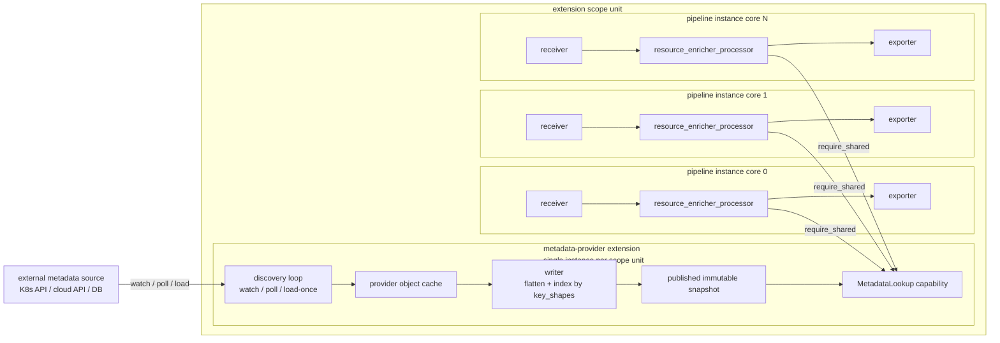

# Resource Enricher Processor Design

<!-- markdownlint-disable MD013 -->

**Status:** Draft

**Tracking issue:** [#3094](https://github.com/open-telemetry/otel-arrow/issues/3094)

**Processor URN:** `urn:otel:processor:resource_enricher`
**Extension URN (first provider):** `urn:otel:extension:k8s_metadata`

**Target crate:** `crates/contrib-nodes`
**Target processor module:** `crates/contrib-nodes/src/processors/resource_enricher_processor/`
**Target extension module (first provider):** `crates/contrib-nodes/src/extensions/k8s_metadata_extension/`

This design follows
[Reference-Informed OTAP-Native Capability Design](ai/reference-informed-otap-native-capability-design.md).

## Summary

The resource enricher processor enriches OTAP telemetry with resource
attributes pulled from an external metadata source — a Kubernetes cluster,
a cloud provider's resource-tag service, a database, etc.
It associates each inbound resource with a metadata record using a small,
ordered set of association rules, then writes selected attributes from
that record onto the resource's attribute set.

The processor is **provider-neutral** — it never names a Kubernetes pod,
an AWS task, or any other provider concept. All provider-specific
knowledge (how metadata is discovered, cached, and flattened into
records) lives below the capability boundary in a provider extension.

The responsibility is split into two pieces:

1. **A metadata-provider extension** (first provider:
   `k8s_metadata_extension`) — an active, shared extension that owns the
   provider client, runs the discovery loop (watch / poll / load-once),
   maintains the in-memory metadata cache, flattens provider objects into
   provider-neutral `EnrichmentRecord` values, and exposes a
   `MetadataLookup` capability to bound processors. The extension is
   declared at either **engine scope** (one instance per collector
   process) or **pipeline-group scope** (one instance per named group),
   whichever fits the provider; see
   [Extension scope is a per-provider choice](#extension-scope-is-a-per-provider-choice).
2. **`resource_enricher_processor`** — an inline single-route processor
   that resolves each inbound `OtapPdata` resource to an `EnrichmentRecord`
   via the capability and writes the configured attributes onto Arrow
   resource attribute batches.

The split is driven by two engine constraints:

- **Per-core duplication is unacceptable.** Processors are per-core; if
  the discovery loop and cache lived inside the processor, an N-core
  collector would open N watches/polls and hold N copies of the cache.
  The extension hosts both, shared above the per-core boundary.
- **Hot-path safety and runtime isolation.** `process()` runs on the
  per-core async runtime. Shared extensions run on a separate runtime,
  so discovery loops, watch reconnects, cache fills, and
  `set_index_spec()` back-fills never compete with the data path. The
  capability surface enforces this contract: every method is synchronous
  and returns immediately (`snapshot()` is one atomic load, `lookup()`
  is one map read, `set_index_spec()` schedules background work and
  returns). The processor never awaits extension work, even at
  `start()`, and the processor crate has no provider-client dependency.

## Required engine support

The processor side of this design is implementable on the engine as it
exists today; however this design will be implemented only once the
framework provides pipeline-group-scoped and engine-scoped extensions.

Available today (Phase 1 of the extension system; see
[Extension System Architecture](extension-system-architecture.md)):

- typed capability binding via `require_shared()` from a processor;
- per-pipeline shared extensions whose state is `Arc`-wrapped and
  `Clone + Send`, so per-core processor replicas can share the same
  inner state via cheap handle clones;
- `Active + Shared` extensions with a `start()`-driven background task,
  shut down after every consumer in scope has drained;
- `ExtensionControlMsg` for engine-driven extension lifecycle, and
  `NodeControlMsg::Config` for processor live reconfiguration.

Framework work this design depends on (called out in
[Extension System Architecture](extension-system-architecture.md) as
future work):

- **Broader extension scopes — pipeline-group scope and engine scope.**
  Today the only available scope is *pipeline* scope, which the
  framework documents as per-core. Running the extension at pipeline
  scope would mean one discovery loop and one cache *per core* — N
  watches and N cache copies on an N-core collector — which violates the
  "per-core duplication is unacceptable" constraint that motivates the
  extension split. The design therefore requires group-scoped or
  engine-scoped extensions so exactly one discovery loop and cache runs
  per group (or per process); pipeline scope is rejected at config
  validation (see [Config rules](#config-rules)), not offered as a
  degraded mode. The processor itself does not name a scope — it just
  binds a shared capability — so no processor change is needed once
  group/engine scope ships.
- **Runtime isolation for shared extensions.** Today `start()`,
  capability methods, and the data path all run on the same per-core
  async runtime, so blocking I/O or CPU-heavy work inside an extension
  stalls the data path on that core unless the extension manually
  offloads (`spawn_blocking`, a worker thread, a Rayon pool). The
  Kubernetes provider extension will need to do that until the
  framework gains a dedicated extension runtime; the synchronous,
  non-blocking capability surface means the data-path contract does
  not change when that lands — it just removes the manual offload
  burden inside the extension.

## Goals

The v1 capability must:

- enrich logs, metrics, and traces with metadata from an external
  provider, expressed entirely through a provider-neutral capability;
- support **composite-key association** with ordered, first-match-wins
  rules over arbitrary resource attributes (not just single-string keys);
- support writing arbitrary provider-published attributes onto the
  resource, with optional explicit renaming of individual attributes;
- support a configurable **conflict policy** for destination attributes
  that already exist;
- ship a first provider (`k8s_metadata_extension`) that enriches from
  Kubernetes objects (pods, namespaces, nodes, and optionally
  deployments / statefulsets / daemonsets / jobs / replicasets /
  cronjobs);
- support associating by a connection peer address for socket-backed
  receivers, expressed generically (no provider vocabulary);
- operate correctly without ever blocking the per-core async runtime on
  provider API I/O;
- emit self-observability metrics through `MetricSet`.

## Non-Goals

The v1 capability does not include:

- a second concrete provider extension (the capability is
  provider-neutral by design, but only the Kubernetes provider ships in
  v1; other providers are future work);
- record-level (non-resource) attribute enrichment; v1 projects onto
  resource attributes only;
- OTTL-based key extraction; lookup keys are built from named resource
  attributes, not arbitrary expressions;
- `wait_for_metadata`-style startup blocking. The architecture cannot
  guarantee "cache fully warm for this processor's shapes before
  `process()` runs" — the processor's own `start()` is what tells the
  extension which index shapes and fields to populate, so gating on that
  deadlocks.
- provider-specific watch-narrowing beyond what the first provider's
  config exposes (e.g. the Kubernetes provider supports `node` and
  `namespace` narrowing only; field/label-selector narrowing is
  deferred).

These items are explicit deferrals, not silent omissions. The user-facing
contract must say so.

## Core Decisions

| Decision | Choice |
| --- | --- |
| Component shape | Provider extension (e.g. `k8s_metadata_extension`) + generic processor (`resource_enricher_processor`) |
| Capability surface | Provider-neutral `MetadataLookup`: `snapshot()`, `lookup()`, `validate_index_spec(spec)`, `set_index_spec(registrant, spec)`, `clear_index_spec(registrant)`, plus `as_connection_lookup()` to optionally downcast to the `ConnectionLookup` companion trait (`lookup_by_connection(snapshot, peer)`). No provider vocabulary. |
| Extension scope | Per-provider operator choice between **engine scope** (one instance per collector) and **pipeline-group scope** (one instance per named group). Per-pipeline scope is rejected because the framework's pipeline-scoped extensions are themselves per-core, so it would mean per-core duplication. See [Extension scope is a per-provider choice](#extension-scope-is-a-per-provider-choice). |
| Sharing model | `Active + Shared` extension. Exactly one instance per scope unit. Per-pipeline processors bind via `require_shared` and hold a `Send + Clone` capability handle that exposes a cheap, non-blocking `snapshot()` returning an immutable view. How the provider backs that snapshot is private to the extension. |
| Lookup key | Composite: an AND of `(resource_attribute_name, value)` pairs (`LookupKey<'_>`, a borrowed slice). |
| Returned record | Provider-neutral flat `EnrichmentRecord` (dotted field name → `EnrichmentValue`). |
| Hot-path contract | Capability lookups are constant-time, synchronous, and never block. |
| Index spec | Processors declare `key_shapes` + `record_fields` via `set_index_spec(registrant, spec)`. The extension stores one spec per registrant (`(pipeline_group_id, pipeline_id, node_id)`) and uses the **union** as its effective spec; `clear_index_spec` happens automatically when the last per-core handle for a registrant is dropped. See [Index spec registration](#index-spec-registration). |
| Connection peer | `OtapPdata::peer_addr()` from socket-backed receivers, expressed as a typed source (`{from: connection}`) . Looked up via the `ConnectionLookup` companion capability. IP-keyed providers (e.g. K8s pods by `status.podIP`) implement it; others leave it unimplemented and `validate_index_spec` rejects `{from: connection}` at config time (`IndexSpecError::ConnectionSourceUnsupported`). See [Connection-Peer Association](#connection-peer-association). |
| Conflict policy | `keep_existing` (default) / `overwrite`. |
| Live reconfiguration | Receives `NodeControlMsg::Config { config }`. Extension and processor reloads are independent. See [Live Reconfiguration](#live-reconfiguration). |
| Startup readiness | Processor is always ready; cache fill is asynchronous and reported via metrics. |
| Telemetry | `MetricSet`-backed counters and gauges for cache size, discovery events, lookup hit/miss, and back-fill progress. |

## Architecture



Flow on the data path:

1. Receiver emits `OtapPdata` with `resource` attributes that include at
   least one of the configured association sources (e.g. `k8s.pod.uid`).
2. Processor walks `associations` rules in order. The first rule whose
   sources are all present on the resource is used. Each rule's source
   values are joined into a `LookupKey`.
3. On a hit, the processor reads the returned `EnrichmentRecord` and produces a new resource-attribute array with the enrichment merged in — see [Attribute writes](#attribute-writes) for the cost model.
4. On a miss, the processor records `lookup.miss` and forwards the
   resource unchanged.
5. The processor never awaits provider I/O on the hot path.

Flow on the control path:

1. The engine starts each provider extension exactly once per scope unit
   (engine or pipeline group, per the provider's declared scope) before
   any consumer in that scope unit starts. The extension builds the
   provider client, constructs the discovery loop, and spawns the
   background task.
2. The background task discovers metadata objects. The initial list /
   poll / load is buffered and swapped into the lookup snapshot
   atomically when it completes; incremental apply/delete events stream
   in after that and update the snapshot in place.
3. As pipelines start up, each per-core processor resolves the bound
   extension via `require_shared` and calls `set_index_spec()` (see
   [Index spec registration](#index-spec-registration)). Per-core
   processors read by calling `snapshot()` once per `process()` call — a
   cheap, non-blocking handle load. The shared read crosses no core
   boundary, and the snapshot itself is `Send + Sync` immutable data.
4. On shutdown the engine drains every consumer in the scope unit, then
   shuts down the extension and drops the provider client. See
   [Lifecycle](#lifecycle).

## Component Boundaries

| Concern | Lives in |
| --- | --- |
| Provider client construction | extension |
| Discovery loop (watch / poll / load-once) | extension |
| Provider object cache | extension |
| Flattening provider objects into `EnrichmentRecord` | extension |
| Index by `key_shapes`; materialize `record_fields` | extension |
| Provider-specific behaviors (hierarchy traversal, heuristics, ID normalization, special-case projections) | extension |
| Capability surface (`MetadataLookup`) | extension |
| Discovery self-observability (event counts, errors, cache sizes) | extension |
| Association rule evaluation | processor |
| Attribute writes (record field → resource attribute) | processor |
| Attribute-write-plan compilation | processor (config-time) |
| Conflict-policy application | processor |
| Lookup hit/miss telemetry, attribute-write counts | processor |
| Index-spec derivation and registration | processor |
| Live reconfiguration of association + attribute rules | processor |

The extension owns nothing that depends on a specific pipeline's data
schema. The processor owns nothing that depends on the provider's runtime
state or vocabulary.

## `MetadataLookup` capability

The capability is intentionally narrow and provider-neutral: a generic
composite-key lookup, a per-batch snapshot accessor that gives the
processor one stable view across an entire `process()` call, and a
config-time `set_index_spec()` / `clear_index_spec()` pair that
processors use to declare — per registrant — what to index by and what
fields to materialize (see [Index spec registration](#index-spec-registration)
for why this lives on the capability surface rather than inside
extension config, and why it is multi-registrant).

```rust
// A single lookup key: an AND of (resource_attribute_name, value)
// pairs. Borrowed (&str) so the hot path never copies: names come from
// config, values from the Arrow batch.
type LookupKey<'a> = &'a [(&'a str, &'a str)];

// The field names a key is built from — names only, no values. Owned
// because the extension stores it as config, off the hot path.
enum KeyShape {
    /// AND of resource-attribute names; looked up via `lookup()`.
    Composite(Vec<String>),
    /// Single connection-IP source; looked up via
    /// `ConnectionLookup::lookup_by_connection()`. Requires the
    /// provider to implement `ConnectionLookup` (else
    /// `validate_index_spec` returns `ConnectionSourceUnsupported`).
    Connection,
}

// One resource-attribute value: a scalar OTAP attribute value
// (`AttributeValueType` in `crates/pdata` `otlp::attributes`) or a
// flat list of scalars. The extension picks the variant.
enum Scalar {
    Str(String),
    Int(i64),
    Double(f64),
    Bool(bool),
    Bytes(Vec<u8>),
}

enum EnrichmentValue {
    Scalar(Scalar),
    Array(Vec<Scalar>),  // e.g. multi-valued attributes
}

// A flat map of catalog attribute-path names to values (see Provider
// catalog). Example fields the Kubernetes provider produces:
//   "k8s.pod.uid"             -> "abc-123"
//   "k8s.pod.labels.app"      -> "checkout"
//   "k8s.namespace.name"      -> "shop"
//   "k8s.deployment.name"     -> "foo"
//   "k8s.node.name"           -> "node-1"
type EnrichmentRecord = HashMap<String, EnrichmentValue>;

// Opaque Arc<...> over the extension's immutable MetadataTables; held
// for one process() call.
struct MetadataSnapshot { /* extension-private */ }

trait MetadataLookup {
    /// Take a snapshot once per process() call. Cheap atomic load.
    fn snapshot(&self) -> MetadataSnapshot;

    /// Single hot-path lookup. Returns the matching record or None. The
    /// key is a borrowed slice (no allocation at the call site); the
    /// returned reference borrows from `snapshot`, which must outlive
    /// it.
    fn lookup<'a>(
        &self,
        snapshot: &'a MetadataSnapshot,
        key: LookupKey<'_>,
    ) -> Option<&'a EnrichmentRecord>;

    /// Config-time validation of an `IndexSpec`, called at `start()`
    /// and on every reload before `set_index_spec`. Checks every
    /// referenced attribute name against the provider's catalog, and
    /// that `as_connection_lookup()` returns `Some` if the spec
    /// contains any `KeyShape::Connection`. See
    /// [Provider catalog](#provider-catalog).
    fn validate_index_spec(&self, spec: &IndexSpec) -> Result<(), IndexSpecError>;

    /// Config-time only; never called from `process()`. Declares what
    /// to index by and store on behalf of `registrant`, set-replacing
    /// per registrant. Returns immediately; back-fill runs on the
    /// extension's runtime. The spec must already have passed
    /// `validate_index_spec` — it is not re-validated here. See
    /// [Index spec registration](#index-spec-registration) for the
    /// union/back-fill lifecycle.
    fn set_index_spec(&self, registrant: RegistrantId, spec: &IndexSpec);

    /// Explicit reset of a registrant's contribution. Idempotent and
    /// normally unnecessary — the extension refcounts capability
    /// handles per `RegistrantId` and clears automatically when the
    /// last one drops.
    fn clear_index_spec(&self, registrant: RegistrantId);

    /// Companion-capability downcast. Returns `Some` iff this provider
    /// also implements `ConnectionLookup`. Drives both
    /// `validate_index_spec` (a `None` rejects any
    /// `KeyShape::Connection`) and hot-path dispatch for `Connection`
    /// rules. Default impl returns `None`, so providers without an
    /// IP-keyed index need no extra code. See
    /// [Connection-Peer Association](#connection-peer-association).
    fn as_connection_lookup(&self) -> Option<&dyn ConnectionLookup> { None }
}

/// Optional companion capability: provider-specific connection-IP
/// lookup. Implemented alongside `MetadataLookup` by providers whose
/// data is keyed by IP (K8s pods by `status.podIP`; future
/// cloud-instance providers). Providers without an IP-keyed index
/// (file / CSV / DB / KV / DNS / HTTP lookup) do not implement it —
/// misuse is rejected at config time, not at runtime.
trait ConnectionLookup {
    /// Single hot-path lookup keyed by the batch's peer IP (e.g. K8s:
    /// the pod whose `status.podIP` matches). Read-only, never blocks.
    /// The returned reference borrows from `snapshot`, matching
    /// `MetadataLookup::lookup`.
    fn lookup_by_connection<'a>(
        &self,
        snapshot: &'a MetadataSnapshot,
        peer: IpAddr,
    ) -> Option<&'a EnrichmentRecord>;
}

/// Provider-reported error from `validate_index_spec`. Returned to the
/// processor and surfaced as a config error at `start()`/reload time,
/// so a bad attribute name never reaches `process()`.
enum IndexSpecError {
    /// A `Composite` key shape's source attribute name is not in the
    /// provider's catalog.
    UnknownKeyAttribute { attribute: String },
    /// A `record_fields` path is not in the provider's catalog.
    UnknownRecordField { field: String },
    /// The spec contains a `KeyShape::Connection` entry but this
    /// provider does not implement `ConnectionLookup`
    /// (`as_connection_lookup` returned `None`).
    ConnectionSourceUnsupported,
}

// Identity of the caller that declared a spec, derived from
// `PipelineContext`. The (group, pipeline, node) triple uniquely
// identifies a processor config; per-core replicas share it and
// collapse to one registrant (see Per-core fan-in). core_id is omitted.
struct RegistrantId {
    pipeline_group: PipelineGroupId,
    pipeline:       PipelineId,
    node:           NodeId,
}

// What the processor declares to the extension at config time.
// Both fields are derived from the processor's own config:
//   key_shapes    <- associations[].sources
//                    (Composite for resource_attribute sources;
//                     Connection for a single {from: connection})
//   record_fields <- attributes[]
//                    (one path per entry; exact names, no globs)
struct IndexSpec {
    /// What to index by, one KeyShape per association rule. A
    /// `KeyShape::Connection` adds nothing to the `by_key` index (it
    /// dispatches against `ConnectionLookup`), but its presence makes
    /// `validate_index_spec` require the provider to implement that
    /// companion trait.
    key_shapes: Vec<KeyShape>,
    /// Catalog paths to materialize into each EnrichmentRecord — the
    /// union of every `attributes:` entry (bare entries contribute
    /// their name; `{from, to}` entries their `from`). Exact strings,
    /// no globs. Also drives which provider discovery sources to start
    /// (e.g. a `k8s.deployment.name` field starts the deployment
    /// informer).
    record_fields: Vec<String>,
}
```

All methods take `&self` and never block. The processor resolves the
capability once at node construction and holds the typed handle for its
lifetime; no runtime capability resolution on the hot path. It takes one
`snapshot()` per `process()` call and reads from it for the whole batch.
How the provider backs that snapshot is private to the extension (see
[Cache structure](#cache-structure)).

### Cache structure

The provider extension keeps its own object cache (for the Kubernetes
provider, one `kube_runtime::reflector::Store<K>` per watched kind). That
cache is the writer-side source of truth; the lookup snapshot is a
projection derived from it.

The lookup snapshot is one struct published as a single immutable
snapshot:

```rust
// Extension-internal type.
struct MetadataTables {
    /// The only public-facing index. Stored with owned keys (one
    /// (String, String) pair per element of the key's KeyShape) so the
    /// HashMap owns its data, but the hot-path lookup looks the entry
    /// up by a borrowed `LookupKey<'_>` — i.e. the processor does not
    /// have to allocate a new owned key just to perform the lookup.
    by_key: HashMap<OwnedLookupKey, Arc<EnrichmentRecord>>,

    // Provider object caches stay private — used only by the writer to
    // build and refresh `by_key`.
}

// Owned counterpart of LookupKey<'_> used for storage. Extension
// implementation detail; never appears on the trait surface.
type OwnedLookupKey = Vec<(String, String)>;
```

`MetadataTables` is an extension-internal type, and the way it is
published is the provider's choice, not part of the capability contract.
The writer applies discovery updates into a builder and publishes a new
immutable `Arc<MetadataTables>` atomically; readers load the current one
through the capability's `snapshot()` method exactly once per `process()`
call and use that handle for every resource in the batch. This keeps the
**snapshot read and
cache lookup lock-free and allocation-free on the hot path**: for each
resource the processor builds a small `LookupKey<'_>` that just points
at strings it already has (attribute names from its config, values from
the Arrow batch) and performs one `HashMap` lookup with it — no new
`String` allocations, no cloning. The snapshot also gives each batch a
consistent view even if the writer publishes a new snapshot mid-call.

#### How the borrowed lookup stays allocation-free

Storing owned keys (`OwnedLookupKey = Vec<(String, String)>`) while
querying with a borrowed `LookupKey<'_> = &[(&str, &str)]` does **not**
work through `std::collections::HashMap::get`, because
`Vec<(String, String)>` cannot `Borrow` as `[(&str, &str)]` (the element
types differ), which would force an owned-key allocation per lookup. The
`by_key` map is therefore a [`hashbrown::HashMap`](https://docs.rs/hashbrown)
and the lookup goes through its
[`Equivalent`](https://docs.rs/hashbrown/latest/hashbrown/trait.Equivalent.html)
trait: a borrowed key type wrapping `&[(&str, &str)]` implements
`Equivalent<OwnedLookupKey>` and hashes **identically** to the owned key
it matches (hashing the `(name, value)` pairs in order, no concatenation),
so `get` probes and compares without materializing an owned key.
Soundness rests on the standard contract that the borrowed and owned
keys' `Hash`/equality agree, which the writer guarantees by building both
from the same normalized pairs. (`std`'s unstable `raw_entry` gives the
same path; `Equivalent` is preferred only because it is stable.)

The writer's job, on every object update, is: read the already-cached
related objects, pull exactly the `record_fields` from the active
`IndexSpec` into one `Arc<EnrichmentRecord>`, and insert one `by_key`
entry per `key_shape` that resolves on that object (all pointing at the
same `Arc`). Two objects sharing the same record share storage; multiple
key shapes for the same object share its single record (so
`[pod.uid → X]` and `[pod.name, namespace.name → X]` point at the same
`Arc`). Memory cost is one `EnrichmentRecord` per object plus one
`HashMap` entry per object per key shape.

#### Non-unique lookup keys

`by_key` maps one key to exactly one `Arc<EnrichmentRecord>`, so the
writer must decide what to do when two distinct objects resolve to the
**same** key for a given key shape. This is real: a pod IP can be reused
after a pod is deleted, and `hostNetwork` pods share their node's IP, so
indexing pods by IP can produce collisions even though `k8s.pod.uid` is
unique.

Key uniqueness is a **provider/writer concern** — the generic processor
never sees the ambiguity, it just gets a hit or a miss. The contract the
writer must honor:

- **Ambiguous keys are suppressed, not silently overwritten.** When the
  writer would insert a second, different record under a key that is
  already populated by another object for the same key shape, it does
  **not** do last-writer-wins (which would non-deterministically attach
  one object's metadata to traffic that may belong to either). Instead
  the key is marked ambiguous and removed from / withheld in `by_key`, so
  a lookup on that key returns a clean **miss** rather than a possibly
  wrong record. A wrong record is worse than no record (see
  [IP Misattribution Risk](#caveats) under Connection-Peer Association).
- **Ambiguity is observable.** The writer increments a provider-defined
  `index.ambiguous_key` counter (under the extension's own metric set)
  so operators can see that some objects were not indexable under a given
  shape. This is an extension metric, not a processor metric, because the
  cause is provider data, not processor config.
- **Providers may pre-exclude known-ambiguous sources.** A provider that
  knows a class of objects cannot be disambiguated by a shape should not
  index them under that shape at all. The Kubernetes provider, for
  example, excludes `hostNetwork` pods from its IP index (their
  `status.podIP` is the node IP and cannot identify the pod), so those
  never even reach the collision path.

The same rule applies to the `ConnectionLookup` IP index: a peer IP that
maps to more than one candidate record is treated as ambiguous and
returns a miss.

## Configuration

Configuration is OTAP-native. The processor's `nodes:` config block lives
inside a pipeline as usual. The provider extension's config block is
declared at pipeline-group scope and is bound by name from any pipeline in
the same group.

### Processor config (generic)

The processor's config is provider-neutral. Three blocks:

- `associations:` — which resource-attribute combinations identify the
  record to look up (in priority order).
- `attributes:` — which provider-published attributes to write onto the
  resource (and, optionally, under what destination names).
- `conflict_policy:` — what to do when a destination attribute already
  exists on the resource.

The set of attribute names valid in `associations:` and `attributes:`
comes from the bound provider extension's catalog (see
[Provider catalog](#provider-catalog)). The example below binds the
Kubernetes provider; the catalog the K8s provider publishes is
documented in
[Extension config (Kubernetes provider)](#extension-config-kubernetes-provider).
A different provider would publish a different catalog and the
example's attribute names would change accordingly.

```yaml
nodes:
  enrich_resource:
    type: processor:resource_enricher
    capabilities:
      metadata: k8s_metadata            # binds the group-scoped extension
    config:
      # ----- Association rules -----
      # Each rule is a composite AND of typed sources, walked in order;
      # the first rule whose sources are all resolvable on the batch is
      # used, and exactly one lookup is performed against it (a miss does
      # not fall through). See Association for the full semantics.
      #
      # Each source is one of:
      #   * { from: resource_attribute, name: <attr> }
      #       read the value of `<attr>` from the resource.
      #   * { from: connection }
      #       read the peer IP from `OtapPdata::peer_addr()`. Used for
      #       matching only; never written back. Must be the rule's
      #       only source (cannot be composed with `resource_attribute`
      #       sources in the same rule) and is only valid against a
      #       provider that implements the `ConnectionLookup`
      #       companion capability — misuse is a config-time error,
      #       not a runtime miss. The Kubernetes provider implements
      #       it (mapping to the pod whose `status.podIP` matches).
      #       See Connection-Peer Association.
      associations:
        - sources:
            - { from: resource_attribute, name: k8s.pod.uid }
        - sources:
            - { from: resource_attribute, name: k8s.pod.name }
            - { from: resource_attribute, name: k8s.namespace.name }
        - sources:
            - { from: resource_attribute, name: k8s.pod.ip }
        - sources:
            - { from: resource_attribute, name: container.id }
        - sources:
            - { from: connection }

      # ----- Attributes to write -----
      # Each entry is one of:
      #   * a bare attribute name — the processor writes the
      #     provider-published value under that exact name.
      #   * { from, to } — the processor reads the catalog-declared
      #     attribute named in `from` and writes it under the
      #     destination name `to`.
      # v1 has no wildcards or globs (see Open Questions).
      attributes:
        - k8s.pod.uid
        - k8s.pod.name
        - k8s.namespace.name
        - k8s.deployment.name
        - k8s.node.name
        - { from: k8s.pod.labels.app,             to: service.name }
        - { from: k8s.pod.annotations.git-commit, to: git.commit }

      # ----- Conflict policy -----
      # What to do when the destination resource attribute already exists.
      conflict_policy: keep_existing    # | overwrite
```

The processor compiles `associations:` into `key_shapes` and the union
of `attributes:` paths into `record_fields`, then declares both in one
`set_index_spec(registrant, spec)` call at `start()` (and again on
reload). A `{from: connection}` rule compiles into
`KeyShape::Connection` and is dispatched against the provider's
`ConnectionLookup` rather than the composite `lookup()` (see
[Connection-Peer Association](#connection-peer-association)); all other
rules dispatch against `lookup()`. Spec lifecycle — union across
registrants, back-fill, and automatic clear when the last per-core
handle drops — is covered in
[Index spec registration](#index-spec-registration).

### Extension config (Kubernetes provider)

Provider-specific. The Kubernetes provider recommends pipeline-group
scope (see
[Extension scope is a per-provider choice](#extension-scope-is-a-per-provider-choice));
the example below shows that form. The extension config holds **only
non-field knobs** — connection/auth, discovery tuning, filtering,
exclusions — plus provider behavior toggles. It does **not** contain an
attribute list: which fields to store and which discovery sources to
start are derived from the processor's `IndexSpec` (`record_fields` +
`key_shapes`), so the extension config has no attribute list to keep in
sync with the processor's `attributes:` block.

```yaml
pipeline_groups:
  agent_node_local:
    # Group-scoped extension. Instantiated once per group; bound by name
    # from any pipeline in this group.
    extensions:
      k8s_metadata:
        type: extension:k8s_metadata
        config:
          # ----- Discovery / authentication / watch behavior -----
          auth_type: service_account            # service_account | kube_config
          kube_config:
            path: ~                              # optional
            context: ~                           # optional
          api:
            qps: 5
            burst: 10
          filter:
            node_from_env_var: KUBE_NODE_NAME    # OR filter.node
            namespace: ~                          # optional single-namespace narrowing
          pod_delete_grace_period: 120s
          watch_sync_period: 0s                  # 0s disables resync; default
          exclude:
            pods:
              - name: jaeger-agent
              - name: jaeger-collector

          # ----- Provider behavior toggles (not a field list) -----
          # K8s-specific behavior that cannot be derived from the
          # processor's `attributes:` paths. Stays here because it
          # changes HOW the record is built, not WHICH fields it
          # contains.
          otel_annotations: true
```

A second group declares its own extension instance with its own config
(e.g. different namespace narrowing or `ServiceAccount`); pipelines in
that group bind by the local name and see a different cache.

Because the Kubernetes provider has a **live writer** — the
watch/reflector streams apply/delete deltas concurrently with hot-path
reads — it backs its `snapshot()` with an `Arc<ArcSwap<MetadataTables>>`:
the writer builds a new immutable `MetadataTables` and atomically swaps it
in, and each `snapshot()` is a single lock-free atomic pointer load. This
is the provider's implementation of the generic snapshot contract (see
[Cache structure](#cache-structure)); a provider with no concurrent writer
would not need `ArcSwap` at all.

The Kubernetes provider's catalog publishes the OpenTelemetry K8s
semantic-convention attribute names — see
[semantic-conventions/docs/resource/k8s](https://github.com/open-telemetry/semantic-conventions/tree/main/docs/resource/k8s).
So `k8s.pod.uid`, `k8s.pod.ip`, `k8s.pod.name`, `k8s.namespace.name`,
`k8s.deployment.name`, `k8s.node.name`, `container.id`, etc. are the
valid names that may appear in a processor's `associations:` and
`attributes:` blocks when binding this provider. Per-key label and
annotation paths are exposed as `k8s.pod.labels.<key>` and
`k8s.pod.annotations.<key>` — one path per label or annotation key; v1
has no wildcard or glob form (see
[Open Questions](#open-questions)). Provider-internal value
normalization (for example, stripping `docker://`, `containerd://`,
`cri-o://` runtime prefixes from `container.id` on both the indexed
and queried side) is applied transparently inside the extension; the
processor does not see it.

### Config rules

- `serde(deny_unknown_fields)` on every config struct.
- Each `associations` rule has at least one source; the maximum is 4.
- Within a rule, sources are evaluated as an AND; the first rule with all
  sources present on the resource is used. If that rule's lookup misses,
  no further rules are tried (first-match wins, even on miss).
- `associations` must be non-empty; v1 requires at least one explicit
  rule rather than picking a default chain on the user's behalf.
- `attributes` must be non-empty; v1 requires the operator to spell out
  which attributes to write rather than picking a default set on their
  behalf.
- An `attributes` entry is either a bare attribute-name string or a
  `{from, to}` object. Neither form may contain wildcard or glob
  characters (`*`, `?`, regex metacharacters); v1 supports exact
  attribute names only. See
  [Open Questions](#open-questions) for the wildcard tradeoff.
- In a `{from, to}` entry, `from` and `to` must differ (use the
  bare-string form for an identity write).
- Every name referenced in `associations.sources[].name` (for
  `from: resource_attribute` sources), `attributes[]`, or
  `attributes[].from` must appear in the bound provider extension's
  catalog. Unknown names are rejected by `validate_index_spec` at
  `start()` and on every reload.
- A `{from: connection}` source must be a rule's sole source
  (cannot be composed with `resource_attribute` sources in the same
  rule), and the rule is rejected by `validate_index_spec` with
  `IndexSpecError::ConnectionSourceUnsupported` unless the bound
  provider implements the `ConnectionLookup` companion capability.
- The extension must be declared at either engine scope or pipeline-group
  scope, depending on the provider's recommendation. Per-pipeline scope
  is always rejected at config validation because it would force per-core
  duplication of the discovery loop and cache. The Kubernetes provider
  recommends group scope (see
  [Extension scope is a per-provider choice](#extension-scope-is-a-per-provider-choice)).
- A processor's `capabilities:` binding may reference any shared extension
  visible to its pipeline — either an engine-scoped extension or a
  group-scoped extension declared in the same group. Cross-group bindings
  to another group's group-scoped extension are rejected.
- Within a scope unit, an extension `name:` is unique; two declarations
  with the same name at the same scope unit are rejected.

## Association

Association is the rule engine that maps `OtapPdata` resource attributes
to an `EnrichmentRecord` in the extension's cache. The semantics are:

- **Rule selection by attribute presence.** The processor evaluates the
  configured rule list in order and picks the first rule whose source
  attributes are all present on the resource.
- **Single lookup, no fallback.** The chosen rule's source values form a
  composite `LookupKey`. Exactly one lookup is performed; a miss does not
  fall through to later rules (first-match wins, even on miss).
- **Empty `associations` is a config error.** v1 requires at least one
  explicit rule rather than picking a default chain on the user's behalf
  — the right chain depends on whether the upstream source is
  socket-backed, file-based, or already-enriched gateway traffic.
- **Selection is presence-only; predicates live in the provider.** A rule
  is selected purely on source presence (each `resource_attribute` source
  present, each `connection` source has a peer address). There is no
  generic predicate/value-shape syntax in v1. Any "use this source only
  if its value looks like X" logic lives inside the provider's `lookup()`
  / `lookup_by_connection()`, as does value normalization (see
  [Provider catalog](#provider-catalog)). A generic predicate syntax is
  possible future work, not a v1 feature.

The processor reads each rule's referenced attribute names from the Arrow
resource attribute batch via
[`otap_df_pdata::otap::transform::apply_attribute_transform`](https://github.com/open-telemetry/otel-arrow/blob/main/rust/otap-dataflow/crates/pdata/src/otap/transform.rs)-style
helpers, batched across resources to avoid per-row dispatch. Per-rule
attribute name sets are precomputed at `Config` time into a single
rule-scan plan so the hot path performs at most one O(R) pass per resource
(R = referenced attribute names).

### Provider catalog

The processor is provider-agnostic and never invents attribute names.
Every name the operator writes in `associations:` or `attributes:` —
including the `{from, to}` form's `from` — must appear in the bound
provider extension's catalog.

Each provider extension publishes its catalog as part of its public
contract:

- **The catalog is the public set of attribute paths the extension can
  produce in an `EnrichmentRecord`.** Operators read it from the
  provider's documentation; the processor doesn't fabricate or
  translate names.
- **`validate_index_spec` checks every name the processor declares
  against the catalog.** Unknown names surface as
  `IndexSpecError::UnknownKeyAttribute` (when used in
  `associations.sources[].name`) or
  `IndexSpecError::UnknownRecordField` (when used in `attributes`).
  A `{from: connection}` source against a provider that does not
  implement the `ConnectionLookup` companion capability surfaces as
  `IndexSpecError::ConnectionSourceUnsupported`. The check runs at
  `start()` and on every reload, so misspellings, catalog-version
  skew, and capability mismatches are config-time errors rather
  than permanent silent lookup misses at runtime.
- **The catalog has two kinds of entry: fixed paths and open
  namespaces.** Fixed paths are the closed set of well-known
  attribute names the provider always knows how to produce
  (`k8s.pod.uid`, `k8s.namespace.name`, `k8s.node.name`, …); these
  validate by exact membership. Open namespaces cover attributes whose
  leaf key is created by the workload and is therefore *not* knowable
  ahead of time — Kubernetes labels and annotations being the canonical
  case. The provider publishes these as **prefixes**, not enumerated
  keys: e.g. `k8s.pod.labels.` and `k8s.pod.annotations.` (and the
  namespace/node equivalents). `validate_index_spec` accepts any path
  that either exactly matches a fixed entry **or** begins with a declared
  open-namespace prefix and has a non-empty leaf (`k8s.pod.labels.app`
  passes because it sits under `k8s.pod.labels.`). This is what lets a
  processor declare `k8s.pod.labels.app` without that key already
  existing in any cached object — validation checks the *shape* of the
  name against the catalog, never the live cache. If the workload turns
  out not to carry that label, the field is simply absent from the
  record and the write is skipped (a normal miss for that field), exactly
  as for any other field that an object happens not to have. Validation
  rejects only a malformed open-namespace path (empty leaf, e.g.
  `k8s.pod.labels.`) or a path under no declared prefix.
- **Value normalization is a catalog concern.** Some fields need
  pre-lookup normalization before two surface forms can match (the
  Kubernetes provider, for example, strips runtime-engine prefixes from
  container IDs; other providers may lowercase or canonicalize IPs).
  The extension applies the normalization on both the indexed side
  (writer) and the queried side (`lookup`). The processor never sees
  the normalizer.

A provider that adds a new attribute publishes a catalog update;
processors then reference the new name and the extension materializes
it. No coordination is required beyond the catalog and the `IndexSpec`.

v1 uses a single composite-key map (`by_key`; see
[Cache structure](#cache-structure)) rather than a set of per-attribute
indexes, for two reasons:

1. **User-extended sources.** Any record field the provider exposes can be
   an association source. Hard-coded per-key indexes cannot represent
   that.
2. **Composite rules.** A `(k8s.pod.name, k8s.namespace.name)` rule is a
   composite. A composite-key map keeps lookups constant-time without
   needing a join.

The extension's writer inserts one `by_key` entry per object for every
`key_shape` in the effective `IndexSpec` (the union across all
registrants) that resolves on that object.

### Index spec registration

The writer can only populate `by_key` entries for the shapes it knows
about, and can only materialize the record fields it is told to. Both come
from the processor's config, declared through `set_index_spec()`.

#### Framework constraint

The extension does **not** see processor configs at its own `start()` —
the extension system wires capabilities one-way (consumers pull through
typed handles) and the engine builds the extension from its own
`extensions:` block alone. The only architecture-legal channel for
processor-to-extension communication is the capability handle, so
index-spec declaration lives on the trait. The flow:

1. At `start()`, the processor builds its `RegistrantId` from
   `PipelineContext` (`pipeline_group_id`, `pipeline_id`, `node_id`),
   compiles `associations` → `key_shapes` and `attributes` →
   `record_fields`, calls `validate_index_spec(spec)` against the
   bound provider, and on success calls
   `set_index_spec(registrant, spec)`. A validation error aborts
   `start()` with the provider's reported reason (see
   [Provider catalog](#provider-catalog)).
2. On `NodeControlMsg::Config` reload, the processor re-derives the
   spec, calls `validate_index_spec` again, and on success calls
   `set_index_spec` under the same registrant (set-replacing for that
   registrant). A validation failure leaves the previous spec in
   place and is surfaced as a reload error.
3. On shutdown the processor drops its capability handle; the extension
   refcounts handles per registrant and clears the contribution
   automatically when the last per-core handle drops.
4. The extension keeps `Map<RegistrantId, IndexSpec>` and recomputes
   the **union** of all entries on every call. The union diff drives
   back-fill of added shapes/fields, drop of removed ones, and
   start/stop of discovery sources implied by required fields (e.g. a
   `deployment.*` field starts the Kubernetes deployment informer).
   Back-fill runs on the extension's runtime, reported through the
   extension's own back-fill-progress metric.

#### Consequence: ordering and first-lookup misses

Because `set_index_spec()` is a capability call from the processor, the
spec reaches the extension **after** its `start()` and after initial
discovery has begun. Lookups using a newly-declared shape or field miss
until the back-fill completes and are counted in `lookup.miss`;
steady state is "all declared shapes hit." The processor cannot wait
for extension start — the framework already guarantees that ordering —
and cannot wait for the cache to be warm without coupling pipeline
readiness to provider-API latency (reported as telemetry instead).

#### Per-core fan-in and per-pipeline independence

The engine clones one pipeline definition per allocated core, so all N
per-core replicas of a `(group, pipeline, node)` triple have
byte-identical config and call `set_index_spec` with the same
registrant and the same spec. The first call installs; the remaining
N − 1 see no change and return immediately. One processor node, one
registrant entry, no duplicate index work.

Different processors stay independent because they have different
registrants — a different `node_id` (two enrichers in the same
pipeline), `pipeline_id` (different pipelines in the same group, which
the engine permits with independent configs), or `pipeline_group_id`.
A spec change by one registrant only edits its own entry; the union
the extension publishes is recomputed. This is what makes engine-scoped
extensions safe under divergent specs from anywhere in the process.

## Attribute writes

The processor applies each enabled attribute from the matched
`EnrichmentRecord` to the resource attribute Arrow batch.

### Write cost (Arrow immutability)

Arrow record batches are immutable: the resource-attribute columns
backing a batch cannot be patched in place. "Writing" an attribute is
therefore a rebuild of the resource attribute structure, not an in-place
mutation. This is the dominant hot-path cost of the processor and the
design optimizes around it:

- **Batched, not per-row.** The processor computes, for the whole batch,
  the set of `(resource_index, attribute_name → value)` edits implied by
  the matched records and the conflict policy, then materializes the
  updated resource-attribute array(s) once per `process()` call using the
  same
  [`apply_attribute_transform`](https://github.com/open-telemetry/otel-arrow/blob/main/rust/otap-dataflow/crates/pdata/src/otap/transform.rs)-style
  builder path the rest of the pipeline uses. There is no per-resource
  array rebuild.
- **Only the resource attribute structure is rebuilt.** Record-, scope-,
  and signal-level columns are shared by reference (`Arc`) and never
  copied; only the resource attribute array and its parent struct/offsets
  are reconstructed.
- **No-op batches stay zero-copy.** If no resource in the batch matches a
  rule (all misses), or every matched write is dropped by
  `keep_existing`, the processor forwards the original `OtapPdata`
  untouched and performs no rebuild at all.

So the per-batch write cost is proportional to the size of the resource
attribute structure plus the number of applied edits, paid once per
batch, not the constant-time-in-place cost an in-place mutation would
suggest.

- A **bare entry** (e.g. `k8s.pod.uid`) reads the record field of that
  exact name and writes it to a destination resource attribute of the
  same name.
- A **`{from, to}` entry** reads the record field named by `from` and
  writes it to the destination resource attribute named by `to`.
- A field absent from the record is skipped silently — the destination
  attribute is not written, and the resource is forwarded unchanged
  for that attribute.
- v1 supports exact names only — no wildcards, globs, or templates.
  See [Open Questions](#open-questions) for the v2 wildcard tradeoff.

The set of record-field paths across every entry in `attributes:` is
exactly the `record_fields` the processor declares in its `IndexSpec`,
so the extension materializes precisely what some processor writes —
nothing more.

The compiled attribute-write plan (resolved record-field path →
destination attribute name) is built at `start()` and rebuilt on
`NodeControlMsg::Config` reload.

### Conflict policy

When a destination resource attribute already exists on the resource, the
configured `conflict_policy` decides:

- `keep_existing` (default) — leave the existing value; skip the write.
- `overwrite` — replace the existing value with the value from the
  enrichment record.

## Connection-Peer Association

Some receivers observe a connection peer address that is only available
at the receiver — by the time a batch reaches a processor, the
originating socket is gone — so it is propagated on `OtapPdata` itself
via `OtapPdata::peer_addr()`.

The processor exposes the peer address as a **typed source kind**
within an association rule, in the same style as the Go collector's
`k8sattributesprocessor` `pod_association`:

```yaml
associations:
  - sources:
      - { from: resource_attribute, name: k8s.pod.ip }
  # ... other rules ...
  - sources:
      - { from: connection }
```

The peer IP value is fed into a **separate hot-path API**
(`ConnectionLookup::lookup_by_connection`) implemented as an optional
companion capability alongside `MetadataLookup`. It is **lookup-only**:
the value is never written back as a resource attribute, and the user
config does not name an attribute for it.

### Provider opt-in via `ConnectionLookup`

Whether a `{from: connection}` source is meaningful is a provider
concern. Providers with an IP-keyed index implement `ConnectionLookup`
alongside `MetadataLookup` and override `as_connection_lookup()` to
return `Some(self)`:

- The Kubernetes provider implements it, mapping the peer IP to the
  pod whose `status.podIP` matches.
- A future cloud-instance-metadata provider could implement it by
  mapping the peer IP to a cached `(VM, tags)` record.

Providers whose data is not naturally keyed by IP (file / CSV / YAML;
database / KV; DNS / HTTP — the shape of Go's `lookupprocessor`) inherit
the default `None` and need no changes; support is additive and opt-in.

The processor consults `as_connection_lookup()` at `start()`/reload to
decide whether to accept `{from: connection}` rules: `None` makes
`validate_index_spec` reject the rule with
`IndexSpecError::ConnectionSourceUnsupported`; `Some` caches the borrowed
handle on the per-rule dispatch table for hot-path use.

### Hot-path dispatch

A rule's compiled plan is one of:

- `Composite(KeyShape)` — build a `LookupKey<'_>` from the named
  resource attributes and call `MetadataLookup::lookup`.
- `Connection` — read `OtapPdata::peer_addr()`, and call
  `ConnectionLookup::lookup_by_connection`. Provider-internal
  normalization of the peer (IPv4-mapped-IPv6 collapsing, etc.)
  applies on the indexed and queried side just like other catalog
  values (see [Provider catalog](#provider-catalog) on value
  normalization).

Both call paths return `Option<&'a EnrichmentRecord>` borrowed from
the per-batch snapshot, so the rest of the processor (`attributes:`
writes, conflict policy) is unchanged.

If the batch has no peer address (non-socket receiver, or the receiver
did not set it), the `Connection` rule is treated as not-resolvable
and the rule is skipped, the same way an absent resource attribute is.
This keeps the first-match-wins semantics consistent.

### Caveats

- Connection IP is not always the originating client's IP: with NAT,
  load balancers, service meshes, sidecars, gateway hops, or an
  intermediate collector, the observed peer is the last network hop, not
  the workload that produced the telemetry. Because one forwarder fronts
  many sources, a single misattribution can mislabel a large fan-in of
  unrelated telemetry with confident-looking but incorrect enrichment
  — strictly worse than leaving the resource unenriched. Operators should
  only enable `{from: connection}` on ingestion paths where the peer is
  the actual workload (direct socket-backed receivers), and should prefer higher-priority attribute-based rules (e.g. `k8s.pod.uid`) ahead of
  the connection rule so the IP path is a last resort.
- Whether a given peer IP can be disambiguated to exactly one record
  is a provider concern (e.g. the Kubernetes provider cannot
  disambiguate `hostNetwork` pods, whose `status.podIP` is the node
  IP); ambiguous peer IPs return a miss rather than an arbitrary pick
  (see [Non-unique lookup keys](#non-unique-lookup-keys)). Note this
  only prevents *ambiguous* matches; it does not prevent a *confident
  wrong* match when the forwarder's IP uniquely resolves to the
  forwarder's own pod.

## Cache and Memory Model

Memory usage scales with the provider's object count and the configured
attribute set. The provider extension exposes the levers that matter;
for the Kubernetes provider:

- node-scoped filtering (default for agent deployments) holds only the
  pods scheduled on the local node;
- namespace-scoped filtering holds only the pods in the named namespace;
- per-key label/annotation writes are the dominant per-object cost; the
  extension stores only the fields the effective `IndexSpec` lists
  (the union of every registrant's `record_fields`; others are dropped
  at index time);
- discovery sources that are off by default are started lazily, driven by
  the spec.

Per-object overhead is one `EnrichmentRecord` plus one index entry per key
shape. Records are `Arc`-shared across key shapes for the same object.
These are design targets, not contractual guarantees; each extension
instance's footprint scales with what its filter admits and what its
bound processors' `attributes:` blocks declare, independent of other
extension instances in the process.

## Extension scope is a per-provider choice

The capability surface is identical regardless of where the extension
lives. What changes between scopes is the framework binding rules, the
blast radius of restarts and back-fills, and how many discovery loops
run in a multi-group collector. Each provider extension documents its
supported scopes and recommendation.

### Pipeline-group scope

Recommended when the provider's discovery loop is naturally scoped by
something groups vary — filter / region / account / namespace, client
identity, or any case where restart and back-fill blast radius should
be bounded to one group. The Kubernetes provider
(`k8s_metadata_extension`) is the canonical case: agent-mode groups
want node-narrowed watches, control-plane groups want
namespace-narrowed watches, and different groups may need different
`ServiceAccount` identities. **Group scope is the recommended default
for the Kubernetes provider.**

If two groups in a process happen to need identical enrichment from a
group-scoped provider, the operationally simple answer is to declare
the extension in each group and pay for two discovery loops;
independent reloads and telemetry usually outweigh the duplication.
Merge the groups or pick an engine-scoped provider variant if one loop
is actually required.

### Engine scope

Appropriate when the discovery is naturally one-per-collector — a
read-only file/DB load, or any provider whose client identity and scope are fixed
at the process level. Avoids redundant discovery; the cost is a wider
blast radius for reloads and back-fills (every binding pipeline sees
a transient miss window during a restart or a union-growing
`set_index_spec()` call).

### Binding rules (any scope)

- The extension's `start()` runs before any consumer in its scope unit
  resolves the capability.
- Exactly one instance per scope unit.
- Pipelines in the scope unit drain before the extension shuts down.
- A processor may bind any shared extension visible to its pipeline —
  its group's own group-scoped extensions plus all engine-scoped
  extensions. Cross-group binding to another group's group-scoped
  extension is rejected.

A provider may support both scopes; the operator picks at config time.

## Telemetry

The processor is a single concrete component, so its metrics are fixed.

| Metric | Type | Notes |
| --- | --- | --- |
| `lookup.attempts` | Counter | Incremented once per resource the processor inspects. |
| `lookup.hits` | Counter | Resources whose first-match lookup hit. |
| `lookup.miss` | Counter | Resources whose first-match lookup missed. |
| `attribute.written` | Counter | Writes applied to a previously-absent destination attribute. |
| `attribute.kept` | Counter | Writes skipped because the attribute existed and `conflict_policy` is `keep_existing`. |
| `attribute.overwritten` | Counter | Writes that replaced an existing attribute under `overwrite`. |

The capability does not mandate any extension metrics. Each provider
extension defines and documents its own metrics under its own
`extension.<provider>` set name, scoped to whatever its backend makes
meaningful — cache size, discovery/watch/poll activity, API or I/O
counters, back-fill progress. These vary too much across backends
(watch vs. poll vs. load-once; API vs. file vs. DB) to specify a common
set here.

## Lifecycle

### Startup

1. The engine starts each provider extension once per scope unit. The
   extension builds its provider client and starts default discovery
   sources; sources off by default are deferred until
   `set_index_spec()` requires them.
2. The engine starts pipelines. Each per-core processor resolves the
   capability via `require_shared`, compiles its plans, derives its
   `IndexSpec`, calls `validate_index_spec()` (a failure aborts
   pipeline start with a config error), and then calls
   `set_index_spec()`. The set call returns immediately; back-fill
   runs on the extension's runtime and lookups for newly-declared
   shapes may miss until it completes (see
   [Consequence: ordering and first-lookup misses](#consequence-ordering-and-first-lookup-misses)).
3. The pipeline reaches Ready. Telemetry flows immediately;
   `lookup.miss` rises until cache fill completes.

The pipeline is deliberately not blocked on cache fill: coupling
readiness to provider-API responsiveness mixes two failure domains.

### Shutdown

1. The engine sends `shutdown` to data-path nodes in every pipeline
   that binds the extension; each processor finishes its current
   `process()` and drops its capability handle. The extension refcounts
   handles per `RegistrantId` and clears the registrant's contribution
   automatically when the last per-core handle for a
   `(group, pipeline, node)` drops, dropping its index entries and
   stopping discovery sources only it required.
2. After every consumer in the scope unit drains, the engine shuts
   down the extension. It cancels discovery tasks, drops the provider
   client, and returns.

### Live Reconfiguration

The processor handles `NodeControlMsg::Config { config }` (same
mechanism as `attributes_processor` et al.): re-parse, recompile plans,
re-derive and re-validate the `IndexSpec`, and on success call
`set_index_spec(registrant, spec)` under the stable `RegistrantId`. A
validation failure leaves the previous plan in place and is surfaced as
a reload error.

The extension does **not** receive `NodeControlMsg::Config`; it is
reconfigured over the extension system's own `ExtensionControlMsg`
channel, per
[Extension System Architecture](extension-system-architecture.md). The
two reloads are independent (a processor `associations` / `attributes`
change never touches the extension's discovery/auth/filter config, and
vice versa); the only coupling is the capability surface — after either
side reloads, the processor's next `set_index_spec()` or the extension's
recomputed union brings the effective index back into agreement.

| Config field | Hot-swappable | Owner |
| --- | --- | --- |
| `associations`, `attributes` | Yes | Processor (atomic plan publish; calls `set_index_spec`) |
| `conflict_policy` | Yes | Processor |
| Provider discovery / auth / filter knobs | Provider-dependent | Extension; restart-required knobs restart discovery for every binding pipeline |
| Provider behavior toggles | Provider-dependent | Extension |

Reconfigurations that require an extension restart have a blast radius
bounded to the scope unit (the group for group-scoped, the process for
engine-scoped) and are surfaced as explicit reload errors rather than
half-applied changes.

## Validation Expectations

Per
[Reference-Informed OTAP-Native Capability Design](ai/reference-informed-otap-native-capability-design.md),
validation focuses on user-facing scenarios.

First useful end-to-end scenario (Kubernetes provider):

- DaemonSet collector on a Kubernetes node;
- filelog receiver tailing `/var/log/pods/*` and producing resource
  attributes including `k8s.pod.uid`, `k8s.pod.name`, `k8s.namespace.name`,
  `container.id`;
- the `k8s_metadata` extension scoped to the local node only;
- `resource_enricher_processor` associating by the default shapes and
  writing the default metadata attribute set plus container-level fields;
- an exporter (debug or OTLP) verifies the enrichment.

Additional scenario coverage:

- per-key label and annotation writes via `{from, to}` entries (e.g.
  `from: k8s.pod.labels.app, to: service.name`);
- writes onto an existing attribute under each `conflict_policy`
  (`keep_existing` / `overwrite`);
- live reconfiguration of `associations` / `attributes` does not require
  restart and the next processed resource uses the new plan;
- a provider restart-required knob change is rejected with a clear error;
- **scope blast radius.** Run two pipelines on a 4-core collector in the
  same group binding the same group-scoped extension: verify one
  discovery loop and one cache (via the extension's own
  discovery/cache metrics not double-counting). Then run two groups each
  with its own group-scoped extension: verify restarting one group's
  extension does not disturb the other. For an engine-scoped extension
  bound by pipelines in two groups, verify one loop and that a reload
  causes a miss window in every binding pipeline;
- **`set_index_spec()` back-fill and first-lookup miss.** Start with one
  pipeline using one association shape against a provider with many
  existing objects; add a second pipeline at runtime whose `associations`
  references a new shape. Verify the extension's back-fill-progress
  metric rises then falls, `lookup.miss` is non-zero during back-fill,
  and subsequent lookups using the new shape hit. Verify another group's
  extension is unaffected.

## Open Questions

1. **Lookup return type.** `Option<&EnrichmentRecord>` borrows from the
   snapshot — the cleanest hot-path shape, but means the snapshot guard
   must outlive every lookup. The alternative `Option<Arc<EnrichmentRecord>>`
   always clones an `Arc` but is simpler ownership-wise. Worth picking one
   before the trait stabilizes.
2. **Provider-default attribute set as a `{default: true}` entry.** v1
   requires `attributes:` to be a non-empty explicit list — operators
   copy the recommended set from the provider's docs. An alternative
   is to let providers publish a "default attribute set" that the
   operator opts into with a `{default: true}` entry composable with
   explicit additions and `{from, to}` renames. The tradeoff is that
   the concept only makes sense for providers with a meaningful
   recommended set (K8s; likely Azure / GCP / AWS instance-metadata
   providers) and is nonsensical for providers whose schema is
   user-defined (file / CSV / YAML lookup; database / KV lookup;
   DNS / HTTP lookup — the same model as Go's `lookupprocessor`).
   Adopting it forces either (a) a per-provider capability flag plus
   processor logic to fall back when the provider has no default, or
   (b) "no default set" surfacing as a runtime miss instead of a
   config error. It also makes a single config's output depend on the
   provider's version (a new provider release that widens the default
   list silently widens what every "defaults + extras" config writes),
   which conflicts with the same predictability goal that motivated
   dropping wildcards. Open: ship v1 explicit-only and revisit if
   operator feedback shows the convenience is worth the per-provider
   asymmetry, or add `{default: true}` now with a provider trait flag.
