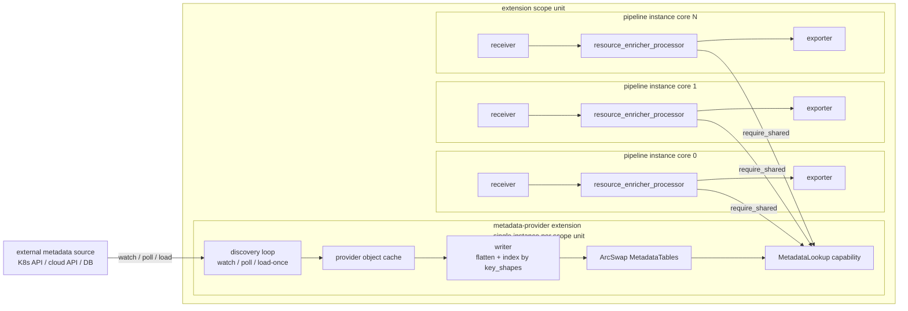

# Resource Enricher Processor Design

<!-- markdownlint-disable MD013 -->

**Status:** Draft

**Tracking issue:** [#3094](https://github.com/open-telemetry/otel-arrow/issues/3094)

**Processor URN:** `urn:otel:processor:resource_enricher`
**Extension URN (first provider):** `urn:otel:extension:k8s_metadata`

**Target crate:** `crates/contrib-nodes`
**Target processor module:** `crates/contrib-nodes/src/processors/resource_enricher_processor/`
**Target extension module (first provider):** `crates/contrib-nodes/src/extensions/k8s_metadata_extension/`

This design follows
[Reference-Informed OTAP-Native Capability Design](ai/reference-informed-otap-native-capability-design.md).
It assumes:

- the engine supports **shared extensions** (engine-scoped or
  pipeline-group-scoped) as described under future work in
  [Extension System Architecture](extension-system-architecture.md);
- shared extensions run on a **different async runtime** than the
  per-core processor runtimes (i.e. discovery loops, watch reconnects,
  cache rebuilds, and `set_index_spec()` back-fills do not contend for
  CPU with the data path). The capability surface is synchronous and
  non-blocking by design so the per-core processors never await on
  extension-side work; the extension's runtime is where the I/O- and
  compute-heavy work runs.

## Summary

The resource enricher processor enriches OTAP telemetry with resource
attributes pulled from an external metadata source — a Kubernetes cluster,
a cloud provider's resource-tag service, a database, etc.
It associates each inbound resource with a metadata record using a small,
ordered set of association rules, then projects fields from that record
onto the resource's attribute set.

The processor is **provider-neutral**. It never names a Kubernetes pod, an
AWS task, or any other provider concept. It builds a small lookup key out
of resource attributes, performs one synchronous lookup against an
immutable snapshot, and projects the returned flat record back onto the
resource. All provider-specific knowledge — how metadata is discovered,
cached, and flattened into records — lives below the capability boundary
in a provider extension.

The responsibility is split into two pieces:

1. **A metadata-provider extension** (first provider:
   `k8s_metadata_extension`) — an active, shared extension that owns the
   provider client, runs the discovery loop (watch / poll / load-once),
   maintains the in-memory metadata cache, flattens provider objects into
   provider-neutral `EnrichmentRecord` values, and exposes a
   `MetadataLookup` capability to bound processors. The extension is
   declared at either **engine scope** (one instance per collector
   process) or **pipeline-group scope** (one instance per named group),
   whichever fits the provider; see
   [Extension scope is a per-provider choice](#extension-scope-is-a-per-provider-choice).
2. **`resource_enricher_processor`** — an inline single-route processor
   that resolves each inbound `OtapPdata` resource to an `EnrichmentRecord`
   via the capability and writes the projected fields onto Arrow resource
   attribute batches.

The split is driven by two engine constraints:

- **Per-core duplication is unacceptable.** Processors are per-core; if
  the discovery loop and cache lived inside the processor, an N-core
  collector would open N watches/polls and hold N copies of the cache.
  The extension hosts both, shared above the per-core boundary.
- **Hot-path safety and runtime isolation.** `process()` runs on the
  per-core async runtime. Shared extensions run on a separate runtime,
  so discovery loops, watch reconnects, cache fills, and
  `set_index_spec()` back-fills never compete with the data path. The
  capability surface enforces this contract: every method is synchronous
  and returns immediately (`snapshot()` is one atomic load, `lookup()`
  is one map read, `set_index_spec()` schedules background work and
  returns). The processor never awaits extension work, even at
  `start()`, and the processor crate has no provider-client dependency.

The sharing unit — group vs. engine — is a per-provider operator
choice; see [Extension scope is a per-provider choice](#extension-scope-is-a-per-provider-choice).

## Goals

The v1 capability must:

- enrich logs, metrics, and traces with metadata from an external
  provider, expressed entirely through a provider-neutral capability;
- support **composite-key association** with ordered, first-match-wins
  rules over arbitrary resource attributes (not just single-string keys);
- support **projection** of arbitrary flat record fields (including glob
  expansion for label/annotation-style fan-out) onto resource attributes,
  with a configurable destination naming template;
- support a configurable **conflict policy** for destination attributes
  that already exist;
- ship a first provider (`k8s_metadata_extension`) that enriches from
  Kubernetes objects (pods, namespaces, nodes, and optionally
  deployments / statefulsets / daemonsets / jobs / replicasets /
  cronjobs);
- support associating by a connection peer address for socket-backed
  receivers, expressed generically (no provider vocabulary);
- operate correctly without ever blocking the per-core async runtime on
  provider API I/O;
- emit self-observability metrics through `MetricSet`.

## Non-Goals

The v1 capability does not include:

- a second concrete provider extension (the capability is
  provider-neutral by design, but only the Kubernetes provider ships in
  v1; other providers are future work);
- record-level (non-resource) attribute enrichment; v1 projects onto
  resource attributes only;
- OTTL-based key extraction; lookup keys are built from named resource
  attributes, not arbitrary expressions;
- `wait_for_metadata`-style startup blocking. The architecture cannot
  guarantee "cache fully warm for this processor's shapes before
  `process()` runs" — the processor's own `start()` is what tells the
  extension which index shapes and fields to populate, so gating on that
  deadlocks. A partial form may become possible once the framework gains
  a readiness-probe hook; see [Open Questions](#open-questions);
- provider-specific watch-narrowing beyond what the first provider's
  config exposes (e.g. the Kubernetes provider supports `node` and
  `namespace` narrowing only; field/label-selector narrowing is
  deferred).

These items are explicit deferrals, not silent omissions. The user-facing
contract must say so.

## Core Decisions

| Decision | Choice |
| --- | --- |
| Component shape | Provider extension (e.g. `k8s_metadata_extension`) + generic processor (`resource_enricher_processor`) |
| Capability surface | Provider-neutral `MetadataLookup`: `snapshot()`, `lookup()`, `set_index_spec(registrant, spec)`, `clear_index_spec(registrant)`. No provider vocabulary. |
| Extension scope | Per-provider operator choice between **engine scope** (one instance per collector) and **pipeline-group scope** (one instance per named group). Per-pipeline scope is rejected because the framework's pipeline-scoped extensions are themselves per-core, so it would mean per-core duplication. See [Extension scope is a per-provider choice](#extension-scope-is-a-per-provider-choice). |
| Sharing model | `Active + Shared` extension. Exactly one instance per scope unit. Per-pipeline processors bind via `require_shared` and hold a `Send + Clone` capability handle whose internal state is an `Arc<ArcSwap<MetadataTables>>`. |
| Lookup key | Composite: an AND of `(resource_attribute_name, value)` pairs (`LookupKey`). |
| Returned record | Provider-neutral flat `EnrichmentRecord` (dotted field name → `EnrichmentValue`). |
| Hot-path contract | Capability lookups are constant-time, synchronous, and never block. |
| Index spec | Processors declare `key_shapes` + `record_fields` via `set_index_spec(registrant, spec)`. The extension stores one spec per registrant (`(pipeline_group_id, pipeline_id, node_id)`) and uses the **union** as its effective spec; `clear_index_spec` happens automatically when the last per-core handle for a registrant is dropped. See [Index spec registration](#index-spec-registration). |
| Connection peer | Supported via `OtapPdata::peer_addr()` from socket-backed receivers; bound generically via `sources_from_connection:` (see [Connection-Peer Association](#connection-peer-association)). |
| Conflict policy | `keep_existing` (default) / `overwrite` / `merge_string_lists`. |
| Live reconfiguration | Receives `NodeControlMsg::Config { config }`. Extension and processor reloads are independent. See [Live Reconfiguration](#live-reconfiguration). |
| Startup readiness | Processor is always ready; cache fill is asynchronous and reported via metrics. |
| Telemetry | `MetricSet`-backed counters and gauges for cache size, discovery events, lookup hit/miss, and back-fill progress. |

## Architecture



Flow on the data path:

1. Receiver emits `OtapPdata` with `resource` attributes that include at
   least one of the configured association sources (e.g. `k8s.pod.uid`).
2. Processor walks `associations` rules in order. The first rule whose
   sources are all present on the resource is used. Each rule's source
   values are joined into a `LookupKey`.
3. On a hit, the processor reads the returned `EnrichmentRecord` and
   applies the configured projection to the resource attribute Arrow
   batch in place, honoring the conflict policy.
4. On a miss, the processor records `enrich.lookup.miss` and forwards the
   resource unchanged.
5. The processor never awaits provider I/O on the hot path.

Flow on the control path:

1. The engine starts each provider extension exactly once per scope unit
   (engine or pipeline group, per the provider's declared scope) before
   any consumer in that scope unit starts. The extension builds the
   provider client, constructs the discovery loop, and spawns the
   background task. The framework guarantees a single instance per
   `(scope unit, extension name)` pair; two configurations with the same
   name at the same scope unit are rejected, while two configurations at
   different scope units (e.g. the same name in two different groups)
   yield two independent instances.
2. The background task discovers metadata objects. The initial list /
   poll / load is buffered and swapped into the lookup snapshot
   atomically when it completes; incremental apply/delete events stream
   in after that and update the snapshot in place.
3. As pipelines start up, each per-core processor resolves the bound
   extension via `require_shared` and calls `set_index_spec()` (see
   [Index spec registration](#index-spec-registration)). The handle
   wraps `Arc<ArcSwap<MetadataTables>>`; per-core processors read by
   loading the current `Arc<MetadataTables>` once per `process()` call.
   The shared read crosses no core boundary — it is a single atomic
   pointer load into the processor's stack — and the snapshot itself is
   `Send + Sync` immutable data.
4. The shutdown path drains data-path nodes first, then signals the
   extension to stop the discovery task and drop the client. The engine
   drains every consumer in the scope unit, then shuts down the
   extensions in that scope unit, per the ordering contract in
   [Extension System Architecture](extension-system-architecture.md).

## Component Boundaries

| Concern | Lives in |
| --- | --- |
| Provider client construction | extension |
| Discovery loop (watch / poll / load-once) | extension |
| Provider object cache | extension |
| Flattening provider objects into `EnrichmentRecord` | extension |
| Index by `key_shapes`; materialize `record_fields` | extension |
| Provider-specific behaviors (hierarchy traversal, heuristics, ID normalization, special-case projections) | extension |
| Capability surface (`MetadataLookup`) | extension |
| Discovery self-observability (event counts, errors, cache sizes) | extension |
| Association rule evaluation | processor |
| Projection (record field → resource attribute) | processor |
| Projection-plan compilation (glob / template pre-compile) | processor (config-time) |
| Conflict-policy application | processor |
| Lookup hit/miss telemetry, attribute-write counts | processor |
| Index-spec derivation and registration | processor |
| Live reconfiguration of association + projection rules | processor |

The extension owns nothing that depends on a specific pipeline's data
schema. The processor owns nothing that depends on the provider's runtime
state or vocabulary.

## `MetadataLookup` capability

The capability is intentionally narrow and provider-neutral: a generic
composite-key lookup, a per-batch snapshot accessor that gives the
processor one stable view across an entire `process()` call, and a
config-time `set_index_spec()` / `clear_index_spec()` pair that
processors use to declare — per registrant — what to index by and what
fields to materialize (see [Index spec registration](#index-spec-registration)
for why this lives on the capability surface rather than inside
extension config, and why it is multi-registrant).

```rust
// A single lookup key: an AND of (resource_attribute_name, value) pairs.
type LookupKey = Vec<(String, String)>;

// The field names used in a LookupKey — names only, no values.
// The extension uses this to know what to index by.
type KeyShape = Vec<String>;

// A single primitive value the processor can write as a resource
// attribute. The extension picks the type; the processor writes it
// through.
enum EnrichmentValue {
    String(String),
    Bool(bool),
    Int(i64),
    Double(f64),
    Bytes(Vec<u8>),
    // arrays of the above for label/annotation expansions
}

// A flat map of dotted field names to values. The provider extension
// flattens its object hierarchies into this shape. Example fields a
// Kubernetes provider might produce:
//   "pod.uid"           -> "abc-123"
//   "pod.name"          -> "foo-77d"
//   "pod.start_time"    -> RFC3339 string
//   "pod.labels.app"    -> "checkout"
//   "namespace.name"    -> "shop"
//   "deployment.name"   -> "foo"
//   "node.name"         -> "node-1"
type EnrichmentRecord = HashMap<String, EnrichmentValue>;

// Opaque snapshot — an Arc<...> over the extension's immutable
// MetadataTables. Processors hold it for the duration of one process()
// call.
struct MetadataSnapshot { /* extension-private */ }

trait MetadataLookup {
    /// Take a snapshot once per process() call. Cheap atomic load.
    fn snapshot(&self) -> MetadataSnapshot;

    /// Single hot-path lookup. Returns a ready-to-project record or None.
    /// No provider vocabulary; the extension dispatches internally on the
    /// shape of `key` to find the right pre-built record.
    fn lookup(
        &self,
        snapshot: &MetadataSnapshot,
        key: &LookupKey,
    ) -> Option<&EnrichmentRecord>;

    /// Config-time only. Declare what to index by and what to store on
    /// behalf of `registrant`. Set-replacing per registrant: the
    /// extension stores `Map<RegistrantId, IndexSpec>` and the
    /// effective spec is the union across all registrants. Diffs the
    /// union before vs. after, back-fills additions, drops removals,
    /// and starts/stops discovery sources accordingly. Idempotent per
    /// registrant. Returns immediately; back-fill runs on the
    /// extension's runtime. Never called from `process()`.
    /// See [Index spec registration](#index-spec-registration).
    fn set_index_spec(&self, registrant: RegistrantId, spec: &IndexSpec);

    /// Explicit reset of a registrant's contribution. Idempotent and
    /// normally NOT needed: the extension refcounts outstanding
    /// capability handles per `RegistrantId` and clears automatically
    /// when the last handle drops. Provided for processors that want
    /// an explicit reset.
    fn clear_index_spec(&self, registrant: RegistrantId);
}

// Identity of the caller that declared a spec. Derived from
// `PipelineContext`. The (group, pipeline, node) triple uniquely
// identifies a processor config in the engine; per-core replicas of
// one triple share byte-identical config and collapse to one
// registrant (see Per-core fan-in). core_id is omitted so the
// collapse is trivial.
struct RegistrantId {
    pipeline_group: PipelineGroupId,
    pipeline:       PipelineId,
    node:           NodeId,
}

// What the processor declares to the extension at config time.
// Both fields are derived from the processor's own config:
//   key_shapes    <- associations[].sources   (names only)
//   record_fields <- projection[].from        (dotted paths; globs ok)
struct IndexSpec {
    /// What to index by. One KeyShape per association rule.
    key_shapes: Vec<KeyShape>,
    /// What dotted fields to materialize into each EnrichmentRecord.
    /// Globs allowed, e.g. "pod.labels.*". The extension also uses these
    /// (plus key_shapes) to decide which provider sources to start — e.g.
    /// a "deployment.*" field or key starts the deployment informer in
    /// the Kubernetes provider.
    record_fields: Vec<String>,
}
```

All methods take `&self` and never block. The processor resolves the
capability once at node construction and holds the typed handle for
its lifetime; no runtime capability resolution on the hot path. The
handle wraps `Arc<ArcSwap<MetadataTables>>`: every per-core processor
loads the current `Arc<MetadataTables>` once per `process()` call —
a single atomic pointer load — and reads from the same cell the writer
updates. No `Mutex` / `RwLock` on the read path.

### Cache structure

The provider extension keeps its own object cache (for the Kubernetes
provider, one `kube_runtime::reflector::Store<K>` per watched kind). That
cache is the writer-side source of truth; the lookup snapshot is a
projection derived from it.

The lookup snapshot is one struct published as a single immutable
snapshot:

```rust
// Extension-internal type.
struct MetadataTables {
    /// The only public-facing index. Keyed by the full LookupKey shape
    /// the processor's associations declared; the value is a flattened,
    /// provider-neutral EnrichmentRecord.
    by_key: HashMap<LookupKey, Arc<EnrichmentRecord>>,

    // Provider object caches stay private — used only by the writer to
    // build and refresh `by_key`.
}
```

`MetadataTables` is held inside an `ArcSwap<MetadataTables>` that lives on
the extension instance. The writer applies discovery deltas into a
builder, then atomically swaps the new `Arc<MetadataTables>` into the
cell; readers load the current `Arc` through the capability's
`snapshot()` method exactly once per `process()` call and use that handle
for every resource in the batch. This keeps the hot path lock-free and
allocation-free, and gives each batch a consistent view even if the
writer publishes a new snapshot mid-call. The framework-level uniqueness
guarantee (one instance per scope unit) is the source of "exactly one
cache per scope unit."

The writer's job, on every object update, is: read the already-cached
related objects, pull exactly the `record_fields` from the active
`IndexSpec` into one `Arc<EnrichmentRecord>`, and insert one `by_key`
entry per `key_shape` that resolves on that object (all pointing at the
same `Arc`). Two objects sharing the same record share storage; multiple
key shapes for the same object share its single record (so
`[pod.uid → X]` and `[pod.name, namespace.name → X]` point at the same
`Arc`). Memory cost is one `EnrichmentRecord` per object plus one
`HashMap` entry per object per key shape.

All provider-specific record-building behavior — hierarchy flattening,
ID normalization, name-derivation heuristics, special-case projections —
happens inside the writer. None of it leaks into the trait.

## Configuration

Configuration is OTAP-native. The processor's `nodes:` config block lives
inside a pipeline as usual. The provider extension's config block is
declared at pipeline-group scope and is bound by name from any pipeline in
the same group.

### Processor config (generic)

No provider vocabulary. Three blocks: associations (which keys to look up
by, in priority order), projection (what to write back where), and
conflict policy.

```yaml
nodes:
  enrich_resource:
    type: processor:resource_enricher
    capabilities:
      metadata: k8s_metadata            # binds the group-scoped extension
    config:
      # ----- Association rules -----
      # Each rule is a composite AND of source resource attributes.
      # First rule whose sources are all present on the resource wins
      # (first-match, even on miss).
      associations:
        - sources: [k8s.pod.uid]
        - sources: [k8s.pod.name, k8s.namespace.name]
        - sources: [k8s.pod.ip]
        - sources: [container.id]

      # Generic "use peer address if the resource has no matching
      # attribute" rule. Optional; only meaningful for socket-backed
      # receivers. See Connection-Peer Association.
      sources_from_connection:
        - attribute: k8s.pod.ip          # bind peer IP to this attribute
                                         # name if the resource does not
                                         # already have it.

      # ----- Projection -----
      # Map fields from the EnrichmentRecord onto resource attributes.
      # `from` is a record-field name (or glob). `to` is the destination
      # resource-attribute name (template-expandable).
      projection:
        - { from: "pod.uid",          to: "k8s.pod.uid" }
        - { from: "pod.name",         to: "k8s.pod.name" }
        - { from: "pod.start_time",   to: "k8s.pod.start_time" }
        - { from: "namespace.name",   to: "k8s.namespace.name" }
        - { from: "deployment.name",  to: "k8s.deployment.name" }
        - { from: "node.name",        to: "k8s.node.name" }
        - { from: "pod.labels.*",     to: "k8s.pod.label.{name}" }
        - { from: "pod.annotations.git-commit", to: "git.commit" }

      # Shorthand: applies a provider-curated mapping in a single line.
      # Equivalent to an expanded `projection:` list; mutually exclusive
      # with `projection:`. See preset.
      # preset: k8s_v1_default

      # ----- Conflict policy -----
      # What to do when the destination resource attribute already exists.
      conflict_policy: keep_existing    # | overwrite | merge_string_lists
```

Field-name templates use `{name}` to interpolate the part of the `from:`
glob that matched.

The processor compiles its `associations:` into `key_shapes` and its
`projection:` into `record_fields`, and declares both in one
`set_index_spec(registrant, spec)` call at `start()` (and again on
reload, which replaces this registrant's contribution; the extension
drops any key shape or field no longer required by any registrant).
On shutdown the processor simply drops its capability handle; the
extension refcounts handles per registrant and clears the
registrant's contribution automatically when the last per-core replica
exits (see [`MetadataLookup` capability](#metadatalookup-capability)
on `clear_index_spec`). The `sources_from_connection:` block lets the
processor synthesize a key value from the batch's peer address before
lookup.

### Extension config (Kubernetes provider)

Provider-specific. The Kubernetes provider recommends pipeline-group
scope (see
[Extension scope is a per-provider choice](#extension-scope-is-a-per-provider-choice));
the example below shows that form. The extension config holds **only
non-field knobs** — connection/auth, discovery tuning, filtering,
exclusions — plus provider behavior toggles. It does **not** contain a
field list: which fields to store and which discovery sources to start
are derived from the processor's `IndexSpec` (`record_fields` +
`key_shapes`), so there is no `extract:` block to keep in sync with
processor output.

```yaml
pipeline_groups:
  agent_node_local:
    # Group-scoped extension. Instantiated once per group; bound by name
    # from any pipeline in this group.
    extensions:
      k8s_metadata:
        type: extension:k8s_metadata
        config:
          # ----- Discovery / authentication / watch behavior -----
          auth_type: service_account            # service_account | kube_config
          kube_config:
            path: ~                              # optional
            context: ~                           # optional
          api:
            qps: 5
            burst: 10
          filter:
            node_from_env_var: KUBE_NODE_NAME    # OR filter.node
            namespace: ~                          # optional single-namespace narrowing
          pod_delete_grace_period: 120s
          watch_sync_period: 0s                  # 0s disables resync; default
          exclude:
            pods:
              - name: jaeger-agent
              - name: jaeger-collector

          # ----- Provider behavior toggles (not a field list) -----
          # K8s-specific behavior that cannot be derived from projection
          # paths. Stays here because it changes HOW the record is built,
          # not WHICH fields it contains.
          otel_annotations: true
```

A second group declares its own extension instance with its own config
(e.g. different namespace narrowing or `ServiceAccount`); pipelines in
that group bind by the local name and see a different cache.

### Provider parity

Swapping providers is a config change. The processor binds a different
extension by name and its `projection` references the new provider's
field names; the trait, hot path, and telemetry are identical. v1 ships
only `k8s_metadata`; other providers can be added later when requested
or when need arises (see [Non-Goals](#non-goals)).

### Config rules

- `serde(deny_unknown_fields)` on every config struct.
- Each `associations` rule has at least one source; the maximum is 4.
- Within a rule, sources are evaluated as an AND; the first rule with all
  sources present on the resource is used. If that rule's lookup misses,
  no further rules are tried (first-match wins, even on miss).
- `associations` must be non-empty; v1 requires at least one explicit
  rule rather than picking a default chain on the user's behalf.
- `projection` and `preset` are mutually exclusive; exactly one must be
  present.
- A projection `from:` glob may contain at most one `*`; `to:` may
  reference the matched segment via `{name}`.
- A `to:` without a `{name}` template, paired with a glob `from:`, is a
  config error (the fan-out would collide on one destination).
- The extension must be declared at either engine scope or pipeline-group
  scope, depending on the provider's recommendation. Per-pipeline scope
  is always rejected at config validation because it would force per-core
  duplication of the discovery loop and cache. The Kubernetes provider
  recommends group scope (see
  [Extension scope is a per-provider choice](#extension-scope-is-a-per-provider-choice)).
- A processor's `capabilities:` binding may reference any shared extension
  visible to its pipeline — either an engine-scoped extension or a
  group-scoped extension declared in the same group. Cross-group bindings
  to another group's group-scoped extension are rejected.
- Within a scope unit, an extension `name:` is unique; two declarations
  with the same name at the same scope unit are rejected.

## Association

Association is the rule engine that maps `OtapPdata` resource attributes
to an `EnrichmentRecord` in the extension's cache. The semantics are:

- **Rule selection by attribute presence.** The processor evaluates the
  configured rule list in order and picks the first rule whose source
  attributes are all present on the resource.
- **Single lookup, no fallback.** The chosen rule's source values form a
  composite `LookupKey`. Exactly one lookup is performed; a miss does not
  fall through to later rules (first-match wins, even on miss).
- **Empty `associations` is a config error.** v1 requires at least one
  explicit rule rather than picking a default chain on the user's behalf
  — the right chain depends on whether the upstream source is
  socket-backed, file-based, or already-enriched gateway traffic.

The processor reads each rule's referenced attribute names from the Arrow
resource attribute batch via
[`otap_df_pdata::otap::transform::apply_attribute_transform`](https://github.com/open-telemetry/otel-arrow/blob/main/rust/otap-dataflow/crates/pdata/src/otap/transform.rs)-style
helpers, batched across resources to avoid per-row dispatch. Per-rule
attribute name sets are precomputed at `Config` time into a single
rule-scan plan so the hot path performs at most one O(R) pass per resource
(R = referenced attribute names).

### Composite-key index model

v1 uses a single composite-key map (`by_key`; see
[Cache structure](#cache-structure)) rather than a set of per-attribute
indexes, for two reasons:

1. **User-extended sources.** Any record field the provider exposes can be
   an association source. Hard-coded per-key indexes cannot represent
   that.
2. **Composite rules.** A `(k8s.pod.name, k8s.namespace.name)` rule is a
   composite. A composite-key map keeps lookups constant-time without
   needing a join.

The extension's writer inserts one `by_key` entry per object for every
`key_shape` in the effective `IndexSpec` (the union across all
registrants) that resolves on that object.

### Index spec registration

The writer can only populate `by_key` entries for the shapes it knows
about, and can only materialize the record fields it is told to. Both come
from the processor's config, declared through `set_index_spec()`.

#### Framework constraint

The extension does **not** see processor configs at its own `start()`. The
extension system wires capabilities in one direction — consumers pull from
extensions through typed handles — and the engine builds the extension
from its own `extensions:` config block alone. There is no framework
pathway that delivers "the union of association shapes and projection
fields referenced by every bound processor" to the extension at
construction time, and reusing the engine-driven `ExtensionControlMsg`
lifecycle channel for node-to-extension calls would invert the
architecture.

The only architecture-legal channel for processor-to-extension
communication is the capability handle, so index-spec declaration lives
on the trait. The flow:

1. At `start()`, the processor builds its `RegistrantId` from
   `PipelineContext` (`pipeline_group_id`, `pipeline_id`, `node_id`),
   compiles `associations` → `key_shapes` and `projection` →
   `record_fields`, and calls `set_index_spec(registrant, spec)`.
2. On `NodeControlMsg::Config` reload, the processor re-derives the spec
   and calls `set_index_spec` again under the same registrant
   (set-replacing for that registrant).
3. On shutdown the processor drops its capability handle; the extension
   refcounts handles per registrant and clears the contribution
   automatically when the last per-core handle drops.
4. The extension keeps `Map<RegistrantId, IndexSpec>` and recomputes
   the **union** of all entries on every call. The union diff drives
   back-fill of added shapes/fields, drop of removed ones, and
   start/stop of discovery sources implied by required fields (e.g. a
   `deployment.*` field starts the Kubernetes deployment informer).
   Back-fill runs on the extension's runtime;
   `enrich.index.rebuild_pending` reports in-flight rebuilds.

#### Consequence: ordering and first-lookup misses

Because `set_index_spec()` is a capability call from the processor, the
spec reaches the extension **after** its `start()` and after initial
discovery has begun. Lookups using a newly-declared shape or field miss
until the back-fill completes and are counted in `enrich.lookup.miss`;
steady state is "all declared shapes hit." The processor cannot wait
for extension start — the framework already guarantees that ordering —
and cannot wait for the cache to be warm without coupling pipeline
readiness to provider-API latency (reported as telemetry instead).

#### Per-core fan-in and per-pipeline independence

The engine clones one pipeline definition per allocated core, so all N
per-core replicas of a `(group, pipeline, node)` triple have
byte-identical config and call `set_index_spec` with the same
registrant and the same spec. The first call installs; the remaining
N − 1 see no change and return immediately. One processor node, one
registrant entry, no duplicate index work.

Different processors stay independent because they have different
registrants — a different `node_id` (two enrichers in the same
pipeline), `pipeline_id` (different pipelines in the same group, which
the engine permits with independent configs), or `pipeline_group_id`.
A spec change by one registrant only edits its own entry; the union
the extension publishes is recomputed. This is what makes engine-scoped
extensions safe under divergent specs from anywhere in the process.

## Projection

Projection writes record fields onto the resource attribute Arrow batch in
place. Each `projection` entry maps a record `from:` field (or glob) to a
destination `to:` resource-attribute name (template-expandable).

- A plain `from:` (e.g. `pod.uid`) writes that single record field to the
  `to:` attribute if the field is present in the looked-up record.
- A glob `from:` (e.g. `pod.labels.*`) fans out: every record field
  matching the glob is written, with `{name}` in the `to:` template
  replaced by the matched segment (e.g. `pod.labels.app` →
  `k8s.pod.label.app`).
- Fields absent from the record are skipped silently (no destination
  attribute written).

The set of `from:` paths across all projection entries is exactly the
`record_fields` the processor declares in its `IndexSpec`, so the
extension materializes precisely what some processor projects — nothing
more.

The projection plan (glob matchers and destination templates) is
pre-compiled at `start()` from the `projection:` config and recompiled on
`NodeControlMsg::Config` reload.

### Conflict policy

When a destination resource attribute already exists on the resource, the
configured `conflict_policy` decides:

- `keep_existing` (default) — leave the existing value; skip the write.
- `overwrite` — replace the existing value with the projected one.
- `merge_string_lists` — when both existing and projected values are
  string lists, concatenate and de-duplicate; otherwise fall back to
  `keep_existing`.

## Connection-Peer Association

Some receivers observe a connection peer address that is only available at
the receiver — by the time a batch reaches a processor, the originating
socket is gone — so it is propagated on `OtapPdata` itself via
`OtapPdata::peer_addr()`.

A `sources_from_connection:` entry binds the peer IP to a named resource
attribute *if the resource does not already carry that attribute*. The
processor synthesizes the value before evaluating `associations`, so a
rule like `sources: [k8s.pod.ip]` can match on the connection peer when
the resource itself lacks `k8s.pod.ip`. If the batch has no peer address
(non-socket receiver, or the receiver did not set it), the synthesis is
skipped and the rule is treated as not-matching, the same way an absent
resource attribute is. This keeps the first-match-wins semantics
consistent.

This is expressed generically — no provider vocabulary. The provider
extension is responsible for indexing whatever record corresponds to that
attribute value (for the Kubernetes provider, the pod whose `status.podIP`
matches).

### Caveats

- Connection IP is not always the originating client's IP: in the presence
  of NAT, load balancers, or service meshes the observed peer is the last
  hop, not the workload. Operators relying on this association need to know
  their network topology.
- Whether a given peer IP can be disambiguated to exactly one record is a
  provider concern (e.g. the Kubernetes provider cannot disambiguate
  `hostNetwork` pods, whose `status.podIP` is the node IP).

## Cache and Memory Model

Memory usage scales with the provider's object count and the configured
projection. The provider extension exposes the levers that matter; for the
Kubernetes provider:

- node-scoped filtering (default for agent deployments) holds only the
  pods scheduled on the local node;
- namespace-scoped filtering holds only the pods in the named namespace;
- label/annotation projection is the dominant per-object cost; the
  extension stores only the fields the effective `IndexSpec` lists
  (the union of every registrant's `record_fields`; others are dropped
  at index time);
- discovery sources that are off by default are started lazily, driven by
  the spec.

Per-object overhead is one `EnrichmentRecord` plus one index entry per key
shape. Records are `Arc`-shared across key shapes for the same object.
These are design targets, not contractual guarantees; each extension
instance's footprint scales with what its filter admits and what its
bound processors project, independent of other extension instances in
the process.

## Extension scope is a per-provider choice

The capability surface is identical regardless of where the extension
lives. What changes between scopes is the framework binding rules, the
blast radius of restarts and back-fills, and how many discovery loops
run in a multi-group collector. Each provider extension documents its
supported scopes and recommendation.

### Pipeline-group scope

Recommended when the provider's discovery loop is naturally scoped by
something groups vary — filter / region / account / namespace, client
identity, or any case where restart and back-fill blast radius should
be bounded to one group. The Kubernetes provider
(`k8s_metadata_extension`) is the canonical case: agent-mode groups
want node-narrowed watches, control-plane groups want
namespace-narrowed watches, and different groups may need different
`ServiceAccount` identities. **Group scope is the recommended default
for the Kubernetes provider.**

If two groups in a process happen to need identical enrichment from a
group-scoped provider, the operationally simple answer is to declare
the extension in each group and pay for two discovery loops;
independent reloads and telemetry usually outweigh the duplication.
Merge the groups or pick an engine-scoped provider variant if one loop
is actually required.

### Engine scope

Appropriate when the discovery is naturally one-per-collector — a
read-only file/DB load, or any provider whose client identity and scope are fixed
at the process level. Avoids redundant discovery; the cost is a wider
blast radius for reloads and back-fills (every binding pipeline sees
a transient miss window during a restart or a union-growing
`set_index_spec()` call).

### Binding rules (any scope)

- The extension's `start()` runs before any consumer in its scope unit
  resolves the capability.
- Exactly one instance per scope unit.
- Pipelines in the scope unit drain before the extension shuts down.
- A processor may bind any shared extension visible to its pipeline —
  its group's own group-scoped extensions plus all engine-scoped
  extensions. Cross-group binding to another group's group-scoped
  extension is rejected.

A provider may support both scopes; the operator picks at config time.

## Telemetry

The extension reports through `MetricSet`:

| Metric | Type | Labels | Notes |
| --- | --- | --- | --- |
| `enrich.cache.entries` | Gauge | `kind` | Objects currently cached, by provider kind. |
| `enrich.discovery.events` | Counter | `kind`, `event` (`apply`/`delete`/`restart`) | Discovery event stream. |
| `enrich.discovery.errors` | Counter | `kind`, `reason` | Restart / error cause counts. |
| `enrich.api.requests` | Counter | `verb` | Provider API calls. |
| `enrich.index.rebuild_pending` | Gauge | -- | Index back-fills currently in flight; non-zero during the first lookups after a processor introduces a new shape or field (see [Index spec registration](#index-spec-registration)). |

The processor reports through `MetricSet`:

| Metric | Type | Labels | Notes |
| --- | --- | --- | --- |
| `enrich.lookup.attempts` | Counter | `rule_index` | One per resource visited. |
| `enrich.lookup.hits` | Counter | `rule_index` | First-match hit count by rule. |
| `enrich.lookup.miss` | Counter | `rule_index` | First-match miss count by rule. |
| `enrich.attribute.applied` | Counter | `policy` (`written`/`kept`/`overwritten`/`merged`) | Attribute writes by conflict-policy outcome. |

Provider extensions may emit additional provider-specific metrics
(e.g. the Kubernetes provider's API rate-limit wait histogram and
pod-delete grace-queue gauge) under their own namespaces.

## Lifecycle

### Startup

1. The engine starts each provider extension once per scope unit. The
   extension builds its provider client and starts default discovery
   sources; sources off by default are deferred until
   `set_index_spec()` requires them.
2. The engine starts pipelines. Each per-core processor resolves the
   capability via `require_shared`, compiles its plans, derives its
   `IndexSpec`, and calls `set_index_spec()`. The call returns
   immediately; back-fill runs on the extension's runtime and lookups
   for newly-declared shapes may miss until it completes (see
   [Consequence: ordering and first-lookup misses](#consequence-ordering-and-first-lookup-misses)).
3. The pipeline reaches Ready. Telemetry flows immediately;
   `enrich.lookup.miss` rises until cache fill completes.

The pipeline is deliberately not blocked on cache fill: coupling
readiness to provider-API responsiveness mixes two failure domains.

### Shutdown

1. The engine sends `shutdown` to data-path nodes in every pipeline
   that binds the extension; each processor finishes its current
   `process()` and drops its capability handle. The extension refcounts
   handles per `RegistrantId` and clears the registrant's contribution
   automatically when the last per-core handle for a
   `(group, pipeline, node)` drops, dropping its index entries and
   stopping discovery sources only it required.
2. After every consumer in the scope unit drains, the engine shuts
   down the extension. It cancels discovery tasks, drops the provider
   client, and returns.

### Live Reconfiguration

The processor handles `NodeControlMsg::Config { config }` (same
mechanism as `attributes_processor` et al.): re-parse, recompile plans,
re-derive `IndexSpec`, and call `set_index_spec(registrant, spec)`
under the stable `RegistrantId`. The extension subscribes to the same
message for its own config. Because the extension lives outside any
pipeline, extension and processor reloads are independent.

| Config field | Hot-swappable | Owner |
| --- | --- | --- |
| `associations`, `projection` / `preset` | Yes | Processor (atomic plan publish; calls `set_index_spec`) |
| `conflict_policy`, `sources_from_connection` | Yes | Processor |
| Provider discovery / auth / filter knobs | Provider-dependent | Extension; restart-required knobs restart discovery for every binding pipeline |
| Provider behavior toggles | Provider-dependent | Extension |

Reconfigurations that require an extension restart have a blast radius
bounded to the scope unit (the group for group-scoped, the process for
engine-scoped) and are surfaced as explicit reload errors rather than
half-applied changes.

## Validation Expectations

Per
[Reference-Informed OTAP-Native Capability Design](ai/reference-informed-otap-native-capability-design.md),
validation focuses on user-facing scenarios.

First useful end-to-end scenario (Kubernetes provider):

- DaemonSet collector on a Kubernetes node;
- filelog receiver tailing `/var/log/pods/*` and producing resource
  attributes including `k8s.pod.uid`, `k8s.pod.name`, `k8s.namespace.name`,
  `container.id`;
- the `k8s_metadata` extension scoped to the local node only;
- `resource_enricher_processor` associating by the default shapes and
  projecting the default metadata set plus container-level fields;
- an exporter (debug or OTLP) verifies the projection.

Additional scenario coverage:

- gateway-mode pipeline associating by `k8s.pod.ip` set upstream by an
  agent;
- label and annotation projection via glob `from:` with `{name}` templating;
- projection onto an existing attribute under each `conflict_policy`
  (`keep_existing` / `overwrite` / `merge_string_lists`);
- live reconfiguration of `associations` / `projection` does not require
  restart and the next processed resource uses the new plan;
- a provider restart-required knob change is rejected with a clear error;
- **scope blast radius.** Run two pipelines on a 4-core collector in the
  same group binding the same group-scoped extension: verify one
  discovery loop and one cache (via `enrich.discovery.events` and
  `enrich.cache.entries` not double-counting). Then run two groups each
  with its own group-scoped extension: verify restarting one group's
  extension does not disturb the other. For an engine-scoped extension
  bound by pipelines in two groups, verify one loop and that a reload
  causes a miss window in every binding pipeline;
- **`set_index_spec()` back-fill and first-lookup miss.** Start with one
  pipeline using one association shape against a provider with many
  existing objects; add a second pipeline at runtime whose `associations`
  references a new shape. Verify `enrich.index.rebuild_pending` rises
  then falls, `enrich.lookup.miss` is non-zero during back-fill, and
  subsequent lookups using the new shape hit. Verify another group's
  extension is unaffected.

Robustness coverage:

- the processor never panics, even when the extension publishes an empty
  snapshot or when the cache shrinks mid-`process()`;
- the extension survives provider-API unavailability for at least the
  documented backoff window without leaking tasks or sockets;
- cache memory does not grow unbounded under churn: a stress test churns
  objects at 100 events/s for 10 minutes and the steady-state cache size
  remains bounded by the object count and the provider's grace settings.

## Open Questions

1. **Readiness-probe hook in the extension framework.** A
   `wait_for_metadata`-style startup gate requires the engine to support
   opt-in extension readiness probes that gate data-path node startup.
   Even with that hook, the guarantee would be partial: "initial
   discovery complete" can be signalled before processors start, but
   "processor-declared shapes populated" cannot, because that depends on
   `set_index_spec()` which can only be called *after* the processor
   starts (cycle). Open: ship without a gate, or ship a partial form
   (initial discovery only) once the hook lands, with the first-lookup
   miss window documented as unavoidable.
2. **Avoiding mandatory first-lookup misses.** A guaranteed miss window
   exists for any newly-introduced shape/field because the extension
   learns of it only after the processor calls `set_index_spec()`.
   Alternatives, all with tradeoffs:
   - **Engine pre-resolution.** Inspect the union of bound processors'
     configs and pass it to the extension at construction. Removes the
     window but breaks one-direction wiring; requires a new framework
     feature.
   - **Lazy indexing on lookup.** Cache full object blobs, compute keys
     on demand. Removes spec registration but turns the hot path from
     O(1) into O(K) per lookup — unacceptable.
   - **Pre-list pump at extension start.** Synchronous initial discovery
     held generically until first `set_index_spec()`. Shrinks the window
     to hash insertions; same complexity class, smaller constant.
3. **`preset` location and expansion timing.** A `preset: k8s_v1_default`
   expands to a concrete `projection` (and therefore concrete
   `record_fields` + `key_shapes`). Two coupled questions: (a) do preset
   tables live in the processor as built-in definitions, or are they
   exported by each provider extension and merely named by the processor?
   (b) does expansion happen in the processor before building the
   `IndexSpec` (extension stays dumb), or is the preset name carried in the
   `IndexSpec` and expanded by the provider extension (lets each provider
   own its preset tables)? Choice (b)/extension-expansion keeps the
   processor truly provider-agnostic at the cost of an indirection.
4. **`EnrichmentValue` type set.** The v1 set (String, Bool, Int, Double,
   Bytes, and arrays of those) covers everything Kubernetes labels and
   annotations can carry. Future providers may want richer types (maps,
   timestamps, durations). Worth deciding the v1 set now to avoid
   trait-level breakage later.
5. **Lookup return type.** `Option<&EnrichmentRecord>` borrows from the
   snapshot — the cleanest hot-path shape, but means the snapshot guard
   must outlive every lookup. The alternative `Option<Arc<EnrichmentRecord>>`
   always clones an `Arc` but is simpler ownership-wise. Worth picking one
   before the trait stabilizes.
