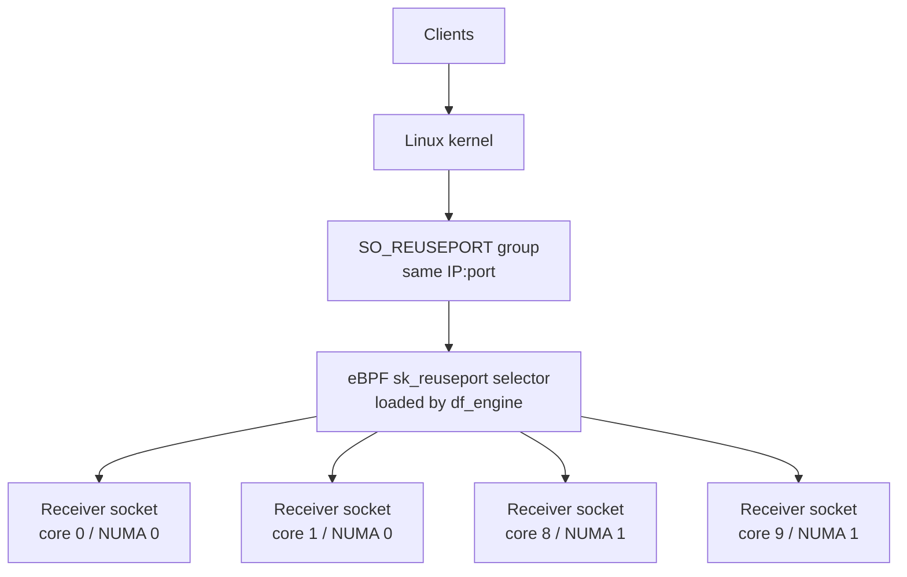
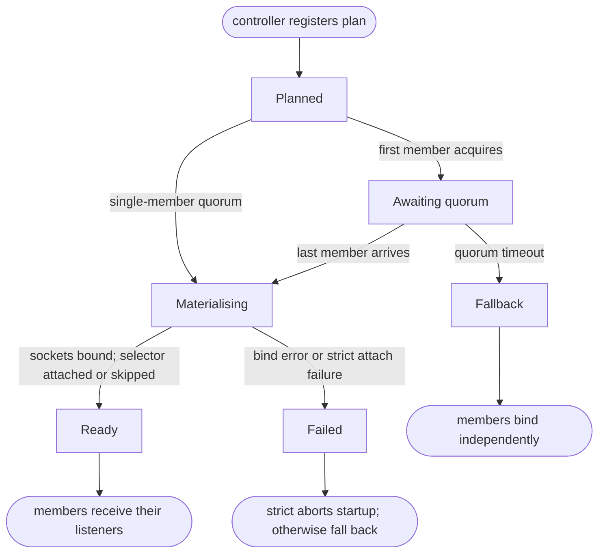
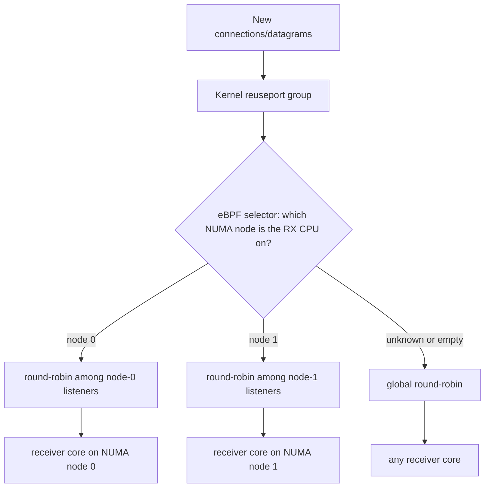

# NUMA-Local Reuseport Load Balancing: Design Proposal

> Status: Proposed. This is a design proposal for review. It describes a
> plan and intended behavior; it does not assume any of it is built yet.

## Motivation

The df-engine runs one receiver pipeline per core, and those per-core
receivers can bind the same address with `SO_REUSEPORT`. Today the Linux
kernel decides which listener receives each new TCP connection (or UDP
datagram) using its default reuseport hash. That is simple and correct,
but it has two shortcomings for our workloads:

- With a small number of long-lived TCP connections, the default hash can
  place connections unevenly, leaving some receiver cores idle while
  others are hot.
- The default hash is not NUMA-aware. On a multi-socket host a connection
  whose RX interrupt landed on NUMA node 0 may be handed to a receiver
  pinned to a core on NUMA node 1, paying cross-node memory traffic for
  the life of the connection.

This document proposes an optional, Linux-only mechanism that makes new
connection (and datagram) placement more even per core, and NUMA-local
when possible, while preserving today's behavior by default.

## Review Focus

This proposal is primarily asking for feedback on:

1. Whether the three-phase approach is acceptable: NUMA topology discovery,
   coordinated reuseport listener groups, then an optional eBPF selector.
2. Whether the listener-group identity is correct for df-engine pipelines and
   receiver nodes.
3. Whether the fallback behavior is safe: no plan uses the existing bind
   path, quorum timeout falls back to independent binding, and selector
   attach failure logs and continues unless strict mode is enabled.
4. Whether the first selector policy should be NUMA-local round-robin with a
   global fallback.
5. Whether the Linux, Docker, Kubernetes, and AKS operational constraints are
   acceptable for this feature.

## Goals

- Preserve current behavior exactly when the feature is disabled.
- Improve per-core distribution of new TCP connections across df-engine
  receiver cores.
- Keep new connections NUMA-local when possible on multi-socket hosts.
- Support both TCP and UDP receivers (for example OTLP/gRPC, OTLP/HTTP,
  OTAP, and syslog/CEF).
- Stay safe to enable on any build: where eBPF cannot run, the engine
  continues without the selector -- using coordinated plain
  `SO_REUSEPORT` where a listener plan exists, and the existing
  independent bind path otherwise.

## Non-Goals

- Rebalancing work already multiplexed above the socket layer, such as
  HTTP/2 streams inside one long-lived gRPC connection. The mechanism
  chooses a socket for a *new* connection or datagram only.
- Per-request, per-record, or per-byte balancing.
- Client- or exporter-side connection fan-out.
- Automated NIC/RSS or IRQ-affinity tuning.
- Coordination across separate engine processes.
- Graceful listener migration during rolling restarts (sketched as
  future work, not part of this proposal).

## Background

BPF is a Linux facility for loading small, verified programs into the kernel
and attaching them to specific kernel hooks. eBPF is the modern form of that
facility. The program still comes from userspace, but once loaded it runs in
the kernel at the hook point, subject to kernel verification and capability
checks.

`SO_REUSEPORT` lets several sockets bind the same address; the kernel
collects them into one reuseport group and load-balances incoming
connections across the group. Linux additionally allows a BPF program of
type `BPF_PROG_TYPE_SK_REUSEPORT` to be attached to the group to pick the
destination socket for each new connection or datagram, overriding the
default hash. Such a program selects a socket from a
`BPF_MAP_TYPE_REUSEPORT_SOCKARRAY` and may consult the NUMA node of the
CPU currently handling the packet.

This proposal uses those primitives to express a NUMA-local,
round-robin-within-node policy that the kernel's built-in hash cannot.

In this design, the "selector" is not a sidecar or separate userspace
process. It is a small eBPF program loaded into the kernel by `df_engine` at
startup and attached to one `SO_REUSEPORT` socket group. Linux invokes it
whenever it needs to choose which socket in that group should receive a new
TCP connection or UDP datagram.



In Docker or Kubernetes, `df_engine` still loads the selector into the host
kernel from inside the container; the container only needs the required
capabilities and seccomp permissions.

## Proposed Design

### Overview

The work is structured as three phases that can land and be reviewed
independently:

1. NUMA topology discovery: learn the CPU-to-NUMA-node mapping.
2. Coordinated listener creation: create one reuseport group per shared
   receiver bind address, with one socket per pinned core, in a single
   coordinated step.
3. eBPF selector: attach a NUMA-aware selector program to each group.

Phases 1 and 2 are useful on their own (coordinated plain
`SO_REUSEPORT`) and form the foundation and fallback for phase 3.
Coordinated listener creation gives the engine a deterministic lifecycle for
shared ports, prevents partial group construction, creates a safe point for a
selector attach, and gives the eBPF path a plain-`SO_REUSEPORT`
fallback without changing the receiver-facing listener model.

### Phase 1 -- NUMA topology discovery

The engine would discover the CPU-to-NUMA-node mapping once at controller
startup by parsing `/sys/devices/system/node/node*/cpulist`, with no
`libnuma` or `hwloc` dependency. The result is cached as a CPU-id to
node-id lookup owned by the controller and made available to the
pipeline-assembly layer.

Discovery must degrade safely: non-Linux hosts and unreadable sysfs yield
an empty mapping, and lookups for unknown CPUs return "unknown". Callers
that need a concrete value (for example the engine NUMA-node telemetry
attribute, today reported as node 0) fall back to node 0, so telemetry
behavior is unchanged where topology is unavailable.

### Phase 2 -- Coordinated listener-group manager

For a receiver bind address shared across pinned cores, all listeners
must exist in one kernel reuseport group before any of them starts
accepting connections, and (for phase 3) before a selector is attached. A
coordinated manager is proposed to own that lifecycle.

**Identity:** A planned group is identified by the full logical tuple
`(pipeline_group_id, pipeline_id, receiver_node_id, bind_address,
protocol, optional bind_device)`. Keying on the complete tuple avoids
collisions when two unrelated receivers in different pipelines happen to
share a bind address; receiver node names are unique only within a pipeline.
`bind_device` is included only to prevent future logical identity collisions
if receiver configs expose device binding. This proposal does not apply
`SO_BINDTODEVICE`, so effective kernel reuseport grouping would still be
determined only by `(address, protocol)`.

Because Linux groups all `SO_REUSEPORT` sockets with the same effective
`(address, protocol)` into one kernel reuseport group, the manager would
refuse to coordinate two logically distinct plans that map to the same
effective bind identity rather than attach a partial selector to a shared
kernel group; such receivers fall back to independent binding.

Lifecycle.

1. Before launching pipeline threads, the controller registers one plan
   per shared receiver bind address, listing the expected member cores.
2. Each per-core receiver, during startup, requests its listener from the
   manager. Requests block until the last expected member arrives
   (quorum).
3. On the last arrival, the manager creates all sockets for the group at
   once, with the same `SO_REUSEADDR + SO_REUSEPORT` options the engine
   already uses, binds them, and (phase 3) attaches the selector. Sockets
   are built into a local set first and published only once all have
   succeeded, so a partial failure leaks no half-bound ports.
4. Each requester receives the standard-library socket mapped to its own
   core and registers it with its own per-core async runtime. Handing
   back a standard socket (rather than one already tied to a runtime)
   avoids cross-runtime reactor-affinity issues.

Fallback and failure handling. The mechanism must never deadlock or
regress startup:

- If no plan covers a receiver, it binds independently as it does today.
- If quorum is not reached within a bounded timeout (proposed default of
  a few seconds), the group enters a fallback state and every current and
  future member binds independently. That fallback is permanent for that
  group during the current startup attempt; a later engine restart can try
  coordinated mode again.
- If a requester asks twice for the same `(address, core)`, the manager
  reports a hard error rather than silently rebinding, which would defeat
  the coordinated-group guarantee.
- If socket creation fails (for example the address is already bound by
  an unrelated process without `SO_REUSEPORT`), the failure is surfaced
  to the first requester and replayed for later ones; in non-strict mode
  the receiver logs and falls back to independent binding, and in strict
  mode startup fails.

The full lifecycle, including the fallback and failure branches, is:



The manager would hold listener file descriptors only between creation
and hand-off; once distributed, each listener is owned by its receiving
pipeline.

**Plan extraction:** To avoid a controller dependency on receiver-specific
config types, the controller would read each node's configuration generically
and recognise a small, explicit set of receiver URNs that expose a
`listening_addr`. It would read addresses from the top level or from the
conventional `protocols.grpc` / `protocols.http` (TCP) and `protocol.tcp` /
`protocol.udp` shapes. Unknown receivers are skipped, so third-party
receivers are never rejected. Addresses must be literal `IP:port` values;
hostname resolution is the deployment's responsibility.

**Telemetry:** Lifecycle counters are proposed for plans registered, groups
reaching quorum, timeout fallbacks, selector attach outcomes, and creation
failures, along with a small attribute set keyed by pipeline group, bind
address, protocol, and selector mode. The metric set should follow the engine's
OpenTelemetry naming style, for example `engine.listener_group` with counters
such as `plans_registered`, `groups_ready`, `groups_fallback`,
`quorum_timeouts`, `selector_attach_success`, and
`selector_attach_failure`. Selector mode should be represented as a
low-cardinality attribute such as `mode = disabled|plain|ebpf|fallback`, not as
a Prometheus-shaped metric name.

### Phase 3 -- eBPF NUMA selector

When enabled and supported, the manager would attach a
`BPF_PROG_TYPE_SK_REUSEPORT` selector to each group exactly once, after
all sockets are bound and before any member starts accepting. The
userspace side populates per-group BPF maps describing the socket array
and the per-NUMA contiguous ranges, then attaches the program to the
group with `setsockopt(SO_ATTACH_REUSEPORT_EBPF)`.

The selector is intentionally tiny and never drops traffic: any helper
failure leaves the kernel free to apply its default hash.

### Selection policy

For each new connection (or datagram) the selector would:

1. Read the NUMA node of the CPU currently handling the packet.
2. If that node owns at least one listener, pick one socket from the
   node's contiguous sub-range using a per-NUMA round-robin counter (a
   shared array counter advanced atomically, modulo the range length). A
   shared counter makes selection globally fair across RX CPUs rather
   than per-CPU.
3. Otherwise fall back to a global round-robin counter modulo the total
   socket count.



Round-robin is chosen over a hash because hash collisions can leave some
listeners idle when the working set of connections is small. The policy
balances *new connections* across listeners within the local NUMA node;
it does not rebalance requests, streams inside an existing connection, or
bytes. Long-lived connections stay on the socket first chosen. The atomic
counter requires BPF ISA v3 and therefore Linux 5.12 or newer.

### Proposed configuration

A single user-facing switch is proposed:

- `OTAP_DF_REUSEPORT_EBPF=1` would activate coordinated listener planning
  and acquisition end-to-end and, where supported, install the eBPF
  selector. On builds or platforms without selector support it logs once
  and continues with coordinated plain `SO_REUSEPORT`.
- `OTAP_DF_REUSEPORT_EBPF_STRICT=1` would make selector attach failure
  abort startup instead of the default log-and-continue. It is meaningful
  only alongside the switch above.

The eBPF loader itself is proposed to sit behind a `reuseport-ebpf` Cargo
feature so the default build carries no BPF toolchain or runtime
dependency. With the switch unset, behavior is identical to today: every
receiver binds independently and no coordination, planning, or attach
occurs.

### OTLP / gRPC connection fan-out

Because the policy balances new TCP connections, OTLP/gRPC benefits only
when upstream collectors open multiple connections (for example via
connection max-age or client-side pool fan-out). A single long-lived
HTTP/2 connection pins all its RPCs to one receiver core regardless of
the selector. Driving upstream fan-out is a separate benchmarking
follow-up.

## Build and Packaging (proposed)

The Linux eBPF path would be feature-gated and inert by default. When
built on Linux with the `reuseport-ebpf` feature, the crate build script
would compile the selector source into a BPF object and make it available
to the loader. The loader would:

- open and load the BPF object,
- set the program and attach types for `sk_reuseport` selection,
- populate the socket-array, per-NUMA range, and total-count maps,
- attach the program to the group with
  `setsockopt(SO_ATTACH_REUSEPORT_EBPF)`.

To keep the feature usable in slim, multi-stage container images, the
proposal is to embed the compiled BPF object into the engine binary and
load it from memory rather than read a build-time path at runtime. The
build script would resolve `vmlinux.h` from an explicit override path, a
checked-in header for controlled builds, or optional `bpftool` generation
from kernel BTF. A Linux CI job is proposed to compile the feature so the
BPF build and loader stay green.

## Operational Requirements

### Kernel and capabilities

- Linux with `BPF_PROG_TYPE_SK_REUSEPORT` and
  `BPF_MAP_TYPE_REUSEPORT_SOCKARRAY`.
- Kernel 5.12 or newer for the atomic round-robin counter (BPF ISA v3).
- Loading and attaching the selector require `CAP_BPF` plus
  `CAP_NET_ADMIN` on newer kernels, or `CAP_SYS_ADMIN` on older ones. The
  coordinated plain-`SO_REUSEPORT` path needs no special privilege.

At a high level, this feature does not require making the whole engine run as
root or giving the whole container broad privileges. The coordinated
plain-`SO_REUSEPORT` fallback needs no special permission, and the optional
eBPF selector only needs enough privilege to load and attach that selector.
On kernels and runtimes that support fine-grained BPF capabilities, prefer a
non-root `df_engine` process with only the required capabilities.

For a systemd-managed Linux service, that usually means setting `User=...`,
`AmbientCapabilities=CAP_BPF CAP_NET_ADMIN`, and
`CapabilityBoundingSet=CAP_BPF CAP_NET_ADMIN`, while keeping the rest of the
service hardening profile as narrow as possible. Keep `NoNewPrivileges=yes`
when the capabilities are granted by the service manager before exec; relax
it only if the chosen deployment relies on file capabilities or another
post-exec privilege transition.

Use `CAP_SYS_ADMIN`, `--privileged`, or an all-capabilities container only as
a compatibility fallback for older kernels or container runtimes that cannot
grant `CAP_BPF` / `CAP_NET_ADMIN` cleanly. In non-strict mode, missing
permissions should be treated as an expected fallback to plain
`SO_REUSEPORT`, not as a reason to broaden privileges by default.

Build prerequisites for the feature: clang 12+ with the BPF backend,
libbpf headers, and a `vmlinux.h` for the target (or the opt-in `bpftool`
generation path).

### NUMA locality prerequisites

NUMA locality only holds if packets are received on NUMA-local CPUs.
Operators must align NIC RSS and IRQ affinity so RX queues interrupt on
the intended node, and pin df-engine workers to the same CPU set. On a
single-NUMA host the mechanism still provides per-core distribution but no
locality benefit. Useful checks: `lscpu -e=CPU,NODE`,
`/sys/class/net/<iface>/device/numa_node`, `ethtool -l` / `ethtool -x`,
`/proc/interrupts`, and `/proc/irq/<irq>/smp_affinity_list`.

### Kubernetes / AKS / Docker

Two deployment tiers are expected:

- Coordinated plain `SO_REUSEPORT` would work in ordinary containers with
  no extra privileges; the selector hook becomes a logged no-op or a
  non-strict fallback.
- The eBPF selector additionally requires a Linux build with the feature,
  a supported kernel, and permission to call `bpf()` and attach the
  program.

The anticipated container shape grants `CAP_BPF` and `CAP_NET_ADMIN` (or
`CAP_SYS_ADMIN` on older kernels) and permits the `bpf()` syscall under
seccomp:

```yaml
securityContext:
  capabilities:
    add: ["BPF", "NET_ADMIN"]
  seccompProfile:
    type: Unconfined
```

Clusters enforcing the `restricted` Pod Security Standard normally reject
these capabilities and unconfined seccomp, so the workload is intended for
an explicitly trusted namespace or dedicated node pool. Sandboxed runtimes
that do not pass `bpf()` through to the host kernel are out of scope.
Attaching the selector yields per-core placement inside the pod's
reuseport group; the NUMA-locality benefit additionally needs a
multi-NUMA node, stable CPU placement (static CPU manager,
single-NUMA-node topology manager, Guaranteed pods with integer CPU
requests/limits), and node-level RSS / IRQ alignment. Ordinary
multi-tenant pods should expect the fallback or per-core tier, not
guaranteed NUMA-local placement.

## Limitations

- Linux-only and experimental; off by default.
- Balances new connections/datagrams, not requests, streams, or bytes.
- OTLP/gRPC needs upstream connection fan-out to benefit.
- UDP selection runs per datagram, so high packet-rate UDP receivers should
  be benchmark-gated before enabling the selector in production.
- The eBPF path needs a supported kernel and attach-time capabilities.
- Single-NUMA hosts get per-core distribution only, not locality.

## Alternatives Considered

- Keep the default `SO_REUSEPORT` hash (today's behavior): correct, but
  uneven for small numbers of long-lived connections and not NUMA-aware.
- One engine process per NUMA node behind an external load balancer: a
  valid operational pattern, but it pushes routing complexity onto
  operators and abandons the single-process model.
- Coordinated `SO_REUSEPORT` without eBPF: this is the proposed
  foundation and fallback (phases 1-2). It controls listener creation but
  still leaves placement to the kernel hash, so it is not NUMA-aware on
  its own.
- Classic BPF (`SO_ATTACH_REUSEPORT_CBPF`): a tiny RX-CPU-index selector
  gives per-CPU fairness on a single-NUMA host with no BTF, no
  `vmlinux.h`, no `CAP_BPF`, and no 5.12 floor. It cannot express
  NUMA-local range selection with round-robin and a global fallback.
- `SO_INCOMING_CPU`: not a safe alternative on most production kernels;
  broken between Linux 4.1 and 6.1 and only fixed from 6.2.
- XDP / AF_XDP: a much heavier packet-processing architecture that runs
  before the normal socket listener path. It could be explored as a
  separate future ingestion architecture, but it does not fit this design's
  goal of preserving the standard `TcpListener` / `UdpSocket` receiver
  model.
- Implementation stack: Aya (a pure-Rust eBPF framework) would remove the
  clang / `vmlinux.h` / `bpf_helpers.h` build path, but its eBPF crate
  workflow currently requires a nightly Rust toolchain and `build-std`
  for the BPF target plus a separate `no_std` crate and build
  orchestration. This repository targets stable Rust (MSRV 1.87.0) and
  the selector is tiny and reads no CO-RE-sensitive kernel struct fields,
  so the proposal favours libbpf-rs with the BPF object embedded in the
  binary.

The eBPF selector is justified when the host is multi-NUMA, the workload
benefits from NUMA-local range selection plus per-NUMA round-robin plus a
global fallback (which cBPF cannot express), and a future migration phase
(below) is desired. Realistic gains from locality-aware reuseport are in
the single-digit-percent range on representative ingestion workloads
(comparable to published cBPF-plus-RX-alignment results); this design does
not change that ceiling.

## Future Work -- listener migration

Linux 5.14+ adds `net.ipv4.tcp_migrate_req` and a select-or-migrate
reuseport program type, which together let a selector pick a live
replacement listener when a peer in the group closes. That would enable
hot-standby / zero-downtime worker upgrades without dropping in-flight
handshakes -- a property no simpler alternative offers. It is out of scope
here: migration has its own design considerations (the kernel warns that
migrating between listeners with different settings can crash
applications) and should be a separate phase after the phases above are
exercised on real multi-NUMA hardware.
