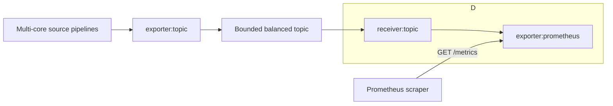

# RFC 0000: Native Prometheus Exporter

<!-- markdownlint-disable MD013 -->

**Status:** Draft

**Tracking issue:** [#3453](https://github.com/open-telemetry/otel-arrow/issues/3453)

**Exporter URN:** `urn:otel:exporter:prometheus`

**Shortcut:** `exporter:prometheus`

**Primary telemetry metric set:** `exporter.prometheus`

**Initial stability:** Experimental

**Target node:** `crates/core-nodes/src/exporters/prometheus_exporter/`

This RFC follows
[Reference-Informed OTAP-Native Capability Design](../ai/reference-informed-otap-native-capability-design.md).
The Go Collector component is evidence for compatibility and operational
lessons; it is not the target implementation architecture.

## Summary

Add a native, metrics-only Prometheus pull exporter to the OTAP Dataflow
Engine. The exporter accepts OTLP bytes or OTAP Arrow records, translates
metric data through the representation-neutral `MetricsView` traits, retains a
bounded in-memory view of active series, and exposes coherent Prometheus
scrapes at `GET /metrics`.

The first release is deliberately a **single-core sink**. One logical pipeline
running on several cores creates several independent exporter instances and
stores. Binding all of them to one address with `SO_REUSEPORT` would make a
scrape observe one arbitrary shard, not the union of all shards. Sharing the
store behind `Arc<Mutex<_>>` would instead put cross-core synchronization on the
ingest and scrape paths. Both designs conflict with the engine's
thread-per-core, share-nothing model.

Multi-core producers fan metrics into a dedicated one-core Prometheus sink
pipeline through a bounded, balanced topic. The exporter owns its mutable
series state locally. An input batch is acknowledged only after it has been
validated, translated, capacity-checked, and atomically committed to that
state. An Ack means the data is available to future scrapes; it does not mean a
Prometheus server has scraped it, and it does not provide persistence across
restart.

The first useful end-to-end slice supports gauges, cumulative sums, cumulative
classic histograms, scalar attributes, deterministic Prometheus text 0.0.4,
resource and scope mapping, expiration, hard resource limits, and both OTLP and
OTAP input representations. Delta aggregation, summaries, exemplar-capable
formats, OpenMetrics, and Prometheus protobuf/native histograms are staged
follow-up work. Unsupported metric kinds are rejected explicitly. Fields that
the selected protocol requires exporters to omit, notably exemplars in text
0.0.4, are dropped only under a documented compatibility rule and are counted.

## Motivation

The engine needs a native way to expose application and infrastructure metrics
to an existing Prometheus deployment without routing metrics through a Go
Collector or converting them to a push protocol. The capability must preserve
the metric semantics and operator expectations that matter while fitting the
OTAP runtime model.

### Primary user scenarios

1. Receive OTLP metrics from applications and expose them for a Prometheus
   server to scrape.
2. Process metrics natively as OTAP Arrow records, then expose them without a
   round trip through OTLP protobuf objects or an OpenTelemetry SDK registry.
3. Fan metrics from multi-core ingest and processing pipelines into one
   coherent scrape endpoint.
4. Preserve Collector migration expectations for names, labels, resource and
   scope identity, timestamps, and stale-series expiration.
5. Operate safely under high cardinality, absent or slow scrapers, malformed
   input, scrape concurrency, and shutdown.

### First useful deployment

The simplest deployment is a pipeline explicitly allocated one core. The
following is an illustrative pipeline fragment; the surrounding group/profile
structure and receiver configuration are omitted:

```yaml
policies:
  resources:
    core_allocation:
      type: core_count
      count: 1

nodes:
  otlp:
    type: receiver:otlp
    # Receiver configuration omitted.
  prometheus:
    type: exporter:prometheus
    config:
      endpoint: "127.0.0.1:9464"

connections:
  - from: otlp
    to: prometheus
```

For a multi-core source, the recommended topology is:



The topic is declared at startup, uses balanced delivery, has one receiver in
the sink pipeline, and configures `ack_propagation.mode: auto`. With
`ack_propagation.mode: auto`, the topic hop propagates whether downstream
processing ended in an Ack or Nack. Today, however, the tracked-topic outcome
retains only the Nack's human-readable reason; the topic receiver drops its
permanent flag and machine-readable NackCause, and the topic exporter
reconstructs it as a retryable Nack with an unspecified cause. Before the
topology can provide the end-to-end Ack/Nack contract defined below, the
engine’s tracked-topic outcome and subscription APIs must preserve those fields.
Until then, permanent-versus-retryable classification is reliable only within
the sink pipeline. The topic remains the shared bounded transport between
pipelines, avoiding a Prometheus-specific global queue.

## Goals

- Expose one coherent Prometheus endpoint for the declared sink pipeline.
- Consume both `OtlpBytes` and `OtapArrowRecords` through one semantic
  translation implementation.
- Follow the OpenTelemetry Prometheus/OpenMetrics compatibility specification
  for every admitted metric type.
- Preserve familiar, useful Collector configuration and defaults where they do
  not conflict with OTAP constraints.
- Make name, label, metadata, collision, ordering, reset, staleness, and
  expiration behavior deterministic.
- Keep all mutable data-plane state local to one pipeline runtime.
- Bound series state, staging, scrape concurrency, connections, response size,
  and per-item expansion.
- Propagate overload through the engine's bounded channels and Ack/Nack path.
- Make startup, scrape failure, overload, expiration, and shutdown observable
  without logging customer telemetry.
- Support all OSes on x86-64 and ARM.

## Non-Goals

The initial release does not provide:

- Prometheus Remote Write;
- durable metric state across restart or live replacement;
- one coherent endpoint assembled implicitly from per-core exporter replicas;
- an exporter-owned retry queue or durable buffer;
- arbitrary HTTP routing, a UI, or query APIs on the scrape endpoint;
- inbound bearer/basic authentication before a reusable server-auth capability
  exists;
- seamless same-address listener and state handoff between deployment
  generations;
- full Collector `confighttp.ServerConfig` option parity;
- automatic metric value rescaling merely to match Prometheus naming
  conventions;
- a mechanical Rust translation of the Go package layout or `sync.Map` design.

## Evidence Base

### Operational feedback reviewed

The design incorporates these representative upstream reports:

- [#41123](https://github.com/open-telemetry/opentelemetry-collector-contrib/issues/41123):
  stale series could grow when cleanup happened only on scrape;
- [#48172](https://github.com/open-telemetry/opentelemetry-collector-contrib/issues/48172):
  internal telemetry could report metrics as sent even when scrape-time
  translation dropped them;
- [#38394](https://github.com/open-telemetry/opentelemetry-collector-contrib/issues/38394):
  delta start-time misalignment diagnostics were not actionable;
- [#39700](https://github.com/open-telemetry/opentelemetry-collector-contrib/issues/39700)
  and
  [#49451](https://github.com/open-telemetry/opentelemetry-collector-contrib/issues/49451):
  dependency and protocol changes produced surprising name translation;
- [#12645](https://github.com/open-telemetry/opentelemetry-collector-contrib/issues/12645):
  conflicting family metadata reached scrape-time gather errors;
- [#48890](https://github.com/open-telemetry/opentelemetry-collector-contrib/issues/48890)
  and
  [#48861](https://github.com/open-telemetry/opentelemetry-collector-contrib/issues/48861):
  resource identity and resource-to-label behavior continue to evolve.

These reports motivate eager validation, explicit limits, deterministic
translation owned by this project, and precise telemetry semantics.

## Reference Finding Classification

| Reference finding | Classification | OTAP-native decision |
| --- | --- | --- |
| HTTP pull endpoint at `/metrics` | Preserve | Require an explicit bind address and expose `GET /metrics`. Readiness follows a successful bind and route installation. |
| Metrics-only component | Preserve | Nack logs, traces, and unknown signal kinds as permanent unsupported input. |
| `namespace`, `const_labels`, `send_timestamps`, five-minute expiration | Preserve | Keep the fields and safe defaults, with strict validation and deterministic collision handling. |
| Default name normalization, unit suffixes, and counter `_total` suffix | Preserve | Implement against the OTel compatibility spec and pin golden tests; do not inherit semantics implicitly from dependency upgrades. |
| Four translation strategies | Preserve in target scope | Admit only strategies supported by enabled scrape protocols. Use the same Collector string values for migration. |
| Deprecated `add_metric_suffixes` | Avoid | Do not add it. Migration uses `translation_strategy`. |
| `job`, `instance`, namespaced `target_info`, and scope labels | Preserve/Improve | Follow the compatibility spec, preserve the Collector namespace prefix, add deterministic ambiguity handling, and never wait until scrape to discover duplicate labels. |
| Reference `target_info` requires both a non-empty derived `job` and `instance` | Improve | Follow the current compatibility specification by making any non-empty resource eligible and using an empty `instance` when `service.instance.id` is absent. The native contract also uses an empty `job` when `service.name` is absent so every federated series has a fixed identity shape. Reject ambiguous identities deterministically. |
| `resource_to_telemetry_conversion` mutates input in place | Improve | Build effective labels without changing `OtapPdata`; an exact point-attribute key overrides the same resource key. |
| Gauges and cumulative values keep the newest point | Preserve/Improve | Use explicit timestamp and tie rules independent of map or input representation order. |
| Delta monotonic sums and classic histograms are accumulated in the exporter | Preserve/Improve | Serialize transitions in the local actor, define resets and overlap precisely, and reject invalid transactions explicitly. Non-monotonic delta sums remain unsupported. |
| Cumulative exponential histograms become Prometheus native histograms | Investigate/stage | Requires Prometheus protobuf negotiation and a current client-model encoder. It is not part of the first text slice. |
| Delta exponential histograms | Investigate | The pinned implementation and current OTel compatibility text are not fully aligned. Do not promise support before the specification and tests are reconciled. |
| `NoRecordedValue` handling | Improve | Remove the addressed series and continue processing the rest of the metric and batch. |
| Text 0.0.4 cannot represent exemplars | Preserve/Improve | Drop exemplars as required by the compatibility specification, count the omission, and add lossless conversion with an exemplar-capable protocol. |
| Expiration cleanup on scrape plus background ticker | Preserve/Improve | Cleanup is independent of scraper presence, uses monotonic arrival time, and has bounded work. `0` is invalid; `null` explicitly disables expiration. |
| Active series held in maps without a hard cardinality or byte cap | Reject | Enforce series, state-byte, staging, shape, and response limits. Expiration alone is not a memory bound. |
| Conversion and family conflicts can surface during scrape | Improve | Translate and validate before commit so an Acked batch is renderable. Apply atomically or Nack without partial state. |
| First-arrival HELP metadata and scrape-time type conflicts | Improve | Use deterministic descriptor rules and reject incompatible translated families. |
| Compatibility guidance prefers retaining points across conflicting UNIT/HELP metadata | Improve | Retain points across HELP conflicts by choosing text deterministically. Reject incompatible units because merging differently dimensioned samples would violate semantic identity. This is an intentional deviation from SHOULD-level guidance, not a claim of strict conformance. |
| Reference mostly ignores incompatible `prometheus.type` hints | Improve | Validate hints eagerly. Follow specified gauge/info/stateset/unknown mappings and Nack incompatible counter/histogram hints instead of silently discarding metadata intent. |
| Collector sending queue | Compose | Use bounded engine channels, topics, Ack/Nack, and separate retry/durable components. No private queue. Tracked-topic status/cause fidelity is a prerequisite for end-to-end classification. |
| Prometheus Go registry, `sync.Map`, goroutines, and package layout | Avoid | Use a local actor, bounded local tasks, and independently tested translation/store/HTTP modules. |
| Concurrent same-series delta updates are a `sync.Map` load/compute/store sequence | Avoid | Serialize transitions in the actor. The possibility of a lost concurrent increment is an inference from source, not a claimed upstream race report. |
| One listener and store per core using `SO_REUSEPORT` | Reject | A scrape would observe one arbitrary shard. |
| One process-global locked registry | Reject | It creates a central synchronization path and obscures backpressure. |
| Broadcast every point to every core-local exporter | Reject | It multiplies state and can diverge; current broadcast Ack is not an all-replica commit protocol. |
| Ack only after a Prometheus scrape | Reject | A scraper may never arrive. Ack means atomic admission to bounded in-memory state. |
| `enable_open_metrics` as the only protocol switch | Improve/stage | Use explicit supported-protocol configuration and HTTP content negotiation. |

## Declared Scope

### First useful release

The first release includes:

- a local exporter registered in `core-nodes` as
  `urn:otel:exporter:prometheus`;
- exactly one allocated core for the containing logical pipeline;
- `OtlpBytes` and `OtapArrowRecords` metrics traversed through generic
  `MetricsView` code;
- gauges;
- cumulative monotonic sums rendered as counters;
- cumulative non-monotonic sums rendered as gauges;
- cumulative classic histograms;
- `NoRecordedValue` series removal;
- scalar string, boolean, integer, and double attributes;
- default resource-to-`job`/`instance` and `target_info` behavior;
- default scope labels and the opt-out compatibility setting;
- the two underscore-escaping translation strategies, with and without
  suffixes;
- Prometheus text exposition format 0.0.4;
- optional explicit sample timestamps;
- expiration and hard resource limits;
- TLS/mTLS through the shared `TlsServerConfig` before promotion beyond
  experimental;
- deterministic output, component telemetry, tests, and benchmarks.

OTLP and OTAP views do not currently offer equivalent composite-attribute
access in every case. Arrays, key-value lists, and bytes attributes are
therefore permanent unsupported-input Nacks in the first release for **both**
representations. Prometheus label values are strings. Before accepting arrays
and key-value lists, the OTAP view must expose the same structured values as the
OTLP view. Before accepting arrays, key-value lists, or bytes from either
representation, the exporter must also define one deterministic string encoding
for them. Until then, these attribute types are rejected for both
representations so equivalent OTLP and OTAP input cannot produce different
labels or series identities.

### Staged target capability

Follow-up slices may add, in order:

1. delta monotonic sum and classic histogram accumulation with reset/overlap
   rules;
2. summaries;
3. OpenMetrics 1.0 negotiation and counter/classic-histogram exemplars;
4. Prometheus protobuf and cumulative exponential/native histograms;
5. compatible delta exponential histogram behavior if the specification allows
   it;
6. gzip response encoding after bounded CPU and memory behavior is measured;
7. reusable inbound authentication and generation-safe endpoint/state handoff.

Each slice updates the component's supported-behavior table and development
note. Until a slice lands, receiving that metric kind or temporality is an
explicit permanent Nack, not an Ack with a hidden drop.

## OTAP-Native Architecture

### Single-core deployment contract

A configured pipeline assigned `n` cores produces `n` independent exporter
instances. V1 requires `PipelineContext::num_cores() == 1` and rejects any
other value before binding the endpoint.

The current JSON-only component config validator cannot see resolved core
allocation. `PipelineContext::num_cores()` permits a runtime defense, but that
check occurs after a worker has been admitted. A generic resolved-pipeline
deployment constraint that rejects a core count other than one before any
candidate worker starts is a V1 prerequisite, not later cleanup. The same
preflight reserves the process-local exclusive endpoint across generations;
the operating-system bind remains authoritative for conflicts with other
processes.

The exporter uses an exclusive listener. It does not enable `SO_REUSEPORT`.
The engine's existing listener/socket-option helper should be exposed to
exporter effect handlers rather than duplicating platform-specific `socket2`
logic, with reuseport disabled for this component.

### Readiness prerequisite

The current controller reports a runtime pipeline ready after
`PipelineFactory::build`, before exporter node tasks run. A listener acquired in
the exporter's start path therefore cannot gate that current Ready event. V1
requires a generic node-start readiness handshake: the controller must not
publish pipeline Ready until every resource-owning node reports successful
startup. Candidate startup is sink-first and two-phase: prepare required sinks,
then activate ingress listeners and topic subscriptions only after those sinks
are ready. A forwarding-only barrier is insufficient because a reuseport
listener can divert connections before it emits pdata. This exporter reports
node readiness only after the exclusive listener is bound, TLS state and
bounded channels are installed, and `/metrics` can be served. An exporter
prepare failure therefore fails the candidate before ingress activation while
the prior generation remains active. A failure during the later generic ingress
activation phase may still have that ingress transport's documented bounded
rollback effects; this RFC does not claim that every multi-receiver rollout is
externally atomic. Build-time socket acquisition is acceptable only if it
provides the same ownership, rollback, sink-first activation, and readiness
guarantees; a post-Ready bind is not.

### Exporter actor

One pipeline-local `!Send` actor owns the mutable series state, expiration,
scrape coordination, and lifecycle. HTTP tasks do not access live state
directly; they request coherent immutable snapshots through a bounded local
channel. This preserves single-core, share-nothing ownership without a
state-store lock or cross-thread coordination.

Ingestion, scraping, maintenance, and control work must remain bounded and
cooperative so none can starve shutdown or other pipeline work. V1 permits one
active scrape; excess requests return overload, and response-size and deadline
limits are enforced before a successful response.

All tasks are local, bounded, tracked, and cancelled or joined during shutdown.
The exporter must not create another runtime, detached tasks or threads,
unbounded queues, or blocking work. Any dependency that requires shared state,
cross-thread execution, or blocking offload requires a separate evidence-backed
design amendment.

### Series store

The store uses typed identities, never delimiter-concatenated strings.

A canonical family identity includes:

- original OTel metric name;
- translated Prometheus family name;
- OTel metric kind, temporality, monotonicity, and unit;
- translated Prometheus type.

A canonical series identity includes:

- the canonical family identity;
- sorted final label-name/value pairs after all collision rules;
- the identities behind generated `job`, `instance`, and scope labels;
- constant labels;
- synthetic labels such as `le` or `quantile` only at render time.

Resource and scope identity affect final labels and therefore series identity;
they do not split an otherwise compatible Prometheus family. Incompatible
descriptors that translate to the same family name are handled by the family
registry below.

Lookup may use a fast hash, but equality is structural. Output families,
series, labels, histogram bounds, and quantiles are emitted in canonical order.
Hash-map iteration order is never observable.

Every stored entry has a monotonic `last_arrival` time for expiration. Event
timestamps do not drive retention because they may be old, future-dated, or
skewed. The expiration index contains at most one live record per stored series
and is covered by the same limits. Family descriptors are reference-counted and
removed when their last application or synthetic series is removed, so churn
cannot leave an unbounded metadata-only registry.

### Atomic batch admission

For each `OtapPdata` message, the exporter:

1. verifies the signal and representation;
2. traverses and translates into a bounded staging transaction;
3. groups repeated canonical series and resolves them in timestamp order;
4. validates shapes, metadata, labels, collisions, timestamps, and supported
   semantics;
5. computes removals, replacements, additions, and their accounted resource
   delta against the current store;
6. checks the staged result against the current store and every capacity limit;
7. commits every state transition or none;
8. sends Ack only after commit.

The actor is the sole writer, so state cannot change between validation and
commit. If the same interval appears twice with identical content, it is
idempotent. Equal identity and timestamp with different content is a
single-writer conflict and rejects the transaction. Independent point ordering
must not change the outcome, which is necessary for OTLP/OTAP parity.

Malformed, semantically invalid, colliding, oversized, or currently unsupported
input produces a permanent Nack and leaves the store byte-for-byte unchanged.
Temporary store-capacity exhaustion produces a retryable capacity Nack against
the current store. Expiration is an independent serialized maintenance event;
it never commits as a side effect of a rejected input transaction. A message
that reaches a staging or shape bound stops translation immediately, returns a
permanent oversized-input Nack, releases its staging memory, and resumes the
actor loop. Ordinary processing time and the bounded engine inbox propagate
backpressure while that message is being evaluated.

Staging is an incremental actor state machine, not one monolithic visitor. It
processes a fixed quantum of points, attributes, and histogram buckets, then
yields to the local runtime and returns to the outer arbitration described
above. Expiration, scrape snapshot creation, and every other state-mutating or
state-reading actor action are deferred until the transaction resolves.
Ordered staging indexes resolve repeated-series timestamps without one
non-yielding full-message sort. No second input transaction begins while one is
open; only the single force-drain deferral slot may hold a subsequent message.
No partial transaction is visible to scrapes.

The final store mutation runs without an await so it is observationally
atomic. `max_series_mutations_per_message` bounds that critical section; its
released default must keep worst-case control latency within the measured
runtime budget. Once commit starts it runs to completion and returns Ack before
the actor handles another event.

## User-Facing Contract

### Configuration

Configuration is typed, denies unknown fields, and uses Collector-compatible
names where doing so is safe:

```yaml
type: exporter:prometheus
config:
  endpoint: "127.0.0.1:9464"
  namespace: ""
  const_labels: {}
  send_timestamps: false
  metric_expiration: 5m
  resource_to_telemetry_conversion:
    enabled: false
    exclude_service_attributes: false
  without_scope_info: false
  translation_strategy: UnderscoreEscapingWithSuffixes
  protocols:
    - prometheus_text_0_0_4
  request_timeout: 30s
  read_header_timeout: 10s
  idle_timeout: 1m
  tls: null
  limits:
    max_families: 10000
    max_series: 100000
    max_state_bytes: 256MiB
    max_staging_bytes: 32MiB
    max_data_points_per_message: 100000
    max_series_mutations_per_message: 10000
    max_metric_name_bytes: 1024
    max_description_bytes: 4096
    max_labels_per_series: 128
    max_label_name_bytes: 1024
    max_label_value_bytes: 16KiB
    max_histogram_buckets: 4096
    max_request_header_bytes: 16KiB
    max_connections: 64
    max_requests_per_connection: 1000
    max_concurrent_scrapes: 1
    max_response_bytes: 64MiB
```

The numeric and byte defaults above are provisional RFC defaults. The config PR
must confirm them with representative memory and latency measurements before
they become a released contract.

| Field | Default | Contract |
| --- | --- | --- |
| `endpoint` | Required | A concrete IP socket address. Hostname resolution is not performed on the runtime path. Blank values and port zero are rejected in public configuration. |
| `namespace` | Empty | Optional prefix, translated with the selected metric-name strategy. |
| `const_labels` | Empty | Static string labels added to application metric series. Collisions with dynamic or reserved labels reject the affected input transaction. They are not added to `target_info`. |
| `send_timestamps` | `false` | Include explicit source sample timestamps. Text 0.0.4 uses the signed integer millisecond value `time_unix_nano / 1_000_000`, truncating the sub-millisecond remainder. The default lets Prometheus assign scrape time. |
| `metric_expiration` | `5m` | Remove a series after no accepted update for this monotonic duration. A positive duration is required. `null` disables time expiration, but hard limits remain. `0` is invalid. |
| `resource_to_telemetry_conversion.enabled` | `false` | Copy resource attributes into effective metric labels without mutating input. Exact point keys override exact resource keys. |
| `resource_to_telemetry_conversion.exclude_service_attributes` | `false` | When conversion is enabled, omit `service.name`, `service.namespace`, and `service.instance.id` from copied labels because they also form `job` and `instance`. |
| `without_scope_info` | `false` | Omit generated scope labels. This is a compatibility escape hatch and can increase collision risk. |
| `translation_strategy` | `UnderscoreEscapingWithSuffixes` | One of the four Collector strategy names. A strategy is rejected if enabled protocols cannot represent it safely. V1 admits the two underscore-escaping strategies. |
| `protocols` | `[prometheus_text_0_0_4]` | Ordered set of formats the server can negotiate. V1 admits only text 0.0.4. Every future set must retain text 0.0.4 as the mandatory last-resort fallback. |
| `request_timeout` | `30s` | Bounds a scrape from admission through response production and delivery. A deadline before headers returns `503`; after headers it aborts the connection and records failure. |
| `read_header_timeout` | `10s` | Bounds request-header arrival to resist slow clients. |
| `idle_timeout` | `1m` | Bounds an idle keep-alive connection. |
| `tls` | `null` | Shared `TlsServerConfig`; when present, serves HTTPS and optionally requires client certificates. Its nested `handshake_timeout` bounds negotiation while a connection consumes a permit. |
| `limits` | As shown | Hard component-local bounds. Zero does not mean unlimited unless a field explicitly documents that behavior. |

The fixed path is `/metrics`. V1 accepts `GET` and `HEAD`; other paths return
`404` and other methods return `405`. A configurable path and CORS are not
included without a demonstrated scrape use case.

### Limit accounting

`max_state_bytes` counts all owned family and series payloads, vector
capacities, and a conservative fixed per-entry/index charge. It is a
component-accounted budget, not an assertion that process RSS equals that
value. `max_families` and `max_series` independently bound map/index overhead;
`max_series` counts active series and timestamp tombstones.
Each retained scrape snapshot can keep at most one prior state budget alive;
V1 requires `max_concurrent_scrapes` to equal `1`. The documented worst-case
component envelope includes the live store, one retained snapshot, staging,
one response buffer, connection/task overhead, and dependency overhead.

`max_staging_bytes` bounds transient owned data before a batch commits.
Histogram buckets, labels, and data points each have a separate shape bound so
a single series or message cannot consume the whole budget through unbounded
nested vectors. `max_series_mutations_per_message` separately bounds the
non-yielding final commit. Quantile and exemplar bounds are added with those
features, rather than exposing unused V1 settings.

Admission also tracks the encoded-size bound for each enabled protocol. Each
stored family and series caches a conservative encoded-size contribution, so a
transaction applies contribution deltas for changed entries instead of
rendering or scanning the whole store. A transaction that would make the
current coherent scrape exceed `max_response_bytes` does not commit. The
render-time check remains as defense-in-depth, not as the normal way to
discover an oversized store.

The process memory limiter complements these limits but does not replace them;
its current phase has no stateful-component reclaim or per-pipeline budget.

### Validation

Validation rejects:

- unknown fields or enum values;
- missing, blank, hostname-based, or otherwise invalid endpoints;
- a pipeline allocated other than exactly one core;
- non-positive timeouts and expiration durations;
- zero or internally inconsistent capacities;
- `max_concurrent_scrapes` other than `1` in V1;
- constant label names that normalize to duplicates or reserved names;
- TLS configurations that fail shared server-TLS validation;
- UTF-8/no-translation strategies without a compatible protocol;
- protocols not implemented in the running build;
- a future protocol set that omits the mandatory text 0.0.4 fallback;
- attempts to configure deprecated `add_metric_suffixes`, `sending_queue`, or
  a Collector-only HTTP option.

Binding is part of admission. The pipeline instance is not ready until the
listener, TLS state, scrape channel, and route are ready.

## Translation and Metric Semantics

### Metric names and units

V1 supports:

- `UnderscoreEscapingWithSuffixes`;
- `UnderscoreEscapingWithoutSuffixes`.

The target enum also reserves the Collector values
`NoUTF8EscapingWithSuffixes` and `NoTranslation`. Modern text 0.0.4 can encode
quoted UTF-8 names and the pinned Go dependency negotiates escaping, so the
protocol does not make these values impossible. V1 defers them to keep quoted
name rendering, escaping negotiation, collision behavior, and migration
fixtures out of the first slice. They become admissible only after those paths
are implemented and tested end to end.

The default replaces discouraged characters with `_`, collapses repeated
underscores, translates recognized UCUM units to Prometheus unit words, places
the unit suffix before the type suffix, and adds `_total` to counters when
needed. Namespace and base name are translated through the same audited code.

Unit translation changes metadata and the metric name; it does not rescale the
numeric value. A value expressed in milliseconds remains a millisecond value
and, with suffixes enabled, receives a `_milliseconds` suffix. Value conversion
belongs in an explicit processor because silent rescaling changes data.

The implementation owns golden tests for the translation table and does not
delegate the public contract to whatever behavior a dependency version happens
to provide.

### Attribute labels

Attribute keys are sorted by original key before normalization. When different
original keys normalize to one Prometheus label name, their string values are
concatenated with `;` in original-key lexical order, as required by the OTel
compatibility specification.

V1 canonical scalar forms are:

- string: the UTF-8 value;
- boolean: `true` or `false`;
- integer: base-10;
- double: the shortest round-trippable decimal, with canonical `NaN`,
  `Infinity`, and `-Infinity` label-value spellings.

Invalid UTF-8, bytes, arrays, and key-value-list attributes reject the batch in
V1. Label values escape backslash, quote, and newline according to the selected
wire format.

Final label pairs are sorted by final label name. Collisions caused by adding
generated `job`, `instance`, scope identity, or scope-attribute labels use the
compatibility specification's deterministic value-concatenation rule; they are
not rejected merely because an application attribute already has that final
name. Scope attributes that collide with the three generated scope identity
labels are the one special case described below and are dropped before this
merge. Original keys determine concatenation order; when an application key is
identical to an added label's key, the generated value is the stable first
element. Configured constant-label names and render-only `le`/`quantile` labels
are reserved in their applicable contexts. A collision not covered by those
rules is rejected before commit.

Metric sample numbers use the Prometheus text grammar, which is distinct from
attribute-label conversion: finite integers and doubles use canonical decimal
forms, and non-finite samples or bucket bounds use `NaN`, `+Inf`, and `-Inf`.
Positive zero renders as `0` and IEEE negative zero as `-0`. No numeric value
is rewritten merely to match its label-string representation.

### Resource mapping

By default:

- `service.namespace` and `service.name` form
  `<service.namespace>/<service.name>` or `<service.name>` for `job`;
- `service.instance.id` forms `instance`;
- missing `service.name` or `service.instance.id` produces an empty `job` or
  `instance` label, respectively;
- a non-empty resource produces one `target_info` gauge with value `1`, keyed
  by `job` and `instance`, containing the remaining translated resource
  attributes.

`target_info` remains a gauge across V1 protocols for Collector query
compatibility. With a non-empty namespace its family name is
`<namespace>_target_info`, preserving the Collector behavior; constant labels
do not apply to it.

At most one `target_info` series exists for a `job`/`instance` pair. If two
different resources map to that pair with incompatible remaining attributes,
the incoming transaction is rejected and the already-committed description
remains unambiguous. The exporter increments a diagnostic counter and never
chooses an arrival-order-dependent resource description.

Synthetic target state is reference-counted by the active application series
that share its canonical resource identity. It is created atomically with the
first admitted series, refreshed by accepted updates, and removed when the last
referencing series is removed or expires. It counts toward family, series,
state, and response limits; rejected or unsupported input cannot create it.

When resource-to-telemetry conversion is enabled, effective attributes are
formed without changing the incoming pdata: selected resource attributes are
the base and exact point-attribute keys override them. Distinct keys that
collide only after normalization use the standard lexical merge rule. This
intentionally differs from the reference's in-place resource overwrite.

### Scope mapping

Unless `without_scope_info` is true, every application series includes:

- `otel_scope_name`;
- `otel_scope_version`;
- `otel_scope_schema_url`;
- each non-reserved scope attribute by first prepending `otel_scope_` to the
  original key and then normalizing that complete label name.

Scope attributes that would collide with the three identity labels are
dropped as required by the compatibility specification, with a low-cardinality
diagnostic count. Other generated/application collisions use the deterministic
concatenation rule in the preceding section.

### Metric kinds

| OTLP metric | First release | Target behavior |
| --- | --- | --- |
| Gauge | Supported | Latest point by timestamp. Missing `prometheus.type` or `gauge` renders a gauge; `unknown` renders an untyped family. In text 0.0.4, `info` renders a gauge with the required `_info` suffix and `stateset` renders a gauge. Malformed values and hints incompatible with the OTel kind are permanent Nacks. |
| Cumulative monotonic sum | Supported | Counter, including `_total` when the selected strategy enables suffixes and optional created/start time when the wire format can represent it. Missing `prometheus.type` or `counter` is accepted; incompatible hints are permanent Nacks. |
| Cumulative non-monotonic sum | Supported | Gauge semantics, including the same `prometheus.type` hint and text-format fallback rules. |
| Delta monotonic sum | Permanent Nack | Later delta-to-cumulative accumulation with explicit alignment/reset rules. |
| Delta non-monotonic sum | Permanent Nack | Remains unsupported: neither the compatibility specification nor the pinned reference defines a valid accumulation. Use cumulative input or an explicit processor. |
| Cumulative classic histogram | Supported | Cumulative `le` buckets in ascending bound order, followed by the implicit `le="+Inf"` bucket whose cumulative value equals `_count`; emit `_sum` only when present rather than fabricating zero. Missing `prometheus.type` or `histogram` is accepted; incompatible hints are permanent Nacks. Min/max are not exported. |
| Delta classic histogram | Permanent Nack | Later delta-to-cumulative accumulation; boundary changes are explicit resets or conflicts, never partial addition. |
| Summary | Permanent Nack | Later summary family with sorted quantiles, sum, and count. |
| Cumulative exponential histogram | Permanent Nack | Later Prometheus native histogram through protobuf negotiation. |
| Delta exponential histogram | Permanent Nack | Investigate after specification alignment. |
| Empty/unknown data | Permanent Nack | Never Ack a metric with no defined supported data kind. |

All points in a metric are processed. The implementation must not assume one
data point per metric. Both current metric views expose metadata, so the
`prometheus.type` decision is identical for OTLP and OTAP input and is covered
by parity tests.

V1 drops exemplars because the selected text 0.0.4 protocol cannot represent
them and the compatibility specification requires that omission. This is an
explicit, protocol-mandated exception to the no-hidden-drop policy: the batch
may still commit, and the exporter increments a fixed diagnostic counter for
the omitted exemplars. When an exemplar-capable protocol lands, exemplars are
converted for compatible metric kinds and the supported behavior table changes
with it.

### Timestamps, ordering, resets, and staleness

For gauges and cumulative points:

- `time_unix_nano` is required and non-zero; zero is invalid input;
- `start_time_unix_nano` is optional, and zero means absent rather than an
  invalid timestamp;
- a present start time must not be later than its point time;
- a newer `time_unix_nano` replaces the stored point;
- an older point is a stale update and is ignored with telemetry, while the
  otherwise valid batch may commit;
- an identical timestamp and identical content is idempotent;
- an identical timestamp with different content rejects the batch as a
  single-writer conflict;
- equal cumulative start times, including two absent start times, describe the
  same stream;
- when both cumulative start times are present and changed, a new start at or
  after the previously stored end is a reset/gap and replaces prior state,
  while a new start before that end overlaps and rejects the transaction as a
  competing-writer conflict;
- changing a cumulative start time from present to absent or absent to present
  is rejected as an ambiguous stream transition.

When delta support lands:

- the first interval seeds cumulative state;
- a next interval whose start equals the previous end is accumulated;
- a start after the previous end is a gap/reset and starts new cumulative
  state, with explicit reset telemetry;
- an overlapping or backwards interval is rejected as an alignment conflict;
- histogram addition requires compatible bounds;
- exponential-histogram addition is considered only if a future compatibility
  specification admits delta input and defines a common-scale and
  zero-threshold rule; the current specification requires dropping it;
- diagnostic events explain the category and remediation without including
  metric names, attributes, or values.

`NoRecordedValue` participates in the same timestamp ordering. A newer flag
stages removal of the visible canonical series and installs a timestamped
tombstone; an older flag is stale, and an equal timestamp follows the
idempotence/conflict rules. Other points in the metric and message continue
through the transaction, and the removal becomes visible only if the whole
transaction commits. The bounded tombstone prevents an older delayed point
from resurrecting the series, counts toward state/series limits, does not keep
`target_info` alive, and expires on the same monotonic retention schedule. Once
it expires, that identity is forgotten. Absence from the next successful scrape
gives Prometheus the pull-protocol staleness signal. The exporter does not
render a numeric zero for missing data.

That disappearance has immediate staleness semantics with the default
`send_timestamps: false`. Prometheus normally does not insert stale markers for
explicitly timestamped samples unless the scrape configuration enables
`track_timestamps_staleness`; otherwise the last sample remains subject to the
server's lookback behavior. Operators enabling `send_timestamps` must also
choose that Prometheus setting when prompt removal visibility is required. The
exporter does not pretend that omission alone overrides server behavior.

### Family and series collisions

Translation may make distinct OTel names or descriptors collide. The exporter
maintains a family descriptor registry at admission time.

- Distinct original names mapping to one translated family are not silently
  merged.
- Different Prometheus types for one translated name reject the incoming
  transaction.
- Different identifying OTel units or intrinsic properties reject the incoming
  transaction, even if suffixes are disabled.
- For the same compatible descriptor, the longest description is the HELP
  text; equal-length ties choose lexical order so arrival order is irrelevant.
- HELP and TYPE directives appear no more than once per family per scrape;
  UNIT is emitted at most once only in negotiated formats that support it and
  is absent from text 0.0.4.
- Two distinct source identities mapping to the same final series are a
  single-writer collision and reject the incoming transaction.

This turns what would otherwise be a scrape-time gather error into an explicit
ingest result. A batch that has been Acked is guaranteed renderable under the
configuration active at commit time. Rejecting differently dimensioned points
on a UNIT conflict is an intentional deviation from the compatibility
specification's SHOULD-level preference to retain points while selecting one
UNIT comment: silently merging their values would violate this engine's
semantic-identity and single-writer requirements. HELP conflicts do retain the
points and use the deterministic rule above.

## Backpressure, Failure, and HTTP Behavior

### Ack/Nack contract

The table is the direct exporter-hop contract. It becomes an end-to-end tracked
topic contract only after the status/cause-preserving topic prerequisite lands.

| Condition | Result |
| --- | --- |
| Entire batch validates and commits | Ack after commit. |
| Non-metrics signal or unsupported representation/type/temporality | Permanent Nack; no mutation. |
| Malformed pdata, invalid shape, bad UTF-8, semantic conflict, or deterministic collision | Permanent Nack; no mutation. |
| Message or staging limit exceeded | Permanent Nack; the same message cannot fit the current contract. |
| Store capacity exhausted | Retryable capacity Nack; no input-attributable mutation. A separately scheduled expiration event may later free capacity. |
| Internal invariant or state corruption | Fail the node and pipeline instance; do not Ack. |
| Scrape absent or failed after a committed batch | No change to the prior Ack; expose scrape failure through component telemetry. |

Capacity is evaluated against the transaction's prospective final store state,
so updates or removals may still commit when a limit is currently reached if
the resulting state fits. A transaction that would exceed a store limit commits
nothing and returns a retryable Nack; the exporter neither evicts unrelated
series nor retries the message internally.

The exporter has no internal retry loop. A separate retry or durable-buffer
component may act on retryable Nacks. The bounded exporter inbox and any topic
queue provide the only waiting capacity.

### Scrape behavior

| Request/result | HTTP behavior |
| --- | --- |
| Valid `GET /metrics` | `200` with a coherent complete snapshot and exact negotiated `Content-Type`. |
| `HEAD /metrics` | Same status and headers, no body. |
| Unknown path | `404`. |
| Unsupported method | `405` with `Allow: GET, HEAD`. |
| Active-scrape or connection limit reached | `503` and a bounded `Retry-After`; no queued task. |
| Render deadline or response cap reached before headers | `503`; no success headers or partial exposition body. |
| Delivery timeout or disconnect after headers | Abort the connection and record a failed scrape. HTTP status can no longer be changed. |
| Internal render invariant failure | `500`, component failure telemetry, and no partial body. |
| No mutually supported `Accept` entry | Fall back to the mandatory Prometheus text 0.0.4 protocol. |

The complete bounded response is rendered before success headers are sent.
Transport failure after headers can still truncate a response carrying a `200`
status; the exporter never does so intentionally, and it counts the scrape as
failed unless the complete body write finishes.

V1 serves `text/plain; version=0.0.4; charset=utf-8` and applies underscore
escaping as the legacy default; it does not advertise the 1.0.0 `escaping`
response parameter. Later formats select the highest-quality supported
`Accept` entry, validate all parameters, and return the corresponding content
type and escaping scheme. Exemplars are emitted only in a format that supports
them. Native histograms require Prometheus protobuf negotiation; OpenMetrics
text does not currently carry them.

### Expiration and maintenance

Expiration runs independently of scrape traffic. A cancellable periodic timer
processes bounded chunks and yields between chunks. The interval is derived
from `metric_expiration` with minimum and maximum bounds; it is not a second
user-visible retention semantic.

An update racing the logical expiration boundary is serialized by the actor:
whichever event is processed first has a deterministic result, and an accepted
update refreshes `last_arrival`. Disabled time expiration does not disable hard
limits.

## Lifecycle and Live Reconfiguration

### Startup

Startup performs strict config validation, the single-core check, dependency
and TLS validation, exclusive listener bind, local channel construction, and
store initialization. The initial store is empty and non-durable. The exporter
signals the required node-start readiness gate only after the endpoint can
answer a scrape; the controller cannot publish pipeline Ready sooner.

### Shutdown

The current `ExporterInbox` latches `Shutdown` and force-enables pdata draining;
the exporter normally receives the control message only after the pdata sender
closes and the bounded inbox is empty. Every message already admitted or
force-drained is therefore processed one at a time to Ack/Nack before normal
shutdown. The per-message work and commit limits bound this control delay.

When `Shutdown` is delivered, the exporter:

1. stops accepting new connections and scrape requests;
2. cancels expiration and maintenance work;
3. finishes or cancels admitted scrapes by the node deadline;
4. reports a final `MetricSet` snapshot;
5. drops the in-memory store and listener.

There is no guaranteed final scrape or persistence flush. A deadline expiry
cancels remaining request tasks and returns promptly. If the engine forcibly
aborts the node at its deadline before an in-flight input reaches a terminal
outcome, the current runtime does not guarantee delivery of an Ack or Nack for
that pdata; this exporter does not claim otherwise.

### Live replacement and resize

Current live replacement starts a candidate generation and waits for it to
become ready before draining the old generation. V1 cannot safely support a
same-endpoint replace:

- exclusive bind prevents the candidate from becoming ready; and
- reuseport would split scrapes between two cold, independent stores.

The required deployment preflight rejects a same-endpoint replacement before
launching or subscribing a candidate. This limitation applies even when only a
translation or limit setting changed. The node readiness gate remains necessary
for an external-process bind race or later startup failure and preserves the
old generation on failure.

A no-op update preserves the running instance and its state. Resizing above one
core and changing the singleton's assigned core are rejected before candidate
launch in V1. A replacement at a different endpoint on the same assigned core
starts with an empty store and must be documented as a state reset. Seamless
handoff requires a process-scoped endpoint owner and an explicit state-transfer
protocol; that is future design work.

Topic declarations and profiles cannot currently be mutated live. The
multi-core fan-in topic must exist at startup.

## Security and Privacy

The endpoint exposes customer telemetry, not just collector health. Metric
names, labels, resource attributes, scope identity, and constant labels may
contain sensitive topology, tenant, or user information.

- `endpoint` is required; examples and tests bind loopback.
- Binding a non-loopback address is an explicit operator choice and emits a
  privacy-safe startup warning when TLS is absent.
- TLS and mTLS reuse the shared server configuration and certificate reload
  behavior.
- Until a reusable inbound auth capability exists, deployments needing bearer
  or basic authentication should place the endpoint behind an authenticated
  reverse proxy or use mTLS.
- Only `/metrics`, `GET`, and `HEAD` are served.
- Connection count, scrape concurrency, request time, response size, state,
  staging, and nested metric shapes are bounded.
- Accept/content-negotiation input is strictly parsed to prevent header or
  protocol confusion.
- Logs and self-telemetry never include raw request authorization, source
  addresses at high cardinality, metric names, label keys/values, resource
  attributes, exemplars, or payload bodies.
- Configuration redaction must treat TLS private-key PEM as sensitive. Constant
  labels are public scrape data and must not contain credentials.

All internal events use the `otel_*` macros from `otap_df_telemetry`.

## Component Telemetry

The primary `MetricSet` is `exporter.prometheus`. Reuse the standard exporter
pdata metrics where their semantics are exact, and add low-cardinality fields
for:

- messages and data points committed;
- permanent invalid/unsupported/collision rejections;
- protocol-mandated exemplar omissions;
- retryable capacity rejections;
- active series, retained tombstones, active families, and accounted state
  bytes;
- expired and explicit-stale series removals;
- cumulative resets, stale updates, and alignment conflicts when delta support
  lands;
- scrape requests, completions, overload rejections, timeouts, and failures;
- scrape response bytes and render-duration MMSC;
- ambiguous `target_info` and dropped reserved scope attributes;
- current active connections and scrape tasks.

Do not use user-controlled values as metric names or dimensions. Rejection
categories are fixed fields or fixed enums. A message is counted as exported
only after commit; a scrape metric is counted successful only after the full
response has been written to the transport. These semantics avoid reporting
dropped data as sent.

Lifecycle events should cover bind/listen, TLS reload failure, capacity
pressure transitions, summarized translation conflicts, scrape overload, and
shutdown deadline expiry. Events include the node identity and fixed reason
category, not customer metric identity.

## Validation Plan

### Direct semantic tests

- Name, unit, namespace, suffix, and escaping tables for every admitted
  translation strategy.
- Canonical scalar value formatting, including signed zero, NaN, and infinity.
- Attribute normalization collisions and lexical value concatenation.
- Generated-label concatenation and constant/render-only label rejection.
- Resource `job`/`instance`, `target_info`, promoted labels, and ambiguous
  resources.
- Scope identity, prefixed attributes, opt-out, generated-label merges, and the
  required scope-attribute drops, including prefix-before-normalization edge
  cases.
- Every admitted metric type, point shape, timestamp, reset, and
  `NoRecordedValue` transition.
- Tombstone stale-resurrection prevention, target reference release, capacity
  accounting, and expiry.
- Explicit timestamp nanosecond-to-millisecond truncation at sub-millisecond
  boundaries.
- `prometheus.type` gauge/unknown handling, text-format info/stateset fallback,
  malformed-hint rejection, and V1 exemplar omission telemetry.
- Histogram bounds/count validation, cumulative bucket conversion, implicit
  `+Inf`, optional sum, and response expansion limits.
- Family type/unit/name/help conflicts and single-writer series conflicts.
- Idempotence, equal-time conflict, stale update, and input-order independence.
- Fake-clock expiration at, before, and after exact boundaries.
- Transaction tests proving every Nack leaves live state unchanged.

Each unit test follows the project's `Scenario:` and `Guarantees:` comment
convention.

### Representation parity

For each supported semantic fixture, encode equivalent OTLP bytes and OTAP
Arrow records, pass them through the same translator/store, and require the
same canonical snapshot and byte-identical RFC renderer output.

Fuzz malformed protobuf, malformed/missing Arrow batches, invalid UTF-8,
extreme numeric values, repeated points, normalization collisions, and
histogram shapes. Composite attributes must fail identically on both paths
until both views support them.

### Reference and protocol conformance

- Build golden scenarios from the pinned Go reference tests and README.
- Compare normalized metric families and samples where this RFC classifies
  behavior as Preserve.
- Require RFC-specific goldens for intentional differences; do not require the
  Go implementation's incidental ordering.
- Parse text output with Prometheus tooling and validate content types and
  negotiation against the protocol specifications.
- Verify text 0.0.4 omits UNIT and document explicit-timestamp staleness with a
  real Prometheus configured both with and without
  `track_timestamps_staleness`.
- When later formats land, validate OpenMetrics EOF/exemplars and delimited
  client-model protobuf/native histograms with real Prometheus scrapes.

### Runtime and integration tests

- Exporter harness coverage for Ack/Nack, permanent status, control priority,
  timer handling, cancellation, and terminal metrics.
- Direct HTTP-module tests using an internal `127.0.0.1:0` listener for methods,
  routes, coherent snapshots, overload, timeout, slow clients, disconnect,
  response cap, TLS/mTLS, and listener cleanup; public config tests continue to
  reject port zero.
- A direct one-core OTLP receiver to Prometheus exporter pipeline.
- An OTAP-record pipeline and an OTLP-byte pipeline producing identical
  scrapes.
- Multi-core producers through tracked balanced-topic fan-in to the one-core
  sink with `ack_propagation.mode: auto`, including Ack and full permanent or
  retryable Nack status/cause propagation.
- Pre-launch rejection for multi-core allocation, endpoint reservation
  conflict, and singleton core-set movement; node readiness withheld on an
  operating-system bind or server-start failure, with sink-first preparation
  and no receiver listener or topic-subscription activation before required
  sinks are ready.
- Live-control coverage for no-op, resize/core-move rejection, same-endpoint
  preflight rejection with no candidate side effects, and disjoint-endpoint
  empty-state replacement.
- Shutdown during ingest, staging, snapshot, rendering, TLS handshake, and slow
  response delivery, including force-drained messages reaching terminal
  outcomes and the documented forced-deadline case.
- Control and shutdown latency while processing the largest allowed input
  message, including the maximum bounded commit.
- Starvation-free arbitration under continuous scrape, ingestion, and due
  expiration load, including the declared maximum service gaps.
- Sustained high-cardinality churn proving a memory plateau and independent
  cleanup with no scraper.

Use the smallest adequate test layer from the testing guide. Concurrency and
shutdown state machines may warrant deterministic simulation; wire semantics
belong in direct and end-to-end tests.

## Alternatives Considered

### One exporter per core with `SO_REUSEPORT`

Rejected. Reuseport distributes connections, not logical scrapes or state. Each
scrape sees one core's store and may land on a different core next time, causing
series to blink and delta state to diverge.

### Process-global `Arc<Mutex<Registry>>`

Rejected. It centralizes every update and scrape behind shared mutable state,
adds cross-core wakeups and lock contention, hides backpressure, and weakens
failure isolation.

### Broadcast every point to every core-local store

Rejected. It multiplies memory and translation work by core count, requires an
all-replica commit protocol, and still risks divergent expiration and lifecycle
state. Current broadcast-topic Ack semantics are not an all-subscriber barrier.

### A dedicated unbounded/blocking server thread

Rejected. It introduces a hidden queue and lifecycle outside the pipeline.
Bounded blocking offload could be reconsidered only with cancellation,
backpressure, accounting, and benchmark evidence.

### Reuse the internal telemetry Prometheus provider

Rejected. It creates an OpenTelemetry SDK registry and a separate Tokio
runtime, spawns server work outside node lifecycle, and represents instruments
created locally rather than arbitrary pre-aggregated OTLP/OTAP metric streams.

### Register a dynamic Prometheus client metric for every incoming series

Rejected. Registration churn and client-registry synchronization are a poor fit
for arbitrary high-cardinality imported series. It also risks losing original
temporality, timestamp, summary, histogram, exemplar, and staleness semantics.

### Convert everything to OTLP objects first

Rejected. It discards the advantage of raw OTLP/Arrow views and adds avoidable
materialization, allocation, and encode/decode work.

### Ack after a successful scrape

Rejected. Pull timing is controlled by an external system and a scrape may
never happen. Holding original pdata until scrape would create an unbounded,
semantically wrong delivery queue.

### Make the first release process-scoped and multi-core

Deferred. A stable process-scoped endpoint owner with sharded snapshots and
generation handoff could support this later, but the engine does not yet have
the necessary scope and lifecycle contract. The topic-composed one-core sink is
useful without that core change.

## Compatibility and Migration

| Go Collector setting | Native exporter |
| --- | --- |
| `endpoint` | Same name; parsed as a concrete socket address and required. |
| `/metrics` | Same fixed path. |
| `namespace` | Same intent and empty default. |
| `const_labels` | Same intent, with eager collision validation. |
| `send_timestamps` | Same name and `false` default. |
| `metric_expiration` | Same five-minute default; use `null` to disable and never use `0`. |
| `resource_to_telemetry_conversion.enabled` | Same name/default; native path is non-mutating and point attributes win exact-key conflicts. |
| `resource_to_telemetry_conversion.exclude_service_attributes` | Same name/default. |
| `without_scope_info` | Same name/default. |
| `translation_strategy` | Same four string values in target scope; V1 accepts only protocol-compatible implemented values. |
| `add_metric_suffixes` | Not accepted; use the translation strategy with/without suffixes. |
| `enable_open_metrics` | Replace with `protocols: [prometheus_text_0_0_4, openmetrics_text_1_0_0]` after OpenMetrics support lands. |
| `sending_queue` | Not accepted; use engine channel/topic/retry components. |
| Embedded HTTP server fields | Only explicitly documented endpoint, timeout, TLS, and limits are accepted. |

The native exporter does not claim byte-for-byte parity with the Go renderer.
It claims semantic parity only for findings classified Preserve, plus the
intentional deterministic and safety improvements in this RFC.

## Staged PR Plan

1. Land this RFC and resolve the decisions required for the first release.
2. Land the engine prerequisites for single-core endpoint ownership, startup
   readiness, and end-to-end topic Ack/Nack propagation.
3. Implement metric translation, the bounded transactional store, expiration,
   and deterministic Prometheus text rendering with semantic and resource-limit
   tests.
4. Add the exporter node, strict configuration, HTTP/TLS lifecycle, component
   telemetry, shutdown, and the first one-core end-to-end path.
5. Complete topic fan-in coverage, benchmarks, documentation, examples, catalog
   registration, and the user-facing changelog entry.
6. Add further metric kinds, protocols, authentication, and process-scoped
   generation handoff in separate follow-up work.

Each implementation PR should remain focused on one behavioral concern.
